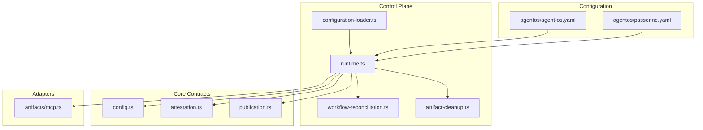
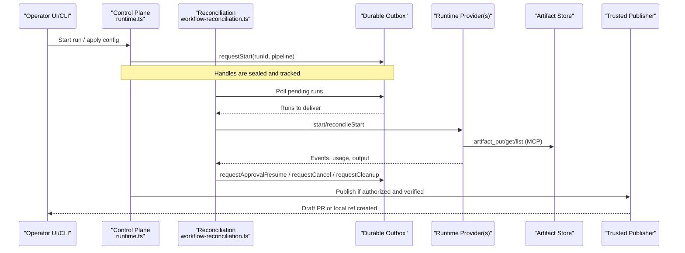
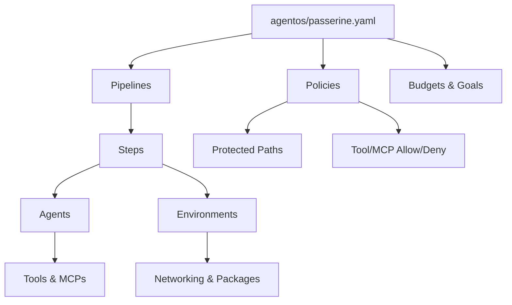
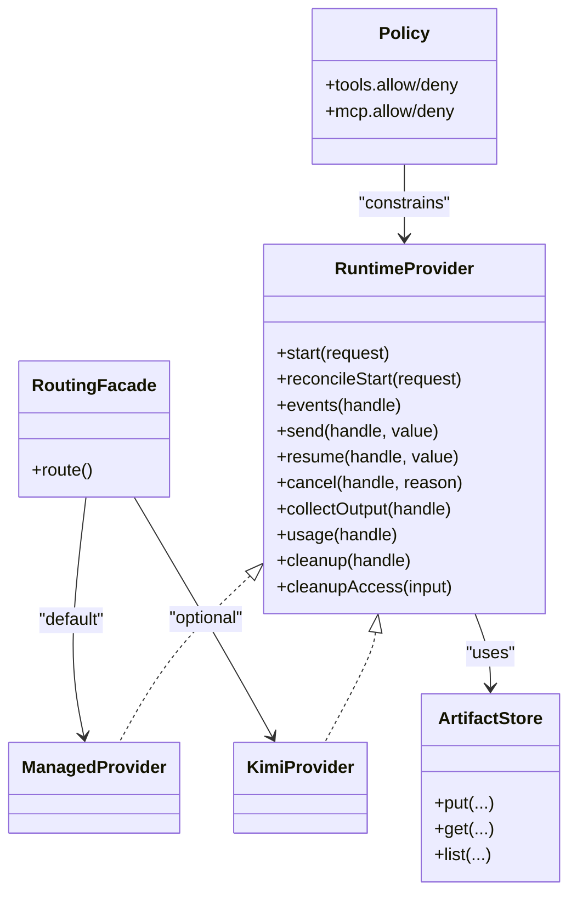
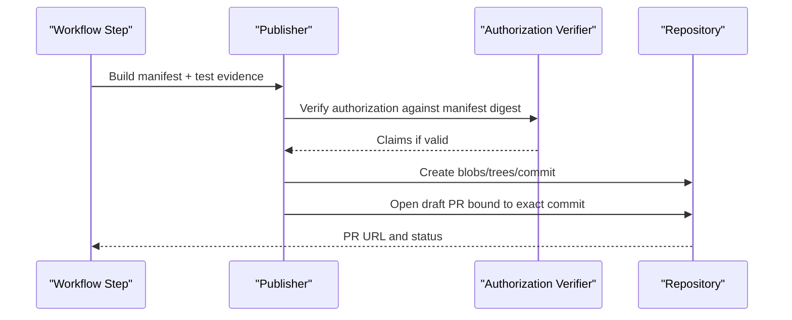
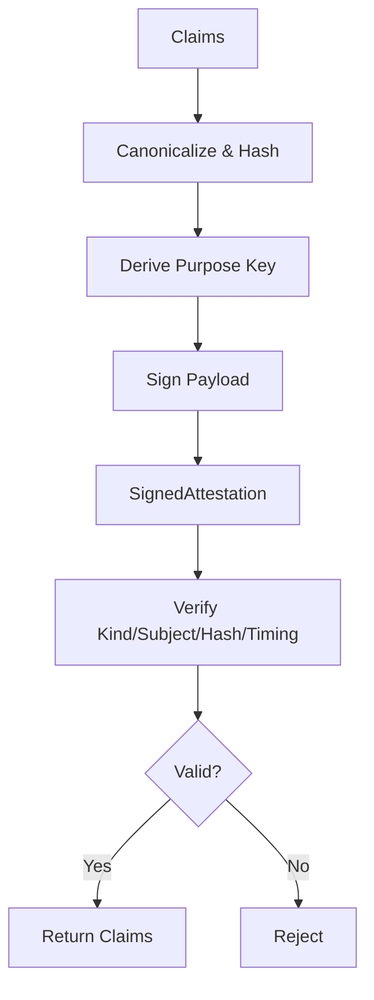
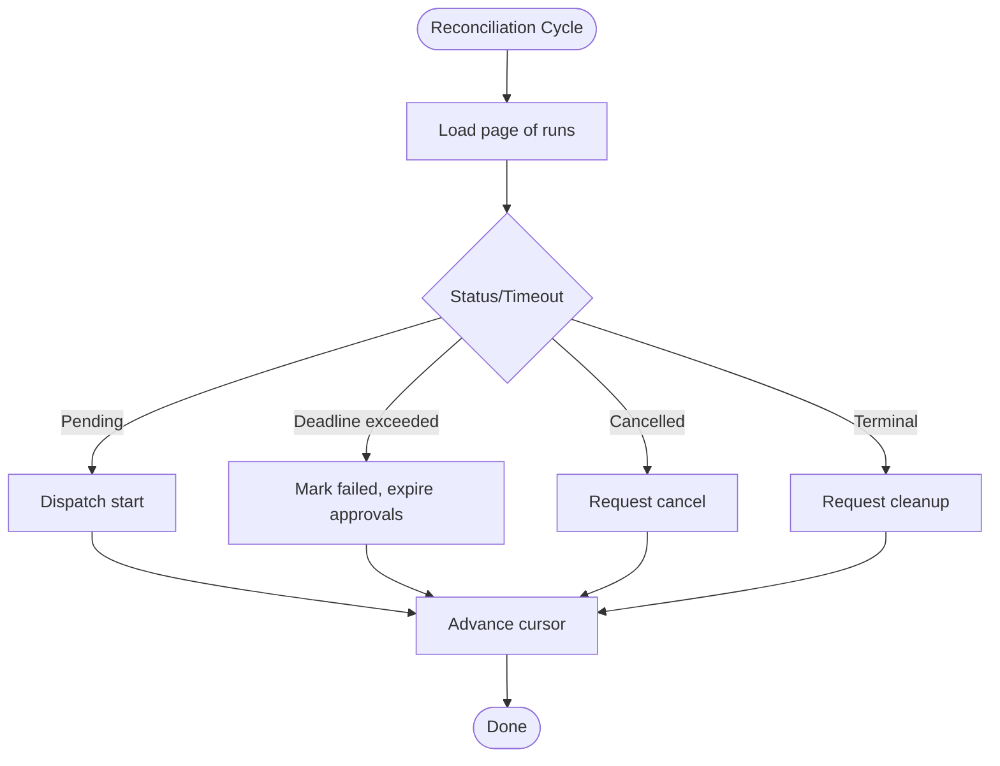
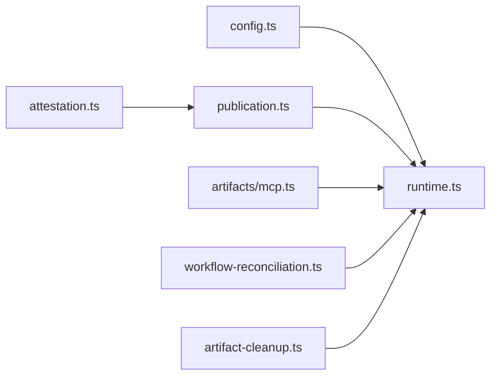

# Advanced Topics

<cite>
**Referenced Files in This Document**
- [README.md](file://README.md)
- [PRODUCT.md](file://PRODUCT.md)
- [agent-os.yaml](file://agentos/agent-os.yaml)
- [passerine.yaml](file://agentos/passerine.yaml)
- [threat-model.md](file://docs/architecture/threat-model.md)
- [trusted-github-publisher.md](file://docs/architecture/trusted-github-publisher.md)
- [runtime.ts](file://apps/control-plane/src/application/runtime.ts)
- [workflow-reconciliation.ts](file://apps/control-plane/src/application/workflow-reconciliation.ts)
- [artifact-cleanup.ts](file://apps/control-plane/src/application/artifact-cleanup.ts)
- [configuration-loader.ts](file://apps/control-plane/src/config/configuration-loader.ts)
- [attestation.ts](file://packages/core/src/attestation.ts)
- [config.ts](file://packages/core/src/config.ts)
- [publication.ts](file://packages/core/src/publication.ts)
- [mcp.ts](file://packages/adapters/src/artifacts/mcp.ts)
</cite>

## Table of Contents
1. Introduction
2. Project Structure
3. Core Components
4. Architecture Overview
5. Detailed Component Analysis
6. Dependency Analysis
7. Performance Considerations
8. Troubleshooting Guide
9. Conclusion
10. Appendices

## Introduction
This document covers advanced topics for Agent OS Passerine with a focus on extending workflows, plugins and extension points, publication and versioning, attestation for provenance and integrity, advanced configuration patterns, performance optimization, security hardening, threat model considerations, and guidance for adding custom tools, policies, and integrations. It is intended for operators and platform engineers who need to operate and extend the system safely in production.

Agent OS Passerine turns feature requests into reviewed artifacts and tested draft pull requests while keeping approvals, budgets, credentials, and publication authority outside model sessions. The system supports local experiments and full-stack deployments with durable workflows, artifact storage, and trusted publishing boundaries.

**Section sources**
- [README.md:1-67](file://README.md#L1-L67)
- [PRODUCT.md:1-46](file://PRODUCT.md#L1-L46)

## Project Structure
At a high level:
- agentos/*.yaml define project-scoped models, agents, environments, pipelines, policies, budgets, goals, and runtime routing.
- apps/control-plane implements orchestration, reconciliation, artifact cleanup, configuration loading, and integration with adapters.
- packages/core defines shared contracts, configuration schemas, attestation primitives, publication policy, and verification helpers.
- packages/adapters implement concrete providers (managed agents, GitHub, R2 artifacts, local Git, Trigger.dev outbox/checkpoints).

**Diagram sources**
- [passerine.yaml:1-252](file://agentos/passerine.yaml#L1-L252)
- [agent-os.yaml:1-61](file://agentos/agent-os.yaml#L1-L61)
- [runtime.ts:1-633](file://apps/control-plane/src/application/runtime.ts#L1-L633)
- [workflow-reconciliation.ts:1-507](file://apps/control-plane/src/application/workflow-reconciliation.ts#L1-L507)
- [artifact-cleanup.ts:1-118](file://apps/control-plane/src/application/artifact-cleanup.ts#L1-L118)
- [configuration-loader.ts:1-82](file://apps/control-plane/src/config/configuration-loader.ts#L1-L82)
- [config.ts:1-455](file://packages/core/src/config.ts#L1-L455)
- [attestation.ts:1-260](file://packages/core/src/attestation.ts#L1-L260)
- [publication.ts:1-541](file://packages/core/src/publication.ts#L1-L541)
- [mcp.ts:329-376](file://packages/adapters/src/artifacts/mcp.ts#L329-L376)

**Section sources**
- [passerine.yaml:1-252](file://agentos/passerine.yaml#L1-L252)
- [agent-os.yaml:1-61](file://agentos/agent-os.yaml#L1-L61)
- [runtime.ts:1-633](file://apps/control-plane/src/application/runtime.ts#L1-L633)

## Core Components
- Configuration and validation: Centralized schema-driven parsing, canonicalization, hashing, and semantic diffing for agent definitions, environments, pipelines, policies, budgets, goals, and runtime routing.
- Attestation: HMAC-based issuer/verifier for purpose-bound claims with key rotation support and constant-time signature comparison.
- Publication: Strict manifest and authorization envelopes, policy evaluation, path normalization, size limits, and deterministic digests for reproducible outputs.
- Orchestration: Durable workflow dispatch, reconciliation, cancellation, timeouts, approval resume, and cleanup.
- Artifacts and MCP: Capability-scoped artifact read/write/list via MCP tools with strict input schemas and retention classes.

Key responsibilities:
- Enforce least privilege for tools and MCPs per agent/environment.
- Bind runs to immutable source snapshots and policy digests.
- Gate publication to a trusted publisher that signs and validates authorizations before any repository write.
- Provide verifiable evidence through attested claims and canonical digests.

**Section sources**
- [config.ts:10-205](file://packages/core/src/config.ts#L10-L205)
- [attestation.ts:1-260](file://packages/core/src/attestation.ts#L1-L260)
- [publication.ts:15-232](file://packages/core/src/publication.ts#L15-L232)
- [mcp.ts:329-376](file://packages/adapters/src/artifacts/mcp.ts#L329-L376)

## Architecture Overview
The control plane composes runtime providers, artifact stores, and durable outboxes to execute workflows, reconcile state, enforce policies, and publish changes only through a trusted boundary.

**Diagram sources**
- [runtime.ts:387-571](file://apps/control-plane/src/application/runtime.ts#L387-L571)
- [workflow-reconciliation.ts:156-507](file://apps/control-plane/src/application/workflow-reconciliation.ts#L156-L507)
- [mcp.ts:329-376](file://packages/adapters/src/artifacts/mcp.ts#L329-L376)
- [trusted-github-publisher.md:1-37](file://docs/architecture/trusted-github-publisher.md#L1-L37)

## Detailed Component Analysis

### Custom Workflow Development
Workflows are defined declaratively in YAML under agentos/*.yaml. Each pipeline enumerates steps that bind an agent, optional environment overrides, dependencies, retries, and timeouts. Agents declare tools and MCPs; environments declare networking and package installs; policies constrain paths, binaries, symlinks, file sizes, and tool/MCP allow/deny lists.

- Define new agents by adding entries under agents with model, environment, tools, mcps, retries, timeoutMs, and prompt.
- Compose pipelines by listing steps with id, agent, optional environment, dependsOn, retries, timeoutMs.
- Constrain execution via policies.protectedPaths, policies.tools, policies.mcp, budgets, and goals.
- Use environments to isolate networking and capabilities per step.

**Diagram sources**
- [passerine.yaml:13-218](file://agentos/passerine.yaml#L13-L218)
- [agent-os.yaml:12-52](file://agentos/agent-os.yaml#L12-L52)
- [config.ts:54-148](file://packages/core/src/config.ts#L54-L148)

**Section sources**
- [passerine.yaml:13-218](file://agentos/passerine.yaml#L13-L218)
- [agent-os.yaml:12-52](file://agentos/agent-os.yaml#L12-L52)
- [config.ts:54-148](file://packages/core/src/config.ts#L54-L148)

### Plugin Architecture and Extension Points
Extension surfaces include:
- Tools: Declared per agent/environment; enforced by policies.allow/deny.
- MCPs: Declared per agent/environment; enforced by policies.mcp allow/deny.
- Runtime providers: Managed agents and Kimi can be composed and routed; handles are sealed and scoped.
- Artifact store: Content-addressed artifacts with retention classes and quotas.
- Verification registry hosts: Optional list of trusted registries for verification.

**Diagram sources**
- [runtime.ts:301-385](file://apps/control-plane/src/application/runtime.ts#L301-L385)
- [config.ts:54-98](file://packages/core/src/config.ts#L54-L98)
- [mcp.ts:329-376](file://packages/adapters/src/artifacts/mcp.ts#L329-L376)

**Section sources**
- [runtime.ts:301-385](file://apps/control-plane/src/application/runtime.ts#L301-L385)
- [config.ts:54-98](file://packages/core/src/config.ts#L54-L98)
- [mcp.ts:329-376](file://packages/adapters/src/artifacts/mcp.ts#L329-L376)

### Publication System and Versioning
Publication is strictly controlled:
- Manifest envelope includes project/run/step identifiers, repository binding, expected base commit SHA, digests for config, policy, source snapshot, test evidence, and a change set.
- Authorization is a signed attestation bound to the manifest digest and specific audience/purpose with short TTL.
- Policy evaluation enforces protected paths, binary/symlink restrictions, allowed modes, file count/size limits, and aggregate size.
- Trusted publisher creates immutable blobs/trees/commits, opens draft PRs, and never merges or deploys automatically.

**Diagram sources**
- [publication.ts:158-232](file://packages/core/src/publication.ts#L158-L232)
- [publication.ts:299-330](file://packages/core/src/publication.ts#L299-L330)
- [publication.ts:419-541](file://packages/core/src/publication.ts#L419-L541)
- [trusted-github-publisher.md:17-32](file://docs/architecture/trusted-github-publisher.md#L17-L32)

**Section sources**
- [publication.ts:158-232](file://packages/core/src/publication.ts#L158-L232)
- [publication.ts:299-330](file://packages/core/src/publication.ts#L299-L330)
- [publication.ts:419-541](file://packages/core/src/publication.ts#L419-L541)
- [trusted-github-publisher.md:17-32](file://docs/architecture/trusted-github-publisher.md#L17-L32)

### Attestation Mechanisms for Provenance and Integrity
Attestation provides purpose-bound, key-routable signatures over canonicalized claims:
- Issuer produces SignedAttestation with version, keyId, kind, subject, claimHash, issuedAt, and signature.
- Verifier checks kind, subject, claim hash, issuedAt normalization, and uses constant-time comparison for signatures.
- Purpose keys are derived per kind to isolate signing contexts.

Use cases:
- Binding publication authorization to a specific manifest digest and repository base.
- Attending test evidence and policy snapshots with verifiable hashes.
- Rotating keys while maintaining verification of outstanding authorizations.

**Diagram sources**
- [attestation.ts:56-138](file://packages/core/src/attestation.ts#L56-L138)
- [attestation.ts:140-247](file://packages/core/src/attestation.ts#L140-L247)

**Section sources**
- [attestation.ts:56-138](file://packages/core/src/attestation.ts#L56-L138)
- [attestation.ts:140-247](file://packages/core/src/attestation.ts#L140-L247)

### Advanced Configuration Patterns
Configuration is validated and hashed deterministically:
- Schema-enforced fields for models, agents, environments, pipelines, policies, budgets, goals, runtime routing, and verification settings.
- Canonical JSON and hashing enable stable digests for configs, policies, and manifests.
- Semantic diffing helps plan and review changes before application.

Patterns:
- Pin model profiles with cost parameters and cache pricing where applicable.
- Isolate sensitive steps in restricted environments with limited networking.
- Use policies to deny broad tool/MCP access and whitelist only required capabilities.
- Set budgets and concurrency to cap resource consumption.

**Section sources**
- [config.ts:39-148](file://packages/core/src/config.ts#L39-L148)
- [config.ts:165-205](file://packages/core/src/config.ts#L165-L205)
- [config.ts:355-369](file://packages/core/src/config.ts#L355-L369)
- [config.ts:423-448](file://packages/core/src/config.ts#L423-L448)
- [configuration-loader.ts:34-77](file://apps/control-plane/src/config/configuration-loader.ts#L34-L77)

### Performance Optimization Techniques
- Reuse runtime provider instances and lazy-build components to avoid redundant initialization.
- Page through runs and events with cursors to limit memory and DB load during reconciliation.
- Cap workflow timeouts and goal durations to prevent runaway jobs.
- Use artifact cleanup with leases and time budgets to reclaim space efficiently.
- Limit MCP tool payloads and list limits to reduce network and storage overhead.

**Diagram sources**
- [workflow-reconciliation.ts:156-507](file://apps/control-plane/src/application/workflow-reconciliation.ts#L156-L507)
- [artifact-cleanup.ts:35-118](file://apps/control-plane/src/application/artifact-cleanup.ts#L35-L118)

**Section sources**
- [workflow-reconciliation.ts:156-507](file://apps/control-plane/src/application/workflow-reconciliation.ts#L156-L507)
- [artifact-cleanup.ts:35-118](file://apps/control-plane/src/application/artifact-cleanup.ts#L35-L118)

### Security Hardening Practices
- Enforce least privilege for tools and MCPs per agent/environment.
- Validate all inputs at delivery boundaries; core policies remain authoritative.
- Scope provider credentials per tenant and load from secret managers.
- Use secure session handling, CSRF protection, origin-aware redirects, schema validation, output encoding, and rate limits.
- Protect repository paths, disallow binaries and symlinks unless explicitly permitted, and cap file sizes.
- Rotate attestation keys and publication secrets; validate effective tokens before use.

**Section sources**
- [threat-model.md:25-86](file://docs/architecture/threat-model.md#L25-L86)
- [config.ts:115-148](file://packages/core/src/config.ts#L115-L148)
- [publication.ts:299-330](file://packages/core/src/publication.ts#L299-L330)
- [trusted-github-publisher.md:5-16](file://docs/architecture/trusted-github-publisher.md#L5-L16)

### Threat Model and Production Considerations
The threat model identifies trust boundaries and required controls across browser/CLI to control plane, delivery to core, core to agents/models/tools, core to adapters/providers, runtime to persistence, runtime to repository/filesystem, and supply chain/deployment. It enumerates abuse cases such as cross-tenant actions, prompt injection, SSRF, replay, path traversal, secret exposure, resource exhaustion, and confused-deputy approvals.

Production guidance:
- Treat every external input as untrusted until validated.
- Ensure human approval surfaces exact action, target, and consequences.
- Keep CI minimal permissions and do not run untrusted PR code with production credentials.
- Encrypt data in transit and at rest; review migrations; test recovery.

**Section sources**
- [threat-model.md:1-102](file://docs/architecture/threat-model.md#L1-L102)

### Extending with Custom Tools, Policies, and Integrations
- Add tools by declaring them in agent/environment definitions and controlling access via policies.tools allow/deny.
- Introduce MCPs similarly via policies.mcp allow/deny and environment declarations.
- Extend runtime by composing additional providers behind the routing facade when needed; ensure handle prefixes and capability checks are respected.
- For integrations, implement adapter interfaces for repositories, artifact stores, and checkpoint stores; validate responses and constrain outbound destinations.

**Section sources**
- [config.ts:54-98](file://packages/core/src/config.ts#L54-L98)
- [runtime.ts:301-385](file://apps/control-plane/src/application/runtime.ts#L301-L385)

## Dependency Analysis
High-level dependency relationships between modules:

**Diagram sources**
- [config.ts:1-455](file://packages/core/src/config.ts#L1-L455)
- [attestation.ts:1-260](file://packages/core/src/attestation.ts#L1-L260)
- [publication.ts:1-541](file://packages/core/src/publication.ts#L1-L541)
- [mcp.ts:329-376](file://packages/adapters/src/artifacts/mcp.ts#L329-L376)
- [runtime.ts:1-633](file://apps/control-plane/src/application/runtime.ts#L1-L633)
- [workflow-reconciliation.ts:1-507](file://apps/control-plane/src/application/workflow-reconciliation.ts#L1-L507)
- [artifact-cleanup.ts:1-118](file://apps/control-plane/src/application/artifact-cleanup.ts#L1-L118)

**Section sources**
- [runtime.ts:1-633](file://apps/control-plane/src/application/runtime.ts#L1-L633)
- [workflow-reconciliation.ts:1-507](file://apps/control-plane/src/application/workflow-reconciliation.ts#L1-L507)
- [artifact-cleanup.ts:1-118](file://apps/control-plane/src/application/artifact-cleanup.ts#L1-L118)

## Performance Considerations
- Prefer deterministic IDs and canonical hashing to minimize rework and enable caching strategies.
- Batch operations where possible (e.g., artifact cleanup with concurrency limits).
- Use cursors and pagination to avoid scanning entire histories repeatedly.
- Tune budgets, concurrency, and timeouts to match workload characteristics.
- Avoid unnecessary network calls by leveraging local experiment workspaces when appropriate.

[No sources needed since this section provides general guidance]

## Troubleshooting Guide
Common issues and mitigations:
- Missing or invalid configuration: Validate YAML against schema; check canonical hash and counts.
- Workflow stalls or deadlines: Inspect reconciliation logs; confirm timeouts and approval states; trigger cleanup if necessary.
- Artifact bloat: Run retention cleanup; verify retention classes and quotas.
- Publication failures: Validate manifest digests, policy constraints, and authorization TTL; ensure repository base matches expected SHA.
- Attestation verification errors: Check kind, keyId, subject binding, claim hash, and timing; rotate keys if compromised.

Operational tips:
- Use setup routes to verify readiness and repository head resolution before starting runs.
- Seed demo data in development to validate flows without external dependencies.
- Monitor event streams for approval decisions and transition states.

**Section sources**
- [configuration-loader.ts:34-77](file://apps/control-plane/src/config/configuration-loader.ts#L34-L77)
- [workflow-reconciliation.ts:156-507](file://apps/control-plane/src/application/workflow-reconciliation.ts#L156-L507)
- [artifact-cleanup.ts:35-118](file://apps/control-plane/src/application/artifact-cleanup.ts#L35-L118)
- [publication.ts:419-541](file://packages/core/src/publication.ts#L419-L541)
- [attestation.ts:140-247](file://packages/core/src/attestation.ts#L140-L247)

## Conclusion
Agent OS Passerine provides a robust foundation for building secure, verifiable, and extensible automated workflows. By defining clear pipelines, enforcing strict policies, using attestation for provenance, and gating publication through a trusted publisher, operators can safely scale automation while retaining human oversight. Adhering to the threat model, applying hardening practices, and optimizing performance ensures reliable production operation.

[No sources needed since this section summarizes without analyzing specific files]

## Appendices

### Quick Reference: Configuration Keys and Limits
- Protected paths default to repository-sensitive locations; cannot be removed.
- Publication limits: max files, max file bytes, max total bytes, allowed modes, no binaries/symlinks.
- Budgets: workflow microdollars, daily microdollars, concurrency, admission reserve percent.
- Goals: max steps, max retries, timeout milliseconds.
- Runtime routing: provider and per-route mapping.

**Section sources**
- [config.ts:10-205](file://packages/core/src/config.ts#L10-L205)
- [publication.ts:15-71](file://packages/core/src/publication.ts#L15-L71)