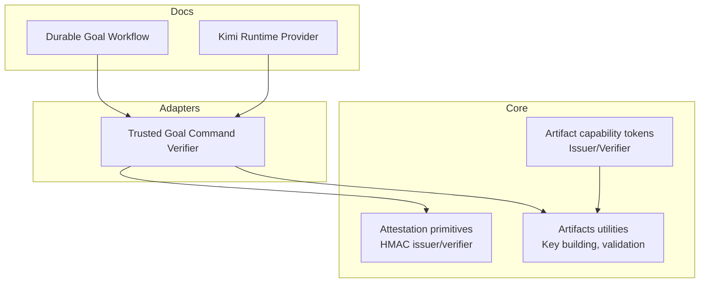
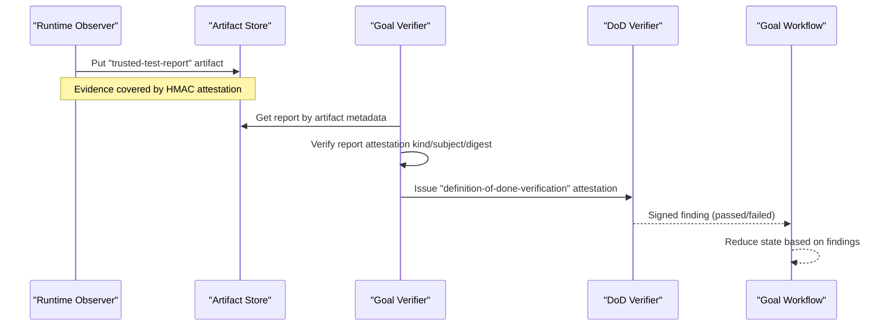
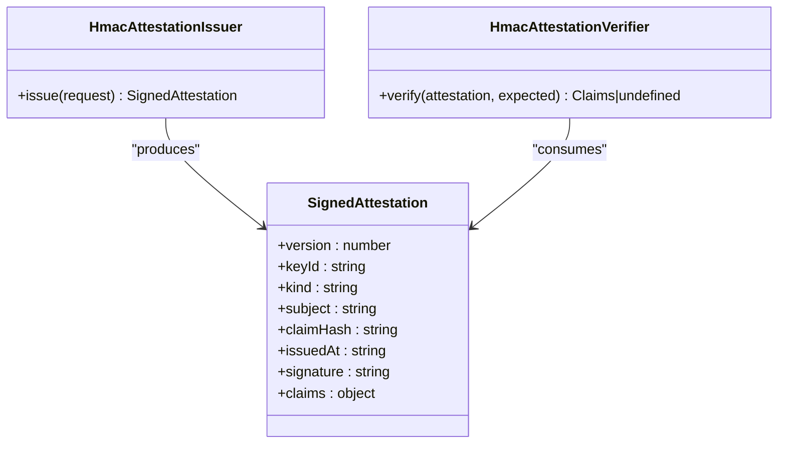
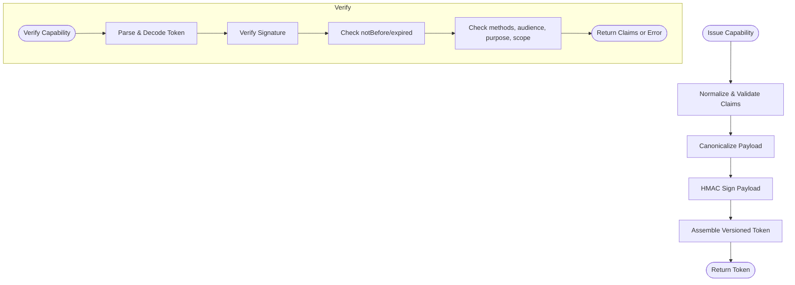
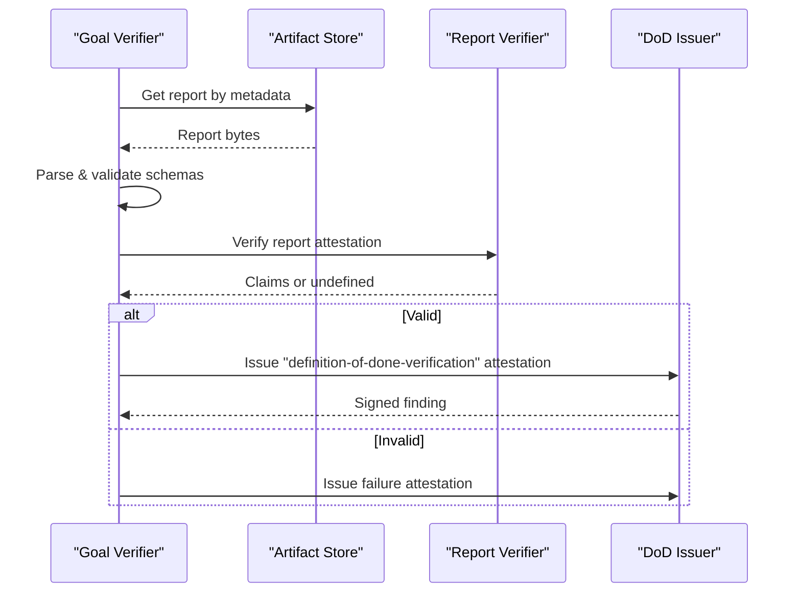
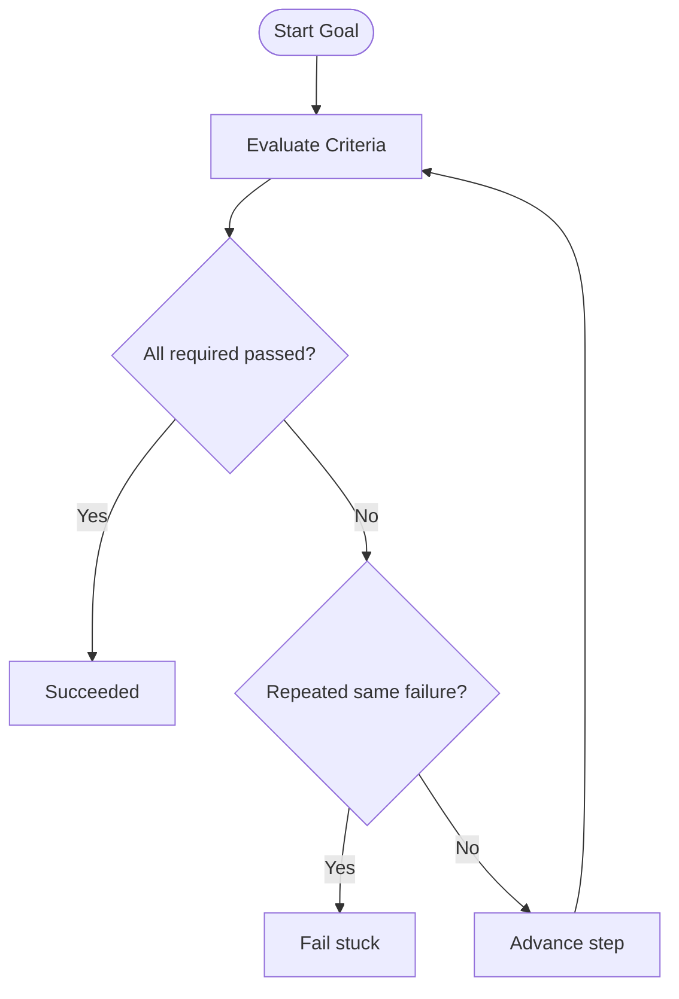
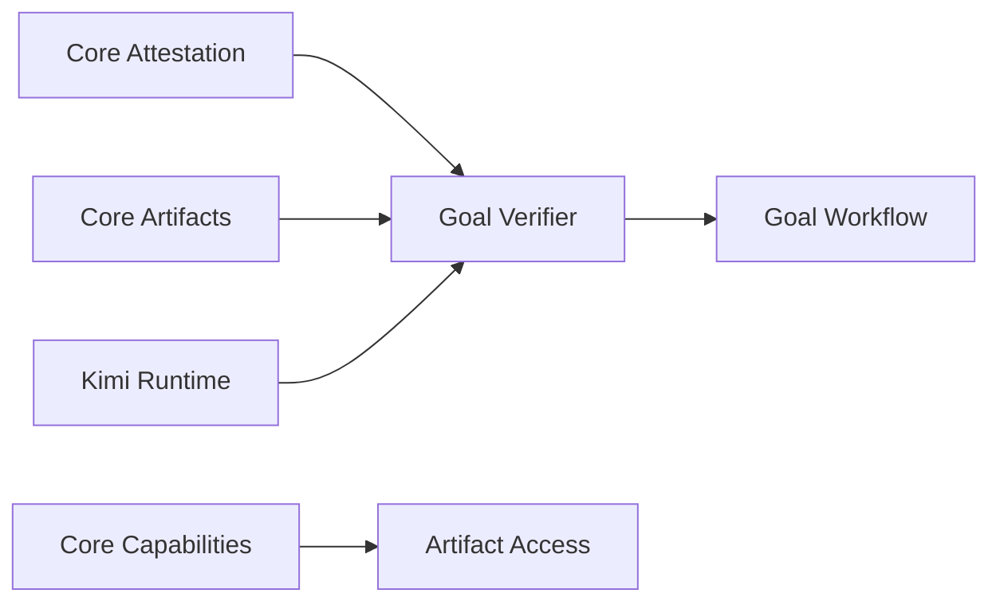

# Attestation System

<cite>
**Referenced Files in This Document**
- [attestation.ts](file://packages/core/src/attestation.ts)
- [attestation.test.ts](file://packages/core/src/attestation.test.ts)
- [artifact-capability.ts](file://packages/core/src/artifact-capability.ts)
- [artifacts.ts](file://packages/core/src/artifacts.ts)
- [goal-verifier.ts](file://packages/adapters/src/trigger/goal-verifier.ts)
- [durable-goal-workflow.md](file://docs/architecture/durable-goal-workflow.md)
- [kimi-runtime.md](file://docs/architecture/kimi-runtime.md)
- [dod.ts](file://packages/core/src/dod.ts)
</cite>

## Table of Contents
1. [Introduction](#introduction)
2. [Project Structure](#project-structure)
3. [Core Components](#core-components)
4. [Architecture Overview](#architecture-overview)
5. [Detailed Component Analysis](#detailed-component-analysis)
6. [Dependency Analysis](#dependency-analysis)
7. [Performance Considerations](#performance-considerations)
8. [Troubleshooting Guide](#troubleshooting-guide)
9. [Conclusion](#conclusion)
10. [Appendices](#appendices)

## Introduction
This document explains the attestation system in Agent OS Passerine, focusing on provenance tracking, cryptographic signing of outputs, and verification processes that ensure integrity and authenticity of generated artifacts and workflow results. It covers the attestation data model, signature formats, verification algorithms, examples for creating and verifying attestations, the relationship between attestation and artifact capabilities, security implications, trust models, and best practices for implementing custom attestation providers.

## Project Structure
The attestation system is implemented primarily in the core package with adapters integrating it into workflows and verifiers:
- Core attestation primitives (issuer, verifier, purpose-bound keys, canonicalization, HMAC signatures) are defined in the core package.
- Artifact capability tokens provide fine-grained authorization for artifact operations and use a separate token format.
- Adapters implement domain-specific verifiers that consume signed evidence and produce domain-separated attestations.
- Architecture documentation describes how attestation integrates with durable goal workflows and runtime providers.

**Diagram sources**
- [attestation.ts:140-166](file://packages/core/src/attestation.ts#L140-L166)
- [artifact-capability.ts:220-237](file://packages/core/src/artifact-capability.ts#L220-L237)
- [artifacts.ts:201-216](file://packages/core/src/artifacts.ts#L201-L216)
- [goal-verifier.ts:175-194](file://packages/adapters/src/trigger/goal-verifier.ts#L175-L194)
- [durable-goal-workflow.md:48-63](file://docs/architecture/durable-goal-workflow.md#L48-L63)
- [kimi-runtime.md:106-129](file://docs/architecture/kimi-runtime.md#L106-L129)

**Section sources**
- [attestation.ts:1-260](file://packages/core/src/attestation.ts#L1-L260)
- [artifact-capability.ts:1-352](file://packages/core/src/artifact-capability.ts#L1-L352)
- [artifacts.ts:1-400](file://packages/core/src/artifacts.ts#L1-L400)
- [goal-verifier.ts:1-327](file://packages/adapters/src/trigger/goal-verifier.ts#L1-L327)
- [durable-goal-workflow.md:1-138](file://docs/architecture/durable-goal-workflow.md#L1-L138)
- [kimi-runtime.md:1-329](file://docs/architecture/kimi-runtime.md#L1-L329)

## Core Components
- HMAC-based attestation authority: purpose-bound keys derived from a master secret using a kind label to isolate different attestation types. Claims are canonicalized and hashed; signatures are computed over a canonical payload including version, keyId, kind, subject, claimHash, and issuedAt.
- Artifact capability tokens: a separate token format for authorizing artifact operations with strict claims, lifetime bounds, method scoping, and audience/purpose binding. Tokens are base64url-encoded payloads signed with HMAC and prefixed by a versioned namespace.
- Artifact utilities: deterministic key construction, metadata validation, retention policies, and media type normalization to ensure artifacts are immutable and verifiable by digest.

Key responsibilities:
- Attestation: issue and verify signed statements about outcomes or observations with strong separation by kind.
- Capability: authorize limited artifact operations with time-bounded, scoped tokens.
- Artifacts: enforce immutability via content-addressed keys and validate metadata and sizes.

**Section sources**
- [attestation.ts:140-166](file://packages/core/src/attestation.ts#L140-L166)
- [attestation.ts:184-247](file://packages/core/src/attestation.ts#L184-L247)
- [artifact-capability.ts:220-237](file://packages/core/src/artifact-capability.ts#L220-L237)
- [artifact-capability.ts:283-350](file://packages/core/src/artifact-capability.ts#L283-L350)
- [artifacts.ts:201-216](file://packages/core/src/artifacts.ts#L201-L216)
- [artifacts.ts:299-345](file://packages/core/src/artifacts.ts#L299-L345)

## Architecture Overview
The attestation system underpins trusted workflows by chaining signed evidence and verdicts:
- Trusted test reports are produced by runtime observers and covered by an HMAC attestation bound to the canonical evidence digest.
- The goal verifier consumes these reports, validates bindings, and issues a domain-separated definition-of-done verification attestation consumed by the core workflow logic.
- Artifact capabilities gate access to artifact stores with strict scopes and lifetimes, ensuring only authorized steps can read/write artifacts within their run scope.

**Diagram sources**
- [goal-verifier.ts:175-194](file://packages/adapters/src/trigger/goal-verifier.ts#L175-L194)
- [goal-verifier.ts:200-323](file://packages/adapters/src/trigger/goal-verifier.ts#L200-L323)
- [durable-goal-workflow.md:48-63](file://docs/architecture/durable-goal-workflow.md#L48-L63)

**Section sources**
- [durable-goal-workflow.md:48-63](file://docs/architecture/durable-goal-workflow.md#L48-L63)
- [kimi-runtime.md:106-129](file://docs/architecture/kimi-runtime.md#L106-L129)

## Detailed Component Analysis

### HMAC Attestation Authority
Purpose: Provide a reusable issuer/verifier pair for any attestation kind with strong isolation via kind-derived keys and canonical claim hashing.

- Issuer:
  - Normalizes inputs (subject, issuedAt).
  - Canonicalizes and hashes claims.
  - Signs a canonical payload containing version, keyId, kind, subject, claimHash, issuedAt.
- Verifier:
  - Validates structure, kind, subject binding, issuedAt normalization, claim hash consistency.
  - Recomputes expected signature and compares in constant time.
  - Returns claims if valid; otherwise undefined.

**Diagram sources**
- [attestation.ts:140-166](file://packages/core/src/attestation.ts#L140-L166)
- [attestation.ts:184-247](file://packages/core/src/attestation.ts#L184-L247)
- [attestation.ts:23-30](file://packages/core/src/attestation.ts#L23-L30)

**Section sources**
- [attestation.ts:52-138](file://packages/core/src/attestation.ts#L52-L138)
- [attestation.ts:140-166](file://packages/core/src/attestation.ts#L140-L166)
- [attestation.ts:184-247](file://packages/core/src/attestation.ts#L184-L247)
- [attestation.test.ts:15-151](file://packages/core/src/attestation.test.ts#L15-L151)

### Artifact Capability Tokens
Purpose: Authorize artifact operations with strict scoping, lifetime, and method constraints.

- Issuer:
  - Normalizes and validates claims (methods, limits, timestamps, identifiers).
  - Encodes a canonical payload and signs it with HMAC.
  - Produces a versioned token string with keyId and signature.
- Verifier:
  - Parses and validates token structure and signature.
  - Enforces notBefore/expiry windows and maximum future issuance.
  - Checks method, audience, purpose, project/run/step scoping, prefix matching, and byte limits.

**Diagram sources**
- [artifact-capability.ts:151-212](file://packages/core/src/artifact-capability.ts#L151-L212)
- [artifact-capability.ts:220-237](file://packages/core/src/artifact-capability.ts#L220-L237)
- [artifact-capability.ts:283-350](file://packages/core/src/artifact-capability.ts#L283-L350)

**Section sources**
- [artifact-capability.ts:1-352](file://packages/core/src/artifact-capability.ts#L1-L352)

### Trusted Goal Command Verifier
Purpose: Consume signed trusted test reports, validate bindings, and issue definition-of-done verification attestations consumed by the goal workflow.

- Loads report artifact by metadata and asserts artifact binding (digest, size, media type).
- Parses report JSON and evidence schema; recomputes evidence digest.
- Verifies report attestation kind, subject, run binding, and evidence digest.
- Issues a domain-separated attestation for each criterion result.

**Diagram sources**
- [goal-verifier.ts:175-194](file://packages/adapters/src/trigger/goal-verifier.ts#L175-L194)
- [goal-verifier.ts:200-323](file://packages/adapters/src/trigger/goal-verifier.ts#L200-L323)

**Section sources**
- [goal-verifier.ts:1-327](file://packages/adapters/src/trigger/goal-verifier.ts#L1-L327)
- [durable-goal-workflow.md:48-63](file://docs/architecture/durable-goal-workflow.md#L48-L63)

### Integration with Goal Workflow and DoD
- The goal workflow reduces state based on signed findings from verifiers.
- Each criterion must pass; repeated failures produce stuck detection via fingerprints.
- Provenance digests bind runs to immutable configuration snapshots and criteria.

**Diagram sources**
- [durable-goal-workflow.md:10-25](file://docs/architecture/durable-goal-workflow.md#L10-L25)
- [dod.ts:53-82](file://packages/core/src/dod.ts#L53-L82)

**Section sources**
- [durable-goal-workflow.md:10-25](file://docs/architecture/durable-goal-workflow.md#L10-L25)
- [dod.ts:53-82](file://packages/core/src/dod.ts#L53-L82)

### Relationship Between Attestation and Artifact Capabilities
- Attestations certify outcomes and observations (e.g., test report validity, DoD verdicts).
- Artifact capabilities authorize operations against artifact stores with strict scopes and limits.
- Together they form a chain: capabilities allow reading/writing artifacts; attestations certify the integrity and authenticity of those artifacts and the processes that produced them.

**Section sources**
- [artifact-capability.ts:220-237](file://packages/core/src/artifact-capability.ts#L220-L237)
- [artifact-capability.ts:283-350](file://packages/core/src/artifact-capability.ts#L283-L350)
- [goal-verifier.ts:200-323](file://packages/adapters/src/trigger/goal-verifier.ts#L200-L323)

## Dependency Analysis
- The goal verifier depends on core attestation primitives and artifact utilities to validate and sign evidence chains.
- The Kimi runtime preserves the same trust boundary by executing trusted command observation and producing compatible signed evidence, enabling unchanged verification downstream.
- Artifact capabilities depend on core artifact utilities for key construction and validation.

**Diagram sources**
- [attestation.ts:140-166](file://packages/core/src/attestation.ts#L140-L166)
- [artifacts.ts:201-216](file://packages/core/src/artifacts.ts#L201-L216)
- [goal-verifier.ts:175-194](file://packages/adapters/src/trigger/goal-verifier.ts#L175-L194)
- [kimi-runtime.md:106-129](file://docs/architecture/kimi-runtime.md#L106-L129)

**Section sources**
- [attestation.ts:140-166](file://packages/core/src/attestation.ts#L140-L166)
- [artifacts.ts:201-216](file://packages/core/src/artifacts.ts#L201-L216)
- [goal-verifier.ts:175-194](file://packages/adapters/src/trigger/goal-verifier.ts#L175-L194)
- [kimi-runtime.md:106-129](file://docs/architecture/kimi-runtime.md#L106-L129)

## Performance Considerations
- Canonicalization and hashing of claims are O(n) in claim size; keep claims minimal and structured.
- HMAC signing and verification are efficient; ensure large attestations are avoided where possible.
- Artifact capability verification includes multiple validations; batch operations should minimize per-call overhead by reusing verified claims within short-lived scopes.
- Use deterministic key construction and metadata validation to avoid redundant computations during artifact lifecycle.

[No sources needed since this section provides general guidance]

## Troubleshooting Guide
Common issues and diagnostics:
- Wrong authority or tampered attestation: verifier returns undefined when kind mismatch, subject mismatch, claim hash mismatch, or signature mismatch occurs.
- Insufficient secret material: issuers/verifiers reject secrets shorter than the minimum length.
- Cross-purpose token usage: attestations bound to one kind cannot be used by verifiers configured for another kind.
- Capability errors: invalid tokens, expired/not yet active tokens, method or scope mismatches raise explicit errors.

Recommended checks:
- Ensure kind labels match between issuer and verifier.
- Validate subject binding includes run/criterion/evidence identifiers.
- Confirm artifact metadata matches stored bytes and digest.
- Verify capability claims include correct audience, purpose, methods, and scopes.

**Section sources**
- [attestation.test.ts:39-151](file://packages/core/src/attestation.test.ts#L39-L151)
- [artifact-capability.ts:283-350](file://packages/core/src/artifact-capability.ts#L283-L350)
- [goal-verifier.ts:200-323](file://packages/adapters/src/trigger/goal-verifier.ts#L200-L323)

## Conclusion
The attestation system in Agent OS Passerine provides a robust foundation for provenance tracking and cryptographic assurance across workflows. By combining purpose-bound HMAC attestations with strict artifact capability tokens and deterministic artifact keys, the system ensures that generated artifacts and workflow results are authentic, immutable, and verifiable. The design isolates trust boundaries, enforces tight scoping and lifetimes, and supports integration across different runtime providers while preserving the same verification semantics.

[No sources needed since this section summarizes without analyzing specific files]

## Appendices

### Examples: Creating and Verifying Attestations
- Create a trusted test report attestation:
  - Produce evidence bytes and compute canonical digest.
  - Issue an attestation with kind "trusted-test-report", subject binding child run, verification step, and evidence digest.
  - Persist the report artifact with validated metadata and digest.
- Verify a trusted test report:
  - Load the report artifact by metadata and assert binding.
  - Verify the attestation kind, subject, run binding, and evidence digest.
  - Issue a definition-of-done verification attestation for the criterion result.
- Verify a definition-of-done attestation:
  - Configure verifier with appropriate kind and keys.
  - Validate subject binding includes verifier id, criterion id, and evidence id.
  - Confirm claims indicate passed/failed status and source.

**Section sources**
- [goal-verifier.ts:175-194](file://packages/adapters/src/trigger/goal-verifier.ts#L175-L194)
- [goal-verifier.ts:200-323](file://packages/adapters/src/trigger/goal-verifier.ts#L200-L323)
- [attestation.ts:140-166](file://packages/core/src/attestation.ts#L140-L166)
- [attestation.ts:184-247](file://packages/core/src/attestation.ts#L184-L247)

### Security Implications and Trust Models
- Purpose separation: kind-derived keys prevent cross-purpose misuse of attestations.
- Binding strength: subjects encode run, step, criterion, and evidence identifiers to prevent replay and misattribution.
- Immutable artifacts: content-addressed keys and digest validation ensure artifacts cannot be altered without detection.
- Capability scoping: tokens restrict artifact operations to precise methods, audiences, purposes, and scopes with strict lifetimes.
- Runtime trust: trusted command observation executes commands in controlled sandboxes without leaking secrets, preserving the evidence chain across providers.

**Section sources**
- [attestation.ts:126-138](file://packages/core/src/attestation.ts#L126-L138)
- [artifact-capability.ts:151-212](file://packages/core/src/artifact-capability.ts#L151-L212)
- [artifacts.ts:299-345](file://packages/core/src/artifacts.ts#L299-L345)
- [kimi-runtime.md:106-129](file://docs/architecture/kimi-runtime.md#L106-L129)

### Best Practices for Custom Attestation Providers
- Use distinct kinds for each attestation purpose to maintain isolation.
- Bind subjects tightly to run, step, criterion, and evidence identifiers.
- Canonicalize and hash claims consistently to ensure reproducible signatures.
- Enforce minimum secret lengths and rotate keys securely.
- Validate all inputs and reject malformed or out-of-scope attestations early.
- Integrate with artifact capabilities to limit exposure of sensitive operations.
- Preserve compatibility with existing verifiers by adhering to established schemas and binding conventions.

**Section sources**
- [attestation.ts:140-166](file://packages/core/src/attestation.ts#L140-L166)
- [attestation.ts:184-247](file://packages/core/src/attestation.ts#L184-L247)
- [artifact-capability.ts:220-237](file://packages/core/src/artifact-capability.ts#L220-L237)
- [goal-verifier.ts:200-323](file://packages/adapters/src/trigger/goal-verifier.ts#L200-L323)