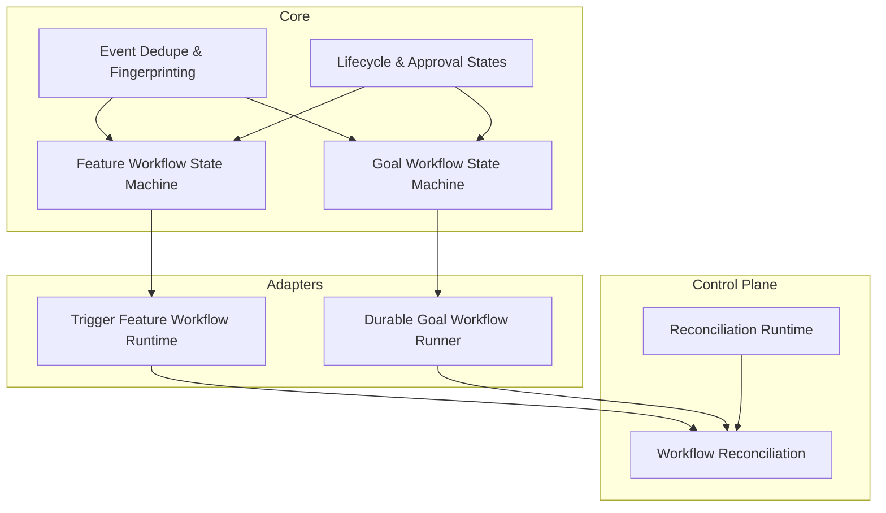
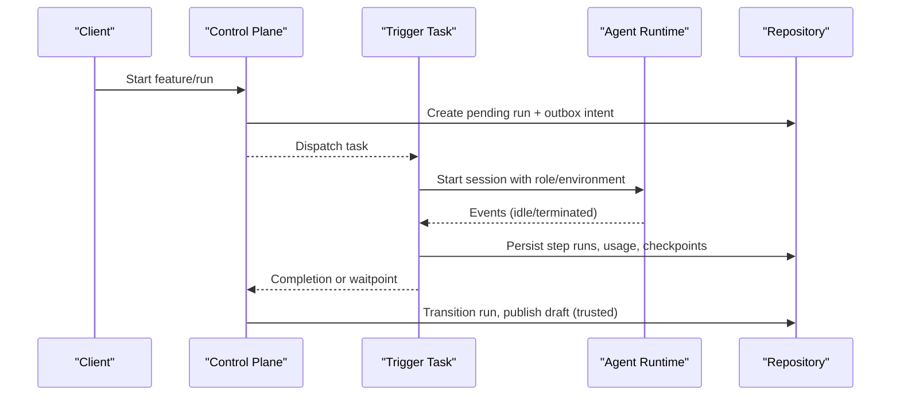
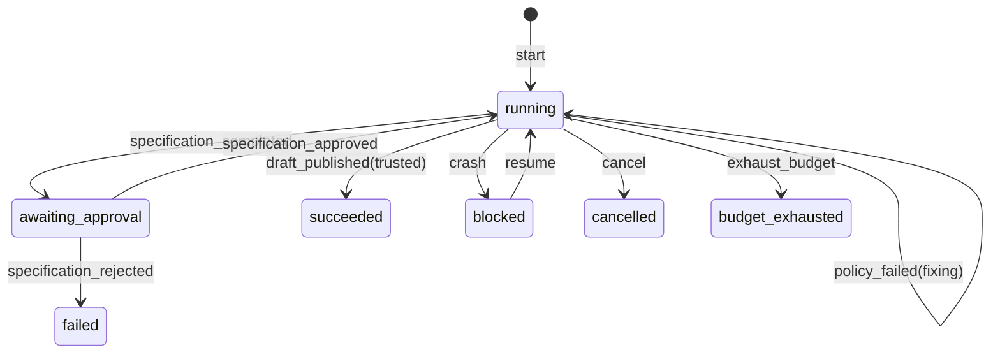
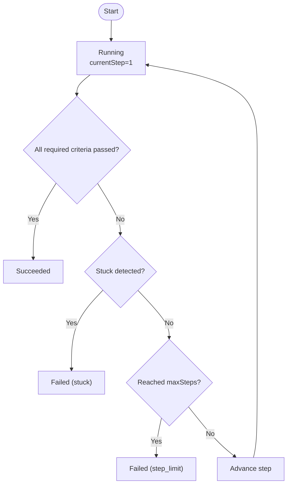
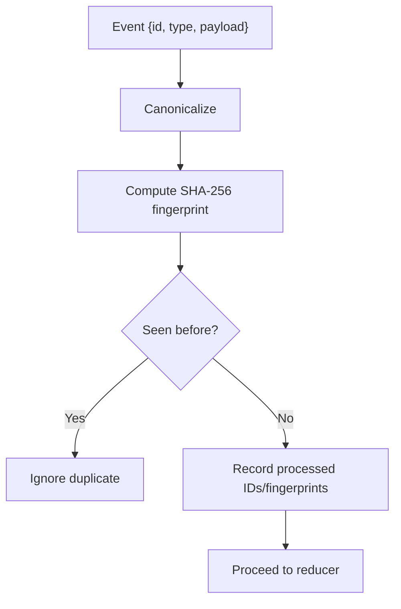
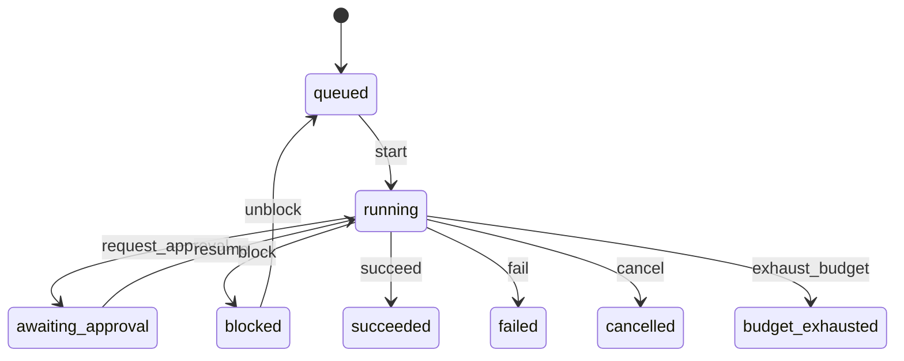
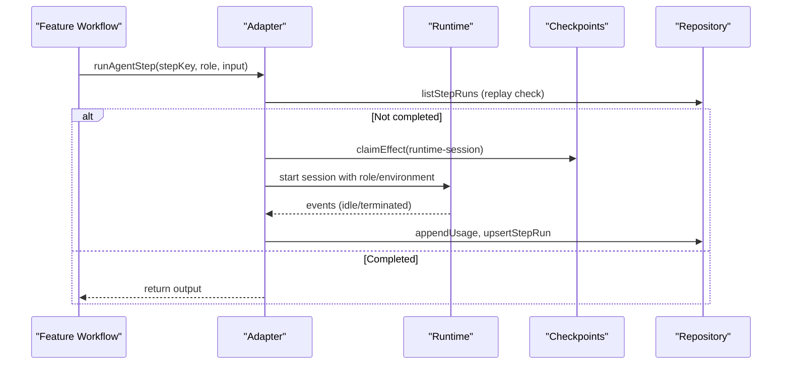
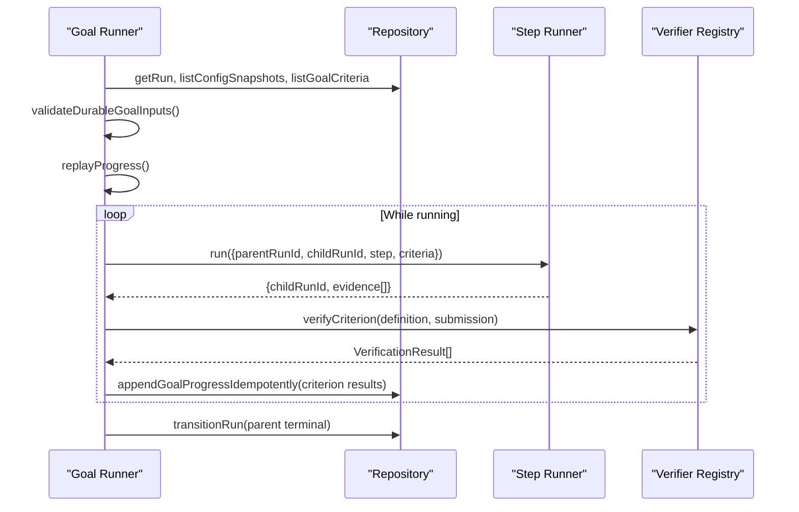
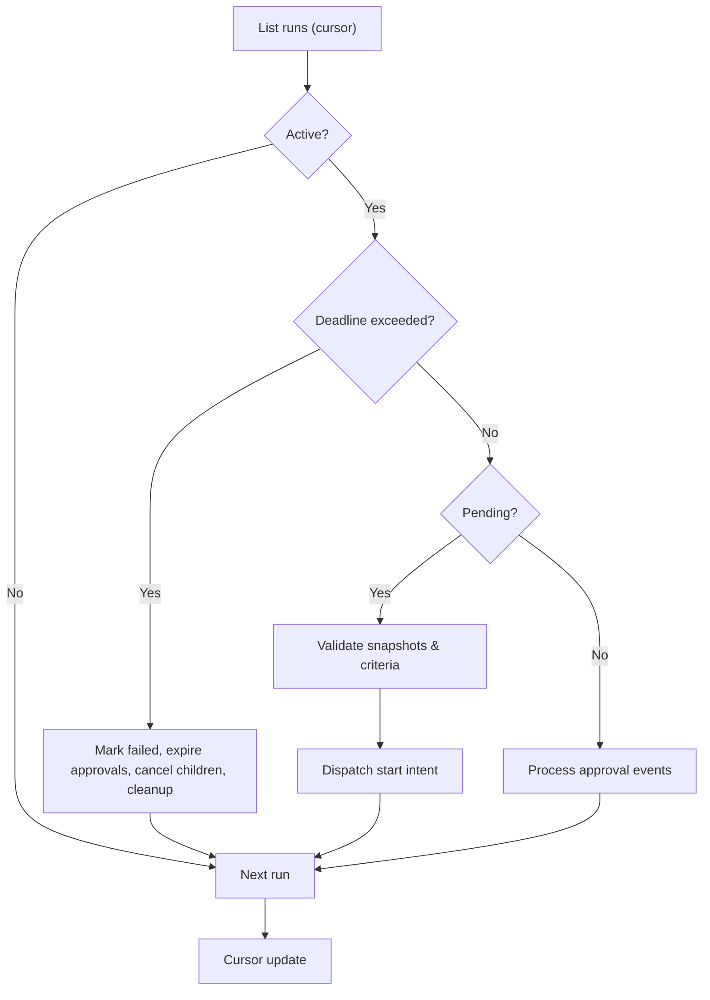
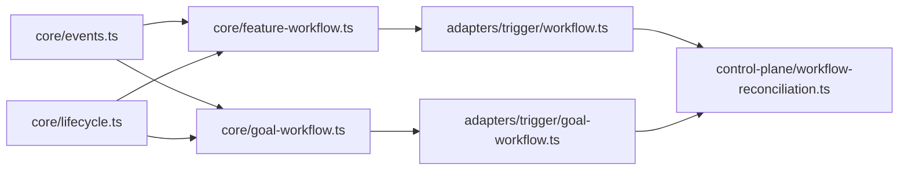

# Custom Workflows

<cite>
**Referenced Files in This Document**
- [durable-feature-workflow.md](file://docs/architecture/durable-feature-workflow.md)
- [durable-goal-workflow.md](file://docs/architecture/durable-goal-workflow.md)
- [feature-workflow.ts](file://packages/core/src/feature-workflow.ts)
- [goal-workflow.ts](file://packages/core/src/goal-workflow.ts)
- [events.ts](file://packages/core/src/events.ts)
- [lifecycle.ts](file://packages/core/src/lifecycle.ts)
- [workflow.ts](file://packages/adapters/src/trigger/workflow.ts)
- [goal-workflow.ts](file://packages/adapters/src/trigger/goal-workflow.ts)
- [workflow-reconciliation.ts](file://apps/control-plane/src/application/workflow-reconciliation.ts)
- [workflow-reconciliation-runtime.ts](file://apps/control-plane/src/application/workflow-reconciliation-runtime.ts)
</cite>

## Table of Contents
1. Introduction
2. Project Structure
3. Core Components
4. Architecture Overview
5. Detailed Component Analysis
6. Dependency Analysis
7. Performance Considerations
8. Troubleshooting Guide
9. Conclusion

## Introduction
This document explains how to develop custom workflows in Agent OS Passerine with a focus on the workflow engine architecture, state machine patterns, and event-driven design. It covers extending both the feature workflow and goal workflow systems, composing workflows, handling lifecycle events, implementing error handling and retries, testing and debugging workflows, integrating with core system components, and optimizing performance.

The system is built around durable, replayable state machines that persist events and checkpoints, coordinate external execution via Trigger tasks, and enforce strict provenance, budgets, and safety boundaries.

## Project Structure
At a high level:
- Core state machines and event utilities live in packages/core.
- Durable adapters for Trigger-based execution and goal orchestration live in packages/adapters.
- Control-plane reconciliation and runtime wiring live in apps/control-plane.
- Architectural documentation describes end-to-end flows for feature and goal workflows.

**Diagram sources**
- [feature-workflow.ts:1-320](file://packages/core/src/feature-workflow.ts#L1-L320)
- [goal-workflow.ts:1-243](file://packages/core/src/goal-workflow.ts#L1-L243)
- [events.ts:1-86](file://packages/core/src/events.ts#L1-L86)
- [lifecycle.ts:1-218](file://packages/core/src/lifecycle.ts#L1-L218)
- [workflow.ts:1-800](file://packages/adapters/src/trigger/workflow.ts#L1-L800)
- [goal-workflow.ts:1-800](file://packages/adapters/src/trigger/goal-workflow.ts#L1-L800)
- [workflow-reconciliation.ts:1-507](file://apps/control-plane/src/application/workflow-reconciliation.ts#L1-L507)
- [workflow-reconciliation-runtime.ts:1-29](file://apps/control-plane/src/application/workflow-reconciliation-runtime.ts#L1-L29)

**Section sources**
- [durable-feature-workflow.md:1-191](file://docs/architecture/durable-feature-workflow.md#L1-L191)
- [durable-goal-workflow.md:1-138](file://docs/architecture/durable-goal-workflow.md#L1-L138)

## Core Components
- Feature workflow state machine: models phases such as specification, planning, implementation, testing, review, fixing, policy validation, and draft publication. It enforces phase transitions, retry limits, cancellation, crash recovery, budget exhaustion, and trusted publication attestation.
- Goal workflow state machine: a bounded reducer that advances through up to three steps, evaluates command criteria, detects stuck conditions, and terminates with success, step limit, stuck, crashed, or cancelled outcomes.
- Event deduplication and fingerprinting: canonicalizes events, computes fingerprints, and prevents duplicate or conflicting replays within a bounded window.
- Lifecycle and approval states: generic run/step lifecycle transitions and approval state machine with approve/reject/expiry semantics.
- Trigger adapter (feature): orchestrates agent sessions, artifacts, budgets, approvals, waitpoints, and publication with durable effects and idempotency.
- Durable goal runner: validates inputs, replays progress, coordinates child feature runs, verifies criterion evidence, and persists results.
- Control-plane reconciliation: scans runs, enforces deadlines, dispatches starts, cancels children, and resumes on approvals.

**Section sources**
- [feature-workflow.ts:1-320](file://packages/core/src/feature-workflow.ts#L1-L320)
- [goal-workflow.ts:1-243](file://packages/core/src/goal-workflow.ts#L1-L243)
- [events.ts:1-86](file://packages/core/src/events.ts#L1-L86)
- [lifecycle.ts:1-218](file://packages/core/src/lifecycle.ts#L1-L218)
- [workflow.ts:1-800](file://packages/adapters/src/trigger/workflow.ts#L1-L800)
- [goal-workflow.ts:1-800](file://packages/adapters/src/trigger/goal-workflow.ts#L1-L800)
- [workflow-reconciliation.ts:1-507](file://apps/control-plane/src/application/workflow-reconciliation.ts#L1-L507)

## Architecture Overview
The system uses an event-sourced, checkpointed architecture:
- Each workflow maintains immutable state derived from a sequence of events.
- External execution (agent sessions, publications, approvals) is modeled as durable effects with leases and idempotency keys.
- The control plane reconciles pending work, enforces deadlines, and ensures eventual consistency across components.

**Diagram sources**
- [workflow-reconciliation.ts:156-507](file://apps/control-plane/src/application/workflow-reconciliation.ts#L156-L507)
- [workflow.ts:489-800](file://packages/adapters/src/trigger/workflow.ts#L489-L800)
- [durable-feature-workflow.md:8-45](file://docs/architecture/durable-feature-workflow.md#L8-L45)

## Detailed Component Analysis

### Feature Workflow Engine
- Phase model: specification → specification_approval → planning → implementation → testing → review → fixing → policy_validation → draft_publication.
- Status model: running, awaiting_approval, blocked, succeeded, failed, cancelled, budget_exhausted.
- Retry and crash handling: crashes move to blocked; resume returns to prior status; retry counts enforced against maxRetries.
- Publication binding: requires a trusted publisher attestation bound to workflow context.

**Diagram sources**
- [feature-workflow.ts:8-80](file://packages/core/src/feature-workflow.ts#L8-L80)
- [feature-workflow.ts:160-305](file://packages/core/src/feature-workflow.ts#L160-L305)

**Section sources**
- [feature-workflow.ts:1-320](file://packages/core/src/feature-workflow.ts#L1-L320)

### Goal Workflow Engine
- Bounded reducer: accepts start, step_evaluated, cancel, crash events; enforces exactly one result per criterion per step.
- Termination rules: succeeds when all required criteria pass; fails if stuck (same failure fingerprint repeated), step_limit reached, or crashed.
- Deterministic child runs: each step spawns a deterministic child feature run ID for replay safety.

**Diagram sources**
- [goal-workflow.ts:12-41](file://packages/core/src/goal-workflow.ts#L12-L41)
- [goal-workflow.ts:163-235](file://packages/core/src/goal-workflow.ts#L163-L235)

**Section sources**
- [goal-workflow.ts:1-243](file://packages/core/src/goal-workflow.ts#L1-L243)

### Event System and Deduplication
- Canonicalization: sorts object keys, normalizes dates and numbers.
- Fingerprinting: SHA-256 over canonicalized event payload.
- Dedupe window: retains processed IDs and fingerprints to detect duplicates and content reuse conflicts.

**Diagram sources**
- [events.ts:18-86](file://packages/core/src/events.ts#L18-L86)

**Section sources**
- [events.ts:1-86](file://packages/core/src/events.ts#L1-L86)

### Lifecycle and Approval States
- Run/step lifecycle: queued → running → awaiting_approval → blocked → succeeded/failed/cancelled/budget_exhausted.
- Approval state: pending → approved/rejected/expired with time constraints and scope hash checks.

**Diagram sources**
- [lifecycle.ts:3-107](file://packages/core/src/lifecycle.ts#L3-L107)

**Section sources**
- [lifecycle.ts:1-218](file://packages/core/src/lifecycle.ts#L1-L218)

### Trigger Adapter: Feature Workflow Execution
Key responsibilities:
- Role isolation and environment sync.
- Step execution with retries, input fingerprinting, and idempotent step runs.
- Budget admission and usage accounting.
- Durable effect leasing for runtime sessions and access preparation.
- Waitpoints and approvals coordination.
- Trusted publication with attestation verification.

**Diagram sources**
- [workflow.ts:489-800](file://packages/adapters/src/trigger/workflow.ts#L489-L800)

**Section sources**
- [workflow.ts:1-800](file://packages/adapters/src/trigger/workflow.ts#L1-L800)

### Durable Goal Workflow Runner
Responsibilities:
- Validate inputs against config snapshots and criteria records.
- Replay persisted progress to reconstruct state.
- Spawn deterministic child feature runs per step.
- Verify criterion evidence using trusted verifier registry.
- Persist criterion results and child checkpoints idempotently.
- Finish parent with bounded result summaries.

**Diagram sources**
- [goal-workflow.ts:634-800](file://packages/adapters/src/trigger/goal-workflow.ts#L634-L800)

**Section sources**
- [goal-workflow.ts:1-800](file://packages/adapters/src/trigger/goal-workflow.ts#L1-L800)

### Control Plane Reconciliation
Responsibilities:
- Scan runs by project, enforce deadlines, expire approvals, cancel children.
- Ensure configuration snapshots exist; repair missing ones.
- Validate goal definitions and criteria; dispatch start intents.
- Resume on approval events; request cleanup for terminal runs.

**Diagram sources**
- [workflow-reconciliation.ts:156-507](file://apps/control-plane/src/application/workflow-reconciliation.ts#L156-L507)

**Section sources**
- [workflow-reconciliation.ts:1-507](file://apps/control-plane/src/application/workflow-reconciliation.ts#L1-L507)
- [workflow-reconciliation-runtime.ts:1-29](file://apps/control-plane/src/application/workflow-reconciliation-runtime.ts#L1-L29)

## Dependency Analysis
- Core state machines depend on event utilities for deduplication and fingerprinting.
- Adapters depend on core types and schemas; they implement durable execution and orchestrate external services.
- Control plane depends on adapters and core repositories to reconcile state and dispatch work.

**Diagram sources**
- [events.ts:1-86](file://packages/core/src/events.ts#L1-L86)
- [feature-workflow.ts:1-320](file://packages/core/src/feature-workflow.ts#L1-L320)
- [goal-workflow.ts:1-243](file://packages/core/src/goal-workflow.ts#L1-L243)
- [lifecycle.ts:1-218](file://packages/core/src/lifecycle.ts#L1-L218)
- [workflow.ts:1-800](file://packages/adapters/src/trigger/workflow.ts#L1-L800)
- [goal-workflow.ts:1-800](file://packages/adapters/src/trigger/goal-workflow.ts#L1-L800)
- [workflow-reconciliation.ts:1-507](file://apps/control-plane/src/application/workflow-reconciliation.ts#L1-L507)

**Section sources**
- [events.ts:1-86](file://packages/core/src/events.ts#L1-L86)
- [feature-workflow.ts:1-320](file://packages/core/src/feature-workflow.ts#L1-L320)
- [goal-workflow.ts:1-243](file://packages/core/src/goal-workflow.ts#L1-L243)
- [lifecycle.ts:1-218](file://packages/core/src/lifecycle.ts#L1-L218)
- [workflow.ts:1-800](file://packages/adapters/src/trigger/workflow.ts#L1-L800)
- [goal-workflow.ts:1-800](file://packages/adapters/src/trigger/goal-workflow.ts#L1-L800)
- [workflow-reconciliation.ts:1-507](file://apps/control-plane/src/application/workflow-reconciliation.ts#L1-L507)

## Performance Considerations
- Prefer idempotent operations and rely on effect leases and idempotency keys to avoid redundant work.
- Use minimal payloads and bounded lists to reduce storage and processing overhead.
- Batch reads where possible (e.g., listing usage, approvals) and paginate carefully to avoid scanning beyond needed ranges.
- Enforce timeouts and deadlines at the control plane to prevent long-running stalls.
- Keep agent roles isolated and scoped to minimize resource contention and improve concurrency safety.

[No sources needed since this section provides general guidance]

## Troubleshooting Guide
Common issues and strategies:
- Duplicate or conflicting events: ensure unique event IDs and stable payloads; use fingerprinting to detect misuse.
- Terminal state transitions: verify current status before applying events; reducers will reject illegal transitions.
- Budget exhaustion: monitor usage accumulation and daily limits; adjust reservations and limits as needed.
- Stuck goals: inspect failure fingerprints; repeated identical failures trigger stuck detection.
- Orphaned runs: reconciliation should mark expired runs as failed and clean up approvals and children.
- Misbound artifacts or evidence: validate scopes, digests, and bindings before accepting outputs.

**Section sources**
- [events.ts:18-86](file://packages/core/src/events.ts#L18-L86)
- [feature-workflow.ts:160-305](file://packages/core/src/feature-workflow.ts#L160-L305)
- [goal-workflow.ts:163-235](file://packages/core/src/goal-workflow.ts#L163-L235)
- [workflow-reconciliation.ts:214-303](file://apps/control-plane/src/application/workflow-reconciliation.ts#L214-L303)

## Conclusion
Custom workflows in Agent OS Passerine are built on robust, replayable state machines with strong guarantees around idempotency, provenance, and safety. By composing feature and goal workflows, leveraging event deduplication, and relying on durable effects and reconciliation, you can extend the system with confidence. Follow the patterns shown here to define new steps, manage state transitions, handle errors and retries, and integrate with core services while maintaining performance and reliability.