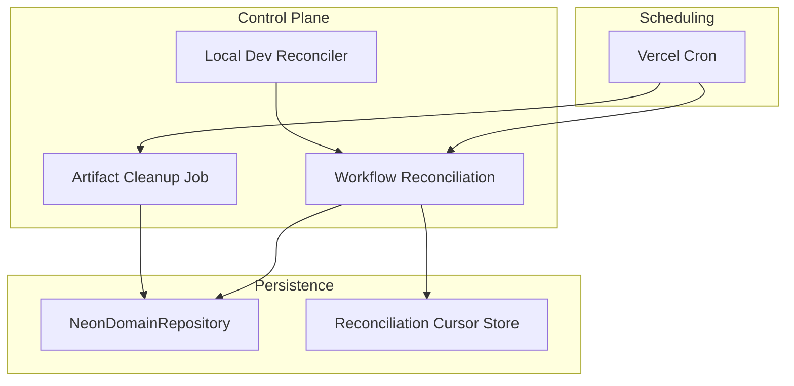
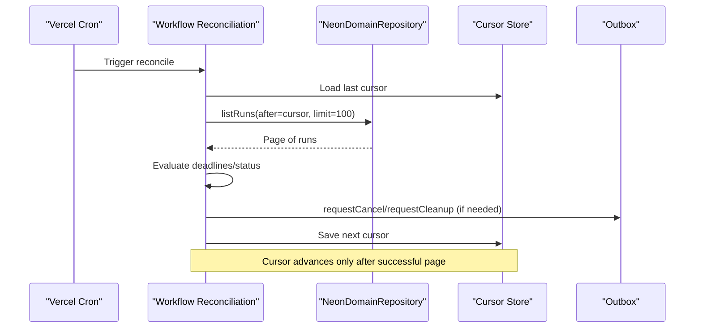
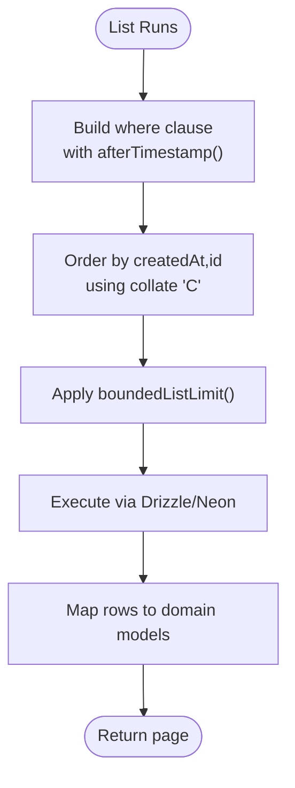
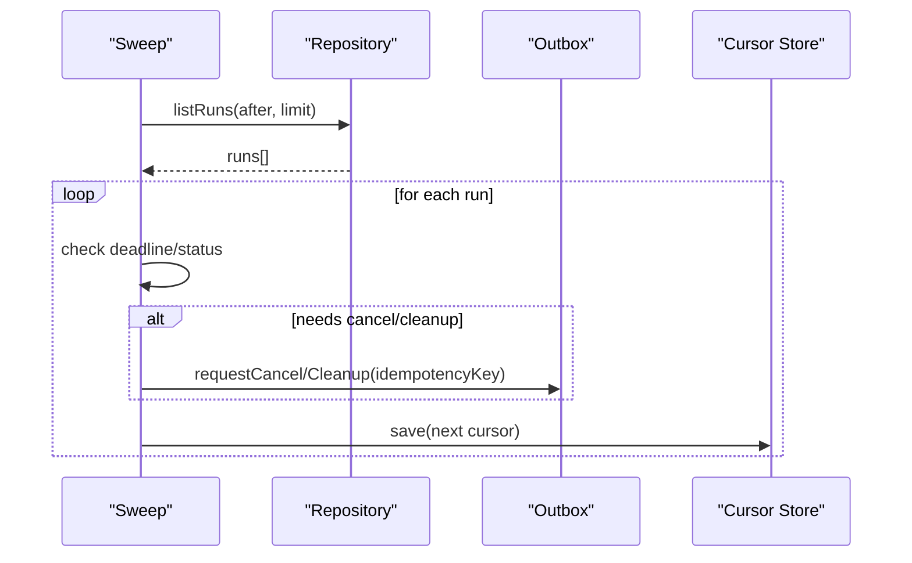
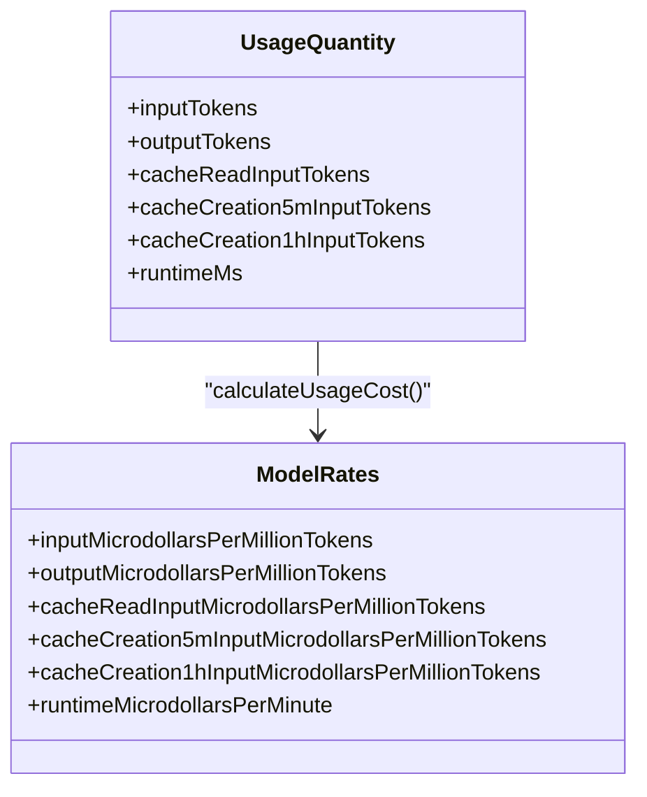
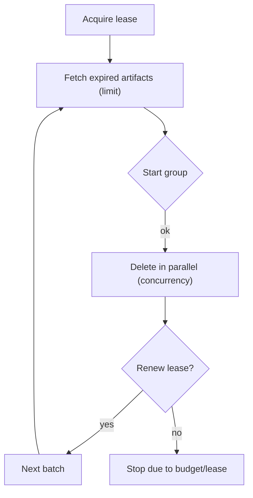
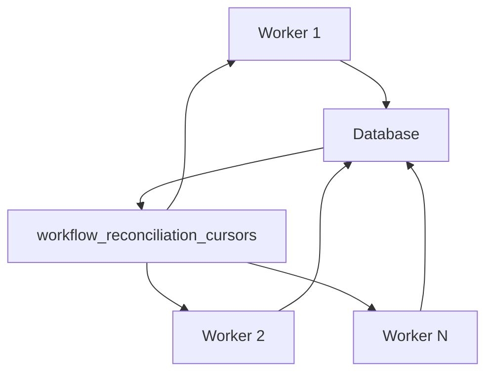
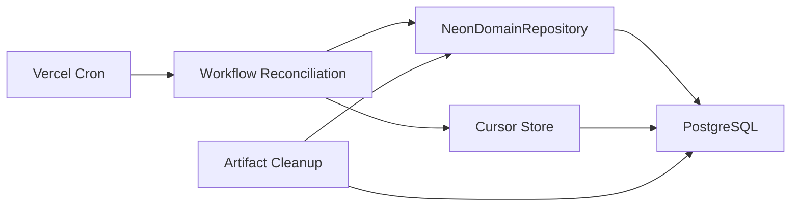

# Performance Optimization

<cite>
**Referenced Files in This Document**
- [neon-repository.ts](file://packages/adapters/src/persistence/neon-repository.ts)
- [database-config.ts](file://packages/adapters/src/persistence/database-config.ts)
- [postgres.integration.test.ts](file://packages/adapters/src/persistence/postgres.integration.test.ts)
- [reconciliation-cursor-store.ts](file://packages/adapters/src/trigger/reconciliation-cursor-store.ts)
- [workflow-reconciliation.ts](file://apps/control-plane/src/application/workflow-reconciliation.ts)
- [local-reconciliation-loop.ts](file://apps/control-plane/src/application/local-reconciliation-loop.ts)
- [instrumentation.ts](file://apps/control-plane/instrumentation.ts)
- [artifact-cleanup.ts](file://apps/control-plane/src/application/artifact-cleanup.ts)
- [manifest.ts](file://packages/adapters/src/artifacts/manifest.ts)
- [workflow-budget.ts](file://packages/adapters/src/trigger/workflow-budget.ts)
- [budget.ts](file://packages/core/src/budget.ts)
- [normalization.ts](file://packages/adapters/src/managed-agents/normalization.ts)
- [0015_durable_reconciliation_cursor.sql](file://drizzle/0015_durable_reconciliation_cursor.sql)
- [0016_complete_usage_pricing.sql](file://drizzle/0016_complete_usage_pricing.sql)
- [0017_restore_usage_defaults.sql](file://drizzle/0017_restore_usage_defaults.sql)
- [vercel.json](file://vercel.json)
</cite>

## Table of Contents
1. Introduction
2. Project Structure
3. Core Components
4. Architecture Overview
5. Detailed Component Analysis
6. Dependency Analysis
7. Performance Considerations
8. Troubleshooting Guide
9. Conclusion
10. Appendices

## Introduction
This document provides performance optimization guidance for Agent OS Passerine, focusing on database query optimization, connection pooling, caching strategies, workflow execution efficiency, memory management, resource utilization, monitoring and profiling, scaling considerations, load balancing, horizontal scaling, API response time optimization, background job processing, artifact handling, environment-specific tuning, and benchmarking guidelines. It synthesizes patterns observed across the codebase to help operators achieve predictable latency, high throughput, and resilient operations under load.

## Project Structure
The system is organized into:
- Persistence layer with a Neon HTTP client and Drizzle ORM for PostgreSQL
- Workflow reconciliation and outbox delivery
- Background jobs for artifact cleanup
- Budgeting and usage accounting with cache-aware pricing
- Cron-driven scheduling via Vercel cron



**Diagram sources**
- [workflow-reconciliation.ts:156-304](file://apps/control-plane/src/application/workflow-reconciliation.ts#L156-L304)
- [artifact-cleanup.ts:35-118](file://apps/control-plane/src/application/artifact-cleanup.ts#L35-L118)
- [local-reconciliation-loop.ts:32-96](file://apps/control-plane/src/application/local-reconciliation-loop.ts#L32-L96)
- [neon-repository.ts:348-702](file://packages/adapters/src/persistence/neon-repository.ts#L348-L702)
- [reconciliation-cursor-store.ts:46-90](file://packages/adapters/src/trigger/reconciliation-cursor-store.ts#L46-L90)
- [vercel.json:1-13](file://vercel.json#L1-L13)

**Section sources**
- [vercel.json:1-13](file://vercel.json#L1-L13)
- [workflow-reconciliation.ts:156-304](file://apps/control-plane/src/application/workflow-reconciliation.ts#L156-L304)
- [artifact-cleanup.ts:35-118](file://apps/control-plane/src/application/artifact-cleanup.ts#L35-L118)
- [local-reconciliation-loop.ts:32-96](file://apps/control-plane/src/application/local-reconciliation-loop.ts#L32-L96)
- [neon-repository.ts:348-702](file://packages/adapters/src/persistence/neon-repository.ts#L348-L702)
- [reconciliation-cursor-store.ts:46-90](file://packages/adapters/src/trigger/reconciliation-cursor-store.ts#L46-L90)

## Core Components
- NeonDomainRepository: Central persistence adapter using Neon HTTP client and Drizzle ORM; implements efficient cursor-based pagination, JSONB handling, advisory locks, and idempotent updates.
- Workflow Reconciliation: Scans runs by project with durable cursors, enforces deadlines, cancels or cleans up stalled work, and dispatches tasks via an outbox.
- Artifact Cleanup: Concurrency-bounded, lease-backed background job that deletes expired artifacts with time budgets and safety margins.
- Local Reconciliation Loop: Development-time equivalent of production cron to ensure local fidelity for stalled run detection.
- Budgeting and Usage: Token and runtime cost calculation with cache-aware pricing and normalized usage ingestion from provider events.

**Section sources**
- [neon-repository.ts:348-702](file://packages/adapters/src/persistence/neon-repository.ts#L348-L702)
- [workflow-reconciliation.ts:156-304](file://apps/control-plane/src/application/workflow-reconciliation.ts#L156-L304)
- [artifact-cleanup.ts:35-118](file://apps/control-plane/src/application/artifact-cleanup.ts#L35-L118)
- [local-reconciliation-loop.ts:32-96](file://apps/control-plane/src/application/local-reconciliation-loop.ts#L32-L96)
- [budget.ts:1-127](file://packages/core/src/budget.ts#L1-L127)
- [normalization.ts:267-293](file://packages/adapters/src/managed-agents/normalization.ts#L267-L293)

## Architecture Overview
The control plane schedules periodic reconciliation and cleanup via Vercel cron. Each sweep uses durable cursors to avoid rescanning and ensures progress is persisted. The repository abstracts database interactions with optimized queries and concurrency controls.



**Diagram sources**
- [vercel.json:1-13](file://vercel.json#L1-L13)
- [workflow-reconciliation.ts:156-304](file://apps/control-plane/src/application/workflow-reconciliation.ts#L156-L304)
- [reconciliation-cursor-store.ts:46-90](file://packages/adapters/src/trigger/reconciliation-cursor-store.ts#L46-L90)
- [neon-repository.ts:666-702](file://packages/adapters/src/persistence/neon-repository.ts#L666-L702)

## Detailed Component Analysis

### Database Query Optimization and Connection Pooling
- Cursor-based pagination: All list endpoints use timestamp+id ordering with bounded limits to prevent full table scans and reduce payload sizes.
- JSONB handling: Input values are cast to JSONB at the SQL layer to leverage indexing and reduce serialization overhead.
- Advisory locking: Configuration application uses transaction-scoped advisory locks to serialize concurrent writes safely.
- Idempotent updates: Upserts and conflict handling ensure retries do not duplicate state changes.
- Connection pooling: Integration tests demonstrate explicit pool sizing for test clients; production relies on Neon’s serverless client which manages connections per invocation. For long-lived processes, configure pool size appropriately to match expected concurrency.



**Diagram sources**
- [neon-repository.ts:264-284](file://packages/adapters/src/persistence/neon-repository.ts#L264-L284)
- [neon-repository.ts:666-702](file://packages/adapters/src/persistence/neon-repository.ts#L666-L702)

**Section sources**
- [neon-repository.ts:264-284](file://packages/adapters/src/persistence/neon-repository.ts#L264-L284)
- [neon-repository.ts:402-514](file://packages/adapters/src/persistence/neon-repository.ts#L402-L514)
- [neon-repository.ts:632-655](file://packages/adapters/src/persistence/neon-repository.ts#L632-L655)
- [postgres.integration.test.ts:61-65](file://packages/adapters/src/persistence/postgres.integration.test.ts#L61-L65)

### Workflow Execution Optimization
- Deadline enforcement: Stalled runs are detected and canceled/cleaned up based on configured deadlines.
- Outbox pattern: Deliveries are batched and persisted with idempotency keys to avoid duplicates.
- Cursor durability: After each run processed, the cursor is saved so restarts resume strictly after the last scanned run.
- Concurrency control: Sweeps guard against overlapping executions to avoid cursor contention.



**Diagram sources**
- [workflow-reconciliation.ts:156-304](file://apps/control-plane/src/application/workflow-reconciliation.ts#L156-L304)
- [reconciliation-cursor-store.ts:46-90](file://packages/adapters/src/trigger/reconciliation-cursor-store.ts#L46-L90)

**Section sources**
- [workflow-reconciliation.ts:156-304](file://apps/control-plane/src/application/workflow-reconciliation.ts#L156-L304)
- [local-reconciliation-loop.ts:51-76](file://apps/control-plane/src/application/local-reconciliation-loop.ts#L51-L76)

### Caching Strategies
- Provider-side caching: Usage normalization captures cache read and creation tokens to reflect model provider caching behavior.
- Pricing-aware accounting: Budget calculations incorporate cache read and creation buckets to accurately account for cost and inform capacity planning.
- Operational caching: While no in-memory cache is implemented here, leveraging provider caches reduces token consumption and improves latency.



**Diagram sources**
- [budget.ts:1-127](file://packages/core/src/budget.ts#L1-L127)
- [normalization.ts:267-293](file://packages/adapters/src/managed-agents/normalization.ts#L267-L293)

**Section sources**
- [normalization.ts:267-293](file://packages/adapters/src/managed-agents/normalization.ts#L267-L293)
- [budget.ts:1-127](file://packages/core/src/budget.ts#L1-L127)

### Memory Management and Resource Utilization
- Bounded concurrency: Artifact cleanup batches deletions with configurable concurrency to avoid memory spikes and overload downstream systems.
- Time budgets and leases: Cleanup jobs acquire short-lived leases and enforce time budgets with safety margins to prevent runaway processes.
- Abort signals: Groups can be aborted when nearing deadlines, ensuring graceful shutdown without partial state corruption.



**Diagram sources**
- [artifact-cleanup.ts:35-118](file://apps/control-plane/src/application/artifact-cleanup.ts#L35-L118)
- [manifest.ts:548-580](file://packages/adapters/src/artifacts/manifest.ts#L548-L580)

**Section sources**
- [artifact-cleanup.ts:35-118](file://apps/control-plane/src/application/artifact-cleanup.ts#L35-L118)
- [manifest.ts:548-580](file://packages/adapters/src/artifacts/manifest.ts#L548-L580)

### Monitoring and Profiling
- Local development reconciler: Ensures local behavior mirrors production by periodically sweeping and failing stalled runs.
- Cron-driven reconciliation: Production uses scheduled jobs to maintain consistent state and detect anomalies.
- Usage accounting: Daily usage aggregators enable cost monitoring and anomaly detection.

```mermaid
sequenceDiagram
participant Dev as "Dev Server"
participant Reg as "register()"
participant Loop as "Local Reconciliation Loop"
participant Rec as "Reconcile"
Dev->>Reg : Start
Reg->>Loop : startLocalReconciliationLoop()
Loop->>Rec : Run every interval
Note over Loop,Rec : Avoids overlapping sweeps
```

**Diagram sources**
- [instrumentation.ts:12-39](file://apps/control-plane/instrumentation.ts#L12-L39)
- [local-reconciliation-loop.ts:32-96](file://apps/control-plane/src/application/local-reconciliation-loop.ts#L32-L96)

**Section sources**
- [instrumentation.ts:12-39](file://apps/control-plane/instrumentation.ts#L12-L39)
- [local-reconciliation-loop.ts:32-96](file://apps/control-plane/src/application/local-reconciliation-loop.ts#L32-L96)
- [workflow-budget.ts:46-95](file://packages/adapters/src/trigger/workflow-budget.ts#L46-L95)

### Scaling Considerations, Load Balancing, and Horizontal Scaling
- Stateless workers: Repository and reconciliation logic are stateless except for durable cursors stored in the database, enabling horizontal scaling.
- Cursor isolation: Cursors are keyed per project, allowing multiple workers to process different projects concurrently without contention.
- Cron distribution: Vercel cron triggers can be scaled by increasing frequency or partitioning workloads by project if necessary.



**Diagram sources**
- [reconciliation-cursor-store.ts:46-90](file://packages/adapters/src/trigger/reconciliation-cursor-store.ts#L46-L90)
- [0015_durable_reconciliation_cursor.sql:1-6](file://drizzle/0015_durable_reconciliation_cursor.sql#L1-L6)

**Section sources**
- [reconciliation-cursor-store.ts:46-90](file://packages/adapters/src/trigger/reconciliation-cursor-store.ts#L46-L90)
- [0015_durable_reconciliation_cursor.sql:1-6](file://drizzle/0015_durable_reconciliation_cursor.sql#L1-L6)

### Best Practices for API Response Times, Background Jobs, and Artifacts
- API response times: Use idempotency keys and fast-path validations; minimize payload sizes; prefer cursor-based lists with small limits.
- Background jobs: Enforce time budgets, safety margins, and leases; use concurrency limits to protect downstream services.
- Artifact handling: Batch deletions with bounded concurrency; track invalid counts and failures; stop early when approaching deadlines.

**Section sources**
- [artifact-cleanup.ts:35-118](file://apps/control-plane/src/application/artifact-cleanup.ts#L35-L118)
- [manifest.ts:548-580](file://packages/adapters/src/artifacts/manifest.ts#L548-L580)

### Environment-Specific Tuning and Benchmarking Guidelines
- Environment validation: Fail closed if DATABASE_URL is missing or malformed to avoid runtime surprises.
- Test pools: Set explicit max connections for integration tests to simulate realistic concurrency.
- Benchmarking: Measure list/query latencies with varying limits; validate cursor stability under load; profile artifact cleanup throughput vs. concurrency settings; assess daily usage aggregation costs.

**Section sources**
- [database-config.ts:5-26](file://packages/adapters/src/persistence/database-config.ts#L5-L26)
- [postgres.integration.test.ts:61-65](file://packages/adapters/src/persistence/postgres.integration.test.ts#L61-L65)

## Dependency Analysis
Key dependencies and their roles:
- Neon HTTP client: Provides serverless PostgreSQL connectivity; used directly and via Drizzle ORM.
- Drizzle ORM: Typesafe query builder; enables precise selection and JSONB casting.
- Vercel Cron: Schedules reconciliation and cleanup jobs.
- Cursor store: Persists reconciliation progress to avoid reprocessing.



**Diagram sources**
- [vercel.json:1-13](file://vercel.json#L1-L13)
- [workflow-reconciliation.ts:156-304](file://apps/control-plane/src/application/workflow-reconciliation.ts#L156-L304)
- [neon-repository.ts:1824-1842](file://packages/adapters/src/persistence/neon-repository.ts#L1824-L1842)
- [reconciliation-cursor-store.ts:73-90](file://packages/adapters/src/trigger/reconciliation-cursor-store.ts#L73-L90)

**Section sources**
- [vercel.json:1-13](file://vercel.json#L1-L13)
- [neon-repository.ts:1824-1842](file://packages/adapters/src/persistence/neon-repository.ts#L1824-L1842)
- [reconciliation-cursor-store.ts:73-90](file://packages/adapters/src/trigger/reconciliation-cursor-store.ts#L73-L90)

## Performance Considerations
- Prefer cursor-based pagination with small, bounded limits to reduce memory and network overhead.
- Use JSONB columns judiciously and cast inputs to JSONB to leverage indexes and avoid parsing overhead.
- Serialize critical sections with advisory locks to prevent conflicts during configuration updates.
- Enforce deadlines and timeouts to prevent long-running requests from blocking resources.
- Use concurrency limits and time budgets in background jobs to stabilize resource usage.
- Leverage provider-side caching to reduce token consumption and improve latency.
- Scale horizontally by adding workers; rely on durable cursors to distribute work without duplication.

[No sources needed since this section provides general guidance]

## Troubleshooting Guide
- Missing or invalid DATABASE_URL: Validation fails early; ensure correct PostgreSQL URL format and required fields.
- Stale configuration errors: Occur when concurrent apply attempts conflict; retry with updated revision/digest.
- Unique constraint violations: Handle idempotently; retries should converge to the same result.
- Stalled runs: Ensure cron is running and reconciliation loops execute; verify cursor persistence and deadlines.
- Cleanup stalls: Check lease acquisition and time budgets; adjust concurrency and limits if needed.

**Section sources**
- [database-config.ts:5-26](file://packages/adapters/src/persistence/database-config.ts#L5-L26)
- [neon-repository.ts:402-514](file://packages/adapters/src/persistence/neon-repository.ts#L402-L514)
- [workflow-reconciliation.ts:156-304](file://apps/control-plane/src/application/workflow-reconciliation.ts#L156-L304)
- [artifact-cleanup.ts:35-118](file://apps/control-plane/src/application/artifact-cleanup.ts#L35-L118)

## Conclusion
Agent OS Passerine employs robust patterns for performance and reliability: cursor-based pagination, advisory locking, idempotent updates, deadline enforcement, durable cursors, and bounded concurrency in background jobs. These mechanisms collectively optimize database interactions, manage memory and resources, and support horizontal scaling. By following the practices outlined—especially around pagination, caching, job budgets, and environment validation—you can achieve low-latency APIs, efficient background processing, and resilient operations across environments.

[No sources needed since this section summarizes without analyzing specific files]

## Appendices

### Schema Additions Relevant to Performance
- Durable reconciliation cursors table for persistent progress tracking.
- Usage records schema extensions for cache-aware pricing and constraints.

**Section sources**
- [0015_durable_reconciliation_cursor.sql:1-6](file://drizzle/0015_durable_reconciliation_cursor.sql#L1-L6)
- [0016_complete_usage_pricing.sql:1-10](file://drizzle/0016_complete_usage_pricing.sql#L1-L10)
- [0017_restore_usage_defaults.sql:1-4](file://drizzle/0017_restore_usage_defaults.sql#L1-L4)