# Plugin Architecture

<cite>
**Referenced Files in This Document**
- [ports.ts](file://packages/core/src/ports.ts)
- [persistence.ts](file://packages/core/src/persistence.ts)
- [config.ts](file://packages/core/src/config.ts)
- [lifecycle.ts](file://packages/core/src/lifecycle.ts)
- [index.ts (core)](file://packages/core/src/index.ts)
- [index.ts (adapters)](file://packages/adapters/src/index.ts)
- [routing.ts](file://packages/adapters/src/runtime/routing.ts)
- [goal-production-composition.ts](file://packages/adapters/src/trigger/goal-production-composition.ts)
- [artifact-store-contract.ts](file://packages/adapters/src/artifacts/artifact-store-contract.ts)
- [r2.ts](file://packages/adapters/src/artifacts/r2.ts)
- [in-memory.ts](file://packages/adapters/src/artifacts/in-memory.ts)
- [github-app.ts](file://packages/adapters/src/github/github-app.ts)
- [publisher.ts](file://packages/adapters/src/github/publisher.ts)
- [provider.ts (kimi)](file://packages/adapters/src/kimi/provider.ts)
- [managed-agents provider.ts](file://packages/adapters/src/managed-agents/provider.ts)
- [neon-repository.ts](file://packages/adapters/src/persistence/neon-repository.ts)
- [in-memory repository.ts](file://packages/adapters/src/persistence/in-memory.ts)
- [workspace.ts](file://apps/cli/src/workspace.ts)
</cite>

## Table of Contents
1. Introduction
2. Project Structure
3. Core Components
4. Architecture Overview
5. Detailed Component Analysis
6. Dependency Analysis
7. Performance Considerations
8. Troubleshooting Guide
9. Conclusion
10. Appendices

## Introduction
This document explains the plugin architecture in Agent OS Passerine, focusing on extension points, interfaces, and integration patterns that enable extending system functionality. It covers how to implement custom adapters for external services, new AI model providers, and custom tools; how plugins are discovered, loaded, and configured; and how lifecycle, dependency injection, and configuration management work across the system. Practical examples include building storage backends, notification channels, and authentication providers. Security considerations for plugin development and deployment are also addressed.

## Project Structure
Agent OS Passerine separates stable contracts from concrete implementations:
- Core package defines typed interfaces and configuration schemas that act as plugin contracts.
- Adapters package provides concrete implementations for runtime providers, artifact stores, persistence repositories, GitHub publishing, and AI model integrations.
- CLI and control-plane apps consume core contracts and wire adapter implementations at runtime.

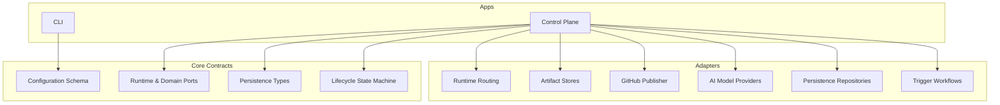

**Diagram sources**
- [ports.ts:122-144](file://packages/core/src/ports.ts#L122-L144)
- [config.ts:165-205](file://packages/core/src/config.ts#L165-L205)
- [persistence.ts:456-639](file://packages/core/src/persistence.ts#L456-L639)
- [lifecycle.ts:35-84](file://packages/core/src/lifecycle.ts#L35-L84)
- [routing.ts](file://packages/adapters/src/runtime/routing.ts)
- [index.ts (adapters):1-9](file://packages/adapters/src/index.ts#L1-L9)

**Section sources**
- [index.ts (core):1-14](file://packages/core/src/index.ts#L1-L14)
- [index.ts (adapters):1-9](file://packages/adapters/src/index.ts#L1-L9)

## Core Components
The plugin architecture is built around a set of stable, versioned contracts in the core package:
- Runtime Provider: The central extension point for executing agent sessions, handling events, collecting outputs, tracking usage, and cleaning up resources.
- Repository Publisher: An extension point for creating validated draft publications (e.g., pull requests).
- Usage Meter: An extension point for recording and listing usage metrics per run.
- Persistence Repository: A comprehensive domain interface for projects, runs, steps, artifacts, approvals, inbox messages, events, goals, and more.
- Configuration: Strongly-typed schema-driven configuration with validation, canonicalization, hashing, and semantic diffs.

These contracts define how plugins integrate without coupling to specific implementations.

**Section sources**
- [ports.ts:122-144](file://packages/core/src/ports.ts#L122-L144)
- [ports.ts:190-195](file://packages/core/src/ports.ts#L190-L195)
- [ports.ts:205-208](file://packages/core/src/ports.ts#L205-L208)
- [persistence.ts:456-639](file://packages/core/src/persistence.ts#L456-L639)
- [config.ts:165-205](file://packages/core/src/config.ts#L165-L205)

## Architecture Overview
At runtime, the control plane loads configuration, resolves which adapter implementations to use via routing, and invokes them through core contracts. Plugins are not dynamically loaded at runtime; instead, they are selected by configuration and wired into the application during startup or task initialization.

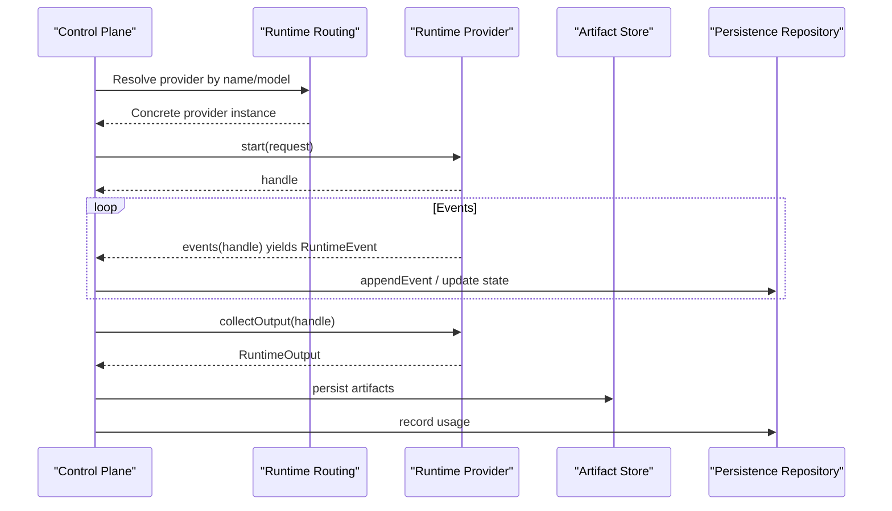

**Diagram sources**
- [routing.ts](file://packages/adapters/src/runtime/routing.ts)
- [ports.ts:122-144](file://packages/core/src/ports.ts#L122-L144)
- [persistence.ts:456-639](file://packages/core/src/persistence.ts#L456-L639)

## Detailed Component Analysis

### Runtime Provider Plugin
The Runtime Provider is the primary extension point for executing agent sessions. Implementers must provide methods to synchronize agents and environments, start and manage sessions, stream events, send messages, resume, cancel, collect outputs, track usage, and clean up resources. Optional hooks allow observing commands and cleaning file resources and credentials.

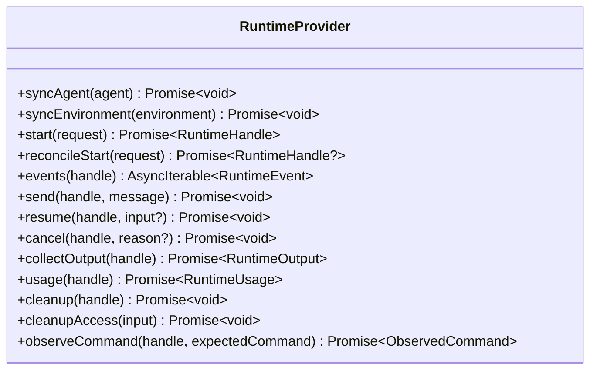

**Diagram sources**
- [ports.ts:122-144](file://packages/core/src/ports.ts#L122-L144)

**Section sources**
- [ports.ts:122-144](file://packages/core/src/ports.ts#L122-L144)

### AI Model Provider Plugins
Model providers are implemented as runtime providers or specialized adapters that expose an interface compatible with the core contracts. Examples include:
- Managed Agents provider: integrates with managed execution environments.
- Kimi provider: integrates with the Kimi model service.

These providers typically implement session lifecycle, event streaming, and usage reporting consistent with the Runtime Provider contract.

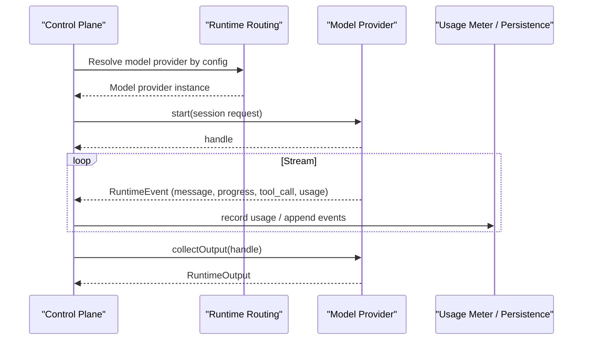

**Diagram sources**
- [provider.ts (kimi)](file://packages/adapters/src/kimi/provider.ts)
- [managed-agents provider.ts](file://packages/adapters/src/managed-agents/provider.ts)
- [ports.ts:122-144](file://packages/core/src/ports.ts#L122-L144)

**Section sources**
- [provider.ts (kimi)](file://packages/adapters/src/kimi/provider.ts)
- [managed-agents provider.ts](file://packages/adapters/src/managed-agents/provider.ts)
- [ports.ts:122-144](file://packages/core/src/ports.ts#L122-L144)

### Artifact Store Plugins
Artifact stores implement a contract for storing and retrieving artifacts with keys, media types, sizes, digests, and URIs. Built-in implementations include R2 and in-memory stores. Custom storage backends can be created by implementing the same contract.

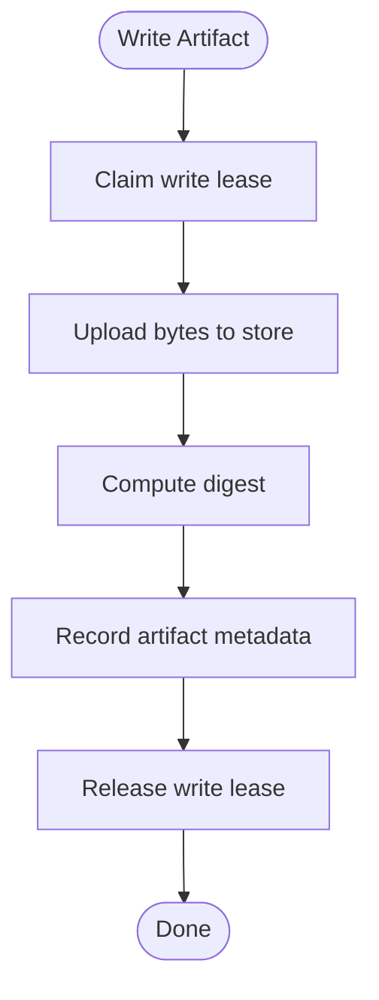

**Diagram sources**
- [artifact-store-contract.ts](file://packages/adapters/src/artifacts/artifact-store-contract.ts)
- [r2.ts](file://packages/adapters/src/artifacts/r2.ts)
- [in-memory.ts](file://packages/adapters/src/artifacts/in-memory.ts)

**Section sources**
- [artifact-store-contract.ts](file://packages/adapters/src/artifacts/artifact-store-contract.ts)
- [r2.ts](file://packages/adapters/src/artifacts/r2.ts)
- [in-memory.ts](file://packages/adapters/src/artifacts/in-memory.ts)

### Repository Publisher Plugins
Repository publishers create validated draft publications such as pull requests. Implementations must validate repository context and publish drafts with attestation claims.

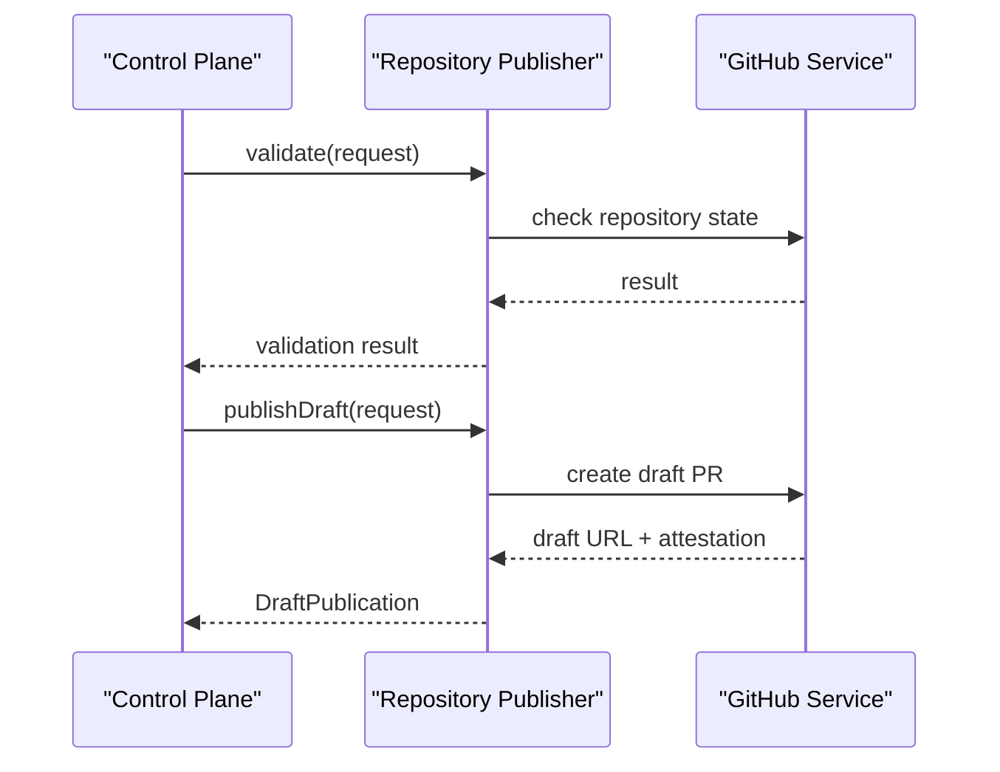

**Diagram sources**
- [publisher.ts](file://packages/adapters/src/github/publisher.ts)
- [github-app.ts](file://packages/adapters/src/github/github-app.ts)
- [ports.ts:190-195](file://packages/core/src/ports.ts#L190-L195)

**Section sources**
- [publisher.ts](file://packages/adapters/src/github/publisher.ts)
- [github-app.ts](file://packages/adapters/src/github/github-app.ts)
- [ports.ts:190-195](file://packages/core/src/ports.ts#L190-L195)

### Persistence Repository Plugins
The persistence layer exposes a rich domain repository interface covering projects, runs, steps, artifacts, approvals, inbox messages, events, goals, and usage. Implementations include Neon Postgres and in-memory stores. Custom databases can be added by implementing this interface.

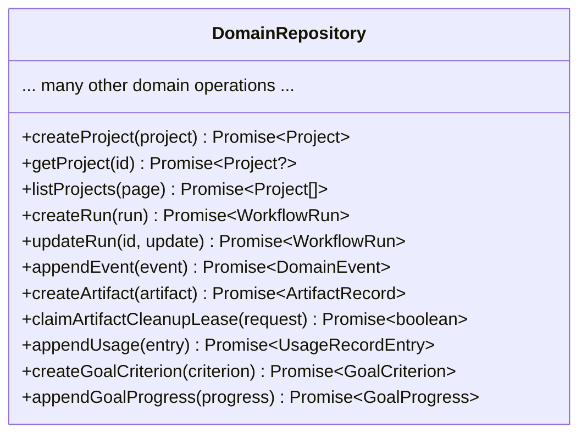

**Diagram sources**
- [persistence.ts:456-639](file://packages/core/src/persistence.ts#L456-L639)
- [neon-repository.ts](file://packages/adapters/src/persistence/neon-repository.ts)
- [in-memory repository.ts](file://packages/adapters/src/persistence/in-memory.ts)

**Section sources**
- [persistence.ts:456-639](file://packages/core/src/persistence.ts#L456-L639)
- [neon-repository.ts](file://packages/adapters/src/persistence/neon-repository.ts)
- [in-memory repository.ts](file://packages/adapters/src/persistence/in-memory.ts)

### Configuration and Routing
Configuration is strongly validated using schemas, enabling safe composition of models, agents, environments, pipelines, policies, budgets, and verification settings. Runtime routing selects provider implementations based on configuration keys.

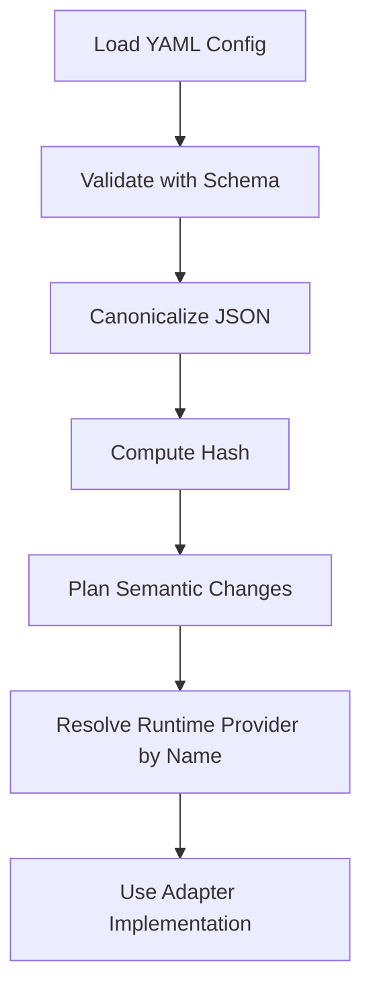

**Diagram sources**
- [config.ts:165-205](file://packages/core/src/config.ts#L165-L205)
- [config.ts:331-337](file://packages/core/src/config.ts#L331-L337)
- [config.ts:355-369](file://packages/core/src/config.ts#L355-L369)
- [config.ts:423-448](file://packages/core/src/config.ts#L423-L448)
- [routing.ts](file://packages/adapters/src/runtime/routing.ts)

**Section sources**
- [config.ts:165-205](file://packages/core/src/config.ts#L165-L205)
- [config.ts:331-337](file://packages/core/src/config.ts#L331-L337)
- [config.ts:355-369](file://packages/core/src/config.ts#L355-L369)
- [config.ts:423-448](file://packages/core/src/config.ts#L423-L448)
- [routing.ts](file://packages/adapters/src/runtime/routing.ts)

### Lifecycle Management
The lifecycle state machine governs transitions between states such as queued, running, awaiting approval, blocked, succeeded, failed, cancelled, and budget_exhausted. Plugins should emit appropriate events to drive state changes consistently.

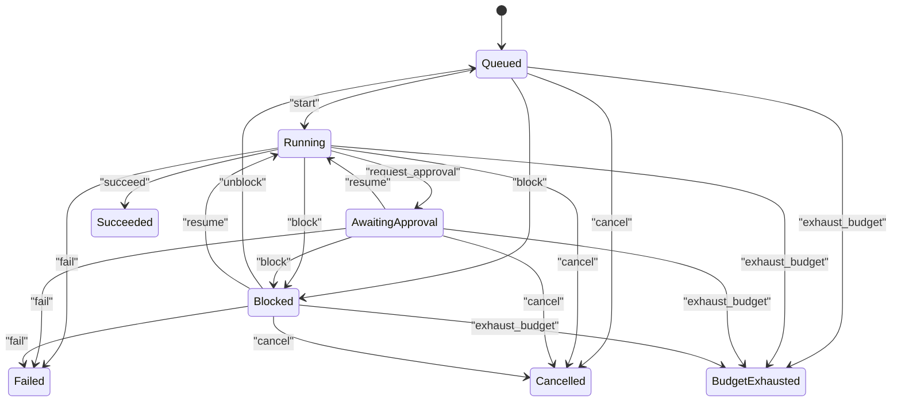

**Diagram sources**
- [lifecycle.ts:35-84](file://packages/core/src/lifecycle.ts#L35-L84)

**Section sources**
- [lifecycle.ts:35-84](file://packages/core/src/lifecycle.ts#L35-L84)

### Trigger Workflow Composition
Production workflows are composed lazily to avoid constructing secret-bearing adapters at import time. This pattern ensures secure initialization and avoids unnecessary setup costs.

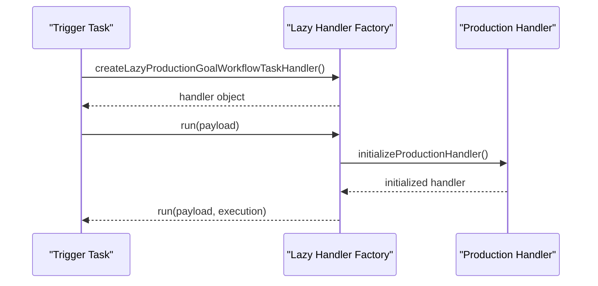

**Diagram sources**
- [goal-production-composition.ts](file://packages/adapters/src/trigger/goal-production-composition.ts)

**Section sources**
- [goal-production-composition.ts](file://packages/adapters/src/trigger/goal-production-composition.ts)

## Dependency Analysis
Core contracts are intentionally decoupled from adapter implementations. Adapters depend on core types but core does not depend on adapters. This separation enables swapping implementations without changing business logic.

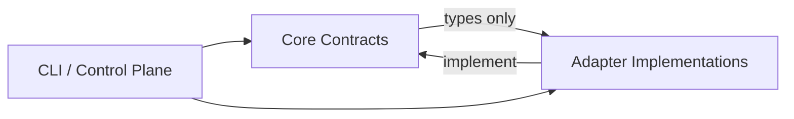

**Diagram sources**
- [index.ts (core):1-14](file://packages/core/src/index.ts#L1-L14)
- [index.ts (adapters):1-9](file://packages/adapters/src/index.ts#L1-L9)

**Section sources**
- [index.ts (core):1-14](file://packages/core/src/index.ts#L1-L14)
- [index.ts (adapters):1-9](file://packages/adapters/src/index.ts#L1-L9)

## Performance Considerations
- Prefer lazy initialization for expensive adapters to reduce startup cost and avoid loading secrets prematurely.
- Use streaming events for long-running sessions to keep memory bounded and improve responsiveness.
- Batch usage records and artifact metadata writes where possible to reduce database load.
- Leverage cursor-based pagination for large lists to avoid full scans.
- Keep network calls idempotent and retry-safe to minimize duplicate work.

[No sources needed since this section provides general guidance]

## Troubleshooting Guide
Common issues and strategies:
- Invalid configuration: Use schema validation errors to pinpoint misconfigurations in models, agents, environments, or pipelines.
- Unknown provider: Ensure runtime routing configuration maps to a registered adapter implementation.
- Event mismatches: Verify emitted event types match the allowed set and payloads conform to expectations.
- Persistence failures: Check transaction boundaries and idempotency keys when updating runs, steps, and artifacts.
- Resource leaks: Always call cleanup methods on handles and release leases promptly.

**Section sources**
- [config.ts:165-205](file://packages/core/src/config.ts#L165-L205)
- [ports.ts:62-91](file://packages/core/src/ports.ts#L62-L91)
- [persistence.ts:456-639](file://packages/core/src/persistence.ts#L456-L639)

## Conclusion
Agent OS Passerine’s plugin architecture centers on stable core contracts and pluggable adapter implementations. By implementing the Runtime Provider, Repository Publisher, Usage Meter, and Persistence Repository interfaces, developers can extend the system with custom storage backends, notification channels, authentication providers, and AI model integrations. Configuration-driven routing and strong typing ensure safe, maintainable extensions. Following the lifecycle and security guidelines helps build robust, scalable plugins.

[No sources needed since this section summarizes without analyzing specific files]

## Appendices

### Practical Examples

#### Custom Storage Backend
Implement the artifact store contract to support a new storage service. Provide methods to claim write leases, upload data, compute digests, record metadata, and release leases.

**Section sources**
- [artifact-store-contract.ts](file://packages/adapters/src/artifacts/artifact-store-contract.ts)
- [r2.ts](file://packages/adapters/src/artifacts/r2.ts)
- [in-memory.ts](file://packages/adapters/src/artifacts/in-memory.ts)

#### Notification Channel
Extend event handling to deliver notifications via email, Slack, or webhooks. Emit domain events and route them to notification adapters based on configuration.

**Section sources**
- [persistence.ts:315-323](file://packages/core/src/persistence.ts#L315-L323)
- [persistence.ts:456-639](file://packages/core/src/persistence.ts#L456-L639)

#### Authentication Provider
Integrate with OAuth or token-based auth systems by implementing repository and runtime interactions that authenticate users and sessions. Use configuration to select providers and enforce security policies.

**Section sources**
- [config.ts:165-205](file://packages/core/src/config.ts#L165-L205)
- [ports.ts:122-144](file://packages/core/src/ports.ts#L122-L144)

### Plugin Discovery and Loading
Plugins are not dynamically discovered at runtime. Instead:
- Configuration declares provider names and routing rules.
- Adapters are imported and instantiated during app startup or task initialization.
- Lazy factories defer construction until first use to optimize performance and security.

**Section sources**
- [config.ts:143-148](file://packages/core/src/config.ts#L143-L148)
- [routing.ts](file://packages/adapters/src/runtime/routing.ts)
- [goal-production-composition.ts](file://packages/adapters/src/trigger/goal-production-composition.ts)

### Version Compatibility
- Configuration uses a versioned schema to ensure forward compatibility.
- Canonicalization and hashing enable change detection and reproducible builds.
- Semantic diffs help plan upgrades and rollback strategies.

**Section sources**
- [config.ts:165-205](file://packages/core/src/config.ts#L165-L205)
- [config.ts:355-369](file://packages/core/src/config.ts#L355-L369)
- [config.ts:423-448](file://packages/core/src/config.ts#L423-L448)

### Security Considerations
- Never pass raw credentials to plugins; use credential references and scoped access.
- Validate all inputs and paths to prevent traversal and symlink attacks.
- Enforce protected paths and capability permissions in configuration.
- Use least privilege for network access and package managers in environments.
- Audit plugin behavior via observed commands and event streams.

**Section sources**
- [ports.ts:57-58](file://packages/core/src/ports.ts#L57-L58)
- [config.ts:10-22](file://packages/core/src/config.ts#L10-L22)
- [workspace.ts:77-102](file://apps/cli/src/workspace.ts#L77-L102)
- [workspace.ts:122-160](file://apps/cli/src/workspace.ts#L122-L160)