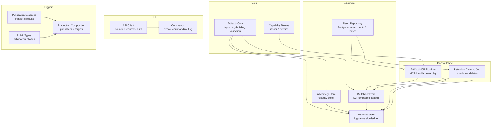
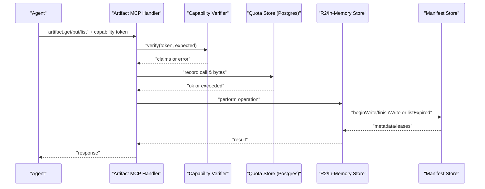
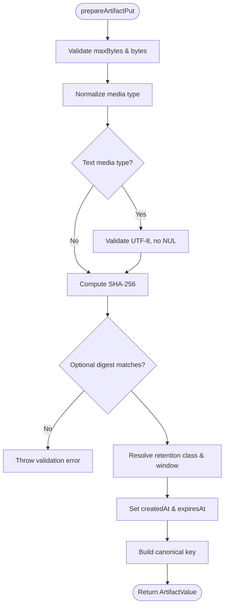
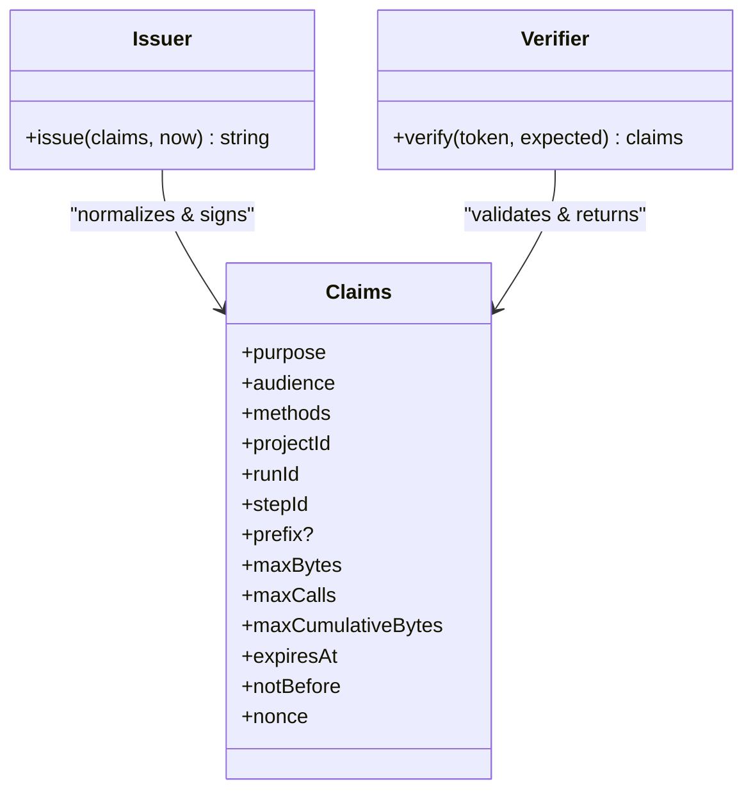
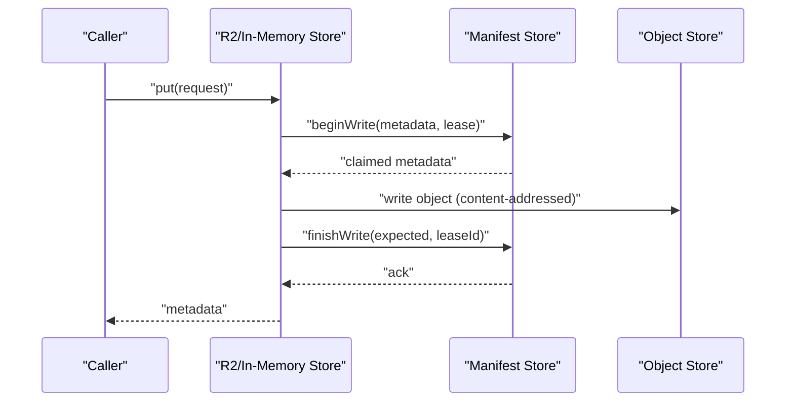
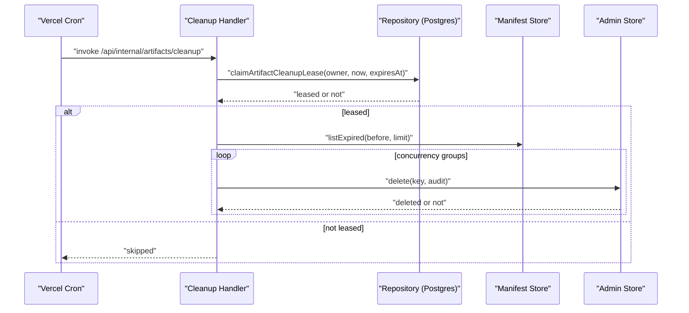
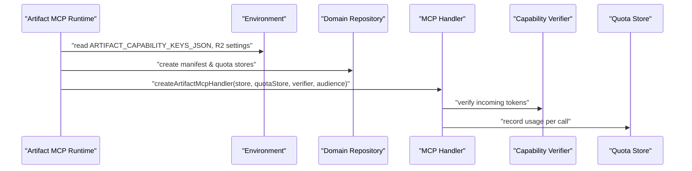
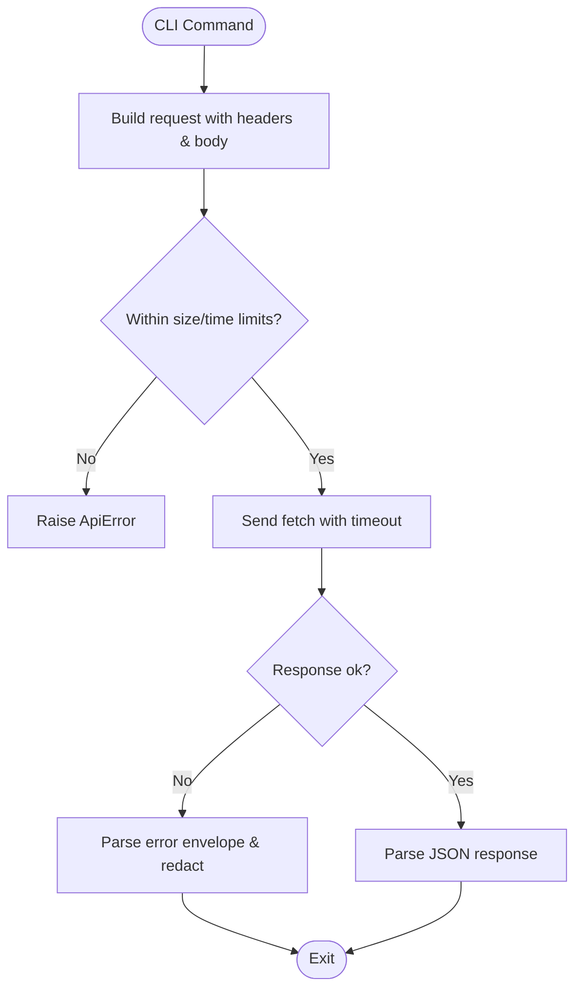
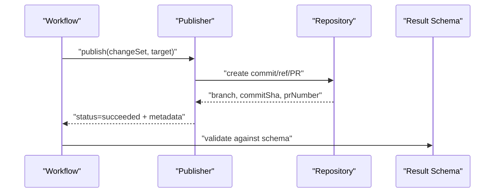
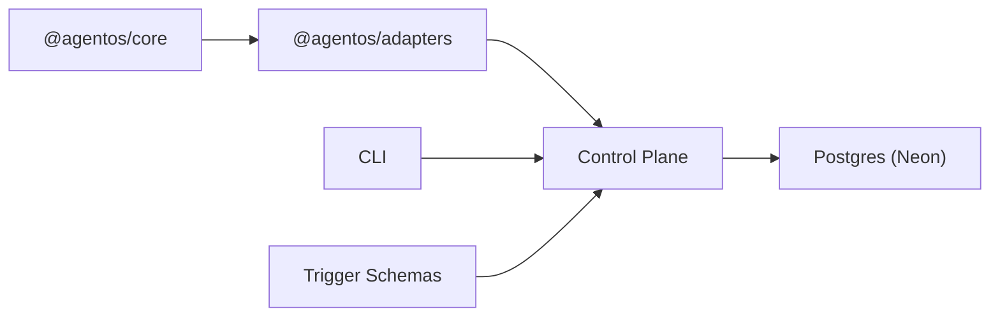

# Publication System

<cite>
**Referenced Files in This Document**
- [artifact-storage.md](file://docs/architecture/artifact-storage.md)
- [artifacts.ts](file://packages/core/src/artifacts.ts)
- [artifact-capability.ts](file://packages/core/src/artifact-capability.ts)
- [in-memory.ts](file://packages/adapters/src/artifacts/in-memory.ts)
- [r2.ts](file://packages/adapters/src/artifacts/r2.ts)
- [manifest.ts](file://packages/adapters/src/artifacts/manifest.ts)
- [neon-repository.ts](file://packages/adapters/src/persistence/neon-repository.ts)
- [artifact-mcp-runtime.ts](file://apps/control-plane/src/application/artifact-mcp-runtime.ts)
- [artifact-cleanup.ts](file://apps/control-plane/src/application/artifact-cleanup.ts)
- [api-client.ts](file://apps/cli/src/api-client.ts)
- [commands.ts](file://apps/cli/src/commands.ts)
- [schemas.ts](file://packages/adapters/src/trigger/schemas.ts)
- [public-types.ts](file://packages/adapters/src/github/public-types.ts)
- [production-composition.ts](file://packages/adapters/src/trigger/production-composition.ts)
- [vercel.json](file://vercel.json)
</cite>

## Table of Contents
1. [Introduction](#introduction)
2. [Project Structure](#project-structure)
3. [Core Components](#core-components)
4. [Architecture Overview](#architecture-overview)
5. [Detailed Component Analysis](#detailed-component-analysis)
6. [Dependency Analysis](#dependency-analysis)
7. [Performance Considerations](#performance-considerations)
8. [Troubleshooting Guide](#troubleshooting-guide)
9. [Conclusion](#conclusion)
10. [Appendices](#appendices)

## Introduction
This document explains the publication system in Agent OS Passerine with a focus on artifact publication workflows, versioning and retention, secure access via capability tokens, storage backends, cleanup and lifecycle management, and operational best practices. It covers how artifacts are prepared, stored, listed, deleted, and cleaned up; how short-lived HMAC capability tokens grant scoped, auditable access to artifact operations; and how the control plane exposes MCP endpoints for agents and cron jobs for retention.

## Project Structure
The publication system spans core types and validation, adapters for storage and persistence, control-plane runtime wiring, CLI client behavior, and trigger schemas for publishing workflows.

**Diagram sources**
- [artifacts.ts:1-159](file://packages/core/src/artifacts.ts#L1-L159)
- [artifact-capability.ts:1-55](file://packages/core/src/artifact-capability.ts#L1-L55)
- [in-memory.ts:61-184](file://packages/adapters/src/artifacts/in-memory.ts#L61-L184)
- [r2.ts:172-186](file://packages/adapters/src/artifacts/r2.ts#L172-L186)
- [manifest.ts:548-580](file://packages/adapters/src/artifacts/manifest.ts#L548-L580)
- [neon-repository.ts:1526-1550](file://packages/adapters/src/persistence/neon-repository.ts#L1526-L1550)
- [artifact-mcp-runtime.ts:82-97](file://apps/control-plane/src/application/artifact-mcp-runtime.ts#L82-L97)
- [artifact-cleanup.ts:35-66](file://apps/control-plane/src/application/artifact-cleanup.ts#L35-L66)
- [api-client.ts:130-245](file://apps/cli/src/api-client.ts#L130-L245)
- [commands.ts:37-92](file://apps/cli/src/commands.ts#L37-L92)
- [schemas.ts:94-123](file://packages/adapters/src/trigger/schemas.ts#L94-L123)
- [public-types.ts:1-28](file://packages/adapters/src/github/public-types.ts#L1-L28)
- [production-composition.ts:174-185](file://packages/adapters/src/trigger/production-composition.ts#L174-L185)

**Section sources**
- [artifact-storage.md:1-42](file://docs/architecture/artifact-storage.md#L1-L42)

## Core Components
- Artifact core: defines scopes, keys, metadata, list/get/put interfaces, preparation/validation, retention classes, and canonical key construction.
- Capability tokens: short-lived HMAC-signed tokens that scope methods (get/put/list), project/run/step, optional artifact prefix, byte limits, call counts, cumulative bytes, and expiry.
- Storage adapters: in-memory and R2 object stores implementing the same store/admin interfaces backed by a manifest store for logical versioning.
- Manifest store: authoritative logical-version ledger ensuring one immutable digest per logical version and safe deletion reservation/finalization.
- Persistence repository: Postgres-backed quota counters and durable leases for cleanup and capability quotas.
- Control-plane MCP runtime: assembles the MCP handler with capability verification, R2 store, and quota store.
- Retention cleanup: cron-triggered job that claims a lease, pages expired artifacts, deletes objects, and records audit metadata.
- CLI API client: enforces request/response size limits, timeouts, and token handling for remote commands.
- Trigger schemas/types: define publication result shapes and GitHub publication phases for workflow integration.

**Section sources**
- [artifacts.ts:30-159](file://packages/core/src/artifacts.ts#L30-L159)
- [artifact-capability.ts:10-55](file://packages/core/src/artifact-capability.ts#L10-L55)
- [in-memory.ts:61-184](file://packages/adapters/src/artifacts/in-memory.ts#L61-L184)
- [r2.ts:172-186](file://packages/adapters/src/artifacts/r2.ts#L172-L186)
- [manifest.ts:548-580](file://packages/adapters/src/artifacts/manifest.ts#L548-L580)
- [neon-repository.ts:1526-1550](file://packages/adapters/src/persistence/neon-repository.ts#L1526-L1550)
- [artifact-mcp-runtime.ts:82-97](file://apps/control-plane/src/application/artifact-mcp-runtime.ts#L82-L97)
- [artifact-cleanup.ts:35-66](file://apps/control-plane/src/application/artifact-cleanup.ts#L35-L66)
- [api-client.ts:130-245](file://apps/cli/src/api-client.ts#L130-L245)
- [schemas.ts:94-123](file://packages/adapters/src/trigger/schemas.ts#L94-L123)
- [public-types.ts:1-28](file://packages/adapters/src/github/public-types.ts#L1-L28)

## Architecture Overview
Agent-facing artifact access is stateless over an MCP Streamable HTTP endpoint. Every operation requires a short-lived HMAC capability bound to purpose, audience, method, project, run, step, optional artifact prefix, byte limits, call limits, expiry, and nonce. Postgres atomically enforces per-capability call and cumulative-byte quotas across serverless cold starts. The manifest in Postgres is the authoritative logical-version ledger; R2 holds content-addressed objects. Deletions reserve then finalize through the manifest, with audit metadata retained even after object removal.

**Diagram sources**
- [artifact-mcp-runtime.ts:82-97](file://apps/control-plane/src/application/artifact-mcp-runtime.ts#L82-L97)
- [artifact-capability.ts:283-351](file://packages/core/src/artifact-capability.ts#L283-L351)
- [neon-repository.ts:191-219](file://packages/adapters/src/persistence/neon-repository.ts#L191-L219)
- [r2.ts:372-389](file://packages/adapters/src/artifacts/r2.ts#L372-L389)
- [manifest.ts:548-580](file://packages/adapters/src/artifacts/manifest.ts#L548-L580)

## Detailed Component Analysis

### Artifact Preparation, Versioning, and Keying
- Keys are canonical and content-addressed, encoding project/run/step, artifactId, version, and SHA-256 digest.
- prepareArtifactPut validates media type, text safety, size, retention class, and computes digest; it sets createdAt and expiresAt based on retention windows.
- validateArtifactMetadata ensures consistency between key and metadata and enforces retention windows.
- Listing supports cursor pagination with normalized limits and prefixes.

**Diagram sources**
- [artifacts.ts:299-345](file://packages/core/src/artifacts.ts#L299-L345)
- [artifacts.ts:347-371](file://packages/core/src/artifacts.ts#L347-L371)
- [artifacts.ts:373-399](file://packages/core/src/artifacts.ts#L373-L399)

**Section sources**
- [artifacts.ts:30-159](file://packages/core/src/artifacts.ts#L30-L159)
- [artifacts.ts:299-399](file://packages/core/src/artifacts.ts#L299-L399)

### Secure Access via Capability Tokens
- Tokens are HMAC-SHA256 signed payloads with strict claim normalization, canonical JSON, base64url encoding, and anti-tamper checks.
- Verification enforces purpose, audience, allowed methods, scoping to project/run/step/prefix, byte limits, time bounds, and nonces.
- Keys support rotation; verifiers accept multiple keys by keyId.

**Diagram sources**
- [artifact-capability.ts:220-237](file://packages/core/src/artifact-capability.ts#L220-L237)
- [artifact-capability.ts:283-351](file://packages/core/src/artifact-capability.ts#L283-L351)

**Section sources**
- [artifact-capability.ts:1-55](file://packages/core/src/artifact-capability.ts#L1-L55)
- [artifact-capability.ts:151-212](file://packages/core/src/artifact-capability.ts#L151-L212)
- [artifact-capability.ts:220-351](file://packages/core/src/artifact-capability.ts#L220-L351)

### Storage Backends and Logical Versioning
- In-memory store: fast dev/test implementation with in-process maps and cursors; enforces scope checks, integrity verification on read, and atomic write leases via manifest.
- R2 store: S3-compatible adapter using AWS SDK with checksums set to WHEN_REQUIRED; constructs account-scoped endpoints and rejects overrides; implements retries and transient error handling.
- Manifest store: provides beginWrite/finishWrite, get/list/listExpired, and delete reservation/finalization to ensure exactly-one binding per logical version and safe deletions.

**Diagram sources**
- [in-memory.ts:74-118](file://packages/adapters/src/artifacts/in-memory.ts#L74-L118)
- [r2.ts:372-389](file://packages/adapters/src/artifacts/r2.ts#L372-L389)
- [manifest.ts:501-538](file://packages/adapters/src/artifacts/manifest.ts#L501-L538)

**Section sources**
- [in-memory.ts:61-184](file://packages/adapters/src/artifacts/in-memory.ts#L61-L184)
- [r2.ts:129-186](file://packages/adapters/src/artifacts/r2.ts#L129-L186)
- [r2.ts:372-389](file://packages/adapters/src/artifacts/r2.ts#L372-L389)
- [manifest.ts:501-580](file://packages/adapters/src/artifacts/manifest.ts#L501-L580)

### Lifecycle Management and Cleanup
- Retention classes define maximum lifetimes; working artifacts expire after 30 days, source bundles and cloud-session uploads within ~23h45m to leave safety margins.
- Cron triggers schedule cleanup every 10 minutes; the job claims a durable Postgres lease, pages expired artifacts, deletes objects, and records reasons/timestamps.
- Concurrency groups are abortable and bounded by time budgets and lease durations.

**Diagram sources**
- [vercel.json:1-12](file://vercel.json#L1-L12)
- [artifact-cleanup.ts:35-66](file://apps/control-plane/src/application/artifact-cleanup.ts#L35-L66)
- [neon-repository.ts:1526-1550](file://packages/adapters/src/persistence/neon-repository.ts#L1526-L1550)
- [manifest.ts:548-580](file://packages/adapters/src/artifacts/manifest.ts#L548-L580)

**Section sources**
- [artifact-storage.md:19-36](file://docs/architecture/artifact-storage.md#L19-L36)
- [artifact-cleanup.ts:35-66](file://apps/control-plane/src/application/artifact-cleanup.ts#L35-L66)
- [manifest.ts:548-580](file://packages/adapters/src/artifacts/manifest.ts#L548-L580)
- [vercel.json:1-12](file://vercel.json#L1-L12)

### MCP Endpoint Assembly and Quotas
- The MCP runtime loads capability keys from environment, builds R2 options, and wires the handler with capability verification and Postgres-backed quota store.
- Quota enforcement uses Postgres to atomically track calls and cumulative bytes per capability, preventing abuse across cold starts.

**Diagram sources**
- [artifact-mcp-runtime.ts:18-97](file://apps/control-plane/src/application/artifact-mcp-runtime.ts#L18-L97)
- [neon-repository.ts:191-219](file://packages/adapters/src/persistence/neon-repository.ts#L191-L219)

**Section sources**
- [artifact-mcp-runtime.ts:18-97](file://apps/control-plane/src/application/artifact-mcp-runtime.ts#L18-L97)
- [neon-repository.ts:191-219](file://packages/adapters/src/persistence/neon-repository.ts#L191-L219)

### CLI Interaction Patterns
- The CLI API client enforces HTTPS (except localhost), token presence and format, request/response size limits, timeouts, and redacts secrets in errors.
- Commands map to remote API paths; while artifact-specific commands are not shown here, the client pattern applies to all remote interactions.

**Diagram sources**
- [api-client.ts:130-245](file://apps/cli/src/api-client.ts#L130-L245)
- [commands.ts:37-92](file://apps/cli/src/commands.ts#L37-L92)

**Section sources**
- [api-client.ts:130-245](file://apps/cli/src/api-client.ts#L130-L245)
- [commands.ts:37-92](file://apps/cli/src/commands.ts#L37-L92)

### Publication Workflows and Versioning Strategies
- Workflow outputs include draft and local publication results with branch, commit SHA, and PR details where applicable.
- Public types define publication phases from claimed to succeeded or failure states.
- Production composition binds publishers to repositories and audiences, enabling trusted publishing flows.

**Diagram sources**
- [schemas.ts:94-123](file://packages/adapters/src/trigger/schemas.ts#L94-L123)
- [public-types.ts:1-28](file://packages/adapters/src/github/public-types.ts#L1-L28)
- [production-composition.ts:174-185](file://packages/adapters/src/trigger/production-composition.ts#L174-L185)

**Section sources**
- [schemas.ts:94-123](file://packages/adapters/src/trigger/schemas.ts#L94-L123)
- [public-types.ts:1-28](file://packages/adapters/src/github/public-types.ts#L1-L28)
- [production-composition.ts:174-185](file://packages/adapters/src/trigger/production-composition.ts#L174-L185)

## Dependency Analysis
- Core depends only on Node crypto for hashing/signing; adapters depend on core for types and utilities.
- Control-plane runtime depends on adapters to assemble MCP handler and on persistence for Postgres-backed stores.
- CLI depends on core configuration constants and emits bounded requests to the control plane.
- Triggers produce standardized publication results consumed by downstream systems.

**Diagram sources**
- [artifacts.ts:1-159](file://packages/core/src/artifacts.ts#L1-L159)
- [artifact-capability.ts:1-55](file://packages/core/src/artifact-capability.ts#L1-L55)
- [artifact-mcp-runtime.ts:82-97](file://apps/control-plane/src/application/artifact-mcp-runtime.ts#L82-L97)
- [api-client.ts:130-245](file://apps/cli/src/api-client.ts#L130-L245)
- [schemas.ts:94-123](file://packages/adapters/src/trigger/schemas.ts#L94-L123)

**Section sources**
- [artifact-mcp-runtime.ts:82-97](file://apps/control-plane/src/application/artifact-mcp-runtime.ts#L82-L97)
- [api-client.ts:130-245](file://apps/cli/src/api-client.ts#L130-L245)

## Performance Considerations
- Use cursor-based listing with appropriate limits to avoid large scans.
- Keep capability tokens short-lived and scoped to minimize overhead and risk.
- Tune cleanup concurrency and page limits to balance throughput and budget constraints.
- Prefer direct artifact-store contract for large artifacts beyond MCP caps; chunking can be introduced later.
- Content identity relies on SHA-256 recomputation; avoid relying on provider checksums for application identity.

[No sources needed since this section provides general guidance]

## Troubleshooting Guide
- Capability denied: verify token signature, purpose, audience, method, scoping fields, and expiry; check key rotation and nonce validity.
- Scope denied: ensure artifact key belongs to requested project/run/step.
- Integrity errors: re-read object and recompute SHA-256; confirm manifest digest matches stored bytes.
- Too large: enforce request/response limits in CLI and MCP caps; use direct store contract for larger payloads.
- Cleanup skipped: ensure lease acquisition succeeds and time budget allows processing; inspect cron secret and schedule.

**Section sources**
- [artifact-capability.ts:283-351](file://packages/core/src/artifact-capability.ts#L283-L351)
- [in-memory.ts:119-157](file://packages/adapters/src/artifacts/in-memory.ts#L119-L157)
- [api-client.ts:130-245](file://apps/cli/src/api-client.ts#L130-L245)
- [artifact-cleanup.ts:35-66](file://apps/control-plane/src/application/artifact-cleanup.ts#L35-L66)

## Conclusion
The publication system combines robust artifact preparation and canonical keying, secure capability tokens for fine-grained access, a reliable manifest-backed logical versioning layer, and scalable storage adapters. Lifecycle management is automated via cron-driven cleanup with durable leases and bounded concurrency. The CLI enforces safe interaction patterns, and trigger schemas standardize publication outcomes. Together, these components provide a secure, performant, and maintainable foundation for artifact distribution in Agent OS Passerine.

[No sources needed since this section summarizes without analyzing specific files]

## Appendices

### Security Considerations and Best Practices
- Always issue capability tokens with minimal scopes, short lifetimes, and strict byte/call limits.
- Rotate capability keys and configure verifiers to accept multiple keys during transitions.
- Enforce HTTPS for CLI connections except localhost; never embed credentials in URLs.
- Use separate credentials for agent-facing reads/writes versus admin deletions.
- Rely on SHA-256 for content identity; do not trust provider checksums for application logic.

**Section sources**
- [artifact-capability.ts:151-212](file://packages/core/src/artifact-capability.ts#L151-L212)
- [artifact-mcp-runtime.ts:18-97](file://apps/control-plane/src/application/artifact-mcp-runtime.ts#L18-L97)
- [api-client.ts:79-95](file://apps/cli/src/api-client.ts#L79-L95)
- [artifact-storage.md:19-36](file://docs/architecture/artifact-storage.md#L19-L36)

### Examples: Publishing Artifacts Programmatically and Through the CLI
- Programmatic publish: construct an ArtifactPutRequest with scope, artifactId, version, bytes, mediaType, and optional retentionClass; call prepareArtifactPut and persist via store.put; record metadata in the manifest.
- CLI usage: build an ApiClient with a valid token and URL; send bounded requests to control-plane endpoints; handle responses and errors with redacted messages.

**Section sources**
- [artifacts.ts:299-345](file://packages/core/src/artifacts.ts#L299-L345)
- [in-memory.ts:74-118](file://packages/adapters/src/artifacts/in-memory.ts#L74-L118)
- [api-client.ts:130-245](file://apps/cli/src/api-client.ts#L130-L245)

### Artifact Integrity Verification and Caching Strategies
- Verify integrity on read by recomputing SHA-256 and comparing to metadata digest.
- Cache at the application layer with cache keys derived from canonical artifact keys; invalidate on new versions or expiration.
- For MCP, respect per-call byte limits and consider client-side caching to reduce repeated downloads.

**Section sources**
- [in-memory.ts:119-157](file://packages/adapters/src/artifacts/in-memory.ts#L119-L157)
- [artifact-storage.md:1-18](file://docs/architecture/artifact-storage.md#L1-L18)