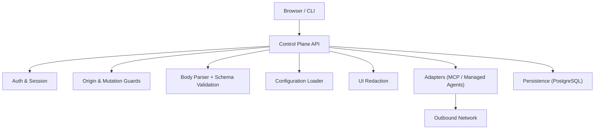
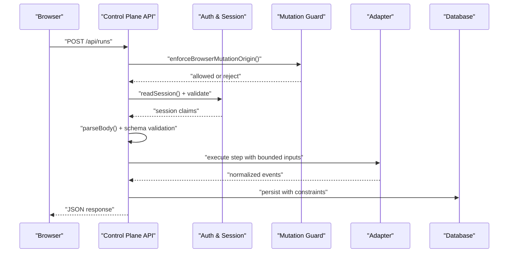
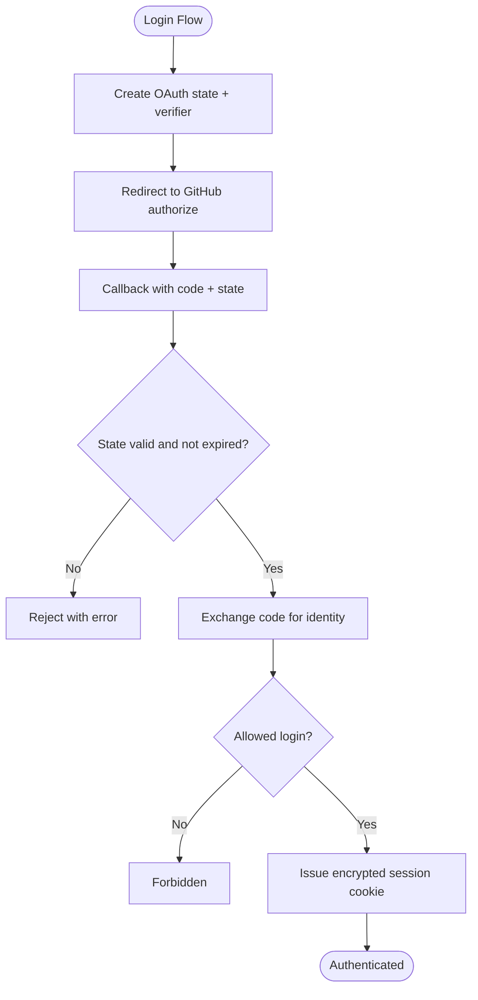
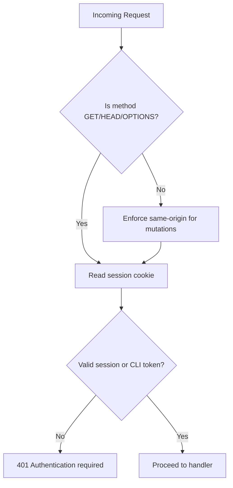
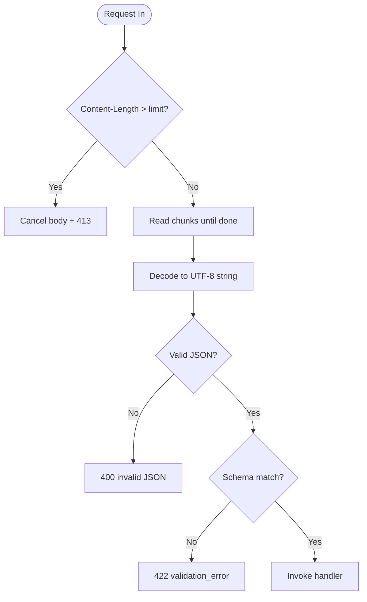
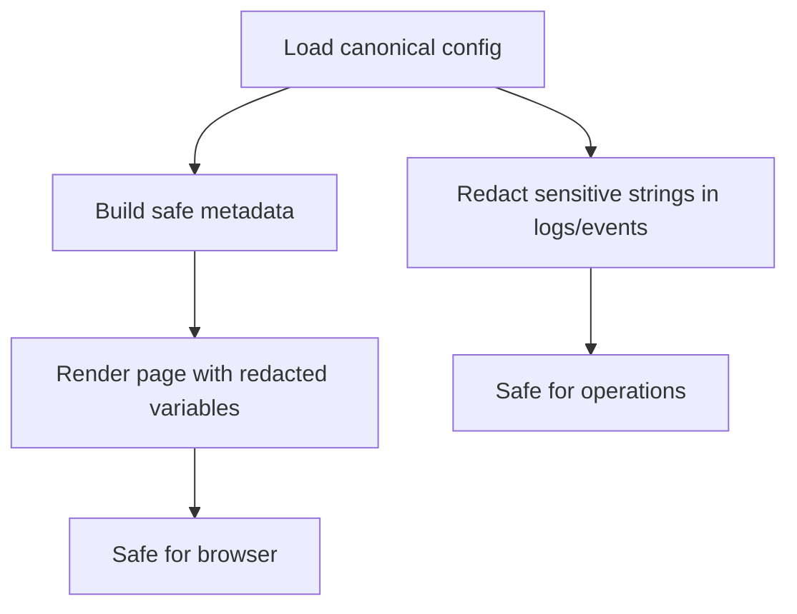
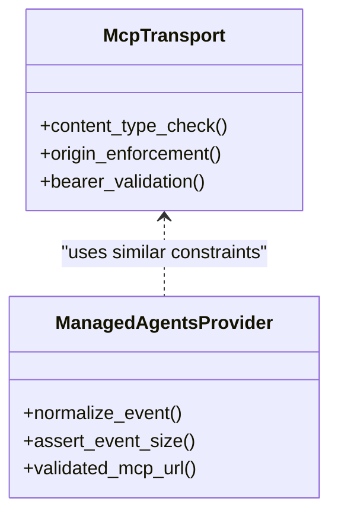
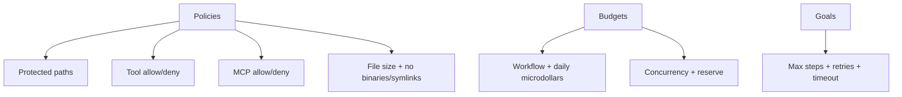
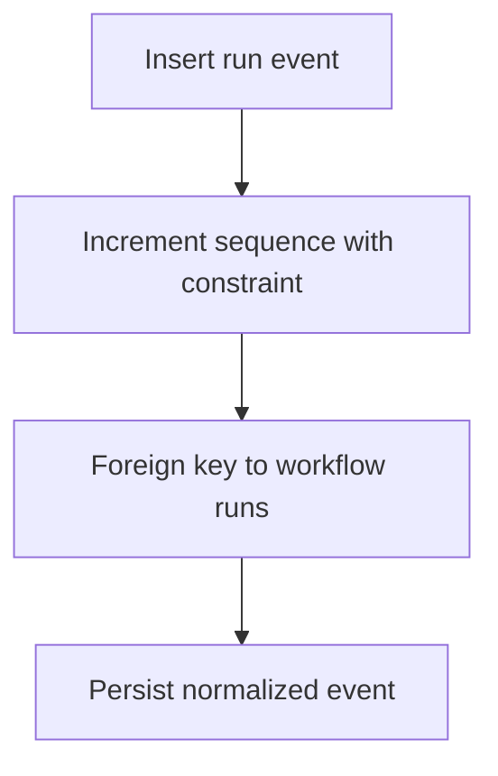
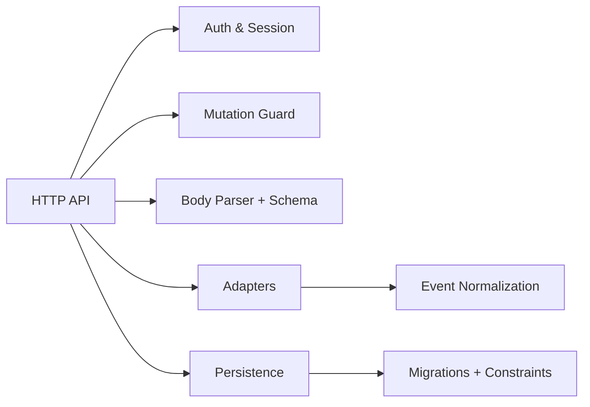

# Security Hardening

<cite>
**Referenced Files in This Document**
- [threat-model.md](file://docs/architecture/threat-model.md)
- [auth.ts](file://apps/control-plane/src/auth/auth.ts)
- [guard.ts](file://apps/control-plane/src/auth/guard.ts)
- [authenticated.ts](file://apps/control-plane/src/http/authenticated.ts)
- [api.ts](file://apps/control-plane/src/http/api.ts)
- [contracts.ts](file://apps/control-plane/src/http/contracts.ts)
- [redact-configuration.ts](file://apps/control-plane/src/ui/redact-configuration.ts)
- [configuration-loader.ts](file://apps/control-plane/src/config/configuration-loader.ts)
- [passerine.yaml](file://agentos/passerine.yaml)
- [agent-os.yaml](file://agentos/agent-os.yaml)
- [mcp.ts](file://packages/adapters/src/artifacts/mcp.ts)
- [provider.ts](file://packages/adapters/src/managed-agents/provider.ts)
- [normalization.ts](file://packages/adapters/src/managed-agents/normalization.ts)
- [errors.ts](file://packages/adapters/src/managed-agents/errors.ts)
- [postgres-store.ts](file://packages/adapters/src/github/postgres-store.ts)
- [instrumentation.ts](file://apps/control-plane/instrumentation.ts)
- [0005_nervous_violations.sql](file://drizzle/0005_nervous_violations.sql)
</cite>

## Table of Contents
1. [Introduction](#introduction)
2. [Project Structure](#project-structure)
3. [Core Components](#core-components)
4. [Architecture Overview](#architecture-overview)
5. [Detailed Component Analysis](#detailed-component-analysis)
6. [Dependency Analysis](#dependency-analysis)
7. [Performance Considerations](#performance-considerations)
8. [Troubleshooting Guide](#troubleshooting-guide)
9. [Conclusion](#conclusion)
10. [Appendices](#appendices)

## Introduction
This document provides security hardening guidance for Agent OS Passerine deployments. It synthesizes the project’s threat model, authentication and authorization controls, input validation, output sanitization, secret handling, network boundaries, runtime policies, persistence safeguards, and operational practices into a production-ready security posture. The goal is to help operators secure the control plane, CLI interactions, agent orchestration, adapters, and external integrations against common threats such as cross-tenant access, prompt injection, SSRF, replay attacks, path traversal, resource exhaustion, and secret leakage.

## Project Structure
Agent OS Passerine separates concerns across:
- Control plane HTTP API with authentication, CSRF protection, body parsing, and schema validation
- Authentication and session management using encrypted cookies and strict origin checks
- Configuration loading that enforces environment requirements and exposes safe metadata
- UI redaction utilities to prevent secrets from rendering in browser contexts
- Adapters for MCP artifacts and managed agents with strict content-type, origin, bearer token, URL, and event size constraints
- Policies and budgets defined declaratively for agent tooling, networking, file sizes, and concurrency
- Persistence layer with migrations and integrity constraints

**Diagram sources**
- [api.ts:28-91](file://apps/control-plane/src/http/api.ts#L28-L91)
- [guard.ts:17-61](file://apps/control-plane/src/auth/guard.ts#L17-L61)
- [auth.ts:167-230](file://apps/control-plane/src/auth/auth.ts#L167-L230)
- [configuration-loader.ts:34-77](file://apps/control-plane/src/config/configuration-loader.ts#L34-L77)
- [redact-configuration.ts:16-34](file://apps/control-plane/src/ui/redact-configuration.ts#L16-L34)
- [mcp.ts:122-170](file://packages/adapters/src/artifacts/mcp.ts#L122-L170)
- [provider.ts:1495-1538](file://packages/adapters/src/managed-agents/provider.ts#L1495-L1538)
- [0005_nervous_violations.sql:1-14](file://drizzle/0005_nervous_violations.sql#L1-L14)

**Section sources**
- [threat-model.md:25-86](file://docs/architecture/threat-model.md#L25-L86)

## Core Components
- Authentication and sessions: Encrypted cookies, short-lived OAuth state, strict allowed login, HTTPS-only public URLs, and safe redirect handling.
- Request guards: Bearer token verification for CLI, session-based auth for browsers, and mutation origin enforcement to mitigate CSRF-like risks.
- Input validation: Strict JSON parsing with size limits, schema validation via Zod, and query parameter allowlisting or rejection.
- Output sanitization: Redaction of configuration variables for display and sensitive data patterns in logs/events.
- Adapter security: Content-type and accept enforcement, origin allowlists, bounded bearer tokens, validated URLs, and event size limits.
- Runtime policies: Tool and MCP allow/deny lists, protected paths, symlink and binary restrictions, file size caps, and budget/concurrency controls.
- Persistence integrity: Migrations with constraints and sequences to ensure ordering and integrity.

**Section sources**
- [auth.ts:14-230](file://apps/control-plane/src/auth/auth.ts#L14-L230)
- [guard.ts:17-61](file://apps/control-plane/src/auth/guard.ts#L17-L61)
- [api.ts:28-91](file://apps/control-plane/src/http/api.ts#L28-L91)
- [contracts.ts:373-408](file://apps/control-plane/src/http/contracts.ts#L373-L408)
- [redact-configuration.ts:16-34](file://apps/control-plane/src/ui/redact-configuration.ts#L16-L34)
- [mcp.ts:122-170](file://packages/adapters/src/artifacts/mcp.ts#L122-L170)
- [passerine.yaml:218-244](file://agentos/passerine.yaml#L218-L244)
- [agent-os.yaml:31-57](file://agentos/agent-os.yaml#L31-L57)
- [0005_nervous_violations.sql:1-14](file://drizzle/0005_nervous_violations.sql#L1-L14)

## Architecture Overview
The control plane enforces trust boundaries at each interface:
- Browser-to-control-plane: Secure cookies, same-origin mutation checks, and server-side authorization on every action.
- CLI-to-control-plane: Bearer token comparison using constant-time equality, least-privilege tokens, and explicit endpoint configuration.
- Core-to-adapters: Outbound requests validated by content-type, origin, bearer token, and URL constraints; provider responses normalized and bounded.
- Runtime-to-persistence: Tenant-scoped keys, migration-driven schema, and integrity constraints.

**Diagram sources**
- [guard.ts:17-61](file://apps/control-plane/src/auth/guard.ts#L17-L61)
- [auth.ts:323-351](file://apps/control-plane/src/auth/auth.ts#L323-L351)
- [api.ts:28-91](file://apps/control-plane/src/http/api.ts#L28-L91)
- [normalization.ts:335-363](file://packages/adapters/src/managed-agents/normalization.ts#L335-L363)
- [0005_nervous_violations.sql:1-14](file://drizzle/0005_nervous_violations.sql#L1-L14)

## Detailed Component Analysis

### Authentication and Session Management
- Uses AES-256-GCM sealed cookies with random nonces and auth tags for confidentiality and integrity.
- Enforces minimum session secret length and requires HTTPS in production for public URLs.
- Validates OAuth state with time-bounded TTL and safe return-to redirects.
- Issues short-lived sessions and rejects tampered or expired values.

**Diagram sources**
- [auth.ts:239-315](file://apps/control-plane/src/auth/auth.ts#L239-L315)
- [auth.ts:323-351](file://apps/control-plane/src/auth/auth.ts#L323-L351)

**Section sources**
- [auth.ts:14-230](file://apps/control-plane/src/auth/auth.ts#L14-L230)
- [auth.ts:323-351](file://apps/control-plane/src/auth/auth.ts#L323-L351)

### API Access Control and CSRF Mitigation
- Accepts Bearer tokens for CLI and validates them with constant-time comparison to avoid timing attacks.
- For browser mutations, enforces same-origin checks using Origin and Sec-Fetch-Site headers.
- Requires authentication for all endpoints and rejects webhooks without signatures.

**Diagram sources**
- [guard.ts:17-61](file://apps/control-plane/src/auth/guard.ts#L17-L61)
- [authenticated.ts:4-17](file://apps/control-plane/src/http/authenticated.ts#L4-L17)

**Section sources**
- [guard.ts:17-61](file://apps/control-plane/src/auth/guard.ts#L17-L61)
- [authenticated.ts:4-17](file://apps/control-plane/src/http/authenticated.ts#L4-L17)

### Input Validation and Body Parsing
- Enforces maximum request body size before reading the stream to prevent memory exhaustion.
- Parses UTF-8 JSON strictly and validates payloads against Zod schemas.
- Allows only whitelisted query parameters or rejects unknown ones.

**Diagram sources**
- [api.ts:28-91](file://apps/control-plane/src/http/api.ts#L28-L91)
- [contracts.ts:384-408](file://apps/control-plane/src/http/contracts.ts#L384-L408)

**Section sources**
- [api.ts:28-91](file://apps/control-plane/src/http/api.ts#L28-L91)
- [contracts.ts:373-408](file://apps/control-plane/src/http/contracts.ts#L373-L408)

### Secret Handling and Safe Display
- Configuration loader enforces required config paths in production and returns safe metadata without secrets.
- UI redactor masks environment variable values when rendering applied configurations to the browser.
- Centralized text redaction removes credentials embedded in URLs and known secret patterns from logs and events.

**Diagram sources**
- [configuration-loader.ts:34-77](file://apps/control-plane/src/config/configuration-loader.ts#L34-L77)
- [redact-configuration.ts:16-34](file://apps/control-plane/src/ui/redact-configuration.ts#L16-L34)
- [control-plane-service.ts:148-189](file://apps/control-plane/src/application/control-plane-service.ts#L148-L189)

**Section sources**
- [configuration-loader.ts:34-77](file://apps/control-plane/src/config/configuration-loader.ts#L34-L77)
- [redact-configuration.ts:16-34](file://apps/control-plane/src/ui/redact-configuration.ts#L16-L34)
- [control-plane-service.ts:148-189](file://apps/control-plane/src/application/control-plane-service.ts#L148-L189)

### Network Security and Adapter Boundaries
- MCP artifact transport enforces content-type and accept headers, origin allowlist, and bounded bearer tokens.
- Managed agents normalize provider events with strict types, size limits, and safe codes, preventing sensitive details from leaking.
- Artifact MCP URLs are validated to HTTPS-only without credentials or fragments.

**Diagram sources**
- [mcp.ts:122-170](file://packages/adapters/src/artifacts/mcp.ts#L122-L170)
- [normalization.ts:335-363](file://packages/adapters/src/managed-agents/normalization.ts#L335-L363)
- [provider.ts:1495-1538](file://packages/adapters/src/managed-agents/provider.ts#L1495-L1538)

**Section sources**
- [mcp.ts:122-170](file://packages/adapters/src/artifacts/mcp.ts#L122-L170)
- [normalization.ts:335-363](file://packages/adapters/src/managed-agents/normalization.ts#L335-L363)
- [provider.ts:1495-1538](file://packages/adapters/src/managed-agents/provider.ts#L1495-L1538)

### Runtime Policies and Resource Limits
- Declarative policies protect critical repository paths, disallow binaries and symlinks, cap file sizes, and restrict tools and MCPs via allow/deny lists.
- Budgets constrain workflow cost, daily spend, concurrency, and admission reserves to prevent abuse and runaway costs.
- Goals bound steps, retries, and timeouts to contain execution scope.

**Diagram sources**
- [passerine.yaml:218-244](file://agentos/passerine.yaml#L218-L244)
- [agent-os.yaml:31-57](file://agentos/agent-os.yaml#L31-L57)

**Section sources**
- [passerine.yaml:218-244](file://agentos/passerine.yaml#L218-L244)
- [agent-os.yaml:31-57](file://agentos/agent-os.yaml#L31-L57)

### Persistence Integrity and Auditing
- Migrations define constraints and sequences to enforce positive integers and safe ranges for event sequencing.
- Foreign key relationships cascade deletes to maintain referential integrity.
- Event normalization ensures consistent, bounded, and safe structures for downstream processing.

**Diagram sources**
- [0005_nervous_violations.sql:1-14](file://drizzle/0005_nervous_violations.sql#L1-L14)
- [normalization.ts:335-363](file://packages/adapters/src/managed-agents/normalization.ts#L335-L363)

**Section sources**
- [0005_nervous_violations.sql:1-14](file://drizzle/0005_nervous_violations.sql#L1-L14)
- [normalization.ts:335-363](file://packages/adapters/src/managed-agents/normalization.ts#L335-L363)

## Dependency Analysis
Security-critical dependencies form a chain:
- HTTP handlers depend on authentication guards and body parsers.
- Adapters rely on normalized events and strict URL/content validations.
- Persistence relies on migrations and typed repositories.

**Diagram sources**
- [api.ts:28-91](file://apps/control-plane/src/http/api.ts#L28-L91)
- [guard.ts:17-61](file://apps/control-plane/src/auth/guard.ts#L17-L61)
- [normalization.ts:335-363](file://packages/adapters/src/managed-agents/normalization.ts#L335-L363)
- [0005_nervous_violations.sql:1-14](file://drizzle/0005_nervous_violations.sql#L1-L14)

**Section sources**
- [api.ts:28-91](file://apps/control-plane/src/http/api.ts#L28-L91)
- [guard.ts:17-61](file://apps/control-plane/src/auth/guard.ts#L17-L61)
- [normalization.ts:335-363](file://packages/adapters/src/managed-agents/normalization.ts#L335-L363)
- [0005_nervous_violations.sql:1-14](file://drizzle/0005_nervous_violations.sql#L1-L14)

## Performance Considerations
- Streamed body parsing prevents large payloads from allocating excessive memory.
- Early content-length checks cancel streams quickly when over limits.
- Event size assertions and bounded strings reduce memory pressure in adapters.
- Budgets and concurrency limits throttle resource usage at the policy level.

[No sources needed since this section provides general guidance]

## Troubleshooting Guide
Common issues and mitigations:
- Authentication failures: Ensure AGENTOS_SESSION_SECRET meets minimum length and AGENTOS_PUBLIC_URL is HTTPS in production; verify CLI token matches configured value.
- Cross-origin mutation rejections: Confirm Origin and Sec-Fetch-Site headers align with expected origin for browser mutations.
- Payload too large: Reduce request bodies or adjust max body limits per endpoint contract.
- Query parameter errors: Only use explicitly allowed query parameters; remove unknown keys.
- Provider event errors: Normalize events through adapter layers; check event size limits and supported error codes.
- Persistence conflicts: Review database constraints and foreign keys; handle conflict codes appropriately.

**Section sources**
- [auth.ts:73-157](file://apps/control-plane/src/auth/auth.ts#L73-L157)
- [guard.ts:17-61](file://apps/control-plane/src/auth/guard.ts#L17-L61)
- [api.ts:28-91](file://apps/control-plane/src/http/api.ts#L28-L91)
- [contracts.ts:384-408](file://apps/control-plane/src/http/contracts.ts#L384-L408)
- [errors.ts:27-51](file://packages/adapters/src/managed-agents/errors.ts#L27-L51)
- [postgres-store.ts:138-174](file://packages/adapters/src/github/postgres-store.ts#L138-L174)

## Conclusion
Agent OS Passerine implements layered security controls across authentication, authorization, input validation, output sanitization, adapter boundaries, runtime policies, and persistence integrity. By enforcing strict origins, encrypted sessions, bounded inputs, redacted outputs, and policy-driven resource limits, the system mitigates many high-risk attack vectors. Operators should continuously validate these controls in production, monitor logs for anomalies, and keep policies and budgets aligned with organizational risk tolerance.

[No sources needed since this section summarizes without analyzing specific files]

## Appendices

### Threat Model Summary
- Trust boundaries include browser/operator to control plane, CLI to control plane, delivery surfaces to core, core to agents/models/tools, core to adapters/providers, runtime to persistence, runtime to repository/filesystem, and supply-chain boundaries.
- Required controls encompass secure sessions, server-side authorization, CSRF protection, schema validation, output encoding, rate limits, least-privilege tokens, scoped approvals, audit records, outbound destination constraints, webhook signature verification, tenant isolation, encryption, migration review, backups, retention rules, and CI security hygiene.

**Section sources**
- [threat-model.md:25-86](file://docs/architecture/threat-model.md#L25-L86)

### Operational Notes
- Local reconciliation loop registration is intentionally disabled in production and edge runtimes to avoid unintended side effects; production reconciles via cron.

**Section sources**
- [instrumentation.ts:12-39](file://apps/control-plane/instrumentation.ts#L12-L39)