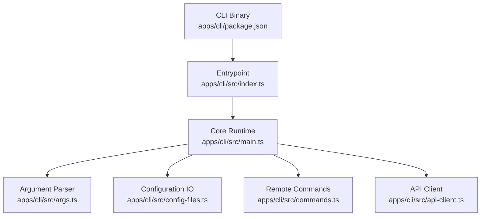
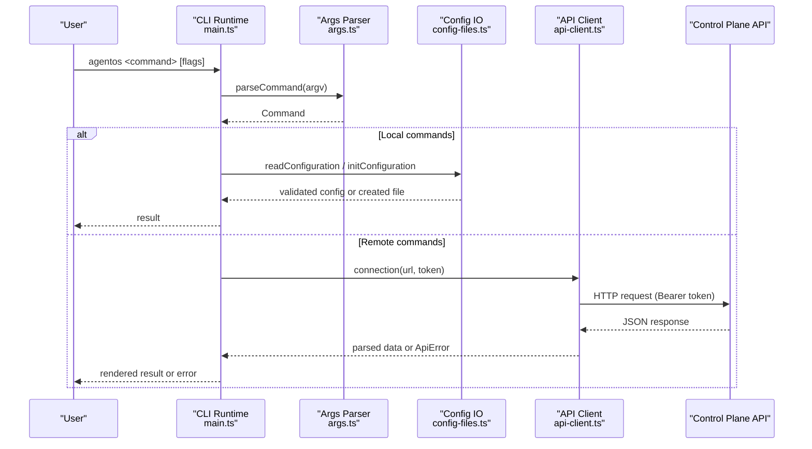
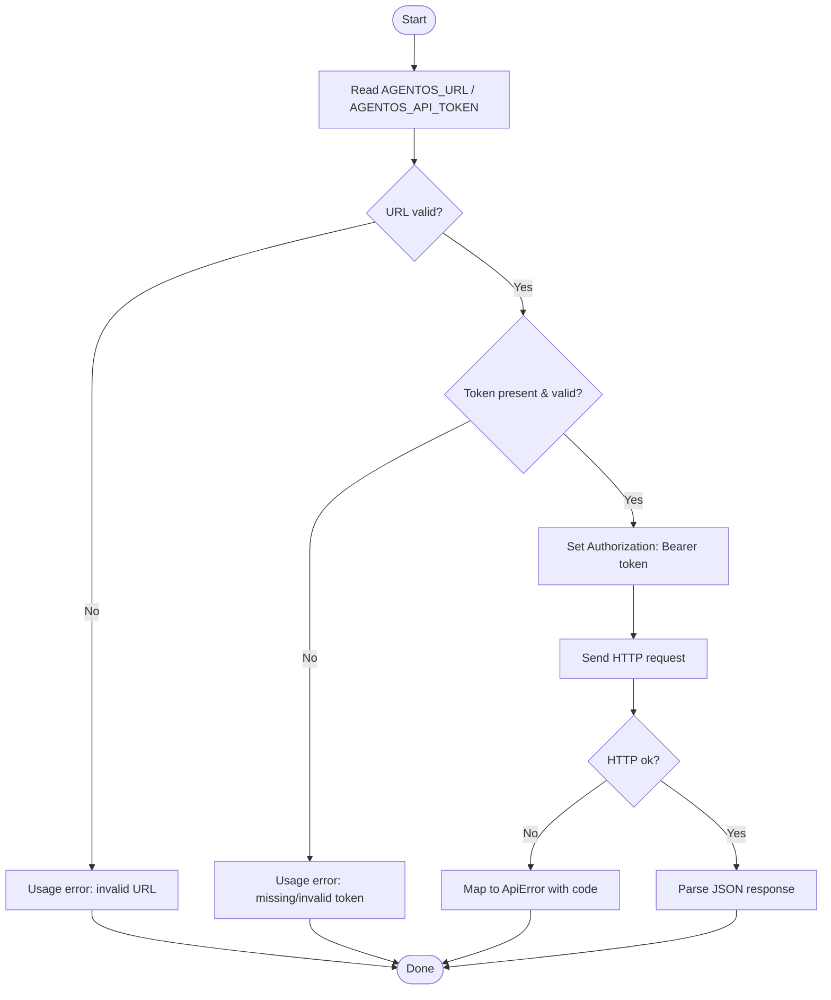
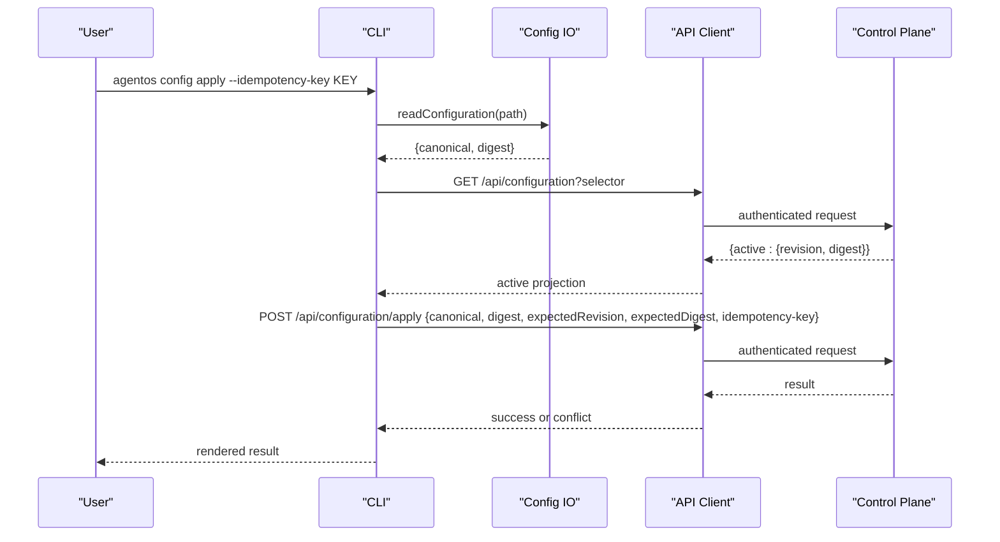
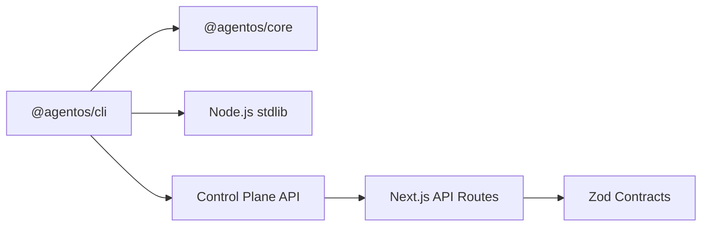

# CLI Overview

<cite>
**Referenced Files in This Document**
- [index.ts](file://apps/cli/src/index.ts)
- [main.ts](file://apps/cli/src/main.ts)
- [args.ts](file://apps/cli/src/args.ts)
- [commands.ts](file://apps/cli/src/commands.ts)
- [api-client.ts](file://apps/cli/src/api-client.ts)
- [config-files.ts](file://apps/cli/src/config-files.ts)
- [package.json](file://apps/cli/package.json)
- [README.md](file://agentos/README.md)
- [root README.md](file://README.md)
- [contracts.ts](file://apps/control-plane/src/http/contracts.ts)
- [configuration route.ts](file://apps/control-plane/app/api/configuration/route.ts)
- [runs route.ts](file://apps/control-plane/app/api/runs/route.ts)
- [inbox route.ts](file://apps/control-plane/app/api/inbox/route.ts)
</cite>

## Table of Contents
1. Introduction
2. Project Structure
3. Core Components
4. Architecture Overview
5. Detailed Component Analysis
6. Dependency Analysis
7. Performance Considerations
8. Troubleshooting Guide
9. Conclusion

## Introduction
The Agent OS Passerine CLI is a command-line interface for managing projects, workflows, and configurations through a control plane. It supports local configuration management (init, validate, plan, apply) and remote operations to start runs, list or cancel runs, and interact with an inbox for approvals and replies. The CLI enforces secure authentication via API tokens, validates inputs, and produces stable machine-readable output suitable for automation.

Key capabilities:
- Initialize a project configuration file safely within a repository workspace
- Validate and plan configuration changes against the active configuration on the server
- Apply configuration changes with idempotency and conflict detection
- Start feature and goal runs with required digests and metadata
- List, show, and cancel runs
- List inbox items, reply to messages, and approve or reject approvals

Installation and basic usage are described in the root README and agentos README.

**Section sources**
- [root README.md:1-67](file://README.md#L1-L67)
- [agentos README.md:1-38](file://agentos/README.md#L1-L38)

## Project Structure
The CLI is implemented as a Node.js package that exposes a binary named agentos. The entrypoint wires process I/O to the core runtime, which parses arguments, resolves configuration files, executes commands locally or remotely, and renders results.

**Diagram sources**
- [package.json:1-19](file://apps/cli/package.json#L1-L19)
- [index.ts:1-29](file://apps/cli/src/index.ts#L1-L29)
- [main.ts:1-323](file://apps/cli/src/main.ts#L1-L323)
- [args.ts:1-359](file://apps/cli/src/args.ts#L1-L359)
- [config-files.ts:1-295](file://apps/cli/src/config-files.ts#L1-L295)
- [commands.ts:1-93](file://apps/cli/src/commands.ts#L1-L93)
- [api-client.ts:1-245](file://apps/cli/src/api-client.ts#L1-L245)

**Section sources**
- [package.json:1-19](file://apps/cli/package.json#L1-L19)
- [index.ts:1-29](file://apps/cli/src/index.ts#L1-L29)
- [main.ts:1-323](file://apps/cli/src/main.ts#L1-L323)

## Core Components
- Entrypoint and I/O wiring: reads stdin safely, sets up stdout/stderr, and delegates to the runtime.
- Argument parsing and validation: strict positional groups and flags; enforces allowed flags per command and validates IDs, digests, and JSON criteria.
- Configuration management: safe initialization, bounded reading, canonicalization, and digest computation; integrates with workspace root discovery and trusted directory checks.
- Remote command execution: maps CLI commands to HTTP requests with idempotency keys and error normalization.
- API client: enforces URL scheme, token format, request/response size limits, timeouts, and redacts secrets in errors.

**Section sources**
- [index.ts:1-29](file://apps/cli/src/index.ts#L1-L29)
- [args.ts:1-359](file://apps/cli/src/args.ts#L1-L359)
- [config-files.ts:1-295](file://apps/cli/src/config-files.ts#L1-L295)
- [commands.ts:1-93](file://apps/cli/src/commands.ts#L1-L93)
- [api-client.ts:1-245](file://apps/cli/src/api-client.ts#L1-L245)

## Architecture Overview
The CLI follows a clear separation between local and remote operations:
- Local-only commands: init, config validate, config plan (plan compares local config with server state).
- Remote commands: feature/goal start, runs list/show/cancel, inbox list/reply/approve/reject.

Authentication and configuration flow:
- Authentication: requires AGENTOS_URL and AGENTOS_API_TOKEN (or --url/--token flags). Non-local URLs must use HTTPS. Requests include a Bearer token header.
- Configuration: defaults to agentos/agent-os.yaml; supports --config PATH resolved from the repository root with strict trust checks.

**Diagram sources**
- [main.ts:186-279](file://apps/cli/src/main.ts#L186-L279)
- [args.ts:216-359](file://apps/cli/src/args.ts#L216-L359)
- [config-files.ts:207-234](file://apps/cli/src/config-files.ts#L207-L234)
- [api-client.ts:130-245](file://apps/cli/src/api-client.ts#L130-L245)

**Section sources**
- [main.ts:16-39](file://apps/cli/src/main.ts#L16-L39)
- [main.ts:50-78](file://apps/cli/src/main.ts#L50-L78)
- [api-client.ts:79-95](file://apps/cli/src/api-client.ts#L79-L95)
- [api-client.ts:130-151](file://apps/cli/src/api-client.ts#L130-L151)

## Detailed Component Analysis

### Command Structure and Naming Conventions
Commands are grouped by resource and action:
- init: initialize configuration
- config validate|plan|apply: manage configuration lifecycle
- feature start: start a feature run
- goal start|show: start or inspect a goal run
- runs list|show|cancel: manage runs
- inbox list|reply|approve|reject: interact with inbox and approvals

Global options:
- --url, --token: override environment variables AGENTOS_URL and AGENTOS_API_TOKEN
- --json: stable machine-readable output
- -h/--help, -V/--version

Validation rules:
- Strict positional groups; unknown commands raise usage errors
- Allowed flags per command enforced at parse time
- IDs must match a strict pattern; digests must be valid hex strings
- Goal criteria must be a well-formed JSON array with unique IDs

**Section sources**
- [args.ts:22-44](file://apps/cli/src/args.ts#L22-L44)
- [args.ts:46-86](file://apps/cli/src/args.ts#L46-L86)
- [args.ts:112-214](file://apps/cli/src/args.ts#L112-L214)
- [args.ts:216-359](file://apps/cli/src/args.ts#L216-L359)
- [main.ts:16-39](file://apps/cli/src/main.ts#L16-L39)

### Local vs Remote Execution
Local-only:
- init: creates a starter configuration with strict path and permission checks
- config validate: loads and validates configuration, returns digest
- config plan: compares local configuration with server’s active configuration and reports changes

Remote:
- feature/start and goal/start: POST to /api/features or /api/goals with run metadata and digests
- runs list/show/cancel: GET/POST to /api/runs and /api/runs/{id}/cancel
- inbox list/reply/approve/reject: GET/POST to /api/inbox and related endpoints

Idempotency:
- Mutations require an idempotency key passed via header; the server enforces presence and length constraints

**Section sources**
- [main.ts:192-279](file://apps/cli/src/main.ts#L192-L279)
- [commands.ts:20-92](file://apps/cli/src/commands.ts#L20-L92)
- [contracts.ts:362-371](file://apps/control-plane/src/http/contracts.ts#L362-L371)

### Authentication Flow
- Required: AGENTOS_URL and AGENTOS_API_TOKEN (or --url/--token)
- URL validation: absolute URL; non-localhost must use HTTPS; no embedded credentials
- Token validation: Bearer token format checked; included in Authorization header
- Server-side enforcement: routes require API authentication; CLI mode may include additional fields like canonical configuration

**Diagram sources**
- [main.ts:50-66](file://apps/cli/src/main.ts#L50-L66)
- [api-client.ts:79-95](file://apps/cli/src/api-client.ts#L79-L95)
- [api-client.ts:130-151](file://apps/cli/src/api-client.ts#L130-L151)
- [api-client.ts:199-217](file://apps/cli/src/api-client.ts#L199-L217)
- [api-client.ts:231-243](file://apps/cli/src/api-client.ts#L231-L243)

**Section sources**
- [main.ts:50-66](file://apps/cli/src/main.ts#L50-L66)
- [api-client.ts:79-95](file://apps/cli/src/api-client.ts#L79-L95)
- [api-client.ts:130-151](file://apps/cli/src/api-client.ts#L130-L151)
- [api-client.ts:199-217](file://apps/cli/src/api-client.ts#L199-L217)
- [api-client.ts:231-243](file://apps/cli/src/api-client.ts#L231-L243)

### Configuration Management
- Default location: agentos/agent-os.yaml; can be overridden with --config PATH
- Safe initialization: writes a starter configuration using atomic operations and strict permissions; rejects symbolic links and untrusted paths
- Validation and planning:
  - validate: reads and validates configuration, returns digest
  - plan: fetches active configuration from server and computes differences
- Apply:
  - Reads current active configuration revision/digest
  - Sends POST /api/configuration/apply with canonical config, digest, expected revision/digest, and optional projectId
  - Idempotency key required

**Diagram sources**
- [main.ts:205-264](file://apps/cli/src/main.ts#L205-L264)
- [config-files.ts:207-234](file://apps/cli/src/config-files.ts#L207-L234)
- [configuration route.ts:11-49](file://apps/control-plane/app/api/configuration/route.ts#L11-L49)
- [contracts.ts:56-82](file://apps/control-plane/src/http/contracts.ts#L56-L82)

**Section sources**
- [config-files.ts:79-139](file://apps/cli/src/config-files.ts#L79-L139)
- [config-files.ts:141-185](file://apps/cli/src/config-files.ts#L141-L185)
- [config-files.ts:207-234](file://apps/cli/src/config-files.ts#L207-L234)
- [config-files.ts:236-295](file://apps/cli/src/config-files.ts#L236-L295)
- [main.ts:197-264](file://apps/cli/src/main.ts#L197-L264)
- [configuration route.ts:11-49](file://apps/control-plane/app/api/configuration/route.ts#L11-L49)

### Command-to-API Mapping
- feature start: POST /api/features
- goal start: POST /api/goals
- runs list: GET /api/runs
- runs show: GET /api/runs/{id}
- runs cancel: POST /api/runs/{id}/cancel
- inbox list: GET /api/inbox
- inbox reply: POST /api/inbox/{id}/reply
- inbox approve/reject: POST /api/approvals/{id}/approve|reject

All mutation endpoints require an idempotency key.

**Section sources**
- [commands.ts:20-92](file://apps/cli/src/commands.ts#L20-L92)
- [contracts.ts:14-55](file://apps/control-plane/src/http/contracts.ts#L14-L55)
- [runs route.ts:13-29](file://apps/control-plane/app/api/runs/route.ts#L13-L29)
- [inbox route.ts:11-32](file://apps/control-plane/app/api/inbox/route.ts#L11-L32)

### Error Handling and Output
- Errors are normalized into structured codes for automation-friendly consumption
- Usage errors return exit code 2; other CLI errors return 1; API errors map to appropriate codes and status
- With --json, errors are emitted as stable JSON objects on stderr

Common error categories:
- Invalid arguments or unknown commands
- Missing or invalid URL/token
- Request/response too large
- Timeouts
- Server validation errors and business conflicts (e.g., stale configuration)

**Section sources**
- [main.ts:281-323](file://apps/cli/src/main.ts#L281-L323)
- [api-client.ts:35-44](file://apps/cli/src/api-client.ts#L35-L44)
- [api-client.ts:97-128](file://apps/cli/src/api-client.ts#L97-L128)
- [api-client.ts:166-217](file://apps/cli/src/api-client.ts#L166-L217)
- [api-client.ts:231-243](file://apps/cli/src/api-client.ts#L231-L243)

## Dependency Analysis
The CLI depends on:
- @agentos/core for configuration loading, canonicalization, and size limits
- Node.js standard library for filesystem and argument parsing
- Control plane REST API for remote operations

**Diagram sources**
- [package.json:15-17](file://apps/cli/package.json#L15-L17)
- [main.ts:1-11](file://apps/cli/src/main.ts#L1-L11)
- [configuration route.ts:1-49](file://apps/control-plane/app/api/configuration/route.ts#L1-L49)
- [contracts.ts:1-82](file://apps/control-plane/src/http/contracts.ts#L1-L82)

**Section sources**
- [package.json:15-17](file://apps/cli/package.json#L15-L17)
- [main.ts:1-11](file://apps/cli/src/main.ts#L1-L11)

## Performance Considerations
- Input bounds: stdin and file-based replies are bounded to prevent memory exhaustion
- Request/response sizes: enforced limits for payloads and responses; configuration apply has specific limits for canonical configuration
- Timeouts: default request timeout prevents hanging connections
- Streaming: responses are streamed and bounded before decoding to avoid large allocations

[No sources needed since this section provides general guidance]

## Troubleshooting Guide
Common issues and resolutions:
- Missing AGENTOS_URL or AGENTOS_API_TOKEN: set environment variables or pass --url and --token
- Invalid URL scheme: ensure HTTPS for non-localhost; do not embed credentials in URL
- Unknown command or invalid flags: check help output and allowed flags per command
- Stale configuration conflict: re-run config plan after another operator applies first
- Too-large input: reduce reply size or file content; verify configuration size limits
- Network errors or timeouts: retry with appropriate idempotency keys; check network connectivity

**Section sources**
- [main.ts:50-66](file://apps/cli/src/main.ts#L50-L66)
- [api-client.ts:79-95](file://apps/cli/src/api-client.ts#L79-L95)
- [api-client.ts:166-217](file://apps/cli/src/api-client.ts#L166-L217)
- [api-client.ts:231-243](file://apps/cli/src/api-client.ts#L231-L243)
- [agentos README.md:15-33](file://agentos/README.md#L15-L33)

## Conclusion
The Agent OS Passerine CLI provides a robust, secure, and automation-friendly interface to manage Agent OS projects and workflows. It separates local configuration tasks from remote operations, enforces strong authentication and input validation, and integrates tightly with the control plane API. Use the documented commands and flags to initialize, validate, plan, and apply configurations; start and monitor runs; and interact with the inbox for approvals and replies. For production use, ensure proper environment configuration, idempotency keys, and adherence to size and security constraints.

[No sources needed since this section summarizes without analyzing specific files]