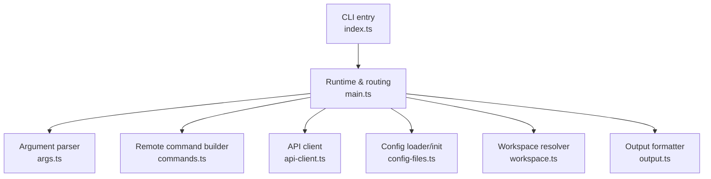
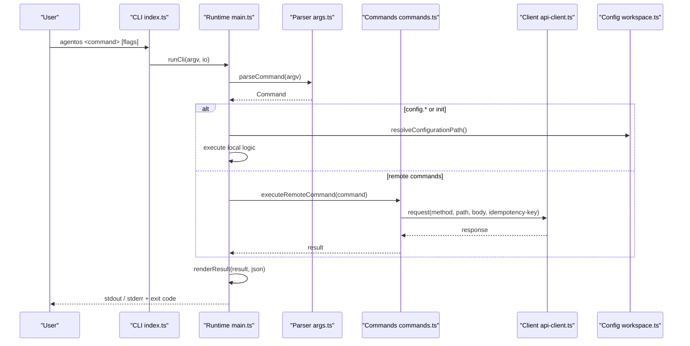
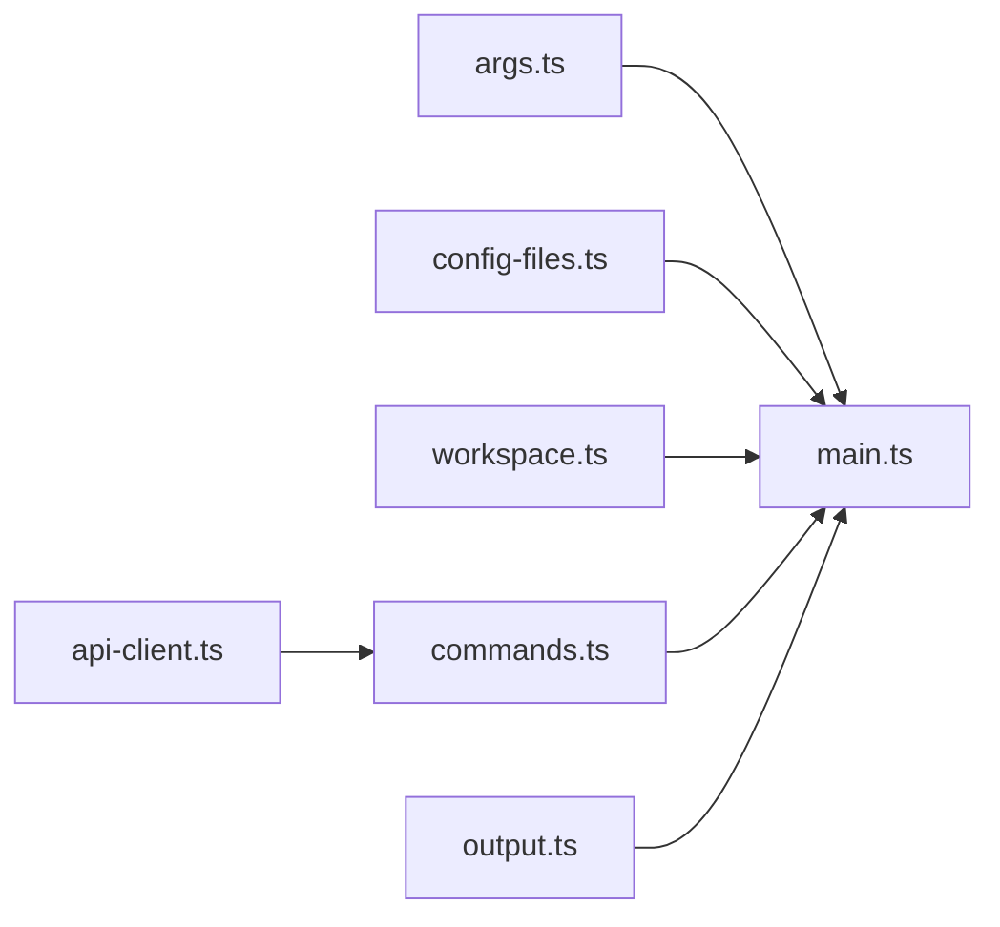

# CLI Reference

<cite>
**Referenced Files in This Document**
- [index.ts](file://apps/cli/src/index.ts)
- [main.ts](file://apps/cli/src/main.ts)
- [args.ts](file://apps/cli/src/args.ts)
- [commands.ts](file://apps/cli/src/commands.ts)
- [api-client.ts](file://apps/cli/src/api-client.ts)
- [config-files.ts](file://apps/cli/src/config-files.ts)
- [workspace.ts](file://apps/cli/src/workspace.ts)
- [output.ts](file://apps/cli/src/output.ts)
- [types.ts](file://apps/cli/src/types.ts)
- [package.json](file://apps/cli/package.json)
- [agent-os.yaml](file://agentos/agent-os.yaml)
- [example.yaml](file://agentos/example.yaml)
- [passerine.yaml](file://agentos/passerine.yaml)
</cite>

## Table of Contents
1. [Introduction](#introduction)
2. [Project Structure](#project-structure)
3. [Core Components](#core-components)
4. [Architecture Overview](#architecture-overview)
5. [Detailed Component Analysis](#detailed-component-analysis)
6. [Dependency Analysis](#dependency-analysis)
7. [Performance Considerations](#performance-considerations)
8. [Troubleshooting Guide](#troubleshooting-guide)
9. [Conclusion](#conclusion)
10. [Appendices](#appendices)

## Introduction
This document is the comprehensive CLI reference for Agent OS Passerine. It covers all available commands, parameters, flags, environment variables, configuration files, authentication, and operational behavior. It also includes usage examples, best practices for scripting and automation, and troubleshooting guidance for common issues.

## Project Structure
The CLI is implemented as a Node.js application with a small set of focused modules:
- Entry point wires process I/O to the CLI runtime.
- Argument parsing defines commands and validates inputs.
- Command execution orchestrates local operations (configuration) and remote API calls.
- API client handles authenticated HTTP requests with safety checks and limits.
- Configuration module reads, validates, and initializes YAML configuration files within a trusted workspace.
- Output formatting supports both human-friendly tables and stable machine-readable JSON.

**Diagram sources**
- [index.ts:1-29](file://apps/cli/src/index.ts#L1-L29)
- [main.ts:1-323](file://apps/cli/src/main.ts#L1-L323)
- [args.ts:1-359](file://apps/cli/src/args.ts#L1-L359)
- [commands.ts:1-93](file://apps/cli/src/commands.ts#L1-L93)
- [api-client.ts:1-245](file://apps/cli/src/api-client.ts#L1-L245)
- [config-files.ts:1-295](file://apps/cli/src/config-files.ts#L1-L295)
- [workspace.ts:1-161](file://apps/cli/src/workspace.ts#L1-L161)
- [output.ts:1-140](file://apps/cli/src/output.ts#L1-L140)

**Section sources**
- [index.ts:1-29](file://apps/cli/src/index.ts#L1-L29)
- [main.ts:1-323](file://apps/cli/src/main.ts#L1-L323)
- [package.json:1-19](file://apps/cli/package.json#L1-L19)

## Core Components
- Commands and flags are defined and parsed by the argument parser. It enforces allowed flags per command, required fields, and input size constraints.
- The runtime routes commands to either local configuration operations or remote API calls via a typed request builder.
- The API client authenticates using a bearer token, validates URLs, enforces timeouts, and bounds request/response sizes.
- Configuration handling ensures safe file paths within a workspace, validates YAML against a schema, computes canonical forms and digests, and creates starter configurations.
- Output rendering provides tabular views for lists and structured objects, plus deterministic JSON when requested.

**Section sources**
- [args.ts:1-359](file://apps/cli/src/args.ts#L1-L359)
- [main.ts:186-279](file://apps/cli/src/main.ts#L186-L279)
- [commands.ts:20-92](file://apps/cli/src/commands.ts#L20-L92)
- [api-client.ts:79-245](file://apps/cli/src/api-client.ts#L79-L245)
- [config-files.ts:141-295](file://apps/cli/src/config-files.ts#L141-L295)
- [output.ts:1-140](file://apps/cli/src/output.ts#L1-L140)

## Architecture Overview
The CLI follows a layered architecture:
- CLI entrypoint captures stdin/stdout and delegates to the runtime.
- The runtime parses arguments, resolves configuration paths, and executes commands.
- Local commands validate and manipulate configuration files.
- Remote commands build typed API requests and send them over HTTPS with authentication and idempotency support.
- Errors are normalized into user-friendly messages and exit codes; JSON mode enables stable machine output.

**Diagram sources**
- [index.ts:22-28](file://apps/cli/src/index.ts#L22-L28)
- [main.ts:186-323](file://apps/cli/src/main.ts#L186-L323)
- [args.ts:216-359](file://apps/cli/src/args.ts#L216-L359)
- [commands.ts:37-92](file://apps/cli/src/commands.ts#L37-L92)
- [api-client.ts:153-245](file://apps/cli/src/api-client.ts#L153-L245)
- [workspace.ts:122-161](file://apps/cli/src/workspace.ts#L122-L161)

## Detailed Component Analysis

### Global Options
- --url: Control-plane URL. Can be provided via flag or AGENTOS_URL environment variable. Must be an absolute URL; non-HTTPS is only allowed for localhost addresses.
- --token: API token. Can be provided via flag or AGENTOS_API_TOKEN environment variable. Must be a valid bearer token format.
- --json: Stable machine-readable output. When enabled, errors are emitted as JSON on stderr; otherwise, human-friendly messages are printed.
- -h, --help: Show help text.
- -V, --version: Print version.

Authentication is enforced early; missing URL or token results in a usage error.

**Section sources**
- [main.ts:50-66](file://apps/cli/src/main.ts#L50-L66)
- [api-client.ts:79-95](file://apps/cli/src/api-client.ts#L79-L95)
- [api-client.ts:136-151](file://apps/cli/src/api-client.ts#L136-L151)

### Command: init
Initializes a starter configuration file in the workspace.

- Usage: agentos init [--config PATH] [--force]
- Flags:
  - --config: Path relative to workspace root where the configuration will be created or linked. Defaults to agentos/agent-os.yaml.
  - --force: Overwrite existing configuration if present.
- Behavior:
  - Validates workspace boundaries and directory permissions.
  - Creates a secure temporary file and atomically links or renames it to the target path.
  - Writes a starter configuration containing project, models, agents, environments, pipelines, policies, budgets, goals, and runtime settings.

Example:
- Initialize default location: agentos init
- Create at custom path: agentos init --config agentos/my-project.yaml
- Overwrite existing file: agentos init --config agentos/my-project.yaml --force

Expected output:
- Success returns a confirmation object indicating creation and path.

Error conditions:
- Existing file without --force.
- Unsafe workspace directories or symbolic links.
- Insufficient permissions to create parent directories.

**Section sources**
- [args.ts:244-254](file://apps/cli/src/args.ts#L244-L254)
- [config-files.ts:236-295](file://apps/cli/src/config-files.ts#L236-L295)
- [config-files.ts:79-139](file://apps/cli/src/config-files.ts#L79-L139)
- [workspace.ts:77-102](file://apps/cli/src/workspace.ts#L77-L102)

### Command: config validate
Validates the configuration file and computes its digest.

- Usage: agentos config validate [--config PATH]
- Flags:
  - --config: Path to configuration file (defaults to agentos/agent-os.yaml).
- Behavior:
  - Reads and validates the YAML against the schema.
  - Computes canonical form and digest.
  - Returns validation status and digest.

Example:
- Validate default: agentos config validate
- Validate specific file: agentos config validate --config agentos/custom.yaml

Expected output:
- Object with valid flag, path, and digest.

Error conditions:
- Invalid YAML structure or values.
- File too large or not found.
- Unsafe workspace paths.

**Section sources**
- [args.ts:255-264](file://apps/cli/src/args.ts#L255-L264)
- [main.ts:197-204](file://apps/cli/src/main.ts#L197-L204)
- [config-files.ts:207-234](file://apps/cli/src/config-files.ts#L207-L234)

### Command: config plan
Plans changes between the current server configuration and the local configuration.

- Usage: agentos config plan [--config PATH]
- Flags:
  - --config: Path to configuration file (defaults to agentos/agent-os.yaml).
- Behavior:
  - Resolves configuration and queries the active configuration from the control plane.
  - Computes a diff plan showing added, modified, or removed sections.
  - Includes project ID when applicable.

Example:
- Plan default: agentos config plan
- Plan specific file: agentos config plan --config agentos/custom.yaml

Expected output:
- Change plan including changed flag, from/to hashes, and detailed changes.

Error conditions:
- Network errors or invalid responses.
- Invalid configuration projection from server.

**Section sources**
- [args.ts:255-264](file://apps/cli/src/args.ts#L255-L264)
- [main.ts:205-236](file://apps/cli/src/main.ts#L205-L236)

### Command: config apply
Applies the local configuration to the control plane with idempotency.

- Usage: agentos config apply [--config PATH] --idempotency-key KEY
- Flags:
  - --config: Path to configuration file (defaults to agentos/agent-os.yaml).
  - --idempotency-key: Required key to ensure idempotent application.
- Behavior:
  - Reads and validates configuration.
  - Queries active configuration revision and digest.
  - Applies canonical configuration with expected revision/digest guards.

Example:
- Apply with idempotency: agentos config apply --idempotency-key unique-key-123
- Apply specific file: agentos config apply --config agentos/custom.yaml --idempotency-key unique-key-456

Expected output:
- Server response confirming application or conflict details.

Error conditions:
- Stale configuration detected.
- Invalid canonical configuration.
- Request body too large.

**Section sources**
- [args.ts:265-275](file://apps/cli/src/args.ts#L265-L275)
- [main.ts:237-264](file://apps/cli/src/main.ts#L237-L264)
- [api-client.ts:176-198](file://apps/cli/src/api-client.ts#L176-L198)

### Command: feature start
Starts a feature run pipeline.

- Usage: agentos feature start --project-id ID --title TEXT --description TEXT --repository-sha SHA --config-digest DIGEST --model-digest DIGEST --prompt-digest DIGEST --environment-digest DIGEST --policy-digest DIGEST --idempotency-key KEY
- Required flags:
  - --project-id: Unique identifier for the project.
  - --title: Short title for the feature.
  - --description: Description of the feature.
  - --repository-sha: 40-character hexadecimal commit SHA.
  - --config-digest, --model-digest, --prompt-digest, --environment-digest, --policy-digest: Digests corresponding to configuration artifacts.
  - --idempotency-key: Ensures idempotent start requests.
- Behavior:
  - Sends a POST request to start a feature pipeline with the provided context and digests.

Example:
- Start feature: agentos feature start --project-id proj-1 --title "Add login" --description "Implement user login flow" --repository-sha abc123... --config-digest d1 --model-digest d2 --prompt-digest d3 --environment-digest d4 --policy-digest d5 --idempotency-key feat-1

Expected output:
- Run initiation response from the control plane.

Error conditions:
- Invalid repository SHA format.
- Missing required flags.
- Network or authentication errors.

**Section sources**
- [args.ts:112-161](file://apps/cli/src/args.ts#L112-L161)
- [commands.ts:20-51](file://apps/cli/src/commands.ts#L20-L51)

### Command: goal start
Starts a goal run with criteria.

- Usage: agentos goal start --project-id ID --title TEXT --description TEXT --repository-sha SHA --config-digest DIGEST --model-digest DIGEST --prompt-digest DIGEST --environment-digest DIGEST --policy-digest DIGEST --criteria-json JSON --idempotency-key KEY
- Additional required flag:
  - --criteria-json: JSON array of up to 20 strict command criteria entries. Each entry must include id, type ("command"), description, command, and optional required boolean.
- Behavior:
  - Parses and validates criteria JSON.
  - Sends a POST request to start a goal pipeline with criteria.

Example:
- Start goal: agentos goal start --project-id proj-1 --title "Refactor tests" --description "Improve test coverage" --repository-sha abc123... --config-digest d1 --model-digest d2 --prompt-digest d3 --environment-digest d4 --policy-digest d5 --criteria-json '[{"id":"unit-tests","type":"command","description":"Run unit tests","command":"pnpm test"}]' --idempotency-key goal-1

Expected output:
- Goal initiation response from the control plane.

Error conditions:
- Invalid criteria JSON structure or length.
- Missing required flags.
- Network or authentication errors.

**Section sources**
- [args.ts:163-214](file://apps/cli/src/args.ts#L163-L214)
- [commands.ts:20-51](file://apps/cli/src/commands.ts#L20-L51)

### Command: goal show
Shows details of a goal by ID.

- Usage: agentos goal show ID
- Parameters:
  - ID: Unique identifier for the goal/run.
- Behavior:
  - Retrieves goal details from the runs endpoint.

Example:
- Show goal: agentos goal show run-123

Expected output:
- Goal object with steps, criteria, and child runs.

Error conditions:
- Invalid ID format.
- Not found or network errors.

**Section sources**
- [args.ts:284-292](file://apps/cli/src/args.ts#L284-L292)
- [commands.ts:55-61](file://apps/cli/src/commands.ts#L55-L61)

### Command: runs list
Lists recent runs.

- Usage: agentos runs list
- Behavior:
  - Fetches a list of runs from the control plane.

Example:
- List runs: agentos runs list

Expected output:
- Tabular list of runs with preferred columns like id, status, pipeline, projectId, createdAt.

Error conditions:
- Network or authentication errors.

**Section sources**
- [args.ts:293-297](file://apps/cli/src/args.ts#L293-L297)
- [commands.ts:52-54](file://apps/cli/src/commands.ts#L52-L54)

### Command: runs show
Shows details of a run by ID.

- Usage: agentos runs show ID
- Parameters:
  - ID: Unique identifier for the run.
- Behavior:
  - Retrieves run details from the control plane.

Example:
- Show run: agentos runs show run-456

Expected output:
- Run object with status, steps, and metadata.

Error conditions:
- Invalid ID format.
- Not found or network errors.

**Section sources**
- [args.ts:298-306](file://apps/cli/src/args.ts#L298-L306)
- [commands.ts:55-61](file://apps/cli/src/commands.ts#L55-L61)

### Command: runs cancel
Cancels a running run by ID.

- Usage: agentos runs cancel ID --idempotency-key KEY
- Parameters:
  - ID: Unique identifier for the run.
  - --idempotency-key: Required key to ensure idempotent cancellation.
- Behavior:
  - Sends a POST request to cancel the run.

Example:
- Cancel run: agentos runs cancel run-789 --idempotency-key cancel-1

Expected output:
- Confirmation or updated run state.

Error conditions:
- Invalid ID format.
- Idempotency conflicts or not found.

**Section sources**
- [args.ts:307-316](file://apps/cli/src/args.ts#L307-L316)
- [commands.ts:62-69](file://apps/cli/src/commands.ts#L62-L69)

### Command: inbox list
Lists inbox items.

- Usage: agentos inbox list
- Behavior:
  - Fetches inbox items from the control plane.

Example:
- List inbox: agentos inbox list

Expected output:
- Tabular list of inbox items.

Error conditions:
- Network or authentication errors.

**Section sources**
- [args.ts:317-321](file://apps/cli/src/args.ts#L317-L321)
- [commands.ts:70-72](file://apps/cli/src/commands.ts#L70-L72)

### Command: inbox reply
Replies to an inbox item.

- Usage: agentos inbox reply ID (--reply TEXT | --file PATH | stdin) --idempotency-key KEY
- Parameters:
  - ID: Unique identifier for the inbox item.
  - One of:
    - --reply: Inline reply text.
    - --file: Path to a file containing the reply content.
    - stdin: Piped input text.
  - --idempotency-key: Required key to ensure idempotent replies.
- Behavior:
  - Validates reply content size and emptiness.
  - Sends a POST request with the reply.

Example:
- Reply inline: agentos inbox reply inbox-1 --reply "Approved" --idempotency-key reply-1
- Reply from file: agentos inbox reply inbox-2 --file reply.txt --idempotency-key reply-2
- Reply from stdin: echo "Approved" | agentos inbox reply inbox-3 --idempotency-key reply-3

Expected output:
- Confirmation or updated inbox item state.

Error conditions:
- Empty reply.
- Reply too large.
- Both --reply and --file provided.

**Section sources**
- [args.ts:322-336](file://apps/cli/src/args.ts#L322-L336)
- [main.ts:80-121](file://apps/cli/src/main.ts#L80-L121)
- [commands.ts:73-79](file://apps/cli/src/commands.ts#L73-L79)

### Command: inbox approve
Approves an approval item.

- Usage: agentos inbox approve ID --scope-hash HASH --idempotency-key KEY
- Parameters:
  - ID: Unique identifier for the approval item.
  - --scope-hash: Hash identifying the scope to approve.
  - --idempotency-key: Required key to ensure idempotent approval.
- Behavior:
  - Sends a POST request to approve the item.

Example:
- Approve: agentos inbox approve approval-1 --scope-hash sha256hash --idempotency-key approve-1

Expected output:
- Confirmation or updated approval state.

Error conditions:
- Invalid scope hash.
- Already decided or expired approvals.

**Section sources**
- [args.ts:337-356](file://apps/cli/src/args.ts#L337-L356)
- [commands.ts:81-89](file://apps/cli/src/commands.ts#L81-L89)

### Command: inbox reject
Rejects an approval item.

- Usage: agentos inbox reject ID --scope-hash HASH --idempotency-key KEY
- Parameters:
  - ID: Unique identifier for the approval item.
  - --scope-hash: Hash identifying the scope to reject.
  - --idempotency-key: Required key to ensure idempotent rejection.
- Behavior:
  - Sends a POST request to reject the item.

Example:
- Reject: agentos inbox reject approval-2 --scope-hash sha256hash --idempotency-key reject-1

Expected output:
- Confirmation or updated approval state.

Error conditions:
- Invalid scope hash.
- Already decided or expired approvals.

**Section sources**
- [args.ts:337-356](file://apps/cli/src/args.ts#L337-L356)
- [commands.ts:81-89](file://apps/cli/src/commands.ts#L81-L89)

## Dependency Analysis
The CLI depends on:
- Workspace resolution to enforce safe configuration paths and detect repository roots.
- Configuration loading and validation through core utilities that compute canonical forms and digests.
- API client for authenticated, bounded, and idempotent HTTP requests.
- Output formatting for consistent display and machine-readable outputs.

**Diagram sources**
- [args.ts:216-359](file://apps/cli/src/args.ts#L216-L359)
- [main.ts:186-323](file://apps/cli/src/main.ts#L186-L323)
- [config-files.ts:207-295](file://apps/cli/src/config-files.ts#L207-L295)
- [workspace.ts:122-161](file://apps/cli/src/workspace.ts#L122-L161)
- [commands.ts:37-92](file://apps/cli/src/commands.ts#L37-L92)
- [api-client.ts:153-245](file://apps/cli/src/api-client.ts#L153-L245)
- [output.ts:118-140](file://apps/cli/src/output.ts#L118-L140)

**Section sources**
- [workspace.ts:44-75](file://apps/cli/src/workspace.ts#L44-L75)
- [config-files.ts:207-234](file://apps/cli/src/config-files.ts#L207-L234)
- [api-client.ts:136-151](file://apps/cli/src/api-client.ts#L136-L151)

## Performance Considerations
- Input and response sizes are bounded to prevent excessive memory usage.
- Configuration files are read in bounded chunks to avoid loading entire large files into memory.
- Requests use timeouts to avoid hanging connections.
- Canonical configuration computation and hashing are performed locally before sending to the server.
- Output formatting sorts keys deterministically for stable JSON output.

[No sources needed since this section provides general guidance]

## Troubleshooting Guide
Common issues and resolutions:
- Missing URL or token: Ensure AGENTOS_URL and AGENTOS_API_TOKEN are set or pass --url and --token.
- Invalid URL: Use HTTPS except for localhost; do not embed credentials in the URL.
- Invalid token: Verify token format; tokens must match the expected pattern.
- Configuration not found: Ensure the file exists at the specified path and is within the workspace.
- Configuration too large: Reduce file size or split configuration logically.
- Unknown command: Check spelling and supported commands; use --help for the full list.
- Invalid arguments: Review required flags and their formats; some flags have strict patterns (e.g., repository SHA).
- Reply too large or empty: Provide a smaller file or non-empty text; ensure only one of --reply or --file is used.
- Idempotency conflicts: Retry with a different idempotency key or check server state.
- Authentication errors: Confirm token validity and access rights; inspect error codes for specifics.

**Section sources**
- [main.ts:50-66](file://apps/cli/src/main.ts#L50-L66)
- [api-client.ts:79-95](file://apps/cli/src/api-client.ts#L79-L95)
- [api-client.ts:136-151](file://apps/cli/src/api-client.ts#L136-L151)
- [config-files.ts:141-185](file://apps/cli/src/config-files.ts#L141-L185)
- [args.ts:46-67](file://apps/cli/src/args.ts#L46-L67)
- [main.ts:80-121](file://apps/cli/src/main.ts#L80-L121)

## Conclusion
The Agent OS Passerine CLI provides a robust interface for initializing projects, managing configuration, and executing features and goals against a control plane. It emphasizes safety through workspace validation, input bounding, and idempotent operations. Use JSON mode for automation, adhere to required flags and formats, and consult the troubleshooting guide for common issues.

[No sources needed since this section summarizes without analyzing specific files]

## Appendices

### Configuration File Formats
Starter and example configurations demonstrate the structure:
- Version and project metadata.
- Models with provider and cost metrics.
- Agents with model, environment, tools, retries, and timeout.
- Environments with runtime, variables, tools, and MCPs.
- Pipelines defining steps and agents.
- Policies protecting paths and controlling binaries/symlinks/tools/MCPs.
- Budgets for workflow and daily limits, concurrency, and admission reserve.
- Goals with max steps, retries, and timeout.
- Runtime provider and routing.

Examples:
- Default starter configuration: [agent-os.yaml](file://agentos/agent-os.yaml)
- Example with commented Kimi model profile: [example.yaml](file://agentos/example.yaml)
- Complex multi-agent pipeline configuration: [passerine.yaml](file://agentos/passerine.yaml)

**Section sources**
- [config-files.ts:79-139](file://apps/cli/src/config-files.ts#L79-L139)
- [agent-os.yaml:1-61](file://agentos/agent-os.yaml#L1-L61)
- [example.yaml:1-73](file://agentos/example.yaml#L1-L73)
- [passerine.yaml:1-252](file://agentos/passerine.yaml#L1-L252)

### Environment Variables
- AGENTOS_URL: Control-plane URL.
- AGENTOS_API_TOKEN: API token for authentication.

These can be set in your shell or CI environment to avoid passing flags repeatedly.

**Section sources**
- [main.ts:50-66](file://apps/cli/src/main.ts#L50-L66)

### Best Practices for Scripting and Automation
- Always provide --idempotency-key for mutating operations (apply, reply, approve, reject, cancel, start).
- Use --json for stable machine-readable output in scripts.
- Generate repository SHA and digests deterministically in CI pipelines.
- Keep configuration files within the workspace root and avoid symlinks.
- Set AGENTOS_URL and AGENTOS_API_TOKEN in environment for consistent authentication.
- Handle exit codes: 0 for success, 1 for internal errors, 2 for usage errors, 3 for API errors, 4 for authentication failures.

**Section sources**
- [main.ts:281-323](file://apps/cli/src/main.ts#L281-L323)
- [api-client.ts:35-44](file://apps/cli/src/api-client.ts#L35-L44)
- [args.ts:10-20](file://apps/cli/src/args.ts#L10-L20)