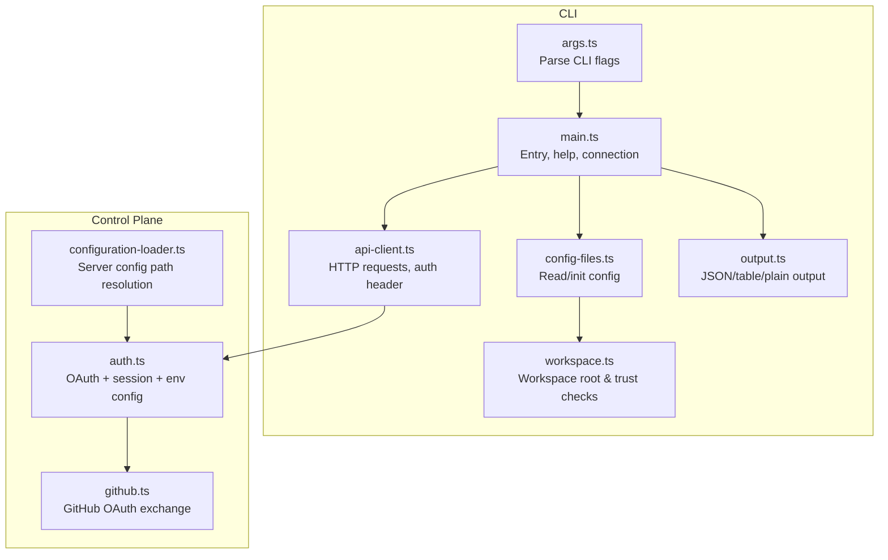
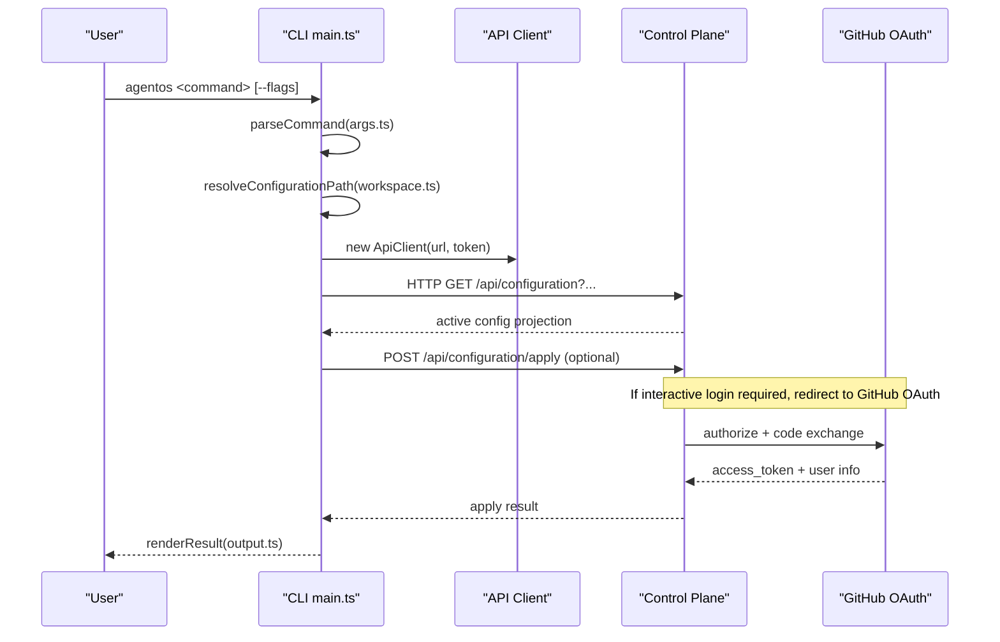
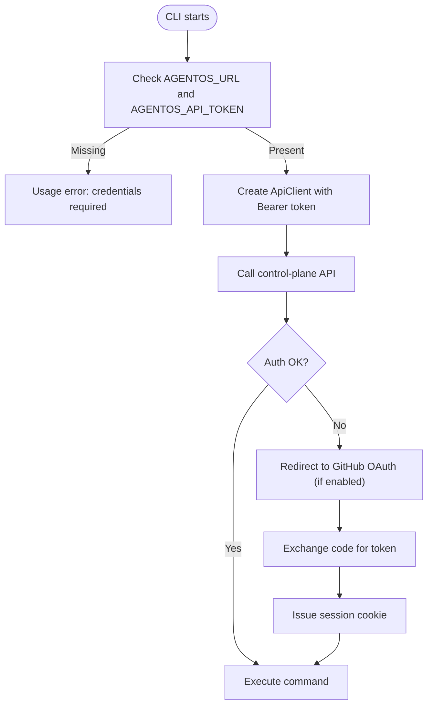
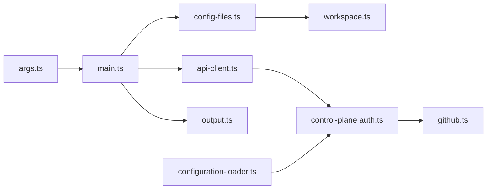

# Configuration and Options

<cite>
**Referenced Files in This Document**
- [main.ts](file://apps/cli/src/main.ts)
- [args.ts](file://apps/cli/src/args.ts)
- [types.ts](file://apps/cli/src/types.ts)
- [api-client.ts](file://apps/cli/src/api-client.ts)
- [config-files.ts](file://apps/cli/src/config-files.ts)
- [workspace.ts](file://apps/cli/src/workspace.ts)
- [output.ts](file://apps/cli/src/output.ts)
- [auth.ts](file://apps/control-plane/src/auth/auth.ts)
- [github.ts](file://apps/control-plane/src/auth/github.ts)
- [configuration-loader.ts](file://apps/control-plane/src/config/configuration-loader.ts)
- [agent-os.yaml](file://agentos/agent-os.yaml)
- [example.yaml](file://agentos/example.yaml)
- [passerine.yaml](file://agentos/passerine.yaml)
</cite>

## Table of Contents
1. [Introduction](#introduction)
2. [Project Structure](#project-structure)
3. [Core Components](#core-components)
4. [Architecture Overview](#architecture-overview)
5. [Detailed Component Analysis](#detailed-component-analysis)
6. [Dependency Analysis](#dependency-analysis)
7. [Performance Considerations](#performance-considerations)
8. [Troubleshooting Guide](#troubleshooting-guide)
9. [Conclusion](#conclusion)
10. [Appendices](#appendices)

## Introduction
This document explains how to configure the Agent OS CLI and control plane, including command-line arguments, environment variables, configuration files, authentication methods, output formatting, logging/debugging flags, and multi-environment best practices. It also clarifies configuration precedence and inheritance rules so you can reliably run the CLI locally, in CI/CD pipelines, and in production.

## Project Structure
The CLI is implemented under apps/cli with a clear separation between argument parsing, configuration file handling, API client, and output rendering. The control plane provides authentication (GitHub OAuth and optional CLI token) and configuration loading for server-side operations.

**Diagram sources**
- [args.ts:216-359](file://apps/cli/src/args.ts#L216-L359)
- [main.ts:16-66](file://apps/cli/src/main.ts#L16-L66)
- [api-client.ts:130-245](file://apps/cli/src/api-client.ts#L130-L245)
- [config-files.ts:207-295](file://apps/cli/src/config-files.ts#L207-L295)
- [workspace.ts:44-161](file://apps/cli/src/workspace.ts#L44-L161)
- [output.ts:118-140](file://apps/cli/src/output.ts#L118-L140)
- [auth.ts:80-157](file://apps/control-plane/src/auth/auth.ts#L80-L157)
- [github.ts:4-54](file://apps/control-plane/src/auth/github.ts#L4-L54)
- [configuration-loader.ts:34-52](file://apps/control-plane/src/config/configuration-loader.ts#L34-L52)

**Section sources**
- [main.ts:16-66](file://apps/cli/src/main.ts#L16-L66)
- [args.ts:216-359](file://apps/cli/src/args.ts#L216-L359)
- [config-files.ts:207-295](file://apps/cli/src/config-files.ts#L207-L295)
- [workspace.ts:44-161](file://apps/cli/src/workspace.ts#L44-L161)
- [output.ts:118-140](file://apps/cli/src/output.ts#L118-L140)
- [auth.ts:80-157](file://apps/control-plane/src/auth/auth.ts#L80-L157)
- [github.ts:4-54](file://apps/control-plane/src/auth/github.ts#L4-L54)
- [configuration-loader.ts:34-52](file://apps/control-plane/src/config/configuration-loader.ts#L34-L52)

## Core Components
- CLI argument parser defines all supported commands and global flags.
- Main entry resolves configuration paths, connects to the control plane, and renders results.
- API client validates URLs/tokens, sets Authorization headers, and enforces request/response size limits.
- Configuration loader reads and validates YAML, computes canonical forms and digests.
- Workspace utilities enforce safe directory traversal and prevent symlink-based bypasses.
- Output formatter supports JSON, table, and plain text modes.

**Section sources**
- [args.ts:216-359](file://apps/cli/src/args.ts#L216-L359)
- [main.ts:186-279](file://apps/cli/src/main.ts#L186-L279)
- [api-client.ts:79-151](file://apps/cli/src/api-client.ts#L79-L151)
- [config-files.ts:207-234](file://apps/cli/src/config-files.ts#L207-L234)
- [workspace.ts:73-161](file://apps/cli/src/workspace.ts#L73-L161)
- [output.ts:118-140](file://apps/cli/src/output.ts#L118-L140)

## Architecture Overview
The CLI parses arguments, resolves configuration, authenticates via an API token, and calls the control plane’s REST endpoints. The control plane may use GitHub OAuth for interactive sessions and optionally a CLI token for machine-to-machine access.

**Diagram sources**
- [main.ts:186-279](file://apps/cli/src/main.ts#L186-L279)
- [args.ts:216-359](file://apps/cli/src/args.ts#L216-L359)
- [workspace.ts:122-161](file://apps/cli/src/workspace.ts#L122-L161)
- [api-client.ts:153-245](file://apps/cli/src/api-client.ts#L153-L245)
- [auth.ts:239-315](file://apps/control-plane/src/auth/auth.ts#L239-L315)
- [github.ts:4-54](file://apps/control-plane/src/auth/github.ts#L4-L54)

## Detailed Component Analysis

### CLI Commands and Global Flags
- Global flags:
  - --url or AGENTOS_URL: Control-plane URL. Must be absolute; HTTPS required unless localhost.
  - --token or AGENTOS_API_TOKEN: Bearer API token used for Authorization header.
  - --json: Stable machine-readable JSON output.
  - -h/--help, -V/--version: Help and version.
- Commands include init, config validate/plan/apply, feature start, goal start/show, runs list/show/cancel, inbox list/reply/approve/reject. Each command has specific required flags validated at parse time.

Key behaviors:
- Argument validation enforces allowed flags per command and required fields.
- Configuration path defaults to agentos/agent-os.yaml when not specified.
- Idempotency keys are required for mutating operations.

**Section sources**
- [main.ts:16-39](file://apps/cli/src/main.ts#L16-L39)
- [args.ts:22-98](file://apps/cli/src/args.ts#L22-L98)
- [args.ts:112-161](file://apps/cli/src/args.ts#L112-L161)
- [args.ts:216-359](file://apps/cli/src/args.ts#L216-L359)
- [types.ts:1-79](file://apps/cli/src/types.ts#L1-L79)

### Authentication Methods
- CLI authentication:
  - Requires AGENTOS_URL and AGENTOS_API_TOKEN (or their --url/--token equivalents).
  - Token is sent as Authorization: Bearer <token>.
  - URL must be HTTPS except for localhost development.
- Control-plane authentication:
  - GitHub OAuth flow for interactive login using GITHUB_CLIENT_ID, GITHUB_CLIENT_SECRET, GITHUB_ALLOWED_LOGIN, and AGENTOS_PUBLIC_URL.
  - Optional AGENTOS_CLI_TOKEN enables machine-to-machine login on the control plane side.
  - Session cookies are sealed with AGENTOS_SESSION_SECRET (minimum length enforced).
  - In production, AGENTOS_PUBLIC_URL must be HTTPS and AGENTOS_SESSION_SECRET is required.

**Diagram sources**
- [main.ts:50-66](file://apps/cli/src/main.ts#L50-L66)
- [api-client.ts:79-151](file://apps/cli/src/api-client.ts#L79-L151)
- [auth.ts:80-157](file://apps/control-plane/src/auth/auth.ts#L80-L157)
- [github.ts:4-54](file://apps/control-plane/src/auth/github.ts#L4-L54)

**Section sources**
- [main.ts:50-66](file://apps/cli/src/main.ts#L50-L66)
- [api-client.ts:79-151](file://apps/cli/src/api-client.ts#L79-L151)
- [auth.ts:80-157](file://apps/control-plane/src/auth/auth.ts#L80-L157)
- [github.ts:4-54](file://apps/control-plane/src/auth/github.ts#L4-L54)

### Configuration Files and Precedence
- Default configuration file: agentos/agent-os.yaml.
- Override with --config PATH for CLI commands that read configuration.
- Server-side configuration path:
  - AGENTOS_CONFIG_PATH overrides default.
  - In production, AGENTOS_CONFIG_PATH is required.
  - Development fallback uses agentos/example.yaml when running from the control-plane app context.
- Configuration validation:
  - Source file size is bounded.
  - Canonical form and digest are computed for change detection and application.
  - Invalid or non-canonical configurations are rejected by the server.

Precedence summary:
- CLI --config overrides default for CLI operations.
- Environment AGENTOS_CONFIG_PATH overrides default for server-side loading.
- Production requires explicit AGENTOS_CONFIG_PATH.

**Section sources**
- [args.ts:22-23](file://apps/cli/src/args.ts#L22-L23)
- [config-files.ts:207-234](file://apps/cli/src/config-files.ts#L207-L234)
- [configuration-loader.ts:34-52](file://apps/control-plane/src/config/configuration-loader.ts#L34-L52)

### Output Formatting and Debugging
- Output modes:
  - --json: deterministic JSON output suitable for machines.
  - Default: human-friendly tables or key-value lines.
- Errors:
  - When --json is set, errors are emitted as JSON on stderr with a stable error code.
  - Without --json, a concise error message is printed.
- Logging:
  - No dedicated log-level flag is exposed by the CLI; use standard process logging around the CLI invocation if needed.

**Section sources**
- [output.ts:118-140](file://apps/cli/src/output.ts#L118-L140)
- [main.ts:288-323](file://apps/cli/src/main.ts#L288-L323)

### Security and Trust Boundaries
- Configuration paths must reside within the workspace root detected by markers like .git or pnpm-workspace.yaml.
- Symbolic links are disallowed in configuration paths and parent directories.
- Directory ownership and permissions are checked to prevent unsafe configurations.
- API URL validation prevents credentials in URLs and enforces HTTPS outside localhost.

**Section sources**
- [workspace.ts:44-161](file://apps/cli/src/workspace.ts#L44-L161)
- [api-client.ts:79-95](file://apps/cli/src/api-client.ts#L79-L95)

## Dependency Analysis

**Diagram sources**
- [args.ts:216-359](file://apps/cli/src/args.ts#L216-L359)
- [main.ts:186-279](file://apps/cli/src/main.ts#L186-L279)
- [api-client.ts:130-245](file://apps/cli/src/api-client.ts#L130-L245)
- [config-files.ts:207-295](file://apps/cli/src/config-files.ts#L207-L295)
- [workspace.ts:73-161](file://apps/cli/src/workspace.ts#L73-L161)
- [output.ts:118-140](file://apps/cli/src/output.ts#L118-L140)
- [auth.ts:80-157](file://apps/control-plane/src/auth/auth.ts#L80-L157)
- [github.ts:4-54](file://apps/control-plane/src/auth/github.ts#L4-L54)
- [configuration-loader.ts:34-52](file://apps/control-plane/src/config/configuration-loader.ts#L34-L52)

**Section sources**
- [args.ts:216-359](file://apps/cli/src/args.ts#L216-L359)
- [main.ts:186-279](file://apps/cli/src/main.ts#L186-L279)
- [api-client.ts:130-245](file://apps/cli/src/api-client.ts#L130-L245)
- [config-files.ts:207-295](file://apps/cli/src/config-files.ts#L207-L295)
- [workspace.ts:73-161](file://apps/cli/src/workspace.ts#L73-L161)
- [output.ts:118-140](file://apps/cli/src/output.ts#L118-L140)
- [auth.ts:80-157](file://apps/control-plane/src/auth/auth.ts#L80-L157)
- [github.ts:4-54](file://apps/control-plane/src/auth/github.ts#L4-L54)
- [configuration-loader.ts:34-52](file://apps/control-plane/src/config/configuration-loader.ts#L34-L52)

## Performance Considerations
- Request and response sizes are bounded to avoid excessive memory usage.
- Configuration source and canonical forms have maximum byte limits.
- Reply inputs are bounded to prevent large payloads.
- Use --json for predictable, compact output in automation.

[No sources needed since this section provides general guidance]

## Troubleshooting Guide
Common issues and resolutions:
- Missing credentials:
  - Ensure AGENTOS_URL and AGENTOS_API_TOKEN are set or pass --url and --token.
- Invalid URL:
  - Use HTTPS for non-localhost URLs; do not embed credentials in the URL.
- Configuration not found or too large:
  - Verify AGENTOS_CONFIG_PATH (server) or --config (CLI) points to a valid file within the workspace.
- Invalid configuration:
  - Validate with agentos config validate; fix reported issues.
- GitHub OAuth failures:
  - Confirm GITHUB_CLIENT_ID, GITHUB_CLIENT_SECRET, GITHUB_ALLOWED_LOGIN, and AGENTOS_PUBLIC_URL are set correctly.
  - In production, ensure AGENTOS_PUBLIC_URL uses HTTPS and AGENTOS_SESSION_SECRET meets minimum length.
- Idempotency conflicts:
  - Provide unique idempotency-key values for mutating operations.

**Section sources**
- [main.ts:50-66](file://apps/cli/src/main.ts#L50-L66)
- [api-client.ts:79-151](file://apps/cli/src/api-client.ts#L79-L151)
- [config-files.ts:141-185](file://apps/cli/src/config-files.ts#L141-L185)
- [auth.ts:80-157](file://apps/control-plane/src/auth/auth.ts#L80-L157)

## Conclusion
Use --json for automation, always provide AGENTOS_URL and AGENTOS_API_TOKEN for CLI operations, and manage configuration files within trusted workspace boundaries. For interactive workflows, configure GitHub OAuth securely and restrict allowed logins. In production, require AGENTOS_CONFIG_PATH and enforce HTTPS and strong secrets.

[No sources needed since this section summarizes without analyzing specific files]

## Appendices

### Environment Variables Reference
- AGENTOS_URL: Control-plane URL for CLI.
- AGENTOS_API_TOKEN: Bearer token for CLI.
- AGENTOS_CONFIG_PATH: Server-side configuration file path (required in production).
- AGENTOS_PUBLIC_URL: Public base URL for the control plane (HTTPS in production).
- AGENTOS_SESSION_SECRET: Secret for signing sessions (minimum length enforced).
- AGENTOS_CLI_TOKEN: Optional server-side token for CLI identity.
- GITHUB_CLIENT_ID, GITHUB_CLIENT_SECRET, GITHUB_ALLOWED_LOGIN: GitHub OAuth settings.

**Section sources**
- [main.ts:16-39](file://apps/cli/src/main.ts#L16-L39)
- [configuration-loader.ts:34-52](file://apps/control-plane/src/config/configuration-loader.ts#L34-L52)
- [auth.ts:80-157](file://apps/control-plane/src/auth/auth.ts#L80-L157)

### Example Scenarios

- Local development:
  - Set AGENTOS_URL to http://localhost:<port> and AGENTOS_API_TOKEN to a local token.
  - Optionally skip full OAuth setup if running locally; the control plane allows localhost bypass with defaults.
  - Use agentos config plan to preview changes before applying.

- CI/CD pipelines:
  - Export AGENTOS_URL and AGENTOS_API_TOKEN from secure secrets.
  - Pin AGENTOS_CONFIG_PATH to a known configuration file.
  - Use --json for machine-readable outputs and capture exit codes for success/failure.

- Production deployments:
  - Require AGENTOS_CONFIG_PATH and AGENTOS_PUBLIC_URL with HTTPS.
  - Configure AGENTOS_SESSION_SECRET with sufficient entropy.
  - Restrict GITHUB_ALLOWED_LOGIN to authorized operators.

[No sources needed since this section provides general guidance]

### Configuration File Examples
- Minimal project configuration: agentos/agent-os.yaml
- Example with model profiles and routing comments: agentos/example.yaml
- Full pipeline configuration with agents, environments, policies, budgets, goals, runtime: agentos/passerine.yaml

**Section sources**
- [agent-os.yaml:1-61](file://agentos/agent-os.yaml#L1-L61)
- [example.yaml:1-73](file://agentos/example.yaml#L1-L73)
- [passerine.yaml:1-252](file://agentos/passerine.yaml#L1-L252)