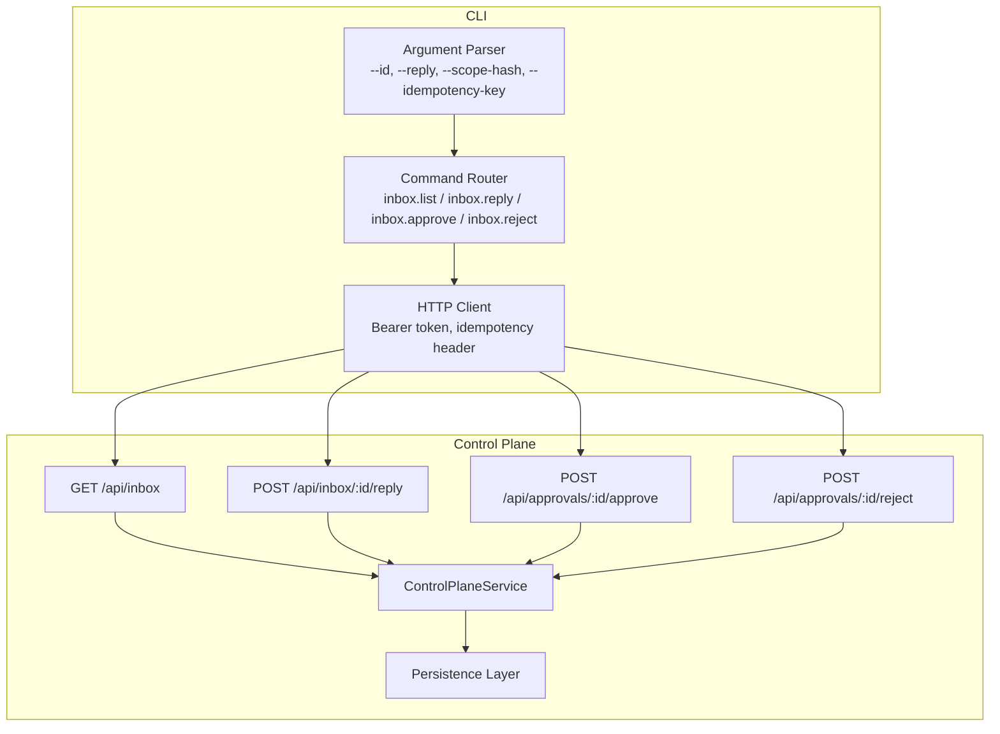
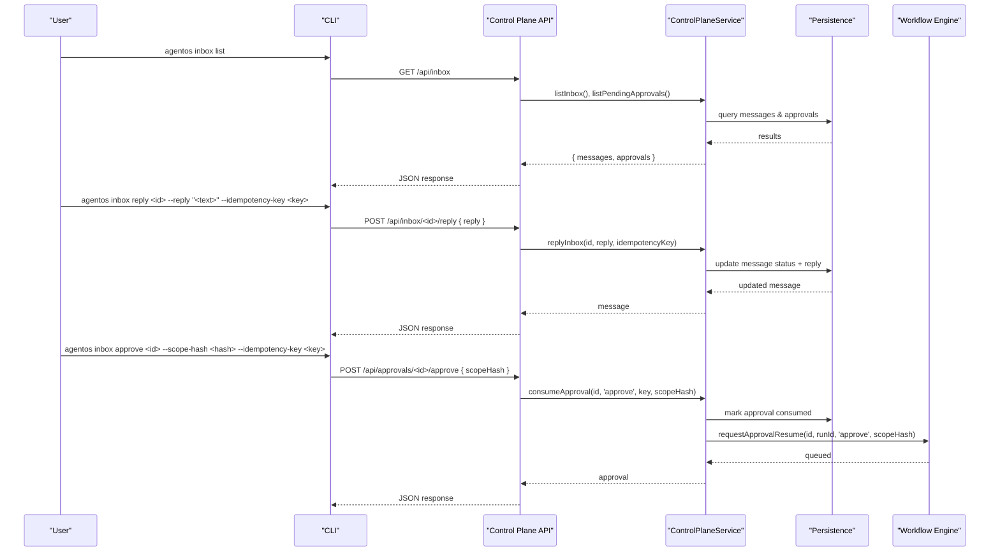
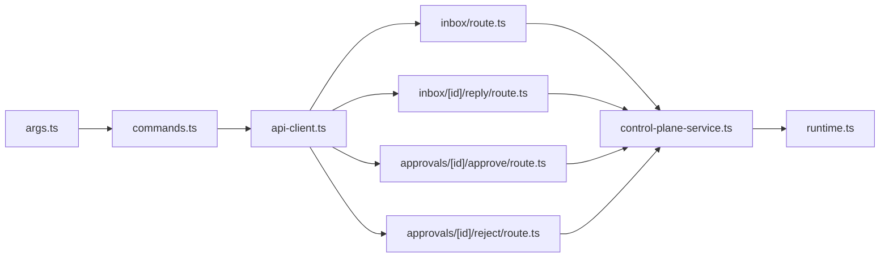

# Inbox and Approval Commands

<cite>
**Referenced Files in This Document**
- [commands.ts](file://apps/cli/src/commands.ts)
- [args.ts](file://apps/cli/src/args.ts)
- [api-client.ts](file://apps/cli/src/api-client.ts)
- [inbox route](file://apps/control-plane/app/api/inbox/route.ts)
- [inbox reply route](file://apps/control-plane/app/api/inbox/[id]/reply/route.ts)
- [approve route](file://apps/control-plane/app/api/approvals/[id]/approve/route.ts)
- [reject route](file://apps/control-plane/app/api/approvals/[id]/reject/route.ts)
- [contracts](file://apps/control-plane/src/http/contracts.ts)
- [control-plane service](file://apps/control-plane/src/application/control-plane-service.ts)
- [runtime](file://apps/control-plane/src/application/runtime.ts)
</cite>

## Table of Contents
1. [Introduction](#introduction)
2. [Project Structure](#project-structure)
3. [Core Components](#core-components)
4. [Architecture Overview](#architecture-overview)
5. [Detailed Component Analysis](#detailed-component-analysis)
6. [Dependency Analysis](#dependency-analysis)
7. [Performance Considerations](#performance-considerations)
8. [Troubleshooting Guide](#troubleshooting-guide)
9. [Conclusion](#conclusion)

## Introduction
This document explains the Agent OS CLI commands for inbox and approval management, including how to list pending items, reply to agent questions, approve or reject approvals, and integrate with the broader workflow engine. It covers command syntax, required parameters, message formats, and end-to-end flows from CLI to server-side handling.

## Project Structure
The inbox and approval feature spans two main layers:
- CLI layer (apps/cli): parses user commands, validates arguments, and sends HTTP requests to the control plane API.
- Control plane (apps/control-plane): exposes REST endpoints under /api/inbox and /api/approvals, enforces authentication and validation, and delegates to domain services that interact with persistence and the workflow engine.

**Diagram sources**
- [commands.ts:37-92](file://apps/cli/src/commands.ts#L37-L92)
- [inbox route:11-32](file://apps/control-plane/app/api/inbox/route.ts#L11-L32)
- [inbox reply route:13-33](file://apps/control-plane/app/api/inbox/[id]/reply/route.ts#L13-L33)
- [approve route:11-32](file://apps/control-plane/app/api/approvals/[id]/approve/route.ts#L11-L32)
- [reject route:11-32](file://apps/control-plane/app/api/approvals/[id]/reject/route.ts#L11-L32)
- [runtime:573-624](file://apps/control-plane/src/application/runtime.ts#L573-L624)

**Section sources**
- [commands.ts:37-92](file://apps/cli/src/commands.ts#L37-L92)
- [inbox route:11-32](file://apps/control-plane/app/api/inbox/route.ts#L11-L32)
- [inbox reply route:13-33](file://apps/control-plane/app/api/inbox/[id]/reply/route.ts#L13-L33)
- [approve route:11-32](file://apps/control-plane/app/api/approvals/[id]/approve/route.ts#L11-L32)
- [reject route:11-32](file://apps/control-plane/app/api/approvals/[id]/reject/route.ts#L11-L32)
- [runtime:573-624](file://apps/control-plane/src/application/runtime.ts#L573-L624)

## Core Components
- CLI argument parser defines flags and positional arguments for inbox commands.
- Command router maps CLI actions to HTTP methods and paths.
- API client handles authentication, timeouts, body size limits, and error mapping.
- Control plane routes enforce authentication, validate payloads, and call service methods.
- Contracts define schemas for inbox messages, approvals, and listing responses.
- Service layer orchestrates inbox listing, replies, and approval consumption, integrating with persistence and workflow dispatch.

Key responsibilities:
- List inbox: returns pending messages and pending approvals for a project.
- Reply to inbox: records an operator response against a pending message.
- Approve/Reject: consumes an approval with a scope hash and decision.

**Section sources**
- [args.ts:216-358](file://apps/cli/src/args.ts#L216-L358)
- [commands.ts:37-92](file://apps/cli/src/commands.ts#L37-L92)
- [api-client.ts:130-244](file://apps/cli/src/api-client.ts#L130-L244)
- [contracts:121-128](file://apps/control-plane/src/http/contracts.ts#L121-L128)
- [contracts:294-360](file://apps/control-plane/src/http/contracts.ts#L294-L360)
- [inbox route:11-32](file://apps/control-plane/app/api/inbox/route.ts#L11-L32)
- [inbox reply route:13-33](file://apps/control-plane/app/api/inbox/[id]/reply/route.ts#L13-L33)
- [approve route:11-32](file://apps/control-plane/app/api/approvals/[id]/approve/route.ts#L11-L32)
- [reject route:11-32](file://apps/control-plane/app/api/approvals/[id]/reject/route.ts#L11-L32)

## Architecture Overview
End-to-end flow for inbox and approval operations:

**Diagram sources**
- [commands.ts:70-89](file://apps/cli/src/commands.ts#L70-L89)
- [inbox route:11-32](file://apps/control-plane/app/api/inbox/route.ts#L11-L32)
- [inbox reply route:13-33](file://apps/control-plane/app/api/inbox/[id]/reply/route.ts#L13-L33)
- [approve route:11-32](file://apps/control-plane/app/api/approvals/[id]/approve/route.ts#L11-L32)
- [reject route:11-32](file://apps/control-plane/app/api/approvals/[id]/reject/route.ts#L11-L32)
- [runtime:547-570](file://apps/control-plane/src/application/runtime.ts#L547-L570)

## Detailed Component Analysis

### CLI Commands: Syntax and Parameters
- Global options:
  - --url: Control plane base URL (must be HTTPS except localhost).
  - --token: Bearer API token.
  - --json: Output raw JSON.
- Common flags:
  - --idempotency-key: Required for write operations to ensure idempotency.
  - --reply: Text or JSON payload for inbox replies.
  - --file: Alternative to --reply; read content from file.
  - --scope-hash: Required for approve/reject to bind the decision to a specific change scope.

Commands:
- agentos inbox list
  - Purpose: List pending inbox messages and pending approvals.
  - Flags: none beyond global options.
  - Behavior: Calls GET /api/inbox and returns messages and approvals arrays.

- agentos inbox reply <id>
  - Purpose: Respond to an agent question or prompt.
  - Required:
    - Positional: id (inbox message identifier).
    - --idempotency-key.
  - Optional:
    - --reply or --file (mutually exclusive).
  - Behavior: POST /api/inbox/<id>/reply with { reply }.

- agentos inbox approve <id>
  - Purpose: Approve a pending approval.
  - Required:
    - Positional: id (approval identifier).
    - --scope-hash.
    - --idempotency-key.
  - Behavior: POST /api/approvals/<id>/approve with { scopeHash }.

- agentos inbox reject <id>
  - Purpose: Reject a pending approval.
  - Required:
    - Positional: id (approval identifier).
    - --scope-hash.
    - --idempotency-key.
  - Behavior: POST /api/approvals/<id>/reject with { scopeHash }.

Validation rules enforced by CLI:
- IDs must match allowed character set and length.
- --reply and --file cannot be used together.
- Write operations require --idempotency-key.

**Section sources**
- [args.ts:216-358](file://apps/cli/src/args.ts#L216-L358)
- [commands.ts:70-89](file://apps/cli/src/commands.ts#L70-L89)

### API Endpoints and Request/Response Models
- GET /api/inbox
  - Authentication: Required.
  - Query: optional projectId.
  - Response: { messages: InboxMessage[], approvals: Approval[] }.

- POST /api/inbox/:id/reply
  - Authentication: Required.
  - Body: { reply: string | object }.
  - Response: InboxMessage.

- POST /api/approvals/:id/approve
  - Authentication: Required.
  - Body: { scopeHash: string }.
  - Response: Approval.

- POST /api/approvals/:id/reject
  - Authentication: Required.
  - Body: { scopeHash: string }.
  - Response: Approval.

Message and approval schemas:
- InboxMessage: includes id, runId, stepRunId (optional), status (pending|replied), body (text/question/message/answer/options), reply (optional), createdAt, repliedAt (optional).
- Approval: includes id, runId, scopeHash, scopePreview, status (pending|consumed|expired), createdAt, expiresAt, consumedAt (optional), summary (title, requirements, criteria).

Idempotency enforcement:
- Server requires Idempotency-Key header for mutations.
- CLI sets this header when provided.

**Section sources**
- [inbox route:11-32](file://apps/control-plane/app/api/inbox/route.ts#L11-L32)
- [inbox reply route:13-33](file://apps/control-plane/app/api/inbox/[id]/reply/route.ts#L13-L33)
- [approve route:11-32](file://apps/control-plane/app/api/approvals/[id]/approve/route.ts#L11-L32)
- [reject route:11-32](file://apps/control-plane/app/api/approvals/[id]/reject/route.ts#L11-L32)
- [contracts:121-128](file://apps/control-plane/src/http/contracts.ts#L121-L128)
- [contracts:294-360](file://apps/control-plane/src/http/contracts.ts#L294-L360)
- [contracts:362-371](file://apps/control-plane/src/http/contracts.ts#L362-L371)

### Human-in-the-Loop Workflows and Examples
Typical workflows:
- Agent asks a question during a run:
  - Use agentos inbox list to find pending messages.
  - Use agentos inbox reply <id> --reply "<your answer>" --idempotency-key <unique> to respond.
  - The run resumes with your answer.

- Workflow pauses for approval:
  - Use agentos inbox list to find pending approvals.
  - Review scopePreview and summary fields.
  - Approve or reject using agentos inbox approve|reject <id> --scope-hash <hash> --idempotency-key <unique>.
  - The workflow resumes with the decision applied to the specified scope.

Example sequences:
- Listing and replying:
  - Run: agentos inbox list
  - Then: agentos inbox reply <message-id> --reply "Proceed with deployment" --idempotency-key "op-123"

- Approving changes:
  - Run: agentos inbox list
  - Then: agentos inbox approve <approval-id> --scope-hash "<commit-or-diff-hash>" --idempotency-key "op-456"

- Rejecting changes:
  - Run: agentos inbox list
  - Then: agentos inbox reject <approval-id> --scope-hash "<commit-or-diff-hash>" --idempotency-key "op-789"

Notes:
- Always generate a unique --idempotency-key per mutation attempt.
- For approve/reject, scopeHash must match the approval’s expected scope to prevent mismatched decisions.

[No sources needed since this section provides conceptual examples grounded by referenced files above]

### Message Formats and Data Model Details
- InboxMessage.body fields:
  - text: free-form message.
  - question: explicit question to operator.
  - message: contextual information.
  - answer: previous operator answer (when present).
  - options: suggested choices for quick replies.

- InboxMessage.reply mirrors body structure and is populated after a successful reply.

- Approval fields:
  - scopeHash: fingerprint of the change scope being approved.
  - scopePreview: truncated preview of the scope.
  - summary: title, requirements, and criteria describing what is being approved.

- InboxListing response:
  - messages: array of InboxMessage.
  - approvals: array of Approval.

These models are validated on both CLI and server sides to ensure safe and consistent interactions.

**Section sources**
- [contracts:325-360](file://apps/control-plane/src/http/contracts.ts#L325-L360)

### Integration with the Workflow Engine
- Approvals:
  - When an approval is consumed (approve/reject), the control plane service triggers a workflow resume event carrying the decision and scopeHash.
  - The workflow engine then continues the run with the operator’s decision applied to the specified scope.

- Inbox replies:
  - Replies update the message state and allow the running workflow to continue with the provided answer.

- Expiry and status:
  - Pending approvals may expire based on time; the inbox reflects expired status even before reconciliation updates persisted state.

**Section sources**
- [runtime:547-570](file://apps/control-plane/src/application/runtime.ts#L547-L570)
- [control-plane service:356-387](file://apps/control-plane/src/application/control-plane-service.ts#L356-L387)

## Dependency Analysis
Component relationships:
- CLI depends on argument parsing and command routing to build HTTP requests.
- API routes depend on authentication and contract validation before calling service methods.
- Service layer coordinates persistence and workflow dispatch for inbox and approval operations.

**Diagram sources**
- [args.ts:216-358](file://apps/cli/src/args.ts#L216-L358)
- [commands.ts:37-92](file://apps/cli/src/commands.ts#L37-L92)
- [api-client.ts:130-244](file://apps/cli/src/api-client.ts#L130-L244)
- [inbox route:11-32](file://apps/control-plane/app/api/inbox/route.ts#L11-L32)
- [inbox reply route:13-33](file://apps/control-plane/app/api/inbox/[id]/reply/route.ts#L13-L33)
- [approve route:11-32](file://apps/control-plane/app/api/approvals/[id]/approve/route.ts#L11-L32)
- [reject route:11-32](file://apps/control-plane/app/api/approvals/[id]/reject/route.ts#L11-L32)
- [runtime:573-624](file://apps/control-plane/src/application/runtime.ts#L573-L624)

**Section sources**
- [args.ts:216-358](file://apps/cli/src/args.ts#L216-L358)
- [commands.ts:37-92](file://apps/cli/src/commands.ts#L37-L92)
- [api-client.ts:130-244](file://apps/cli/src/api-client.ts#L130-L244)
- [inbox route:11-32](file://apps/control-plane/app/api/inbox/route.ts#L11-L32)
- [inbox reply route:13-33](file://apps/control-plane/app/api/inbox/[id]/reply/route.ts#L13-L33)
- [approve route:11-32](file://apps/control-plane/app/api/approvals/[id]/approve/route.ts#L11-L32)
- [reject route:11-32](file://apps/control-plane/app/api/approvals/[id]/reject/route.ts#L11-L32)
- [runtime:573-624](file://apps/control-plane/src/application/runtime.ts#L573-L624)

## Performance Considerations
- Response size limits:
  - API client caps response size to protect against large payloads.
- Request size limits:
  - Configuration apply has a separate limit; other endpoints use a general request size cap.
- Concurrency:
  - Inbox digest queries are bounded to avoid overwhelming the database under load.
- Timeouts:
  - Default request timeout is enforced; adjust via client configuration if needed.

Operational tips:
- Keep reply payloads concise to stay within limits.
- Use pagination where supported by higher-level tools; CLI currently lists up to a fixed page size.

**Section sources**
- [api-client.ts:8-12](file://apps/cli/src/api-client.ts#L8-L12)
- [api-client.ts:97-128](file://apps/cli/src/api-client.ts#L97-L128)
- [api-client.ts:153-217](file://apps/cli/src/api-client.ts#L153-L217)
- [control-plane service:327-332](file://apps/control-plane/src/application/control-plane-service.ts#L327-L332)

## Troubleshooting Guide
Common issues and resolutions:
- Missing or invalid token:
  - Ensure --token is set and valid; URLs must be HTTPS outside localhost.
- Invalid ID format:
  - IDs must match allowed patterns; verify the identifier passed to reply/approve/reject.
- Missing idempotency key:
  - Write operations require --idempotency-key; provide a unique value per attempt.
- Scope hash mismatch:
  - For approve/reject, ensure --scope-hash matches the approval’s expected scope.
- Expired approvals:
  - If an approval shows as expired, it cannot be decided; create a new approval if necessary.
- Too large payloads:
  - Reduce reply size or split into multiple steps if hitting request/response limits.

Error codes surfaced by the API:
- approval_already_decided, approval_expired, approval_invalid, approval_scope_mismatch
- authentication_required, cli_authentication_required
- configuration_digest_mismatch, configuration_invalid, configuration_not_canonical, configuration_stale
- idempotency_conflict, idempotency_key_required
- invalid_api_token, invalid_json, invalid_state
- not_found, payload_too_large, validation_error

**Section sources**
- [api-client.ts:14-33](file://apps/cli/src/api-client.ts#L14-L33)
- [contracts:362-371](file://apps/control-plane/src/http/contracts.ts#L362-L371)
- [inbox route:11-32](file://apps/control-plane/app/api/inbox/route.ts#L11-L32)
- [inbox reply route:13-33](file://apps/control-plane/app/api/inbox/[id]/reply/route.ts#L13-L33)
- [approve route:11-32](file://apps/control-plane/app/api/approvals/[id]/approve/route.ts#L11-L32)
- [reject route:11-32](file://apps/control-plane/app/api/approvals/[id]/reject/route.ts#L11-L32)

## Conclusion
The Agent OS inbox and approval system enables robust human-in-the-loop workflows through simple CLI commands. Operators can list pending items, reply to agent prompts, and make informed approval decisions bound to specific scopes. The design emphasizes safety (authentication, validation, idempotency), clarity (structured message and approval schemas), and integration with the workflow engine to resume runs based on operator input.