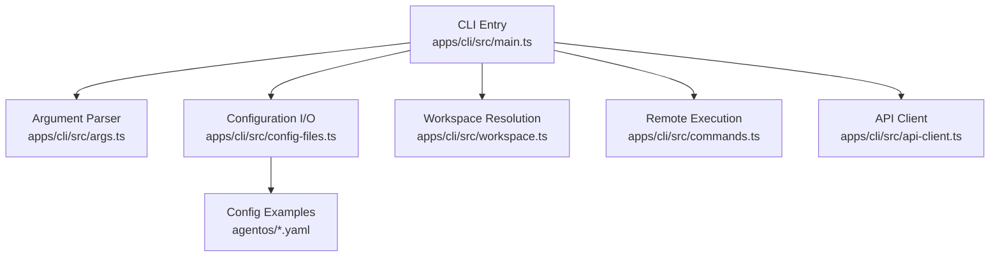
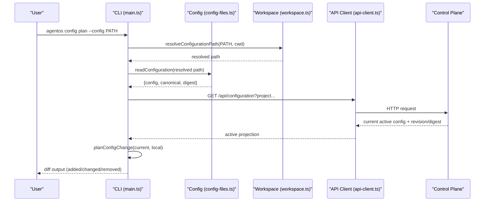
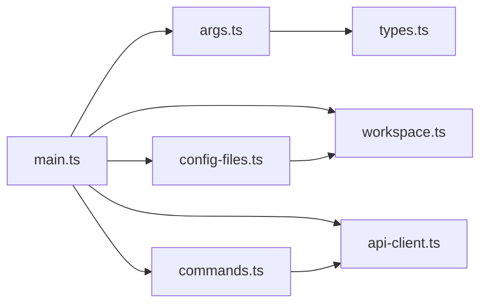

# Project Management Commands

<cite>
**Referenced Files in This Document**
- [main.ts](file://apps/cli/src/main.ts)
- [args.ts](file://apps/cli/src/args.ts)
- [commands.ts](file://apps/cli/src/commands.ts)
- [config-files.ts](file://apps/cli/src/config-files.ts)
- [workspace.ts](file://apps/cli/src/workspace.ts)
- [types.ts](file://apps/cli/src/types.ts)
- [api-client.ts](file://apps/cli/src/api-client.ts)
- [agent-os.yaml](file://agentos/agent-os.yaml)
- [example.yaml](file://agentos/example.yaml)
- [passerine.yaml](file://agentos/passerine.yaml)
</cite>

## Table of Contents
1. [Introduction](#introduction)
2. [Project Structure](#project-structure)
3. [Core Components](#core-components)
4. [Architecture Overview](#architecture-overview)
5. [Detailed Component Analysis](#detailed-component-analysis)
6. [Dependency Analysis](#dependency-analysis)
7. [Performance Considerations](#performance-considerations)
8. [Troubleshooting Guide](#troubleshooting-guide)
9. [Conclusion](#conclusion)
10. [Appendices](#appendices)

## Introduction
This document provides detailed documentation for project management CLI commands that initialize projects, validate and plan configuration changes, and apply configuration to a remote control plane. It focuses on:
- agentos init
- agentos config validate
- agentos config plan
- agentos config apply

It also covers environment variable handling, configuration file formats, workspace requirements, and common setup and deployment workflows.

## Project Structure
The CLI is implemented under apps/cli with argument parsing, command execution, configuration loading/validation, workspace resolution, and API client integration. Configuration examples are provided under agentos.

**Diagram sources**
- [main.ts:16-39](file://apps/cli/src/main.ts#L16-L39)
- [args.ts:216-275](file://apps/cli/src/args.ts#L216-L275)
- [config-files.ts:207-294](file://apps/cli/src/config-files.ts#L207-L294)
- [workspace.ts:73-160](file://apps/cli/src/workspace.ts#L73-L160)
- [commands.ts:37-92](file://apps/cli/src/commands.ts#L37-L92)
- [api-client.ts:130-243](file://apps/cli/src/api-client.ts#L130-L243)

**Section sources**
- [main.ts:16-39](file://apps/cli/src/main.ts#L16-L39)
- [args.ts:216-275](file://apps/cli/src/args.ts#L216-L275)
- [config-files.ts:207-294](file://apps/cli/src/config-files.ts#L207-L294)
- [workspace.ts:73-160](file://apps/cli/src/workspace.ts#L73-L160)
- [commands.ts:37-92](file://apps/cli/src/commands.ts#L37-L92)
- [api-client.ts:130-243](file://apps/cli/src/api-client.ts#L130-L243)

## Core Components
- Argument parsing defines the command surface and flags for init and config subcommands.
- Configuration module reads, validates, canonicalizes, and hashes YAML configurations.
- Workspace module ensures safe paths within a repository root and prevents symlinks or unsafe permissions.
- Main orchestrates command execution, including local validation/planning and remote application.
- API client handles authenticated requests to the control plane with size limits and error mapping.

Key responsibilities:
- agentos init: create starter configuration safely inside a trusted workspace.
- agentos config validate: parse and validate configuration locally; return digest.
- agentos config plan: compare local configuration against active remote configuration and compute changes.
- agentos config apply: atomically apply canonical configuration to the control plane with idempotency and revision guards.

**Section sources**
- [args.ts:216-275](file://apps/cli/src/args.ts#L216-L275)
- [config-files.ts:207-294](file://apps/cli/src/config-files.ts#L207-L294)
- [workspace.ts:73-160](file://apps/cli/src/workspace.ts#L73-L160)
- [main.ts:186-278](file://apps/cli/src/main.ts#L186-L278)
- [api-client.ts:130-243](file://apps/cli/src/api-client.ts#L130-L243)

## Architecture Overview
The CLI follows a clear flow: parse arguments, resolve workspace and configuration path, perform local validation or planning, then optionally apply changes remotely with idempotency keys and revision checks.

**Diagram sources**
- [main.ts:205-235](file://apps/cli/src/main.ts#L205-L235)
- [config-files.ts:207-234](file://apps/cli/src/config-files.ts#L207-L234)
- [workspace.ts:122-160](file://apps/cli/src/workspace.ts#L122-L160)
- [api-client.ts:153-243](file://apps/cli/src/api-client.ts#L153-L243)

## Detailed Component Analysis

### Command: agentos init
Purpose:
- Create a starter Agent OS configuration file at a default or specified path within a trusted workspace.

Required parameters:
- None (positional).

Optional flags:
- --config PATH: Path relative to workspace root where to create the configuration. Defaults to agentos/agent-os.yaml.
- --force: Overwrite existing configuration if present.

Expected behavior:
- Resolves workspace root and ensures the target directory is trusted (no symlinks, safe permissions).
- Creates a temporary file and atomically links or renames it to the destination.
- Returns a result indicating creation and path.

Common usage scenarios:
- Initialize a new project configuration in a fresh repository.
- Re-initialize an existing configuration by using --force after reviewing changes.

Environment variables:
- Not used directly by init; authentication not required.

Examples:
- Initialize default location: run from repository root.
- Initialize custom location: specify --config with a path inside the workspace.

Error conditions:
- Missing workspace root.
- Unsafe directory permissions or symbolic links.
- Target already exists unless --force is used.

**Section sources**
- [args.ts:244-253](file://apps/cli/src/args.ts#L244-L253)
- [config-files.ts:236-294](file://apps/cli/src/config-files.ts#L236-L294)
- [workspace.ts:73-160](file://apps/cli/src/workspace.ts#L73-L160)
- [main.ts:192-196](file://apps/cli/src/main.ts#L192-L196)

### Command: agentos config validate
Purpose:
- Validate the local configuration file and compute its canonical form and digest.

Required parameters:
- None (positional).

Optional flags:
- --config PATH: Path relative to workspace root. Defaults to agentos/agent-os.yaml.

Expected behavior:
- Resolves configuration path within workspace boundaries.
- Reads and parses YAML into a typed configuration object.
- Produces canonical JSON and computes a stable digest.
- Returns success with valid flag, path, and digest.

Common usage scenarios:
- Pre-commit validation to catch configuration errors early.
- CI pipeline step to ensure configuration integrity before deployment.

Environment variables:
- Not used directly by validate.

Examples:
- Validate default configuration file.
- Validate a specific configuration path.

Error conditions:
- Invalid YAML or schema violations.
- Configuration too large.
- Path outside workspace or unsafe directories/symlinks.

**Section sources**
- [args.ts:255-263](file://apps/cli/src/args.ts#L255-L263)
- [config-files.ts:207-234](file://apps/cli/src/config-files.ts#L207-L234)
- [workspace.ts:122-160](file://apps/cli/src/workspace.ts#L122-L160)
- [main.ts:197-204](file://apps/cli/src/main.ts#L197-L204)

### Command: agentos config plan
Purpose:
- Compute the difference between the local configuration and the currently active configuration on the control plane.

Required parameters:
- None (positional).

Optional flags:
- --config PATH: Path relative to workspace root. Defaults to agentos/agent-os.yaml.

Global options:
- --url URL or AGENTOS_URL: Control-plane base URL.
- --token TOKEN or AGENTOS_API_TOKEN: Authentication token.
- --json: Machine-readable output.

Expected behavior:
- Resolves and reads local configuration.
- Fetches active configuration from control plane via GET /api/configuration with project identification.
- Computes a plan describing added, changed, or removed sections.
- Returns change summary including from/to digests and optional projectId.

Common usage scenarios:
- Review planned changes before applying.
- Integrate into CI to fail when unexpected configuration drift is detected.

Environment variables:
- AGENTOS_URL and AGENTOS_API_TOKEN can be set instead of passing flags.

Examples:
- Plan changes for default configuration.
- Plan changes for a specific configuration path.

Error conditions:
- Network or authentication failures.
- Server returns invalid projection.
- Local configuration invalid.

**Section sources**
- [args.ts:255-263](file://apps/cli/src/args.ts#L255-L263)
- [main.ts:50-66](file://apps/cli/src/main.ts#L50-L66)
- [main.ts:205-235](file://apps/cli/src/main.ts#L205-L235)
- [api-client.ts:153-243](file://apps/cli/src/api-client.ts#L153-L243)

### Command: agentos config apply
Purpose:
- Apply the local configuration to the control plane, making it active.

Required parameters:
- None (positional).

Required flags:
- --idempotency-key KEY: Unique key to make repeated calls safe and idempotent.

Optional flags:
- --config PATH: Path relative to workspace root. Defaults to agentos/agent-os.yaml.

Global options:
- --url URL or AGENTOS_URL: Control-plane base URL.
- --token TOKEN or AGENTOS_API_TOKEN: Authentication token.
- --json: Machine-readable output.

Expected behavior:
- Resolves and reads local configuration.
- Fetches active configuration to obtain expected revision and digest.
- Sends POST /api/configuration/apply with canonical configuration, digest, expected revision/digest, and idempotency key.
- Returns server response indicating success or failure.

Common usage scenarios:
- Deploy configuration changes after review via plan.
- Automate deployments in CI/CD pipelines with idempotency keys generated per run.

Environment variables:
- AGENTOS_URL and AGENTOS_API_TOKEN can be set instead of passing flags.

Examples:
- Apply configuration with a unique idempotency key per run.
- Apply a specific configuration path.

Error conditions:
- Idempotency conflicts or stale revisions.
- Invalid or non-canonical configuration.
- Network or authentication failures.

**Section sources**
- [args.ts:265-274](file://apps/cli/src/args.ts#L265-L274)
- [main.ts:237-264](file://apps/cli/src/main.ts#L237-L264)
- [api-client.ts:153-243](file://apps/cli/src/api-client.ts#L153-L243)

### Environment Variables and Global Options
- AGENTOS_URL: Base URL for the control plane. Required for remote operations.
- AGENTOS_API_TOKEN: API bearer token. Required for remote operations.
- --url and --token flags override environment variables.
- --json enables stable machine-readable output across commands.

Security notes:
- URLs must be HTTPS except for localhost variants.
- Tokens are validated and redacted in error messages.

**Section sources**
- [main.ts:50-66](file://apps/cli/src/main.ts#L50-L66)
- [api-client.ts:79-95](file://apps/cli/src/api-client.ts#L79-L95)
- [api-client.ts:130-151](file://apps/cli/src/api-client.ts#L130-L151)

### Configuration File Format and Project Structure Requirements
- Default configuration path: agentos/agent-os.yaml (relative to workspace root).
- The CLI enforces that configuration files reside within a trusted workspace root identified by markers such as .git or pnpm-workspace.yaml.
- Symbolic links are disallowed in configuration paths and parent directories.
- Directory permissions must be safe (no group/other write bits).
- Configuration content is parsed into a typed structure, canonicalized, and hashed for stability.

Example configuration files:
- agentos/agent-os.yaml: Minimal example with project, models, agents, environments, pipelines, policies, budgets, goals, runtime.
- agentos/example.yaml: Example with comments and optional model routing.
- agentos/passerine.yaml: Complex multi-agent workflow configuration with multiple environments and pipelines.

These files demonstrate typical fields:
- version, project (name, defaultBranch, repository), models, agents, environments, pipelines, policies, budgets, goals, runtime.

**Section sources**
- [args.ts:22-23](file://apps/cli/src/args.ts#L22-L23)
- [workspace.ts:7-21](file://apps/cli/src/workspace.ts#L7-L21)
- [workspace.ts:23-34](file://apps/cli/src/workspace.ts#L23-L34)
- [config-files.ts:79-139](file://apps/cli/src/config-files.ts#L79-L139)
- [agent-os.yaml:1-61](file://agentos/agent-os.yaml#L1-L61)
- [example.yaml:1-73](file://agentos/example.yaml#L1-L73)
- [passerine.yaml:1-252](file://agentos/passerine.yaml#L1-L252)

### Common Workflows and Examples

#### Project Initialization
Steps:
1. Ensure you are inside a repository root.
2. Run agentos init to create agentos/agent-os.yaml.
3. Optionally customize the configuration file.

Validation:
- Use agentos config validate to check syntax and schema.

**Section sources**
- [args.ts:244-253](file://apps/cli/src/args.ts#L244-L253)
- [config-files.ts:236-294](file://apps/cli/src/config-files.ts#L236-L294)

#### Configuration Validation Workflow
Steps:
1. Edit agentos/agent-os.yaml.
2. Run agentos config validate to confirm validity and capture digest.
3. Commit changes and proceed to plan.

**Section sources**
- [args.ts:255-263](file://apps/cli/src/args.ts#L255-L263)
- [config-files.ts:207-234](file://apps/cli/src/config-files.ts#L207-L234)

#### Deployment Preparation Steps
Steps:
1. Run agentos config plan to preview changes against active configuration.
2. Review the plan output for unexpected modifications.
3. Run agentos config apply with a unique idempotency key to deploy.

Idempotency:
- Use a deterministic key per intended change (e.g., based on commit SHA) to avoid duplicate applications.

**Section sources**
- [main.ts:205-264](file://apps/cli/src/main.ts#L205-L264)
- [api-client.ts:153-243](file://apps/cli/src/api-client.ts#L153-L243)

## Dependency Analysis
The CLI components have clear separation of concerns:
- args.ts depends on types.ts for command shapes.
- main.ts composes args, config-files, workspace, and api-client.
- config-files depends on workspace for trust boundaries and core for config parsing/canonicalization.
- commands.ts maps remote commands to API endpoints.
- api-client encapsulates network communication and error handling.

**Diagram sources**
- [args.ts:216-275](file://apps/cli/src/args.ts#L216-L275)
- [types.ts:1-79](file://apps/cli/src/types.ts#L1-L79)
- [main.ts:186-278](file://apps/cli/src/main.ts#L186-L278)
- [config-files.ts:207-294](file://apps/cli/src/config-files.ts#L207-L294)
- [workspace.ts:73-160](file://apps/cli/src/workspace.ts#L73-L160)
- [commands.ts:37-92](file://apps/cli/src/commands.ts#L37-L92)
- [api-client.ts:130-243](file://apps/cli/src/api-client.ts#L130-L243)

**Section sources**
- [args.ts:216-275](file://apps/cli/src/args.ts#L216-L275)
- [types.ts:1-79](file://apps/cli/src/types.ts#L1-L79)
- [main.ts:186-278](file://apps/cli/src/main.ts#L186-L278)
- [config-files.ts:207-294](file://apps/cli/src/config-files.ts#L207-L294)
- [workspace.ts:73-160](file://apps/cli/src/workspace.ts#L73-L160)
- [commands.ts:37-92](file://apps/cli/src/commands.ts#L37-L92)
- [api-client.ts:130-243](file://apps/cli/src/api-client.ts#L130-L243)

## Performance Considerations
- Configuration reading is bounded by maximum bytes to prevent memory exhaustion.
- Canonical configuration size is enforced to keep payloads manageable.
- API responses are bounded to limit memory usage during network transfers.
- Requests include timeouts to avoid hanging operations.
- Idempotency keys reduce redundant work on retries.

[No sources needed since this section provides general guidance]

## Troubleshooting Guide
Common issues and resolutions:
- Missing workspace root: Ensure commands are run inside a repository with recognized markers.
- Unsafe directory permissions or symlinks: Adjust permissions and remove symbolic links in configuration paths.
- Configuration too large: Reduce configuration size or split logic appropriately.
- Authentication failures: Verify AGENTOS_URL and AGENTOS_API_TOKEN or pass --url and --token flags.
- Stale configuration: Re-run plan to refresh active state before applying.
- Idempotency conflicts: Generate a new idempotency key for each distinct intended change.

Error categories:
- Usage errors: Invalid arguments or missing required flags.
- Request errors: Network or server-side validation failures.
- Internal errors: Unexpected exceptions.

Output modes:
- Human-readable by default.
- Machine-readable with --json for automation.

**Section sources**
- [args.ts:12-20](file://apps/cli/src/args.ts#L12-L20)
- [args.ts:46-86](file://apps/cli/src/args.ts#L46-L86)
- [workspace.ts:23-34](file://apps/cli/src/workspace.ts#L23-L34)
- [workspace.ts:73-160](file://apps/cli/src/workspace.ts#L73-L160)
- [config-files.ts:141-185](file://apps/cli/src/config-files.ts#L141-L185)
- [main.ts:281-322](file://apps/cli/src/main.ts#L281-L322)
- [api-client.ts:79-95](file://apps/cli/src/api-client.ts#L79-L95)
- [api-client.ts:130-151](file://apps/cli/src/api-client.ts#L130-L151)
- [api-client.ts:153-243](file://apps/cli/src/api-client.ts#L153-L243)

## Conclusion
The Agent OS CLI provides a robust, secure, and predictable interface for initializing projects and managing configuration lifecycles. With strict workspace enforcement, configuration validation, planning, and idempotent application, teams can confidently automate setup and deployment while maintaining safety and reproducibility.

[No sources needed since this section summarizes without analyzing specific files]

## Appendices

### Command Reference Summary

- agentos init
  - Flags: --config PATH, --force
  - Behavior: Creates starter configuration in a trusted workspace.

- agentos config validate
  - Flags: --config PATH
  - Behavior: Validates configuration and returns digest.

- agentos config plan
  - Flags: --config PATH
  - Global: --url, --token, --json
  - Behavior: Plans differences between local and active configuration.

- agentos config apply
  - Flags: --config PATH, --idempotency-key KEY
  - Global: --url, --token, --json
  - Behavior: Applies canonical configuration with revision guards.

**Section sources**
- [args.ts:244-274](file://apps/cli/src/args.ts#L244-L274)
- [main.ts:16-39](file://apps/cli/src/main.ts#L16-L39)