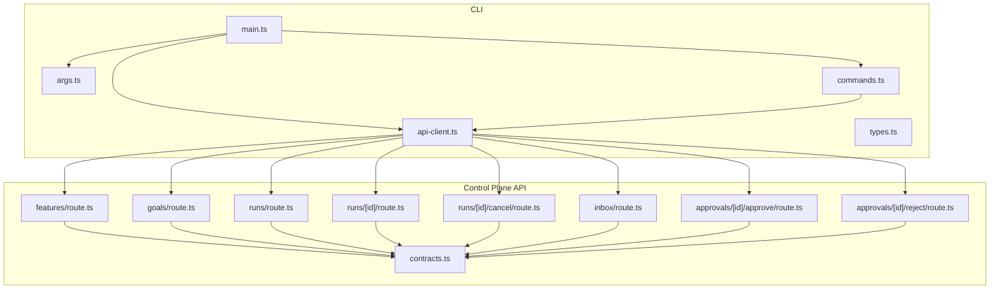
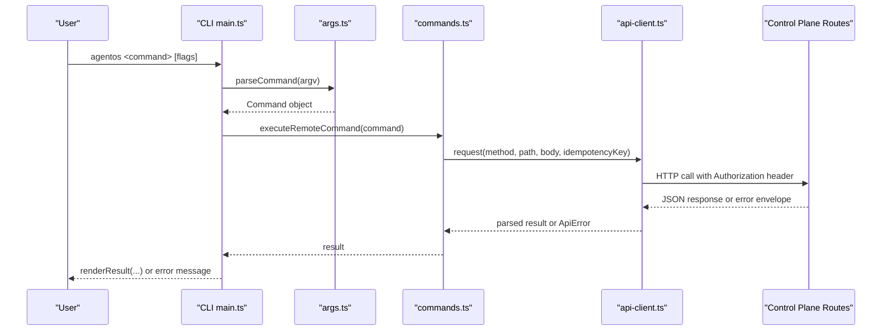
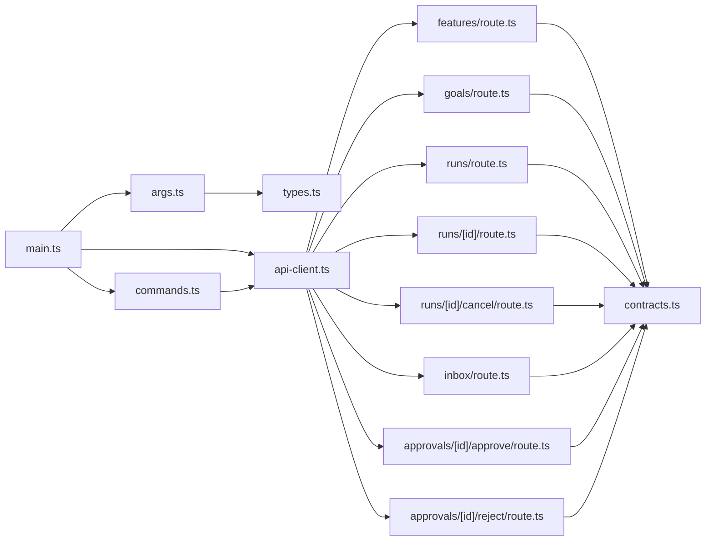

# Run Execution Commands

<cite>
**Referenced Files in This Document**
- [main.ts](file://apps/cli/src/main.ts)
- [args.ts](file://apps/cli/src/args.ts)
- [types.ts](file://apps/cli/src/types.ts)
- [commands.ts](file://apps/cli/src/commands.ts)
- [api-client.ts](file://apps/cli/src/api-client.ts)
- [features/route.ts](file://apps/control-plane/app/api/features/route.ts)
- [goals/route.ts](file://apps/control-plane/app/api/goals/route.ts)
- [runs/route.ts](file://apps/control-plane/app/api/runs/route.ts)
- [runs/[id]/route.ts](file://apps/control-plane/app/api/runs/[id]/route.ts)
- [runs/[id]/cancel/route.ts](file://apps/control-plane/app/api/runs/[id]/cancel/route.ts)
- [inbox/route.ts](file://apps/control-plane/app/api/inbox/route.ts)
- [approvals/[id]/approve/route.ts](file://apps/control-plane/app/api/approvals/[id]/approve/route.ts)
- [approvals/[id]/reject/route.ts](file://apps/control-plane/app/api/approvals/[id]/reject/route.ts)
- [contracts.ts](file://apps/control-plane/src/http/contracts.ts)
</cite>

## Table of Contents
1. [Introduction](#introduction)
2. [Project Structure](#project-structure)
3. [Core Components](#core-components)
4. [Architecture Overview](#architecture-overview)
5. [Detailed Component Analysis](#detailed-component-analysis)
6. [Dependency Analysis](#dependency-analysis)
7. [Performance Considerations](#performance-considerations)
8. [Troubleshooting Guide](#troubleshooting-guide)
9. [Conclusion](#conclusion)

## Introduction
This document explains the run execution CLI commands for starting, monitoring, and managing feature development runs and goal achievement runs. It covers:
- Starting runs: agentos feature start, agentos goal start
- Monitoring runs: agentos runs list, agentos runs show, agentos goal show
- Managing runs: agentos runs cancel
- Handling approvals and messages: agentos inbox list, agentos inbox reply, agentos inbox approve, agentos inbox reject

For each command, it specifies required parameters (such as projectId, title, description, repositorySha, modelDigest), shows how to initiate different types of runs, monitor progress, handle approvals, and manage lifecycle. It also includes error handling patterns and troubleshooting guidance based on the CLI and control plane implementation.

## Project Structure
The CLI is implemented in apps/cli/src with argument parsing, command routing, and API client logic. The control plane exposes REST endpoints under /api that implement the server-side behavior for runs, goals, features, inbox, and approvals.

**Diagram sources**
- [main.ts:186-278](file://apps/cli/src/main.ts#L186-L278)
- [args.ts:216-358](file://apps/cli/src/args.ts#L216-L358)
- [commands.ts:20-92](file://apps/cli/src/commands.ts#L20-L92)
- [api-client.ts:153-243](file://apps/cli/src/api-client.ts#L153-L243)
- [features/route.ts:10-26](file://apps/control-plane/app/api/features/route.ts#L10-L26)
- [goals/route.ts:10-35](file://apps/control-plane/app/api/goals/route.ts#L10-L35)
- [runs/route.ts:13-30](file://apps/control-plane/app/api/runs/route.ts#L13-L30)
- [runs/[id]/route.ts:9-25](file://apps/control-plane/app/api/runs/[id]/route.ts#L9-L25)
- [runs/[id]/cancel/route.ts:11-31](file://apps/control-plane/app/api/runs/[id]/cancel/route.ts#L11-L31)
- [inbox/route.ts:11-33](file://apps/control-plane/app/api/inbox/route.ts#L11-L33)
- [approvals/[id]/approve/route.ts:11-33](file://apps/control-plane/app/api/approvals/[id]/approve/route.ts#L11-L33)
- [approvals/[id]/reject/route.ts:11-33](file://apps/control-plane/app/api/approvals/[id]/reject/route.ts#L11-L33)
- [contracts.ts:14-55](file://apps/control-plane/src/http/contracts.ts#L14-L55)

**Section sources**
- [main.ts:16-39](file://apps/cli/src/main.ts#L16-L39)
- [args.ts:216-358](file://apps/cli/src/args.ts#L216-L358)
- [commands.ts:20-92](file://apps/cli/src/commands.ts#L20-L92)
- [api-client.ts:153-243](file://apps/cli/src/api-client.ts#L153-L243)

## Core Components
- Argument parsing and validation: defines flags, required fields, and command structure for all run-related commands.
- Command routing: maps parsed commands to HTTP requests against the control plane.
- API client: handles authentication, timeouts, request/response size limits, and error mapping.
- Control plane routes: enforce schemas, authenticate, and delegate to service methods for creating/listing/showing/canceling runs and handling inbox/approvals.

Key responsibilities:
- Start a feature run: POST /api/features
- Start a goal run: POST /api/goals
- List runs: GET /api/runs
- Show a run: GET /api/runs/{id}
- Cancel a run: POST /api/runs/{id}/cancel
- Inbox operations: GET /api/inbox, POST /api/inbox/{id}/reply, POST /api/approvals/{id}/approve|reject

**Section sources**
- [args.ts:112-161](file://apps/cli/src/args.ts#L112-L161)
- [commands.ts:20-92](file://apps/cli/src/commands.ts#L20-L92)
- [api-client.ts:153-243](file://apps/cli/src/api-client.ts#L153-L243)
- [features/route.ts:10-26](file://apps/control-plane/app/api/features/route.ts#L10-L26)
- [goals/route.ts:10-35](file://apps/control-plane/app/api/goals/route.ts#L10-L35)
- [runs/route.ts:13-30](file://apps/control-plane/app/api/runs/route.ts#L13-L30)
- [runs/[id]/route.ts:9-25](file://apps/control-plane/app/api/runs/[id]/route.ts#L9-L25)
- [runs/[id]/cancel/route.ts:11-31](file://apps/control-plane/app/api/runs/[id]/cancel/route.ts#L11-L31)
- [inbox/route.ts:11-33](file://apps/control-plane/app/api/inbox/route.ts#L11-L33)
- [approvals/[id]/approve/route.ts:11-33](file://apps/control-plane/app/api/approvals/[id]/approve/route.ts#L11-L33)
- [approvals/[id]/reject/route.ts:11-33](file://apps/control-plane/app/api/approvals/[id]/reject/route.ts#L11-L33)

## Architecture Overview
End-to-end flow for run execution via CLI:

**Diagram sources**
- [main.ts:186-278](file://apps/cli/src/main.ts#L186-L278)
- [args.ts:216-358](file://apps/cli/src/args.ts#L216-L358)
- [commands.ts:20-92](file://apps/cli/src/commands.ts#L20-L92)
- [api-client.ts:153-243](file://apps/cli/src/api-client.ts#L153-L243)

## Detailed Component Analysis

### Global Options and Authentication
- URL and token are required for all remote commands. They can be provided via flags or environment variables.
- The API client enforces HTTPS (except localhost), validates tokens, and sets Authorization headers.
- Timeouts and size limits protect against long-running or oversized requests/responses.

**Section sources**
- [main.ts:50-66](file://apps/cli/src/main.ts#L50-L66)
- [api-client.ts:79-95](file://apps/cli/src/api-client.ts#L79-L95)
- [api-client.ts:136-151](file://apps/cli/src/api-client.ts#L136-L151)
- [api-client.ts:199-211](file://apps/cli/src/api-client.ts#L199-L211)

### Starting a Feature Run: agentos feature start
Purpose: Create a new feature development run bound to a project and repository commit.

Required parameters:
- --project-id: unique project identifier
- --title: short title for the run
- --description: detailed description
- --repository-sha: 40-character hex SHA of the repository commit
- --config-digest: digest of the configuration used
- --model-digest: digest of the model used
- --prompt-digest: digest of the prompt used
- --environment-digest: digest of the environment used
- --policy-digest: digest of the policy used
- --idempotency-key: unique key to make repeated invocations safe

Behavior:
- Validates arguments and constructs a POST request to /api/features with the above fields.
- Server enforces schema constraints and returns a run projection on success.

Example usage pattern:
- Prepare digests from your build/config pipeline.
- Generate an idempotency key per run attempt.
- Invoke the command with all required flags; use --json for machine-readable output.

Monitoring after start:
- Use agentos runs show <run-id> to check status and details.
- Use agentos runs list to see recent runs, optionally filtered by project.

**Section sources**
- [args.ts:112-161](file://apps/cli/src/args.ts#L112-L161)
- [commands.ts:20-51](file://apps/cli/src/commands.ts#L20-L51)
- [features/route.ts:10-26](file://apps/control-plane/app/api/features/route.ts#L10-L26)
- [contracts.ts:14-26](file://apps/control-plane/src/http/contracts.ts#L14-L26)
- [runs/[id]/route.ts:9-25](file://apps/control-plane/app/api/runs/[id]/route.ts#L9-L25)
- [runs/route.ts:13-30](file://apps/control-plane/app/api/runs/route.ts#L13-L30)

### Starting a Goal Run: agentos goal start
Purpose: Create a new goal achievement run with criteria that must be satisfied.

Additional parameter compared to feature start:
- --criteria-json: JSON array of up to 20 command criteria, each with id, type ("command"), description, optional required flag, and command string. IDs must be unique.

Behavior:
- Parses and validates criteria locally before sending to the server.
- Sends POST /api/goals with the same base fields plus criteria.
- Server enforces schema and uniqueness constraints.

Example usage pattern:
- Define clear, testable commands for each criterion.
- Mark some criteria as required if necessary.
- Provide an idempotency key and all other required flags.

Monitoring after start:
- Use agentos goal show <run-id> or agentos runs show <run-id> to inspect steps, criteria results, and timeline.

**Section sources**
- [args.ts:163-214](file://apps/cli/src/args.ts#L163-L214)
- [commands.ts:20-51](file://apps/cli/src/commands.ts#L20-L51)
- [goals/route.ts:10-35](file://apps/control-plane/app/api/goals/route.ts#L10-L35)
- [contracts.ts:28-52](file://apps/control-plane/src/http/contracts.ts#L28-L52)
- [runs/[id]/route.ts:9-25](file://apps/control-plane/app/api/runs/[id]/route.ts#L9-L25)

### Listing Runs: agentos runs list
Purpose: Retrieve a paginated list of recent runs.

Optional filtering:
- Query by project ID when supported by the endpoint.

Output:
- Array of run projections including id, project, pipeline, status, timestamps, and summary fields.

Use cases:
- Quick overview of recent activity.
- Identify run IDs to inspect or cancel.

**Section sources**
- [commands.ts:52-54](file://apps/cli/src/commands.ts#L52-L54)
- [runs/route.ts:13-30](file://apps/control-plane/app/api/runs/route.ts#L13-L30)
- [contracts.ts:130-263](file://apps/control-plane/src/http/contracts.ts#L130-L263)

### Showing a Run: agentos runs show and agentos goal show
Purpose: Get detailed information about a specific run.

Parameters:
- <run-id>: the run identifier

Output:
- Full run projection including input, status, error, goal details (for goal runs), outcome, repository/model/prompt/environment/policy digests, steps, and timeline events.

Use cases:
- Inspect current step and status.
- Review errors and timeline events.
- For goal runs, review latest results per criterion and child runs.

**Section sources**
- [commands.ts:55-61](file://apps/cli/src/commands.ts#L55-L61)
- [runs/[id]/route.ts:9-25](file://apps/control-plane/app/api/runs/[id]/route.ts#L9-L25)
- [contracts.ts:130-263](file://apps/control-plane/src/http/contracts.ts#L130-L263)

### Canceling a Run: agentos runs cancel
Purpose: Request cancellation of a running or pending run.

Parameters:
- <run-id>: the run identifier
- --idempotency-key: required to safely retry cancellation

Behavior:
- Sends POST /api/runs/{id}/cancel with empty body and idempotency key.
- Returns updated run projection reflecting cancellation state.

Use cases:
- Stop long-running or unwanted runs.
- Retry cancellation safely using the same idempotency key.

**Section sources**
- [commands.ts:62-69](file://apps/cli/src/commands.ts#L62-L69)
- [runs/[id]/cancel/route.ts:11-31](file://apps/control-plane/app/api/runs/[id]/cancel/route.ts#L11-L31)
- [contracts.ts:54-55](file://apps/control-plane/src/http/contracts.ts#L54-L55)

### Inbox and Approvals: agentos inbox list, reply, approve, reject
Purpose: Interact with messages and approvals generated during runs.

Commands:
- agentos inbox list: retrieve pending messages and approvals for a project.
- agentos inbox reply <id> (--reply TEXT | --file PATH | stdin) --idempotency-key: respond to a message.
- agentos inbox approve <id> --scope-hash HASH --idempotency-key: approve an approval.
- agentos inbox reject <id> --scope-hash HASH --idempotency-key: reject an approval.

Parameters:
- Reply content must be non-empty and bounded in size.
- Scope hash identifies the scope of the approval decision.
- Idempotency keys ensure safe retries.

Workflow:
- List inbox to find pending items.
- Reply to questions or provide answers.
- Approve or reject approvals with the correct scope hash.

**Section sources**
- [main.ts:265-278](file://apps/cli/src/main.ts#L265-L278)
- [args.ts:317-356](file://apps/cli/src/args.ts#L317-L356)
- [commands.ts:70-89](file://apps/cli/src/commands.ts#L70-L89)
- [inbox/route.ts:11-33](file://apps/control-plane/app/api/inbox/route.ts#L11-L33)
- [approvals/[id]/approve/route.ts:11-33](file://apps/control-plane/app/api/approvals/[id]/approve/route.ts#L11-L33)
- [approvals/[id]/reject/route.ts:11-33](file://apps/control-plane/app/api/approvals/[id]/reject/route.ts#L11-L33)
- [contracts.ts:121-128](file://apps/control-plane/src/http/contracts.ts#L121-L128)
- [contracts.ts:294-359](file://apps/control-plane/src/http/contracts.ts#L294-L359)

### Data Models and Schemas
Run creation and projections are strictly validated on both CLI and server sides:
- Run inputs include project, title, description, repository SHA, and multiple digests.
- Goal runs add criteria arrays with strict field rules and uniqueness checks.
- Run projections expose status, steps, timeline, and goal-specific data.

**Section sources**
- [contracts.ts:14-52](file://apps/control-plane/src/http/contracts.ts#L14-L52)
- [contracts.ts:130-263](file://apps/control-plane/src/http/contracts.ts#L130-L263)

## Dependency Analysis
High-level dependencies between CLI modules and control plane routes:

**Diagram sources**
- [args.ts:216-358](file://apps/cli/src/args.ts#L216-L358)
- [types.ts:1-79](file://apps/cli/src/types.ts#L1-L79)
- [main.ts:186-278](file://apps/cli/src/main.ts#L186-L278)
- [commands.ts:20-92](file://apps/cli/src/commands.ts#L20-L92)
- [api-client.ts:153-243](file://apps/cli/src/api-client.ts#L153-L243)
- [features/route.ts:10-26](file://apps/control-plane/app/api/features/route.ts#L10-L26)
- [goals/route.ts:10-35](file://apps/control-plane/app/api/goals/route.ts#L10-L35)
- [runs/route.ts:13-30](file://apps/control-plane/app/api/runs/route.ts#L13-L30)
- [runs/[id]/route.ts:9-25](file://apps/control-plane/app/api/runs/[id]/route.ts#L9-L25)
- [runs/[id]/cancel/route.ts:11-31](file://apps/control-plane/app/api/runs/[id]/cancel/route.ts#L11-L31)
- [inbox/route.ts:11-33](file://apps/control-plane/app/api/inbox/route.ts#L11-L33)
- [approvals/[id]/approve/route.ts:11-33](file://apps/control-plane/app/api/approvals/[id]/approve/route.ts#L11-L33)
- [approvals/[id]/reject/route.ts:11-33](file://apps/control-plane/app/api/approvals/[id]/reject/route.ts#L11-L33)
- [contracts.ts:14-55](file://apps/control-plane/src/http/contracts.ts#L14-L55)

**Section sources**
- [commands.ts:20-92](file://apps/cli/src/commands.ts#L20-L92)
- [api-client.ts:153-243](file://apps/cli/src/api-client.ts#L153-L243)

## Performance Considerations
- Request and response sizes are bounded to prevent excessive memory usage.
- Timeouts protect against hanging requests.
- Idempotency keys allow safe retries without duplicating work.
- Pagination is limited to a fixed page size for listing runs and inbox.

[No sources needed since this section provides general guidance]

## Troubleshooting Guide
Common issues and resolutions:

- Missing or invalid URL/token:
  - Ensure AGENTOS_URL or --url points to a valid HTTPS URL (or http://localhost).
  - Ensure AGENTOS_API_TOKEN or --token is set and valid.

- Validation errors:
  - Required flags must be provided and within length limits.
  - Repository SHA must be a 40-character hexadecimal value.
  - Criteria JSON must be a valid array with allowed fields and unique IDs.

- Idempotency key required:
  - Mutations (start, cancel, inbox reply/approve/reject) require an idempotency key.
  - Reuse the same key for retries to avoid duplicate actions.

- Remote error codes:
  - Errors such as invalid_state, not_found, payload_too_large, configuration_invalid, and others are mapped to structured ApiError objects with codes.
  - Use --json to get machine-readable error envelopes for automation.

- Large replies:
  - Reply content is bounded; split large responses into files or smaller chunks.

- Network or timeout failures:
  - Check connectivity and consider increasing timeout if supported by your environment.

**Section sources**
- [main.ts:281-322](file://apps/cli/src/main.ts#L281-L322)
- [api-client.ts:14-33](file://apps/cli/src/api-client.ts#L14-33)
- [api-client.ts:97-128](file://apps/cli/src/api-client.ts#L97-L128)
- [api-client.ts:166-217](file://apps/cli/src/api-client.ts#L166-L217)
- [api-client.ts:231-241](file://apps/cli/src/api-client.ts#L231-L241)
- [args.ts:46-67](file://apps/cli/src/args.ts#L46-L67)
- [args.ts:130-135](file://apps/cli/src/args.ts#L130-L135)
- [args.ts:163-214](file://apps/cli/src/args.ts#L163-L214)
- [contracts.ts:362-371](file://apps/control-plane/src/http/contracts.ts#L362-L371)

## Conclusion
The run execution CLI provides a robust, validated interface to create and manage feature and goal runs, monitor their progress, and interact with approvals and messages. By combining strict argument parsing, secure API communication, and server-side schema enforcement, it ensures reliable operation across local and remote environments. Use the listed commands and parameters to start, track, and control runs effectively, and rely on the error codes and structured outputs for automation and troubleshooting.