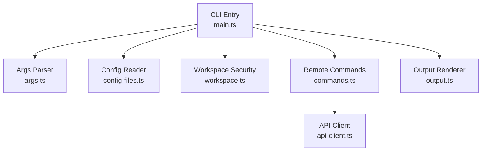
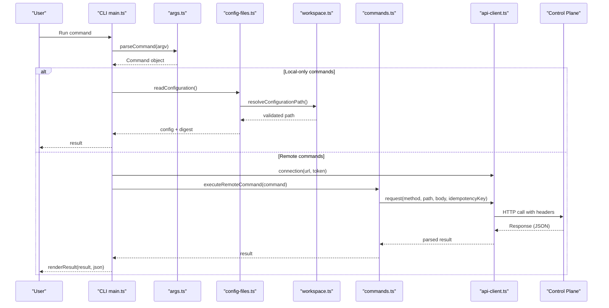
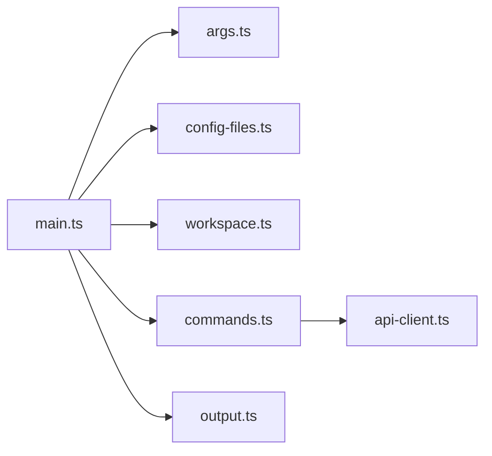

# Troubleshooting and Error Handling

<cite>
**Referenced Files in This Document**
- [main.ts](file://apps/cli/src/main.ts)
- [api-client.ts](file://apps/cli/src/api-client.ts)
- [config-files.ts](file://apps/cli/src/config-files.ts)
- [args.ts](file://apps/cli/src/args.ts)
- [commands.ts](file://apps/cli/src/commands.ts)
- [types.ts](file://apps/cli/src/types.ts)
- [workspace.ts](file://apps/cli/src/workspace.ts)
- [output.ts](file://apps/cli/src/output.ts)
- [main.test.ts](file://apps/cli/src/main.test.ts)
- [api-client.test.ts](file://apps/cli/src/api-client.test.ts)
- [config-files.test.ts](file://apps/cli/src/config-files.test.ts)
</cite>

## Table of Contents
1. [Introduction](#introduction)
2. [Project Structure](#project-structure)
3. [Core Components](#core-components)
4. [Architecture Overview](#architecture-overview)
5. [Detailed Component Analysis](#detailed-component-analysis)
6. [Dependency Analysis](#dependency-analysis)
7. [Performance Considerations](#performance-considerations)
8. [Troubleshooting Guide](#troubleshooting-guide)
9. [Conclusion](#conclusion)

## Introduction
This document provides a comprehensive troubleshooting guide for the Agent OS CLI, focusing on common error scenarios, their causes, and step-by-step resolution procedures. It covers authentication failures, network connectivity issues, configuration errors, and API communication problems. It also includes debugging techniques, log analysis guidance, diagnostic commands, and performance tips for large-scale operations.

## Project Structure
The CLI is implemented as a Node.js application with clear separation of concerns:
- Command parsing and validation
- Configuration file handling and workspace security checks
- HTTP client with strict security and size limits
- Remote command execution mapping to API endpoints
- Output rendering for human-friendly and machine-readable formats

**Diagram sources**
- [main.ts:186-279](file://apps/cli/src/main.ts#L186-L279)
- [args.ts:216-358](file://apps/cli/src/args.ts#L216-L358)
- [config-files.ts:207-234](file://apps/cli/src/config-files.ts#L207-L234)
- [workspace.ts:122-160](file://apps/cli/src/workspace.ts#L122-L160)
- [commands.ts:37-92](file://apps/cli/src/commands.ts#L37-L92)
- [api-client.ts:130-243](file://apps/cli/src/api-client.ts#L130-L243)
- [output.ts:118-139](file://apps/cli/src/output.ts#L118-L139)

**Section sources**
- [main.ts:1-323](file://apps/cli/src/main.ts#L1-L323)
- [args.ts:1-359](file://apps/cli/src/args.ts#L1-L359)
- [config-files.ts:1-295](file://apps/cli/src/config-files.ts#L1-L295)
- [workspace.ts:1-161](file://apps/cli/src/workspace.ts#L1-L161)
- [commands.ts:1-93](file://apps/cli/src/commands.ts#L1-L93)
- [api-client.ts:1-245](file://apps/cli/src/api-client.ts#L1-L245)
- [output.ts:1-140](file://apps/cli/src/output.ts#L1-L140)

## Core Components
- CLI entrypoint orchestrates command parsing, configuration loading, remote execution, and output formatting.
- Argument parser enforces allowed flags per command, validates IDs and payloads, and produces structured commands.
- Configuration module reads, validates, canonicalizes, and hashes configuration files with strict size and trust boundaries.
- Workspace module discovers repository roots, prevents symbolic link traversal, and ensures directory permissions are safe.
- API client enforces HTTPS (except localhost), bearer token validation, request/response size limits, timeouts, and redacts secrets from errors.
- Commands module maps CLI commands to API requests with idempotency keys where applicable.
- Output module renders stable JSON or tabular human-friendly results.

**Section sources**
- [main.ts:186-323](file://apps/cli/src/main.ts#L186-L323)
- [args.ts:216-358](file://apps/cli/src/args.ts#L216-L358)
- [config-files.ts:141-234](file://apps/cli/src/config-files.ts#L141-L234)
- [workspace.ts:44-160](file://apps/cli/src/workspace.ts#L44-L160)
- [api-client.ts:79-243](file://apps/cli/src/api-client.ts#L79-L243)
- [commands.ts:37-92](file://apps/cli/src/commands.ts#L37-L92)
- [output.ts:118-139](file://apps/cli/src/output.ts#L118-L139)

## Architecture Overview
The CLI follows a layered architecture:
- Input layer parses arguments and constructs typed commands.
- Configuration layer loads and validates agent-os.yaml within trusted workspaces.
- Execution layer dispatches local tasks (init, config validate/plan) or remote tasks via API.
- Transport layer handles HTTP requests with strict security and limits.
- Output layer formats responses for both humans and machines.

**Diagram sources**
- [main.ts:186-279](file://apps/cli/src/main.ts#L186-L279)
- [args.ts:216-358](file://apps/cli/src/args.ts#L216-L358)
- [config-files.ts:207-234](file://apps/cli/src/config-files.ts#L207-L234)
- [workspace.ts:122-160](file://apps/cli/src/workspace.ts#L122-L160)
- [commands.ts:37-92](file://apps/cli/src/commands.ts#L37-L92)
- [api-client.ts:153-243](file://apps/cli/src/api-client.ts#L153-L243)

## Detailed Component Analysis

### Authentication Failures
Common symptoms:
- Exit code 4 with message indicating authentication required or invalid token.
- Errors containing “[REDACTED]” when transport errors leak tokens; tokens are always redacted in error messages.

Root causes:
- Missing AGENTOS_URL or AGENTOS_API_TOKEN environment variables.
- Invalid token format (must match a strict pattern).
- Non-HTTPS URL outside localhost.
- Server rejecting token (e.g., invalid_api_token, cli_authentication_required).

Resolution steps:
- Ensure AGENTOS_URL points to an absolute HTTPS URL (or http://localhost for local development).
- Set AGENTOS_API_TOKEN to a valid bearer token without whitespace or control characters.
- If using --url/--token flags, ensure they are present and correct.
- For server-side rejections, verify token validity and permissions on the control plane.

Diagnostics:
- Use --json to get structured error codes and messages.
- Check stderr for redacted messages; do not rely on raw stack traces that may contain secrets.
- Validate URL scheme and hostname; reject URLs with embedded credentials.

**Section sources**
- [main.ts:50-66](file://apps/cli/src/main.ts#L50-L66)
- [api-client.ts:13-33](file://apps/cli/src/api-client.ts#L13-L33)
- [api-client.ts:79-95](file://apps/cli/src/api-client.ts#L79-L95)
- [api-client.ts:136-151](file://apps/cli/src/api-client.ts#L136-L151)
- [api-client.ts:231-241](file://apps/cli/src/api-client.ts#L231-L241)
- [main.test.ts:272-304](file://apps/cli/src/main.test.ts#L272-L304)
- [api-client.test.ts:27-62](file://apps/cli/src/api-client.test.ts#L27-L62)

### Network Connectivity Issues
Common symptoms:
- Request timeout errors.
- “server response is too large” or “server returned invalid JSON”.
- Connection refused or DNS resolution failures.

Root causes:
- Control plane unreachable or slow.
- Oversized responses exceeding internal limits.
- Malformed server responses.

Resolution steps:
- Verify network connectivity to AGENTOS_URL.
- Reduce payload sizes if hitting request limits.
- Retry transient failures; avoid retrying idempotent GETs unnecessarily.

Diagnostics:
- Use --json to capture structured errors.
- Confirm content-type and status codes in responses.
- Test with minimal requests (e.g., runs list) to isolate issues.

**Section sources**
- [api-client.ts:97-128](file://apps/cli/src/api-client.ts#L97-L128)
- [api-client.ts:153-217](file://apps/cli/src/api-client.ts#L153-L217)
- [api-client.ts:218-243](file://apps/cli/src/api-client.ts#L218-L243)
- [api-client.test.ts:212-261](file://apps/cli/src/api-client.test.ts#L212-L261)

### Configuration Errors
Common symptoms:
- “configuration not found”, “configuration is too large”, “invalid configuration”.
- “canonical configuration is too large”.
- “configuration path contains a symbolic link” or “workspace directory permissions are unsafe”.

Root causes:
- Missing or unreadable agent-os.yaml.
- File exceeds maximum source size.
- YAML structure invalid per schema.
- Canonical form exceeds maximum bytes.
- Unsafe workspace paths or symlinks.

Resolution steps:
- Ensure you run inside a repository root (detected by markers like .git).
- Fix YAML structure and required fields.
- Reduce configuration size or simplify complex values.
- Remove symbolic links in the configuration path and ensure parent directories have restrictive permissions.

Diagnostics:
- Use config validate to check local configuration syntax and size.
- Use config plan to compare against server state and identify changes.
- Inspect error messages for specific validation issues and paths.

**Section sources**
- [config-files.ts:141-185](file://apps/cli/src/config-files.ts#L141-L185)
- [config-files.ts:187-234](file://apps/cli/src/config-files.ts#L187-L234)
- [config-files.ts:236-294](file://apps/cli/src/config-files.ts#L236-L294)
- [workspace.ts:73-160](file://apps/cli/src/workspace.ts#L73-L160)
- [config-files.test.ts:82-154](file://apps/cli/src/config-files.test.ts#L82-L154)

### API Communication Problems
Common symptoms:
- “request body is too large”, “canonical configuration is too large”.
- “idempotency_key_required”, “idempotency_conflict”.
- “configuration_stale”, “configuration_digest_mismatch”.
- Unknown or untrusted error codes normalized to “remote_error”.

Root causes:
- Payload exceeds configured limits.
- Missing or conflicting idempotency keys for mutations.
- Concurrent modifications causing stale configurations.
- Untrusted server error codes sanitized for safety.

Resolution steps:
- Reduce request bodies; split large operations if possible.
- Provide unique idempotency keys for each mutation attempt.
- Re-run config plan before apply to refresh expected revision/digest.
- Treat unknown codes as generic remote errors and inspect messages.

Diagnostics:
- Use --json to capture structured error envelopes.
- Log request paths and methods to confirm intended endpoints.
- Validate idempotency key uniqueness per operation.

**Section sources**
- [api-client.ts:153-217](file://apps/cli/src/api-client.ts#L153-L217)
- [api-client.ts:231-243](file://apps/cli/src/api-client.ts#L231-L243)
- [commands.ts:37-92](file://apps/cli/src/commands.ts#L37-L92)
- [api-client.test.ts:115-194](file://apps/cli/src/api-client.test.ts#L115-L194)
- [api-client.test.ts:263-308](file://apps/cli/src/api-client.test.ts#L263-L308)

### Command and Argument Errors
Common symptoms:
- “unknown command”, “requires --flag”, “--flag is not valid for this command”.
- Invalid IDs or SHA formats.
- Conflicting flags (e.g., inbox reply accepts only one of --reply or --file).

Root causes:
- Mis-typed commands or missing required flags.
- Invalid identifiers or checksums.
- Using flags not allowed for a given command.

Resolution steps:
- Review help text for exact usage.
- Ensure all required flags are provided and correctly formatted.
- Avoid mutually exclusive flags; choose one input method for replies.

Diagnostics:
- Use --help to see available commands and options.
- Use --json to capture structured usage errors.

**Section sources**
- [args.ts:46-86](file://apps/cli/src/args.ts#L46-L86)
- [args.ts:112-214](file://apps/cli/src/args.ts#L112-L214)
- [args.ts:216-358](file://apps/cli/src/args.ts#L216-L358)
- [main.test.ts:34-63](file://apps/cli/src/main.test.ts#L34-L63)

### Output and Rendering Issues
Common symptoms:
- Unexpected table columns or truncated values.
- Human-readable output differs from JSON.

Root causes:
- Output renderer selects columns based on available fields and caps widths.
- JSON output is canonicalized for stability.

Resolution steps:
- Prefer --json for programmatic consumption.
- Inspect raw objects to understand available fields.

**Section sources**
- [output.ts:1-139](file://apps/cli/src/output.ts#L1-L139)

## Dependency Analysis
The CLI components have clear dependencies:
- main.ts depends on args, config-files, workspace, commands, api-client, and output.
- api-client depends on core constants and uses fetch for HTTP.
- config-files depends on workspace for trust boundary checks.
- commands maps CLI commands to API endpoints.

**Diagram sources**
- [main.ts:1-11](file://apps/cli/src/main.ts#L1-L11)
- [commands.ts:1-5](file://apps/cli/src/commands.ts#L1-L5)
- [api-client.ts:1-7](file://apps/cli/src/api-client.ts#L1-L7)
- [config-files.ts:15-28](file://apps/cli/src/config-files.ts#L15-L28)

**Section sources**
- [main.ts:1-11](file://apps/cli/src/main.ts#L1-L11)
- [commands.ts:1-93](file://apps/cli/src/commands.ts#L1-L93)
- [api-client.ts:1-245](file://apps/cli/src/api-client.ts#L1-L245)
- [config-files.ts:1-295](file://apps/cli/src/config-files.ts#L1-L295)
- [workspace.ts:1-161](file://apps/cli/src/workspace.ts#L1-L161)
- [output.ts:1-140](file://apps/cli/src/output.ts#L1-L140)

## Performance Considerations
- Request and response size limits protect against memory exhaustion; reduce payloads if hitting ceilings.
- Timeouts prevent long-running stalls; tune expectations for network latency.
- Canonicalization and hashing add CPU overhead; minimize unnecessary config churn.
- Idempotency keys enable safe retries without duplicating work; reuse them judiciously.

[No sources needed since this section provides general guidance]

## Troubleshooting Guide

### Quick Start Diagnostics
- Use --json for structured errors and outputs.
- Capture stderr to analyze error codes and messages.
- Verify environment variables: AGENTOS_URL and AGENTOS_API_TOKEN.
- Confirm working directory is inside a repository root.

### Authentication Failures
Symptoms:
- Exit code 4 with authentication-related messages.
- Redacted tokens in error strings.

Steps:
- Validate URL scheme (HTTPS except localhost).
- Ensure token matches expected format and is set via environment or flags.
- Re-authenticate on the control plane if tokens expire.

Logs and diagnostics:
- Inspect stderr for redacted messages.
- Use --json to extract error.code and error.message.

**Section sources**
- [main.ts:50-66](file://apps/cli/src/main.ts#L50-L66)
- [api-client.ts:79-95](file://apps/cli/src/api-client.ts#L79-L95)
- [api-client.ts:136-151](file://apps/cli/src/api-client.ts#L136-L151)
- [api-client.ts:231-241](file://apps/cli/src/api-client.ts#L231-L241)
- [main.test.ts:272-304](file://apps/cli/src/main.test.ts#L272-L304)

### Network Connectivity Issues
Symptoms:
- Timeouts, oversized responses, invalid JSON.

Steps:
- Test reachability to AGENTOS_URL.
- Reduce payload sizes; avoid sending excessively large bodies.
- Retry transient failures; avoid retrying non-idempotent operations without idempotency keys.

Logs and diagnostics:
- Use --json to capture structured errors.
- Check response status and content-type.

**Section sources**
- [api-client.ts:97-128](file://apps/cli/src/api-client.ts#L97-L128)
- [api-client.ts:153-217](file://apps/cli/src/api-client.ts#L153-L217)
- [api-client.test.ts:212-261](file://apps/cli/src/api-client.test.ts#L212-L261)

### Configuration Errors
Symptoms:
- Not found, too large, invalid configuration, canonical too large.
- Symbolic link or permission errors.

Steps:
- Run inside a repository root; ensure .git or workspace marker exists.
- Fix YAML structure; remove or reduce large values.
- Remove symbolic links in configuration path; tighten directory permissions.

Logs and diagnostics:
- Use config validate to check local configuration.
- Use config plan to detect differences with server state.

**Section sources**
- [config-files.ts:141-234](file://apps/cli/src/config-files.ts#L141-L234)
- [workspace.ts:73-160](file://apps/cli/src/workspace.ts#L73-L160)
- [config-files.test.ts:82-154](file://apps/cli/src/config-files.test.ts#L82-L154)

### API Communication Problems
Symptoms:
- Body too large, idempotency conflicts, stale configuration.

Steps:
- Reduce request sizes; split large operations.
- Provide unique idempotency keys for mutations.
- Re-run config plan before apply to refresh expected revision/digest.

Logs and diagnostics:
- Use --json to capture error envelopes.
- Log request paths and methods to verify endpoints.

**Section sources**
- [api-client.ts:153-217](file://apps/cli/src/api-client.ts#L153-L217)
- [api-client.ts:231-243](file://apps/cli/src/api-client.ts#L231-L243)
- [commands.ts:37-92](file://apps/cli/src/commands.ts#L37-L92)
- [api-client.test.ts:115-194](file://apps/cli/src/api-client.test.ts#L115-L194)
- [api-client.test.ts:263-308](file://apps/cli/src/api-client.test.ts#L263-L308)

### Command and Argument Errors
Symptoms:
- Unknown command, missing flags, invalid IDs or SHAs.

Steps:
- Consult --help for exact usage.
- Provide all required flags with correct formats.
- Avoid mutually exclusive flags.

Logs and diagnostics:
- Use --json to capture usage errors.

**Section sources**
- [args.ts:46-86](file://apps/cli/src/args.ts#L46-L86)
- [args.ts:112-214](file://apps/cli/src/args.ts#L112-L214)
- [args.ts:216-358](file://apps/cli/src/args.ts#L216-L358)
- [main.test.ts:34-63](file://apps/cli/src/main.test.ts#L34-L63)

### Large-Scale Operations
Tips:
- Batch operations where possible; avoid excessive concurrent requests.
- Use idempotency keys to safely retry failed mutations.
- Monitor request sizes to stay within limits.
- Prefer config plan to minimize unnecessary applies.

[No sources needed since this section provides general guidance]

## Conclusion
The Agent OS CLI provides robust error handling, strict security constraints, and clear diagnostics. By following the troubleshooting steps above—validating authentication, ensuring network connectivity, checking configuration integrity, and managing API interactions—you can quickly identify and resolve common issues. Use --json for structured outputs, review stderr for redacted error messages, and leverage config validate/plan to maintain consistent state between local and server configurations.