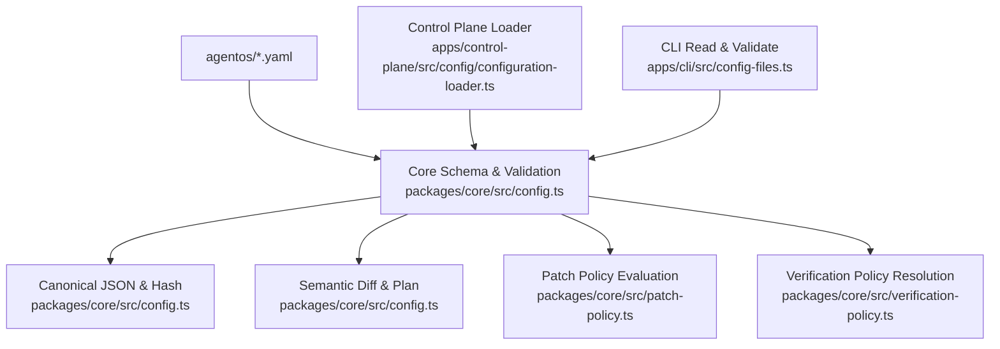
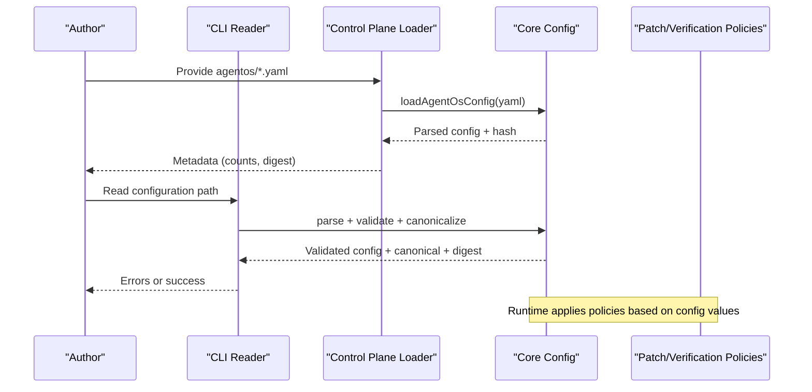
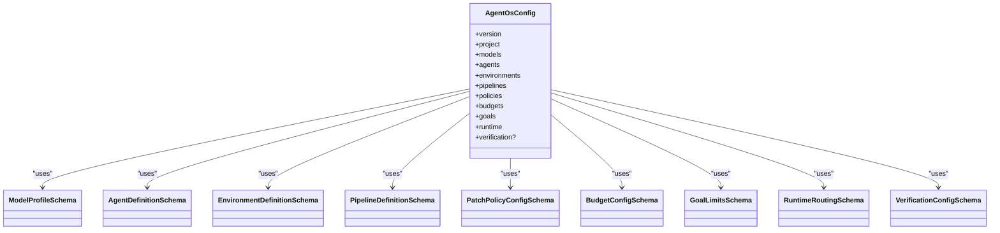
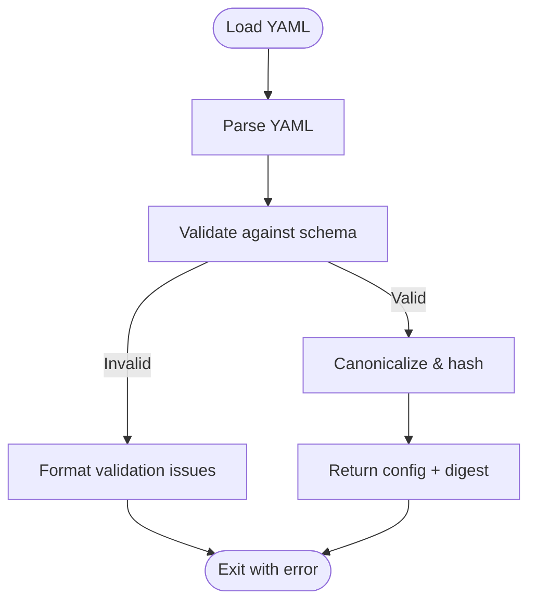
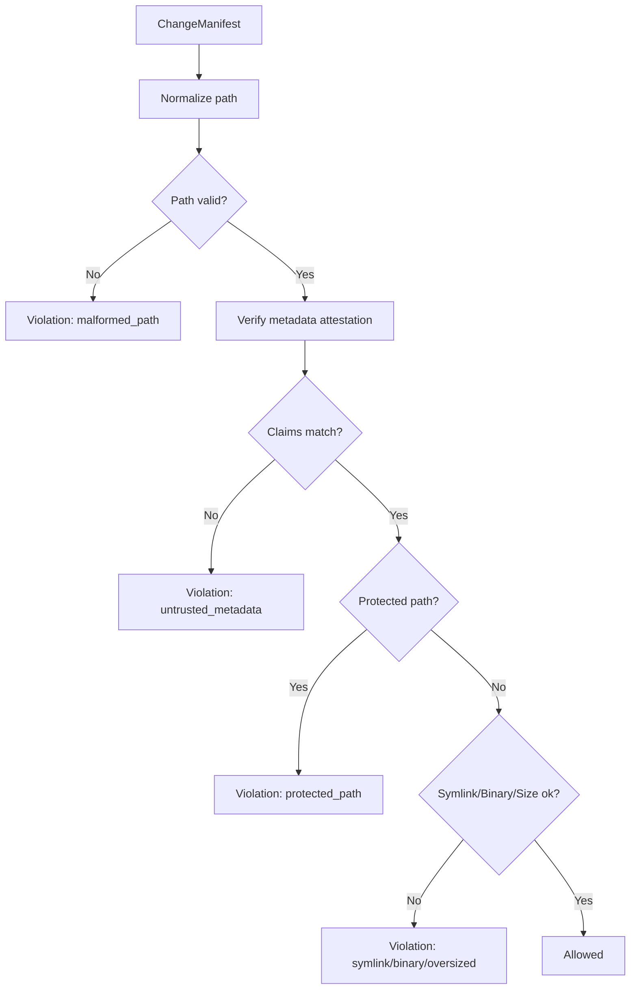
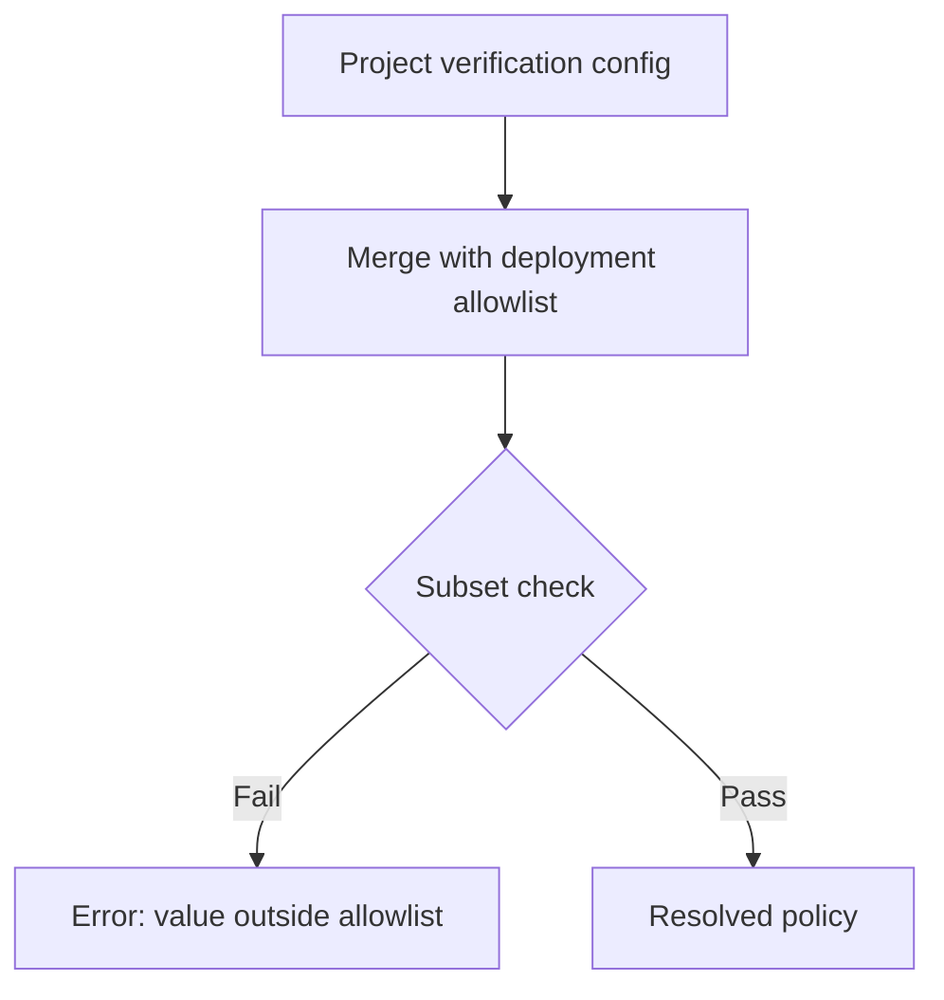
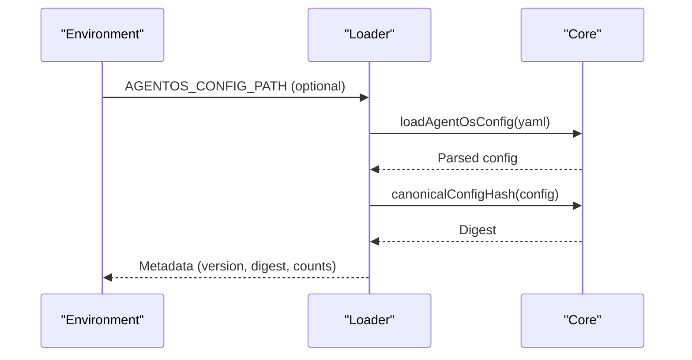
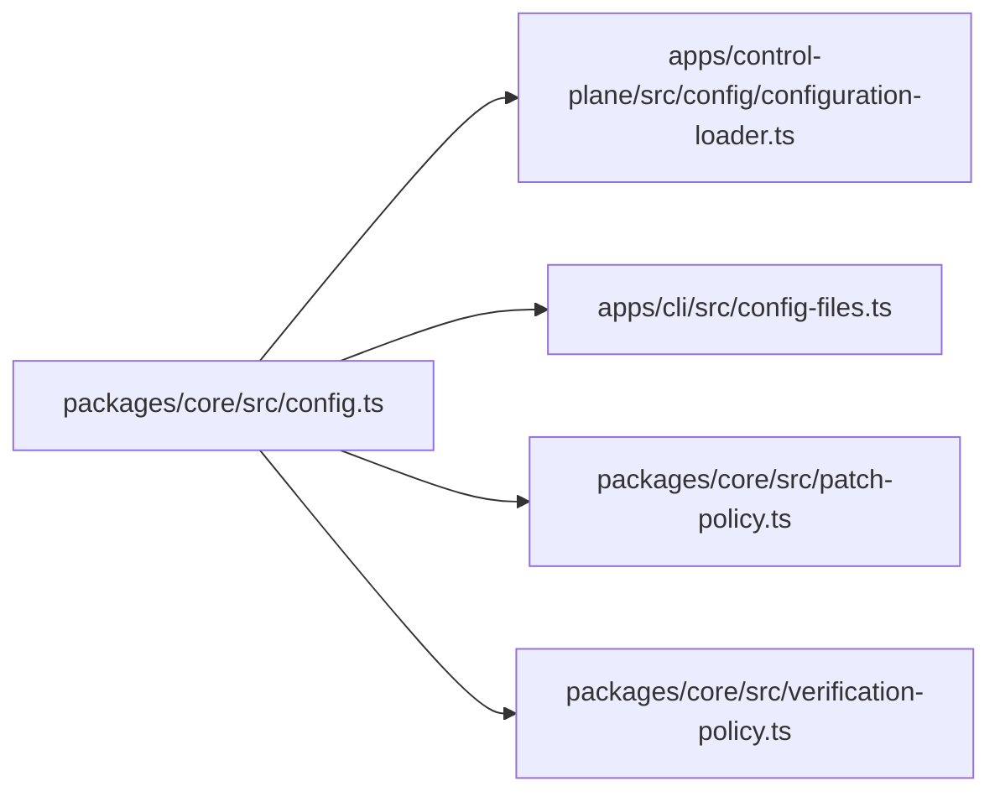

# Configuration Management

<cite>
**Referenced Files in This Document**
- [agent-os.yaml](file://agentos/agent-os.yaml)
- [passerine.yaml](file://agentos/passerine.yaml)
- [example.yaml](file://agentos/example.yaml)
- [configuration-loader.ts](file://apps/control-plane/src/config/configuration-loader.ts)
- [config.ts](file://packages/core/src/config.ts)
- [patch-policy.ts](file://packages/core/src/patch-policy.ts)
- [verification-policy.ts](file://packages/core/src/verification-policy.ts)
- [config-files.ts](file://apps/cli/src/config-files.ts)
</cite>

## Table of Contents
1. Introduction
2. Project Structure
3. Core Components
4. Architecture Overview
5. Detailed Component Analysis
6. Dependency Analysis
7. Performance Considerations
8. Troubleshooting Guide
9. Conclusion
10. Appendices

## Introduction
This document explains Agent OS Passerine configuration management end-to-end. It covers the configuration schema (project settings, agents, environments, pipelines, policies, budgets, goals, runtime routing, and verification), the validation system that enforces correctness and security, the patch mechanism for incremental updates, and the verification system that ensures integrity. It also provides common patterns, migration strategies, environment-specific setups, and how configuration affects runtime behavior and workflow execution.

## Project Structure
Configuration is authored as YAML files under agentos/. The control plane loads and validates these files using a shared core library that defines schemas, canonicalization, hashing, semantic diffing, and policy evaluation. CLI tooling reads and validates configurations with size limits and error formatting.

**Diagram sources**
- [config.ts:165-327](file://packages/core/src/config.ts#L165-L327)
- [config.ts:335-369](file://packages/core/src/config.ts#L335-L369)
- [config.ts:423-448](file://packages/core/src/config.ts#L423-L448)
- [patch-policy.ts:106-195](file://packages/core/src/patch-policy.ts#L106-L195)
- [verification-policy.ts:28-49](file://packages/core/src/verification-policy.ts#L28-L49)
- [configuration-loader.ts:34-77](file://apps/control-plane/src/config/configuration-loader.ts#L34-L77)
- [config-files.ts:207-234](file://apps/cli/src/config-files.ts#L207-L234)

**Section sources**
- [agent-os.yaml:1-61](file://agentos/agent-os.yaml#L1-L61)
- [passerine.yaml:1-252](file://agentos/passerine.yaml#L1-L252)
- [example.yaml:1-73](file://agentos/example.yaml#L1-L73)
- [configuration-loader.ts:34-77](file://apps/control-plane/src/config/configuration-loader.ts#L34-L77)
- [config.ts:165-327](file://packages/core/src/config.ts#L165-L327)
- [config-files.ts:207-234](file://apps/cli/src/config-files.ts#L207-L234)

## Core Components
- Configuration schema: Defines project, models, agents, environments, pipelines, policies, budgets, goals, runtime routing, and optional verification settings. Includes cross-field validations such as referencing existing models/environments and pipeline dependency checks.
- Canonicalization and hashing: Produces deterministic JSON and SHA-256 hashes for change detection and auditability.
- Semantic diff and plan: Computes added/removed/changed paths between two configs to support incremental updates and previews.
- Patch policy: Enforces repository-level security constraints on file changes (protected paths, binary/symlink rules, size limits) and requires trusted metadata attestations per change.
- Verification policy: Resolves per-project verification allowlists against deployment-wide allowlists to constrain trusted test commands and registry hosts.
- Control plane loader: Locates the configuration file, parses it, computes metadata including counts and digest, and exposes it via APIs/UI.
- CLI reader: Reads bounded YAML, parses and validates, enforces canonical size limits, and formats validation errors.

**Section sources**
- [config.ts:165-327](file://packages/core/src/config.ts#L165-L327)
- [config.ts:335-369](file://packages/core/src/config.ts#L335-L369)
- [config.ts:423-448](file://packages/core/src/config.ts#L423-L448)
- [patch-policy.ts:106-195](file://packages/core/src/patch-policy.ts#L106-L195)
- [verification-policy.ts:28-49](file://packages/core/src/verification-policy.ts#L28-L49)
- [configuration-loader.ts:34-77](file://apps/control-plane/src/config/configuration-loader.ts#L34-L77)
- [config-files.ts:207-234](file://apps/cli/src/config-files.ts#L207-L234)

## Architecture Overview
The configuration lifecycle spans authoring, loading, validation, planning, and enforcement at runtime.

**Diagram sources**
- [configuration-loader.ts:34-77](file://apps/control-plane/src/config/configuration-loader.ts#L34-L77)
- [config.ts:335-369](file://packages/core/src/config.ts#L335-L369)
- [config-files.ts:207-234](file://apps/cli/src/config-files.ts#L207-L234)

## Detailed Component Analysis

### Configuration Schema
- Project: name, defaultBranch, optional repository or localPath (mutually exclusive).
- Models: provider, model, token/runtime cost fields.
- Agents: references to model and environment; tools, MCPs, retries, timeoutMs, optional prompt.
- Environments: runtime type, variables, tools, MCPs, networking (limited/unrestricted), optional packages.
- Pipelines: named pipelines with ordered steps referencing agents and optional per-step overrides and dependencies.
- Policies: protectedPaths, binary/symlink flags, maxFileBytes, tools/MCP allow/deny lists.
- Budgets: workflowMicrodollars, dailyMicrodollars, concurrency, admissionReservePercent.
- Goals: maxSteps, maxRetries, timeoutMs.
- Runtime: provider and routing map from model profile providers to runtimes.
- Verification (optional): trustedTestCommands and registryHosts.

Cross-field validations include:
- Agents must reference defined models and environments.
- Pipeline steps must reference defined agents and environments.
- No duplicate step IDs within a pipeline.
- No self-dependencies or cycles in pipeline dependencies.

**Diagram sources**
- [config.ts:39-148](file://packages/core/src/config.ts#L39-L148)
- [config.ts:156-205](file://packages/core/src/config.ts#L156-L205)

**Section sources**
- [config.ts:39-148](file://packages/core/src/config.ts#L39-L148)
- [config.ts:156-205](file://packages/core/src/config.ts#L156-L205)
- [config.ts:207-327](file://packages/core/src/config.ts#L207-L327)

### Validation System
- Parsing: YAML is parsed then validated against strict Zod schemas. Unknown keys are rejected.
- Cross-reference checks: Ensures agents and pipeline steps reference valid models and environments; detects duplicate step IDs and dependency cycles.
- Size limits: CLI enforces maximum source and canonical sizes to prevent abuse.
- Error formatting: Validation issues are surfaced with paths and messages.

**Diagram sources**
- [config.ts:335-369](file://packages/core/src/config.ts#L335-L369)
- [config-files.ts:207-234](file://apps/cli/src/config-files.ts#L207-L234)

**Section sources**
- [config.ts:207-327](file://packages/core/src/config.ts#L207-L327)
- [config-files.ts:207-234](file://apps/cli/src/config-files.ts#L207-L234)

### Patch Mechanism and Security Policies
- Change manifest: Each change includes path, operation, size, binary/symlink flags, and a signed attestation containing normalized claims.
- Path normalization: Rejects malformed paths and prevents traversal attacks.
- Protected paths: Glob-based matching against configured protected paths.
- Binary/symlink/size limits: Enforced by policy; violations reported with codes.
- Attestation verification: Requires trusted metadata per change; mismatches cause untrusted_metadata violations.

**Diagram sources**
- [patch-policy.ts:56-104](file://packages/core/src/patch-policy.ts#L56-L104)
- [patch-policy.ts:106-195](file://packages/core/src/patch-policy.ts#L106-L195)

**Section sources**
- [patch-policy.ts:106-195](file://packages/core/src/patch-policy.ts#L106-L195)

### Verification System
- Per-project verification settings can override deployment defaults but must be subsets of deployment allowlists.
- Enforced items: trusted test commands and registry hosts.
- Purpose: Ensure only approved commands and registries are used during verification phases.

**Diagram sources**
- [verification-policy.ts:28-49](file://packages/core/src/verification-policy.ts#L28-L49)

**Section sources**
- [verification-policy.ts:28-49](file://packages/core/src/verification-policy.ts#L28-L49)

### Control Plane Configuration Loading
- Determines configuration path from environment or defaults.
- Parses YAML, computes canonical hash, and returns metadata including counts of models, agents, environments, pipelines, and steps.
- Used by UI/API to display configuration state and digest.

**Diagram sources**
- [configuration-loader.ts:34-77](file://apps/control-plane/src/config/configuration-loader.ts#L34-L77)
- [config.ts:335-369](file://packages/core/src/config.ts#L335-L369)

**Section sources**
- [configuration-loader.ts:34-77](file://apps/control-plane/src/config/configuration-loader.ts#L34-L77)

### CLI Reading and Validation
- Reads bounded YAML content.
- Parses and validates configuration; formats Zod issues into readable messages.
- Enforces canonical configuration size limit; returns config, canonical form, and digest.

**Section sources**
- [config-files.ts:187-234](file://apps/cli/src/config-files.ts#L187-L234)

## Dependency Analysis
- Core config module is the single source of truth for schema, validation, canonicalization, hashing, and semantic diffing.
- Control plane depends on core for parsing and metadata generation.
- CLI depends on core for parsing, validation, and canonicalization.
- Patch and verification policies depend on core types and constants.

**Diagram sources**
- [config.ts:165-327](file://packages/core/src/config.ts#L165-L327)
- [configuration-loader.ts:34-77](file://apps/control-plane/src/config/configuration-loader.ts#L34-L77)
- [config-files.ts:207-234](file://apps/cli/src/config-files.ts#L207-L234)
- [patch-policy.ts:106-195](file://packages/core/src/patch-policy.ts#L106-L195)
- [verification-policy.ts:28-49](file://packages/core/src/verification-policy.ts#L28-L49)

**Section sources**
- [config.ts:165-327](file://packages/core/src/config.ts#L165-L327)
- [configuration-loader.ts:34-77](file://apps/control-plane/src/config/configuration-loader.ts#L34-L77)
- [config-files.ts:207-234](file://apps/cli/src/config-files.ts#L207-L234)
- [patch-policy.ts:106-195](file://packages/core/src/patch-policy.ts#L106-L195)
- [verification-policy.ts:28-49](file://packages/core/src/verification-policy.ts#L28-L49)

## Performance Considerations
- Canonicalization sorts object keys deterministically; large configs incur O(n log n) sorting overhead.
- Semantic diff walks both configs; complexity proportional to total nodes.
- CLI enforces maximum canonical size to avoid excessive memory usage.
- Patch policy evaluates globs per change; keep protectedPaths concise to minimize regex compilation and matching costs.

[No sources needed since this section provides general guidance]

## Troubleshooting Guide
Common issues and resolutions:
- Invalid configuration: Occurs when YAML fails schema validation. Inspect error messages for paths and messages; correct types, required fields, or unknown keys.
- Unknown model/environment: Agents or pipeline steps must reference defined models/environments.
- Duplicate or cyclic pipeline steps: Ensure unique step IDs and no dependency cycles.
- Protected path violation: Changes to protected paths are blocked; adjust paths or policies accordingly.
- Binary/symlink/oversized: Adjust policy flags or reduce file sizes to meet limits.
- Untrusted metadata: Ensure each change includes a valid attestation with correct claims.
- Canonical too large: Reduce configuration size or split concerns across multiple files if supported by your workflow.

**Section sources**
- [config-files.ts:187-234](file://apps/cli/src/config-files.ts#L187-L234)
- [config.ts:207-327](file://packages/core/src/config.ts#L207-L327)
- [patch-policy.ts:106-195](file://packages/core/src/patch-policy.ts#L106-L195)

## Conclusion
Agent OS Passerine’s configuration system combines strict schema validation, deterministic canonicalization, semantic diffing, and robust policy enforcement to ensure safe, auditable, and predictable workflows. By defining clear project, agent, environment, pipeline, and policy settings, teams can control runtime behavior, enforce security boundaries, and manage incremental changes with confidence.

[No sources needed since this section summarizes without analyzing specific files]

## Appendices

### Common Configuration Patterns
- Minimal local development: Use a simple model profile and a single-agent pipeline with process runtime.
- Multi-stage feature workflow: Define spec/planning/implementation/review/verification stages with distinct agents and limited-network environments.
- Environment scoping: Assign agents to environments with restricted networking and MCP access; use sealed environments for trusted verification steps.
- Routing to specialized runtimes: Map model profile providers to alternative runtimes via runtime.routing while keeping others on managed.

Examples are available in:
- [agent-os.yaml:1-61](file://agentos/agent-os.yaml#L1-L61)
- [passerine.yaml:1-252](file://agentos/passerine.yaml#L1-L252)
- [example.yaml:1-73](file://agentos/example.yaml#L1-L73)

**Section sources**
- [agent-os.yaml:1-61](file://agentos/agent-os.yaml#L1-L61)
- [passerine.yaml:1-252](file://agentos/passerine.yaml#L1-L252)
- [example.yaml:1-73](file://agentos/example.yaml#L1-L73)

### Migration Strategies
- Incremental updates: Use semantic diff and plan functions to preview changes before applying.
- Safe rollout: Apply patches only after policy evaluation passes; rely on canonical hashes to detect drift.
- Backward compatibility: Keep version field stable; extend schemas cautiously and validate with tests.

**Section sources**
- [config.ts:423-448](file://packages/core/src/config.ts#L423-L448)
- [patch-policy.ts:106-195](file://packages/core/src/patch-policy.ts#L106-L195)

### Environment-Specific Setups
- Limited networking: Configure environments with networking.type set to limited and restrict allowed hosts and MCP servers.
- Sealed verification: Use an environment with no MCPs and minimal tools for trusted verification steps.
- Variable injection: Populate environment variables per environment to tailor behavior without changing code.

**Section sources**
- [passerine.yaml:165-204](file://agentos/passerine.yaml#L165-L204)
- [config.ts:66-98](file://packages/core/src/config.ts#L66-L98)

### Relationship Between Configuration and Runtime Behavior
- Agents execute with specified tools, MCPs, timeouts, and retries; environment controls networking and package availability.
- Pipelines orchestrate steps with dependencies; failures trigger retries up to configured limits.
- Policies restrict file operations and capabilities; budgets cap resource consumption; goals bound iteration depth and timeouts.
- Runtime routing determines which runtime executes each model profile; verification policy constrains trusted commands and registries.

**Section sources**
- [config.ts:39-148](file://packages/core/src/config.ts#L39-L148)
- [config.ts:165-205](file://packages/core/src/config.ts#L165-L205)
- [patch-policy.ts:106-195](file://packages/core/src/patch-policy.ts#L106-L195)
- [verification-policy.ts:28-49](file://packages/core/src/verification-policy.ts#L28-L49)