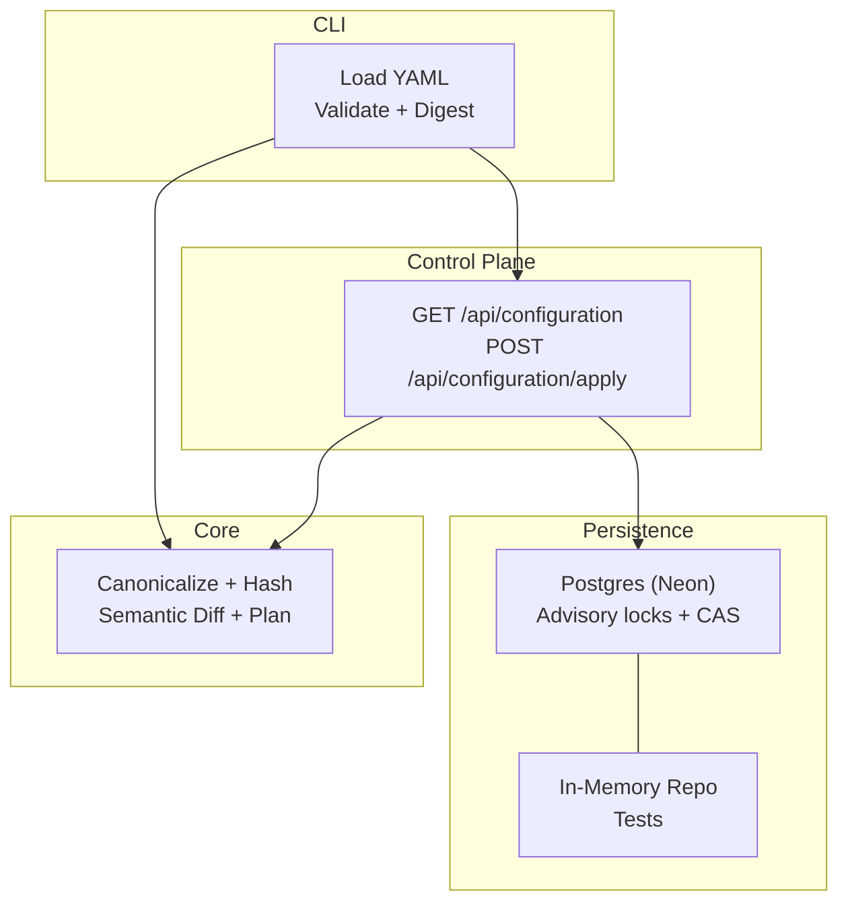
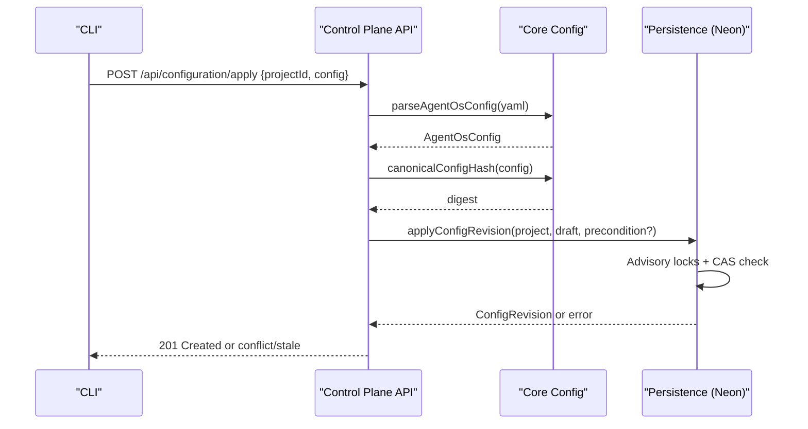
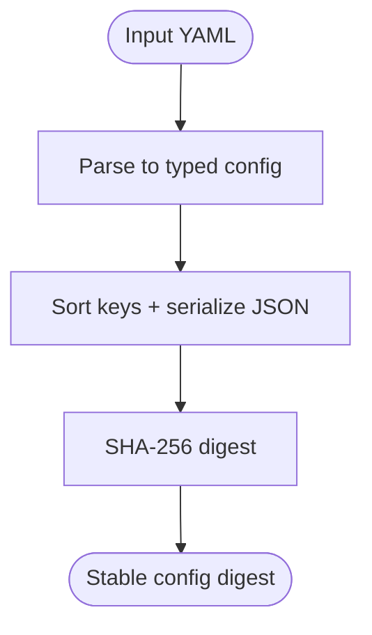
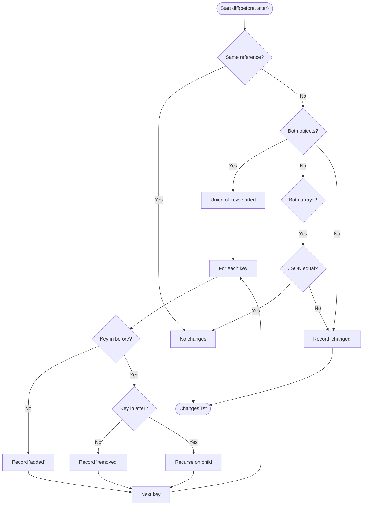
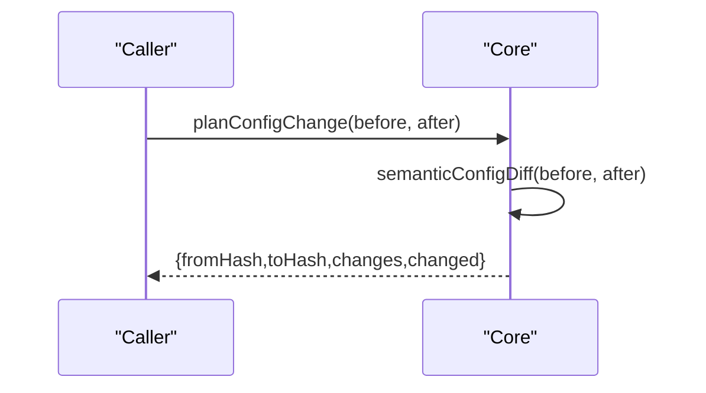
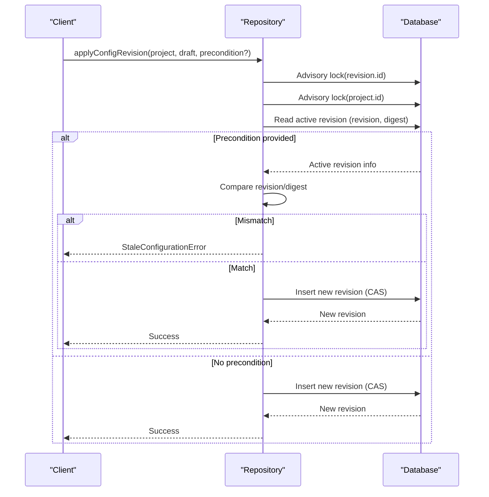
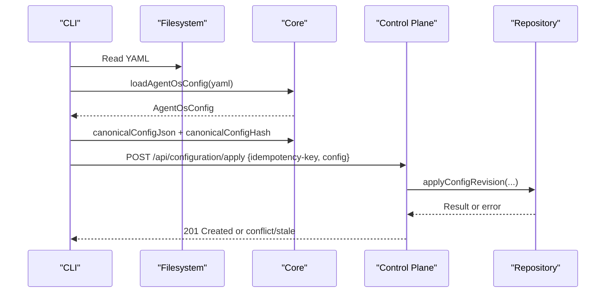
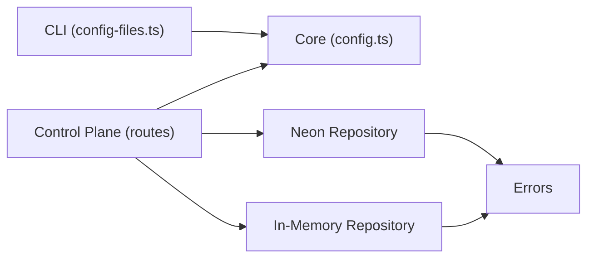

# Configuration Migration

<cite>
**Referenced Files in This Document**
- [config.ts](file://packages/core/src/config.ts)
- [configuration-loader.ts](file://apps/control-plane/src/config/configuration-loader.ts)
- [config-files.ts](file://apps/cli/src/config-files.ts)
- [neon-repository.ts](file://packages/adapters/src/persistence/neon-repository.ts)
- [in-memory.ts](file://packages/adapters/src/persistence/in-memory.ts)
- [errors.ts](file://packages/adapters/src/persistence/errors.ts)
- [route.ts](file://apps/control-plane/app/api/configuration/route.ts)
- [apply/route.ts](file://apps/control-plane/app/api/configuration/apply/route.ts)
- [agent-os.yaml](file://agentos/agent-os.yaml)
- [example.yaml](file://agentos/example.yaml)
</cite>

## Table of Contents
1. [Introduction](#introduction)
2. [Project Structure](#project-structure)
3. [Core Components](#core-components)
4. [Architecture Overview](#architecture-overview)
5. [Detailed Component Analysis](#detailed-component-analysis)
6. [Dependency Analysis](#dependency-analysis)
7. [Performance Considerations](#performance-considerations)
8. [Troubleshooting Guide](#troubleshooting-guide)
9. [Conclusion](#conclusion)
10. [Appendices](#appendices)

## Introduction
This document explains how Agent OS Passerine manages configuration migration and versioning. It covers the canonical configuration format, hashing for change detection, semantic diffing to identify added, removed, and changed elements, and the plan generation process that drives safe migrations. It also describes persistence-backed revision tracking with optimistic concurrency control, strategies for managing versions across environments, rollback approaches, and best practices for maintaining consistency.

## Project Structure
Configuration handling spans three layers:
- Core schema, canonicalization, hashing, and semantic diffing live in the core package.
- CLI and Control Plane load YAML files, validate them against the schema, compute digests, and expose APIs for applying configurations.
- Persistence adapters implement durable, concurrent-safe application of configuration revisions with preconditions and idempotency.

**Diagram sources**
- [config.ts:343-369](file://packages/core/src/config.ts#L343-L369)
- [config.ts:423-448](file://packages/core/src/config.ts#L423-L448)
- [configuration-loader.ts:34-52](file://apps/control-plane/src/config/configuration-loader.ts#L34-L52)
- [config-files.ts:207-234](file://apps/cli/src/config-files.ts#L207-L234)
- [route.ts:11-49](file://apps/control-plane/app/api/configuration/route.ts#L11-L49)
- [apply/route.ts:11-29](file://apps/control-plane/app/api/configuration/apply/route.ts#L11-L29)
- [neon-repository.ts:402-514](file://packages/adapters/src/persistence/neon-repository.ts#L402-L514)
- [in-memory.ts:332-372](file://packages/adapters/src/persistence/in-memory.ts#L332-L372)

**Section sources**
- [config.ts:165-337](file://packages/core/src/config.ts#L165-L337)
- [configuration-loader.ts:1-52](file://apps/control-plane/src/config/configuration-loader.ts#L1-L52)
- [config-files.ts:187-234](file://apps/cli/src/config-files.ts#L187-L234)
- [route.ts:11-49](file://apps/control-plane/app/api/configuration/route.ts#L11-L49)
- [apply/route.ts:11-29](file://apps/control-plane/app/api/configuration/apply/route.ts#L11-L29)
- [neon-repository.ts:388-514](file://packages/adapters/src/persistence/neon-repository.ts#L388-L514)
- [in-memory.ts:332-429](file://packages/adapters/src/persistence/in-memory.ts#L332-L429)

## Core Components
- Canonical configuration format: A strict Zod schema defines the Agent OS configuration shape, including project, models, agents, environments, pipelines, policies, budgets, goals, runtime routing, and optional verification settings. The schema enforces cross-field constraints such as referenced agents/environments existing and pipeline dependency cycles being invalid.
- Canonical JSON and hashing: Configurations are normalized by sorting object keys deterministically and serializing to JSON. A SHA-256 digest is computed over this canonical form to detect changes reliably across environments.
- Semantic diff: A recursive diff compares two parsed configurations and reports each added, removed, or changed leaf path with before/after values. Arrays are compared by structural equality to avoid false positives from ordering.
- Configuration plan: Combines hashes and semantic diffs into a plan indicating whether changes exist and what they are.

Examples of configuration files demonstrate the v1 schema usage and typical fields.

**Section sources**
- [config.ts:165-337](file://packages/core/src/config.ts#L165-L337)
- [config.ts:343-369](file://packages/core/src/config.ts#L343-L369)
- [config.ts:378-448](file://packages/core/src/config.ts#L378-L448)
- [agent-os.yaml:1-61](file://agentos/agent-os.yaml#L1-L61)
- [example.yaml:1-73](file://agentos/example.yaml#L1-L73)

## Architecture Overview
The configuration lifecycle flows through validation, planning, and application with strong concurrency guarantees.

**Diagram sources**
- [apply/route.ts:11-29](file://apps/control-plane/app/api/configuration/apply/route.ts#L11-L29)
- [config.ts:335-369](file://packages/core/src/config.ts#L335-L369)
- [neon-repository.ts:402-514](file://packages/adapters/src/persistence/neon-repository.ts#L402-L514)

## Detailed Component Analysis

### Canonical Format and Hashing
- Schema enforcement ensures only valid structures reach hashing.
- Canonicalization sorts keys deterministically so identical logical configs produce identical JSON regardless of source order.
- Hashing uses SHA-256 on canonical JSON to create stable digests used for change detection and preconditions.

**Diagram sources**
- [config.ts:335-369](file://packages/core/src/config.ts#L335-L369)

**Section sources**
- [config.ts:335-369](file://packages/core/src/config.ts#L335-L369)

### Semantic Diff System
- Compares two parsed configurations recursively.
- Reports:
  - Added: key present in after but not before.
  - Removed: key present in before but not after.
  - Changed: leaf value differences.
- Treats arrays as equal if their serialized forms match, avoiding spurious diffs due to ordering.

**Diagram sources**
- [config.ts:378-428](file://packages/core/src/config.ts#L378-L428)

**Section sources**
- [config.ts:378-428](file://packages/core/src/config.ts#L378-L428)

### Configuration Plan Generation
- Builds a plan containing:
  - fromHash: digest of current configuration.
  - toHash: digest of proposed configuration.
  - changes: semantic diff results.
  - changed: boolean flag indicating whether any changes were detected.
- Consumers can use changed to short-circuit no-op applies and log meaningful diffs for review.

**Diagram sources**
- [config.ts:430-448](file://packages/core/src/config.ts#L430-L448)

**Section sources**
- [config.ts:430-448](file://packages/core/src/config.ts#L430-L448)

### Revision Application and Progress Tracking
- Idempotent creation: Creating a revision validates inputs and persists the full configuration payload as structured data.
- Optimistic concurrency: Applying a revision uses advisory locks scoped per revision ID and per project ID, then checks the active revision’s sequence number and digest via SQL. If a precondition is provided, it must match the current active revision; otherwise, a stale configuration error is raised.
- Retry loop: The adapter retries up to a bounded number of times on serialization conflicts to handle contention gracefully.
- In-memory implementation mirrors these behaviors for tests, ensuring consistent semantics across backends.

**Diagram sources**
- [neon-repository.ts:402-514](file://packages/adapters/src/persistence/neon-repository.ts#L402-L514)
- [in-memory.ts:332-372](file://packages/adapters/src/persistence/in-memory.ts#L332-L372)
- [errors.ts:17-29](file://packages/adapters/src/persistence/errors.ts#L17-L29)

**Section sources**
- [neon-repository.ts:388-514](file://packages/adapters/src/persistence/neon-repository.ts#L388-L514)
- [in-memory.ts:332-429](file://packages/adapters/src/persistence/in-memory.ts#L332-L429)
- [errors.ts:17-29](file://packages/adapters/src/persistence/errors.ts#L17-L29)

### CLI and Control Plane Integration
- CLI reads a YAML file, parses and validates it, computes canonical JSON and digest, and enforces size limits on canonical output.
- Control Plane exposes:
  - GET /api/configuration: returns active configuration metadata and optionally canonical content for authenticated CLI clients.
  - POST /api/configuration/apply: accepts a configuration payload with an idempotency key, validates it, and delegates to the service layer which applies it using the repository.

**Diagram sources**
- [config-files.ts:207-234](file://apps/cli/src/config-files.ts#L207-L234)
- [config.ts:335-369](file://packages/core/src/config.ts#L335-L369)
- [apply/route.ts:11-29](file://apps/control-plane/app/api/configuration/apply/route.ts#L11-L29)
- [route.ts:11-49](file://apps/control-plane/app/api/configuration/route.ts#L11-L49)
- [neon-repository.ts:402-514](file://packages/adapters/src/persistence/neon-repository.ts#L402-L514)

**Section sources**
- [config-files.ts:207-234](file://apps/cli/src/config-files.ts#L207-L234)
- [configuration-loader.ts:34-52](file://apps/control-plane/src/config/configuration-loader.ts#L34-L52)
- [route.ts:11-49](file://apps/control-plane/app/api/configuration/route.ts#L11-L49)
- [apply/route.ts:11-29](file://apps/control-plane/app/api/configuration/apply/route.ts#L11-L29)

## Dependency Analysis
- Core depends on Node crypto and YAML parsing to produce canonical forms and digests.
- CLI depends on Core for parsing, canonicalization, and hashing.
- Control Plane routes depend on Core for validation and hashing, and on Persistence for durable application.
- Persistence implementations depend on database primitives (advisory locks) and shared error types for consistent conflict signaling.

**Diagram sources**
- [config.ts:1-8](file://packages/core/src/config.ts#L1-L8)
- [config-files.ts:207-234](file://apps/cli/src/config-files.ts#L207-L234)
- [route.ts:11-49](file://apps/control-plane/app/api/configuration/route.ts#L11-L49)
- [apply/route.ts:11-29](file://apps/control-plane/app/api/configuration/apply/route.ts#L11-L29)
- [neon-repository.ts:402-514](file://packages/adapters/src/persistence/neon-repository.ts#L402-L514)
- [in-memory.ts:332-372](file://packages/adapters/src/persistence/in-memory.ts#L332-L372)
- [errors.ts:17-29](file://packages/adapters/src/persistence/errors.ts#L17-L29)

**Section sources**
- [config.ts:1-8](file://packages/core/src/config.ts#L1-L8)
- [config-files.ts:207-234](file://apps/cli/src/config-files.ts#L207-L234)
- [route.ts:11-49](file://apps/control-plane/app/api/configuration/route.ts#L11-L49)
- [apply/route.ts:11-29](file://apps/control-plane/app/api/configuration/apply/route.ts#L11-L29)
- [neon-repository.ts:402-514](file://packages/adapters/src/persistence/neon-repository.ts#L402-L514)
- [in-memory.ts:332-372](file://packages/adapters/src/persistence/in-memory.ts#L332-L372)
- [errors.ts:17-29](file://packages/adapters/src/persistence/errors.ts#L17-L29)

## Performance Considerations
- Canonicalization sorts all object keys deterministically; keep configurations reasonably sized to avoid excessive sorting overhead.
- Semantic diff traverses nested structures; prefer minimal diffs and avoid deeply nested large objects when possible.
- Apply operations use advisory locks and retry loops; high contention may cause retries. Batch updates where feasible and ensure idempotency keys are stable.
- Enforce canonical size limits at the CLI boundary to prevent oversized payloads from reaching the server.

[No sources needed since this section provides general guidance]

## Troubleshooting Guide
Common errors and resolutions:
- Invalid configuration: Occurs when YAML does not conform to the schema. Review validation messages and fix field types, references, or constraints.
- Canonical configuration too large: Reduce configuration size or split concerns; enforce limits early in CI.
- Stale configuration: Indicates another apply changed the active configuration between plan and apply. Re-plan and re-apply with updated preconditions.
- Idempotency conflict: A different payload was submitted under the same idempotency key. Ensure deterministic request bodies and correct idempotency keys.

Operational tips:
- Use semantic diffs to preview changes before applying.
- Store fromHash/toHash in audit logs to trace drift.
- For rollbacks, apply a previous known-good configuration with its own idempotency key; the system will create a new revision safely.

**Section sources**
- [config-files.ts:187-234](file://apps/cli/src/config-files.ts#L187-L234)
- [errors.ts:17-29](file://packages/adapters/src/persistence/errors.ts#L17-L29)
- [neon-repository.ts:402-514](file://packages/adapters/src/persistence/neon-repository.ts#L402-L514)

## Conclusion
Agent OS Passerine provides a robust configuration migration system built on a strict schema, deterministic canonicalization, stable hashing, and semantic diffs. Applications are protected by optimistic concurrency with advisory locks and clear error signals. By leveraging plans, preconditions, and idempotency keys, teams can manage versions safely across environments, roll back confidently, and maintain consistency with predictable outcomes.

[No sources needed since this section summarizes without analyzing specific files]

## Appendices

### Example Migration Workflow
- Load and validate configuration from YAML.
- Compute canonical JSON and digest.
- Generate a plan to inspect added, removed, and changed paths.
- Apply with an idempotency key and optional precondition based on the active revision’s revision number and digest.
- On success, record the new revision; on conflict or stale state, re-plan and retry.

**Section sources**
- [config-files.ts:207-234](file://apps/cli/src/config-files.ts#L207-L234)
- [config.ts:430-448](file://packages/core/src/config.ts#L430-L448)
- [apply/route.ts:11-29](file://apps/control-plane/app/api/configuration/apply/route.ts#L11-L29)
- [neon-repository.ts:402-514](file://packages/adapters/src/persistence/neon-repository.ts#L402-L514)

### Best Practices
- Keep configurations small and focused; split responsibilities across projects where appropriate.
- Always include an idempotency key for apply requests.
- Use semantic diffs in CI to gate merges on explicit changes.
- Store fromHash/toHash in deployment artifacts for traceability.
- Prefer additive changes and deprecate fields gradually to minimize breaking changes.

[No sources needed since this section provides general guidance]