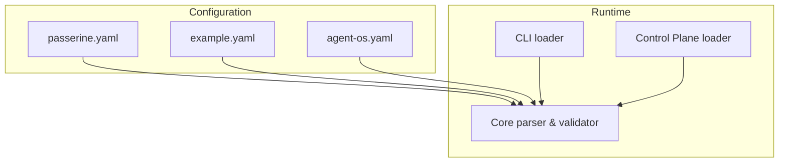
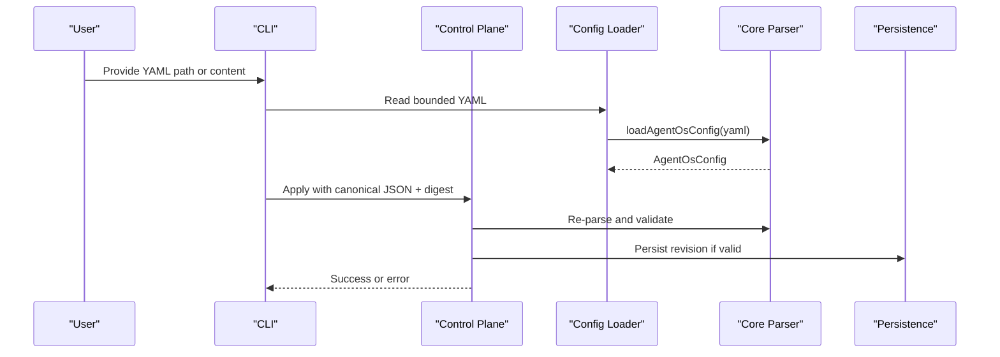
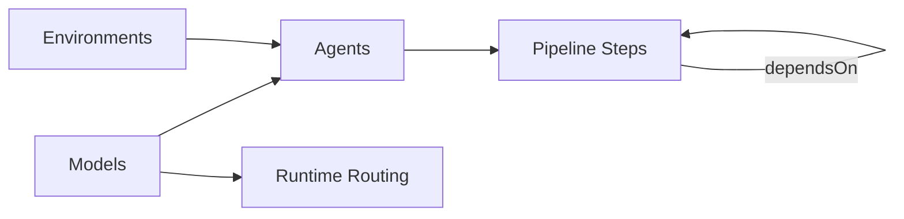

# Configuration Schema

<cite>
**Referenced Files in This Document**
- [config.ts](file://packages/core/src/config.ts)
- [passerine.yaml](file://agentos/passerine.yaml)
- [agent-os.yaml](file://agentos/agent-os.yaml)
- [example.yaml](file://agentos/example.yaml)
- [configuration-loader.ts](file://apps/control-plane/src/config/configuration-loader.ts)
- [config-files.ts](file://apps/cli/src/config-files.ts)
- [control-plane-service.ts](file://apps/control-plane/src/application/control-plane-service.ts)
- [contracts.ts](file://apps/control-plane/src/http/contracts.ts)
</cite>

## Table of Contents
1. [Introduction](#introduction)
2. [Project Structure](#project-structure)
3. [Core Components](#core-components)
4. [Architecture Overview](#architecture-overview)
5. [Detailed Component Analysis](#detailed-component-analysis)
6. [Dependency Analysis](#dependency-analysis)
7. [Performance Considerations](#performance-considerations)
8. [Troubleshooting Guide](#troubleshooting-guide)
9. [Conclusion](#conclusion)
10. [Appendices](#appendices)

## Introduction
This document describes the Agent OS Passerine configuration schema used to define projects, model profiles, agents, environments, pipelines, policies, budgets, goals, and runtime routing. It explains each field’s purpose, data types, validation rules, defaults, and how sections interact at runtime. It also provides example configurations for local development, multi-project setups, and production deployments.

## Project Structure
The configuration is defined as a versioned YAML file parsed by a strict schema in the core package. Example files demonstrate different runtime modes and agent compositions:
- A full end-to-end pipeline with multiple agents and cloud environments
- A minimal local development setup using a process-based runtime
- An example that shows optional model routing to alternative runtimes

**Diagram sources**
- [config.ts:165-327](file://packages/core/src/config.ts#L165-L327)
- [configuration-loader.ts:34-52](file://apps/control-plane/src/config/configuration-loader.ts#L34-L52)
- [config-files.ts:207-234](file://apps/cli/src/config-files.ts#L207-L234)

**Section sources**
- [config.ts:165-327](file://packages/core/src/config.ts#L165-L327)
- [configuration-loader.ts:34-52](file://apps/control-plane/src/config/configuration-loader.ts#L34-L52)
- [config-files.ts:207-234](file://apps/cli/src/config-files.ts#L207-L234)

## Core Components
The configuration schema defines the following top-level sections:
- version: Fixed to 1
- project: Project identity and source location
- models: Model profiles (provider, model name, pricing, runtime cost)
- agents: Agent definitions referencing models and environments
- environments: Execution environments with networking, tools, MCPs, variables, packages
- pipelines: Named pipelines composed of ordered steps
- policies: Patch policy controls for protected paths, binaries, symlinks, file size, tool/MCP permissions
- budgets: Cost and concurrency limits
- goals: Goal-level step and retry limits and timeouts
- runtime: Runtime provider and routing from model profile providers to runtime names
- verification: Optional trusted test commands and registry hosts

Key behaviors enforced by the schema:
- Strict keys at every level; unknown keys are rejected
- Cross-reference validation between agents, environments, and pipelines
- Pipeline dependency cycle detection and self-dependency prevention
- Canonical JSON serialization and hashing for idempotent application
- Size limits on source YAML and canonical config

**Section sources**
- [config.ts:10-148](file://packages/core/src/config.ts#L10-L148)
- [config.ts:165-327](file://packages/core/src/config.ts#L165-L327)
- [config.ts:335-369](file://packages/core/src/config.ts#L335-L369)

## Architecture Overview
At runtime, configuration flows through loaders into the core parser and validator. The control plane enforces additional constraints such as canonical form and digest matching before applying configuration.

**Diagram sources**
- [config-files.ts:207-234](file://apps/cli/src/config-files.ts#L207-L234)
- [configuration-loader.ts:34-52](file://apps/control-plane/src/config/configuration-loader.ts#L34-L52)
- [control-plane-service.ts:904-948](file://apps/control-plane/src/application/control-plane-service.ts#L904-L948)
- [config.ts:335-369](file://packages/core/src/config.ts#L335-L369)

## Detailed Component Analysis

### Top-level fields
- version: Literal value 1.
- project:
  - name: Identifier string required.
  - repository: Optional URL string for remote repositories.
  - localPath: Optional absolute path for local experiment projects; must be absolute and not contain relative segments. Mutually exclusive with repository.
  - defaultBranch: Identifier string; defaults to main.
- models: Map of model profile identifiers to ModelProfileSchema.
- agents: Map of agent identifiers to AgentDefinitionSchema.
- environments: Map of environment identifiers to EnvironmentDefinitionSchema.
- pipelines: Map of pipeline identifiers to PipelineDefinitionSchema.
- policies: PatchPolicyConfigSchema.
- budgets: BudgetConfigSchema.
- goals: GoalLimitsSchema.
- runtime: RuntimeRoutingSchema.
- verification: Optional VerificationConfigSchema.

Validation highlights:
- Unknown keys anywhere are rejected due to strict schemas.
- Agents must reference existing models and environments.
- Pipelines must reference existing agents and environments; dependencies must exist and cannot create cycles or self-references.
- Goals.maxSteps is capped at 3.

**Section sources**
- [config.ts:165-327](file://packages/core/src/config.ts#L165-L327)

### Project settings
- name: Required identifier for the project.
- repository: Optional HTTPS URL pointing to a remote repository.
- localPath: Optional absolute directory path for local experiments; validated to be absolute and free of relative segments. Cannot be combined with repository.
- defaultBranch: Defaults to main if omitted.

Example usage:
- Remote project: set repository and optionally defaultBranch.
- Local experiment: set localPath instead of repository.

**Section sources**
- [config.ts:168-195](file://packages/core/src/config.ts#L168-L195)
- [example.yaml:1-5](file://agentos/example.yaml#L1-L5)
- [agent-os.yaml:1-5](file://agentos/agent-os.yaml#L1-L5)
- [passerine.yaml:1-5](file://agentos/passerine.yaml#L1-L5)

### Model profiles
Each model profile includes:
- provider: Identifier for the runtime provider (for example, local, managed, kimi).
- model: Identifier for the specific model within the provider.
- inputMicrodollarsPerMillionTokens: Non-negative integer; defaults to 0.
- outputMicrodollarsPerMillionTokens: Non-negative integer; defaults to 0.
- cacheReadInputMicrodollarsPerMillionTokens: Optional non-negative integer.
- cacheCreation5mInputMicrodollarsPerMillionTokens: Optional non-negative integer.
- cacheCreation1hInputMicrodollarsPerMillionTokens: Optional non-negative integer.
- runtimeMicrodollarsPerMinute: Non-negative integer; defaults to 0.

Examples:
- Local development: provider local with zero-cost tokens and runtime minutes.
- Production: provider managed with realistic token and runtime costs.

**Section sources**
- [config.ts:39-52](file://packages/core/src/config.ts#L39-L52)
- [example.yaml:5-19](file://agentos/example.yaml#L5-L19)
- [agent-os.yaml:5-11](file://agentos/agent-os.yaml#L5-L11)
- [passerine.yaml:6-12](file://agentos/passerine.yaml#L6-L12)

### Agent definitions
Each agent includes:
- model: Must reference a defined model profile.
- prompt: Optional string used as the system prompt for the agent session.
- environment: Optional environment identifier; if provided, must exist.
- tools: Array of tool identifiers allowed for this agent; defaults to empty.
- mcps: Array of MCP identifiers allowed for this agent; defaults to empty.
- retries: Non-negative integer; defaults to 0.
- timeoutMs: Positive integer; defaults to 900000 milliseconds.

Cross-reference validation ensures referenced model and environment exist.

**Section sources**
- [config.ts:54-64](file://packages/core/src/config.ts#L54-L64)
- [config.ts:207-226](file://packages/core/src/config.ts#L207-L226)
- [passerine.yaml:13-150](file://agentos/passerine.yaml#L13-L150)
- [agent-os.yaml:12-20](file://agentos/agent-os.yaml#L12-L20)

### Environments
Each environment includes:
- runtime: Identifier for the execution runtime (for example, process, cloud).
- image: Optional container image identifier.
- variables: Record of string key-value pairs; defaults to empty.
- tools: Array of tool identifiers available in this environment; defaults to empty.
- mcps: Array of MCP identifiers available in this environment; defaults to empty.
- networking: Optional discriminated union:
  - type limited:
    - allowedHosts: Array of host identifiers; defaults to empty.
    - allowMcpServers: Boolean; defaults to false.
    - allowPackageManagers: Boolean; defaults to false.
  - type unrestricted: No additional fields.
- packages: Optional record of package managers and their packages (apt, cargo, gem, go, npm, pip).

Networking defaults and restrictions help limit exposure during execution.

**Section sources**
- [config.ts:66-98](file://packages/core/src/config.ts#L66-L98)
- [passerine.yaml:165-204](file://agentos/passerine.yaml#L165-L204)
- [agent-os.yaml:20-26](file://agentos/agent-os.yaml#L20-L26)

### Pipelines
A pipeline is a named composition of steps:
- steps: Array of at least one step.
- Each step:
  - id: Unique identifier within the pipeline.
  - agent: Must reference a defined agent.
  - environment: Optional override; must exist if provided.
  - dependsOn: Array of step ids this step depends on; must exist and cannot create cycles or self-dependencies.
  - retries: Optional per-step override of agent retries.
  - timeoutMs: Optional per-step override of agent timeout.

Validation enforces uniqueness of step ids, existence of referenced agents/environments, no self-dependencies, no unknown dependencies, and no cycles.

**Section sources**
- [config.ts:100-113](file://packages/core/src/config.ts#L100-L113)
- [config.ts:228-326](file://packages/core/src/config.ts#L228-L326)
- [passerine.yaml:205-217](file://agentos/passerine.yaml#L205-L217)
- [agent-os.yaml:26-31](file://agentos/agent-os.yaml#L26-L31)

### Policies
Patch policies control what changes agents can make to the repository:
- protectedPaths: Array of path patterns; defaults include git-related paths, workflows, CODEOWNERS, env files, and agentos directories.
- allowBinary: Boolean; defaults to false.
- allowSymlinks: Boolean; defaults to false.
- maxFileBytes: Positive integer; defaults to 1000000 bytes.
- tools: CapabilityPermissionsSchema with allow and deny arrays; defaults to empty lists.
- mcp: CapabilityPermissionsSchema with allow and deny arrays; defaults to empty lists.

These policies constrain patch operations and tool/MCP access across agents and environments.

**Section sources**
- [config.ts:115-124](file://packages/core/src/config.ts#L115-L124)
- [config.ts:10-22](file://packages/core/src/config.ts#L10-L22)
- [passerine.yaml:218-239](file://agentos/passerine.yaml#L218-L239)
- [agent-os.yaml:31-48](file://agentos/agent-os.yaml#L31-L48)

### Budgets
Budgets enforce cost and concurrency limits:
- workflowMicrodollars: Non-negative integer budget per workflow.
- dailyMicrodollars: Non-negative integer daily budget.
- concurrency: Positive integer limiting concurrent runs.
- admissionReservePercent: Integer between 0 and 100; defaults to 80.

These values gate admission of new runs based on remaining budget and concurrency.

**Section sources**
- [config.ts:126-133](file://packages/core/src/config.ts#L126-L133)
- [passerine.yaml:240-244](file://agentos/passerine.yaml#L240-L244)
- [agent-os.yaml:49-53](file://agentos/agent-os.yaml#L49-L53)

### Goals
Goals define per-goal limits:
- maxSteps: Positive integer capped at 3.
- maxRetries: Non-negative integer.
- timeoutMs: Positive integer.

These limits bound the lifecycle of a goal to prevent runaway executions.

**Section sources**
- [config.ts:135-141](file://packages/core/src/config.ts#L135-L141)
- [passerine.yaml:245-248](file://agentos/passerine.yaml#L245-L248)
- [agent-os.yaml:54-57](file://agentos/agent-os.yaml#L54-L57)

### Runtime routing
Runtime configuration includes:
- provider: Identifier for the default runtime provider.
- routing: Map from model profile provider names to runtime identifiers. Allows mapping specific providers to alternate runtimes while keeping others on the default provider.

Composition rules may restrict certain mappings (for example, verification roles may not route to certain runtimes).

**Section sources**
- [config.ts:143-148](file://packages/core/src/config.ts#L143-L148)
- [example.yaml:66-72](file://agentos/example.yaml#L66-L72)
- [passerine.yaml:249-251](file://agentos/passerine.yaml#L249-L251)
- [agent-os.yaml:58-60](file://agentos/agent-os.yaml#L58-L60)

### Verification (optional)
Verification configuration allows:
- trustedTestCommands: Array of trimmed command strings with length bounds; defaults to empty.
- registryHosts: Up to four registry host identifiers; defaults to empty.

This section enables controlled verification behavior when needed.

**Section sources**
- [config.ts:150-163](file://packages/core/src/config.ts#L150-L163)

## Dependency Analysis
The configuration sections interact through references:
- Agents depend on models and environments.
- Pipeline steps depend on agents and optionally environments.
- Pipeline steps declare dependencies on other steps to form DAGs.
- Runtime routing maps model profile providers to runtime names.

**Diagram sources**
- [config.ts:207-326](file://packages/core/src/config.ts#L207-L326)
- [config.ts:143-148](file://packages/core/src/config.ts#L143-L148)

**Section sources**
- [config.ts:207-326](file://packages/core/src/config.ts#L207-L326)

## Performance Considerations
- Source YAML size is bounded to protect parsers and storage.
- Canonical JSON serialization sorts keys deterministically to ensure stable hashes and diffs.
- Strict parsing avoids expensive fallbacks and reduces ambiguity.
- Budgets and concurrency limits prevent resource exhaustion.

[No sources needed since this section provides general guidance]

## Troubleshooting Guide
Common errors and where they originate:
- Invalid configuration shape: Thrown by the core parser when YAML does not match the v1 schema.
- Non-canonical configuration: Control plane rejects payloads whose canonical JSON does not match the provided canonical string.
- Digest mismatch: Control plane validates the payload digest against the computed hash.
- Precondition invalid: Expected revision and expected digest must both be null or both be non-null.
- Too large configuration: CLI and API enforce maximum sizes for source and canonical forms.

Resolution tips:
- Ensure all referenced models, environments, and agents exist.
- Avoid duplicate or cyclic pipeline step dependencies.
- Keep configuration under size limits.
- Use canonical JSON when applying via the API.

**Section sources**
- [control-plane-service.ts:904-948](file://apps/control-plane/src/application/control-plane-service.ts#L904-L948)
- [contracts.ts:56-82](file://apps/control-plane/src/http/contracts.ts#L56-L82)
- [config-files.ts:187-234](file://apps/cli/src/config-files.ts#L187-L234)
- [config.ts:6-8](file://packages/core/src/config.ts#L6-L8)

## Conclusion
The Agent OS Passerine configuration schema provides a strict, extensible way to define projects, models, agents, environments, pipelines, policies, budgets, goals, and runtime routing. Validation ensures safe cross-references and prevents misconfigurations. Examples illustrate local development, multi-agent pipelines, and optional runtime routing. Adhering to these rules yields predictable, secure, and cost-controlled agent orchestration.

[No sources needed since this section summarizes without analyzing specific files]

## Appendices

### Example configurations

#### Local development
- Minimal setup using a process-based runtime and a single implementer agent.
- Zero-cost model profile suitable for testing.

Reference:
- [agent-os.yaml:1-61](file://agentos/agent-os.yaml#L1-L61)

#### Multi-project setup
- Full pipeline with specification, planning, implementation, review, and verification stages.
- Multiple environments with limited networking and artifact MCPs.
- Realistic model costs and runtime minutes.

Reference:
- [passerine.yaml:1-251](file://agentos/passerine.yaml#L1-L251)

#### Production deployment with optional routing
- Uses managed runtime provider.
- Demonstrates optional routing of a model profile provider to an alternate runtime.

Reference:
- [example.yaml:1-73](file://agentos/example.yaml#L1-L73)