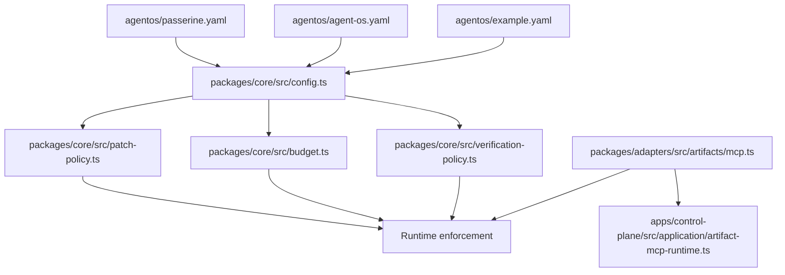
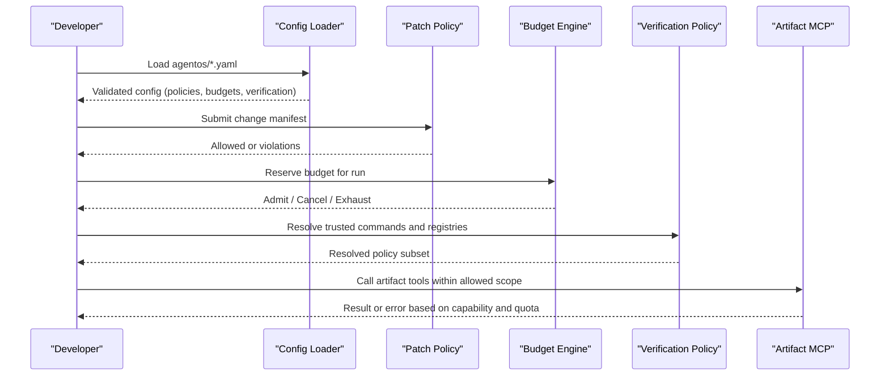
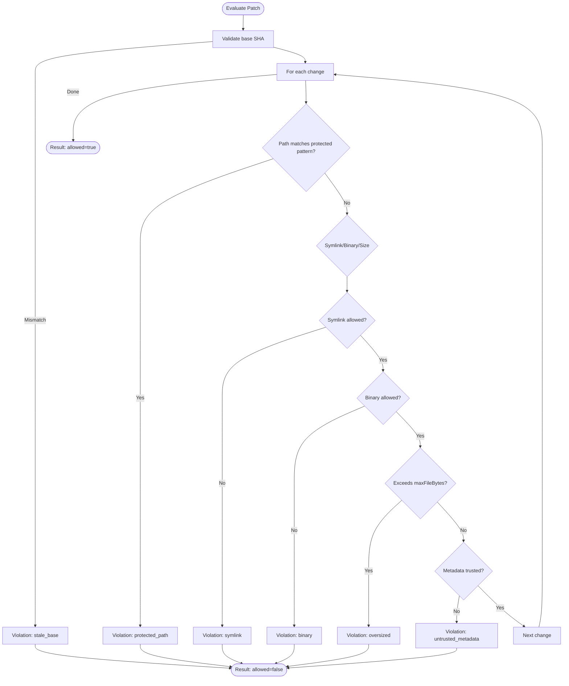
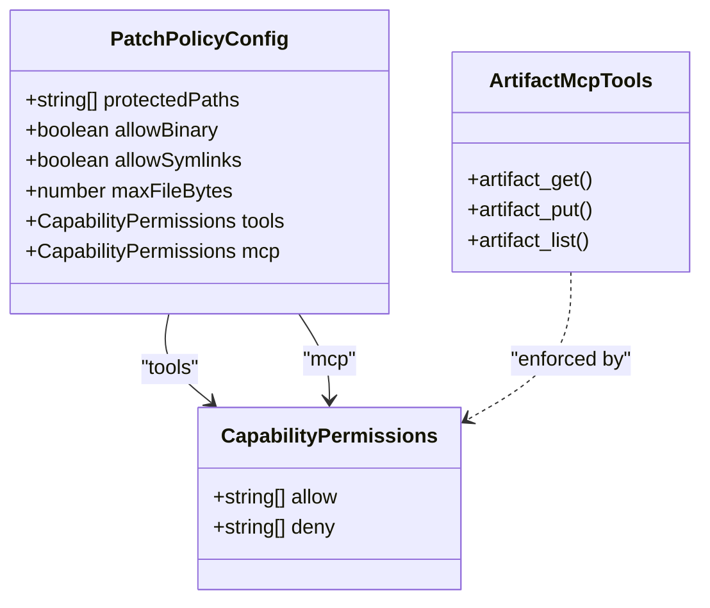
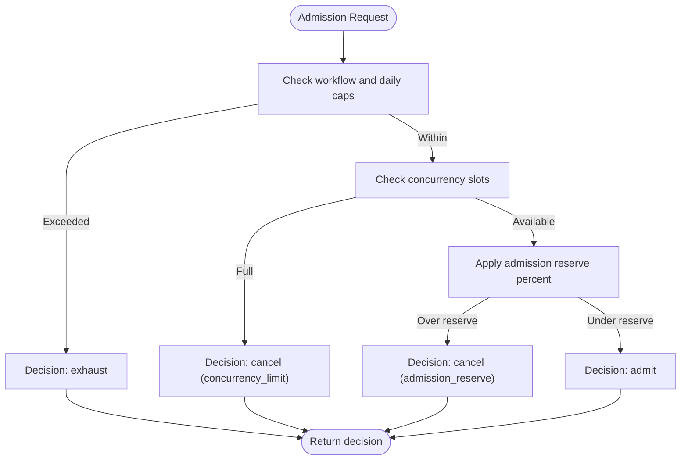
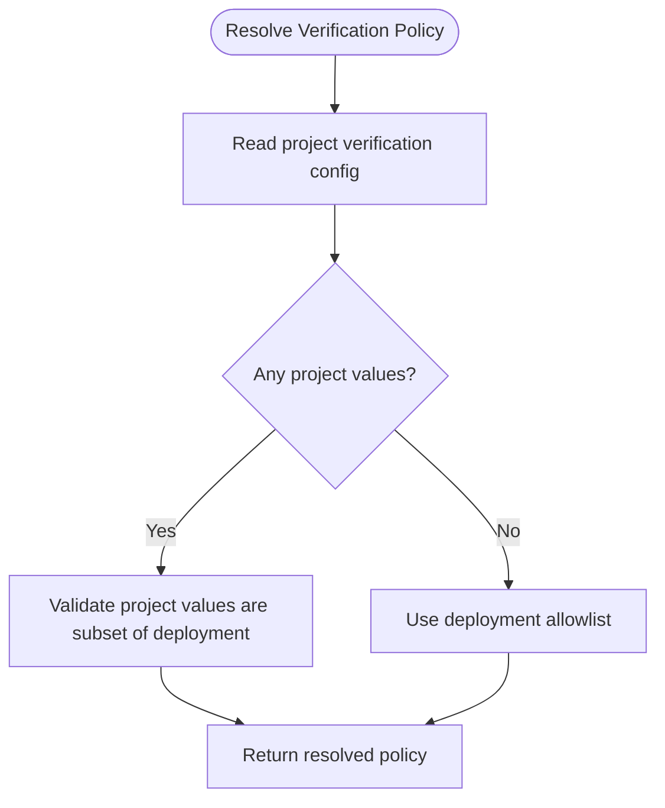
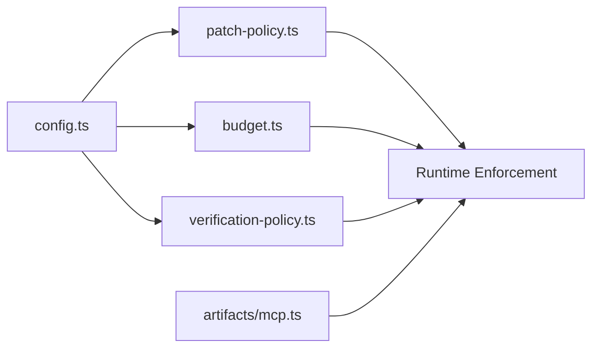

# Policy Management

<cite>
**Referenced Files in This Document**
- [passerine.yaml](file://agentos/passerine.yaml)
- [agent-os.yaml](file://agentos/agent-os.yaml)
- [example.yaml](file://agentos/example.yaml)
- [config.ts](file://packages/core/src/config.ts)
- [patch-policy.ts](file://packages/core/src/patch-policy.ts)
- [budget.ts](file://packages/core/src/budget.ts)
- [verification-policy.ts](file://packages/core/src/verification-policy.ts)
- [mcp.ts](file://packages/adapters/src/artifacts/mcp.ts)
- [artifact-mcp-runtime.ts](file://apps/control-plane/src/application/artifact-mcp-runtime.ts)
- [threat-model.md](file://docs/architecture/threat-model.md)
</cite>

## Table of Contents
1. [Introduction](#introduction)
2. [Project Structure](#project-structure)
3. [Core Components](#core-components)
4. [Architecture Overview](#architecture-overview)
5. [Detailed Component Analysis](#detailed-component-analysis)
6. [Dependency Analysis](#dependency-analysis)
7. [Performance Considerations](#performance-considerations)
8. [Troubleshooting Guide](#troubleshooting-guide)
9. [Conclusion](#conclusion)
10. [Appendices](#appendices)

## Introduction
This document explains how Agent OS Passerine enforces policy through configuration and runtime checks. It covers:
- Patch policies that control file modifications, protected paths, binary files, symlinks, and size limits.
- Capability permissions for tools and MCP servers using allow/deny lists.
- Budget policies that enforce cost caps, concurrency controls, and admission reserves.
- Verification policies that restrict trusted test commands and registry hosts.
- Practical example configurations for security-focused, development-friendly, and production-hardened environments.

## Project Structure
Policy-related behavior is defined in YAML configuration files under agentos/ and enforced by core logic in packages/core. The adapters layer exposes MCP capabilities and integrates with the control plane.

**Diagram sources**
- [passerine.yaml:218-244](file://agentos/passerine.yaml#L218-L244)
- [config.ts:115-163](file://packages/core/src/config.ts#L115-L163)
- [patch-policy.ts:106-195](file://packages/core/src/patch-policy.ts#L106-L195)
- [budget.ts:223-331](file://packages/core/src/budget.ts#L223-L331)
- [verification-policy.ts:1-49](file://packages/core/src/verification-policy.ts#L1-L49)
- [mcp.ts:329-376](file://packages/adapters/src/artifacts/mcp.ts#L329-L376)
- [artifact-mcp-runtime.ts:25-63](file://apps/control-plane/src/application/artifact-mcp-runtime.ts#L25-L63)

**Section sources**
- [passerine.yaml:218-244](file://agentos/passerine.yaml#L218-L244)
- [config.ts:115-163](file://packages/core/src/config.ts#L115-L163)

## Core Components
- Patch policy: Validates proposed changes against protected paths, binary/symlink rules, file size limits, path safety, and metadata attestation trust.
- Capability permissions: Tools and MCP servers are constrained via allow/deny lists per project or environment.
- Budget policy: Enforces workflow and daily micro-dollar caps, concurrency limits, and admission reserve thresholds to avoid overcommitment.
- Verification policy: Restricts which test commands and registry hosts can be used at deployment time, validated against a deployment allowlist.

**Section sources**
- [patch-policy.ts:28-49](file://packages/core/src/patch-policy.ts#L28-L49)
- [config.ts:115-163](file://packages/core/src/config.ts#L115-L163)
- [budget.ts:223-331](file://packages/core/src/budget.ts#L223-L331)
- [verification-policy.ts:1-49](file://packages/core/src/verification-policy.ts#L1-L49)

## Architecture Overview
The configuration schema defines policy surfaces; the runtime enforces them during patch application, budget reservation, and verification steps. MCP tooling is exposed through adapters and controlled by capability claims and origins.

**Diagram sources**
- [config.ts:165-205](file://packages/core/src/config.ts#L165-L205)
- [patch-policy.ts:106-195](file://packages/core/src/patch-policy.ts#L106-L195)
- [budget.ts:278-331](file://packages/core/src/budget.ts#L278-L331)
- [verification-policy.ts:27-49](file://packages/core/src/verification-policy.ts#L27-L49)
- [mcp.ts:329-376](file://packages/adapters/src/artifacts/mcp.ts#L329-L376)

## Detailed Component Analysis

### Patch Policies
Patch policies protect sensitive repository areas and constrain risky operations. They validate:
- Protected paths: Default patterns include Git internals, CI workflows, CODEOWNERS, env files, and agentos directories. These cannot be modified unless explicitly allowed by policy overrides.
- Binary files: Disallowed by default; must be explicitly enabled.
- Symlinks: Disallowed by default; must be explicitly enabled.
- File size: Enforced by maxFileBytes; oversized files are rejected.
- Path safety: Rejects malformed or escape attempts.
- Metadata trust: Each change includes an attestation bound to its operation and subject; untrusted or missing attestations fail closed.

**Diagram sources**
- [patch-policy.ts:106-195](file://packages/core/src/patch-policy.ts#L106-L195)
- [config.ts:115-124](file://packages/core/src/config.ts#L115-L124)

Key behaviors and defaults:
- Default protected paths are applied when not overridden.
- allowBinary and allowSymlinks default to false.
- maxFileBytes defaults to a safe upper bound.

**Section sources**
- [patch-policy.ts:106-195](file://packages/core/src/patch-policy.ts#L106-L195)
- [config.ts:10-22](file://packages/core/src/config.ts#L10-L22)
- [config.ts:115-124](file://packages/core/src/config.ts#L115-L124)

### Capability Permissions (Tools and MCP Servers)
Capability permissions are expressed as allow/deny lists for tools and MCP servers. These lists are part of the patch policy configuration and can be scoped per project or environment.

- Tools: Agents declare available tools; policies can further restrict them via allow/deny lists.
- MCP servers: MCP server identifiers can be restricted similarly.
- Artifact MCP: Exposes artifact_get, artifact_put, and artifact_list with strict input schemas and quotas.

**Diagram sources**
- [config.ts:32-37](file://packages/core/src/config.ts#L32-L37)
- [config.ts:115-124](file://packages/core/src/config.ts#L115-L124)
- [mcp.ts:329-376](file://packages/adapters/src/artifacts/mcp.ts#L329-L376)

Security considerations:
- MCP endpoints validate protocol version, origin allowlists, and capability keys.
- Tool names may differ between advertised and claimed methods; capability claims keep canonical method names.

**Section sources**
- [config.ts:32-37](file://packages/core/src/config.ts#L32-L37)
- [config.ts:115-124](file://packages/core/src/config.ts#L115-L124)
- [mcp.ts:329-376](file://packages/adapters/src/artifacts/mcp.ts#L329-L376)
- [artifact-mcp-runtime.ts:25-63](file://apps/control-plane/src/application/artifact-mcp-runtime.ts#L25-L63)

### Budget Policies
Budget policies enforce cost limits and concurrency to prevent runaway usage.

- Cost caps: Per-workflow and daily micro-dollar limits.
- Concurrency: Limits active workloads across workflows.
- Admission reserve: Reserves a percentage of budget for headroom before admitting new runs.

**Diagram sources**
- [budget.ts:278-331](file://packages/core/src/budget.ts#L278-L331)

Configuration fields:
- workflowMicrodollars: Hard cap per workflow.
- dailyMicrodollars: Hard cap per day.
- concurrency: Maximum concurrent workflows.
- admissionReservePercent: Percentage of budget reserved for safety margin.

**Section sources**
- [budget.ts:223-331](file://packages/core/src/budget.ts#L223-L331)
- [config.ts:126-133](file://packages/core/src/config.ts#L126-L133)

### Verification Policies
Verification policies ensure only approved test commands and registry hosts are used at deployment time.

- trustedTestCommands: A list of exact commands permitted to run as trusted verification steps.
- registryHosts: A list of allowed container/image registry hosts.
- Resolution: Project-level settings fall back to deployment-wide allowlists; any project values must be subsets of deployment allowlists.

**Diagram sources**
- [verification-policy.ts:27-49](file://packages/core/src/verification-policy.ts#L27-L49)
- [config.ts:150-163](file://packages/core/src/config.ts#L150-L163)

**Section sources**
- [verification-policy.ts:1-49](file://packages/core/src/verification-policy.ts#L1-L49)
- [config.ts:150-163](file://packages/core/src/config.ts#L150-L163)

## Dependency Analysis
- Configuration schema drives all policy surfaces.
- Patch policy depends on default protected paths and attestation verifier.
- Budget engine depends on ledger state and limits from config.
- Verification policy depends on deployment allowlists and project overrides.
- MCP adapter exposes tools and enforces capability constraints.

**Diagram sources**
- [config.ts:115-163](file://packages/core/src/config.ts#L115-L163)
- [patch-policy.ts:106-195](file://packages/core/src/patch-policy.ts#L106-L195)
- [budget.ts:278-331](file://packages/core/src/budget.ts#L278-L331)
- [verification-policy.ts:27-49](file://packages/core/src/verification-policy.ts#L27-L49)
- [mcp.ts:329-376](file://packages/adapters/src/artifacts/mcp.ts#L329-L376)

**Section sources**
- [config.ts:115-163](file://packages/core/src/config.ts#L115-L163)

## Performance Considerations
- Keep protectedPaths minimal and precise to reduce regex matching overhead.
- Set maxFileBytes conservatively to avoid large payload processing.
- Tune concurrency and admissionReservePercent to balance throughput and safety margins.
- Limit registryHosts and trustedTestCommands to reduce attack surface and validation costs.

[No sources needed since this section provides general guidance]

## Troubleshooting Guide
Common issues and resolutions:
- Protected path violations: Review protectedPaths and ensure changes target non-protected areas.
- Binary or symlink rejections: Enable allowBinary or allowSymlinks only if necessary and justified.
- Oversized files: Reduce file sizes or increase maxFileBytes cautiously.
- Malformed paths: Ensure paths are normalized and free of encoding tricks.
- Untrusted metadata: Verify attestation keys and subjects match expected change kinds.
- Budget exhaustion or cancellation: Adjust workflowMicrodollars, dailyMicrodollars, concurrency, or admissionReservePercent.
- Verification failures: Align project trustedTestCommands and registryHosts with deployment allowlists.

**Section sources**
- [patch-policy.ts:106-195](file://packages/core/src/patch-policy.ts#L106-L195)
- [budget.ts:278-331](file://packages/core/src/budget.ts#L278-L331)
- [verification-policy.ts:27-49](file://packages/core/src/verification-policy.ts#L27-L49)

## Conclusion
Agent OS Passerine’s policy system combines declarative configuration with strong runtime enforcement. Patch policies protect critical paths and risky operations; capability permissions constrain tools and MCP servers; budget policies guard against excessive cost and concurrency; verification policies lock down trusted execution and external registries. By combining these controls, teams can tailor configurations for security, development agility, or production hardening.

[No sources needed since this section summarizes without analyzing specific files]

## Appendices

### Example Configurations

- Security-focused policy
  - Protect sensitive paths and disable risky features by default.
  - Restrict tools and MCP servers to minimal sets.
  - Tight budgets with conservative concurrency and high admission reserve.
  - Strict verification allowlists.

  References:
  - [passerine.yaml:218-244](file://agentos/passerine.yaml#L218-L244)
  - [config.ts:115-163](file://packages/core/src/config.ts#L115-L163)

- Development-friendly policy
  - Allow binaries and symlinks temporarily for local experimentation.
  - Increase maxFileBytes for larger assets.
  - Relax concurrency slightly while keeping caps.
  - Permit broader test commands and registries for dev workflows.

  References:
  - [example.yaml:39-61](file://agentos/example.yaml#L39-L61)
  - [config.ts:115-163](file://packages/core/src/config.ts#L115-L163)

- Production-hardened configuration
  - Enforce default protected paths and deny risky operations.
  - Minimal tool and MCP allowlists; explicit deny where needed.
  - Low concurrency and tight budgets with high admission reserve.
  - Narrow verification allowlists aligned with deployment policy.

  References:
  - [agent-os.yaml:31-53](file://agentos/agent-os.yaml#L31-L53)
  - [config.ts:115-163](file://packages/core/src/config.ts#L115-L163)

### Security Notes
- Treat prompts, model outputs, and tool results as untrusted data.
- Use least privilege for tokens and credentials; avoid shell interpolation.
- Isolate provider SDKs and validate responses; constrain outbound destinations.

**Section sources**
- [threat-model.md:35-62](file://docs/architecture/threat-model.md#L35-L62)