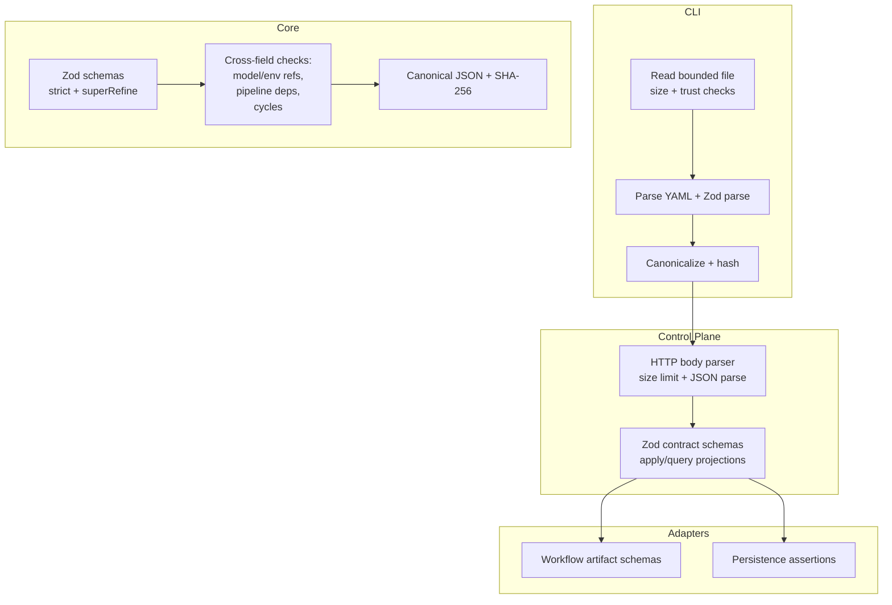
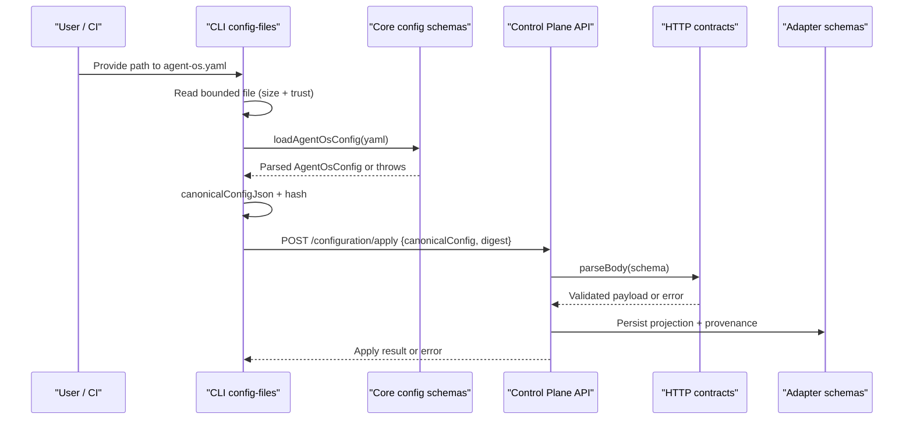
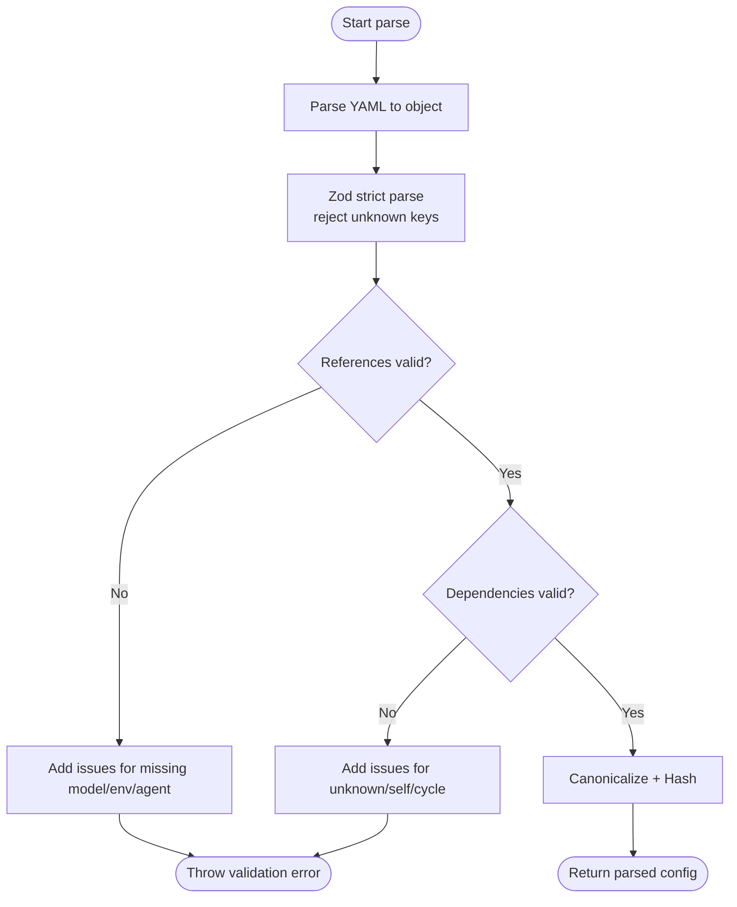
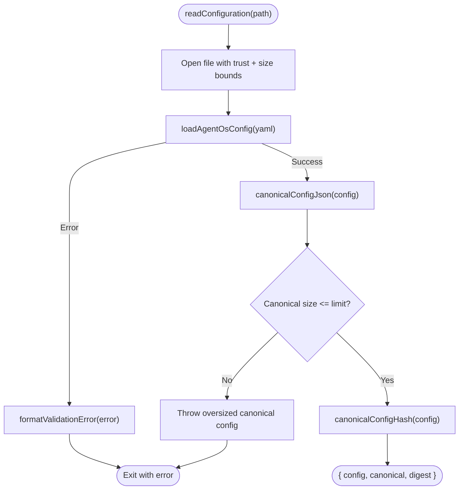
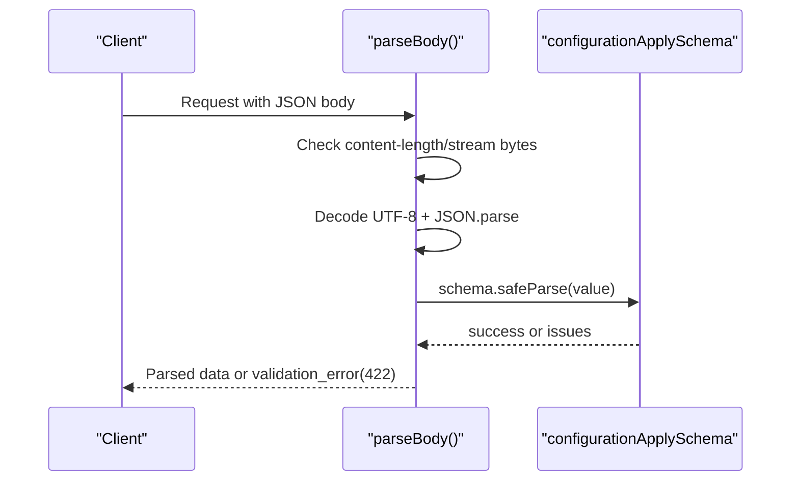
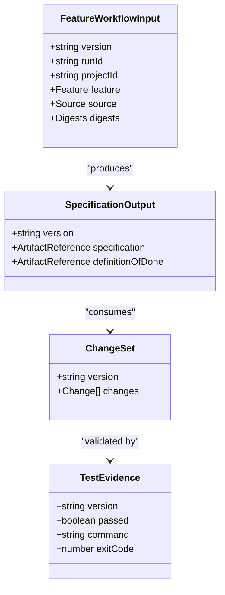
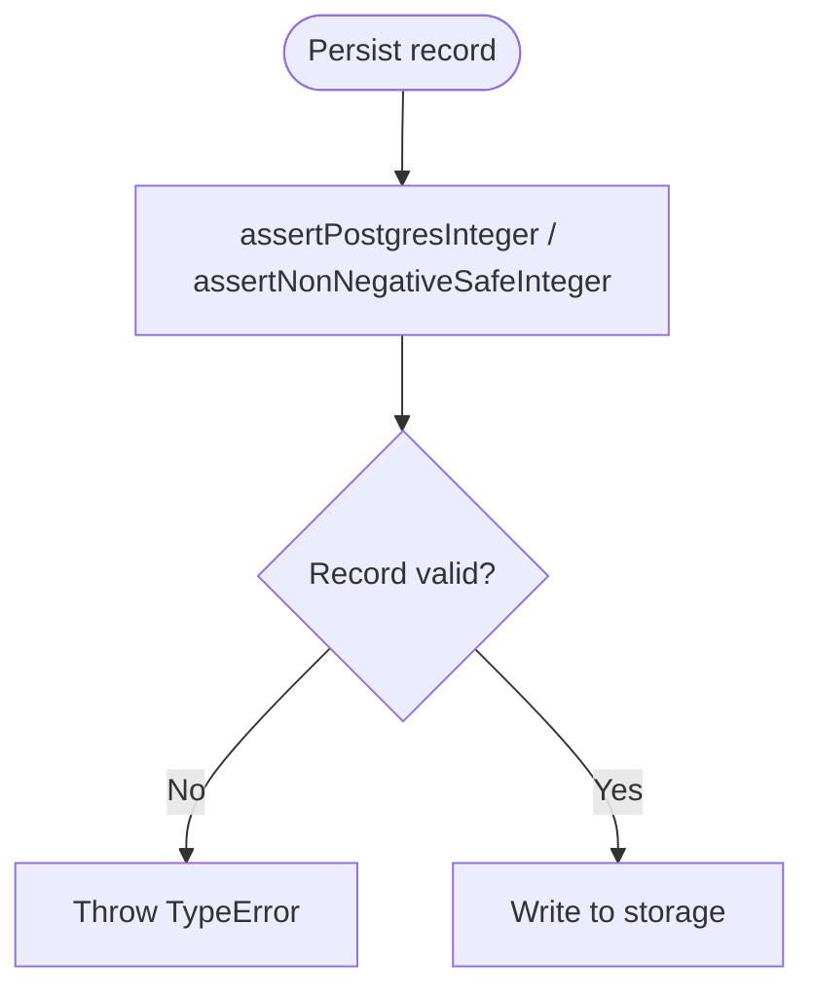
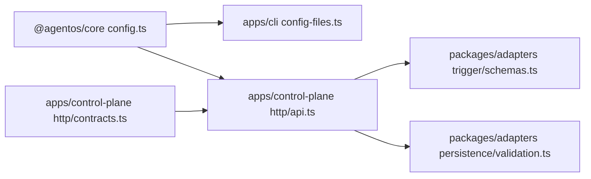

# Validation System

<cite>
**Referenced Files in This Document**
- [config.ts](file://packages/core/src/config.ts)
- [config.test.ts](file://packages/core/src/config.test.ts)
- [config-files.ts](file://apps/cli/src/config-files.ts)
- [workspace.ts](file://apps/cli/src/workspace.ts)
- [contracts.ts](file://apps/control-plane/src/http/contracts.ts)
- [api.ts](file://apps/control-plane/src/http/api.ts)
- [schemas.ts](file://packages/adapters/src/trigger/schemas.ts)
- [validation.ts](file://packages/adapters/src/persistence/validation.ts)
</cite>

## Table of Contents
1. [Introduction](#introduction)
2. [Project Structure](#project-structure)
3. [Core Components](#core-components)
4. [Architecture Overview](#architecture-overview)
5. [Detailed Component Analysis](#detailed-component-analysis)
6. [Dependency Analysis](#dependency-analysis)
7. [Performance Considerations](#performance-considerations)
8. [Troubleshooting Guide](#troubleshooting-guide)
9. [Conclusion](#conclusion)

## Introduction
This document explains the configuration validation system used by Agent OS Passerine to ensure that configurations are correct, secure, and safe to apply at runtime. The system is built on Zod schemas with strict mode enabled to reject unknown keys, custom refinements for cross-field rules, and dedicated validators for agent references, environment dependencies, pipeline step dependencies, and circular dependency detection. It also covers size limits, canonicalization, hashing, and how validation errors are surfaced from CLI parsing through API boundaries into user-facing messages.

## Project Structure
The validation system spans several layers:
- Core schema definitions and cross-field validations live in the core package.
- CLI reads and validates configuration files before applying or sending them to the control plane.
- Control plane HTTP contracts validate incoming payloads and enforce size and consistency constraints.
- Adapters define workflow artifact schemas and persistence-level assertions.

**Diagram sources**
- [config.ts:165-337](file://packages/core/src/config.ts#L165-L337)
- [config-files.ts:141-234](file://apps/cli/src/config-files.ts#L141-L234)
- [api.ts:28-91](file://apps/control-plane/src/http/api.ts#L28-L91)
- [contracts.ts:56-107](file://apps/control-plane/src/http/contracts.ts#L56-L107)
- [schemas.ts:11-187](file://packages/adapters/src/trigger/schemas.ts#L11-L187)
- [validation.ts:12-84](file://packages/adapters/src/persistence/validation.ts#L12-L84)

**Section sources**
- [config.ts:165-337](file://packages/core/src/config.ts#L165-L337)
- [config-files.ts:141-234](file://apps/cli/src/config-files.ts#L141-L234)
- [api.ts:28-91](file://apps/control-plane/src/http/api.ts#L28-L91)
- [contracts.ts:56-107](file://apps/control-plane/src/http/contracts.ts#L56-L107)
- [schemas.ts:11-187](file://packages/adapters/src/trigger/schemas.ts#L11-L187)
- [validation.ts:12-84](file://packages/adapters/src/persistence/validation.ts#L12-L84)

## Core Components
- Core Zod schemas define the shape of Agent OS configuration, including project, models, agents, environments, pipelines, policies, budgets, goals, runtime routing, and optional verification settings. All schemas use strict mode to reject unknown fields.
- Cross-field validations in a single superRefine block enforce:
  - Agent model references must exist in models.
  - Agent environment references must exist in environments.
  - Pipeline steps reference existing agents and environments.
  - Duplicate step IDs are rejected.
  - Step dependencies must exist and cannot be self-references.
  - Dependency cycles are detected using a depth-first traversal per pipeline.
- Canonicalization and hashing produce deterministic JSON and SHA-256 digests for stable comparison and change planning.
- CLI enforces trusted file paths, size limits, and formats validation errors into readable messages.
- Control plane HTTP layer enforces payload size limits, parses JSON, validates against request/response schemas, and maps validation failures to structured errors.
- Adapter schemas validate workflow artifacts (specifications, plans, implementations, reviews, publications).
- Persistence validators assert numeric ranges and structural invariants for domain records.

**Section sources**
- [config.ts:165-337](file://packages/core/src/config.ts#L165-L337)
- [config-files.ts:141-234](file://apps/cli/src/config-files.ts#L141-L234)
- [api.ts:28-91](file://apps/control-plane/src/http/api.ts#L28-L91)
- [contracts.ts:56-107](file://apps/control-plane/src/http/contracts.ts#L56-L107)
- [schemas.ts:11-187](file://packages/adapters/src/trigger/schemas.ts#L11-L187)
- [validation.ts:12-84](file://packages/adapters/src/persistence/validation.ts#L12-L84)

## Architecture Overview
The validation flow proceeds from file read to runtime enforcement:

**Diagram sources**
- [config-files.ts:141-234](file://apps/cli/src/config-files.ts#L141-L234)
- [config.ts:331-337](file://packages/core/src/config.ts#L331-L337)
- [api.ts:28-91](file://apps/control-plane/src/http/api.ts#L28-L91)
- [contracts.ts:56-107](file://apps/control-plane/src/http/contracts.ts#L56-L107)

**Section sources**
- [config-files.ts:141-234](file://apps/cli/src/config-files.ts#L141-L234)
- [config.ts:331-337](file://packages/core/src/config.ts#L331-L337)
- [api.ts:28-91](file://apps/control-plane/src/http/api.ts#L28-L91)
- [contracts.ts:56-107](file://apps/control-plane/src/http/contracts.ts#L56-L107)

## Detailed Component Analysis

### Core Configuration Schema and Cross-Field Validation
- Strict schemas prevent unknown keys at every level, reducing drift and accidental misconfiguration.
- Cross-field validations include:
  - Model profile existence for each agent.
  - Environment existence for agents and pipeline steps.
  - Pipeline step uniqueness and valid agent/environment references.
  - Dependency validity and cycle detection per pipeline.
- Canonicalization sorts object keys deterministically and serializes to JSON; hashing uses SHA-256 to create stable identifiers for configuration versions.

**Diagram sources**
- [config.ts:165-337](file://packages/core/src/config.ts#L165-L337)

**Section sources**
- [config.ts:165-337](file://packages/core/src/config.ts#L165-L337)

### CLI File Reading, Size Limits, and Error Formatting
- Reads configuration files with bounded size and trust checks to prevent reading arbitrary files outside the workspace.
- Enforces maximum source and canonical sizes.
- Formats Zod validation issues into concise human-readable messages, limiting the number of reported issues.

**Diagram sources**
- [config-files.ts:141-234](file://apps/cli/src/config-files.ts#L141-L234)

**Section sources**
- [config-files.ts:141-234](file://apps/cli/src/config-files.ts#L141-L234)

### Control Plane HTTP Validation and Payload Safety
- Body parser enforces content-length and streaming size limits, decodes UTF-8 safely, parses JSON, then validates against a Zod schema.
- Configuration apply schema enforces digest format, canonical config size, and mutual exclusivity/invariance between expected revision and digest.
- Query and projection schemas validate inputs and outputs consistently across endpoints.

**Diagram sources**
- [api.ts:28-91](file://apps/control-plane/src/http/api.ts#L28-L91)
- [contracts.ts:56-82](file://apps/control-plane/src/http/contracts.ts#L56-L82)

**Section sources**
- [api.ts:28-91](file://apps/control-plane/src/http/api.ts#L28-L91)
- [contracts.ts:56-107](file://apps/control-plane/src/http/contracts.ts#L56-L107)

### Workflow Artifact Schemas and Custom Rules
- Workflow input, specification, plan, implementation, review, publication, and test evidence schemas enforce versioned structures, identifier formats, and size constraints.
- Change set schema includes a custom refinement to cap total content bytes and validate operations.
- Trusted command observation schema ensures timestamps, digests, and exit codes are well-formed.

**Diagram sources**
- [schemas.ts:11-187](file://packages/adapters/src/trigger/schemas.ts#L11-L187)

**Section sources**
- [schemas.ts:11-187](file://packages/adapters/src/trigger/schemas.ts#L11-L187)

### Persistence Assertions
- Numeric fields are asserted to be safe integers within PostgreSQL integer ranges where applicable.
- Domain events, artifacts, config revisions, step runs, goal criteria, and progress are validated before persistence to prevent invalid state.

**Diagram sources**
- [validation.ts:12-84](file://packages/adapters/src/persistence/validation.ts#L12-L84)

**Section sources**
- [validation.ts:12-84](file://packages/adapters/src/persistence/validation.ts#L12-L84)

## Dependency Analysis
- Core schemas depend only on Zod and YAML parsing utilities. They provide reusable types and functions consumed by CLI and control plane.
- CLI depends on core for parsing, canonicalization, and hashing, and adds filesystem trust and size enforcement.
- Control plane HTTP layer depends on core constants for size limits and defines its own Zod schemas for API contracts.
- Adapters define workflow-specific schemas and persistence assertions used by execution and storage layers.

**Diagram sources**
- [config.ts:165-337](file://packages/core/src/config.ts#L165-L337)
- [config-files.ts:141-234](file://apps/cli/src/config-files.ts#L141-L234)
- [api.ts:28-91](file://apps/control-plane/src/http/api.ts#L28-L91)
- [contracts.ts:56-107](file://apps/control-plane/src/http/contracts.ts#L56-L107)
- [schemas.ts:11-187](file://packages/adapters/src/trigger/schemas.ts#L11-L187)
- [validation.ts:12-84](file://packages/adapters/src/persistence/validation.ts#L12-L84)

**Section sources**
- [config.ts:165-337](file://packages/core/src/config.ts#L165-L337)
- [config-files.ts:141-234](file://apps/cli/src/config-files.ts#L141-L234)
- [api.ts:28-91](file://apps/control-plane/src/http/api.ts#L28-L91)
- [contracts.ts:56-107](file://apps/control-plane/src/http/contracts.ts#L56-L107)
- [schemas.ts:11-187](file://packages/adapters/src/trigger/schemas.ts#L11-L187)
- [validation.ts:12-84](file://packages/adapters/src/persistence/validation.ts#L12-L84)

## Performance Considerations
- Bounded file reads and streaming body parsing prevent memory exhaustion from large inputs.
- Strict Zod schemas avoid expensive fallback handling by failing fast on unexpected fields.
- Canonicalization sorts keys deterministically; this is O(n log n) over object keys but ensures stable hashes for caching and diffing.
- Cycle detection per pipeline is linear in the number of steps and edges, suitable for typical pipeline sizes.

[No sources needed since this section provides general guidance]

## Troubleshooting Guide
Common validation errors and resolutions:
- Unknown model profile referenced by an agent: Ensure the agent’s model exists under models.
- Unknown environment referenced by an agent or pipeline step: Define the environment under environments or remove the reference.
- Unknown pipeline dependency: Verify all dependsOn entries match existing step ids within the same pipeline.
- Self-dependency in a pipeline step: Remove the step from its own dependsOn list.
- Dependency cycle detected: Reorder steps so that dependencies form a DAG without cycles.
- Excessive canonical configuration size: Reduce configuration complexity or split concerns; the system enforces a maximum byte size for canonical forms.
- Invalid JSON or oversized request body in API: Ensure requests are valid JSON and within allowed size limits.

Resolution tips:
- Use the CLI’s formatted validation output to locate exact paths and messages.
- For API errors, check status 422 responses and adjust payloads according to contract schemas.
- When encountering persistent cycles, draw the dependency graph and identify back edges to break.

**Section sources**
- [config.test.ts:152-201](file://packages/core/src/config.test.ts#L152-L201)
- [config-files.ts:187-234](file://apps/cli/src/config-files.ts#L187-L234)
- [api.ts:28-91](file://apps/control-plane/src/http/api.ts#L28-L91)
- [contracts.ts:56-107](file://apps/control-plane/src/http/contracts.ts#L56-L107)

## Conclusion
The configuration validation system combines strict Zod schemas, targeted cross-field validations, and robust boundary checks to ensure Agent OS Passerine configurations are correct and secure before they reach runtime. By enforcing reference integrity, preventing cycles, and bounding sizes, it minimizes operational risk while providing clear, actionable error messages. The layered approach—CLI, core, control plane, and adapters—ensures consistent validation from file ingestion through API boundaries to persistence.