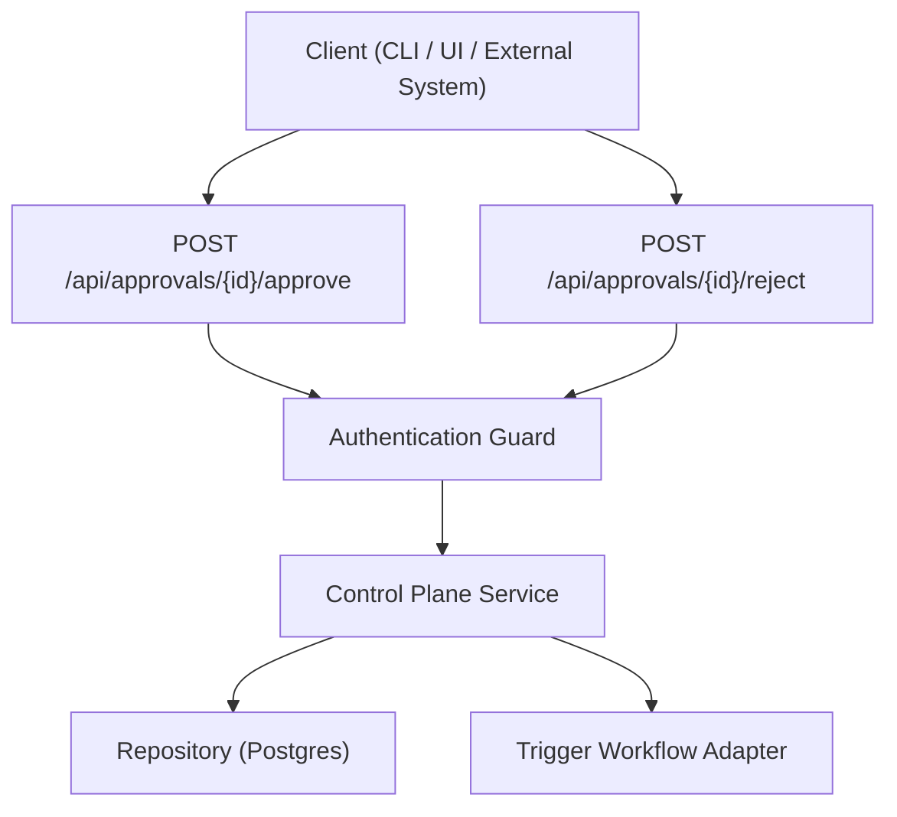
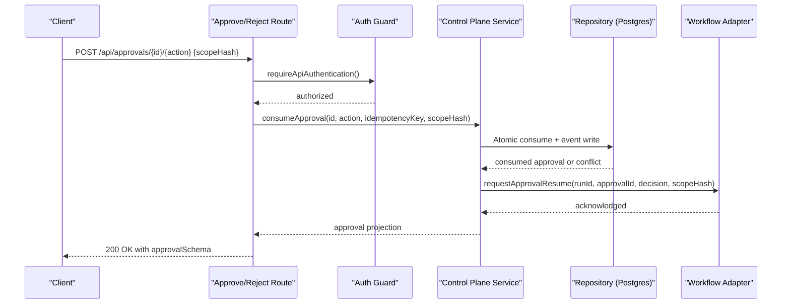
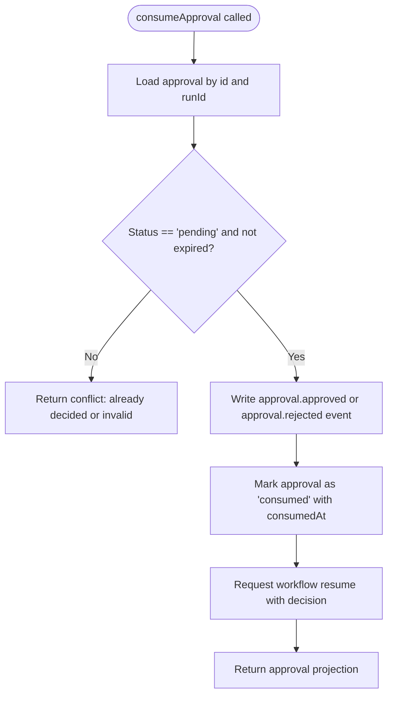
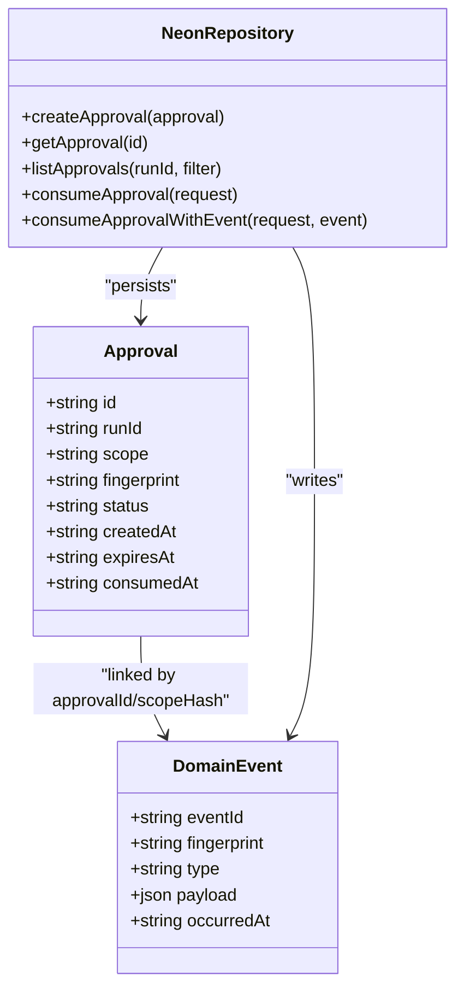
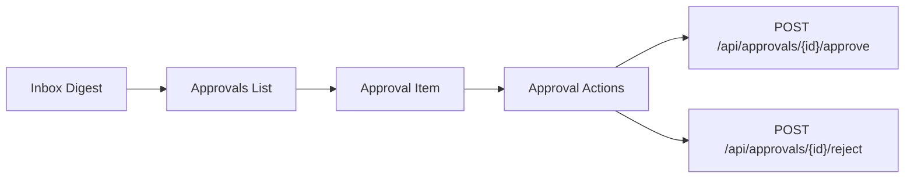
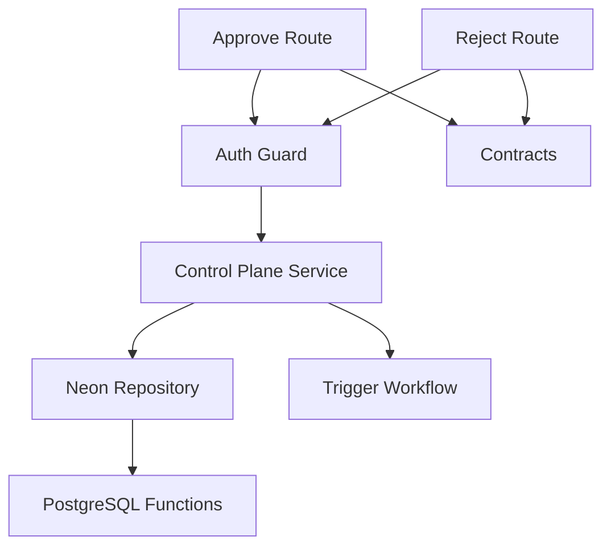

# Approvals API

<cite>
**Referenced Files in This Document**
- [approve/route.ts](file://apps/control-plane/app/api/approvals/[id]/approve/route.ts)
- [reject/route.ts](file://apps/control-plane/app/api/approvals/[id]/reject/route.ts)
- [contracts.ts](file://apps/control-plane/src/http/contracts.ts)
- [authenticated.ts](file://apps/control-plane/src/http/authenticated.ts)
- [guard.ts](file://apps/control-plane/src/auth/guard.ts)
- [control-plane-service.ts](file://apps/control-plane/src/application/control-plane-service.ts)
- [workflow.ts](file://packages/adapters/src/trigger/workflow.ts)
- [neon-repository.ts](file://packages/adapters/src/persistence/neon-repository.ts)
- [0006_loving_sway.sql](file://drizzle/0006_loving_sway.sql)
- [inbox-view-model.ts](file://apps/control-plane/src/ui/inbox-view-model.ts)
- [inbox-view.tsx](file://apps/control-plane/src/ui/inbox-view.tsx)
- [commands.test.ts](file://apps/cli/src/commands.test.ts)
</cite>

## Table of Contents
1. [Introduction](#introduction)
2. [Project Structure](#project-structure)
3. [Core Components](#core-components)
4. [Architecture Overview](#architecture-overview)
5. [Detailed Component Analysis](#detailed-component-analysis)
6. [Dependency Analysis](#dependency-analysis)
7. [Performance Considerations](#performance-considerations)
8. [Troubleshooting Guide](#troubleshooting-guide)
9. [Conclusion](#conclusion)
10. [Appendices](#appendices)

## Introduction
This document describes the Approvals API used to implement human-in-the-loop decision points in Agent OS workflows. It covers:
- Endpoints for approving or rejecting workflow steps
- Request and response schemas
- Authorization requirements
- Approval routing, idempotency, and audit logging
- Notification and inbox integration
- Guidance for designing effective approval gates, escalation procedures, and policy configuration

Approvals are created by workflows when a step requires explicit human authorization before proceeding. Clients call dedicated approve or reject endpoints with an approval identifier and a scope hash to bind the decision to the exact requested change. The control plane records the decision atomically, emits durable events, and resumes the waiting workflow with the outcome.

## Project Structure
The approvals feature is implemented as Next.js App Router routes that delegate to the control plane service. Schemas and validation live in a shared contracts module. Authentication is enforced per request. The control plane persists decisions and emits domain events, which trigger workflow resumption through the adapter layer.

**Diagram sources**
- [approve/route.ts:11-32](file://apps/control-plane/app/api/approvals/[id]/approve/route.ts#L11-L32)
- [reject/route.ts:11-32](file://apps/control-plane/app/api/approvals/[id]/reject/route.ts#L11-L32)
- [authenticated.ts:4-7](file://apps/control-plane/src/http/authenticated.ts#L4-L7)
- [guard.ts:33-61](file://apps/control-plane/src/auth/guard.ts#L33-L61)
- [control-plane-service.ts:1400-1433](file://apps/control-plane/src/application/control-plane-service.ts#L1400-L1433)
- [neon-repository.ts:949-967](file://packages/adapters/src/persistence/neon-repository.ts#L949-L967)
- [workflow.ts:1104-1141](file://packages/adapters/src/trigger/workflow.ts#L1104-L1141)

**Section sources**
- [approve/route.ts:1-32](file://apps/control-plane/app/api/approvals/[id]/approve/route.ts#L1-L32)
- [reject/route.ts:1-32](file://apps/control-plane/app/api/approvals/[id]/reject/route.ts#L1-L32)
- [contracts.ts:55-323](file://apps/control-plane/src/http/contracts.ts#L55-L323)
- [authenticated.ts:4-7](file://apps/control-plane/src/http/authenticated.ts#L4-L7)
- [guard.ts:33-61](file://apps/control-plane/src/auth/guard.ts#L33-L61)

## Core Components
- Approval decision endpoints: POST /api/approvals/{id}/approve and POST /api/approvals/{id}/reject
- Request body schema: approvalDecisionSchema
- Response schema: approvalSchema
- Idempotency: required via Idempotency-Key header
- Authorization: API token or authenticated session with origin checks for mutations

Key behaviors:
- Each endpoint validates the path ID and request body using Zod schemas.
- Authentication is enforced before processing.
- The control plane consumes the approval atomically, writes an event, and resumes the workflow.
- Responses include approval metadata such as status, timestamps, and optional summary fields.

**Section sources**
- [contracts.ts:55-323](file://apps/control-plane/src/http/contracts.ts#L55-L323)
- [authenticated.ts:4-7](file://apps/control-plane/src/http/authenticated.ts#L4-L7)
- [guard.ts:33-61](file://apps/control-plane/src/auth/guard.ts#L33-L61)

## Architecture Overview
The approval flow ensures safety and auditability:
- Routes validate inputs and enforce authentication.
- The control plane performs an atomic consume operation under constraints (approval exists, belongs to the run, matches scope fingerprint, is pending, not expired).
- An event is recorded with the decision and scope hash.
- A workflow resume request is dispatched to wake the waiting step.
- The workflow adapter re-reads the authoritative approval and its event to determine the decision.

**Diagram sources**
- [approve/route.ts:11-32](file://apps/control-plane/app/api/approvals/[id]/approve/route.ts#L11-L32)
- [reject/route.ts:11-32](file://apps/control-plane/app/api/approvals/[id]/reject/route.ts#L11-L32)
- [control-plane-service.ts:1400-1433](file://apps/control-plane/src/application/control-plane-service.ts#L1400-L1433)
- [neon-repository.ts:949-967](file://packages/adapters/src/persistence/neon-repository.ts#L949-L967)
- [workflow.ts:1104-1141](file://packages/adapters/src/trigger/workflow.ts#L1104-L1141)

## Detailed Component Analysis

### Approval Endpoints
- POST /api/approvals/{id}/approve
  - Purpose: Approve a pending approval bound to a specific scope.
  - Path parameter: id (bounded alphanumeric identifier)
  - Body: { scopeHash }
  - Headers: Authorization (Bearer token or session), Idempotency-Key (required)
  - Success response: approvalSchema
  - Errors: validation errors, authentication failures, approval conflicts

- POST /api/approvals/{id}/reject
  - Purpose: Reject a pending approval bound to a specific scope.
  - Path parameter: id (bounded alphanumeric identifier)
  - Body: { scopeHash }
  - Headers: Authorization (Bearer token or session), Idempotency-Key (required)
  - Success response: approvalSchema
  - Errors: validation errors, authentication failures, approval conflicts

Both routes:
- Validate the path ID using boundedPathId.
- Require authentication via requireApiAuthentication.
- Enforce idempotency via the Idempotency-Key header.
- Delegate to controlPlaneService.consumeApproval with the decision type ('approve' or 'reject').

**Section sources**
- [approve/route.ts:11-32](file://apps/control-plane/app/api/approvals/[id]/approve/route.ts#L11-L32)
- [reject/route.ts:11-32](file://apps/control-plane/app/api/approvals/[id]/reject/route.ts#L11-L32)
- [contracts.ts:362-382](file://apps/control-plane/src/http/contracts.ts#L362-L382)

### Request and Response Schemas
- Request body schema: approvalDecisionSchema
  - Fields:
    - scopeHash: string digest (1–256 characters)
- Response schema: approvalSchema
  - Fields:
    - id: string identifier
    - runId: string identifier
    - scopeHash: string
    - scopePreview: string
    - status: enum ['pending', 'consumed', 'expired']
    - createdAt: ISO timestamp
    - expiresAt: ISO timestamp
    - consumedAt: ISO timestamp (optional)
    - summary: object with optional title, requirements array, criteria array

Notes:
- The Idempotency-Key header is mandatory; missing or too long values produce a 400 error.
- Path identifiers must match the allowed pattern; otherwise a 422 validation error is returned.

**Section sources**
- [contracts.ts:55-323](file://apps/control-plane/src/http/contracts.ts#L55-L323)
- [contracts.ts:362-382](file://apps/control-plane/src/http/contracts.ts#L362-L382)

### Authorization Requirements
- Authentication methods:
  - Bearer token: Authorization: Bearer <token>
  - Session cookie: Requires a valid session; mutation requests enforce same-origin checks
- Origin enforcement:
  - Non-GET/HEAD/OPTIONS requests from browsers must originate from the configured public URL
- CLI vs session:
  - API routes accept either CLI tokens or sessions; CLI-specific routes restrict to CLI auth

Error codes:
- authentication_required: 401 when no valid identity is present
- invalid_api_token: 401 when bearer token does not match configured token
- csrf_rejected: 403 when browser mutation origin is invalid

**Section sources**
- [authenticated.ts:4-7](file://apps/control-plane/src/http/authenticated.ts#L4-L7)
- [guard.ts:33-61](file://apps/control-plane/src/auth/guard.ts#L33-L61)

### Approval Routing and Workflow Integration
- Control plane service:
  - Emits an atomic domain event with the decision and scope hash
  - Attempts to resume the workflow with the decision
  - Returns the projected approval state
- Workflow adapter:
  - Reads the authoritative approval and matching event
  - Validates binding (runId, scope fingerprint)
  - Determines decision ('approve' or 'reject') or handles expiration

**Diagram sources**
- [control-plane-service.ts:1400-1433](file://apps/control-plane/src/application/control-plane-service.ts#L1400-L1433)
- [neon-repository.ts:949-967](file://packages/adapters/src/persistence/neon-repository.ts#L949-L967)
- [workflow.ts:1104-1141](file://packages/adapters/src/trigger/workflow.ts#L1104-L1141)

**Section sources**
- [control-plane-service.ts:1400-1433](file://apps/control-plane/src/application/control-plane-service.ts#L1400-L1433)
- [workflow.ts:1104-1141](file://packages/adapters/src/trigger/workflow.ts#L1104-L1141)

### Audit Logging and Persistence
- Events:
  - Decisions are persisted as domain events with types approval.approved or approval.rejected
  - Events include approvalId, scopeHash, and occurredAt
- Database functions:
  - Atomic consumption uses a stored function to ensure event and approval updates are consistent
- Repository operations:
  - createApproval, getApproval, listApprovals, consumeApproval, consumeApprovalWithEvent

**Diagram sources**
- [neon-repository.ts:906-924](file://packages/adapters/src/persistence/neon-repository.ts#L906-L924)
- [neon-repository.ts:926-967](file://packages/adapters/src/persistence/neon-repository.ts#L926-L967)
- [neon-repository.ts:1151-1178](file://packages/adapters/src/persistence/neon-repository.ts#L1151-L1178)
- [0006_loving_sway.sql:105-129](file://drizzle/0006_loving_sway.sql#L105-L129)

**Section sources**
- [neon-repository.ts:906-967](file://packages/adapters/src/persistence/neon-repository.ts#L906-L967)
- [neon-repository.ts:1151-1178](file://packages/adapters/src/persistence/neon-repository.ts#L1151-L1178)
- [0006_loving_sway.sql:105-129](file://drizzle/0006_loving_sway.sql#L105-L129)

### Inbox and Notification Integration
- Inbox aggregates approvals, messages, and notifications
- Approval items display:
  - Subject: “Approval requested”
  - Preview: scope preview or decision context
  - Status chips: awaiting decision, expired, approved, rejected
- UI exposes approval actions for clients to call approve/reject endpoints

**Diagram sources**
- [control-plane-service.ts:1464-1583](file://apps/control-plane/src/application/control-plane-service.ts#L1464-L1583)
- [inbox-view-model.ts:99-169](file://apps/control-plane/src/ui/inbox-view-model.ts#L99-L169)
- [inbox-view.tsx:98-177](file://apps/control-plane/src/ui/inbox-view.tsx#L98-L177)

**Section sources**
- [control-plane-service.ts:1464-1583](file://apps/control-plane/src/application/control-plane-service.ts#L1464-L1583)
- [inbox-view-model.ts:99-169](file://apps/control-plane/src/ui/inbox-view-model.ts#L99-L169)
- [inbox-view.tsx:98-177](file://apps/control-plane/src/ui/inbox-view.tsx#L98-L177)

### CLI Mapping and Examples
- The CLI maps high-level commands to server endpoints:
  - inbox.approve -> POST /api/approvals/{id}/approve with { scopeHash }
  - inbox.reject -> POST /api/approvals/{id}/reject with { scopeHash }
- Tests assert exact method, path, body, and idempotency key usage

Example patterns:
- Approve:
  - Method: POST
  - Path: /api/approvals/{id}/approve
  - Body: { scopeHash: "<digest>" }
  - Header: Idempotency-Key: "<unique-key>"
- Reject:
  - Method: POST
  - Path: /api/approvals/{id}/reject
  - Body: { scopeHash: "<digest>" }
  - Header: Idempotency-Key: "<unique-key>"

**Section sources**
- [commands.test.ts:94-123](file://apps/cli/src/commands.test.ts#L94-L123)

## Dependency Analysis
- Routes depend on:
  - Authentication guard
  - Contracts for validation
  - Control plane service for business logic
- Control plane depends on:
  - Repository for persistence
  - Workflow adapter for external orchestration
- Repository depends on:
  - PostgreSQL functions for atomic operations
- Workflow adapter depends on:
  - Repository to read authoritative approval and events

**Diagram sources**
- [approve/route.ts:11-32](file://apps/control-plane/app/api/approvals/[id]/approve/route.ts#L11-L32)
- [reject/route.ts:11-32](file://apps/control-plane/app/api/approvals/[id]/reject/route.ts#L11-L32)
- [guard.ts:33-61](file://apps/control-plane/src/auth/guard.ts#L33-L61)
- [contracts.ts:55-323](file://apps/control-plane/src/http/contracts.ts#L55-L323)
- [control-plane-service.ts:1400-1433](file://apps/control-plane/src/application/control-plane-service.ts#L1400-L1433)
- [neon-repository.ts:949-967](file://packages/adapters/src/persistence/neon-repository.ts#L949-L967)
- [0006_loving_sway.sql:105-129](file://drizzle/0006_loving_sway.sql#L105-L129)
- [workflow.ts:1104-1141](file://packages/adapters/src/trigger/workflow.ts#L1104-L1141)

**Section sources**
- [approve/route.ts:11-32](file://apps/control-plane/app/api/approvals/[id]/approve/route.ts#L11-L32)
- [reject/route.ts:11-32](file://apps/control-plane/app/api/approvals/[id]/reject/route.ts#L11-L32)
- [guard.ts:33-61](file://apps/control-plane/src/auth/guard.ts#L33-L61)
- [contracts.ts:55-323](file://apps/control-plane/src/http/contracts.ts#L55-L323)
- [control-plane-service.ts:1400-1433](file://apps/control-plane/src/application/control-plane-service.ts#L1400-L1433)
- [neon-repository.ts:949-967](file://packages/adapters/src/persistence/neon-repository.ts#L949-L967)
- [0006_loving_sway.sql:105-129](file://drizzle/0006_loving_sway.sql#L105-L129)
- [workflow.ts:1104-1141](file://packages/adapters/src/trigger/workflow.ts#L1104-L1141)

## Performance Considerations
- Concurrency:
  - Inbox digests use concurrency-limited mapping to batch queries efficiently
- Expiry handling:
  - Pending approvals may appear stale until reconciliation marks them expired; projections derive expiry at read time to avoid inconsistent states
- Event-driven resumption:
  - Workflow resume is attempted after atomic event emission; transient failures do not block decision recording

[No sources needed since this section provides general guidance]

## Troubleshooting Guide
Common issues and resolutions:
- Missing or invalid Idempotency-Key:
  - Error code: idempotency_key_required
  - Resolution: Include a unique, non-empty Idempotency-Key header within length limits
- Invalid path identifier:
  - Error code: validation_error
  - Resolution: Ensure the approval id matches the allowed pattern
- Already decided or invalid approval:
  - Error code: approval_already_decided or approval_invalid
  - Resolution: Verify the approval exists, belongs to the run, matches the scope fingerprint, and is still pending and not expired
- Authentication failures:
  - Error codes: authentication_required, invalid_api_token, csrf_rejected
  - Resolution: Provide a valid Bearer token or authenticated session; ensure browser mutations originate from the configured public URL

**Section sources**
- [contracts.ts:362-382](file://apps/control-plane/src/http/contracts.ts#L362-L382)
- [guard.ts:33-61](file://apps/control-plane/src/auth/guard.ts#L33-L61)
- [control-plane-service.ts:1400-1433](file://apps/control-plane/src/application/control-plane-service.ts#L1400-L1433)

## Conclusion
The Approvals API provides secure, idempotent, and auditable human-in-the-loop controls for Agent OS workflows. By binding decisions to scope hashes, enforcing strict authentication, and persisting atomic events, it ensures reliable gating of sensitive steps. Integrating with the inbox and notification system offers operators visibility and actionable controls. Following the guidance in this document helps design robust approval gates, clear escalation paths, and configurable policies aligned with organizational risk.

[No sources needed since this section summarizes without analyzing specific files]

## Appendices

### API Reference Summary
- Endpoints:
  - POST /api/approvals/{id}/approve
  - POST /api/approvals/{id}/reject
- Required headers:
  - Authorization: Bearer token or session cookie
  - Idempotency-Key: unique per decision attempt
- Request body:
  - { scopeHash: string }
- Response body:
  - approvalSchema fields: id, runId, scopeHash, scopePreview, status, createdAt, expiresAt, consumedAt, summary

**Section sources**
- [approve/route.ts:11-32](file://apps/control-plane/app/api/approvals/[id]/approve/route.ts#L11-L32)
- [reject/route.ts:11-32](file://apps/control-plane/app/api/approvals/[id]/reject/route.ts#L11-L32)
- [contracts.ts:55-323](file://apps/control-plane/src/http/contracts.ts#L55-L323)

### Designing Effective Approval Gates
- Scope hashing:
  - Always include a deterministic scope hash representing the exact change set to prevent mismatched decisions
- Time-bounded approvals:
  - Use expiresAt to limit exposure; treat expired approvals as non-decidable
- Summaries and criteria:
  - Provide titles, requirements, and criteria to inform approvers
- Escalation procedures:
  - Route approvals based on risk level; escalate unresolved items after thresholds
- Policy configuration:
  - Configure thresholds, budgets, and roles via project and pipeline settings; enforce via repository and service layers

[No sources needed since this section provides general guidance]