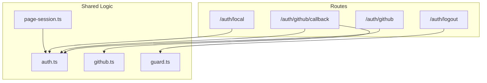
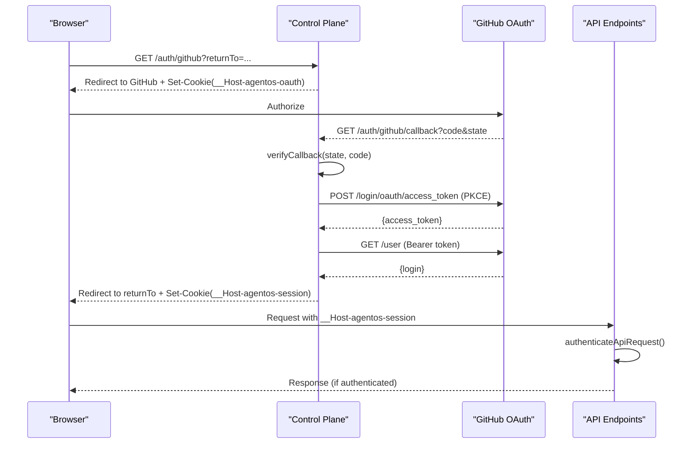
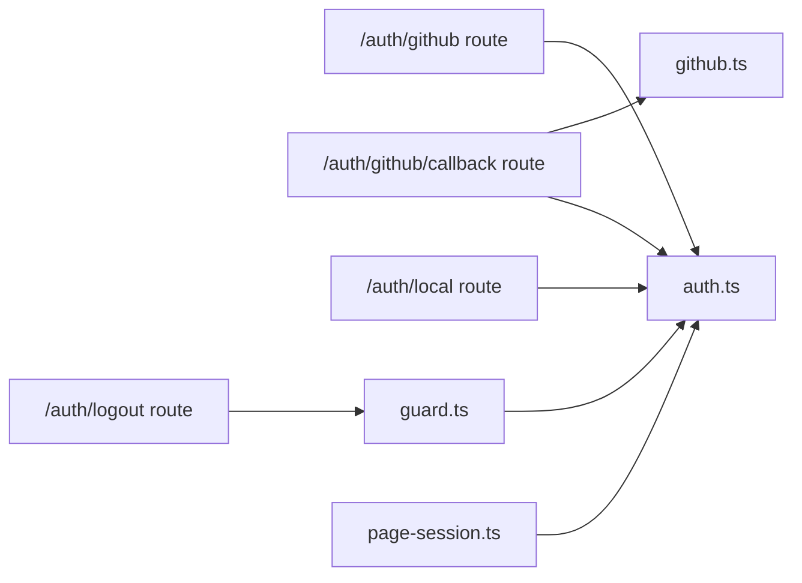
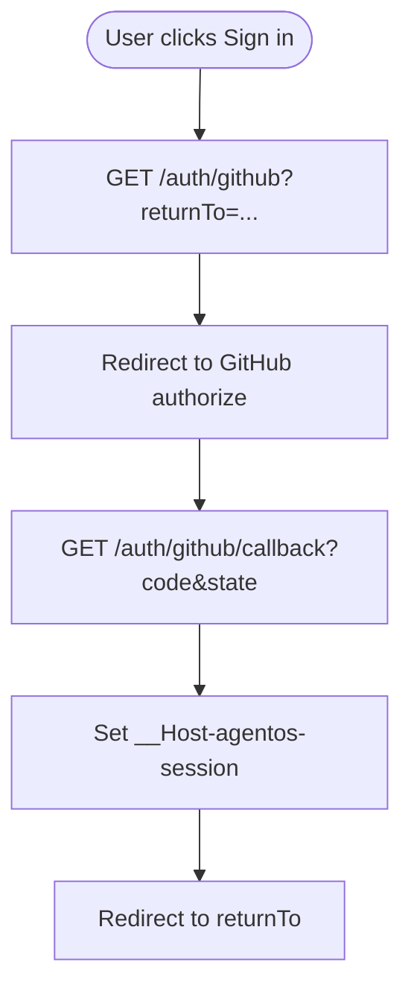

# Authentication API

<cite>
**Referenced Files in This Document**
- [route.ts](file://apps/control-plane/app/auth/github/route.ts)
- [route.ts](file://apps/control-plane/app/auth/github/callback/route.ts)
- [route.ts](file://apps/control-plane/app/auth/local/route.ts)
- [route.ts](file://apps/control-plane/app/auth/logout/route.ts)
- [auth.ts](file://apps/control-plane/src/auth/auth.ts)
- [github.ts](file://apps/control-plane/src/auth/github.ts)
- [guard.ts](file://apps/control-plane/src/auth/guard.ts)
- [page-session.ts](file://apps/control-plane/src/auth/page-session.ts)
- [authenticated.ts](file://apps/control-plane/src/http/authenticated.ts)
- [page.tsx](file://apps/control-plane/app/login/page.tsx)
</cite>

## Table of Contents
1. Introduction
2. Project Structure
3. Core Components
4. Architecture Overview
5. Detailed Component Analysis
6. Dependency Analysis
7. Performance Considerations
8. Troubleshooting Guide
9. Conclusion
10. Appendices

## Introduction
This document describes the authentication API for the Agent OS Passerine Control Plane. It covers GitHub OAuth, local login bypass, session management, and logout. For each endpoint you will find HTTP methods, URL patterns, request/response behavior, error handling, and security considerations such as CSRF protection and cookie policies. Client integration guidelines are included for both GitHub and local authentication flows.

## Project Structure
Authentication is implemented using Next.js App Router routes under apps/control-plane/app/auth with shared logic in apps/control-plane/src/auth. The key pieces are:
- GitHub OAuth initiation and callback endpoints
- Local login bypass endpoint (development only)
- Logout endpoint
- Shared utilities for configuration, cookies, sessions, and guards

**Diagram sources**
- [route.ts:12-26](file://apps/control-plane/app/auth/github/route.ts#L12-L26)
- [route.ts:25-55](file://apps/control-plane/app/auth/github/callback/route.ts#L25-L55)
- [route.ts:16-75](file://apps/control-plane/app/auth/local/route.ts#L16-L75)
- [route.ts:10-19](file://apps/control-plane/app/auth/logout/route.ts#L10-L19)
- [auth.ts:14-21](file://apps/control-plane/src/auth/auth.ts#L14-L21)
- [github.ts:4-53](file://apps/control-plane/src/auth/github.ts#L4-L53)
- [guard.ts:17-61](file://apps/control-plane/src/auth/guard.ts#L17-L61)
- [page-session.ts:7-22](file://apps/control-plane/src/auth/page-session.ts#L7-L22)

**Section sources**
- [route.ts:12-26](file://apps/control-plane/app/auth/github/route.ts#L12-L26)
- [route.ts:25-55](file://apps/control-plane/app/auth/github/callback/route.ts#L25-L55)
- [route.ts:16-75](file://apps/control-plane/app/auth/local/route.ts#L16-L75)
- [route.ts:10-19](file://apps/control-plane/app/auth/logout/route.ts#L10-L19)
- [auth.ts:14-21](file://apps/control-plane/src/auth/auth.ts#L14-L21)
- [github.ts:4-53](file://apps/control-plane/src/auth/github.ts#L4-L53)
- [guard.ts:17-61](file://apps/control-plane/src/auth/guard.ts#L17-L61)
- [page-session.ts:7-22](file://apps/control-plane/src/auth/page-session.ts#L7-L22)

## Core Components
- Configuration and secrets: Centralized environment-based configuration for GitHub OAuth and session signing.
- Session storage: Secure, signed cookies for short-lived OAuth state and longer-lived user sessions.
- Guards: CSRF protection for browser mutations and unified authentication for API requests (session or CLI token).
- GitHub integration: PKCE-based OAuth flow with code exchange and identity retrieval.

Key responsibilities:
- Create authorization request and redirect to GitHub
- Verify callback, exchange code for access token, fetch user identity
- Issue and validate sessions
- Enforce origin checks for mutations
- Provide helpers for reading sessions in pages

**Section sources**
- [auth.ts:14-21](file://apps/control-plane/src/auth/auth.ts#L14-L21)
- [auth.ts:80-157](file://apps/control-plane/src/auth/auth.ts#L80-L157)
- [auth.ts:208-230](file://apps/control-plane/src/auth/auth.ts#L208-L230)
- [auth.ts:239-333](file://apps/control-plane/src/auth/auth.ts#L239-L333)
- [auth.ts:335-351](file://apps/control-plane/src/auth/auth.ts#L335-L351)
- [github.ts:4-53](file://apps/control-plane/src/auth/github.ts#L4-L53)
- [guard.ts:17-61](file://apps/control-plane/src/auth/guard.ts#L17-L61)
- [page-session.ts:7-22](file://apps/control-plane/src/auth/page-session.ts#L7-L22)

## Architecture Overview
The authentication architecture combines a browser-driven OAuth flow with secure cookie-based sessions and strict CSRF protections for mutations.

**Diagram sources**
- [route.ts:12-26](file://apps/control-plane/app/auth/github/route.ts#L12-L26)
- [route.ts:25-55](file://apps/control-plane/app/auth/github/callback/route.ts#L25-L55)
- [github.ts:4-53](file://apps/control-plane/src/auth/github.ts#L4-L53)
- [auth.ts:239-333](file://apps/control-plane/src/auth/auth.ts#L239-L333)
- [guard.ts:33-61](file://apps/control-plane/src/auth/guard.ts#L33-L61)

## Detailed Component Analysis

### GitHub OAuth Initiation
- Method: GET
- Path: /auth/github
- Query parameters:
  - returnTo: optional; sanitized to an internal path before use
- Behavior:
  - Builds a GitHub authorization URL with PKCE (S256), sets scope read:user
  - Sets a secure, HttpOnly, SameSite=Lax cookie named __Host-agentos-oauth containing state, verifier, returnTo, and issuedAt
  - Redirects to GitHub
- Errors:
  - If required configuration is missing or invalid, returns 503 via configuration validation

Client notes:
- Ensure your app redirects users to this URL when they click “Sign in with GitHub”
- Preserve the returnTo parameter to navigate back after successful login

**Section sources**
- [route.ts:12-26](file://apps/control-plane/app/auth/github/route.ts#L12-L26)
- [auth.ts:239-273](file://apps/control-plane/src/auth/auth.ts#L239-L273)
- [auth.ts:80-157](file://apps/control-plane/src/auth/auth.ts#L80-L157)

### GitHub OAuth Callback
- Method: GET
- Path: /auth/github/callback
- Query parameters:
  - code: authorization code from GitHub
  - state: state returned by GitHub
  - error: present if GitHub reports an error
- Behavior:
  - Validates state against the __Host-agentos-oauth cookie and enforces TTL
  - Exchanges code for access token using PKCE
  - Fetches user identity and verifies allowed login
  - Issues a session cookie __Host-agentos-session with 8-hour TTL
  - Clears the OAuth state cookie and redirects to returnTo
- Error responses:
  - On failure, clears cookies and redirects to /login?error=oauth

Security:
- Uses PKCE to prevent code interception
- Strict state validation and expiration
- Allowed login enforcement

**Section sources**
- [route.ts:25-55](file://apps/control-plane/app/auth/github/callback/route.ts#L25-L55)
- [github.ts:4-53](file://apps/control-plane/src/auth/github.ts#L4-L53)
- [auth.ts:279-315](file://apps/control-plane/src/auth/auth.ts#L279-L315)
- [auth.ts:323-333](file://apps/control-plane/src/auth/auth.ts#L323-L333)

### Local Login Bypass
- Methods: GET, POST
- Path: /auth/local
- Query parameters:
  - returnTo: optional; sanitized to an internal path
- Behavior:
  - Only allowed on localhost in non-production environments
  - Issues a session cookie __Host-agentos-session with 8-hour TTL
  - Redirects to returnTo
- Error responses:
  - Returns 403 if not allowed (non-localhost or production)

Usage:
- Intended for local development to skip GitHub OAuth
- Not suitable for production deployments

**Section sources**
- [route.ts:16-75](file://apps/control-plane/app/auth/local/route.ts#L16-L75)
- [auth.ts:64-71](file://apps/control-plane/src/auth/auth.ts#L64-L71)
- [auth.ts:323-333](file://apps/control-plane/src/auth/auth.ts#L323-L333)

### Logout
- Method: POST
- Path: /auth/logout
- Behavior:
  - Enforces same-origin mutation via Origin and Sec-Fetch-Site checks
  - Clears the session cookie __Host-agentos-session
  - Redirects to /login
- Error responses:
  - Throws a 403 if cross-origin mutation detected

CSRF protection:
- Mutations require matching Origin and same-site fetch context

**Section sources**
- [route.ts:10-19](file://apps/control-plane/app/auth/logout/route.ts#L10-L19)
- [guard.ts:17-31](file://apps/control-plane/src/auth/guard.ts#L17-L31)

### Session Management Utilities
- Cookie names:
  - __Host-agentos-oauth: temporary OAuth state
  - __Host-agentos-session: persistent user session
- Cookie policy:
  - Path=/, HttpOnly, Secure, SameSite=Lax
- Session claims include login, issuedAt, expiresAt
- Read session validates allowed login and expiry

Page/session helpers:
- Read or require a page session; redirects unauthenticated users to /login

**Section sources**
- [auth.ts:9-12](file://apps/control-plane/src/auth/auth.ts#L9-L12)
- [auth.ts:208-218](file://apps/control-plane/src/auth/auth.ts#L208-L218)
- [auth.ts:317-351](file://apps/control-plane/src/auth/auth.ts#L317-L351)
- [page-session.ts:7-22](file://apps/control-plane/src/auth/page-session.ts#L7-L22)

### API Authentication Guard
- Purpose: Authenticate incoming API requests using either:
  - Session cookie (__Host-agentos-session) for browser clients
  - Bearer token (CLI token) for programmatic clients
- Behavior:
  - Rejects webhooks without signature
  - Requires Origin and same-site checks for non-safe methods (POST/PUT/PATCH/DELETE)
- Error responses:
  - 401 for missing/invalid credentials
  - 403 for cross-origin mutations or disallowed tokens

CLI helper:
- Require CLI authentication explicitly for endpoints that must be called by CLI tools

**Section sources**
- [guard.ts:33-61](file://apps/control-plane/src/auth/guard.ts#L33-L61)
- [authenticated.ts:4-17](file://apps/control-plane/src/http/authenticated.ts#L4-L17)

## Dependency Analysis
Authentication components have clear boundaries and minimal coupling:
- Routes depend on auth.ts for configuration, cookies, and session creation/validation
- GitHub callback depends on github.ts for token exchange and identity lookup
- Logout and other mutations rely on guard.ts for CSRF enforcement
- Pages use page-session.ts to enforce login for UI routes

**Diagram sources**
- [route.ts:12-26](file://apps/control-plane/app/auth/github/route.ts#L12-L26)
- [route.ts:25-55](file://apps/control-plane/app/auth/github/callback/route.ts#L25-L55)
- [route.ts:16-75](file://apps/control-plane/app/auth/local/route.ts#L16-L75)
- [route.ts:10-19](file://apps/control-plane/app/auth/logout/route.ts#L10-L19)
- [auth.ts:80-157](file://apps/control-plane/src/auth/auth.ts#L80-L157)
- [github.ts:4-53](file://apps/control-plane/src/auth/github.ts#L4-L53)
- [guard.ts:17-61](file://apps/control-plane/src/auth/guard.ts#L17-L61)
- [page-session.ts:7-22](file://apps/control-plane/src/auth/page-session.ts#L7-L22)

**Section sources**
- [route.ts:12-26](file://apps/control-plane/app/auth/github/route.ts#L12-L26)
- [route.ts:25-55](file://apps/control-plane/app/auth/github/callback/route.ts#L25-L55)
- [route.ts:16-75](file://apps/control-plane/app/auth/local/route.ts#L16-L75)
- [route.ts:10-19](file://apps/control-plane/app/auth/logout/route.ts#L10-L19)
- [auth.ts:80-157](file://apps/control-plane/src/auth/auth.ts#L80-L157)
- [github.ts:4-53](file://apps/control-plane/src/auth/github.ts#L4-L53)
- [guard.ts:17-61](file://apps/control-plane/src/auth/guard.ts#L17-L61)
- [page-session.ts:7-22](file://apps/control-plane/src/auth/page-session.ts#L7-L22)

## Performance Considerations
- Token exchange and identity lookup involve two network calls to GitHub; ensure timeouts and retries are handled at the application layer if needed.
- Sessions are stored in signed cookies; keep payloads small to minimize bandwidth.
- Avoid caching sensitive responses; the implementation uses no-store for token exchanges.

[No sources needed since this section provides general guidance]

## Troubleshooting Guide
Common errors and their meanings:
- oauth_callback_error: Missing or invalid code/state during callback
- invalid_oauth_state: State mismatch between request and cookie
- expired_oauth_state: OAuth state exceeded TTL
- oauth_exchange_failed: GitHub token exchange failed
- oauth_identity_failed: Failed to retrieve user identity from GitHub
- login_not_allowed: User login does not match allowed login
- csrf_rejected: Cross-origin mutation blocked
- authentication_required: No valid session or CLI token
- webhook_signature_required: Webhook requests require signature verification
- cli_authentication_required: Endpoint requires CLI token

Where these originate:
- Callback and exchange failures in GitHub integration
- Session validation and CSRF checks in guards
- Configuration validation errors during startup or request time

**Section sources**
- [github.ts:31-52](file://apps/control-plane/src/auth/github.ts#L31-L52)
- [auth.ts:279-315](file://apps/control-plane/src/auth/auth.ts#L279-L315)
- [guard.ts:17-61](file://apps/control-plane/src/auth/guard.ts#L17-L61)

## Conclusion
The authentication system provides a secure, PKCE-based GitHub OAuth flow with robust session management and CSRF protection for mutations. Local login bypass is available for development only. Clients should integrate by redirecting to /auth/github for GitHub sign-in, handling the callback, and using the resulting session cookie for subsequent requests. For programmatic access, use the CLI bearer token where supported.

[No sources needed since this section summarizes without analyzing specific files]

## Appendices

### Security Considerations
- Cookies:
  - __Host-agentos-oauth: Temporary OAuth state; cleared after callback
  - __Host-agentos-session: Persistent session; HttpOnly, Secure, SameSite=Lax
- CSRF:
  - Mutations require matching Origin and same-site fetch context
- Rate limiting:
  - No explicit rate limiting is implemented in the authentication endpoints
- Environment requirements:
  - Production requires HTTPS public URL and a strong session secret
  - Local development allows localhost bypass with defaults

**Section sources**
- [auth.ts:9-12](file://apps/control-plane/src/auth/auth.ts#L9-L12)
- [auth.ts:208-218](file://apps/control-plane/src/auth/auth.ts#L208-L218)
- [auth.ts:80-157](file://apps/control-plane/src/auth/auth.ts#L80-L157)
- [guard.ts:17-31](file://apps/control-plane/src/auth/guard.ts#L17-L31)

### Client Integration Guidelines

#### GitHub OAuth Flow
- Redirect users to /auth/github?returnTo=<path>
- After callback, the server sets the session cookie and redirects to returnTo
- Subsequent requests include the session cookie automatically in browsers

**Diagram sources**
- [route.ts:12-26](file://apps/control-plane/app/auth/github/route.ts#L12-L26)
- [route.ts:25-55](file://apps/control-plane/app/auth/github/callback/route.ts#L25-L55)
- [auth.ts:239-333](file://apps/control-plane/src/auth/auth.ts#L239-L333)

#### Local Login Bypass (Development Only)
- Use /auth/local?returnTo=<path> to issue a session without GitHub
- Only works on localhost in non-production environments

**Section sources**
- [route.ts:16-75](file://apps/control-plane/app/auth/local/route.ts#L16-L75)
- [auth.ts:64-71](file://apps/control-plane/src/auth/auth.ts#L64-L71)

#### Logging Out
- Send a POST to /auth/logout from the same origin
- The server clears the session cookie and redirects to /login

**Section sources**
- [route.ts:10-19](file://apps/control-plane/app/auth/logout/route.ts#L10-L19)
- [guard.ts:17-31](file://apps/control-plane/src/auth/guard.ts#L17-L31)

#### Protected API Requests
- Include Authorization: Bearer <cli-token> for CLI endpoints requiring CLI authentication
- For browser-based APIs, rely on the session cookie; non-safe methods require same-origin context

**Section sources**
- [guard.ts:33-61](file://apps/control-plane/src/auth/guard.ts#L33-L61)
- [authenticated.ts:4-17](file://apps/control-plane/src/http/authenticated.ts#L4-L17)