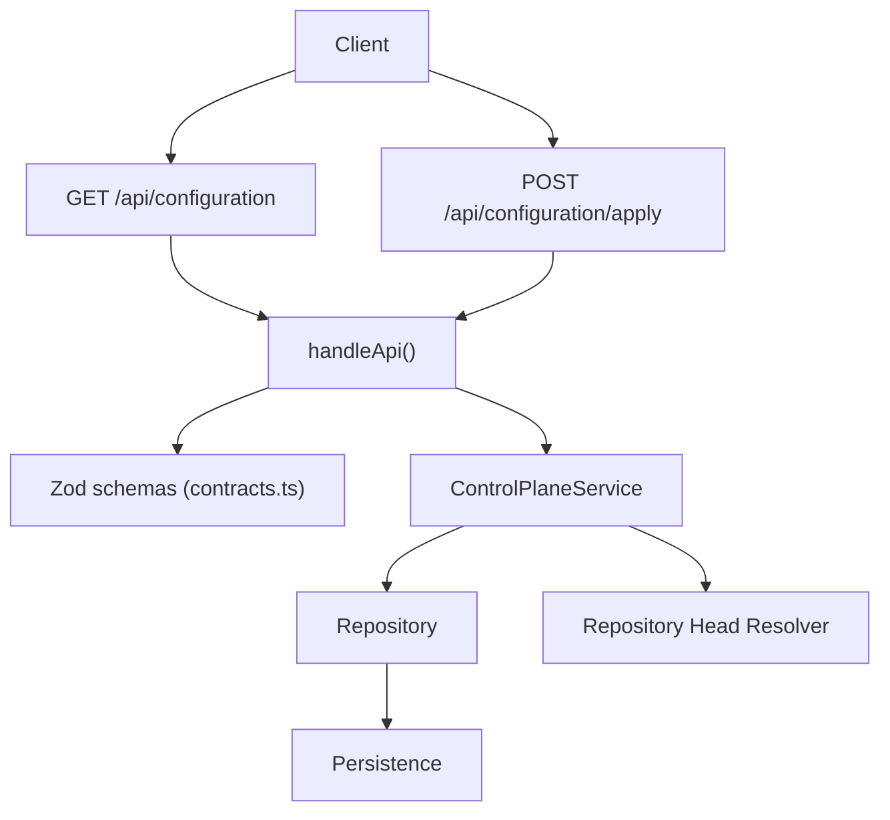
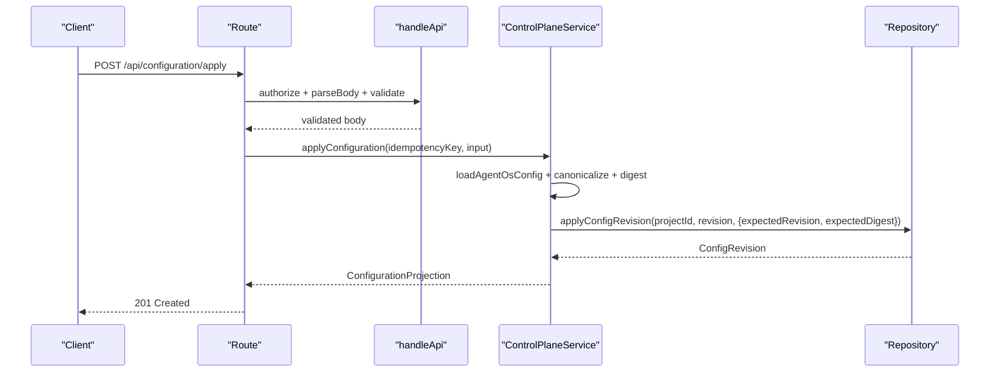
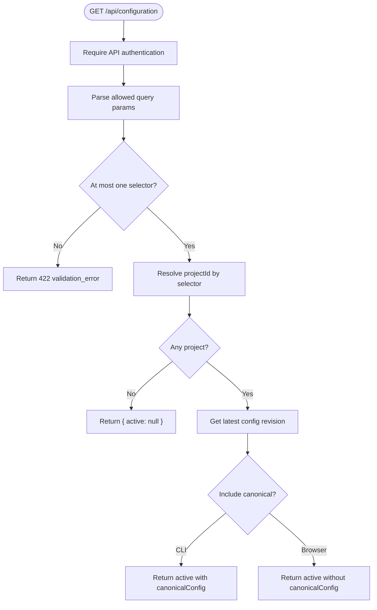
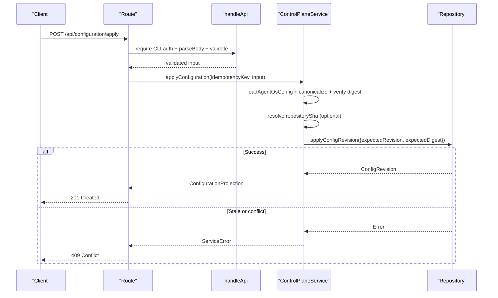
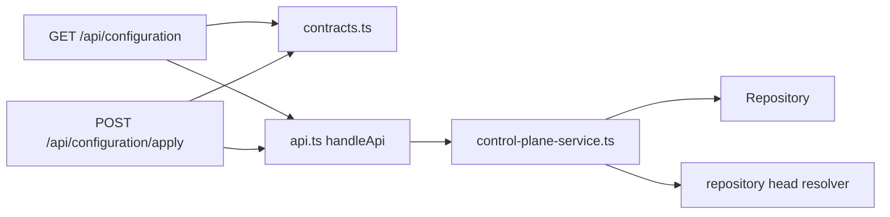

# Configuration API

<cite>
**Referenced Files in This Document**
- [route.ts](file://apps/control-plane/app/api/configuration/route.ts)
- [apply-route.ts](file://apps/control-plane/app/api/configuration/apply/route.ts)
- [contracts.ts](file://apps/control-plane/src/http/contracts.ts)
- [api.ts](file://apps/control-plane/src/http/api.ts)
- [control-plane-service.ts](file://apps/control-plane/src/application/control-plane-service.ts)
- [runtime.ts](file://apps/control-plane/src/application/runtime.ts)
- [configuration-loader.ts](file://apps/control-plane/src/config/configuration-loader.ts)
- [example.yaml](file://agentos/example.yaml)
- [agent-os.yaml](file://agentos/agent-os.yaml)
- [configuration-route.test.ts](file://apps/control-plane/src/http/configuration-route.test.ts)
</cite>

## Table of Contents
1. [Introduction](#introduction)
2. [Project Structure](#project-structure)
3. [Core Components](#core-components)
4. [Architecture Overview](#architecture-overview)
5. [Detailed Component Analysis](#detailed-component-analysis)
6. [Dependency Analysis](#dependency-analysis)
7. [Performance Considerations](#performance-considerations)
8. [Troubleshooting Guide](#troubleshooting-guide)
9. [Conclusion](#conclusion)
10. [Appendices](#appendices)

## Introduction
This document describes the Configuration API for managing Agent OS system configuration. It covers:
- Reading current active configuration per project or binding
- Applying new configuration with validation, idempotency, and optimistic concurrency
- Querying and scoping by project identity
- Versioning, policy enforcement, and environment-specific settings
- Best practices, migration strategies, and troubleshooting

The API is implemented as Next.js server routes backed by a control plane service that persists configuration revisions and enforces schema and policy constraints.

## Project Structure
Configuration endpoints are exposed under /api/configuration and /api/configuration/apply. The request flow goes through an HTTP handler that performs authentication, body parsing, schema validation, and output projection. The core logic lives in the control plane service, which interacts with persistence and optional repository head resolution.

**Diagram sources**
- [route.ts:11-49](file://apps/control-plane/app/api/configuration/route.ts#L11-L49)
- [apply-route.ts:11-29](file://apps/control-plane/app/api/configuration/apply/route.ts#L11-L29)
- [api.ts:93-129](file://apps/control-plane/src/http/api.ts#L93-L129)
- [contracts.ts:56-120](file://apps/control-plane/src/http/contracts.ts#L56-L120)
- [control-plane-service.ts:867-1037](file://apps/control-plane/src/application/control-plane-service.ts#L867-L1037)
- [runtime.ts:573-625](file://apps/control-plane/src/application/runtime.ts#L573-L625)

**Section sources**
- [route.ts:11-49](file://apps/control-plane/app/api/configuration/route.ts#L11-L49)
- [apply-route.ts:11-29](file://apps/control-plane/app/api/configuration/apply/route.ts#L11-L29)
- [api.ts:93-129](file://apps/control-plane/src/http/api.ts#L93-L129)
- [contracts.ts:56-120](file://apps/control-plane/src/http/contracts.ts#L56-L120)
- [control-plane-service.ts:867-1037](file://apps/control-plane/src/application/control-plane-service.ts#L867-L1037)
- [runtime.ts:573-625](file://apps/control-plane/src/application/runtime.ts#L573-L625)

## Core Components
- GET /api/configuration
  - Purpose: Read the active configuration for a project or binding.
  - Authentication: Requires API authentication; CLI auth includes canonical config in response. Browser sessions return a safe projection without canonicalConfig.
  - Query parameters: projectId, repository, localPath, name (at most one).
  - Response: Active configuration projection with provenance and optional canonicalConfig when authorized.

- POST /api/configuration/apply
  - Purpose: Apply a new configuration revision with validation, idempotency, and optimistic concurrency.
  - Authentication: Requires CLI authentication only.
  - Idempotency: Required via Idempotency-Key header.
  - Request body: Canonical configuration JSON string, its digest, and optional expectedRevision/expectedDigest for optimistic locking.
  - Response: Applied configuration projection with provenance and revision metadata.

- Configuration versioning and scoping
  - Each project has a binding key derived from repository URL, local path, or project name.
  - Revisions are persisted with increasing numeric revision numbers and digests for models, prompts, environments, policies, and repository SHA.

**Section sources**
- [route.ts:11-49](file://apps/control-plane/app/api/configuration/route.ts#L11-L49)
- [apply-route.ts:11-29](file://apps/control-plane/app/api/configuration/apply/route.ts#L11-L29)
- [contracts.ts:56-120](file://apps/control-plane/src/http/contracts.ts#L56-L120)
- [control-plane-service.ts:703-762](file://apps/control-plane/src/application/control-plane-service.ts#L703-L762)
- [control-plane-service.ts:867-1037](file://apps/control-plane/src/application/control-plane-service.ts#L867-L1037)

## Architecture Overview
The API uses a layered approach:
- Routes define endpoints and select authorization and schemas.
- handleApi centralizes body parsing, size limits, schema validation, and error mapping.
- ControlPlaneService implements business rules: canonicalization, digest verification, idempotency, optimistic concurrency, and policy digest computation.
- Optional repository head resolver binds configurations to repository commits for trusted workflows.

**Diagram sources**
- [apply-route.ts:11-29](file://apps/control-plane/app/api/configuration/apply/route.ts#L11-L29)
- [api.ts:93-129](file://apps/control-plane/src/http/api.ts#L93-L129)
- [control-plane-service.ts:904-1037](file://apps/control-plane/src/application/control-plane-service.ts#L904-L1037)

## Detailed Component Analysis

### GET /api/configuration
- Method: GET
- URL: /api/configuration
- Query parameters:
  - projectId: string identifier (optional)
  - repository: full repository URL (optional)
  - localPath: absolute path starting with "/" (optional)
  - name: project name (optional)
  - Constraint: at most one selector may be provided; if multiple projects exist without a selector, a 400 error is returned.
- Authentication:
  - API authentication required.
  - If authenticated as CLI, response includes canonicalConfig; otherwise, canonicalConfig is omitted for safety.
- Response schema:
  - active: null or ConfigurationProjection
  - projectId: string (when resolved)
- Error codes:
  - 401: Unauthorized
  - 400: project_required when ambiguous
  - 422: query parameter validation errors

**Diagram sources**
- [route.ts:11-49](file://apps/control-plane/app/api/configuration/route.ts#L11-L49)
- [contracts.ts:109-120](file://apps/control-plane/src/http/contracts.ts#L109-L120)
- [control-plane-service.ts:867-884](file://apps/control-plane/src/application/control-plane-service.ts#L867-L884)

**Section sources**
- [route.ts:11-49](file://apps/control-plane/app/api/configuration/route.ts#L11-L49)
- [contracts.ts:109-120](file://apps/control-plane/src/http/contracts.ts#L109-L120)
- [control-plane-service.ts:867-884](file://apps/control-plane/src/application/control-plane-service.ts#L867-L884)

### POST /api/configuration/apply
- Method: POST
- URL: /api/configuration/apply
- Headers:
  - Authorization: Bearer token for CLI authentication
  - Content-Type: application/json
  - Idempotency-Key: required unique key for retries
- Request body schema:
  - canonicalConfig: string (UTF-8 bytes must not exceed MAX_CANONICAL_CONFIG_BYTES)
  - digest: 64-character hex string matching the canonical configuration
  - expectedRevision: positive integer or null
  - expectedDigest: 64-character hex string or null
  - projectId: optional string identifier
  - Validation rules:
    - expectedRevision and expectedDigest must both be null or both non-null
    - Body size limited to MAX_CONFIGURATION_APPLY_BODY_BYTES
- Response schema:
  - canonicalConfig: string (only when requested by CLI)
  - projectId: string
  - digest: 64-character hex string
  - revision: positive integer
  - appliedAt: ISO timestamp
  - provenance: object containing repositorySha, configDigest, modelDigest, promptDigest, environmentDigest, policyDigest
- Status codes:
  - 201 Created on success
  - 400 Bad Request if Idempotency-Key missing or invalid
  - 401 Unauthorized if not CLI authenticated
  - 409 Conflict for idempotency conflicts or stale configuration
  - 422 Unprocessable Entity for validation or schema errors
  - 503 Service Unavailable if repository head resolution fails

**Diagram sources**
- [apply-route.ts:11-29](file://apps/control-plane/app/api/configuration/apply/route.ts#L11-L29)
- [api.ts:93-129](file://apps/control-plane/src/http/api.ts#L93-L129)
- [control-plane-service.ts:904-1037](file://apps/control-plane/src/application/control-plane-service.ts#L904-L1037)

**Section sources**
- [apply-route.ts:11-29](file://apps/control-plane/app/api/configuration/apply/route.ts#L11-L29)
- [contracts.ts:56-101](file://apps/control-plane/src/http/contracts.ts#L56-L101)
- [api.ts:93-129](file://apps/control-plane/src/http/api.ts#L93-L129)
- [control-plane-service.ts:904-1037](file://apps/control-plane/src/application/control-plane-service.ts#L904-L1037)

### Configuration Schema and Validation
- Input validation:
  - Zod schemas enforce field types, lengths, formats, and cross-field constraints.
  - canonicalConfig must be valid UTF-8 within byte limits.
  - digest must match the canonical configuration exactly.
  - expectedRevision/expectedDigest must be consistent (both null or both set).
- Output validation:
  - Responses are validated against output schemas before being sent.
- Query parameter validation:
  - Only whitelisted query parameters are accepted; unknown keys cause validation errors.

**Section sources**
- [contracts.ts:56-120](file://apps/control-plane/src/http/contracts.ts#L56-L120)
- [api.ts:28-91](file://apps/control-plane/src/http/api.ts#L28-L91)

### Policy Enforcement and Provenance
- Policy digest:
  - Computed from normalized publication policy snapshot including protectedPaths, file size limits, binary/symlink allowances, and tool/MCP allow/deny lists.
- Model, prompt, environment digests:
  - Fingerprinted from their respective configuration sections to ensure immutability and reproducibility.
- Repository SHA binding:
  - When workflow dispatch is enabled, repository head resolution binds configuration to a commit SHA for trust and auditability.

**Section sources**
- [control-plane-service.ts:214-244](file://apps/control-plane/src/application/control-plane-service.ts#L214-L244)
- [runtime.ts:573-625](file://apps/control-plane/src/application/runtime.ts#L573-L625)

### Environment-Specific Settings
- Configuration files support environment variables and runtime providers.
- Example configurations demonstrate models, agents, environments, pipelines, policies, budgets, goals, and runtime provider settings.
- Loader metadata can include counts of models, agents, environments, pipelines, and steps for diagnostics.

**Section sources**
- [example.yaml:1-73](file://agentos/example.yaml#L1-L73)
- [agent-os.yaml:1-61](file://agentos/agent-os.yaml#L1-L61)
- [configuration-loader.ts:34-82](file://apps/control-plane/src/config/configuration-loader.ts#L34-L82)

## Dependency Analysis
- Route dependencies:
  - GET route depends on contracts for query and output schemas and requires API authentication.
  - POST route depends on contracts for input/output schemas and requires CLI authentication.
- Service dependencies:
  - ControlPlaneService depends on repository for persistence and optional repository head resolver for commit binding.
  - Digests and canonicalization rely on core utilities for deterministic representation and hashing.
- HTTP layer:
  - handleApi centralizes parsing, size limits, and error mapping, ensuring consistent behavior across endpoints.

**Diagram sources**
- [route.ts:11-49](file://apps/control-plane/app/api/configuration/route.ts#L11-L49)
- [apply-route.ts:11-29](file://apps/control-plane/app/api/configuration/apply/route.ts#L11-L29)
- [api.ts:93-129](file://apps/control-plane/src/http/api.ts#L93-L129)
- [control-plane-service.ts:867-1037](file://apps/control-plane/src/application/control-plane-service.ts#L867-L1037)

**Section sources**
- [route.ts:11-49](file://apps/control-plane/app/api/configuration/route.ts#L11-L49)
- [apply-route.ts:11-29](file://apps/control-plane/app/api/configuration/apply/route.ts#L11-L29)
- [api.ts:93-129](file://apps/control-plane/src/http/api.ts#L93-L129)
- [control-plane-service.ts:867-1037](file://apps/control-plane/src/application/control-plane-service.ts#L867-L1037)

## Performance Considerations
- Body size limits:
  - Default API limit is 64 KB; configuration apply uses a higher limit aligned with canonical configuration maximums.
- Streaming parsing:
  - Request bodies are streamed and checked incrementally to prevent oversized payloads.
- Concurrency:
  - Inbox and digest operations use bounded concurrency to avoid database saturation; configuration apply relies on optimistic concurrency to minimize contention.

[No sources needed since this section provides general guidance]

## Troubleshooting Guide
Common errors and resolutions:
- 400 Bad Request:
  - Missing or invalid Idempotency-Key header on apply requests.
  - Ambiguous GET without a selector when multiple projects exist.
- 401 Unauthorized:
  - GET requires API authentication; apply requires CLI authentication.
- 409 Conflict:
  - Idempotency key used with a different configuration.
  - Stale configuration detected via expectedRevision/expectedDigest mismatch.
- 422 Unprocessable Entity:
  - Validation errors in request body or query parameters.
  - Canonical configuration exceeds byte limits or does not match digest.
- 503 Service Unavailable:
  - Repository head resolution unavailable or invalid commit SHA.

Rollback procedures:
- Use expectedRevision and expectedDigest to enforce optimistic concurrency and detect changes.
- To revert, re-apply the previous known-good configuration with its original digest and appropriate preconditions.

Best practices:
- Always compute canonicalConfig using the provided canonicalization utility and include the matching digest.
- Use unique Idempotency-Key values per intended operation to safely retry.
- Scope GET requests with projectId or binding selectors to avoid ambiguity.
- Keep configuration minimal and structured; leverage policies to protect sensitive paths and resources.

**Section sources**
- [contracts.ts:362-408](file://apps/control-plane/src/http/contracts.ts#L362-L408)
- [api.ts:28-91](file://apps/control-plane/src/http/api.ts#L28-L91)
- [control-plane-service.ts:904-1037](file://apps/control-plane/src/application/control-plane-service.ts#L904-L1037)
- [configuration-route.test.ts:213-349](file://apps/control-plane/src/http/configuration-route.test.ts#L213-L349)

## Conclusion
The Configuration API provides a robust, validated, and secure mechanism for reading and applying Agent OS system configuration. It enforces schema constraints, ensures canonical integrity, supports idempotent operations, and maintains versioned revisions with comprehensive provenance. By following best practices and leveraging optimistic concurrency, teams can manage configuration changes reliably across environments.

[No sources needed since this section summarizes without analyzing specific files]

## Appendices

### Endpoint Summary
- GET /api/configuration
  - Reads active configuration for a project or binding
  - Supports query selectors: projectId, repository, localPath, name
  - Returns active projection with optional canonicalConfig for CLI
- POST /api/configuration/apply
  - Applies a new configuration revision
  - Requires Idempotency-Key header
  - Validates canonicalConfig and digest
  - Enforces optimistic concurrency via expectedRevision/expectedDigest
  - Returns applied projection with provenance and revision metadata

**Section sources**
- [route.ts:11-49](file://apps/control-plane/app/api/configuration/route.ts#L11-L49)
- [apply-route.ts:11-29](file://apps/control-plane/app/api/configuration/apply/route.ts#L11-L29)
- [contracts.ts:56-120](file://apps/control-plane/src/http/contracts.ts#L56-L120)

### Example Configuration Objects
- See example.yaml and agent-os.yaml for complete configuration structures including models, agents, environments, pipelines, policies, budgets, goals, and runtime settings.

**Section sources**
- [example.yaml:1-73](file://agentos/example.yaml#L1-L73)
- [agent-os.yaml:1-61](file://agentos/agent-os.yaml#L1-L61)