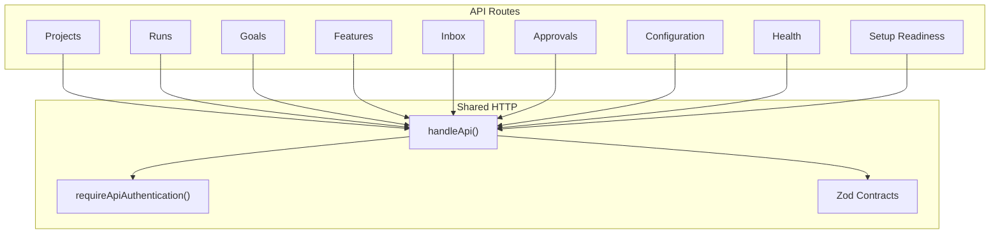
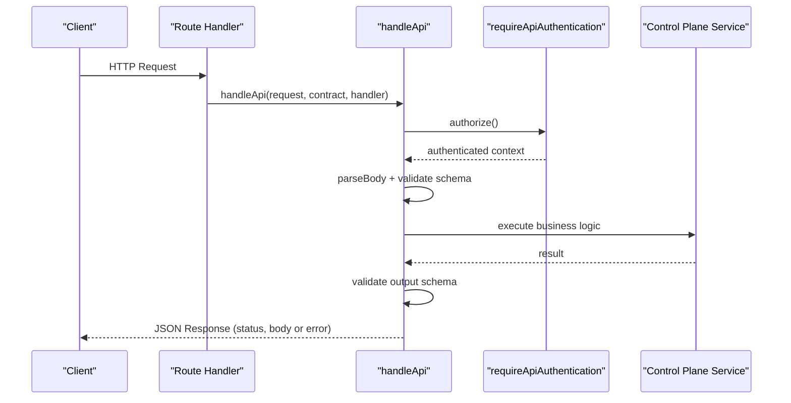
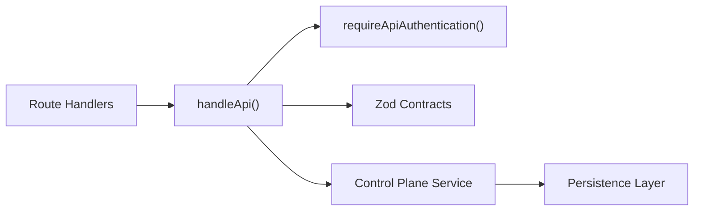

# Control Plane API

<cite>
**Referenced Files in This Document**
- [api.ts](file://apps/control-plane/src/http/api.ts)
- [contracts.ts](file://apps/control-plane/src/http/contracts.ts)
- [authenticated.ts](file://apps/control-plane/src/http/authenticated.ts)
- [projects route.ts](file://apps/control-plane/app/api/projects/route.ts)
- [project detail route.ts](file://apps/control-plane/app/api/projects/[id]/route.ts)
- [runs list route.ts](file://apps/control-plane/app/api/runs/route.ts)
- [run detail route.ts](file://apps/control-plane/app/api/runs/[id]/route.ts)
- [run cancel route.ts](file://apps/control-plane/app/api/runs/[id]/cancel/route.ts)
- [goals route.ts](file://apps/control-plane/app/api/goals/route.ts)
- [features route.ts](file://apps/control-plane/app/api/features/route.ts)
- [inbox route.ts](file://apps/control-plane/app/api/inbox/route.ts)
- [approval approve route.ts](file://apps/control-plane/app/api/approvals/[id]/approve/route.ts)
- [configuration route.ts](file://apps/control-plane/app/api/configuration/route.ts)
- [health route.ts](file://apps/control-plane/app/api/health/route.ts)
- [setup readiness route.ts](file://apps/control-plane/app/api/setup/readiness/route.ts)
</cite>

## Table of Contents
1. Introduction
2. Project Structure
3. Core Components
4. Architecture Overview
5. Detailed Component Analysis
6. Dependency Analysis
7. Performance Considerations
8. Troubleshooting Guide
9. Conclusion
10. Appendices

## Introduction
This document provides comprehensive API documentation for the Agent OS Passerine Control Plane REST API. It covers authentication, project management, workflow execution (feature and goal runs), approval handling, configuration management, inbox, and monitoring endpoints. For each endpoint, you will find HTTP methods, URL patterns, request/response schemas, authentication requirements, error responses, and example calls. It also includes guidance on idempotency, rate limiting considerations, versioning strategy, client implementation patterns, performance tips, and security considerations.

## Project Structure
The Control Plane is implemented as a Next.js application with Route Handlers under apps/control-plane/app/api. Each resource has its own folder with route files defining HTTP methods. Shared HTTP infrastructure lives under apps/control-plane/src/http, including:
- A central handler that enforces authorization, body parsing, validation, output serialization, and error mapping
- Zod-based schema contracts for requests and responses
- Authentication helpers to enforce API access policies

**Diagram sources**
- [api.ts:93-129](file://apps/control-plane/src/http/api.ts#L93-L129)
- [authenticated.ts:4-7](file://apps/control-plane/src/http/authenticated.ts#L4-L7)
- [contracts.ts:130-323](file://apps/control-plane/src/http/contracts.ts#L130-L323)

**Section sources**
- [api.ts:93-129](file://apps/control-plane/src/http/api.ts#L93-L129)
- [authenticated.ts:4-7](file://apps/control-plane/src/http/authenticated.ts#L4-L7)
- [contracts.ts:130-323](file://apps/control-plane/src/http/contracts.ts#L130-L323)

## Core Components
- Central API handler: Enforces authorization, parses and validates request bodies, serializes outputs, and maps errors to consistent JSON error responses.
- Schema contracts: Define strict request and response shapes using Zod, ensuring type safety across the API surface.
- Authentication: Requires API authentication for protected routes; supports CLI-specific flows where needed.
- Idempotency: Mutations require an Idempotency-Key header to ensure safe retries.

Key behaviors:
- Body size limits are enforced to prevent oversized payloads.
- Query parameters are explicitly allowed per endpoint to avoid accidental parameter usage.
- Path identifiers are validated against a bounded pattern.

**Section sources**
- [api.ts:9-18](file://apps/control-plane/src/http/api.ts#L9-L18)
- [api.ts:28-91](file://apps/control-plane/src/http/api.ts#L28-L91)
- [api.ts:93-129](file://apps/control-plane/src/http/api.ts#L93-L129)
- [contracts.ts:362-408](file://apps/control-plane/src/http/contracts.ts#L362-L408)
- [authenticated.ts:4-17](file://apps/control-plane/src/http/authenticated.ts#L4-L17)

## Architecture Overview
All protected endpoints follow a consistent flow:
1. The route invokes handleApi with an authorization function, optional body schema, output schema, and success status.
2. Authorization is performed first via requireApiAuthentication.
3. Request body is parsed and validated against the provided schema with size checks.
4. The business handler executes and returns data.
5. Output is validated against the output schema and serialized into a JSON response.
6. Errors are normalized into a standard error envelope with code, message, and HTTP status.

**Diagram sources**
- [api.ts:93-129](file://apps/control-plane/src/http/api.ts#L93-L129)
- [authenticated.ts:4-7](file://apps/control-plane/src/http/authenticated.ts#L4-L7)

## Detailed Component Analysis

### Authentication
- All protected endpoints require API authentication via the Authorization header.
- Some endpoints support CLI-only flows by checking the authentication kind.

Endpoints requiring authentication:
- Projects, Runs, Goals, Features, Inbox, Approvals, Configuration, Setup Readiness

Public endpoints:
- Health check

Error codes from authentication failures:
- 401 Unauthorized
- 403 Forbidden (e.g., CLI-only endpoint accessed without CLI auth)

Example call:
- GET /api/health
  - No authentication required
  - Response: { "status": "ok" }

**Section sources**
- [authenticated.ts:4-17](file://apps/control-plane/src/http/authenticated.ts#L4-L17)
- [health route.ts:1-6](file://apps/control-plane/app/api/health/route.ts#L1-L6)

### Projects
- List projects
  - Method: GET
  - URL: /api/projects
  - Auth: Required
  - Response: Array of project summaries
  - Example:
    - GET /api/projects
    - Headers: Authorization: Bearer <token>
    - Response: [{ id, name, binding, runCount, updatedAt, ... }]

- Get project detail
  - Method: GET
  - URL: /api/projects/{id}
  - Auth: Required
  - Path param: id (bounded identifier)
  - Response: Project detail including recent runs and budget fields
  - Example:
    - GET /api/projects/proj_123
    - Response: { id, name, ..., recentRuns: [...] }

**Section sources**
- [projects route.ts:9-18](file://apps/control-plane/app/api/projects/route.ts#L9-L18)
- [project detail route.ts:10-25](file://apps/control-plane/app/api/projects/[id]/route.ts#L10-L25)
- [contracts.ts:265-292](file://apps/control-plane/src/http/contracts.ts#L265-L292)

### Runs
- List runs
  - Method: GET
  - URL: /api/runs
  - Auth: Required
  - Query params: projectId (optional, bounded)
  - Response: Array of run projections
  - Example:
    - GET /api/runs?projectId=proj_123
    - Response: [{ id, pipeline, status, createdAt, ... }]

- Get run detail
  - Method: GET
  - URL: /api/runs/{id}
  - Auth: Required
  - Path param: id (bounded)
  - Response: Run projection with steps and timeline
  - Example:
    - GET /api/runs/run_456
    - Response: { id, pipeline, status, steps: [...], timeline: [...] }

- Cancel run
  - Method: POST
  - URL: /api/runs/{id}/cancel
  - Auth: Required
  - Headers: Idempotency-Key (required)
  - Response: Updated run projection
  - Example:
    - POST /api/runs/run_456/cancel
    - Headers: Idempotency-Key: unique-key-123
    - Response: { id, status: "cancelled", ... }

**Section sources**
- [runs list route.ts:13-29](file://apps/control-plane/app/api/runs/route.ts#L13-L29)
- [run detail route.ts:9-24](file://apps/control-plane/app/api/runs/[id]/route.ts#L9-L24)
- [run cancel route.ts:11-30](file://apps/control-plane/app/api/runs/[id]/cancel/route.ts#L11-L30)
- [contracts.ts:130-263](file://apps/control-plane/src/http/contracts.ts#L130-L263)
- [contracts.ts:362-382](file://apps/control-plane/src/http/contracts.ts#L362-L382)

### Goals
- Create goal run
  - Method: POST
  - URL: /api/goals
  - Auth: Required
  - Headers: Idempotency-Key (required)
  - Request body: createGoalRunSchema (includes criteria array)
  - Response: Run projection (201 Created)
  - Example:
    - POST /api/goals
    - Headers: Idempotency-Key: goal-idem-1
    - Body: { projectId, title, description, repositorySha, configDigest, modelDigest, promptDigest, environmentDigest, policyDigest, criteria: [{ id, type: "command", description, command }] }
    - Response: { id, pipeline, status: "pending", ... }

Notes:
- Criteria IDs must be unique within the request.
- Max 20 criteria per request.

**Section sources**
- [goals route.ts:10-34](file://apps/control-plane/app/api/goals/route.ts#L10-L34)
- [contracts.ts:14-52](file://apps/control-plane/src/http/contracts.ts#L14-L52)
- [contracts.ts:130-263](file://apps/control-plane/src/http/contracts.ts#L130-L263)

### Features
- Create feature run
  - Method: POST
  - URL: /api/features
  - Auth: Required
  - Headers: Idempotency-Key (required)
  - Request body: createRunSchema
  - Response: Run projection (201 Created)
  - Example:
    - POST /api/features
    - Headers: Idempotency-Key: feat-idem-1
    - Body: { projectId, title, description, repositorySha, configDigest, modelDigest, promptDigest, environmentDigest, policyDigest }
    - Response: { id, pipeline, status: "pending", ... }

**Section sources**
- [features route.ts:10-26](file://apps/control-plane/app/api/features/route.ts#L10-L26)
- [contracts.ts:14-26](file://apps/control-plane/src/http/contracts.ts#L14-L26)
- [contracts.ts:130-263](file://apps/control-plane/src/http/contracts.ts#L130-L263)

### Inbox
- List inbox messages and pending approvals
  - Method: GET
  - URL: /api/inbox
  - Auth: Required
  - Query params: projectId (optional, bounded)
  - Response: { messages: [...], approvals: [...] }
  - Example:
    - GET /api/inbox?projectId=proj_123
    - Response: { messages: [{ id, runId, status, body, ... }], approvals: [{ id, runId, scopeHash, status, ... }] }

**Section sources**
- [inbox route.ts:11-32](file://apps/control-plane/app/api/inbox/route.ts#L11-L32)
- [contracts.ts:325-360](file://apps/control-plane/src/http/contracts.ts#L325-L360)

### Approvals
- Approve an approval
  - Method: POST
  - URL: /api/approvals/{id}/approve
  - Auth: Required
  - Headers: Idempotency-Key (required)
  - Request body: { scopeHash }
  - Response: Approval object
  - Example:
    - POST /api/approvals/appr_789/approve
    - Headers: Idempotency-Key: appr-idem-1
    - Body: { scopeHash: "abc123..." }
    - Response: { id, runId, scopeHash, status: "consumed", ... }

Note:
- Reject endpoint exists in the file structure but is not included here due to lack of source content.

**Section sources**
- [approval approve route.ts:11-32](file://apps/control-plane/app/api/approvals/[id]/approve/route.ts#L11-L32)
- [contracts.ts:294-323](file://apps/control-plane/src/http/contracts.ts#L294-L323)
- [contracts.ts:362-371](file://apps/control-plane/src/http/contracts.ts#L362-L371)

### Configuration
- Get active configuration
  - Method: GET
  - URL: /api/configuration
  - Auth: Required
  - Query params: One of projectId, repository, localPath, name (mutually exclusive)
  - Response: { active: {...} | null, projectId? }
  - Example:
    - GET /api/configuration?projectId=proj_123
    - Response: { active: { canonicalConfig?, projectId, digest, revision, appliedAt, provenance }, projectId }

Notes:
- CLI clients may receive additional fields depending on authentication kind.

**Section sources**
- [configuration route.ts:11-49](file://apps/control-plane/app/api/configuration/route.ts#L11-L49)
- [contracts.ts:56-120](file://apps/control-plane/src/http/contracts.ts#L56-L120)

### Monitoring and Readiness
- Health check
  - Method: GET
  - URL: /api/health
  - Auth: Not required
  - Response: { status: "ok" }

- Setup readiness
  - Method: GET
  - URL: /api/setup/readiness
  - Auth: Required
  - Response: Readiness information based on environment setup

**Section sources**
- [health route.ts:1-6](file://apps/control-plane/app/api/health/route.ts#L1-L6)
- [setup readiness route.ts:10-16](file://apps/control-plane/app/api/setup/readiness/route.ts#L10-L16)

## Dependency Analysis
The API layer depends on:
- Authentication guard for verifying requests
- Zod schemas for input/output validation
- Control plane service for business logic

**Diagram sources**
- [api.ts:93-129](file://apps/control-plane/src/http/api.ts#L93-L129)
- [authenticated.ts:4-7](file://apps/control-plane/src/http/authenticated.ts#L4-L7)
- [contracts.ts:130-323](file://apps/control-plane/src/http/contracts.ts#L130-L323)

**Section sources**
- [api.ts:93-129](file://apps/control-plane/src/http/api.ts#L93-L129)
- [authenticated.ts:4-7](file://apps/control-plane/src/http/authenticated.ts#L4-L7)
- [contracts.ts:130-323](file://apps/control-plane/src/http/contracts.ts#L130-L323)

## Performance Considerations
- Use Idempotency-Key headers on all mutating requests to safely retry without side effects.
- Keep request bodies small; payload size is enforced to prevent large uploads.
- Prefer filtering by projectId where supported to reduce response sizes.
- Batch operations at the client level when possible to minimize round trips.
- Cache read-only resources like project lists and configurations on the client if appropriate.

[No sources needed since this section provides general guidance]

## Troubleshooting Guide
Common error responses:
- 400 Bad Request: Invalid JSON or missing required headers (e.g., Idempotency-Key)
- 401 Unauthorized: Missing or invalid authentication
- 403 Forbidden: Insufficient permissions (e.g., CLI-only endpoint)
- 405 Method Not Allowed: Unsupported HTTP method on an endpoint
- 413 Payload Too Large: Request body exceeds configured limit
- 422 Validation Error: Invalid query parameters or request body does not match schema
- 500 Internal Server Error: Unexpected server-side error

Error envelope:
- { error: { code: string, message: string } }

Guidance:
- Check the error code to determine the cause.
- Ensure Idempotency-Key is present for mutations.
- Validate query parameters against allowed sets.
- Confirm path identifiers match the bounded pattern.

**Section sources**
- [api.ts:20-26](file://apps/control-plane/src/http/api.ts#L20-L26)
- [api.ts:28-91](file://apps/control-plane/src/http/api.ts#L28-L91)
- [api.ts:115-129](file://apps/control-plane/src/http/api.ts#L115-L129)
- [contracts.ts:362-408](file://apps/control-plane/src/http/contracts.ts#L362-L408)

## Conclusion
The Control Plane API provides a secure, validated, and consistent interface for managing projects, runs, goals, features, approvals, configuration, and inbox. By following the documented authentication, idempotency, and validation rules, clients can reliably interact with the system. Use health and readiness endpoints for operational monitoring and adopt caching and batching strategies for optimal performance.

[No sources needed since this section summarizes without analyzing specific files]

## Appendices

### Endpoint Reference Summary
- Health
  - GET /api/health
- Projects
  - GET /api/projects
  - GET /api/projects/{id}
- Runs
  - GET /api/runs?projectId={id}
  - GET /api/runs/{id}
  - POST /api/runs/{id}/cancel (Idempotency-Key required)
- Goals
  - POST /api/goals (Idempotency-Key required)
- Features
  - POST /api/features (Idempotency-Key required)
- Inbox
  - GET /api/inbox?projectId={id}
- Approvals
  - POST /api/approvals/{id}/approve (Idempotency-Key required)
- Configuration
  - GET /api/configuration?{projectId|repository|localPath|name}
- Setup Readiness
  - GET /api/setup/readiness

[No sources needed since this section aggregates previously analyzed endpoints]

### Security and Authentication Flow
- All protected endpoints require API authentication.
- CLI-only endpoints enforce CLI authentication kind.
- Idempotency-Key header is mandatory for mutations to ensure safe retries.
- Input validation is enforced via Zod schemas for both request bodies and outputs.
- Path identifiers are validated against a bounded pattern to prevent injection.

**Section sources**
- [authenticated.ts:4-17](file://apps/control-plane/src/http/authenticated.ts#L4-L17)
- [contracts.ts:362-382](file://apps/control-plane/src/http/contracts.ts#L362-L382)
- [api.ts:93-129](file://apps/control-plane/src/http/api.ts#L93-L129)

### Rate Limiting and Versioning
- Rate limiting: Not explicitly defined in the analyzed routes; implement at the gateway or platform layer if needed.
- Versioning: Not visible in route paths; consider prefixing future versions (e.g., /api/v1/) at the platform level.

[No sources needed since this section provides general guidance]

### WebSocket Connections
- No WebSocket endpoints were identified in the analyzed routes. Real-time updates should be implemented via polling or server-sent events if required.

[No sources needed since this section provides general guidance]

### Client Implementation Guidelines
- Always include Authorization header for protected endpoints.
- Include Idempotency-Key on all mutating requests.
- Handle standardized error envelopes and retry only idempotent operations.
- Respect query parameter constraints and path identifier formats.
- Cache read-only data appropriately and refresh on changes.

**Section sources**
- [contracts.ts:362-408](file://apps/control-plane/src/http/contracts.ts#L362-L408)
- [api.ts:93-129](file://apps/control-plane/src/http/api.ts#L93-L129)