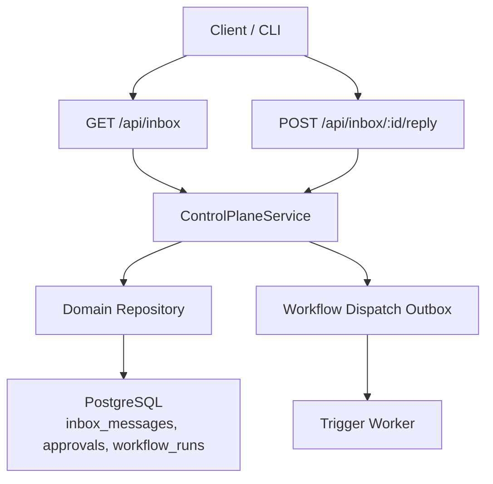
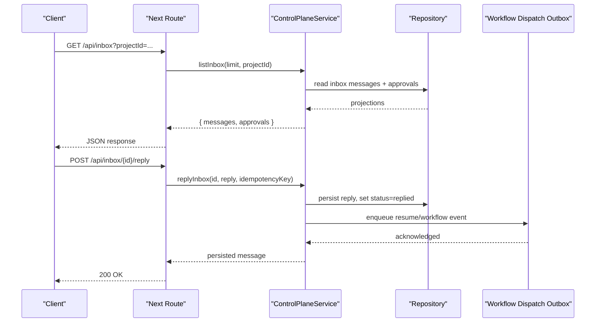
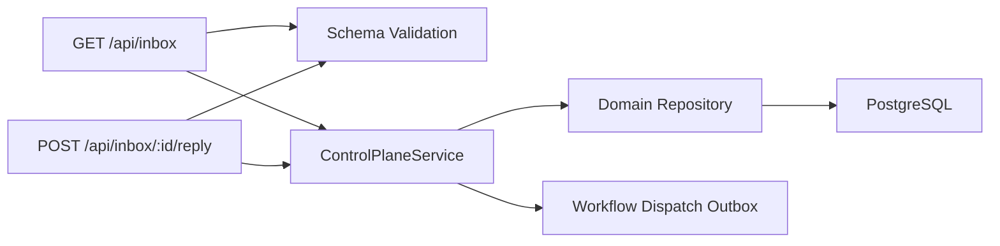

# Inbox API

<cite>
**Referenced Files in This Document**
- [route.ts](file://apps/control-plane/app/api/inbox/route.ts)
- [reply route.ts](file://apps/control-plane/app/api/inbox/[id]/reply/route.ts)
- [contracts.ts](file://apps/control-plane/src/http/contracts.ts)
- [control-plane-service.ts](file://apps/control-plane/src/application/control-plane-service.ts)
- [runtime.ts](file://apps/control-plane/src/application/runtime.ts)
- [inbox-view-model.ts](file://apps/control-plane/src/ui/inbox-view-model.ts)
- [mutation-forms.tsx](file://apps/control-plane/src/ui/mutation-forms.tsx)
- [domain persistence SQL](file://drizzle/0000_domain_persistence.sql)
</cite>

## Table of Contents
1. Introduction
2. Project Structure
3. Core Components
4. Architecture Overview
5. Detailed Component Analysis
6. Dependency Analysis
7. Performance Considerations
8. Troubleshooting Guide
9. Conclusion

## Introduction
This document specifies the Inbox API for Agent OS, a real-time messaging and notification surface used by workflows to request operator input and to notify operators about run outcomes. It covers:
- Listing inbox items (messages and pending approvals)
- Replying to messages
- Message threading and status transitions
- Persistence model and indexes
- Integration with workflow events and notifications
- Guidance for implementing custom notification handlers and message processing workflows

## Project Structure
The Inbox API is implemented as Next.js App Router routes under the control plane. Routes authenticate requests, validate inputs, and delegate to the Control Plane Service, which reads from and writes to the domain repository. The UI consumes these endpoints and renders threads, approval actions, and notifications.

**Diagram sources**
- [route.ts:11-32](file://apps/control-plane/app/api/inbox/route.ts#L11-L32)
- [reply route.ts:13-33](file://apps/control-plane/app/api/inbox/[id]/reply/route.ts#L13-L33)
- [control-plane-service.ts:669-701](file://apps/control-plane/src/application/control-plane-service.ts#L669-L701)
- [runtime.ts:573-625](file://apps/control-plane/src/application/runtime.ts#L573-L625)
- [domain persistence SQL:110-119](file://drizzle/0000_domain_persistence.sql#L110-L119)

**Section sources**
- [route.ts:11-32](file://apps/control-plane/app/api/inbox/route.ts#L11-L32)
- [reply route.ts:13-33](file://apps/control-plane/app/api/inbox/[id]/reply/route.ts#L13-L33)
- [contracts.ts:121-128](file://apps/control-plane/src/http/contracts.ts#L121-L128)
- [contracts.ts:325-360](file://apps/control-plane/src/http/contracts.ts#L325-L360)
- [domain persistence SQL:110-119](file://drizzle/0000_domain_persistence.sql#L110-L119)

## Core Components
- Inbox listing endpoint returns recent messages and pending approvals, optionally filtered by project.
- Reply endpoint accepts a reply payload for a specific message and persists it idempotently.
- Control Plane Service projects durable inbox records into safe, redacted shapes and composes inbox digests with concurrency limits.
- UI components render conversation threads, approval actions, and notifications, and drive client mutations that call the API.

**Section sources**
- [route.ts:11-32](file://apps/control-plane/app/api/inbox/route.ts#L11-L32)
- [reply route.ts:13-33](file://apps/control-plane/app/api/inbox/[id]/reply/route.ts#L13-L33)
- [control-plane-service.ts:246-317](file://apps/control-plane/src/application/control-plane-service.ts#L246-L317)
- [control-plane-service.ts:389-423](file://apps/control-plane/src/application/control-plane-service.ts#L389-L423)
- [inbox-view-model.ts:39-64](file://apps/control-plane/src/ui/inbox-view-model.ts#L39-L64)
- [mutation-forms.tsx:152-179](file://apps/control-plane/src/ui/mutation-forms.tsx#L152-L179)

## Architecture Overview
The Inbox API follows a layered design:
- HTTP layer: Next.js routes handle authentication, query parsing, and schema validation.
- Service layer: ControlPlaneService orchestrates data access, projection, and integration points.
- Persistence layer: Domain repository persists inbox messages, approvals, and runs; database indexes optimize queries.
- Workflow integration: Replies can trigger downstream workflow events via an outbox mechanism.

**Diagram sources**
- [route.ts:11-32](file://apps/control-plane/app/api/inbox/route.ts#L11-L32)
- [reply route.ts:13-33](file://apps/control-plane/app/api/inbox/[id]/reply/route.ts#L13-L33)
- [control-plane-service.ts:669-701](file://apps/control-plane/src/application/control-plane-service.ts#L669-L701)
- [runtime.ts:573-625](file://apps/control-plane/src/application/runtime.ts#L573-L625)

## Detailed Component Analysis

### Endpoint: List Inbox
- Method: GET
- Path: /api/inbox
- Query parameters:
  - projectId: optional, validated identifier
- Authentication: Required
- Request body: none
- Response schema:
  - messages: array of inbox message projections
  - approvals: array of approval projections
- Behavior:
  - Returns up to 50 recent messages and 50 pending approvals
  - Filters by projectId when provided
  - Projects inbox content safely (redaction, allowed fields)

Example response shape:
- messages: [{ id, runId, stepRunId?, status, body, reply?, createdAt, repliedAt? }]
- approvals: [{ id, runId, scopeHash, scopePreview, status, createdAt, expiresAt, consumedAt?, summary? }]

Notes:
- Body fields are restricted to text, question, message, answer, options
- Status values: pending, replied
- Approval statuses: pending, consumed, expired

**Section sources**
- [route.ts:11-32](file://apps/control-plane/app/api/inbox/route.ts#L11-L32)
- [contracts.ts:325-360](file://apps/control-plane/src/http/contracts.ts#L325-L360)
- [control-plane-service.ts:246-317](file://apps/control-plane/src/application/control-plane-service.ts#L246-L317)
- [control-plane-service.ts:389-423](file://apps/control-plane/src/application/control-plane-service.ts#L389-L423)

### Endpoint: Reply to Message
- Method: POST
- Path: /api/inbox/{id}/reply
- Path parameter:
  - id: validated inbox message identifier
- Headers:
  - Idempotency-Key: required, unique per reply attempt
- Request body:
  - reply: string or JSON object
- Response:
  - Updated inbox message projection
- Behavior:
  - Validates idempotency key
  - Persists reply only if message status is pending
  - Sets status to replied and records repliedAt
  - May enqueue workflow resume or event via outbox

Error handling:
- Missing or invalid Idempotency-Key header results in a 400 error
- Invalid path id results in a 422 error
- Attempting to reply to a non-pending message results in a conflict

**Section sources**
- [reply route.ts:13-33](file://apps/control-plane/app/api/inbox/[id]/reply/route.ts#L13-L33)
- [contracts.ts:121-128](file://apps/control-plane/src/http/contracts.ts#L121-L128)
- [contracts.ts:362-382](file://apps/control-plane/src/http/contracts.ts#L362-L382)

### Message Threading and Conversation Model
- Each inbox message represents one thread entry initiated by the agent
- A reply is stored alongside the original message and displayed as a second entry authored by the operator
- The UI constructs a conversation by combining the initial body and any reply
- Options may be included in the message body to guide replies

Conversation entries:
- author: agent or operator
- at: timestamp
- lines: extracted from message body fields

**Section sources**
- [inbox-view-model.ts:39-64](file://apps/control-plane/src/ui/inbox-view-model.ts#L39-L64)
- [inbox-view-model.ts:19-26](file://apps/control-plane/src/ui/inbox-view-model.ts#L19-L26)

### Notifications and Run Outcomes
- Notifications are synthesized from terminal run records and appear in the inbox as completed or failed entries
- They include outcome details such as draft pull request URLs and local branch information
- Spend totals may be included when available

Notification fields:
- runId, pipeline, title?, runStatus, resultStatus?, reason?, outcome?, totalCostUsd?, projectName?, completedAt

**Section sources**
- [control-plane-service.ts:292-317](file://apps/control-plane/src/application/control-plane-service.ts#L292-L317)
- [inbox-view-model.ts:66-93](file://apps/control-plane/src/ui/inbox-view-model.ts#L66-L93)

### Persistence Model and Indexes
- inbox_messages table stores id, run_id, step_run_id, status, body, reply, created_at, replied_at
- Foreign keys link to workflow_runs and step_runs
- Indexes optimize listing and filtering by run_id and status

Indexes:
- inbox_messages_pending_idx on (run_id, created_at, id) where status = 'pending'
- Additional indexes support efficient listing and ordering

**Section sources**
- [domain persistence SQL:110-119](file://drizzle/0000_domain_persistence.sql#L110-L119)
- [domain persistence SQL:201-202](file://drizzle/0000_domain_persistence.sql#L201-L202)
- [domain persistence SQL:212-212](file://drizzle/0000_domain_persistence.sql#L212-L212)

### Workflow Integration and Real-Time Updates
- Replies can trigger workflow resumption through the workflow dispatch outbox
- The runtime composes cancellation and event handling for managed and kimi providers
- Outbox ensures durable delivery of resume or cleanup intents

Integration points:
- WorkflowDispatchOutbox.requestApprovalResume
- WorkflowDispatchOutbox.requestStart
- Runtime event streaming and send/resume/cancel operations

**Section sources**
- [control-plane-service.ts:61-87](file://apps/control-plane/src/application/control-plane-service.ts#L61-L87)
- [runtime.ts:387-571](file://apps/control-plane/src/application/runtime.ts#L387-L571)
- [runtime.ts:573-625](file://apps/control-plane/src/application/runtime.ts#L573-L625)

### UI-Driven Mutations and Idempotency
- The UI posts replies with a generated Idempotency-Key header
- On success, the UI reloads to reflect updated state
- Failure messages differentiate between transient errors and permanent conflicts

**Section sources**
- [mutation-forms.tsx:29-54](file://apps/control-plane/src/ui/mutation-forms.tsx#L29-L54)
- [mutation-forms.tsx:152-179](file://apps/control-plane/src/ui/mutation-forms.tsx#L152-L179)

## Dependency Analysis

**Diagram sources**
- [route.ts:11-32](file://apps/control-plane/app/api/inbox/route.ts#L11-L32)
- [reply route.ts:13-33](file://apps/control-plane/app/api/inbox/[id]/reply/route.ts#L13-L33)
- [contracts.ts:121-128](file://apps/control-plane/src/http/contracts.ts#L121-L128)
- [control-plane-service.ts:669-701](file://apps/control-plane/src/application/control-plane-service.ts#L669-L701)

**Section sources**
- [route.ts:11-32](file://apps/control-plane/app/api/inbox/route.ts#L11-L32)
- [reply route.ts:13-33](file://apps/control-plane/app/api/inbox/[id]/reply/route.ts#L13-L33)
- [contracts.ts:121-128](file://apps/control-plane/src/http/contracts.ts#L121-L128)
- [control-plane-service.ts:669-701](file://apps/control-plane/src/application/control-plane-service.ts#L669-L701)

## Performance Considerations
- Inbox digest fan-out uses bounded concurrency to avoid overwhelming the database driver
- Indexes on inbox_messages support efficient listing and filtering
- Limiting list size to 50 reduces payload and query cost
- Redaction and safe projection minimize serialization overhead and protect sensitive data

[No sources needed since this section provides general guidance]

## Troubleshooting Guide
Common issues and resolutions:
- Missing Idempotency-Key header: Provide a unique key per reply attempt
- Invalid path identifier: Ensure the message id matches the allowed pattern
- Conflict when replying: Only pending messages can be replied to; check message status
- Stale approvals: Approvals may expire before decision; UI prevents impossible decisions based on expiry logic
- Database connection saturation: Inbox digest queries are concurrency-bounded; monitor load and adjust limits if necessary

**Section sources**
- [contracts.ts:362-382](file://apps/control-plane/src/http/contracts.ts#L362-L382)
- [control-plane-service.ts:356-387](file://apps/control-plane/src/application/control-plane-service.ts#L356-L387)
- [control-plane-service.ts:319-354](file://apps/control-plane/src/application/control-plane-service.ts#L319-L354)

## Conclusion
The Inbox API provides a secure, validated interface for retrieving messages, replying to them, and viewing approvals and notifications. Messages are persisted with robust indexing and projected safely for consumption. Replies integrate with workflow events to resume processes, while the UI offers a clear threading model and idempotent mutation flow. Use the schemas and patterns documented here to implement clients and custom notification handlers that align with Agent OS workflows.

[No sources needed since this section summarizes without analyzing specific files]