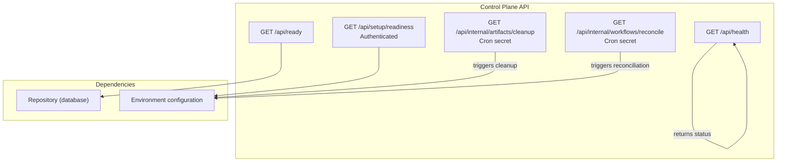
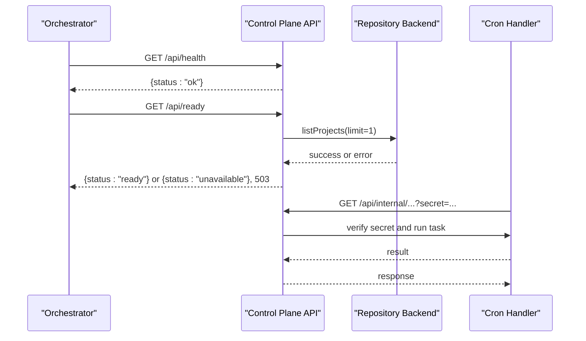
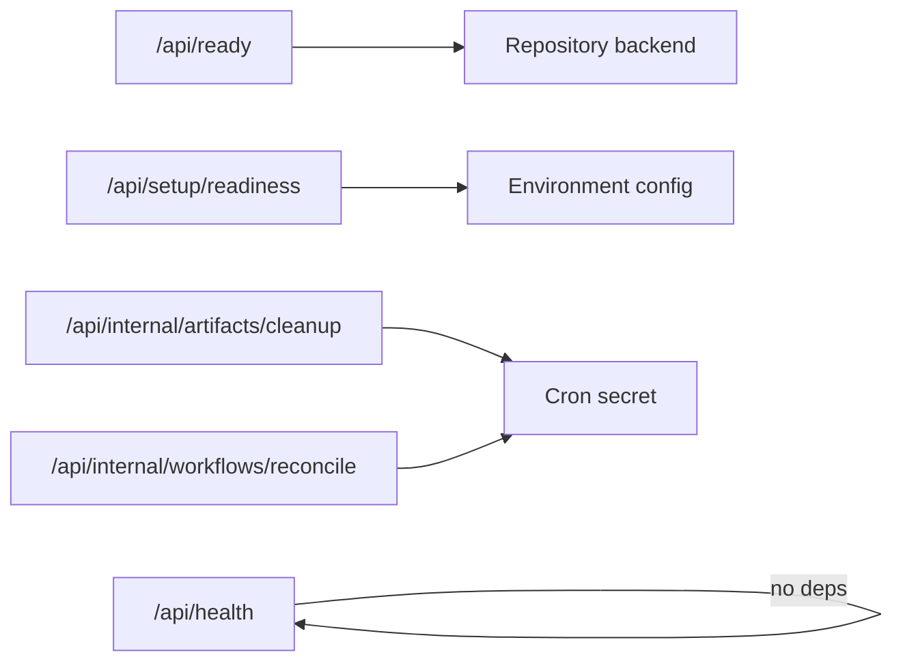

# Monitoring API

<cite>
**Referenced Files in This Document**
- [route.ts](file://apps/control-plane/app/api/health/route.ts)
- [route.ts](file://apps/control-plane/app/api/ready/route.ts)
- [route.ts](file://apps/control-plane/app/api/setup/readiness/route.ts)
- [setup-readiness.ts](file://apps/control-plane/src/application/setup-readiness.ts)
- [instrumentation.ts](file://apps/control-plane/instrumentation.ts)
- [route.ts](file://apps/control-plane/app/api/internal/artifacts/cleanup/route.ts)
- [route.ts](file://apps/control-plane/app/api/internal/workflows/reconcile/route.ts)
</cite>

## Table of Contents
1. Introduction
2. Project Structure
3. Core Components
4. Architecture Overview
5. Detailed Component Analysis
6. Dependency Analysis
7. Performance Considerations
8. Troubleshooting Guide
9. Conclusion
10. Appendices

## Introduction
This document describes the Monitoring API exposed by the control plane for health checks and system observability. It covers:
- Service liveness endpoint
- Readiness probe endpoint
- Setup readiness endpoint (authenticated)
- Internal operational endpoints used by cron-based maintenance tasks
It also provides guidance on integrating with external monitoring systems, alerting patterns, performance indicators, and troubleshooting approaches.

## Project Structure
The monitoring surface is implemented as Next.js App Router routes under apps/control-plane/app/api. Health and readiness are public; setup readiness is authenticated; internal endpoints are protected via a shared cron handler.

**Diagram sources**
- [route.ts:3-5](file://apps/control-plane/app/api/health/route.ts#L3-L5)
- [route.ts:5-12](file://apps/control-plane/app/api/ready/route.ts#L5-L12)
- [route.ts:10-16](file://apps/control-plane/app/api/setup/readiness/route.ts#L10-L16)
- [route.ts:7-11](file://apps/control-plane/app/api/internal/artifacts/cleanup/route.ts#L7-L11)
- [route.ts:7-11](file://apps/control-plane/app/api/internal/workflows/reconcile/route.ts#L7-L11)

**Section sources**
- [route.ts:3-5](file://apps/control-plane/app/api/health/route.ts#L3-L5)
- [route.ts:5-12](file://apps/control-plane/app/api/ready/route.ts#L5-L12)
- [route.ts:10-16](file://apps/control-plane/app/api/setup/readiness/route.ts#L10-L16)
- [route.ts:7-11](file://apps/control-plane/app/api/internal/artifacts/cleanup/route.ts#L7-L11)
- [route.ts:7-11](file://apps/control-plane/app/api/internal/workflows/reconcile/route.ts#L7-L11)

## Core Components
- Liveness probe: GET /api/health
- Readiness probe: GET /api/ready
- Setup readiness: GET /api/setup/readiness (requires API authentication)
- Internal maintenance triggers: GET /api/internal/artifacts/cleanup and GET /api/internal/workflows/reconcile (protected by cron secret)

Key behaviors:
- Liveness returns a minimal success payload to indicate process liveness.
- Readiness performs a lightweight dependency check against the repository backend and reports availability.
- Setup readiness inspects environment configuration and returns grouped readiness items without exposing secrets.
- Internal endpoints invoke background tasks through a cron-protected handler.

**Section sources**
- [route.ts:3-5](file://apps/control-plane/app/api/health/route.ts#L3-L5)
- [route.ts:5-12](file://apps/control-plane/app/api/ready/route.ts#L5-L12)
- [route.ts:10-16](file://apps/control-plane/app/api/setup/readiness/route.ts#L10-L16)
- [route.ts:7-11](file://apps/control-plane/app/api/internal/artifacts/cleanup/route.ts#L7-L11)
- [route.ts:7-11](file://apps/control-plane/app/api/internal/workflows/reconcile/route.ts#L7-L11)

## Architecture Overview
The monitoring API follows a simple, layered design:
- Public endpoints expose minimal payloads for orchestrators (e.g., Kubernetes).
- Readiness probes validate critical dependencies before accepting traffic.
- Setup readiness provides detailed configuration diagnostics for deployment validation.
- Internal endpoints are invoked by scheduled jobs and enforce secret-based authorization.

**Diagram sources**
- [route.ts:3-5](file://apps/control-plane/app/api/health/route.ts#L3-L5)
- [route.ts:5-12](file://apps/control-plane/app/api/ready/route.ts#L5-L12)
- [route.ts:7-11](file://apps/control-plane/app/api/internal/artifacts/cleanup/route.ts#L7-L11)
- [route.ts:7-11](file://apps/control-plane/app/api/internal/workflows/reconcile/route.ts#L7-L11)

## Detailed Component Analysis

### Liveness Probe: GET /api/health
- Purpose: Indicate that the process is alive and able to respond.
- Method: GET
- URL: /api/health
- Authentication: None
- Response schema:
  - 200 OK: JSON object with a status field set to "ok"
- Notes:
  - No side effects; suitable for frequent polling.
  - Useful for container orchestration restart policies.

Example responses:
- Success:
  - HTTP 200
  - Body: {"status": "ok"}

**Section sources**
- [route.ts:3-5](file://apps/control-plane/app/api/health/route.ts#L3-L5)

### Readiness Probe: GET /api/ready
- Purpose: Indicate whether the service is ready to accept traffic by validating a critical dependency.
- Method: GET
- URL: /api/ready
- Authentication: None
- Behavior:
  - Attempts a minimal operation against the repository backend (list projects with limit 1).
  - Returns "ready" on success.
  - Returns "unavailable" with HTTP 503 on failure.
- Response schema:
  - 200 OK: JSON object with status "ready"
  - 503 Service Unavailable: JSON object with status "unavailable"

Example responses:
- Success:
  - HTTP 200
  - Body: {"status": "ready"}
- Failure:
  - HTTP 503
  - Body: {"status": "unavailable"}

Operational guidance:
- Use this endpoint for readiness gates in load balancers and orchestrators.
- Configure backoff and thresholds to avoid flapping during startup or transient failures.

**Section sources**
- [route.ts:5-12](file://apps/control-plane/app/api/ready/route.ts#L5-L12)

### Setup Readiness: GET /api/setup/readiness
- Purpose: Provide a comprehensive view of deployment configuration readiness, including database, dispatch, model access, storage, GitHub Apps, local workspaces, artifact MCP, and trust anchors.
- Method: GET
- URL: /api/setup/readiness
- Authentication: Required (API token or session, enforced by the request handler)
- Behavior:
  - Reads environment variables and validates group-level readiness.
  - Never echoes secret values; only indicates presence and validity.
  - Returns grouped items with labels and hints to guide remediation.
- Response schema:
  - 200 OK: JSON object containing:
    - ready: boolean indicating overall readiness
    - readyForGitHub: boolean indicating GitHub-specific readiness
    - readyForLocal: boolean indicating local workspace readiness
    - repositories?: array of repository identifiers when available
    - groups: array of groups, each with id, title, ready, and items
      - items: array of objects with key, label, ready, hint

Example response shape:
- HTTP 200
- Body:
  - {
      "ready": true,
      "readyForGitHub": true,
      "readyForLocal": false,
      "groups": [
        {
          "id": "database",
          "title": "Database",
          "ready": true,
          "items": [
            {"key": "DATABASE_URL", "label": "Neon connection string", "ready": true, "hint": "..."},
            {"key": "AGENTOS_REPOSITORY", "label": "Repository backend", "ready": true, "hint": "..."}
          ]
        },
        ...
      ]
    }

Integration notes:
- Suitable for pre-deployment validation and UI-driven setup wizards.
- Can be polled periodically to detect configuration drift.

**Section sources**
- [route.ts:10-16](file://apps/control-plane/app/api/setup/readiness/route.ts#L10-L16)
- [setup-readiness.ts:86-273](file://apps/control-plane/src/application/setup-readiness.ts#L86-L273)

### Internal Maintenance Endpoints
These endpoints trigger background tasks and are intended for use by scheduled jobs. They are protected by a shared cron handler that verifies a secret.

- Cleanup artifacts retention:
  - Method: GET
  - URL: /api/internal/artifacts/cleanup
  - Authorization: Secret verification via cron handler
  - Behavior: Invokes configured artifact retention cleanup routine

- Reconcile workflows:
  - Method: GET
  - URL: /api/internal/workflows/reconcile
  - Authorization: Secret verification via cron handler
  - Behavior: Invokes configured workflow reconciliation routine

Operational guidance:
- Protect these endpoints behind network policies or private networks.
- Ensure the cron secret is managed securely and rotated per environment.

**Section sources**
- [route.ts:7-11](file://apps/control-plane/app/api/internal/artifacts/cleanup/route.ts#L7-L11)
- [route.ts:7-11](file://apps/control-plane/app/api/internal/workflows/reconcile/route.ts#L7-L11)

## Dependency Analysis
Monitoring endpoints depend on:
- Repository backend for readiness checks
- Environment configuration for setup readiness
- Cron secret for internal endpoints

**Diagram sources**
- [route.ts:5-12](file://apps/control-plane/app/api/ready/route.ts#L5-L12)
- [route.ts:10-16](file://apps/control-plane/app/api/setup/readiness/route.ts#L10-L16)
- [route.ts:7-11](file://apps/control-plane/app/api/internal/artifacts/cleanup/route.ts#L7-L11)
- [route.ts:7-11](file://apps/control-plane/app/api/internal/workflows/reconcile/route.ts#L7-L11)

**Section sources**
- [route.ts:5-12](file://apps/control-plane/app/api/ready/route.ts#L5-L12)
- [route.ts:10-16](file://apps/control-plane/app/api/setup/readiness/route.ts#L10-L16)
- [route.ts:7-11](file://apps/control-plane/app/api/internal/artifacts/cleanup/route.ts#L7-L11)
- [route.ts:7-11](file://apps/control-plane/app/api/internal/workflows/reconcile/route.ts#L7-L11)

## Performance Considerations
- Keep polling intervals reasonable for liveness and readiness to avoid unnecessary load.
- Readiness checks perform a minimal repository call; ensure timeouts and retries are tuned to your environment.
- Avoid adding heavy operations to health or readiness endpoints to maintain low latency.
- For setup readiness, consider caching results if queried frequently from UIs.

[No sources needed since this section provides general guidance]

## Troubleshooting Guide
Common issues and resolutions:
- Readiness failing:
  - Symptom: /api/ready returns 503 with status "unavailable"
  - Causes: Database connectivity issues, repository backend errors, or misconfiguration
  - Actions: Verify DATABASE_URL and AGENTOS_REPOSITORY; check logs for repository errors; retry after resolving transient issues

- Setup readiness shows missing configuration:
  - Symptom: One or more groups show ready: false with hints
  - Causes: Missing or invalid environment variables
  - Actions: Follow hints to add required environment variables; ensure GitHub allowlists match reader/publisher configurations

- Internal endpoints not executing:
  - Symptom: Cron-triggered tasks do not run
  - Causes: Incorrect or missing cron secret; network restrictions
  - Actions: Validate CRON_SECRET; ensure the caller is authorized; check platform scheduling configuration

- Instrumentation loop behavior:
  - Note: The instrumentation file starts a local reconciliation loop in development environments only; it does not affect production metrics exposure.

**Section sources**
- [route.ts:5-12](file://apps/control-plane/app/api/ready/route.ts#L5-L12)
- [setup-readiness.ts:86-273](file://apps/control-plane/src/application/setup-readiness.ts#L86-L273)
- [instrumentation.ts:12-39](file://apps/control-plane/instrumentation.ts#L12-L39)

## Conclusion
The Monitoring API provides essential endpoints for orchestrating and observing the control plane:
- Liveness ensures process responsiveness
- Readiness validates critical dependencies before serving traffic
- Setup readiness offers actionable diagnostics for deployment configuration
- Internal endpoints enable secure, scheduled maintenance tasks

Adopt standard practices for polling, alerting, and integration with external monitoring systems to maintain high availability and observability.

[No sources needed since this section summarizes without analyzing specific files]

## Appendices

### Integration Patterns
- Orchestration (Kubernetes):
  - Liveness: GET /api/health
  - Readiness: GET /api/ready
  - Configure probes with appropriate initial delays, periods, and thresholds
- CI/CD validation:
  - Use GET /api/setup/readiness (authenticated) to validate deployment prerequisites before promoting changes
- Scheduled maintenance:
  - Invoke internal endpoints via secure cron jobs with the correct secret

### Alerting Recommendations
- Alert on readiness failures sustained over a short window
- Alert on setup readiness degradation (missing configuration)
- Monitor internal endpoint invocation success rates to ensure scheduled tasks execute

### Metrics Collection
- The codebase includes OpenTelemetry dependencies and a prom-client dependency in the lockfile, but no explicit /metrics endpoint is implemented in the monitored routes.
- If you need a Prometheus-compatible metrics endpoint, implement a dedicated route that exposes application metrics using the existing dependencies.

[No sources needed since this section provides general guidance]