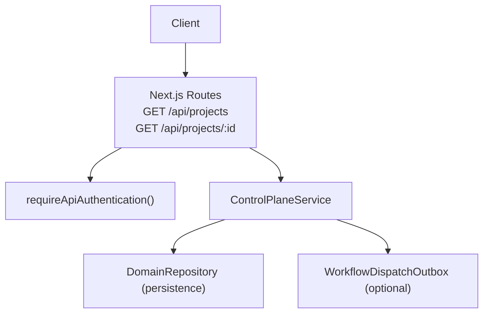
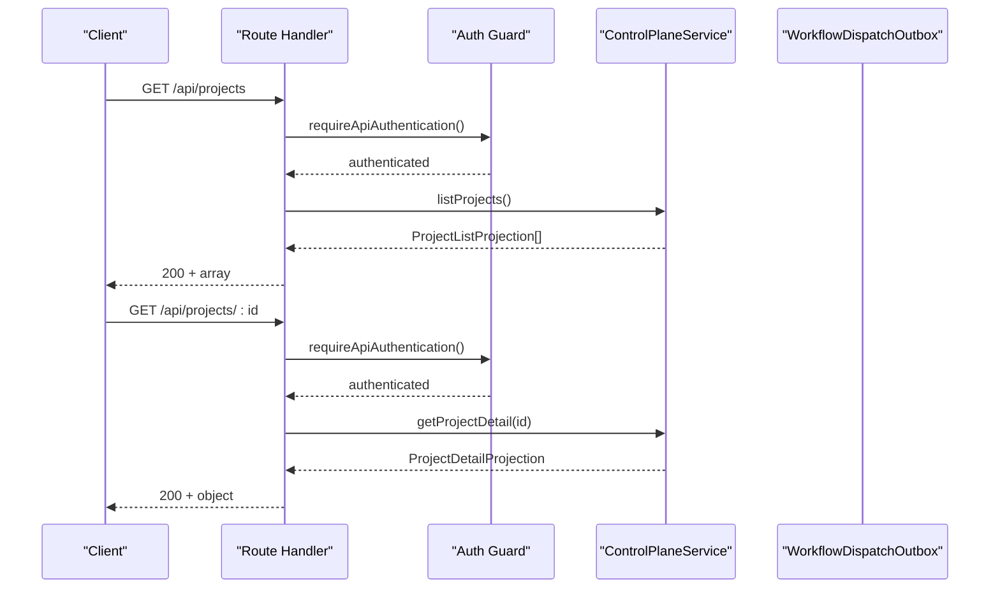
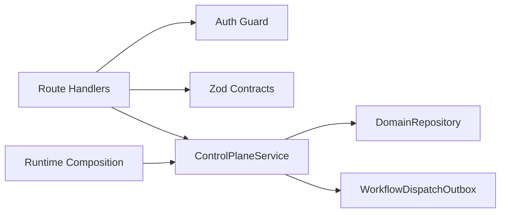

# Projects API

<cite>
**Referenced Files in This Document**
- [apps/control-plane/app/api/projects/route.ts](file://apps/control-plane/app/api/projects/route.ts)
- [apps/control-plane/app/api/projects/[id]/route.ts](file://apps/control-plane/app/api/projects/[id]/route.ts)
- [apps/control-plane/src/http/contracts.ts](file://apps/control-plane/src/http/contracts.ts)
- [apps/control-plane/src/application/runtime.ts](file://apps/control-plane/src/application/runtime.ts)
- [apps/control-plane/src/application/control-plane-service.ts](file://apps/control-plane/src/application/control-plane-service.ts)
- [apps/control-plane/src/http/authenticated.ts](file://apps/control-plane/src/http/authenticated.ts)
</cite>

## Table of Contents
1. Introduction
2. Project Structure
3. Core Components
4. Architecture Overview
5. Detailed Component Analysis
6. Dependency Analysis
7. Performance Considerations
8. Troubleshooting Guide
9. Conclusion

## Introduction
This document describes the Projects API for managing Agent OS projects. It covers project listing and retrieval endpoints, request/response schemas, validation rules, authentication, error handling, project lifecycle states as observed via runs, permissions model, and integration with workflow execution. It also provides guidance on project setup, configuration best practices, and common troubleshooting scenarios.

## Project Structure
The Projects API is implemented as Next.js App Router routes that delegate to a control plane service. The service orchestrates persistence, configuration management, and optional workflow dispatch.

**Diagram sources**
- [apps/control-plane/app/api/projects/route.ts:9-18](file://apps/control-plane/app/api/projects/route.ts#L9-L18)
- [apps/control-plane/app/api/projects/[id]/route.ts:10-25](file://apps/control-plane/app/api/projects/[id]/route.ts#L10-L25)
- [apps/control-plane/src/http/authenticated.ts:4-7](file://apps/control-plane/src/http/authenticated.ts#L4-L7)
- [apps/control-plane/src/application/runtime.ts:573-625](file://apps/control-plane/src/application/runtime.ts#L573-L625)

**Section sources**
- [apps/control-plane/app/api/projects/route.ts:9-18](file://apps/control-plane/app/api/projects/route.ts#L9-L18)
- [apps/control-plane/app/api/projects/[id]/route.ts:10-25](file://apps/control-plane/app/api/projects/[id]/route.ts#L10-L25)
- [apps/control-plane/src/http/authenticated.ts:4-7](file://apps/control-plane/src/http/authenticated.ts#L4-L7)
- [apps/control-plane/src/application/runtime.ts:573-625](file://apps/control-plane/src/application/runtime.ts#L573-L625)

## Core Components
- Route handlers:
  - GET /api/projects: lists projects with a list projection schema.
  - GET /api/projects/:id: retrieves a single project detail with recent runs and budget fields.
- Authentication: All project endpoints require API authentication via a guard.
- Schemas: Zod-based contracts define input/output shapes and validation rules.
- Service: ControlPlaneService implements business logic for project projections, configuration, runs, approvals, inbox, and workflow dispatch integration.

Key responsibilities:
- List and detail projects with aggregated run metadata.
- Apply and read configurations with idempotency and conflict detection.
- Create and manage runs (feature/goal), including provenance binding to configuration revisions.
- Integrate with workflow dispatch outbox for durable start/cancel/resume intents.

**Section sources**
- [apps/control-plane/app/api/projects/route.ts:9-18](file://apps/control-plane/app/api/projects/route.ts#L9-L18)
- [apps/control-plane/app/api/projects/[id]/route.ts:10-25](file://apps/control-plane/app/api/projects/[id]/route.ts#L10-L25)
- [apps/control-plane/src/http/contracts.ts:265-292](file://apps/control-plane/src/http/contracts.ts#L265-L292)
- [apps/control-plane/src/application/control-plane-service.ts:825-865](file://apps/control-plane/src/application/control-plane-service.ts#L825-L865)

## Architecture Overview
The API follows a layered design:
- HTTP layer: Next.js route handlers validate requests using Zod and enforce authentication.
- Application layer: ControlPlaneService performs domain operations and composes repository calls and optional workflow dispatch.
- Persistence layer: DomainRepository abstracts storage of projects, configurations, runs, approvals, and messages.
- Workflow integration: Optional durable outbox queues start/cancel/resume intents for feature/goal pipelines.

**Diagram sources**
- [apps/control-plane/app/api/projects/route.ts:9-18](file://apps/control-plane/app/api/projects/route.ts#L9-L18)
- [apps/control-plane/app/api/projects/[id]/route.ts:10-25](file://apps/control-plane/app/api/projects/[id]/route.ts#L10-L25)
- [apps/control-plane/src/http/authenticated.ts:4-7](file://apps/control-plane/src/http/authenticated.ts#L4-L7)
- [apps/control-plane/src/application/control-plane-service.ts:825-865](file://apps/control-plane/src/application/control-plane-service.ts#L825-L865)

## Detailed Component Analysis

### Endpoints

#### GET /api/projects
- Purpose: List all projects with summary information.
- Method: GET
- URL: /api/projects
- Authentication: Required (API authentication).
- Query parameters: None supported by contract utilities; any query params will be rejected by allowedQuery/assertNoQuery if used elsewhere. For this endpoint, no query params are expected.
- Response schema: Array of project list projections.
  - Fields include: id, name, binding, latestRevision (optional), configDigest (optional), lastRunStatus (optional), lastRunAt (optional), runCount, updatedAt.
- Validation: Output validated against projectListProjectionSchema.
- Errors:
  - Authentication failures return appropriate 4xx from the auth guard.
  - Unexpected errors are wrapped by handleApi into standardized responses.

Example response shape:
- [projectListProjectionSchema:265-286](file://apps/control-plane/src/http/contracts.ts#L265-L286)

**Section sources**
- [apps/control-plane/app/api/projects/route.ts:9-18](file://apps/control-plane/app/api/projects/route.ts#L9-L18)
- [apps/control-plane/src/http/contracts.ts:265-286](file://apps/control-plane/src/http/contracts.ts#L265-L286)

#### GET /api/projects/:id
- Purpose: Retrieve detailed information about a specific project, including recent runs and budget settings when available.
- Method: GET
- URL: /api/projects/:id
- Path parameter:
  - id: Bounded identifier validated by boundedPathId.
- Authentication: Required (API authentication).
- Response schema: Project detail projection extending list projection with:
  - workflowBudgetMicrodollars (optional)
  - dailyBudgetMicrodollars (optional)
  - recentRuns: array of run projections.
- Validation: Output validated against projectDetailProjectionSchema; path id validated by boundedPathId.
- Errors:
  - If project not found: returns 404.
  - Other errors handled by handleApi.

Example response shape:
- [projectDetailProjectionSchema:288-292](file://apps/control-plane/src/http/contracts.ts#L288-L292)
- [runProjectionSchema:130-263](file://apps/control-plane/src/http/contracts.ts#L130-L263)

**Section sources**
- [apps/control-plane/app/api/projects/[id]/route.ts:10-25](file://apps/control-plane/app/api/projects/[id]/route.ts#L10-L25)
- [apps/control-plane/src/http/contracts.ts:288-292](file://apps/control-plane/src/http/contracts.ts#L288-L292)
- [apps/control-plane/src/http/contracts.ts:130-263](file://apps/control-plane/src/http/contracts.ts#L130-L263)

### Request and Response Schemas

- Project list projection:
  - id: string identifier
  - name: string up to 120 chars
  - binding: string up to 4096 chars
  - latestRevision: positive integer (optional)
  - configDigest: 64-char hex digest (optional)
  - lastRunStatus: enum of run statuses (optional)
  - lastRunAt: ISO timestamp (optional)
  - runCount: non-negative integer
  - updatedAt: ISO timestamp
  - Reference: [projectListProjectionSchema:265-286](file://apps/control-plane/src/http/contracts.ts#L265-L286)

- Project detail projection:
  - Extends list projection with:
    - workflowBudgetMicrodollars: positive integer (optional)
    - dailyBudgetMicrodollars: positive integer (optional)
    - recentRuns: array of run projections
  - Reference: [projectDetailProjectionSchema:288-292](file://apps/control-plane/src/http/contracts.ts#L288-L292)

- Run projection (used in recentRuns):
  - id, projectId, pipeline, status, input, error, goal, outcome, createdAt, updatedAt, repositorySha, configDigest, modelDigest, promptDigest, environmentDigest, policyDigest, steps, timeline
  - Reference: [runProjectionSchema:130-263](file://apps/control-plane/src/http/contracts.ts#L130-L263)

- Path identifier validation:
  - boundedPathId enforces a strict pattern and length, returning a 422 validation_error on failure.
  - Reference: [boundedPathId:373-382](file://apps/control-plane/src/http/contracts.ts#L373-L382)

**Section sources**
- [apps/control-plane/src/http/contracts.ts:130-292](file://apps/control-plane/src/http/contracts.ts#L130-L292)
- [apps/control-plane/src/http/contracts.ts:373-382](file://apps/control-plane/src/http/contracts.ts#L373-L382)

### Authentication and Permissions
- All project endpoints require API authentication via requireApiAuthentication.
- The guard reads auth configuration from environment and validates the incoming request based on method and credentials.
- No per-project authorization checks are enforced at the API layer; access control relies on global API authentication.

**Section sources**
- [apps/control-plane/src/http/authenticated.ts:4-7](file://apps/control-plane/src/http/authenticated.ts#L4-L7)

### Project Lifecycle States
Projects themselves do not have explicit lifecycle transitions exposed by these endpoints. However, their associated runs exhibit lifecycle states observable through project detail recentRuns:
- Run statuses: pending, running, waiting, succeeded, failed, cancelled.
- These reflect workflow execution phases and outcomes.

References:
- [runProjectionSchema status enum:130-142](file://apps/control-plane/src/http/contracts.ts#L130-L142)

**Section sources**
- [apps/control-plane/src/http/contracts.ts:130-142](file://apps/control-plane/src/http/contracts.ts#L130-L142)

### Configuration and Project Identity
- Project identity is derived from a binding key computed from configuration:
  - repository URL, localPath, or name.
- Configuration application supports idempotency keys and optimistic concurrency via expectedRevision/expectedDigest.
- Provenance includes repository SHA and digests for models, prompts, environments, and policies.

References:
- [bindingKey and project identity:703-737](file://apps/control-plane/src/application/control-plane-service.ts#L703-L737)
- [applyConfiguration:904-1037](file://apps/control-plane/src/application/control-plane-service.ts#L904-L1037)

**Section sources**
- [apps/control-plane/src/application/control-plane-service.ts:703-737](file://apps/control-plane/src/application/control-plane-service.ts#L703-L737)
- [apps/control-plane/src/application/control-plane-service.ts:904-1037](file://apps/control-plane/src/application/control-plane-service.ts#L904-L1037)

### Integration with Workflow Execution
- When workflow dispatch is configured, creating runs emits durable intents to start workflows.
- Canceling runs emits cancel intents.
- Approvals integrate with resume intents upon consumption.

References:
- [workflowDispatchFromEnv composition](file://apps/control-plane/src/application/runtime.ts:387-571)
- [createRun dispatch intent](file://apps/control-plane/src/application/control-plane-service.ts:1226-1236)
- [cancelRun dispatch intent](file://apps/control-plane/src/application/control-plane-service.ts:1300-1307)

**Section sources**
- [apps/control-plane/src/application/runtime.ts:387-571](file://apps/control-plane/src/application/runtime.ts#L387-L571)
- [apps/control-plane/src/application/control-plane-service.ts:1226-1236](file://apps/control-plane/src/application/control-plane-service.ts#L1226-L1236)
- [apps/control-plane/src/application/control-plane-service.ts:1300-1307](file://apps/control-plane/src/application/control-plane-service.ts#L1300-L1307)

### Error Handling
- Validation errors (e.g., invalid path id) return 422 with code 'validation_error'.
- Not found conditions return 404.
- Conflict conditions (e.g., idempotency conflicts, stale configuration) return 409.
- Service-specific errors use ServiceError with code, message, and status.

References:
- [boundedPathId validation error](file://apps/control-plane/src/http/contracts.ts:373-382)
- [ServiceError usage in control plane](file://apps/control-plane/src/application/control-plane-service.ts:40-49)
- [applyConfiguration conflict handling](file://apps/control-plane/src/application/control-plane-service.ts:934-1037)

**Section sources**
- [apps/control-plane/src/http/contracts.ts:373-382](file://apps/control-plane/src/http/contracts.ts#L373-L382)
- [apps/control-plane/src/application/control-plane-service.ts:40-49](file://apps/control-plane/src/application/control-plane-service.ts#L40-L49)
- [apps/control-plane/src/application/control-plane-service.ts:934-1037](file://apps/control-plane/src/application/control-plane-service.ts#L934-L1037)

## Dependency Analysis
The following diagram shows runtime dependencies among core components involved in the Projects API:

**Diagram sources**
- [apps/control-plane/app/api/projects/route.ts:9-18](file://apps/control-plane/app/api/projects/route.ts#L9-L18)
- [apps/control-plane/app/api/projects/[id]/route.ts:10-25](file://apps/control-plane/app/api/projects/[id]/route.ts#L10-L25)
- [apps/control-plane/src/http/contracts.ts:265-292](file://apps/control-plane/src/http/contracts.ts#L265-L292)
- [apps/control-plane/src/application/runtime.ts:573-625](file://apps/control-plane/src/application/runtime.ts#L573-L625)

**Section sources**
- [apps/control-plane/src/application/runtime.ts:573-625](file://apps/control-plane/src/application/runtime.ts#L573-L625)
- [apps/control-plane/src/application/control-plane-service.ts:825-865](file://apps/control-plane/src/application/control-plane-service.ts#L825-L865)

## Performance Considerations
- Concurrency limits: The service bounds fan-out queries (e.g., inbox digest, project listings) to avoid saturating database connections.
- Projection caching: Recent runs and budgets are fetched efficiently within project detail retrieval.
- Idempotency: Configuration apply and run creation leverage idempotency keys to prevent duplicate work.

[No sources needed since this section provides general guidance]

## Troubleshooting Guide
Common issues and resolutions:
- Invalid path identifier:
  - Symptom: 422 validation_error when accessing /api/projects/:id.
  - Cause: Identifier does not match the required pattern or length.
  - Resolution: Ensure the project id conforms to the bounded identifier rules.
  - Reference: [boundedPathId:373-382](file://apps/control-plane/src/http/contracts.ts#L373-L382)

- Project not found:
  - Symptom: 404 when retrieving project detail.
  - Cause: The specified project id does not exist.
  - Resolution: Verify the project id and ensure it exists in the system.
  - Reference: [getProjectDetail:834-839](file://apps/control-plane/src/application/control-plane-service.ts#L834-L839)

- Stale configuration:
  - Symptom: 409 configuration_stale when applying configuration.
  - Cause: Expected revision/digest mismatch due to concurrent updates.
  - Resolution: Re-fetch active configuration and retry with updated expectations.
  - Reference: [applyConfiguration conflict handling](file://apps/control-plane/src/application/control-plane-service.ts:1020-1037)

- Missing authentication:
  - Symptom: 4xx from auth guard.
  - Cause: Missing or invalid API credentials.
  - Resolution: Provide valid API authentication headers per deployment configuration.
  - Reference: [requireApiAuthentication:4-7](file://apps/control-plane/src/http/authenticated.ts#L4-L7)

**Section sources**
- [apps/control-plane/src/http/contracts.ts:373-382](file://apps/control-plane/src/http/contracts.ts#L373-L382)
- [apps/control-plane/src/application/control-plane-service.ts:834-839](file://apps/control-plane/src/application/control-plane-service.ts#L834-L839)
- [apps/control-plane/src/application/control-plane-service.ts:1020-1037](file://apps/control-plane/src/application/control-plane-service.ts#L1020-L1037)
- [apps/control-plane/src/http/authenticated.ts:4-7](file://apps/control-plane/src/http/authenticated.ts#L4-L7)

## Conclusion
The Projects API provides secure, schema-validated endpoints for listing and retrieving project details, integrating tightly with configuration management and workflow execution. Use the provided schemas and validation rules to construct correct requests, handle errors according to documented codes and statuses, and follow best practices for idempotent configuration and robust project setup.

[No sources needed since this section summarizes without analyzing specific files]