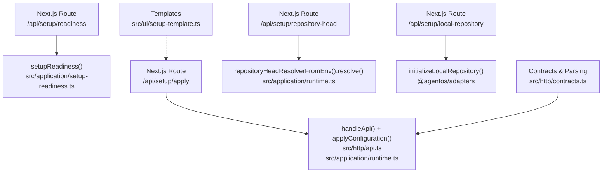
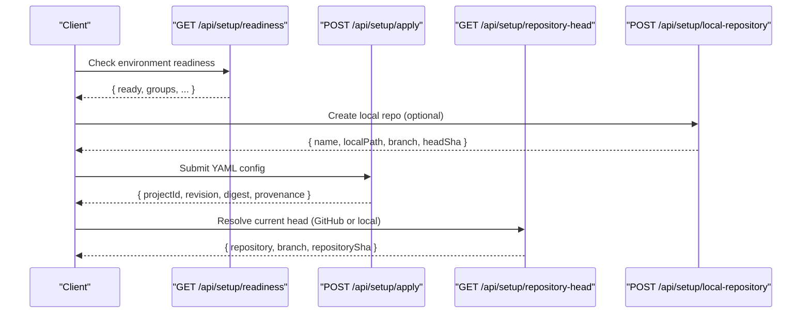
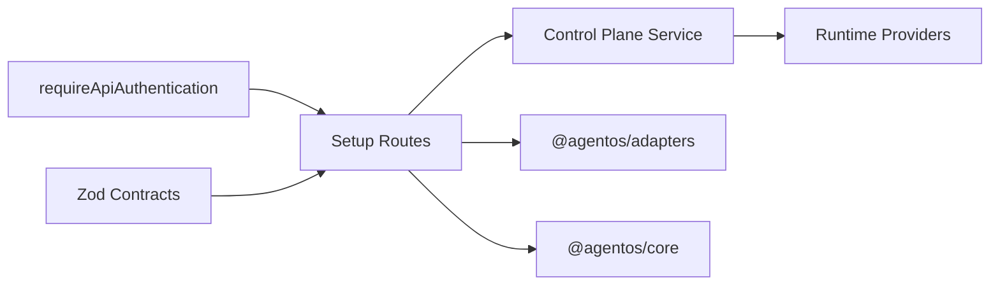

# Setup API

<cite>
**Referenced Files in This Document**
- [route.ts](file://apps/control-plane/app/api/setup/readiness/route.ts)
- [setup-readiness.ts](file://apps/control-plane/src/application/setup-readiness.ts)
- [route.ts](file://apps/control-plane/app/api/setup/apply/route.ts)
- [contracts.ts](file://apps/control-plane/src/http/contracts.ts)
- [api.ts](file://apps/control-plane/src/http/api.ts)
- [runtime.ts](file://apps/control-plane/src/application/runtime.ts)
- [route.ts](file://apps/control-plane/app/api/setup/repository-head/route.ts)
- [route.ts](file://apps/control-plane/app/api/setup/local-repository/route.ts)
- [setup-template.ts](file://apps/control-plane/src/ui/setup-template.ts)
</cite>

## Table of Contents
1. Introduction
2. Project Structure
3. Core Components
4. Architecture Overview
5. Detailed Component Analysis
6. Dependency Analysis
7. Performance Considerations
8. Troubleshooting Guide
9. Conclusion
10. Appendices

## Introduction
This document specifies the Setup API used to deploy and configure Agent OS for initial operations. It covers:
- Checking deployment readiness
- Applying an initial configuration (YAML)
- Managing repository head resolution
- Creating local experiment repositories

It also documents prerequisites, environment variables, validation rules, request/response schemas, error handling, and recommended workflows for automated deployments and configuration management.

## Project Structure
The Setup API is implemented as Next.js route handlers under apps/control-plane/app/api/setup with application logic in src/application and shared HTTP contracts in src/http.

**Diagram sources**
- [route.ts:10-16](file://apps/control-plane/app/api/setup/readiness/route.ts#L10-L16)
- [setup-readiness.ts:86-273](file://apps/control-plane/src/application/setup-readiness.ts#L86-L273)
- [route.ts:43-79](file://apps/control-plane/app/api/setup/apply/route.ts#L43-L79)
- [api.ts:93-129](file://apps/control-plane/src/http/api.ts#L93-L129)
- [contracts.ts:56-101](file://apps/control-plane/src/http/contracts.ts#L56-L101)
- [route.ts:27-73](file://apps/control-plane/app/api/setup/repository-head/route.ts#L27-L73)
- [runtime.ts:160-200](file://apps/control-plane/src/application/runtime.ts#L160-L200)
- [route.ts:87-129](file://apps/control-plane/app/api/setup/local-repository/route.ts#L87-L129)
- [setup-template.ts:3-259](file://apps/control-plane/src/ui/setup-template.ts#L3-L259)

**Section sources**
- [route.ts:10-16](file://apps/control-plane/app/api/setup/readiness/route.ts#L10-L16)
- [route.ts:43-79](file://apps/control-plane/app/api/setup/apply/route.ts#L43-L79)
- [route.ts:27-73](file://apps/control-plane/app/api/setup/repository-head/route.ts#L27-L73)
- [route.ts:87-129](file://apps/control-plane/app/api/setup/local-repository/route.ts#L87-L129)
- [setup-readiness.ts:86-273](file://apps/control-plane/src/application/setup-readiness.ts#L86-L273)
- [contracts.ts:56-101](file://apps/control-plane/src/http/contracts.ts#L56-L101)
- [api.ts:93-129](file://apps/control-plane/src/http/api.ts#L93-L129)
- [runtime.ts:160-200](file://apps/control-plane/src/application/runtime.ts#L160-L200)
- [setup-template.ts:3-259](file://apps/control-plane/src/ui/setup-template.ts#L3-L259)

## Core Components
- Readiness check: GET /api/setup/readiness returns a grouped report of required environment variables and subsystems.
- Configuration apply: POST /api/setup/apply validates and applies a YAML configuration, returning a canonicalized projection with provenance.
- Repository head: GET /api/setup/repository-head resolves the current default branch SHA for GitHub or local projects.
- Local repository creation: POST /api/setup/local-repository creates a seeded local Git repository under a configured root.

Key behaviors:
- All endpoints require session-based API authentication via the handleApi authorization hook.
- Body parsing and output validation are enforced by Zod schemas defined in contracts.
- Errors are normalized into { error: { code, message } } responses with appropriate HTTP status codes.

**Section sources**
- [route.ts:10-16](file://apps/control-plane/app/api/setup/readiness/route.ts#L10-L16)
- [route.ts:43-79](file://apps/control-plane/app/api/setup/apply/route.ts#L43-L79)
- [route.ts:27-73](file://apps/control-plane/app/api/setup/repository-head/route.ts#L27-L73)
- [route.ts:87-129](file://apps/control-plane/app/api/setup/local-repository/route.ts#L87-L129)
- [contracts.ts:56-101](file://apps/control-plane/src/http/contracts.ts#L56-L101)
- [api.ts:93-129](file://apps/control-plane/src/http/api.ts#L93-L129)

## Architecture Overview
The setup flow orchestrates environment checks, configuration application, and repository head resolution before starting runs.

**Diagram sources**
- [route.ts:10-16](file://apps/control-plane/app/api/setup/readiness/route.ts#L10-L16)
- [route.ts:87-129](file://apps/control-plane/app/api/setup/local-repository/route.ts#L87-L129)
- [route.ts:43-79](file://apps/control-plane/app/api/setup/apply/route.ts#L43-L79)
- [route.ts:27-73](file://apps/control-plane/app/api/setup/repository-head/route.ts#L27-L73)

## Detailed Component Analysis

### GET /api/setup/readiness
Purpose:
- Returns a deployment-wide readiness report grouped by subsystems (database, dispatch, models, storage, GitHub Apps, local workspaces, artifact MCP, trust anchors).
- Indicates whether the deployment is ready for GitHub-bound or local-experiment projects.

HTTP method and URL:
- Method: GET
- URL: /api/setup/readiness

Authentication:
- Requires session-based API authentication.

Request:
- No body.

Response schema:
- Fields include:
  - ready: boolean
  - readyForGitHub: boolean
  - readyForLocal: boolean
  - repositories?: string[] (bound repositories when available)
  - groups: array of { id, title, ready, items: [{ key, label, ready, hint }] }

Validation rules:
- The endpoint inspects environment variables and validates GitHub reader/publisher pairing when applicable.

Error responses:
- Authentication errors return standard error objects with appropriate status codes.

Example workflow:
- Call this endpoint first to validate environment configuration before applying any configuration.

**Section sources**
- [route.ts:10-16](file://apps/control-plane/app/api/setup/readiness/route.ts#L10-L16)
- [setup-readiness.ts:86-273](file://apps/control-plane/src/application/setup-readiness.ts#L86-L273)

### POST /api/setup/apply
Purpose:
- Parses, canonicalizes, and applies a YAML configuration for a project.
- Enforces idempotency via Idempotency-Key header and concurrency controls based on active revision/digest.

HTTP method and URL:
- Method: POST
- URL: /api/setup/apply

Authentication:
- Requires session-based API authentication.

Request schema:
- Body must be JSON with:
  - yaml: string (min length 2; byte length bounded by MAX_AGENT_OS_CONFIG_SOURCE_BYTES)

Headers:
- Content-Type: application/json
- Idempotency-Key: required (enforced by contracts)

Response schema:
- On success (201):
  - canonicalConfig?: string
  - projectId: string
  - digest: string (64 hex chars)
  - revision: number (positive integer)
  - appliedAt: string (timestamp)
  - provenance: { repositorySha, configDigest, modelDigest, promptDigest, environmentDigest, policyDigest }

Validation rules:
- YAML is parsed and validated by core configuration loader.
- Canonicalization and hashing are performed server-side.
- Concurrency control uses expectedRevision and expectedDigest derived from the currently active configuration.

Error handling:
- invalid_configuration: 422 when YAML cannot be parsed or validated.
- Payload too large: 413 if body exceeds limits.
- Validation errors: 422 for malformed requests.
- Other service errors map to appropriate statuses.

Example workflow:
- After confirming readiness, send your YAML with an Idempotency-Key to apply it. Use the returned provenance for subsequent run creation.

**Section sources**
- [route.ts:22-79](file://apps/control-plane/app/api/setup/apply/route.ts#L22-L79)
- [contracts.ts:56-101](file://apps/control-plane/src/http/contracts.ts#L56-L101)
- [api.ts:93-129](file://apps/control-plane/src/http/api.ts#L93-L129)

### GET /api/setup/repository-head
Purpose:
- Resolves the current default-branch commit SHA for the bound repository. Works for GitHub-bound projects via a trusted reader or for local experiments via git commands against a containment-checked working tree.

HTTP method and URL:
- Method: GET
- URL: /api/setup/repository-head?projectId=<id> (optional)

Authentication:
- Requires session-based API authentication.

Query parameters:
- projectId: optional, bounded identifier

Response schema:
- { repository: string, branch: string, repositorySha: string }

Validation rules:
- Requires an active configuration to exist; otherwise returns 409 with no_active_configuration.
- Reader misconfiguration maps to 503 reader_unavailable; other failures map to 502 repository_head_unavailable.

Error handling:
- No active configuration: 409
- Reader unavailable: 503
- Resolution failure: 502

Example workflow:
- After applying configuration, resolve the repository head to pin the exact commit for a run.

**Section sources**
- [route.ts:27-73](file://apps/control-plane/app/api/setup/repository-head/route.ts#L27-L73)
- [runtime.ts:160-200](file://apps/control-plane/src/application/runtime.ts#L160-L200)

### POST /api/setup/local-repository
Purpose:
- Creates and seeds a new local experiment repository under AGENTOS_LOCAL_WORKSPACES_ROOT. Supports explicit naming or auto-incremented names using a prefix.

HTTP method and URL:
- Method: POST
- URL: /api/setup/local-repository

Authentication:
- Requires session-based API authentication.

Request schema:
- One of:
  - { name: string } where name matches /^[a-z0-9][a-z0-9-]{0,63}$/
  - { namePrefix: string } where namePrefix matches /^[a-z0-9][a-z0-9-]{0,58}$/

Response schema:
- { name: string, localPath: string, branch: string, headSha: string }

Validation rules:
- If AGENTOS_LOCAL_WORKSPACES_ROOT is not set, returns 409 local_workspaces_unconfigured.
- Name collisions return 409 already_exists.
- Auto-increment mode picks the next free <prefix>-NN directory and retries once to absorb races.

Error handling:
- Missing workspace root: 409
- Already exists: 409
- Other errors propagate as service errors

Example workflow:
- Create a local repository, then populate the YAML template with the returned localPath and proceed to apply configuration.

**Section sources**
- [route.ts:20-129](file://apps/control-plane/app/api/setup/local-repository/route.ts#L20-L129)

## Dependency Analysis
The Setup API depends on:
- Authentication middleware via handleApi authorize hook
- Zod schemas for input/output validation
- Core configuration loading and canonicalization
- Runtime services for applying configuration and resolving repository heads
- Adapters for local repository initialization and GitHub readers

**Diagram sources**
- [api.ts:93-129](file://apps/control-plane/src/http/api.ts#L93-L129)
- [contracts.ts:56-101](file://apps/control-plane/src/http/contracts.ts#L56-L101)
- [route.ts:43-79](file://apps/control-plane/app/api/setup/apply/route.ts#L43-L79)
- [route.ts:27-73](file://apps/control-plane/app/api/setup/repository-head/route.ts#L27-L73)
- [route.ts:87-129](file://apps/control-plane/app/api/setup/local-repository/route.ts#L87-L129)

**Section sources**
- [api.ts:93-129](file://apps/control-plane/src/http/api.ts#L93-L129)
- [contracts.ts:56-101](file://apps/control-plane/src/http/contracts.ts#L56-L101)
- [route.ts:43-79](file://apps/control-plane/app/api/setup/apply/route.ts#L43-L79)
- [route.ts:27-73](file://apps/control-plane/app/api/setup/repository-head/route.ts#L27-L73)
- [route.ts:87-129](file://apps/control-plane/app/api/setup/local-repository/route.ts#L87-L129)

## Performance Considerations
- Request bodies are streamed and size-checked before parsing to avoid memory pressure.
- Configuration apply enforces maximum payload sizes and canonicalization limits.
- Local repository creation scans directories only when needed and uses regex matching for naming.
- Repository head resolution lazily constructs GitHub readers to minimize startup overhead.

[No sources needed since this section provides general guidance]

## Troubleshooting Guide
Common issues and resolutions:
- Readiness failures: Inspect the groups.items with ready=false to identify missing environment variables. Ensure all required variables are set and restart the control plane.
- Apply configuration fails with invalid_configuration: Validate YAML structure and ensure it conforms to the Agent OS configuration schema. Check that the YAML size is within limits.
- Repository head unavailable:
  - 503 reader_unavailable: Fix GitHub reader configuration (app IDs, private keys, allowlists).
  - 502 repository_head_unavailable: Verify network access and repository availability.
- Local repository creation fails:
  - Set AGENTOS_LOCAL_WORKSPACES_ROOT to enable local experiments.
  - Avoid name collisions; use unique names or rely on auto-incremented prefixes.

Error response format:
- All errors return { error: { code, message } } with appropriate HTTP status codes.

Idempotency:
- Provide a unique Idempotency-Key header on mutating requests to safely retry without duplication.

**Section sources**
- [setup-readiness.ts:86-273](file://apps/control-plane/src/application/setup-readiness.ts#L86-L273)
- [route.ts:43-79](file://apps/control-plane/app/api/setup/apply/route.ts#L43-L79)
- [route.ts:27-73](file://apps/control-plane/app/api/setup/repository-head/route.ts#L27-L73)
- [route.ts:87-129](file://apps/control-plane/app/api/setup/local-repository/route.ts#L87-L129)
- [contracts.ts:362-371](file://apps/control-plane/src/http/contracts.ts#L362-L371)
- [api.ts:20-26](file://apps/control-plane/src/http/api.ts#L20-L26)

## Conclusion
Use the Setup API to verify environment readiness, apply a validated configuration, resolve repository heads, and create local experiment repositories. Follow the documented schemas, headers, and error handling patterns to integrate these endpoints into automated pipelines and configuration management strategies.

[No sources needed since this section summarizes without analyzing specific files]

## Appendices

### Prerequisites and Environment Variables
Deployment readiness checks validate the following categories:
- Database: DATABASE_URL, AGENTOS_REPOSITORY
- Workflow dispatch: TRIGGER_SECRET_KEY, TRIGGER_PROJECT_REF
- Model access: ANTHROPIC_API_KEY
- Artifact storage: CLOUDFLARE_R2_ACCOUNT_ID, CLOUDFLARE_R2_ARTIFACT_BUCKET, CLOUDFLARE_R2_ARTIFACT_ACCESS_KEY_ID, CLOUDFLARE_R2_ARTIFACT_SECRET_ACCESS_KEY
- GitHub Apps: GITHUB_READER_APP_ID, GITHUB_READER_APP_PRIVATE_KEY, GITHUB_READER_SELECTED_REPOSITORIES_JSON, GITHUB_APP_ID, GITHUB_APP_PRIVATE_KEY, GITHUB_SELECTED_REPOSITORIES_JSON
- Local workspaces: AGENTOS_LOCAL_WORKSPACES_ROOT
- Artifact MCP: AGENTOS_ARTIFACT_MCP_URL, ARTIFACT_MCP_ALLOWED_ORIGINS, ARTIFACT_CAPABILITY_KEYS_JSON
- Trust anchors: AGENTOS_RUNTIME_OWNERSHIP_SECRET, AGENTOS_RUNTIME_HANDLE_KEY, AGENTOS_TEST_REPORT_KEYS_JSON, GITHUB_PUBLICATION_KEYS_JSON, AGENTOS_TRUSTED_TEST_COMMANDS_JSON

**Section sources**
- [setup-readiness.ts:86-273](file://apps/control-plane/src/application/setup-readiness.ts#L86-L273)

### Setup Workflows

#### GitHub-bound project
1. Check readiness at GET /api/setup/readiness.
2. Prepare YAML configuration (use the provided template as a baseline).
3. Apply configuration via POST /api/setup/apply with Idempotency-Key.
4. Resolve repository head via GET /api/setup/repository-head?projectId=<id>.
5. Start a run using the resolved repositorySha and configuration provenance.

#### Local experiment project
1. Ensure AGENTOS_LOCAL_WORKSPACES_ROOT is set.
2. Create a local repository via POST /api/setup/local-repository with either name or namePrefix.
3. Populate YAML with the returned localPath and proceed as above.

**Section sources**
- [route.ts:10-16](file://apps/control-plane/app/api/setup/readiness/route.ts#L10-L16)
- [route.ts:43-79](file://apps/control-plane/app/api/setup/apply/route.ts#L43-L79)
- [route.ts:27-73](file://apps/control-plane/app/api/setup/repository-head/route.ts#L27-L73)
- [route.ts:87-129](file://apps/control-plane/app/api/setup/local-repository/route.ts#L87-L129)
- [setup-template.ts:3-259](file://apps/control-plane/src/ui/setup-template.ts#L3-L259)

### Automated Deployment Pipelines and Configuration Management
- Use GET /api/setup/readiness as a pipeline gate to fail fast on missing environment variables.
- Store YAML configurations in version control and apply them with POST /api/setup/apply using stable Idempotency-Key values per configuration revision.
- Cache and reuse repository heads between steps to avoid unnecessary resolution calls.
- For local experiments, automate repository creation with POST /api/setup/local-repository using deterministic namePrefixes and track outputs for downstream steps.

[No sources needed since this section provides general guidance]