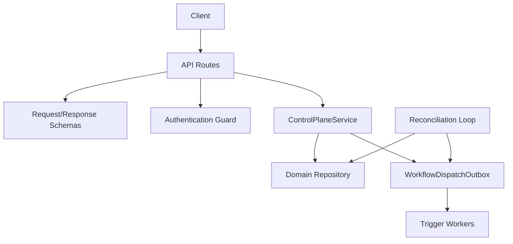
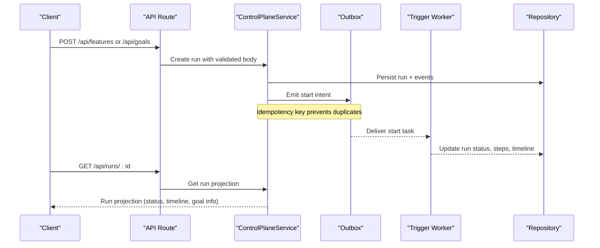
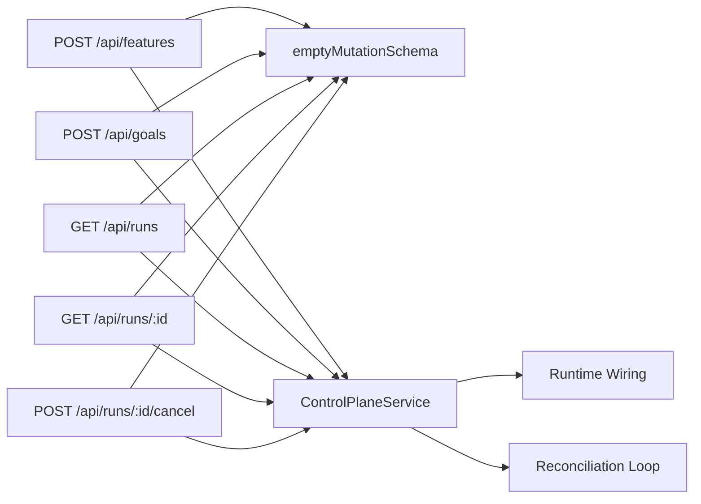

# Workflows API

<cite>
**Referenced Files in This Document**
- [route.ts](file://apps/control-plane/app/api/runs/route.ts)
- [route.ts](file://apps/control-plane/app/api/runs/[id]/route.ts)
- [route.ts](file://apps/control-plane/app/api/runs/[id]/cancel/route.ts)
- [route.ts](file://apps/control-plane/app/api/features/route.ts)
- [route.ts](file://apps/control-plane/app/api/goals/route.ts)
- [contracts.ts](file://apps/control-plane/src/http/contracts.ts)
- [control-plane-service.ts](file://apps/control-plane/src/application/control-plane-service.ts)
- [runtime.ts](file://apps/control-plane/src/application/runtime.ts)
- [workflow-reconciliation.ts](file://apps/control-plane/src/application/workflow-reconciliation.ts)
- [durable-feature-workflow.md](file://docs/architecture/durable-feature-workflow.md)
- [durable-goal-workflow.md](file://docs/architecture/durable-goal-workflow.md)
</cite>

## Table of Contents
1. [Introduction](#introduction)
2. [Project Structure](#project-structure)
3. [Core Components](#core-components)
4. [Architecture Overview](#architecture-overview)
5. [Detailed Component Analysis](#detailed-component-analysis)
6. [Dependency Analysis](#dependency-analysis)
7. [Performance Considerations](#performance-considerations)
8. [Troubleshooting Guide](#troubleshooting-guide)
9. [Conclusion](#conclusion)
10. [Appendices](#appendices)

## Introduction
This document describes the Workflows API for executing and managing Agent OS workflows. It covers endpoints to initiate feature development and goal achievement runs, list and inspect runs, cancel running workflows, and monitor their status through projections and timelines. It also documents workflow types, execution contexts, resource management, retry strategies, and monitoring approaches based on the control plane’s durable design.

## Project Structure
The Workflows API is implemented as Next.js route handlers under the control plane app. Each endpoint validates input, enforces authentication, and delegates to the Control Plane Service, which persists domain state and emits durable outbox intents for Trigger-based execution. A background reconciliation process scans runs and delivers start/cancel/cleanup requests to the workflow engine.

**Diagram sources**
- [route.ts:1-30](file://apps/control-plane/app/api/runs/route.ts#L1-L30)
- [route.ts:1-25](file://apps/control-plane/app/api/runs/[id]/route.ts#L1-L25)
- [route.ts:1-31](file://apps/control-plane/app/api/runs/[id]/cancel/route.ts#L1-L31)
- [route.ts:1-27](file://apps/control-plane/app/api/features/route.ts#L1-L27)
- [route.ts:1-35](file://apps/control-plane/app/api/goals/route.ts#L1-L35)
- [contracts.ts:1-409](file://apps/control-plane/src/http/contracts.ts#L1-L409)
- [control-plane-service.ts:669-701](file://apps/control-plane/src/application/control-plane-service.ts#L669-L701)
- [workflow-reconciliation.ts:156-507](file://apps/control-plane/src/application/workflow-reconciliation.ts#L156-L507)

**Section sources**
- [route.ts:1-30](file://apps/control-plane/app/api/runs/route.ts#L1-L30)
- [route.ts:1-25](file://apps/control-plane/app/api/runs/[id]/route.ts#L1-L25)
- [route.ts:1-31](file://apps/control-plane/app/api/runs/[id]/cancel/route.ts#L1-L31)
- [route.ts:1-27](file://apps/control-plane/app/api/features/route.ts#L1-L27)
- [route.ts:1-35](file://apps/control-plane/app/api/goals/route.ts#L1-L35)
- [contracts.ts:1-409](file://apps/control-plane/src/http/contracts.ts#L1-L409)
- [workflow-reconciliation.ts:156-507](file://apps/control-plane/src/application/workflow-reconciliation.ts#L156-L507)

## Core Components
- API routes: HTTP entry points for listing runs, fetching a run by ID, cancelling a run, and creating feature or goal runs.
- Contracts: Zod schemas that define request bodies, query parameters, path identifiers, idempotency headers, and response projections.
- Control Plane Service: Domain logic for creating runs, projecting run details, handling approvals, and emitting durable outbox intents.
- Runtime wiring: Builds dispatchers, approval waiters, artifact stores, and cancellation runtime used by the outbox.
- Reconciliation loop: Scans runs, enforces deadlines, repairs missing snapshots/criteria, and delivers start/cancel/cleanup intents.

Key responsibilities:
- Input validation and projection enforcement via schemas.
- Idempotent mutation via required idempotency keys.
- Durable intent emission for asynchronous execution.
- Background reconciliation for reliability and recovery.

**Section sources**
- [contracts.ts:14-55](file://apps/control-plane/src/http/contracts.ts#L14-L55)
- [contracts.ts:130-263](file://apps/control-plane/src/http/contracts.ts#L130-L263)
- [control-plane-service.ts:61-87](file://apps/control-plane/src/application/control-plane-service.ts#L61-L87)
- [runtime.ts:387-571](file://apps/control-plane/src/application/runtime.ts#L387-L571)
- [workflow-reconciliation.ts:156-507](file://apps/control-plane/src/application/workflow-reconciliation.ts#L156-L507)

## Architecture Overview
The Workflows API follows a durable, event-driven architecture:
- Clients call authenticated endpoints to create or manage runs.
- The service persists domain state (runs, approvals, events) and writes durable outbox intents.
- A reconciliation loop ensures intents are delivered even if workers fail mid-flight.
- Trigger workers execute feature or goal workflows, reporting back via events and checkpoints.
- Projections expose status, timeline, steps, and goal-specific child progress.

**Diagram sources**
- [route.ts:1-27](file://apps/control-plane/app/api/features/route.ts#L1-L27)
- [route.ts:1-35](file://apps/control-plane/app/api/goals/route.ts#L1-L35)
- [route.ts:1-25](file://apps/control-plane/app/api/runs/[id]/route.ts#L1-L25)
- [control-plane-service.ts:669-701](file://apps/control-plane/src/application/control-plane-service.ts#L669-L701)
- [workflow-reconciliation.ts:156-507](file://apps/control-plane/src/application/workflow-reconciliation.ts#L156-L507)

## Detailed Component Analysis

### Feature Development Workflow
- Purpose: Turn a configuration revision into a tested draft pull request using a multi-stage pipeline (specification, planning, implementation/testing, review, verification).
- Initiation: POST /api/features with project identity, repository SHA, and provenance digests.
- Execution context: Source bundle ingestion, scoped artifacts, bounded budgets, approvals, and trusted verification.
- Resource management: Global session lease, per-step retries, absolute deadline, budget caps, and cleanup.

Endpoints
- Create feature run
  - Method: POST
  - URL: /api/features
  - Authentication: Required
  - Request body schema: createRunSchema
    - Fields include projectId, title, description, repositorySha, configDigest, modelDigest, promptDigest, environmentDigest, policyDigest
  - Response schema: runProjectionSchema
  - Success status: 201
  - Idempotency: Requires Idempotency-Key header; duplicate keys return the same result
- List runs
  - Method: GET
  - URL: /api/runs
  - Query: Optional projectId filter
  - Response schema: array of runProjectionSchema
- Get run by ID
  - Method: GET
  - URL: /api/runs/{id}
  - Response schema: runProjectionSchema
- Cancel run
  - Method: POST
  - URL: /api/runs/{id}/cancel
  - Authentication: Required
  - Request body: empty object
  - Response schema: runProjectionSchema
  - Idempotency: Requires Idempotency-Key header

Real-time status updates
- Poll GET /api/runs/{id} to observe status transitions: pending -> running -> waiting -> succeeded | failed | cancelled.
- Use timeline entries for detailed events such as approvals, messages, and step outcomes.

Error handling
- Validation errors return 422 with code validation_error.
- Missing or invalid Idempotency-Key returns 400 with code idempotency_key_required.
- Deadline exceeded transitions run to failed with error.code workflow_deadline_exceeded.

Retry strategy
- Step-level transient retries are handled within the worker; the control plane records attempts and statuses in the run projection.
- Reconciliation redelivers start/cancel/cleanup intents until completed.

Monitoring approach
- Inspect run.status, steps[].status, and timeline[] for progress.
- For goals, inspect goal.children[] and latestResults[] for criterion outcomes.

**Section sources**
- [route.ts:1-27](file://apps/control-plane/app/api/features/route.ts#L1-L27)
- [route.ts:1-30](file://apps/control-plane/app/api/runs/route.ts#L1-L30)
- [route.ts:1-25](file://apps/control-plane/app/api/runs/[id]/route.ts#L1-L25)
- [route.ts:1-31](file://apps/control-plane/app/api/runs/[id]/cancel/route.ts#L1-L31)
- [contracts.ts:14-26](file://apps/control-plane/src/http/contracts.ts#L14-L26)
- [contracts.ts:130-263](file://apps/control-plane/src/http/contracts.ts#L130-L263)
- [contracts.ts:362-382](file://apps/control-plane/src/http/contracts.ts#L362-L382)
- [workflow-reconciliation.ts:214-303](file://apps/control-plane/src/application/workflow-reconciliation.ts#L214-L303)
- [durable-feature-workflow.md:1-108](file://docs/architecture/durable-feature-workflow.md#L1-L108)

### Goal Achievement Workflow
- Purpose: Achieve up to three bounded attempts against command criteria defined by operators, using signed evidence from verified test runs.
- Initiation: POST /api/goals with criteria (command checks), project identity, and provenance digests.
- Execution context: Validates immutable inputs, creates deterministic child feature runs per step, and evaluates signed reports.
- Resource management: Uses configured timeoutMs capped by an absolute one-hour boundary; reuses cancellation and cleanup reconciliation.

Endpoints
- Create goal run
  - Method: POST
  - URL: /api/goals
  - Authentication: Required
  - Request body schema: createGoalRunSchema
    - Extends createRunSchema with criteria array (1–20 command criteria, unique IDs)
  - Response schema: runProjectionSchema
  - Success status: 201
  - Idempotency: Requires Idempotency-Key header
- List runs
  - Method: GET
  - URL: /api/runs
  - Query: Optional projectId filter
  - Response schema: array of runProjectionSchema
- Get run by ID
  - Method: GET
  - URL: /api/runs/{id}
  - Response schema: runProjectionSchema
- Cancel run
  - Method: POST
  - URL: /api/runs/{id}/cancel
  - Authentication: Required
  - Request body: empty object
  - Response schema: runProjectionSchema
  - Idempotency: Requires Idempotency-Key header

State transitions and goal specifics
- Status transitions mirror feature runs; goal runs additionally expose:
  - goal.maxSteps and goal.currentStep
  - goal.criteria with id, description, required flags
  - goal.latestResults per criterion with status passed or failed
  - goal.children with step, runId, status, and optional draftPullRequestUrl/localBranch/localRepositoryUrl

Monitoring approach
- Observe goal.latestResults to track criterion satisfaction.
- Inspect goal.children to follow child feature run progress per step.

Error handling
- Invalid goal criteria return 422 with code invalid_goal_criteria.
- Unverifiable legacy goal runs are failed closed during migration.
- Deadline exceeded transitions run to failed with error.code workflow_deadline_exceeded.

Retry strategy
- Child feature runs use deterministic IDs to ensure replay safety.
- Reconciliation repairs missing snapshots/criteria and redelivers tasks; terminal children are consumed rather than re-executed.

**Section sources**
- [route.ts:1-35](file://apps/control-plane/app/api/goals/route.ts#L1-L35)
- [contracts.ts:28-52](file://apps/control-plane/src/http/contracts.ts#L28-L52)
- [contracts.ts:130-263](file://apps/control-plane/src/http/contracts.ts#L130-L263)
- [control-plane-service.ts:425-454](file://apps/control-plane/src/application/control-plane-service.ts#L425-L454)
- [workflow-reconciliation.ts:316-433](file://apps/control-plane/src/application/workflow-reconciliation.ts#L316-L433)
- [durable-goal-workflow.md:1-107](file://docs/architecture/durable-goal-workflow.md#L1-L107)

### Workflow Types, Execution Contexts, and Resource Management
- Workflow types:
  - Feature: Multi-stage pipeline producing a draft PR after specification, planning, implementation, review, and verification.
  - Goal: Bounded loop of up to three attempts evaluating command criteria via signed evidence.
- Execution contexts:
  - Source bundles are ingested and bound to repository SHAs.
  - Scoped artifacts and MCP capabilities isolate role outputs.
  - Approvals gate progression with scope hashes and atomic events.
- Resource management:
  - Global session leases limit concurrent agent sessions.
  - Per-step retries and absolute deadlines prevent runaway executions.
  - Budget caps enforce microdollar limits per workflow and rolling windows.
  - Cleanup reconciles resources after terminal states.

**Section sources**
- [durable-feature-workflow.md:1-133](file://docs/architecture/durable-feature-workflow.md#L1-L133)
- [durable-goal-workflow.md:1-107](file://docs/architecture/durable-goal-workflow.md#L1-L107)
- [workflow-reconciliation.ts:214-303](file://apps/control-plane/src/application/workflow-reconciliation.ts#L214-L303)

### Monitoring Approaches and Real-Time Updates
- Polling:
  - GET /api/runs/{id} returns current status, steps, timeline, and goal details.
- Timeline:
  - timeline[] contains eventId, sequence, type, payload, and occurredAt for granular events like approvals and messages.
- Projections:
  - runProjectionSchema exposes safe fields including outcome links and error codes.
- Background reconciliation:
  - Ensures eventual consistency when workers fail; deadlines and approvals are enforced.

**Section sources**
- [contracts.ts:130-263](file://apps/control-plane/src/http/contracts.ts#L130-L263)
- [workflow-reconciliation.ts:156-507](file://apps/control-plane/src/application/workflow-reconciliation.ts#L156-L507)

## Dependency Analysis
The API routes depend on:
- Authentication guard for all mutations and reads.
- Contract schemas for strict validation and projection.
- Control Plane Service for domain operations and outbox emissions.
- Runtime wiring for dispatch, approval waits, artifacts, and cancellation.
- Reconciliation loop for durability and recovery.

**Diagram sources**
- [route.ts:1-27](file://apps/control-plane/app/api/features/route.ts#L1-L27)
- [route.ts:1-35](file://apps/control-plane/app/api/goals/route.ts#L1-L35)
- [route.ts:1-30](file://apps/control-plane/app/api/runs/route.ts#L1-L30)
- [route.ts:1-25](file://apps/control-plane/app/api/runs/[id]/route.ts#L1-L25)
- [route.ts:1-31](file://apps/control-plane/app/api/runs/[id]/cancel/route.ts#L1-L31)
- [contracts.ts:14-55](file://apps/control-plane/src/http/contracts.ts#L14-L55)
- [contracts.ts:130-263](file://apps/control-plane/src/http/contracts.ts#L130-L263)
- [control-plane-service.ts:669-701](file://apps/control-plane/src/application/control-plane-service.ts#L669-L701)
- [runtime.ts:387-571](file://apps/control-plane/src/application/runtime.ts#L387-L571)
- [workflow-reconciliation.ts:156-507](file://apps/control-plane/src/application/workflow-reconciliation.ts#L156-L507)

**Section sources**
- [route.ts:1-35](file://apps/control-plane/app/api/goals/route.ts#L1-L35)
- [route.ts:1-30](file://apps/control-plane/app/api/runs/route.ts#L1-L30)
- [route.ts:1-25](file://apps/control-plane/app/api/runs/[id]/route.ts#L1-L25)
- [route.ts:1-31](file://apps/control-plane/app/api/runs/[id]/cancel/route.ts#L1-L31)
- [contracts.ts:14-55](file://apps/control-plane/src/http/contracts.ts#L14-L55)
- [contracts.ts:130-263](file://apps/control-plane/src/http/contracts.ts#L130-L263)
- [control-plane-service.ts:669-701](file://apps/control-plane/src/application/control-plane-service.ts#L669-L701)
- [runtime.ts:387-571](file://apps/control-plane/src/application/runtime.ts#L387-L571)
- [workflow-reconciliation.ts:156-507](file://apps/control-plane/src/application/workflow-reconciliation.ts#L156-L507)

## Performance Considerations
- Concurrency: Inbox digest queries are bounded to avoid overwhelming database connections; similar patterns apply to run projections.
- Pagination: Listing endpoints use limits to cap memory and network usage.
- Timeouts: Absolute deadlines prevent long-running runs from consuming resources indefinitely.
- Idempotency: Required Idempotency-Key headers reduce duplicate work and ensure stable responses.

[No sources needed since this section provides general guidance]

## Troubleshooting Guide
Common issues and resolutions:
- Validation errors (422):
  - Ensure path identifiers match allowed patterns.
  - Validate query parameters are permitted.
- Missing Idempotency-Key (400):
  - Include a valid Idempotency-Key header for mutations.
- Deadline exceeded (failed):
  - Check workflow_deadline_exceeded in error.code and output.reason.
  - Review timeline for stuck approvals or long-running steps.
- Goal criteria errors (422):
  - Verify criteria have unique IDs and complete fields.
  - Confirm commands are allowlisted.
- Legacy goal runs:
  - Migration fails active legacy runs; recreate goals with supported inputs.

Operational tips:
- Use GET /api/runs/{id} to inspect timeline and steps for root cause analysis.
- Leverage reconciliation to recover from transient worker failures.
- Monitor goal.latestResults and goal.children for criterion-level diagnostics.

**Section sources**
- [contracts.ts:362-382](file://apps/control-plane/src/http/contracts.ts#L362-L382)
- [workflow-reconciliation.ts:214-303](file://apps/control-plane/src/application/workflow-reconciliation.ts#L214-L303)
- [durable-goal-workflow.md:43-47](file://docs/architecture/durable-goal-workflow.md#L43-L47)

## Conclusion
The Workflows API provides robust, durable mechanisms to initiate and manage feature development and goal achievement workflows. Through strict schemas, idempotent mutations, and background reconciliation, it ensures reliable execution, clear observability, and controlled resource usage. Clients should poll run projections and timelines for real-time status, handle errors according to documented codes, and design workflows around the provided retry and deadline semantics.

[No sources needed since this section summarizes without analyzing specific files]

## Appendices

### Endpoint Reference Summary
- POST /api/features
  - Creates a feature run; returns 201 with runProjectionSchema.
  - Requires Idempotency-Key header.
- POST /api/goals
  - Creates a goal run with criteria; returns 201 with runProjectionSchema.
  - Requires Idempotency-Key header.
- GET /api/runs
  - Lists recent runs; supports optional projectId query.
  - Returns array of runProjectionSchema.
- GET /api/runs/{id}
  - Retrieves a single run projection.
- POST /api/runs/{id}/cancel
  - Cancels a run; requires Idempotency-Key header.
  - Returns updated runProjectionSchema.

**Section sources**
- [route.ts:1-27](file://apps/control-plane/app/api/features/route.ts#L1-L27)
- [route.ts:1-35](file://apps/control-plane/app/api/goals/route.ts#L1-L35)
- [route.ts:1-30](file://apps/control-plane/app/api/runs/route.ts#L1-L30)
- [route.ts:1-25](file://apps/control-plane/app/api/runs/[id]/route.ts#L1-L25)
- [route.ts:1-31](file://apps/control-plane/app/api/runs/[id]/cancel/route.ts#L1-L31)
- [contracts.ts:14-55](file://apps/control-plane/src/http/contracts.ts#L14-L55)
- [contracts.ts:130-263](file://apps/control-plane/src/http/contracts.ts#L130-L263)