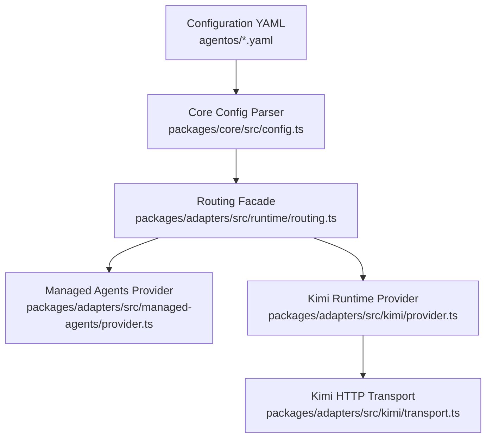
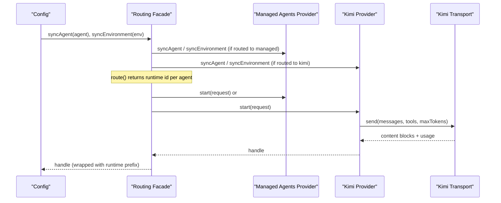
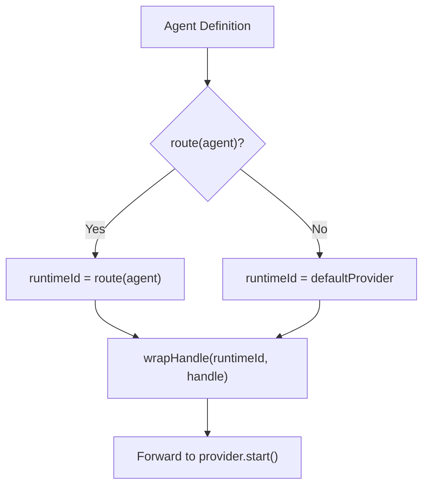
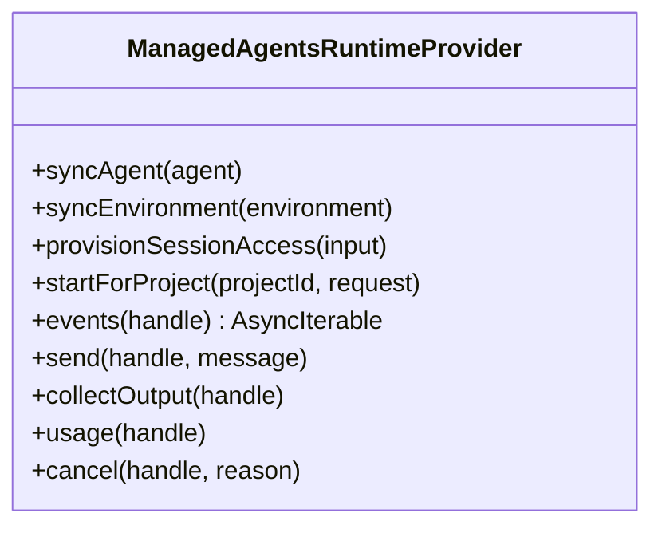
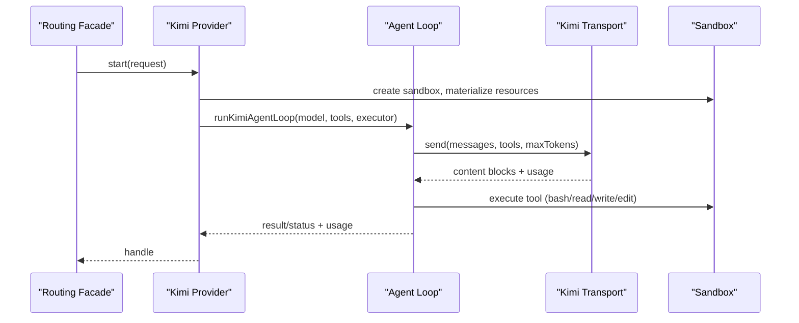
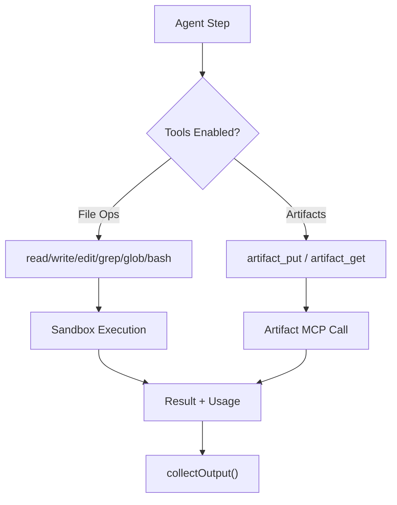
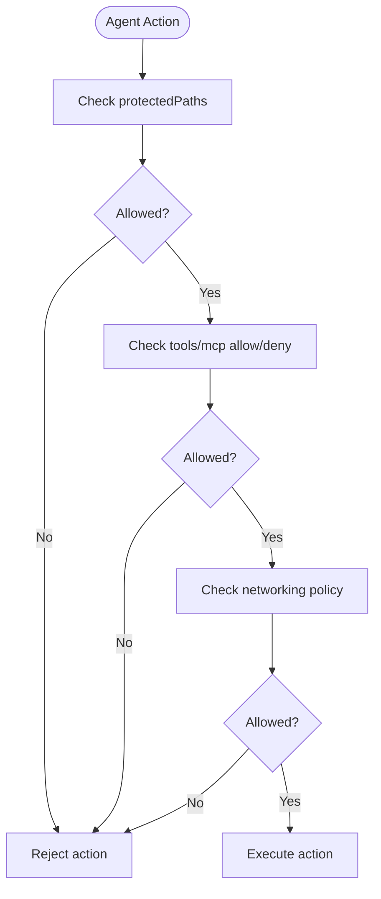
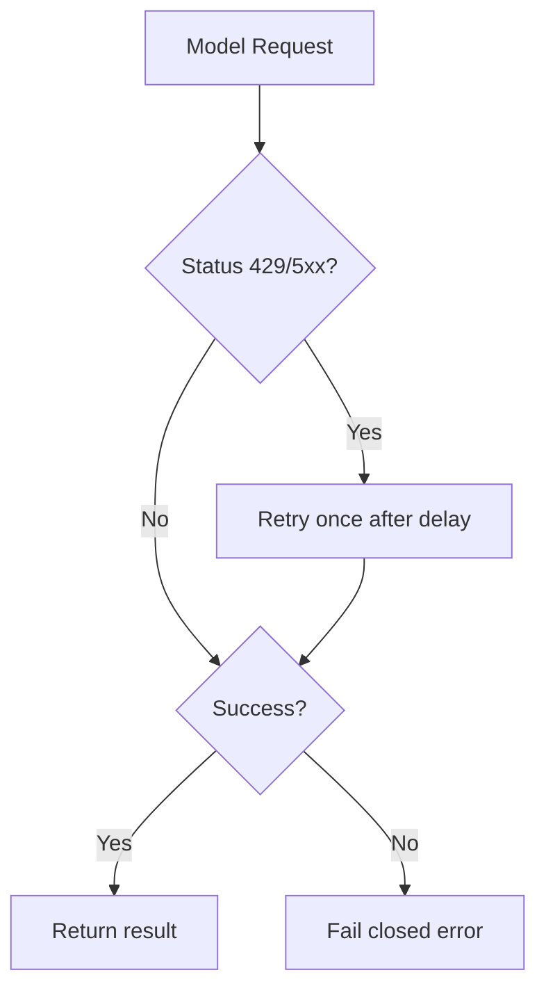
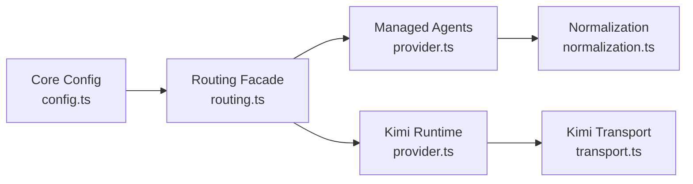

# Agents and Models

<cite>
**Referenced Files in This Document**
- [agent-os.yaml](file://agentos/agent-os.yaml)
- [example.yaml](file://agentos/example.yaml)
- [passerine.yaml](file://agentos/passerine.yaml)
- [config.ts](file://packages/core/src/config.ts)
- [routing.ts](file://packages/adapters/src/runtime/routing.ts)
- [provider.ts (Managed Agents)](file://packages/adapters/src/managed-agents/provider.ts)
- [provider.ts (Kimi)](file://packages/adapters/src/kimi/provider.ts)
- [transport.ts (Kimi)](file://packages/adapters/src/kimi/transport.ts)
- [kimi-runtime.md](file://docs/architecture/kimi-runtime.md)
- [2026-08-17-kimi-runtime-design.md](file://docs/superpowers/specs/2026-08-17-kimi-runtime-design.md)
</cite>

## Table of Contents
1. Introduction
2. Project Structure
3. Core Components
4. Architecture Overview
5. Detailed Component Analysis
6. Dependency Analysis
7. Performance Considerations
8. Troubleshooting Guide
9. Conclusion
10. Appendices

## Introduction
This document explains how Agent OS Passerine models agents as configuration entities that execute tasks using AI model providers. It covers supported providers, agent configuration options, tooling and artifact workflows, security boundaries, rate limiting, and fallback strategies when models are unavailable.

## Project Structure
Agent OS Passerine separates configuration from runtime:
- Configuration files define projects, model profiles, agents, environments, pipelines, policies, budgets, goals, and runtime routing.
- The core library validates configuration and exposes canonicalization utilities.
- Adapters implement runtime providers for different model backends and a router that dispatches sessions to the correct provider based on agent routing rules.

**Diagram sources**
- [config.ts:165-205](file://packages/core/src/config.ts#L165-L205)
- [routing.ts:51-177](file://packages/adapters/src/runtime/routing.ts#L51-L177)
- [provider.ts (Managed Agents):114-141](file://packages/adapters/src/managed-agents/provider.ts#L114-L141)
- [provider.ts (Kimi):273-298](file://packages/adapters/src/kimi/provider.ts#L273-L298)
- [transport.ts (Kimi):73-80](file://packages/adapters/src/kimi/transport.ts#L73-L80)

**Section sources**
- [agent-os.yaml:1-61](file://agentos/agent-os.yaml#L1-L61)
- [example.yaml:1-73](file://agentos/example.yaml#L1-L73)
- [passerine.yaml:1-252](file://agentos/passerine.yaml#L1-L252)
- [config.ts:165-205](file://packages/core/src/config.ts#L165-L205)

## Core Components
- Model profiles: Define provider, model name, pricing fields, and optional cache pricing.
- Agents: Bind a model profile, environment, tools, MCPs, retries, timeout, and optional prompt/instructions.
- Environments: Configure runtime type, variables, tools, MCPs, networking policy, and optional packages.
- Pipelines: Compose steps that invoke agents with dependencies and per-step overrides.
- Policies: Protect paths, restrict binaries/symlinks, cap file sizes, and allow/deny tools and MCPs.
- Budgets: Constrain workflow and daily spend, concurrency, and admission reserve.
- Goals: Limit steps, retries, and timeouts at the goal level.
- Runtime routing: Select default runtime and map model-provider identifiers to runtime identifiers.

Key configuration surfaces:
- ModelProfileSchema defines provider/model and cost fields used by budgeting and reporting.
- AgentDefinitionSchema binds an agent to a model profile and environment, plus tool/MCP lists and execution limits.
- EnvironmentDefinitionSchema controls runtime, networking, and capabilities.
- PipelineStepSchema composes agents into ordered steps with dependencies and per-step overrides.
- PatchPolicyConfigSchema enforces safety constraints on agent output and filesystem access.
- BudgetConfigSchema sets global spend and concurrency caps.
- GoalLimitsSchema constrains goal-level execution.
- RuntimeRoutingSchema selects default runtime and maps provider names to runtime IDs.

**Section sources**
- [config.ts:39-64](file://packages/core/src/config.ts#L39-L64)
- [config.ts:66-98](file://packages/core/src/config.ts#L66-L98)
- [config.ts:100-113](file://packages/core/src/config.ts#L100-L113)
- [config.ts:115-133](file://packages/core/src/config.ts#L115-L133)
- [config.ts:135-148](file://packages/core/src/config.ts#L135-L148)
- [config.ts:156-163](file://packages/core/src/config.ts#L156-L163)
- [config.ts:165-205](file://packages/core/src/config.ts#L165-L205)

## Architecture Overview
Agents are configured entities that run through a routing layer which dispatches each session to the appropriate runtime provider. Two primary providers are implemented:
- Managed Agents provider: Runs agents via a managed service; supports built-in web egress tools under policy control and integrates with remote resources, vaults, and events streaming.
- Kimi runtime provider: Self-hosted loop against Moonshot’s Anthropic-compatible Messages API with a local process sandbox for tool execution.

**Diagram sources**
- [routing.ts:51-177](file://packages/adapters/src/runtime/routing.ts#L51-L177)
- [provider.ts (Managed Agents):143-224](file://packages/adapters/src/managed-agents/provider.ts#L143-L224)
- [provider.ts (Kimi):300-421](file://packages/adapters/src/kimi/provider.ts#L300-L421)
- [transport.ts (Kimi):73-80](file://packages/adapters/src/kimi/transport.ts#L73-L80)

## Detailed Component Analysis

### Model Profiles and Routing
- Model profiles declare provider and model, plus microdollar costs for input/output tokens and runtime minutes. Optional cache pricing fields enable nuanced accounting.
- Routing selects the runtime provider per agent. The default provider is used unless a route function maps an agent to another runtime. The router prefixes handles to ensure later calls reach the same provider.

**Diagram sources**
- [routing.ts:51-177](file://packages/adapters/src/runtime/routing.ts#L51-L177)
- [routing.ts:190-195](file://packages/adapters/src/runtime/routing.ts#L190-L195)

**Section sources**
- [config.ts:39-64](file://packages/core/src/config.ts#L39-L64)
- [config.ts:143-148](file://packages/core/src/config.ts#L143-L148)
- [routing.ts:51-177](file://packages/adapters/src/runtime/routing.ts#L51-L177)

### Managed Agents Provider
- Syncs agents and environments to the managed service, enforcing policy constraints such as disabling built-in web egress tools unless allowed.
- Provisions session access with scoped credentials and files, then creates sessions with metadata, budgets, and deadlines.
- Streams events with bounded collection and reconnect logic; enforces limits on event size, output bytes, and stream duration.

**Diagram sources**
- [provider.ts (Managed Agents):114-141](file://packages/adapters/src/managed-agents/provider.ts#L114-L141)
- [provider.ts (Managed Agents):226-360](file://packages/adapters/src/managed-agents/provider.ts#L226-L360)
- [provider.ts (Managed Agents):464-553](file://packages/adapters/src/managed-agents/provider.ts#L464-L553)
- [provider.ts (Managed Agents):633-710](file://packages/adapters/src/managed-agents/provider.ts#L633-L710)

**Section sources**
- [provider.ts (Managed Agents):143-224](file://packages/adapters/src/managed-agents/provider.ts#L143-L224)
- [provider.ts (Managed Agents):226-360](file://packages/adapters/src/managed-agents/provider.ts#L226-L360)
- [provider.ts (Managed Agents):464-553](file://packages/adapters/src/managed-agents/provider.ts#L464-L553)
- [provider.ts (Managed Agents):633-710](file://packages/adapters/src/managed-agents/provider.ts#L633-L710)

### Kimi Runtime Provider
- Implements a self-hosted runtime provider that runs an agent loop against Moonshot’s Anthropic-compatible Messages API.
- Tools include bash, read, write, edit, submit_result, and optional artifact_put/artifact_get when credential refs are provided.
- Bash commands are bounded by a maximum timeout and executed in a path-confined sandbox; observeCommand runs without secrets.

**Diagram sources**
- [provider.ts (Kimi):300-421](file://packages/adapters/src/kimi/provider.ts#L300-L421)
- [provider.ts (Kimi):701-712](file://packages/adapters/src/kimi/provider.ts#L701-L712)
- [transport.ts (Kimi):73-80](file://packages/adapters/src/kimi/transport.ts#L73-L80)
- [kimi-runtime.md:13-32](file://docs/architecture/kimi-runtime.md#L13-L32)

**Section sources**
- [provider.ts (Kimi):70-180](file://packages/adapters/src/kimi/provider.ts#L70-L180)
- [provider.ts (Kimi):300-421](file://packages/adapters/src/kimi/provider.ts#L300-L421)
- [provider.ts (Kimi):714-800](file://packages/adapters/src/kimi/provider.ts#L714-L800)
- [transport.ts (Kimi):1-80](file://packages/adapters/src/kimi/transport.ts#L1-L80)
- [kimi-runtime.md:13-32](file://docs/architecture/kimi-runtime.md#L13-L32)

### Agent Tooling and Artifacts
- Agents can be granted tools like read, glob, grep, edit, write, bash, and artifact operations.
- Artifact interactions go through the Artifact MCP when enabled; the provider injects artifact_put and artifact_get tools only when credential references are present.
- Output artifacts are collected and returned via collectOutput alongside usage metrics.

**Diagram sources**
- [provider.ts (Kimi):408-418](file://packages/adapters/src/kimi/provider.ts#L408-L418)
- [provider.ts (Kimi):758-800](file://packages/adapters/src/kimi/provider.ts#L758-L800)
- [provider.ts (Managed Agents):226-360](file://packages/adapters/src/managed-agents/provider.ts#L226-L360)

**Section sources**
- [provider.ts (Kimi):70-180](file://packages/adapters/src/kimi/provider.ts#L70-L180)
- [provider.ts (Kimi):758-800](file://packages/adapters/src/kimi/provider.ts#L758-L800)
- [provider.ts (Managed Agents):226-360](file://packages/adapters/src/managed-agents/provider.ts#L226-L360)

### Security Boundaries and Policy Enforcement
- Protected paths prevent writes to sensitive locations (e.g., .git, .github/workflows, CODEOWNERS, .env*).
- Binary and symlink writing can be disallowed; file size limits apply.
- Tool and MCP allow/deny lists constrain agent capabilities.
- Networking policies limit outbound access; unrestricted networking requires explicit allowance.
- Built-in web egress tools are disabled by policy unless permitted.

**Diagram sources**
- [config.ts:115-124](file://packages/core/src/config.ts#L115-L124)
- [provider.ts (Managed Agents):159-167](file://packages/adapters/src/managed-agents/provider.ts#L159-L167)
- [provider.ts (Managed Agents):380-393](file://packages/adapters/src/managed-agents/provider.ts#L380-L393)

**Section sources**
- [config.ts:115-124](file://packages/core/src/config.ts#L115-L124)
- [provider.ts (Managed Agents):159-167](file://packages/adapters/src/managed-agents/provider.ts#L159-L167)
- [provider.ts (Managed Agents):380-393](file://packages/adapters/src/managed-agents/provider.ts#L380-L393)

### Rate Limiting and Fallback Strategies
- Kimi transport retries once on 429/5xx responses after a fixed delay; other errors fail closed.
- Managed Agents streaming enforces max stream duration and reconnect limits; exceeds throw limit errors.
- Routing ensures unknown or unregistered providers fail closed; missing KIMI_API_KEY disables Kimi routing.
- Composition rejects invalid routing configurations; unknown routes fall back to default provider where safe.

**Diagram sources**
- [transport.ts (Kimi):1-80](file://packages/adapters/src/kimi/transport.ts#L1-L80)
- [provider.ts (Managed Agents):633-710](file://packages/adapters/src/managed-agents/provider.ts#L633-L710)
- [routing.ts:51-76](file://packages/adapters/src/runtime/routing.ts#L51-L76)

**Section sources**
- [transport.ts (Kimi):1-80](file://packages/adapters/src/kimi/transport.ts#L1-L80)
- [provider.ts (Managed Agents):633-710](file://packages/adapters/src/managed-agents/provider.ts#L633-L710)
- [routing.ts:51-76](file://packages/adapters/src/runtime/routing.ts#L51-L76)

## Dependency Analysis
- Core config types drive validation across all adapters; changes propagate to both managed and kimi providers.
- Routing facade depends on registered providers and uses handle wrapping to maintain ownership semantics.
- Kimi provider depends on transport and sandbox; managed provider depends on SDK contract and normalization utilities.

**Diagram sources**
- [config.ts:165-205](file://packages/core/src/config.ts#L165-L205)
- [routing.ts:51-177](file://packages/adapters/src/runtime/routing.ts#L51-L177)
- [provider.ts (Managed Agents):114-141](file://packages/adapters/src/managed-agents/provider.ts#L114-L141)
- [provider.ts (Kimi):273-298](file://packages/adapters/src/kimi/provider.ts#L273-L298)
- [transport.ts (Kimi):73-80](file://packages/adapters/src/kimi/transport.ts#L73-L80)

**Section sources**
- [routing.ts:51-177](file://packages/adapters/src/runtime/routing.ts#L51-L177)
- [provider.ts (Managed Agents):114-141](file://packages/adapters/src/managed-agents/provider.ts#L114-L141)
- [provider.ts (Kimi):273-298](file://packages/adapters/src/kimi/provider.ts#L273-L298)

## Performance Considerations
- Use model profiles with accurate pricing to inform budget enforcement and observability.
- Prefer limited networking and minimal tool sets to reduce overhead and risk.
- Set per-agent timeouts and retries to balance robustness and resource use.
- Leverage pipeline step dependencies to parallelize independent work safely.
- Monitor usage via runtime usage endpoints and adjust budgets accordingly.

[No sources needed since this section provides general guidance]

## Troubleshooting Guide
Common issues and resolutions:
- Unknown model profile or environment: Ensure agents reference defined models and environments; validation will report specific paths.
- Unknown pipeline dependency or cycle: Fix step ids and remove circular dependencies; validation detects cycles.
- Missing KIMI_API_KEY: Kimi routing is disabled; set the environment variable or route to managed provider.
- Session not submitted: Kimi sessions must call submit_result; otherwise collectOutput throws with status details.
- Streaming limits exceeded: Managed Agents events may exceed limits; adjust consumer logic or increase limits cautiously.

**Section sources**
- [config.ts:207-327](file://packages/core/src/config.ts#L207-L327)
- [provider.ts (Kimi):560-577](file://packages/adapters/src/kimi/provider.ts#L560-L577)
- [provider.ts (Managed Agents):633-710](file://packages/adapters/src/managed-agents/provider.ts#L633-L710)

## Conclusion
Agent OS Passerine models agents as declarative configuration entities bound to model profiles and environments. A routing layer dispatches sessions to either a managed provider or a self-hosted Kimi runtime, enforcing strict security policies, budgets, and rate limits. By carefully configuring tools, MCPs, and pipelines, teams can build reliable workflows for code generation, testing, and documentation while maintaining strong safety and cost controls.

[No sources needed since this section summarizes without analyzing specific files]

## Appendices

### Supported Providers and Model Selection
- Anthropic Managed Agents: Default provider; supports built-in web egress tools under policy control.
- Kimi (Moonshot): Self-hosted runtime using Anthropic-compatible Messages API; requires KIMI_API_KEY and optional KIMI_BASE_URL.
- OpenAI: Not implemented as a runtime provider in this repository; configuration examples referencing OpenAI would require a custom provider implementation.

**Section sources**
- [provider.ts (Managed Agents):114-141](file://packages/adapters/src/managed-agents/provider.ts#L114-L141)
- [provider.ts (Kimi):273-298](file://packages/adapters/src/kimi/provider.ts#L273-L298)
- [transport.ts (Kimi):73-80](file://packages/adapters/src/kimi/transport.ts#L73-L80)
- [2026-08-17-kimi-runtime-design.md:1-39](file://docs/superpowers/specs/2026-08-17-kimi-runtime-design.md#L1-L39)

### Example Agent Configurations
- Code generation: Assign a model profile with sufficient context window and enable file-editing tools; set retries and timeout appropriate for large diffs.
- Testing: Use a model profile optimized for reasoning; enable bash tool to run tests; enforce limited networking and strict policies.
- Documentation: Use a lightweight model profile; enable read/grep tools; disable write/bash to minimize risk.

Reference example configurations:
- Local test setup with standard model profile and implementer agent.
- Feature pipeline with specification, planning, implementation, review, and verification steps using Anthropic-managed agents.
- Kimi routing example showing how to route a model profile to the kimi runtime.

**Section sources**
- [agent-os.yaml:1-61](file://agentos/agent-os.yaml#L1-L61)
- [passerine.yaml:1-252](file://agentos/passerine.yaml#L1-L252)
- [example.yaml:1-73](file://agentos/example.yaml#L1-L73)