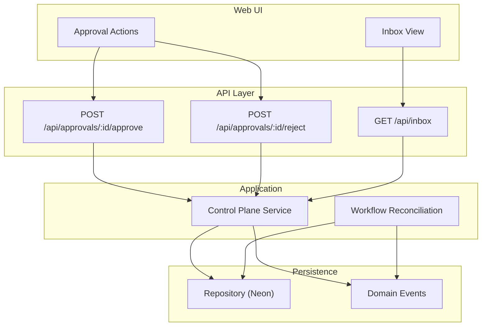
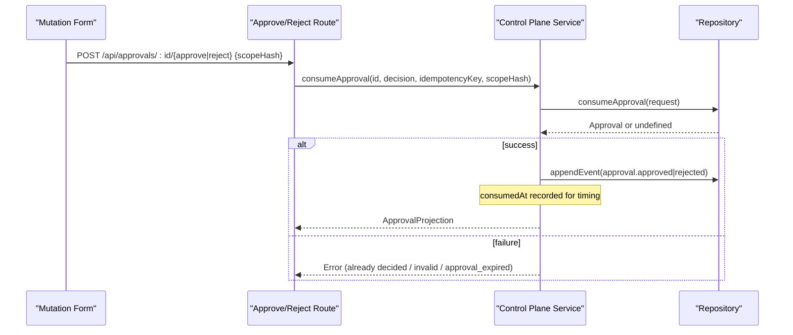
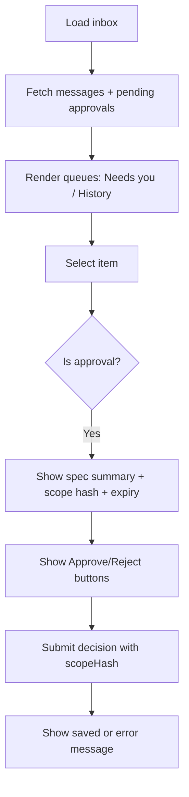
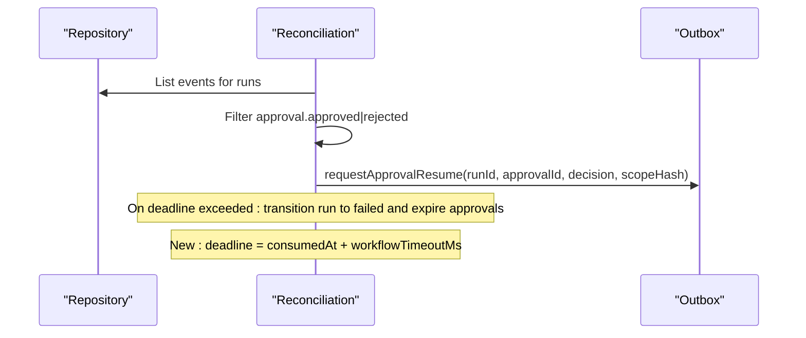
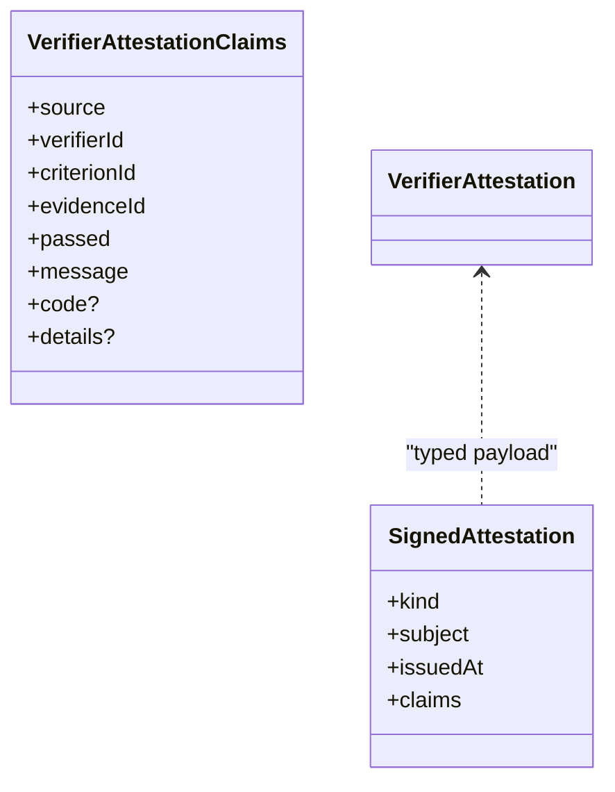
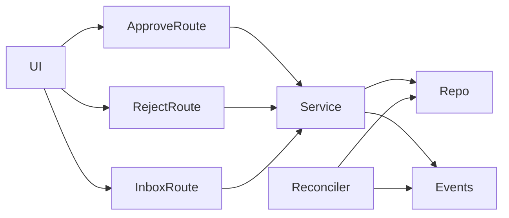

# Approvals and Human Intervention

<cite>
**Referenced Files in This Document**
- [passerine.yaml](file://agentos/passerine.yaml)
- [route.ts (approve)](file://apps/control-plane/app/api/approvals/[id]/approve/route.ts)
- [route.ts (reject)](file://apps/control-plane/app/api/approvals/[id]/reject/route.ts)
- [control-plane-service.ts](file://apps/control-plane/src/application/control-plane-service.ts)
- [workflow-reconciliation.ts](file://apps/control-plane/src/application/workflow-reconciliation.ts)
- [inbox route.ts](file://apps/control-plane/app/api/inbox/route.ts)
- [inbox-view.tsx](file://apps/control-plane/src/ui/inbox-view.tsx)
- [mutation-forms.tsx](file://apps/control-plane/src/ui/mutation-forms.tsx)
- [inbox-view-model.ts](file://apps/control-plane/src/ui/inbox-view-model.ts)
- [neon-repository.ts](file://packages/adapters/src/persistence/neon-repository.ts)
- [goal-verifier.ts](file://packages/adapters/src/trigger/goal-verifier.ts)
- [dod.ts](file://packages/core/src/dod.ts)
- [attestation.test.ts](file://packages/core/src/attestation.test.ts)
- [commands.test.ts](file://apps/cli/src/commands.test.ts)
- [workflow.ts](file://packages/adapters/src/trigger/workflow.ts)
- [types.ts](file://packages/adapters/src/trigger/types.ts)
</cite>

## Update Summary
**Changes Made**
- Updated approval workflow section to reflect dedicated 24-hour approval TTL independent from workflow timeout
- Enhanced deadline calculation documentation based on consumedAt timestamp rather than createdAt
- Added error handling details for approval_consumed_at_missing validation
- Updated workflow resumption flow to show improved timing logic

## Table of Contents
1. Introduction
2. Project Structure
3. Core Components
4. Architecture Overview
5. Detailed Component Analysis
6. Dependency Analysis
7. Performance Considerations
8. Troubleshooting Guide
9. Conclusion
10. Appendices

## Introduction
This document explains how Agent OS Passerine integrates human decision points into automated workflows for critical operations such as specification approval, code review gating, and policy exceptions. It covers the full lifecycle of an approval: creation, notification and inbox presentation, decision recording, audit trails, expiration handling, and workflow resumption. It also documents attestation-based verification to ensure integrity of Definition-of-Done checks, and provides guidance on CLI and web interactions, escalation paths, bulk operations, delegation, expiration policies, and integration with external systems.

**Updated** The approval workflow now features a dedicated 24-hour approval TTL (approvalTtlMs) that is independent from the workflow timeout, providing more predictable approval windows and improved deadline calculation based on the consumedAt timestamp rather than createdAt.

## Project Structure
Approvals are part of a broader control plane that orchestrates agent-driven pipelines. The key pieces involved in approvals and human intervention include:
- API routes for approve/reject decisions
- A service layer that creates approvals, enforces idempotency, records decisions, and emits events
- An inbox UI and API to present pending approvals and allow operators to act
- Persistence for approvals, messages, and domain events
- Workflow reconciliation that resumes runs after approvals and handles expiration/cancellation
- Attestation utilities used by Definition-of-Done verifiers to produce signed findings



**Diagram sources**
- [route.ts (approve):11-32](file://apps/control-plane/app/api/approvals/[id]/approve/route.ts#L11-L32)
- [route.ts (reject):11-32](file://apps/control-plane/app/api/approvals/[id]/reject/route.ts#L11-L32)
- [inbox route.ts:11-32](file://apps/control-plane/app/api/inbox/route.ts#L11-L32)
- [control-plane-service.ts:1311-1433](file://apps/control-plane/src/application/control-plane-service.ts#L1311-L1433)
- [workflow-reconciliation.ts:472-495](file://apps/control-plane/src/application/workflow-reconciliation.ts#L472-L495)
- [neon-repository.ts:906-994](file://packages/adapters/src/persistence/neon-repository.ts#L906-L994)

**Section sources**
- [passerine.yaml:205-217](file://agentos/passerine.yaml#L205-L217)
- [route.ts (approve):11-32](file://apps/control-plane/app/api/approvals/[id]/approve/route.ts#L11-L32)
- [route.ts (reject):11-32](file://apps/control-plane/app/api/approvals/[id]/reject/route.ts#L11-L32)
- [inbox route.ts:11-32](file://apps/control-plane/app/api/inbox/route.ts#L11-L32)
- [control-plane-service.ts:1311-1433](file://apps/control-plane/src/application/control-plane-service.ts#L1311-L1433)
- [workflow-reconciliation.ts:472-495](file://apps/control-plane/src/application/workflow-reconciliation.ts#L472-L495)
- [neon-repository.ts:906-994](file://packages/adapters/src/persistence/neon-repository.ts#L906-L994)

## Core Components
- Approval creation and projection: The service creates approvals with deterministic IDs, fingerprints, and expiry times; it projects status including derived "expired" when past deadline.
- Decision endpoints: Authenticated POST endpoints accept approve or reject with a scope hash and idempotency key.
- Inbox listing: Aggregates pending approvals and messages for operator attention.
- UI actions: Web UI renders approval context and exposes Approve/Reject buttons; CLI supports equivalent commands.
- Persistence: Repository methods create, list, consume, and expire approvals atomically with time guards.
- Workflow resumption: Reconciliation scans events and dispatches resume requests carrying decision and scope hash.
- Attestation: Definition-of-Done verifiers issue signed attestations for criterion results, enabling tamper-evident evidence.

**Updated** The approval workflow now uses a dedicated 24-hour approval TTL (approvalTtlMs) separate from workflow timeout, with improved deadline calculation starting from the consumedAt timestamp rather than createdAt.

**Section sources**
- [control-plane-service.ts:265-386](file://apps/control-plane/src/application/control-plane-service.ts#L265-L386)
- [control-plane-service.ts:1311-1433](file://apps/control-plane/src/application/control-plane-service.ts#L1311-L1433)
- [inbox route.ts:11-32](file://apps/control-plane/app/api/inbox/route.ts#L11-L32)
- [inbox-view.tsx:62-176](file://apps/control-plane/src/ui/inbox-view.tsx#L62-L176)
- [mutation-forms.tsx:56-92](file://apps/control-plane/src/ui/mutation-forms.tsx#L56-L92)
- [neon-repository.ts:906-994](file://packages/adapters/src/persistence/neon-repository.ts#L906-L994)
- [workflow-reconciliation.ts:472-495](file://apps/control-plane/src/application/workflow-reconciliation.ts#L472-L495)
- [dod.ts:53-159](file://packages/core/src/dod.ts#L53-L159)
- [goal-verifier.ts:118-143](file://packages/adapters/src/trigger/goal-verifier.ts#L118-L143)

## Architecture Overview
The approval flow integrates human intervention between automated steps. A typical feature pipeline triggers a specification step that produces artifacts and then pauses for human approval before implementation proceeds.

**Updated** The workflow now uses a dedicated approval TTL of 24 hours, independent from the workflow execution timeout. After approval consumption, the workflow execution deadline is calculated from the consumedAt timestamp plus the workflow timeout, providing more accurate timing for post-approval execution.

```mermaid
sequenceDiagram
participant Spec as "Specification Agent"
participant Service as "Control Plane Service"
participant Repo as "Repository"
participant UI as "Inbox UI"
participant Operator as "Operator"
participant Reconciler as "Workflow Reconciliation"
Spec->>Service : Create approval (runId, scope, expiresAt)
Note over Service : expiresAt = createdAt + approvalTtlMs (24h)
Service->>Repo : Insert approval (pending, fingerprint, expiresAt)
Note over Service,Repo : Idempotent by key; conflict if mismatched
Service-->>UI : Pending approval appears in inbox
UI->>Operator : Show scope preview, requirements, DoD criteria
Operator->>UI : Click Approve or Reject
UI->>Service : POST /api/approvals/ : id/{approve|reject} {scopeHash}
Service->>Repo : Consume approval (atomic guard : pending + not expired)
Repo-->>Service : Updated approval with consumedAt
Service->>Repo : Append event (approval.approved or approval.rejected)
Reconciler->>Repo : Scan events
Reconciler->>Service : requestApprovalResume(runId, approvalId, decision, scopeHash)
Note over Reconciler : Execution deadline = consumedAt + workflowTimeoutMs
Service-->>Reconciler : Resume intent queued
```

**Diagram sources**
- [control-plane-service.ts:1311-1433](file://apps/control-plane/src/application/control-plane-service.ts#L1311-L1433)
- [neon-repository.ts:949-968](file://packages/adapters/src/persistence/neon-repository.ts#L949-968)
- [workflow-reconciliation.ts:472-495](file://apps/control-plane/src/application/workflow-reconciliation.ts#L472-L495)
- [workflow.ts:1220-1237](file://packages/adapters/src/trigger/workflow.ts#L1220-L1237)
- [workflow.ts:1351-1359](file://packages/adapters/src/trigger/workflow.ts#L1351-L1359)
- [inbox-view.tsx:62-176](file://apps/control-plane/src/ui/inbox-view.tsx#L62-L176)
- [mutation-forms.tsx:56-92](file://apps/control-plane/src/ui/mutation-forms.tsx#L56-L92)

## Detailed Component Analysis

### Approval Creation and Projection
- Deterministic ID generation and fingerprinting ensure each approval is uniquely bound to its run and scope.
- Expiry is enforced both at read time (projection marks expired) and write time (consume guard).
- Summary enrichment reads spec artifacts to show title, requirements, and DoD criteria in the inbox.

**Updated** Approval expiration is now calculated as `createdAt + approvalTtlMs` (24 hours), providing a dedicated approval window independent from workflow execution time.

```mermaid
flowchart TD
Start(["createApproval"]) --> Build["Build approval record<br/>id, runId, scope, fingerprint, expiresAt"]
Build --> CheckExisting{"Existing approval?"}
CheckExisting --> |Yes| ValidateKey{"Keys match?"}
ValidateKey --> |No| Conflict["Throw idempotency_conflict"]
ValidateKey --> |Yes| ReturnExisting["Return projected existing"]
CheckExisting --> |No| Persist["Persist approval"]
Note over Persist : expiresAt = createdAt + approvalTtlMs (24h)
Persist --> Project["Project with derived expired status"]
Project --> End(["ApprovalProjection"])
```

**Diagram sources**
- [control-plane-service.ts:1311-1344](file://apps/control-plane/src/application/control-plane-service.ts#L1311-L1344)
- [control-plane-service.ts:368-386](file://apps/control-plane/src/application/control-plane-service.ts#L368-L386)
- [workflow.ts:1220-1237](file://packages/adapters/src/trigger/workflow.ts#L1220-L1237)

**Section sources**
- [control-plane-service.ts:1311-1344](file://apps/control-plane/src/application/control-plane-service.ts#L1311-L1344)
- [control-plane-service.ts:368-386](file://apps/control-plane/src/application/control-plane-service.ts#L368-L386)
- [control-plane-service.ts:1631-1667](file://apps/control-plane/src/application/control-plane-service.ts#L1631-L1667)
- [workflow.ts:1220-1237](file://packages/adapters/src/trigger/workflow.ts#L1220-L1237)

### Decision Endpoints (Approve/Reject)
- Both endpoints require authentication and validate input schemas.
- They call the service's consumeApproval with a bounded path ID, decision type, idempotency key, and scope hash.
- Errors like already decided or invalid/expired approvals surface as client-friendly messages.

**Updated** The approval consumption process now includes enhanced validation for approval_consumed_at_missing scenarios, ensuring data integrity when workflows resume after approval.



**Diagram sources**
- [route.ts (approve):11-32](file://apps/control-plane/app/api/approvals/[id]/approve/route.ts#L11-L32)
- [route.ts (reject):11-32](file://apps/control-plane/app/api/approvals/[id]/reject/route.ts#L11-L32)
- [control-plane-service.ts:1392-1433](file://apps/control-plane/src/application/control-plane-service.ts#L1392-L1433)
- [neon-repository.ts:949-968](file://packages/adapters/src/persistence/neon-repository.ts#L949-968)

**Section sources**
- [route.ts (approve):11-32](file://apps/control-plane/app/api/approvals/[id]/approve/route.ts#L11-L32)
- [route.ts (reject):11-32](file://apps/control-plane/app/api/approvals/[id]/reject/route.ts#L11-L32)
- [control-plane-service.ts:1392-1433](file://apps/control-plane/src/application/control-plane-service.ts#L1392-L1433)
- [mutation-forms.tsx:5-27](file://apps/control-plane/src/ui/mutation-forms.tsx#L5-L27)

### Inbox Presentation and Operator Actions
- The inbox lists pending approvals alongside messages and notifications.
- For spec approvals, the UI shows a human-readable summary extracted from artifacts (title, requirements, DoD criteria).
- Operators can approve or reject directly from the inbox; the UI sends idempotent requests and displays server-provided error messages.



**Diagram sources**
- [inbox route.ts:11-32](file://apps/control-plane/app/api/inbox/route.ts#L11-L32)
- [inbox-view.tsx:62-176](file://apps/control-plane/src/ui/inbox-view.tsx#L62-L176)
- [mutation-forms.tsx:56-92](file://apps/control-plane/src/ui/mutation-forms.tsx#L56-L92)

**Section sources**
- [inbox route.ts:11-32](file://apps/control-plane/app/api/inbox/route.ts#L11-L32)
- [inbox-view.tsx:62-176](file://apps/control-plane/src/ui/inbox-view.tsx#L62-L176)
- [inbox-view-model.ts:95-169](file://apps/control-plane/src/ui/inbox-view-model.ts#L95-L169)
- [mutation-forms.tsx:56-92](file://apps/control-plane/src/ui/mutation-forms.tsx#L56-L92)

### Workflow Resumption and Expiration Handling
- After a decision event is appended, reconciliation detects it and dispatches a resume request with the decision and scope hash.
- If a workflow exceeds its timeout, reconciliation transitions it to failed and expires any pending approvals tied to that run.

**Updated** The workflow now calculates the execution deadline based on the approval's consumedAt timestamp plus the workflow timeout, rather than using the original run creation time. This provides more accurate timing for post-approval execution phases.



**Diagram sources**
- [workflow-reconciliation.ts:472-495](file://apps/control-plane/src/application/workflow-reconciliation.ts#L472-L495)
- [workflow-reconciliation.ts:214-265](file://apps/control-plane/src/application/workflow-reconciliation.ts#L214-L265)
- [workflow.ts:1351-1359](file://packages/adapters/src/trigger/workflow.ts#L1351-L1359)

**Section sources**
- [workflow-reconciliation.ts:214-265](file://apps/control-plane/src/application/workflow-reconciliation.ts#L214-L265)
- [workflow-reconciliation.ts:472-495](file://apps/control-plane/src/application/workflow-reconciliation.ts#L472-L495)
- [workflow.ts:1351-1359](file://packages/adapters/src/trigger/workflow.ts#L1351-L1359)

### Attestation-Based Verification for DoD Integrity
- Verifiers produce signed attestations for criterion evaluations, binding verifier identity, criterion ID, evidence ID, and result.
- The core attestation library supports issuance and verification with HMAC keys, ensuring persistence-safe round-trips.



**Diagram sources**
- [dod.ts:53-159](file://packages/core/src/dod.ts#L53-L159)
- [goal-verifier.ts:118-143](file://packages/adapters/src/trigger/goal-verifier.ts#L118-L143)
- [attestation.test.ts:1-37](file://packages/core/src/attestation.test.ts#L1-L37)

**Section sources**
- [dod.ts:53-159](file://packages/core/src/dod.ts#L53-L159)
- [goal-verifier.ts:118-143](file://packages/adapters/src/trigger/goal-verifier.ts#L118-L143)
- [attestation.test.ts:1-37](file://packages/core/src/attestation.test.ts#L1-L37)

### CLI Integration for Approvals
- The CLI maps inbox commands to exact server contracts, including approve and reject with required fields and idempotency keys.

**Section sources**
- [commands.test.ts:78-129](file://apps/cli/src/commands.test.ts#L78-L129)

## Dependency Analysis
- API routes depend on authentication and contract validation, delegating to the control plane service.
- The service depends on repository methods for atomic approval consumption and event appending.
- Reconciliation depends on event scanning and outbox dispatch to resume workflows based on approval decisions.
- UI components depend on inbox data models and mutation forms to render actionable items and send decisions.

**Updated** The workflow now has clearer separation between approval TTL (24 hours) and workflow execution timeout, with improved timing calculations based on consumedAt timestamps.



**Diagram sources**
- [route.ts (approve):11-32](file://apps/control-plane/app/api/approvals/[id]/approve/route.ts#L11-L32)
- [route.ts (reject):11-32](file://apps/control-plane/app/api/approvals/[id]/reject/route.ts#L11-L32)
- [inbox route.ts:11-32](file://apps/control-plane/app/api/inbox/route.ts#L11-L32)
- [control-plane-service.ts:1311-1433](file://apps/control-plane/src/application/control-plane-service.ts#L1311-L1433)
- [workflow-reconciliation.ts:472-495](file://apps/control-plane/src/application/workflow-reconciliation.ts#L472-L495)

**Section sources**
- [control-plane-service.ts:1311-1433](file://apps/control-plane/src/application/control-plane-service.ts#L1311-L1433)
- [workflow-reconciliation.ts:472-495](file://apps/control-plane/src/application/workflow-reconciliation.ts#L472-L495)
- [neon-repository.ts:906-994](file://packages/adapters/src/persistence/neon-repository.ts#L906-L994)

## Performance Considerations
- Atomic consume operation prevents race conditions and double-decisions.
- Projection derives "expired" status at read time to avoid stale UI states while reconciliation updates persisted status later.
- Pagination and bounded limits protect listing endpoints and reconciliation loops.
- Idempotency keys on decisions prevent duplicate processing under retries or network issues.

**Updated** The dedicated approval TTL provides better performance predictability by separating approval waiting time from execution budget, allowing longer approval windows without affecting workflow timeouts.

[No sources needed since this section provides general guidance]

## Troubleshooting Guide
Common errors and their meanings:
- Already decided: Attempting to approve/reject an approval that has been consumed.
- Invalid/expired: Attempting to decide after the approval's expiry window.
- Not found: Approval ID does not exist or is not associated with the current run.
- Idempotency conflict: Duplicate creation attempt with mismatched parameters.
- **New**: approval_consumed_at_missing: Workflow attempted to resume but approval lacks consumedAt timestamp, indicating data integrity issue.

Operational tips:
- Use the inbox to view scope previews, expiry times, and decisions.
- When errors occur, the UI surfaces server messages to guide retry behavior.
- For automation, always include idempotency keys and verify response codes.
- Monitor approval consumption timing to ensure workflows start within expected deadlines.

**Updated** Enhanced error handling now provides more specific error messages for approval_consumed_at_missing scenarios, helping identify data integrity issues during workflow resumption.

**Section sources**
- [control-plane-service.ts:1392-1433](file://apps/control-plane/src/application/control-plane-service.ts#L1392-L1433)
- [mutation-forms.tsx:5-27](file://apps/control-plane/src/ui/mutation-forms.tsx#L5-L27)
- [neon-repository.ts:949-994](file://packages/adapters/src/persistence/neon-repository.ts#L949-994)
- [workflow.ts:1351-1359](file://packages/adapters/src/trigger/workflow.ts#L1351-L1359)

## Conclusion
Agent OS Passerine embeds human intervention at critical points through durable, auditable approvals. The system ensures integrity via fingerprints, expiry enforcement, atomic consumption, and signed attestations for Definition-of-Done verification. Operators interact via a clear inbox UI or CLI, while reconciliation safely resumes workflows based on recorded decisions. This design balances automation with accountability, enabling safe execution of changes that affect repositories and policies.

**Updated** The enhanced approval workflow with dedicated 24-hour TTL and improved deadline calculation provides more predictable timing and better separation between approval waiting periods and execution budgets, improving overall workflow reliability and user experience.

[No sources needed since this section summarizes without analyzing specific files]

## Appendices

### Approval Scenarios and Examples
- Specification approval: After the specification agent produces artifacts, the system creates an approval showing title, requirements, and DoD criteria. Operators approve to proceed to implementation or reject to stop the run.
- Code review gating: Review outputs can be paired with DoD verification; approvals may gate merges or deployments depending on policy configuration.
- Policy exceptions: When a workflow touches protected paths or requires tool/MCP exceptions, an approval can enforce human oversight before execution.

**Updated** With the new approval TTL system, specifications have up to 24 hours for human review regardless of workflow execution timeout, providing more flexibility for complex approval processes.

**Section sources**
- [passerine.yaml:205-217](file://agentos/passerine.yaml#L205-L217)
- [passerine.yaml:218-239](file://agentos/passerine.yaml#L218-L239)

### Escalation Paths
- If an approval remains pending beyond a threshold, consider escalating to additional reviewers or auto-expiring the request to prevent indefinite stalls.
- On workflow timeouts, reconciliation fails the run and expires pending approvals, prompting re-initiation after remediation.

**Updated** The dedicated approval TTL allows for longer escalation windows without affecting workflow execution budgets, making it easier to handle complex multi-stage approval processes.

**Section sources**
- [workflow-reconciliation.ts:214-265](file://apps/control-plane/src/application/workflow-reconciliation.ts#L214-L265)

### Bulk Approval Operations
- The inbox lists multiple pending approvals per project/run. While individual decisions are atomic, operators can batch actions by selecting multiple items and submitting decisions sequentially with distinct idempotency keys.
- Automation can iterate over pending approvals via the inbox API and submit decisions programmatically, respecting rate limits and idempotency.

**Section sources**
- [inbox route.ts:11-32](file://apps/control-plane/app/api/inbox/route.ts#L11-L32)
- [commands.test.ts:78-129](file://apps/cli/src/commands.test.ts#L78-L129)

### Delegation and Expiration Policies
- Delegation: Assign approvers by configuring project-level policies or roles outside the control plane; the approval UI shows who must act based on access controls.
- Expiration: Each approval carries an expiresAt timestamp; projections mark expired items, and reconciliation expires pending approvals on workflow timeouts. Configure TTLs appropriate to your team's SLAs.

**Updated** The approval TTL is now configurable separately from workflow timeout, allowing teams to set appropriate approval windows (default 24 hours) independent of execution budgets.

**Section sources**
- [control-plane-service.ts:368-386](file://apps/control-plane/src/application/control-plane-service.ts#L368-L386)
- [workflow-reconciliation.ts:214-265](file://apps/control-plane/src/application/workflow-reconciliation.ts#L214-L265)
- [types.ts:22-33](file://packages/adapters/src/trigger/types.ts#L22-L33)

### Integration with External Approval Systems
- Extend the control plane by integrating with external approval providers via outbox hooks or custom adapters. Emit approval events and reconcile them into the same resume flow.
- Use attestations to carry verified outcomes from external systems back into the workflow, ensuring consistent audit trails.

**Section sources**
- [workflow.ts:1351-1359](file://packages/adapters/src/trigger/workflow.ts#L1351-L1359)

### Approval Timing Configuration
**New Section** The approval workflow now features separate timing configurations:

- **Approval TTL (approvalTtlMs)**: Default 24 hours - maximum time allowed for human approval
- **Workflow Timeout (workflowTimeoutMs)**: Default 1 hour - execution budget after approval consumption
- **Deadline Calculation**: Post-approval execution starts from consumedAt + workflowTimeoutMs

This separation provides better predictability and allows for longer approval windows without impacting execution budgets.

**Section sources**
- [types.ts:22-33](file://packages/adapters/src/trigger/types.ts#L22-L33)
- [workflow.ts:1220-1237](file://packages/adapters/src/trigger/workflow.ts#L1220-L1237)
- [workflow.ts:1351-1359](file://packages/adapters/src/trigger/workflow.ts#L1351-L1359)