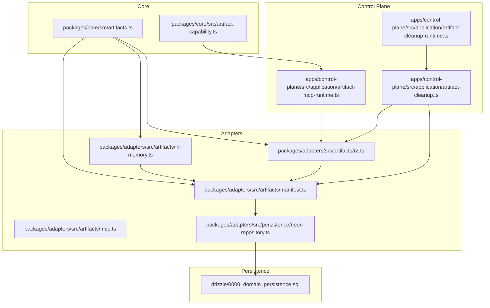
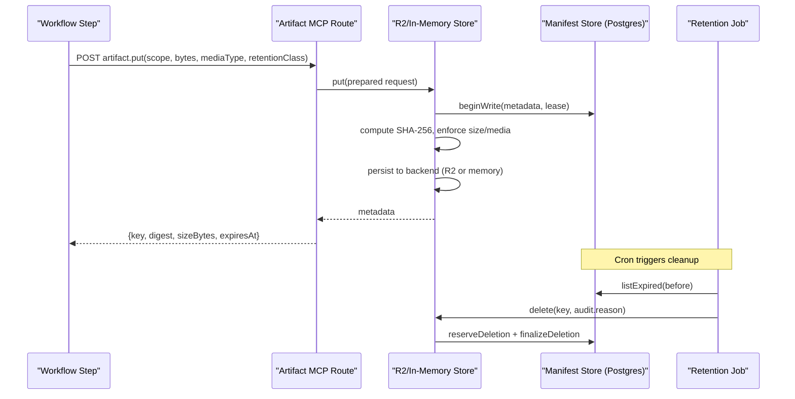
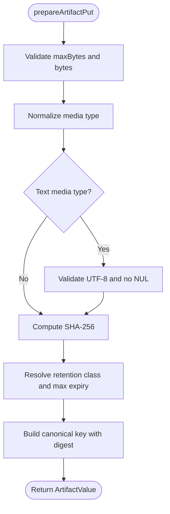
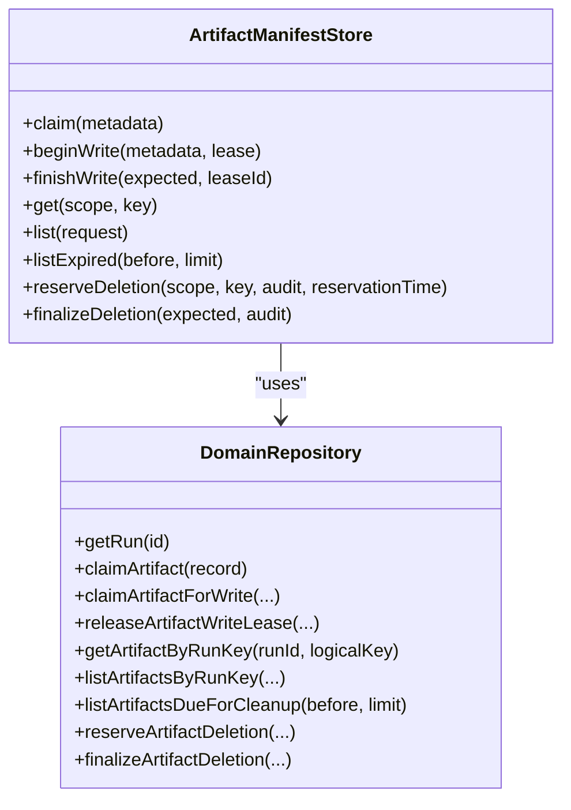
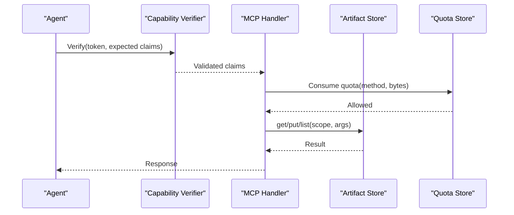
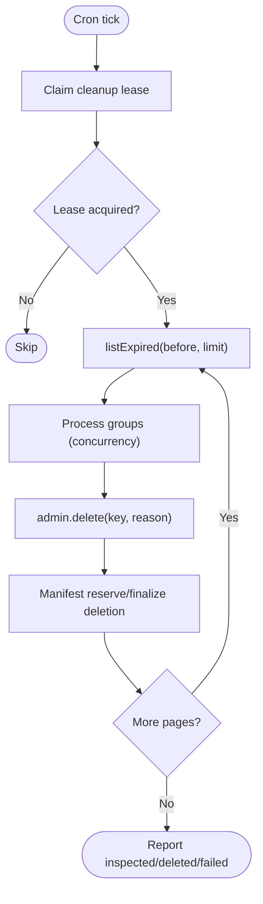
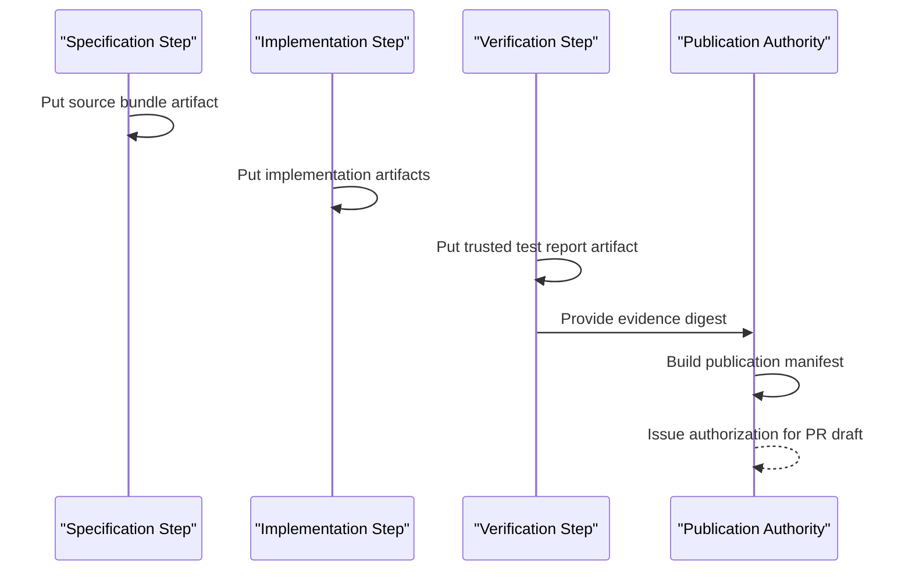
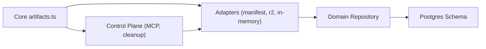

# Artifacts and Storage

<cite>
**Referenced Files in This Document**
- [artifact-storage.md](file://docs/architecture/artifact-storage.md)
- [artifacts.ts](file://packages/core/src/artifacts.ts)
- [manifest.ts](file://packages/adapters/src/artifacts/manifest.ts)
- [in-memory.ts](file://packages/adapters/src/artifacts/in-memory.ts)
- [r2.ts](file://packages/adapters/src/artifacts/r2.ts)
- [artifact-mcp-runtime.ts](file://apps/control-plane/src/application/artifact-mcp-runtime.ts)
- [artifact-cleanup.ts](file://apps/control-plane/src/application/artifact-cleanup.ts)
- [artifact-cleanup-runtime.ts](file://apps/control-plane/src/application/artifact-cleanup-runtime.ts)
- [0000_domain_persistence.sql](file://drizzle/0000_domain_persistence.sql)
- [neon-repository.ts](file://packages/adapters/src/persistence/neon-repository.ts)
- [mcp.ts](file://packages/adapters/src/artifacts/mcp.ts)
- [artifact-capability.ts](file://packages/core/src/artifact-capability.ts)
- [production-handler.ts](file://packages/adapters/src/trigger/production-handler.ts)
- [workflow.test.ts](file://packages/adapters/src/trigger/workflow.test.ts)
</cite>

## Table of Contents
1. Introduction
2. Project Structure
3. Core Components
4. Architecture Overview
5. Detailed Component Analysis
6. Dependency Analysis
7. Performance Considerations
8. Troubleshooting Guide
9. Conclusion

## Introduction
This document explains how Agent OS Passerine versions, stores, indexes, and retires artifacts produced by workflows. Artifacts are immutable, content-addressed outputs such as code changes, test results, documentation, and build artifacts. They flow through a secure MCP endpoint into durable storage with strong integrity checks, scoped access, and automated retention cleanup.

## Project Structure
Artifacts span core types and validation, adapter implementations for in-memory and Cloudflare R2 storage, a Postgres-backed manifest store, an MCP runtime for agent-facing access, and a scheduled cleanup job.

**Diagram sources**
- [artifacts.ts:1-400](file://packages/core/src/artifacts.ts#L1-L400)
- [artifact-capability.ts:46-97](file://packages/core/src/artifact-capability.ts#L46-L97)
- [manifest.ts:180-400](file://packages/adapters/src/artifacts/manifest.ts#L180-L400)
- [in-memory.ts:61-219](file://packages/adapters/src/artifacts/in-memory.ts#L61-L219)
- [r2.ts:172-544](file://packages/adapters/src/artifacts/r2.ts#L172-L544)
- [artifact-mcp-runtime.ts:65-97](file://apps/control-plane/src/application/artifact-mcp-runtime.ts#L65-L97)
- [artifact-cleanup.ts:9-66](file://apps/control-plane/src/application/artifact-cleanup.ts#L9-L66)
- [artifact-cleanup-runtime.ts:28-60](file://apps/control-plane/src/application/artifact-cleanup-runtime.ts#L28-L60)
- [0000_domain_persistence.sql:17-30](file://drizzle/0000_domain_persistence.sql#L17-L30)

**Section sources**
- [artifact-storage.md:1-42](file://docs/architecture/artifact-storage.md#L1-L42)
- [0000_domain_persistence.sql:17-30](file://drizzle/0000_domain_persistence.sql#L17-L30)

## Core Components
- Artifact model and validation: canonical keys, media type allowlists, digest computation, retention classes, and size limits.
- Manifest store: authoritative logical-version ledger in Postgres; write leases, deletion reservations, and finalization.
- Storage backends:
  - In-memory: fast testing and local runs.
  - R2: production object storage with integrity verification and retries.
- MCP runtime: stateless agent-facing endpoints artifact.get, artifact.put, artifact.list with HMAC-scoped capabilities and quotas.
- Retention cleanup: cron-driven job that deletes expired artifacts with bounded concurrency and leases.

**Section sources**
- [artifacts.ts:22-64](file://packages/core/src/artifacts.ts#L22-L64)
- [artifacts.ts:188-241](file://packages/core/src/artifacts.ts#L188-L241)
- [artifacts.ts:299-345](file://packages/core/src/artifacts.ts#L299-L345)
- [manifest.ts:180-400](file://packages/adapters/src/artifacts/manifest.ts#L180-L400)
- [in-memory.ts:61-219](file://packages/adapters/src/artifacts/in-memory.ts#L61-L219)
- [r2.ts:172-544](file://packages/adapters/src/artifacts/r2.ts#L172-L544)
- [artifact-mcp-runtime.ts:65-97](file://apps/control-plane/src/application/artifact-mcp-runtime.ts#L65-L97)
- [artifact-cleanup.ts:9-66](file://apps/control-plane/src/application/artifact-cleanup.ts#L9-L66)

## Architecture Overview
Agent steps produce artifacts via the MCP endpoint. Each put is validated, versioned, and stored with content-addressed keys. The manifest records metadata and retention. A background job periodically removes expired artifacts using admin credentials while agents only have read/write scope.

**Diagram sources**
- [artifact-mcp-runtime.ts:65-97](file://apps/control-plane/src/application/artifact-mcp-runtime.ts#L65-L97)
- [r2.ts:508-544](file://packages/adapters/src/artifacts/r2.ts#L508-L544)
- [manifest.ts:206-252](file://packages/adapters/src/artifacts/manifest.ts#L206-L252)
- [artifact-cleanup.ts:35-66](file://apps/control-plane/src/application/artifact-cleanup.ts#L35-L66)
- [manifest.ts:548-605](file://packages/adapters/src/artifacts/manifest.ts#L548-L605)

## Detailed Component Analysis

### Artifact Model and Validation
- Canonical key shape enforces project/run/step scoping and includes a SHA-256 digest segment.
- Media types are restricted to safe text and binary sets; HTML/JS text types are rejected.
- Retention classes bound maximum lifetimes: short-lived bundles and uploads cap near 24 hours with a safety margin; working artifacts expire after 30 days.
- Size limits apply per put and per read; text artifacts validate UTF-8 and forbid NUL bytes.

**Diagram sources**
- [artifacts.ts:299-345](file://packages/core/src/artifacts.ts#L299-L345)
- [artifacts.ts:256-287](file://packages/core/src/artifacts.ts#L256-L287)
- [artifacts.ts:22-28](file://packages/core/src/artifacts.ts#L22-L28)

**Section sources**
- [artifacts.ts:22-28](file://packages/core/src/artifacts.ts#L22-L28)
- [artifacts.ts:256-287](file://packages/core/src/artifacts.ts#L256-L287)
- [artifacts.ts:299-345](file://packages/core/src/artifacts.ts#L299-L345)

### Manifest Store and Versioning
- One immutable row binds (project, run, step, artifact, version) to a single digest and metadata.
- Writes use a short-lived lease to prevent concurrent overwrites; conflicts are rejected if metadata differs.
- Deletions are two-phase: reserve then finalize, with audit reason and timestamp recorded.
- Listing supports scoped prefixes and cursors for pagination.

**Diagram sources**
- [manifest.ts:180-400](file://packages/adapters/src/artifacts/manifest.ts#L180-L400)
- [neon-repository.ts:1526-1550](file://packages/adapters/src/persistence/neon-repository.ts#L1526-L1550)

**Section sources**
- [manifest.ts:180-400](file://packages/adapters/src/artifacts/manifest.ts#L180-L400)
- [neon-repository.ts:1526-1550](file://packages/adapters/src/persistence/neon-repository.ts#L1526-L1550)

### Storage Backends

#### In-Memory Backend
- Suitable for tests and local development.
- Enforces same integrity checks as R2: digest verification, size limits, and scope enforcement.
- Admin delete uses the same reservation/finalization pattern.

**Section sources**
- [in-memory.ts:61-219](file://packages/adapters/src/artifacts/in-memory.ts#L61-L219)

#### R2 Backend
- Content-addressed objects with metadata carrying digest, creation time, expiry, and retention class.
- Reads verify body length and SHA-256 against metadata; writes use IfNoneMatch to avoid collisions.
- Retries on transient errors; timeouts and retry attempts are configurable.
- Endpoint derived from account and jurisdiction; overrides are rejected.

**Section sources**
- [r2.ts:129-170](file://packages/adapters/src/artifacts/r2.ts#L129-L170)
- [r2.ts:228-268](file://packages/adapters/src/artifacts/r2.ts#L228-L268)
- [r2.ts:423-454](file://packages/adapters/src/artifacts/r2.ts#L423-L454)
- [r2.ts:508-544](file://packages/adapters/src/artifacts/r2.ts#L508-L544)

### MCP Access and Security
- Stateless handler exposes artifact.get, artifact.put, artifact.list.
- Each call requires a short-lived HMAC capability token specifying purpose, audience, method, project/run/step, optional prefix, byte/call limits, expiry, and nonce.
- Quotas enforced atomically in Postgres across cold starts.
- Credentials are bucket-scoped; deletion uses separate admin credentials.

**Diagram sources**
- [artifact-capability.ts:46-97](file://packages/core/src/artifact-capability.ts#L46-L97)
- [artifact-mcp-runtime.ts:25-63](file://apps/control-plane/src/application/artifact-mcp-runtime.ts#L25-L63)
- [artifact-mcp-runtime.ts:65-97](file://apps/control-plane/src/application/artifact-mcp-runtime.ts#L65-L97)
- [mcp.ts:509-545](file://packages/adapters/src/artifacts/mcp.ts#L509-L545)

**Section sources**
- [artifact-storage.md:1-42](file://docs/architecture/artifact-storage.md#L1-L42)
- [artifact-capability.ts:46-97](file://packages/core/src/artifact-capability.ts#L46-L97)
- [artifact-mcp-runtime.ts:25-63](file://apps/control-plane/src/application/artifact-mcp-runtime.ts#L25-L63)
- [artifact-mcp-runtime.ts:65-97](file://apps/control-plane/src/application/artifact-mcp-runtime.ts#L65-L97)
- [mcp.ts:509-545](file://packages/adapters/src/artifacts/mcp.ts#L509-L545)

### Lifecycle Management and Retention Policies
- Retention classes define maximum lifetimes:
  - source-bundle and cloud-session-upload: near 24 hours with a safety margin.
  - working: 30 days.
- Expiry times are enforced at put and validated at metadata load.
- Cleanup job:
  - Claims a durable Postgres lease to ensure single worker.
  - Pages expired artifacts with bounded concurrency.
  - Deletes via admin store and records audit metadata.
  - Respects time budgets and abort signals.

**Diagram sources**
- [artifact-cleanup.ts:9-66](file://apps/control-plane/src/application/artifact-cleanup.ts#L9-L66)
- [manifest.ts:548-605](file://packages/adapters/src/artifacts/manifest.ts#L548-L605)
- [neon-repository.ts:1526-1550](file://packages/adapters/src/persistence/neon-repository.ts#L1526-L1550)

**Section sources**
- [artifacts.ts:22-28](file://packages/core/src/artifacts.ts#L22-L28)
- [artifacts.ts:316-328](file://packages/core/src/artifacts.ts#L316-L328)
- [artifact-cleanup.ts:9-66](file://apps/control-plane/src/application/artifact-cleanup.ts#L9-L66)
- [manifest.ts:548-605](file://packages/adapters/src/artifacts/manifest.ts#L548-L605)

### Indexing and Search Capabilities
- Logical listing is scoped to project/run/step and supports artifact prefix filtering and cursor-based pagination.
- Cursor encoding validates scope and encodes query parameters for safe transport.
- Database indexes support efficient cleanup scans by cleanup_at.

**Section sources**
- [artifacts.ts:373-399](file://packages/core/src/artifacts.ts#L373-L399)
- [manifest.ts:286-316](file://packages/adapters/src/artifacts/manifest.ts#L286-L316)
- [cursor.ts:58-81](file://packages/adapters/src/artifacts/cursor.ts#L58-L81)
- [0000_domain_persistence.sql:208-208](file://drizzle/0000_domain_persistence.sql#L208-L208)

### Pipeline Flow: Creation to Publication
- Workflow steps produce artifacts (e.g., source bundles, test reports) and publish them via MCP or direct store calls.
- Verification steps consume trusted test report artifacts to authorize publication.
- Publication builds a manifest referencing evidence digests and issues authorization scoped to repository and base branch.

**Diagram sources**
- [workflow.test.ts:103-184](file://packages/adapters/src/trigger/workflow.test.ts#L103-L184)
- [production-handler.ts:466-623](file://packages/adapters/src/trigger/production-handler.ts#L466-L623)

**Section sources**
- [workflow.test.ts:103-184](file://packages/adapters/src/trigger/workflow.test.ts#L103-L184)
- [production-handler.ts:466-623](file://packages/adapters/src/trigger/production-handler.ts#L466-L623)

## Dependency Analysis
- Core types and validation are consumed by all adapters and control plane components.
- Adapters depend on the domain repository for manifests and leases.
- Control plane composes MCP runtime and cleanup job from adapters and configuration.
- Persistence layer provides tables and indexes used by the manifest store.

**Diagram sources**
- [artifacts.ts:1-400](file://packages/core/src/artifacts.ts#L1-L400)
- [manifest.ts:180-400](file://packages/adapters/src/artifacts/manifest.ts#L180-L400)
- [r2.ts:172-544](file://packages/adapters/src/artifacts/r2.ts#L172-L544)
- [artifact-mcp-runtime.ts:65-97](file://apps/control-plane/src/application/artifact-mcp-runtime.ts#L65-L97)
- [artifact-cleanup.ts:9-66](file://apps/control-plane/src/application/artifact-cleanup.ts#L9-L66)
- [0000_domain_persistence.sql:17-30](file://drizzle/0000_domain_persistence.sql#L17-L30)

**Section sources**
- [artifacts.ts:1-400](file://packages/core/src/artifacts.ts#L1-L400)
- [manifest.ts:180-400](file://packages/adapters/src/artifacts/manifest.ts#L180-L400)
- [r2.ts:172-544](file://packages/adapters/src/artifacts/r2.ts#L172-L544)
- [artifact-mcp-runtime.ts:65-97](file://apps/control-plane/src/application/artifact-mcp-runtime.ts#L65-L97)
- [artifact-cleanup.ts:9-66](file://apps/control-plane/src/application/artifact-cleanup.ts#L9-L66)
- [0000_domain_persistence.sql:17-30](file://drizzle/0000_domain_persistence.sql#L17-L30)

## Performance Considerations
- Large files:
  - MCP endpoint caps requests/responses; larger artifacts should use the direct trusted artifact-store contract until chunking is introduced.
  - R2 reads enforce maxBytes and verify integrity before returning data.
- High-volume scenarios:
  - Use bounded page limits and concurrency for cleanup and listing.
  - Prefer cursor-based listing to avoid full scans.
  - Ensure R2 timeout and retry settings match workload characteristics.
- Throughput:
  - Digest computation and text validation add CPU overhead; batch operations where possible.
  - Reuse scopes and prefixes to minimize parsing and validation costs.

[No sources needed since this section provides general guidance]

## Troubleshooting Guide
Common issues and diagnostics:
- Scope denied: Ensure artifact key matches requested project/run/step.
- Conflict: Duplicate version with different content or metadata; check idempotency and version increments.
- Integrity error: Digest mismatch between stored bytes and metadata; recompute SHA-256 and verify storage path.
- Too large: Exceeds configured maxBytes; reduce payload or adjust limits appropriately.
- Capability denied: Invalid or expired HMAC token; regenerate with correct methods, audience, and limits.
- Cleanup skipped: Lease not acquired due to concurrent worker; wait for next cycle.

**Section sources**
- [manifest.ts:26-40](file://packages/adapters/src/artifacts/manifest.ts#L26-L40)
- [in-memory.ts:119-157](file://packages/adapters/src/artifacts/in-memory.ts#L119-L157)
- [r2.ts:423-454](file://packages/adapters/src/artifacts/r2.ts#L423-L454)
- [artifact-capability.ts:46-97](file://packages/core/src/artifact-capability.ts#L46-L97)
- [artifact-cleanup.ts:35-66](file://apps/control-plane/src/application/artifact-cleanup.ts#L35-L66)

## Conclusion
Agent OS Passerine provides a robust artifact system with strict versioning, integrity verification, scoped access, and automated retention. The design separates metadata (Postgres manifest) from payloads (R2 or in-memory), enabling secure, scalable, and auditable artifact flows from workflow execution through publication and cleanup.