# Core Concepts

<cite>
**Referenced Files in This Document**
- [README.md](file://README.md)
- [PRODUCT.md](file://PRODUCT.md)
- [agent-os.yaml](file://agentos/agent-os.yaml)
- [passerine.yaml](file://agentos/passerine.yaml)
- [control-plane-service.ts](file://apps/control-plane/src/application/control-plane-service.ts)
- [workflow-reconciliation.ts](file://apps/control-plane/src/application/workflow-reconciliation.ts)
- [runtime.ts](file://apps/control-plane/src/application/runtime.ts)
- [artifact-cleanup.ts](file://apps/control-plane/src/application/artifact-cleanup.ts)
- [contracts.ts](file://apps/control-plane/src/http/contracts.ts)
- [mcp.ts](file://packages/adapters/src/artifacts/mcp.ts)
- [provider.ts](file://packages/adapters/src/kimi/provider.ts)
- [goal-task-handler.ts](file://packages/adapters/src/trigger/goal-task-handler.ts)
</cite>

## Table of Contents
1. [Introduction](#introduction)
2. [Project Structure](#project-structure)
3. [Core Components](#core-components)
4. [Architecture Overview](#architecture-overview)
5. [Detailed Component Analysis](#detailed-component-analysis)
6. [Dependency Analysis](#dependency-analysis)
7. [Performance Considerations](#performance-considerations)
8. [Troubleshooting Guide](#troubleshooting-guide)
9. [Conclusion](#conclusion)

## Introduction
Agent OS Passerine is a single-operator, GitHub-focused semi-autonomous build system that turns feature requests into reviewed artifacts and tested draft pull requests while keeping approvals, budgets, credentials, and publication authority outside model sessions. The operator supervises runs, answers agent questions, approves narrowly scoped actions, and inspects evidence without losing context between the original request, its run, and resulting actions.

This document explains the core concepts that make this possible: Projects and Configuration, Workflows and Pipelines, Goals and Steps, Agents and Models, Policies and Budgets, Artifacts and Storage, Approvals and Human Intervention, and Runs and Execution Context. It shows how these pieces interact to enable safe, auditable, and bounded automation for feature development.

**Section sources**
- [README.md:1-67](file://README.md#L1-L67)
- [PRODUCT.md:1-46](file://PRODUCT.md#L1-L46)

## Project Structure
At a high level, configuration lives under `agentos/`, the control plane application lives under `apps/control-plane`, and reusable adapters live under `packages/adapters`. The CLI reads repository-root configuration and exposes commands for projects, goals, runs, inbox, and approvals.

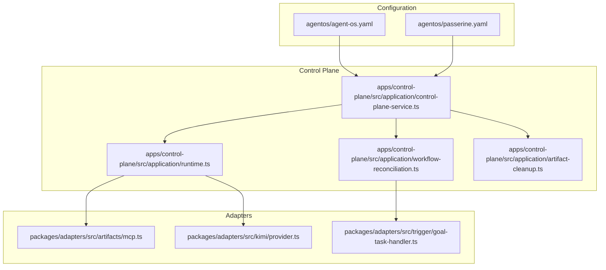

**Diagram sources**
- [agent-os.yaml:1-61](file://agentos/agent-os.yaml#L1-L61)
- [passerine.yaml:1-252](file://agentos/passerine.yaml#L1-L252)
- [control-plane-service.ts:1-200](file://apps/control-plane/src/application/control-plane-service.ts#L1-L200)
- [workflow-reconciliation.ts:1-200](file://apps/control-plane/src/application/workflow-reconciliation.ts#L1-L200)
- [runtime.ts:1-200](file://apps/control-plane/src/application/runtime.ts#L1-L200)
- [artifact-cleanup.ts:1-118](file://apps/control-plane/src/application/artifact-cleanup.ts#L1-L118)
- [mcp.ts:660-705](file://packages/adapters/src/artifacts/mcp.ts#L660-L705)
- [provider.ts:751-821](file://packages/adapters/src/kimi/provider.ts#L751-L821)
- [goal-task-handler.ts:1-56](file://packages/adapters/src/trigger/goal-task-handler.ts#L1-L56)

**Section sources**
- [README.md:1-67](file://README.md#L1-L67)

## Core Components
This section defines the fundamental concepts and how they relate to each other.

- Projects and Configuration
  - A project binds a repository or local workspace to a versioned configuration. Configuration declares models, agents, environments, pipelines, policies, budgets, goals, and runtime routing.
  - Example references:
    - Minimal project config with models, agents, environments, pipelines, policies, budgets, goals, and runtime provider.
    - Multi-agent pipeline example with specification, planning, implementation, review, and verification steps.

- Workflows and Pipelines
  - A pipeline is an ordered sequence of steps. Each step selects an agent and environment and may declare tools and MCP capabilities.
  - Two top-level workflow types exist:
    - Feature workflows execute a configured pipeline against a repository snapshot and produce artifacts and outputs.
    - Goal workflows coordinate one or more child feature workflows to satisfy criteria defined by the operator.

- Goals and Steps
  - A goal is a higher-level intent composed of criteria (verifiable conditions). The goal runner creates deterministic child runs per step and tracks progress.
  - Steps are individual units within a pipeline; each step’s agent produces artifacts consumed by later steps.

- Agents and Models
  - An agent is a role bound to a model profile and an execution environment. Agents can be granted tools and MCP integrations, retries, timeouts, and prompts.
  - Model profiles define provider, model name, and cost parameters used for budgeting and accounting.

- Policies and Budgets
  - Policies constrain what agents can write and which paths are protected. They also limit file sizes, binary/symlink usage, tool access, and MCP access.
  - Budgets cap per-workflow and daily spend, concurrency, and reserve capacity to avoid overcommitment.

- Artifacts and Storage
  - Artifacts are versioned, scoped outputs produced by steps. They are stored via an artifact MCP interface and referenced by key and metadata across steps and runs.
  - Cleanup jobs reclaim storage based on retention policies with leases and time budgets.

- Approvals and Human Intervention
  - Approvals gate sensitive actions. Operators approve or reject decisions through the inbox UI/API. Idempotency keys and scope hashes protect approval mutations.
  - Inbox messages carry questions, options, replies, and status transitions.

- Runs and Execution Context
  - A run is a durable execution of a pipeline or goal. It carries provenance (repository SHA, config digest, model/prompt/environment/policy digests), input, and lifecycle state.
  - The control plane reconciles outbox events, enforces timeouts, cancels orphan children, and coordinates dispatch to worker runtimes.

Practical examples from the codebase:
- Pipeline definition with multiple agents and environments.
- Goal task handler that validates inputs and delegates to a workflow runner.
- Artifact MCP server exposing tools for agents to store and retrieve artifacts safely.
- Runtime wiring that composes providers, repositories, and artifact stores.

**Section sources**
- [agent-os.yaml:1-61](file://agentos/agent-os.yaml#L1-L61)
- [passerine.yaml:1-252](file://agentos/passerine.yaml#L1-L252)
- [goal-task-handler.ts:1-56](file://packages/adapters/src/trigger/goal-task-handler.ts#L1-L56)
- [mcp.ts:660-705](file://packages/adapters/src/artifacts/mcp.ts#L660-L705)
- [runtime.ts:1-200](file://apps/control-plane/src/application/runtime.ts#L1-L200)

## Architecture Overview
The control plane orchestrates configuration, runs, approvals, and reconciliation. Adapters provide runtime providers, artifact storage, and trigger integration.

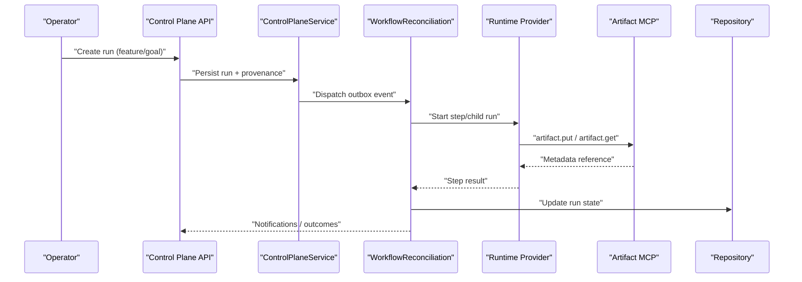

**Diagram sources**
- [control-plane-service.ts:1-200](file://apps/control-plane/src/application/control-plane-service.ts#L1-L200)
- [workflow-reconciliation.ts:1-200](file://apps/control-plane/src/application/workflow-reconciliation.ts#L1-L200)
- [runtime.ts:1-200](file://apps/control-plane/src/application/runtime.ts#L1-L200)
- [mcp.ts:660-705](file://packages/adapters/src/artifacts/mcp.ts#L660-L705)

## Detailed Component Analysis

### Projects and Configuration
- Definition: A project identifies a target repository or local workspace and binds a versioned configuration that describes models, agents, environments, pipelines, policies, budgets, goals, and runtime routing.
- Relationships:
  - Pipelines reference agents and environments declared in configuration.
  - Policies constrain artifact writes and tool/MCP access.
  - Budgets govern admission and concurrent execution.
  - Runs record the applied configuration revision and provenance digests.
- Practical examples:
  - A minimal configuration with a single agent and pipeline.
  - A multi-agent pipeline with distinct environments and MCP capabilities.

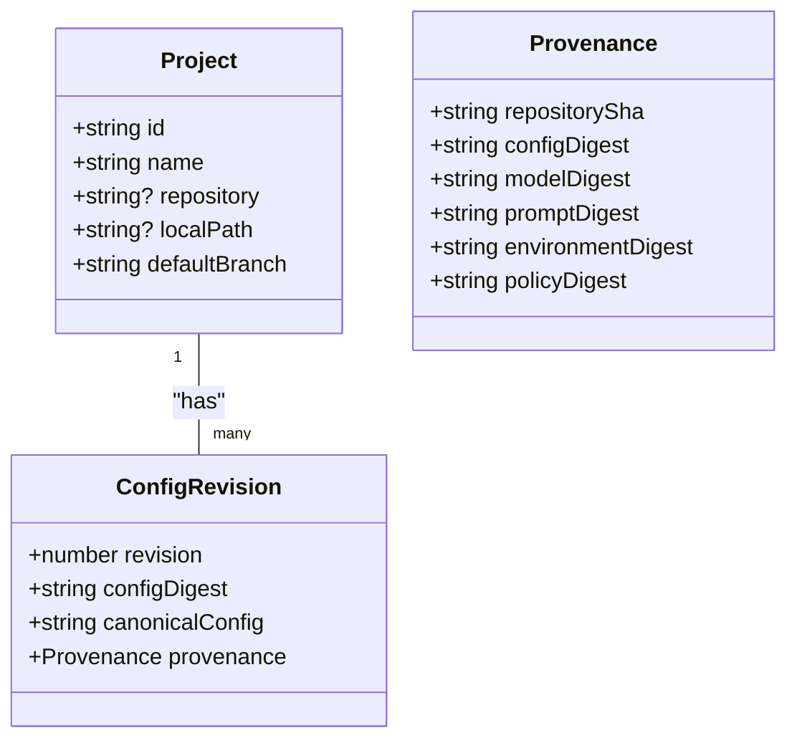

**Diagram sources**
- [control-plane-service.ts:1-200](file://apps/control-plane/src/application/control-plane-service.ts#L1-L200)
- [agent-os.yaml:1-61](file://agentos/agent-os.yaml#L1-L61)
- [passerine.yaml:1-252](file://agentos/passerine.yaml#L1-L252)

**Section sources**
- [agent-os.yaml:1-61](file://agentos/agent-os.yaml#L1-L61)
- [passerine.yaml:1-252](file://agentos/passerine.yaml#L1-L252)
- [control-plane-service.ts:1-200](file://apps/control-plane/src/application/control-plane-service.ts#L1-L200)

### Workflows and Pipelines
- Definition: A pipeline is a named, ordered list of steps. A workflow is either a feature run executing a pipeline or a goal run coordinating child feature runs.
- Relationships:
  - Each step selects an agent and environment.
  - Goal workflows create deterministic child runs per step and track progress.
  - Reconciliation enforces timeouts and cancels orphan children when needed.
- Practical examples:
  - Feature pipeline with specification, planning, implementation, review, verification steps.
  - Goal task handler validating inputs and delegating to a workflow runner.

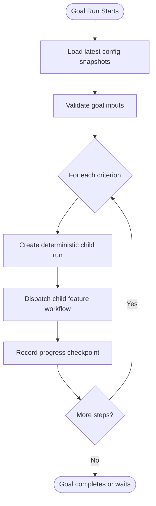

**Diagram sources**
- [workflow-reconciliation.ts:1-200](file://apps/control-plane/src/application/workflow-reconciliation.ts#L1-L200)
- [goal-task-handler.ts:1-56](file://packages/adapters/src/trigger/goal-task-handler.ts#L1-L56)

**Section sources**
- [passerine.yaml:205-218](file://agentos/passerine.yaml#L205-L218)
- [workflow-reconciliation.ts:1-200](file://apps/control-plane/src/application/workflow-reconciliation.ts#L1-L200)
- [goal-task-handler.ts:1-56](file://packages/adapters/src/trigger/goal-task-handler.ts#L1-L56)

### Goals and Steps
- Definition: A goal is a set of verifiable criteria. Steps are the ordered units within a pipeline that implement those criteria.
- Relationships:
  - Goal runners create child feature runs per step and persist checkpoints.
  - Step outputs become artifacts consumed by subsequent steps.
- Practical examples:
  - Deterministic child run IDs derived from parent run and step index.
  - Progress records linking criteria, step number, and child run ID.

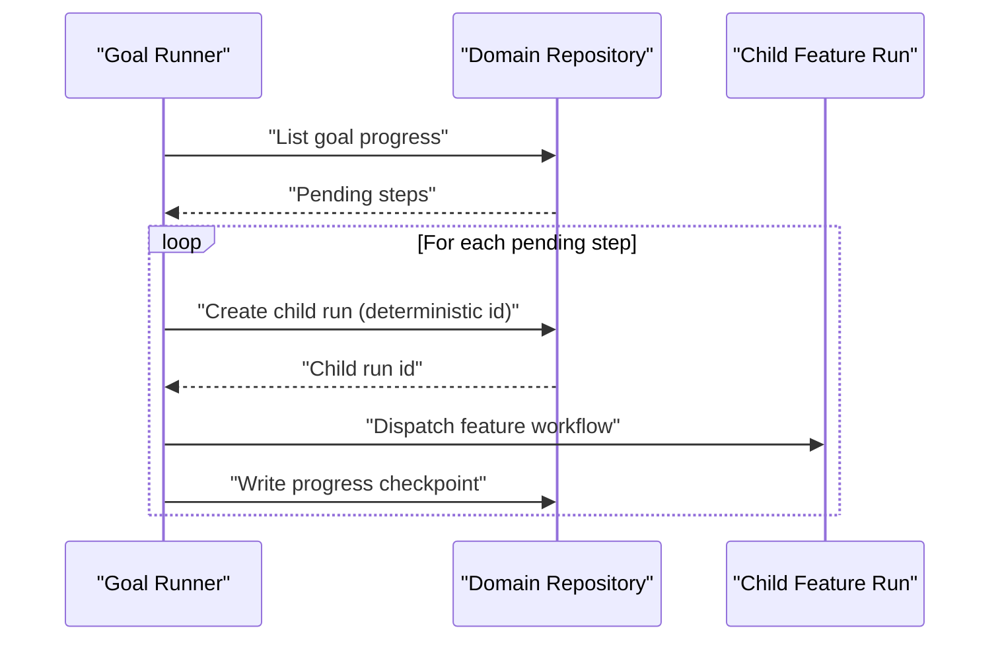

**Diagram sources**
- [workflow-reconciliation.ts:65-153](file://apps/control-plane/src/application/workflow-reconciliation.ts#L65-L153)

**Section sources**
- [workflow-reconciliation.ts:65-153](file://apps/control-plane/src/application/workflow-reconciliation.ts#L65-L153)

### Agents and Models
- Definition: An agent is a role bound to a model profile and environment, with optional tools, MCP integrations, retries, and timeouts. A model profile specifies provider, model name, and cost parameters.
- Relationships:
  - Pipelines select agents per step.
  - Environments define runtime type, variables, tools, and MCPs.
  - Runtimes compose providers and route model profiles to appropriate backends.
- Practical examples:
  - Multi-agent pipeline with separate environments for spec, plan, impl, review, and verification.
  - Runtime wiring that composes managed agents, local access, and artifact MCP.

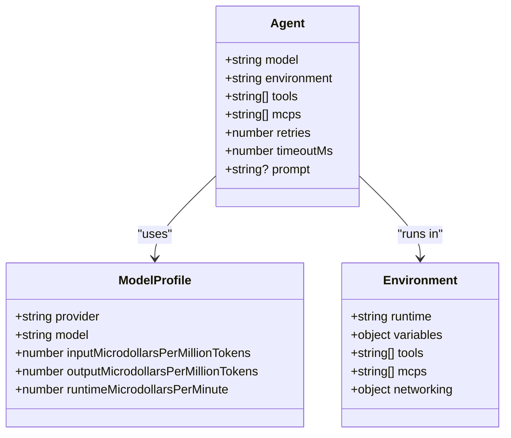

**Diagram sources**
- [passerine.yaml:6-24](file://agentos/passerine.yaml#L6-L24)
- [passerine.yaml:165-204](file://agentos/passerine.yaml#L165-L204)
- [runtime.ts:1-200](file://apps/control-plane/src/application/runtime.ts#L1-L200)

**Section sources**
- [passerine.yaml:6-24](file://agentos/passerine.yaml#L6-L24)
- [passerine.yaml:165-204](file://agentos/passerine.yaml#L165-L204)
- [runtime.ts:1-200](file://apps/control-plane/src/application/runtime.ts#L1-L200)

### Policies and Budgets
- Definition: Policies restrict artifact writes (protected paths, file size, binaries, symlinks) and tool/MCP allow/deny lists. Budgets enforce per-workflow and daily micro-dollar caps, concurrency limits, and admission reserves.
- Relationships:
  - Policies are hashed into provenance to ensure reproducibility.
  - Budgets influence admission and scheduling of runs.
- Practical examples:
  - Protected paths including CI workflows and secrets.
  - Budget fields for workflowMicrodollars, dailyMicrodollars, concurrency, and admissionReservePercent.

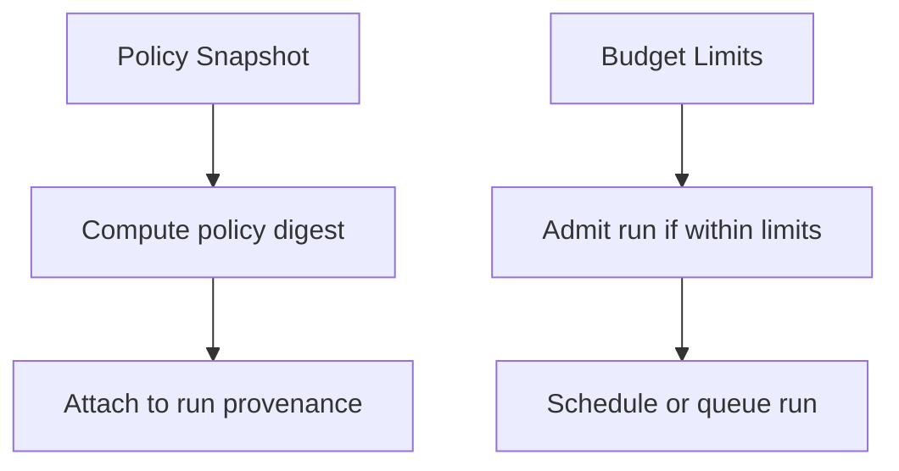

**Diagram sources**
- [agent-os.yaml:31-53](file://agentos/agent-os.yaml#L31-L53)
- [passerine.yaml:218-244](file://agentos/passerine.yaml#L218-L244)

**Section sources**
- [agent-os.yaml:31-53](file://agentos/agent-os.yaml#L31-L53)
- [passerine.yaml:218-244](file://agentos/passerine.yaml#L218-L244)

### Artifacts and Storage
- Definition: Artifacts are versioned, scoped outputs produced by steps. They are stored via an artifact MCP interface and referenced by key and metadata across steps and runs.
- Relationships:
  - Agents call artifact.put and artifact.get through MCP tools.
  - Runtimes bind artifact MCP servers and credential resolution.
  - Cleanup jobs reclaim expired artifacts with leases and time budgets.
- Practical examples:
  - MCP server enforcing protocol version and capability checks.
  - Provider bridging agent tool calls to artifact MCP operations.
  - Retention cleanup job with lease renewal and batch processing.

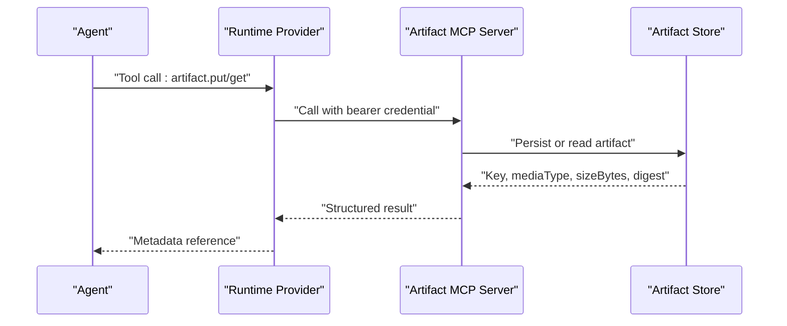

**Diagram sources**
- [mcp.ts:660-705](file://packages/adapters/src/artifacts/mcp.ts#L660-L705)
- [provider.ts:751-821](file://packages/adapters/src/kimi/provider.ts#L751-L821)
- [artifact-cleanup.ts:1-118](file://apps/control-plane/src/application/artifact-cleanup.ts#L1-L118)

**Section sources**
- [mcp.ts:660-705](file://packages/adapters/src/artifacts/mcp.ts#L660-L705)
- [provider.ts:751-821](file://packages/adapters/src/kimi/provider.ts#L751-L821)
- [artifact-cleanup.ts:1-118](file://apps/control-plane/src/application/artifact-cleanup.ts#L1-L118)

### Approvals and Human Intervention
- Definition: Approvals gate sensitive actions. Operators approve or reject decisions through the inbox UI/API using idempotency keys and scope hashes. Inbox messages carry questions, options, and replies.
- Relationships:
  - Control plane persists approvals and emits outbox events to resume or cancel workflows.
  - UI exposes forms to reply to messages and cancel runs.
- Practical examples:
  - Inbox message schema supporting text, question, answer, and options.
  - Idempotency key enforcement for mutation endpoints.

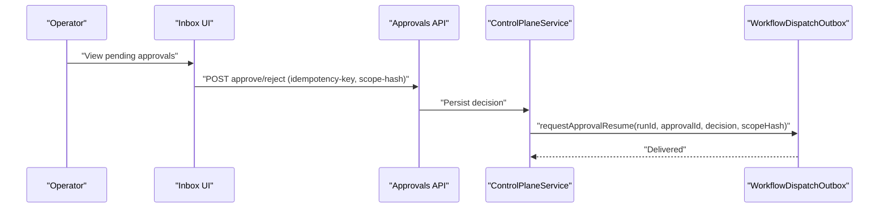

**Diagram sources**
- [control-plane-service.ts:61-87](file://apps/control-plane/src/application/control-plane-service.ts#L61-L87)
- [contracts.ts:325-371](file://apps/control-plane/src/http/contracts.ts#L325-L371)

**Section sources**
- [control-plane-service.ts:61-87](file://apps/control-plane/src/application/control-plane-service.ts#L61-L87)
- [contracts.ts:325-371](file://apps/control-plane/src/http/contracts.ts#L325-L371)

### Runs and Execution Context
- Definition: A run is a durable execution of a pipeline or goal. It captures provenance (repository SHA, config/model/prompt/environment/policy digests), input, and lifecycle state.
- Relationships:
  - Control plane creates runs, attaches provenance, and reconciles outbox events.
  - Reconciliation enforces timeouts, cancels orphan children, and updates status.
- Practical examples:
  - Provenance composition from configuration and policy snapshots.
  - Timeout calculation for goal runs based on configuration.

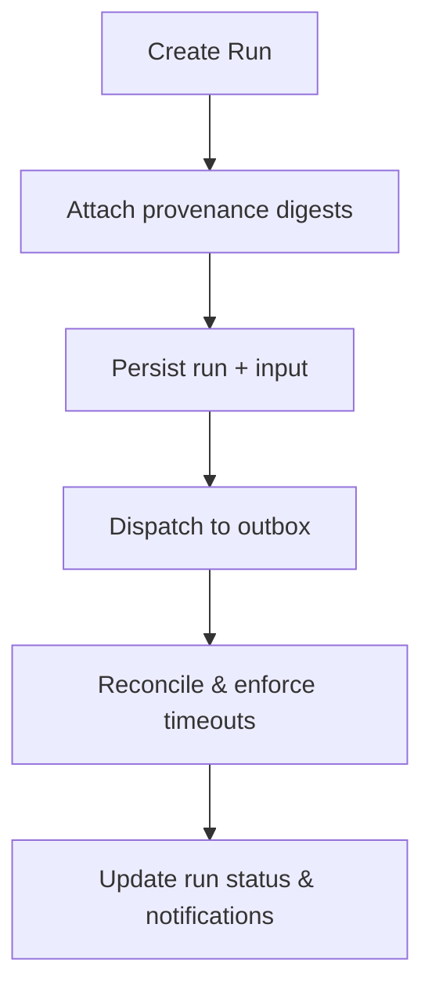

**Diagram sources**
- [control-plane-service.ts:1-200](file://apps/control-plane/src/application/control-plane-service.ts#L1-L200)
- [workflow-reconciliation.ts:48-63](file://apps/control-plane/src/application/workflow-reconciliation.ts#L48-L63)

**Section sources**
- [control-plane-service.ts:1-200](file://apps/control-plane/src/application/control-plane-service.ts#L1-L200)
- [workflow-reconciliation.ts:48-63](file://apps/control-plane/src/application/workflow-reconciliation.ts#L48-L63)

## Dependency Analysis
Conceptual dependencies among core components:

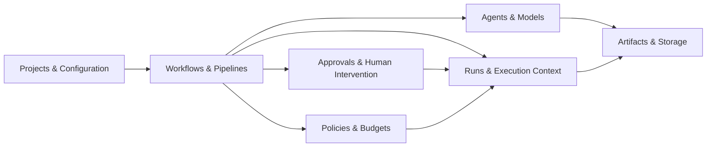

[No sources needed since this diagram shows conceptual relationships, not direct code mappings]

## Performance Considerations
- Use pipelines with minimal steps to reduce latency and cost.
- Tune budgets (workflowMicrodollars, dailyMicrodollars, concurrency) to match workload and prevent contention.
- Prefer scoped artifact MCP calls to minimize payload sizes and network overhead.
- Leverage cleanup jobs to reclaim storage and keep artifact stores lean.
- Set appropriate timeouts per agent and per goal to avoid long-running stalls.

[No sources needed since this section provides general guidance]

## Troubleshooting Guide
Common issues and where to look:
- Stalled runs or missing dispatches: Check reconciliation cursor and outbox delivery counts.
- Approval failures: Ensure idempotency-key header is present and scope hash matches the current approval window.
- Artifact errors: Verify MCP protocol version and capability headers; check artifact size limits and storage quotas.
- Runtime misconfiguration: Validate reader/publisher GitHub App settings and allowed repositories.

**Section sources**
- [workflow-reconciliation.ts:156-200](file://apps/control-plane/src/application/workflow-reconciliation.ts#L156-L200)
- [contracts.ts:325-371](file://apps/control-plane/src/http/contracts.ts#L325-L371)
- [mcp.ts:660-705](file://packages/adapters/src/artifacts/mcp.ts#L660-L705)
- [runtime.ts:118-149](file://apps/control-plane/src/application/runtime.ts#L118-L149)

## Conclusion
Agent OS Passerine structures semi-autonomous feature development around clear, versioned concepts: projects and configuration define the environment; pipelines orchestrate steps; goals coordinate child runs; agents and models execute work; policies and budgets enforce safety and cost; artifacts capture evidence; approvals inject human judgment; and runs provide durable execution context. Together, these concepts enable safe, auditable, and operator-supervised automation that produces reviewed artifacts and draft pull requests without granting automated merge or deploy authority.

[No sources needed since this section summarizes without analyzing specific files]