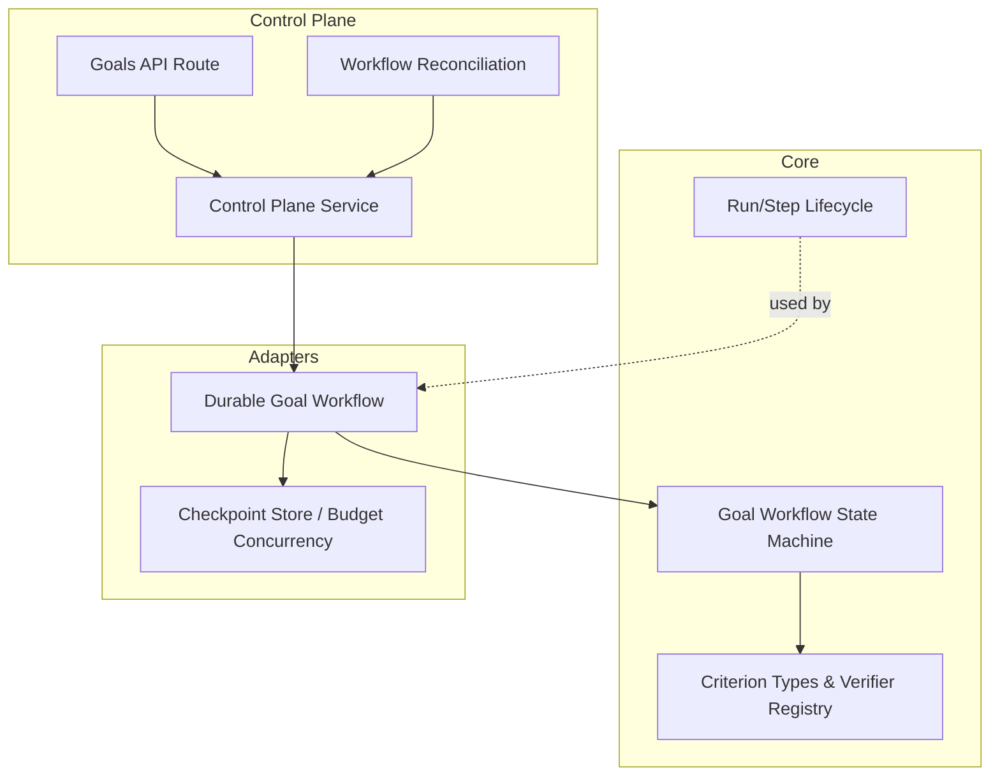
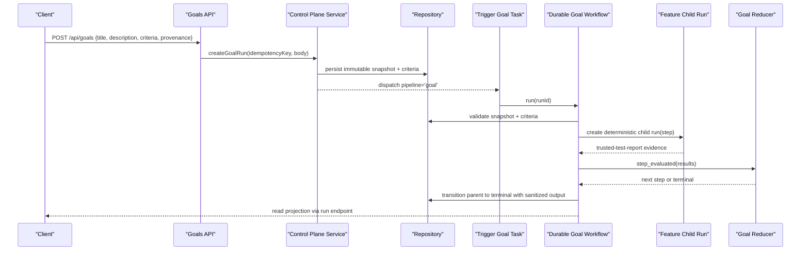
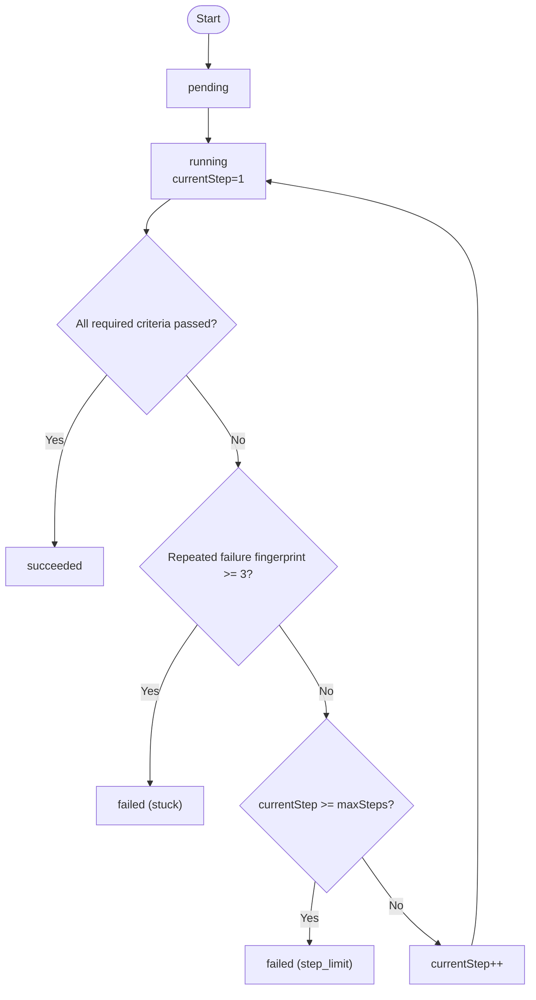
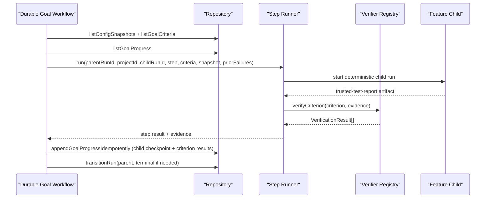
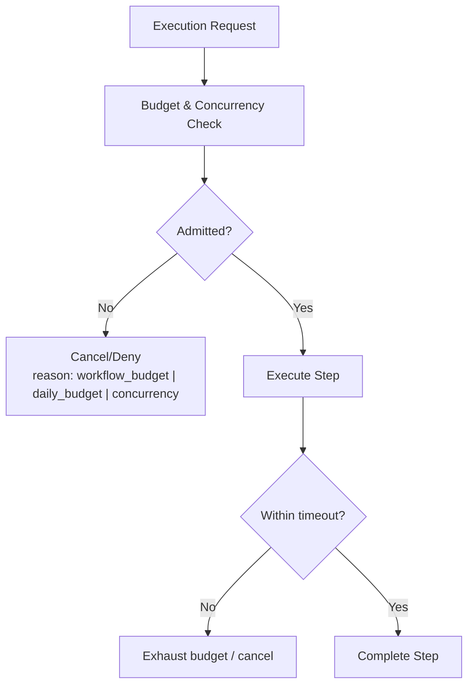
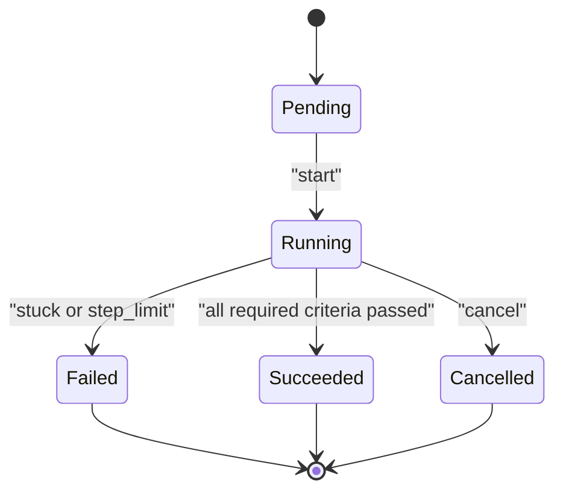
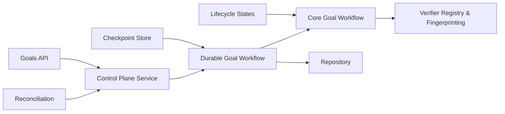

# Goals and Steps

<cite>
**Referenced Files in This Document**
- [goal-workflow.ts](file://packages/core/src/goal-workflow.ts)
- [dod.ts](file://packages/core/src/dod.ts)
- [lifecycle.ts](file://packages/core/src/lifecycle.ts)
- [goal-workflow.ts](file://packages/adapters/src/trigger/goal-workflow.ts)
- [checkpoint-store.ts](file://packages/adapters/src/trigger/checkpoint-store.ts)
- [workflow-reconciliation.ts](file://apps/control-plane/src/application/workflow-reconciliation.ts)
- [route.ts](file://apps/control-plane/app/api/goals/route.ts)
- [control-plane-service.ts](file://apps/control-plane/src/application/control-plane-service.ts)
- [budget.test.ts](file://packages/core/src/budget.test.ts)
- [managed-agents.test.ts](file://packages/adapters/src/managed-agents/managed-agents.test.ts)
- [2026-08-17-bounded-goal-loop-design.md](file://docs/superpowers/specs/2026-08-17-bounded-goal-loop-design.md)
- [2026-08-17-bounded-goal-loop.md](file://docs/superpowers/plans/2026-08-17-bounded-goal-loop.md)
- [durable-goal-workflow.md](file://docs/architecture/durable-goal-workflow.md)
</cite>

## Table of Contents
1. Introduction
2. Project Structure
3. Core Components
4. Architecture Overview
5. Detailed Component Analysis
6. Dependency Analysis
7. Performance Considerations
8. Troubleshooting Guide
9. Conclusion

## Introduction
This document explains how goals and steps work in Agent OS Passerine to deliver bounded, verifiable outcomes. A goal defines a desired outcome through clear acceptance criteria (Definition of Done), constraints, and limits. Steps are the attempts that execute within those bounds. The system enforces strict scope control via step limits, budget controls, and time constraints, while providing durable progress tracking, milestone reporting, and failure recovery across retries and cancellations.

Goals delegate to the existing feature workflow as child runs. Each goal attempt is a step. The core state machine advances or terminates based on signed evidence for command criteria. Operators define up to twenty command criteria per goal; each criterion must pass if required. The goal succeeds when all required criteria pass, fails when stuck due to repeated failures, or fails when the configured maximum number of steps is exhausted.

## Project Structure
The goal-and-step capability spans several layers:
- Core state machine and verification primitives live in packages/core.
- Durable execution, child orchestration, and verifier integration live in packages/adapters.
- Control plane APIs, projections, and reconciliation live in apps/control-plane.
- Design and implementation plans document the bounded loop and operational boundaries.

**Diagram sources**
- [goal-workflow.ts:1-243](file://packages/core/src/goal-workflow.ts#L1-L243)
- [dod.ts:1-243](file://packages/core/src/dod.ts#L1-L243)
- [lifecycle.ts:1-218](file://packages/core/src/lifecycle.ts#L1-L218)
- [goal-workflow.ts:1-827](file://packages/adapters/src/trigger/goal-workflow.ts#L1-L827)
- [checkpoint-store.ts:243-300](file://packages/adapters/src/trigger/checkpoint-store.ts#L243-L300)
- [route.ts:1-35](file://apps/control-plane/app/api/goals/route.ts#L1-L35)
- [control-plane-service.ts:1-200](file://apps/control-plane/src/application/control-plane-service.ts#L1-L200)
- [workflow-reconciliation.ts:368-402](file://apps/control-plane/src/application/workflow-reconciliation.ts#L368-L402)

**Section sources**
- [goal-workflow.ts:1-243](file://packages/core/src/goal-workflow.ts#L1-L243)
- [dod.ts:1-243](file://packages/core/src/dod.ts#L1-L243)
- [lifecycle.ts:1-218](file://packages/core/src/lifecycle.ts#L1-L218)
- [goal-workflow.ts:1-827](file://packages/adapters/src/trigger/goal-workflow.ts#L1-L827)
- [checkpoint-store.ts:243-300](file://packages/adapters/src/trigger/checkpoint-store.ts#L243-L300)
- [route.ts:1-35](file://apps/control-plane/app/api/goals/route.ts#L1-L35)
- [control-plane-service.ts:1-200](file://apps/control-plane/src/application/control-plane-service.ts#L1-L200)
- [workflow-reconciliation.ts:368-402](file://apps/control-plane/src/application/workflow-reconciliation.ts#L368-L402)

## Core Components
- Goal state machine: Pure reducer enforcing immutable criteria, maxSteps (1–3), current step, latest results per criterion, failure fingerprints, and idempotent event processing. It transitions from pending to running, evaluates step results, and terminates as succeeded, failed (stuck or step_limit), cancelled, or crashed.
- Definition of Done (DoD): Criterion types and verifier registry. Command criteria are validated against signed trusted evidence. Failure fingerprints enable stuck detection.
- Run/step lifecycle: Generic lifecycle states and transitions for runs and steps, including approval and budget exhaustion.
- Durable goal workflow: Orchestrates child feature runs per step, validates inputs and snapshots, persists deterministic checkpoints, verifies evidence, and finalizes parent run output with sanitized summaries.
- Checkpoint store and concurrency: Enforces one agent session per project and applies budget/concurrency admission checks before execution.
- Control plane service and API: Accepts goal creation requests with strict criteria, persists immutable provenance and criteria, and exposes projections for UI and CLI.
- Reconciliation: Repairs missing snapshots/criteria from immutable input and redelivers tasks safely.

**Section sources**
- [goal-workflow.ts:1-243](file://packages/core/src/goal-workflow.ts#L1-L243)
- [dod.ts:1-243](file://packages/core/src/dod.ts#L1-L243)
- [lifecycle.ts:1-218](file://packages/core/src/lifecycle.ts#L1-L218)
- [goal-workflow.ts:1-827](file://packages/adapters/src/trigger/goal-workflow.ts#L1-L827)
- [checkpoint-store.ts:243-300](file://packages/adapters/src/trigger/checkpoint-store.ts#L243-L300)
- [route.ts:1-35](file://apps/control-plane/app/api/goals/route.ts#L1-L35)
- [control-plane-service.ts:1-200](file://apps/control-plane/src/application/control-plane-service.ts#L1-L200)
- [workflow-reconciliation.ts:368-402](file://apps/control-plane/src/application/workflow-reconciliation.ts#L368-L402)

## Architecture Overview
Goals are created with immutable provenance and strict command criteria. The control plane persists criteria and triggers a durable goal task. The durable workflow validates inputs, creates deterministic child runs per step, collects signed evidence, and updates progress. The core reducer decides success, stuck, or step-limit termination. Projections expose bounded status and child summaries without leaking sensitive data.

**Diagram sources**
- [route.ts:1-35](file://apps/control-plane/app/api/goals/route.ts#L1-L35)
- [control-plane-service.ts:1-200](file://apps/control-plane/src/application/control-plane-service.ts#L1-L200)
- [goal-workflow.ts:1-827](file://packages/adapters/src/trigger/goal-workflow.ts#L1-L827)
- [goal-workflow.ts:1-243](file://packages/core/src/goal-workflow.ts#L1-L243)

## Detailed Component Analysis

### Goal State Machine and Step Evaluation
- Immutable criteria: Up to twenty command criteria with unique IDs and descriptions. Required flags determine success conditions.
- Bounded steps: maxSteps constrained to 1–3. The reducer rejects invalid values and enforces sequential advancement.
- Idempotent events: Events are fingerprinted; duplicates are ignored, conflicting replays fail closed.
- Termination logic:
  - Success when all required criteria pass.
  - Stuck when the same signed failure fingerprint repeats three times.
  - Step limit when the third step remains unsatisfied.
  - Cancelled or crashed transitions supported.

**Diagram sources**
- [goal-workflow.ts:1-243](file://packages/core/src/goal-workflow.ts#L1-L243)
- [dod.ts:1-243](file://packages/core/src/dod.ts#L1-L243)

**Section sources**
- [goal-workflow.ts:1-243](file://packages/core/src/goal-workflow.ts#L1-L243)
- [dod.ts:1-243](file://packages/core/src/dod.ts#L1-L243)

### Durable Goal Orchestration and Evidence Verification
- Input validation: Strict schema for run input, provenance digests, and criteria uniqueness. Exactly one config snapshot bound to the run and revision is required.
- Deterministic children: Child run IDs are derived from parent run ID and step ordinal, enabling replay-safe retries.
- Evidence pipeline: On child success, the runner loads the trusted test report, recomputes canonical evidence, verifies attestation bindings, and issues domain-separated DoD attestations consumed by the core verifier registry.
- Progress persistence: Deterministic checkpoint IDs record child attempts and per-criterion results. Replays reconstruct state from persisted progress.
- Parent coordination: Before and after child execution, the authoritative parent is checked; cancellation cancels active children and returns a sanitized result.

**Diagram sources**
- [goal-workflow.ts:1-827](file://packages/adapters/src/trigger/goal-workflow.ts#L1-L827)
- [dod.ts:1-243](file://packages/core/src/dod.ts#L1-L243)

**Section sources**
- [goal-workflow.ts:1-827](file://packages/adapters/src/trigger/goal-workflow.ts#L1-L827)
- [dod.ts:1-243](file://packages/core/src/dod.ts#L1-L243)

### Budget Controls, Time Constraints, and Concurrency
- Budget caps: Admission checks enforce workflow-level and daily budgets using microdollars. Work is denied near thresholds to avoid overruns.
- Concurrency: One agent session per project is enforced at the checkpoint store level; additional intra-project concurrency is deferred.
- Timeouts: Goal runs use configured timeouts capped by an absolute workflow boundary. Managed agents receive hard USD budgets and deadline metadata.

**Diagram sources**
- [checkpoint-store.ts:243-300](file://packages/adapters/src/trigger/checkpoint-store.ts#L243-L300)
- [budget.test.ts:92-144](file://packages/core/src/budget.test.ts#L92-L144)
- [managed-agents.test.ts:1019-1061](file://packages/adapters/src/managed-agents/managed-agents.test.ts#L1019-L1061)

**Section sources**
- [checkpoint-store.ts:243-300](file://packages/adapters/src/trigger/checkpoint-store.ts#L243-L300)
- [budget.test.ts:92-144](file://packages/core/src/budget.test.ts#L92-L144)
- [managed-agents.test.ts:1019-1061](file://packages/adapters/src/managed-agents/managed-agents.test.ts#L1019-L1061)

### Goal Lifecycle: Creation to Completion
- Creation: POST /api/goals accepts title, description, project, repository SHA, configuration digests, and strict criteria. The request is validated and persisted immutably.
- Dispatch: The control plane service creates deterministic criteria records and dispatches a goal task with pipeline binding.
- Execution: The durable workflow validates inputs, creates child runs, collects evidence, and updates progress.
- Completion: The parent run is transitioned to a terminal state with sanitized output containing only bounded fields. Projections expose goal status, steps, criteria results, and child summaries.

**Diagram sources**
- [goal-workflow.ts:1-243](file://packages/core/src/goal-workflow.ts#L1-L243)
- [route.ts:1-35](file://apps/control-plane/app/api/goals/route.ts#L1-L35)
- [control-plane-service.ts:1-200](file://apps/control-plane/src/application/control-plane-service.ts#L1-L200)

**Section sources**
- [route.ts:1-35](file://apps/control-plane/app/api/goals/route.ts#L1-L35)
- [control-plane-service.ts:1-200](file://apps/control-plane/src/application/control-plane-service.ts#L1-L200)
- [goal-workflow.ts:1-243](file://packages/core/src/goal-workflow.ts#L1-L243)

### Examples of Well-Defined Goals and Practical Steps
- Example goal: Ensure tests pass and linting passes before draft PR creation.
  - Criteria:
    - Command: run test suite; required: true.
    - Command: run lint check; required: true.
  - Steps:
    - Step 1: Create deterministic child feature run; collect trusted test report; verify both commands; advance if any fail.
    - Step 2: Retry with prior failure summaries included; evaluate evidence again.
    - Step 3: Final attempt; if still failing, terminate as step_limit.
- Measurable outcomes:
  - All required criteria pass → goal succeeded.
  - Same failure fingerprint repeats three times → goal failed as stuck.
  - Third step remains unsatisfied → goal failed as step_limit.

[No sources needed since this section provides conceptual examples grounded in documented behavior]

### Goal Composition Patterns and Best Practices
- Break down complex objectives into minimal, verifiable command criteria. Prefer small, focused commands that produce signed evidence.
- Use required flags to enforce critical outcomes; mark non-critical checks as optional where appropriate.
- Keep criteria stable and canonical; avoid embedding secrets or mutable content in definitions.
- Leverage bounded steps to iterate safely; include prior failure summaries to guide retries.
- Align criteria with trusted commands in the allowlist to ensure independent observation and attestation.

[No sources needed since this section provides best practices grounded in documented behavior]

## Dependency Analysis
- Core dependencies:
  - Goal workflow depends on verifier registry and failure fingerprint utilities.
  - Lifecycle states provide generic transitions reused by runs/steps.
- Adapter dependencies:
  - Durable goal workflow depends on repository interfaces for snapshots, criteria, progress, and run transitions.
  - Checkpoint store enforces concurrency and budget admission.
- Control plane dependencies:
  - Goals API delegates to control plane service for validation and dispatch.
  - Reconciliation repairs missing snapshots/criteria from immutable input and redelivers tasks.

**Diagram sources**
- [goal-workflow.ts:1-243](file://packages/core/src/goal-workflow.ts#L1-L243)
- [dod.ts:1-243](file://packages/core/src/dod.ts#L1-L243)
- [lifecycle.ts:1-218](file://packages/core/src/lifecycle.ts#L1-L218)
- [goal-workflow.ts:1-827](file://packages/adapters/src/trigger/goal-workflow.ts#L1-L827)
- [checkpoint-store.ts:243-300](file://packages/adapters/src/trigger/checkpoint-store.ts#L243-L300)
- [route.ts:1-35](file://apps/control-plane/app/api/goals/route.ts#L1-L35)
- [control-plane-service.ts:1-200](file://apps/control-plane/src/application/control-plane-service.ts#L1-L200)
- [workflow-reconciliation.ts:368-402](file://apps/control-plane/src/application/workflow-reconciliation.ts#L368-L402)

**Section sources**
- [goal-workflow.ts:1-243](file://packages/core/src/goal-workflow.ts#L1-L243)
- [dod.ts:1-243](file://packages/core/src/dod.ts#L1-L243)
- [lifecycle.ts:1-218](file://packages/core/src/lifecycle.ts#L1-L218)
- [goal-workflow.ts:1-827](file://packages/adapters/src/trigger/goal-workflow.ts#L1-L827)
- [checkpoint-store.ts:243-300](file://packages/adapters/src/trigger/checkpoint-store.ts#L243-L300)
- [route.ts:1-35](file://apps/control-plane/app/api/goals/route.ts#L1-L35)
- [control-plane-service.ts:1-200](file://apps/control-plane/src/application/control-plane-service.ts#L1-L200)
- [workflow-reconciliation.ts:368-402](file://apps/control-plane/src/application/workflow-reconciliation.ts#L368-L402)

## Performance Considerations
- Bounded steps reduce resource usage and risk by limiting retries to a fixed maximum.
- Deterministic child IDs and idempotent progress writes enable safe retries without duplicate work.
- Sanitized outputs prevent large payloads from leaking into projections.
- Budget and concurrency checks prevent overload and ensure predictable throughput.
- Signed evidence avoids re-execution of expensive operations when already verified.

[No sources needed since this section provides general guidance]

## Troubleshooting Guide
- Illegal transitions: If a step reports results out of sequence or from a non-running goal, the reducer throws an error. Validate step ordering and ensure the goal is running before evaluation.
- Duplicate events: Replaying identical events is a no-op; different content with the same ID fails closed. Ensure event IDs are unique per operation.
- Stuck detection: Repeated failure fingerprints trigger stuck termination. Review criterion logs and adjust commands or environment to resolve persistent failures.
- Step limit reached: If the third step remains unsatisfied, the goal fails as step_limit. Reassess criteria feasibility and environment readiness.
- Cancellation: If the parent is cancelled, active children are cancelled and the goal returns a cancelled result. Verify cancellation propagation and child status.
- Budget denial: Requests may be denied due to workflow or daily budget thresholds or concurrency limits. Adjust estimated costs or wait for capacity.

**Section sources**
- [goal-workflow.ts:1-243](file://packages/core/src/goal-workflow.ts#L1-L243)
- [goal-workflow.ts:1-827](file://packages/adapters/src/trigger/goal-workflow.ts#L1-L827)
- [checkpoint-store.ts:243-300](file://packages/adapters/src/trigger/checkpoint-store.ts#L243-L300)
- [budget.test.ts:92-144](file://packages/core/src/budget.test.ts#L92-L144)

## Conclusion
Agent OS Passerine’s goals and steps provide a robust framework for achieving measurable outcomes with strong guarantees. Goals define clear acceptance criteria and constraints, while steps execute within bounded scope through strict limits, budgets, and timeouts. The durable workflow ensures replay safety, signed evidence, and sanitized reporting. By composing goals with focused, verifiable criteria and following best practices, teams can break down complex objectives into manageable, reliable steps that deliver consistent, auditable results.

[No sources needed since this section summarizes without analyzing specific files]