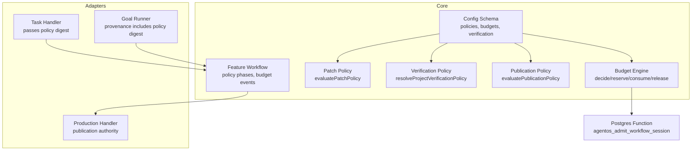
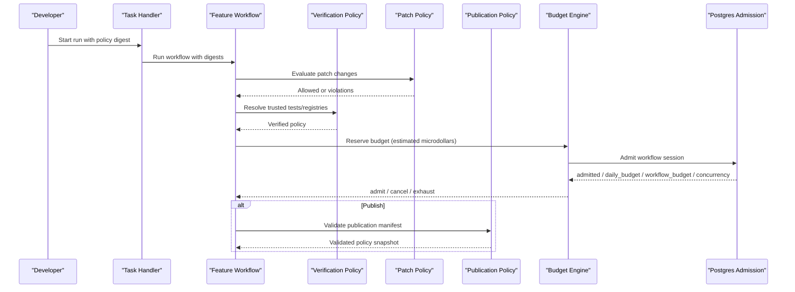
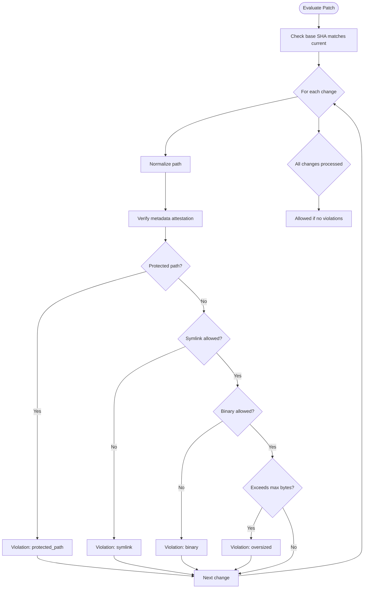
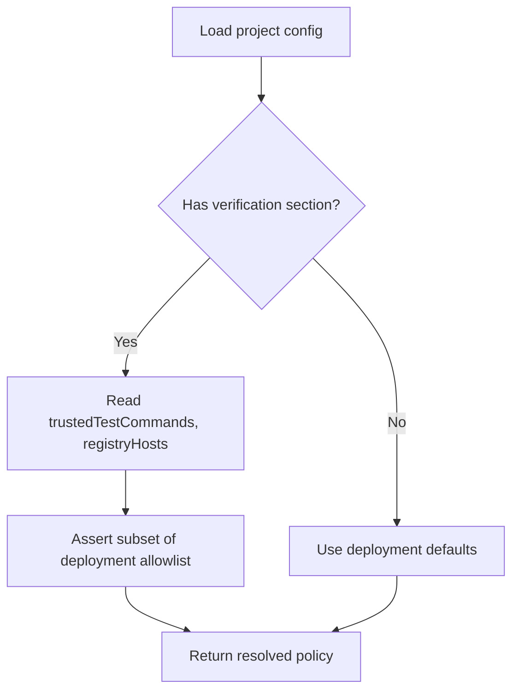
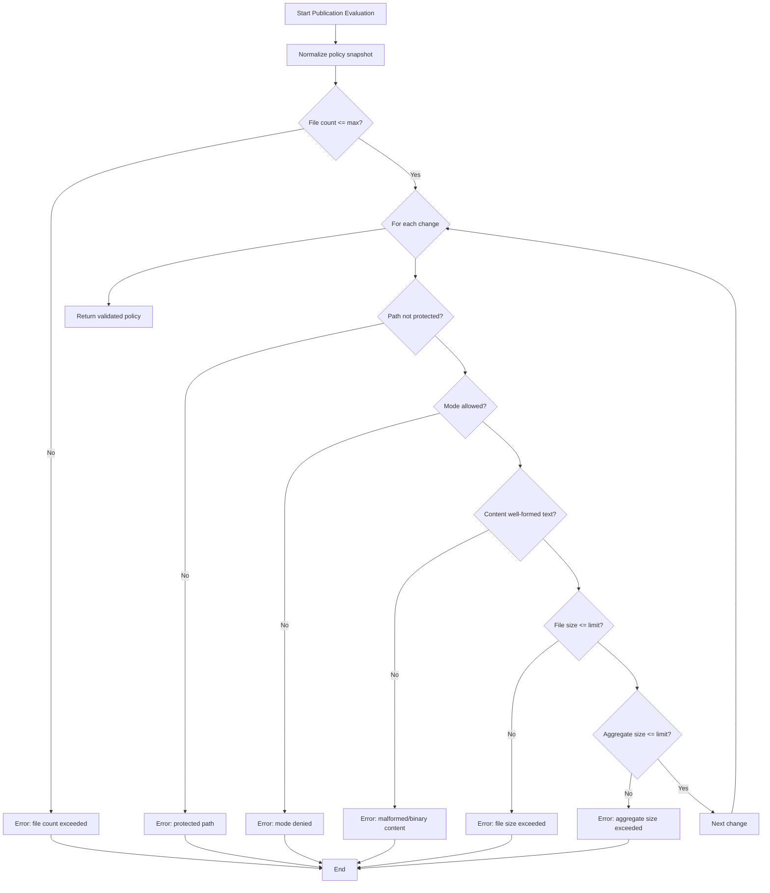
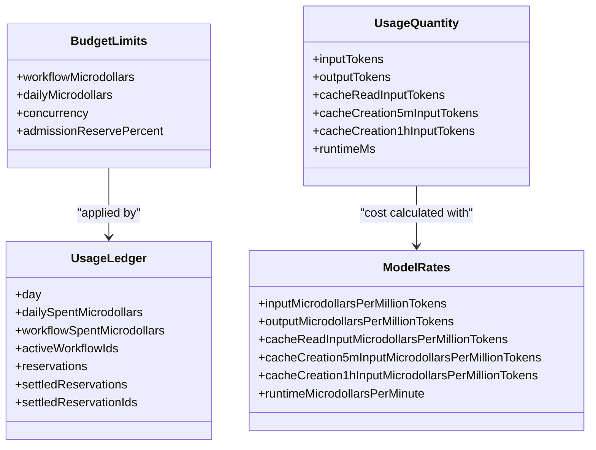
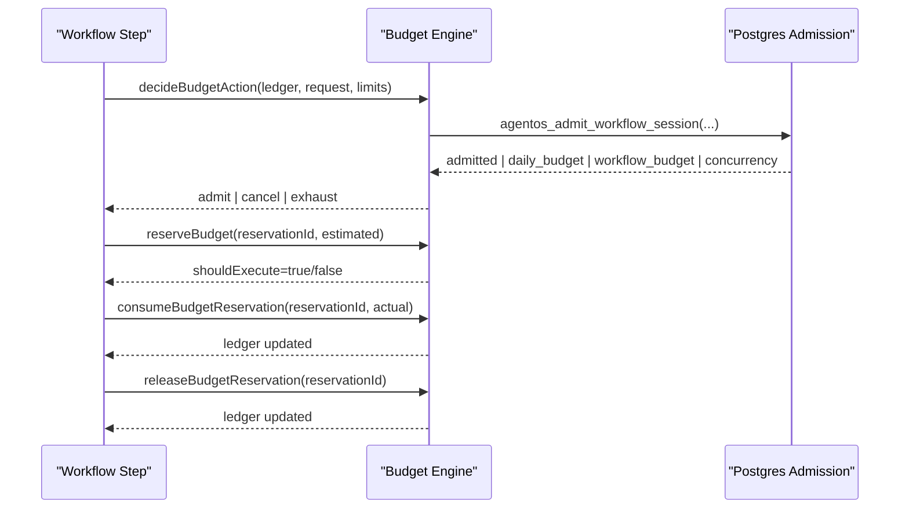
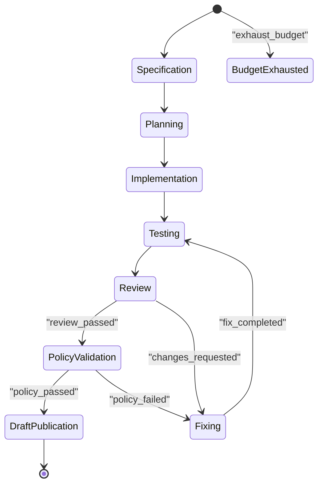
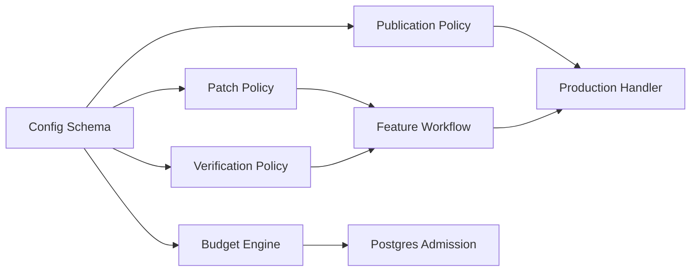

# Policies and Budgets

<cite>
**Referenced Files in This Document**
- [config.ts](file://packages/core/src/config.ts)
- [patch-policy.ts](file://packages/core/src/patch-policy.ts)
- [verification-policy.ts](file://packages/core/src/verification-policy.ts)
- [budget.ts](file://packages/core/src/budget.ts)
- [publication.ts](file://packages/core/src/publication.ts)
- [feature-workflow.ts](file://packages/core/src/feature-workflow.ts)
- [0020_deployment_daily_budget.sql](file://drizzle/0020_deployment_daily_budget.sql)
- [production-handler.ts](file://packages/adapters/src/trigger/production-handler.ts)
- [task-handler.ts](file://packages/adapters/src/trigger/task-handler.ts)
- [goal-feature-runner.ts](file://packages/adapters/src/trigger/goal-feature-runner.ts)
- [types.ts](file://packages/adapters/src/trigger/types.ts)
</cite>

## Table of Contents
1. Introduction
2. Project Structure
3. Core Components
4. Architecture Overview
5. Detailed Component Analysis
6. Dependency Analysis
7. Performance Considerations
8. Troubleshooting Guide
9. Conclusion

## Introduction
This document explains how Agent OS Passerine enforces security, compliance, and quality through policies, and how it controls costs via budgets. It covers:
- Policy types: patch policies for code changes, verification policies for testing and registry access, and publication policies for safe publishing.
- Budget management: per-project spending limits, model usage quotas, concurrency controls, and admission reserves.
- Policy evaluation during workflow execution, budget monitoring and enforcement, and how violations are surfaced and debugged.
- Examples of common configurations and scenarios, plus guidance on versioning and testing policies.

## Project Structure
Policies and budgets are implemented across the core package and adapters that run workflows:
- Configuration schema defines policy and budget shapes and defaults.
- Patch policy evaluates repository changes against protected paths and metadata attestations.
- Verification policy resolves trusted test commands and allowed registries from deployment allowlists.
- Publication policy validates publish manifests, file sizes, modes, and content safety.
- Budget module computes usage cost, admits work within limits, and tracks reservations and settlements.
- Feature workflow integrates policy checks into the lifecycle and supports budget exhaustion as a terminal state.
- Database function enforces admission thresholds and concurrency at the data layer.

**Diagram sources**
- [config.ts:115-133](file://packages/core/src/config.ts#L115-L133)
- [patch-policy.ts:106-195](file://packages/core/src/patch-policy.ts#L106-L195)
- [verification-policy.ts:27-49](file://packages/core/src/verification-policy.ts#L27-L49)
- [publication.ts:255-330](file://packages/core/src/publication.ts#L255-L330)
- [budget.ts:278-331](file://packages/core/src/budget.ts#L278-L331)
- [feature-workflow.ts:258-276](file://packages/core/src/feature-workflow.ts#L258-L276)
- [task-handler.ts:158-168](file://packages/adapters/src/trigger/task-handler.ts#L158-L168)
- [production-handler.ts:567-596](file://packages/adapters/src/trigger/production-handler.ts#L567-L596)
- [goal-feature-runner.ts:28-45](file://packages/adapters/src/trigger/goal-feature-runner.ts#L28-L45)
- [0020_deployment_daily_budget.sql:4-90](file://drizzle/0020_deployment_daily_budget.sql#L4-L90)

**Section sources**
- [config.ts:115-133](file://packages/core/src/config.ts#L115-L133)
- [feature-workflow.ts:258-276](file://packages/core/src/feature-workflow.ts#L258-L276)

## Core Components
- Patch policy: Validates repository changes with attested metadata, protects sensitive paths, and restricts binaries/symlinks/file size.
- Verification policy: Resolves per-project trusted test commands and registry hosts from a deployment allowlist.
- Publication policy: Enforces safe publishing rules including protected paths, file counts/sizes, modes, and content integrity.
- Budget engine: Computes usage cost, admits work under limits (workflow/daily/concurrency), and manages reservations and settlements.
- Feature workflow: Integrates policy checks into the pipeline and treats budget exhaustion as a terminal outcome.

**Section sources**
- [patch-policy.ts:106-195](file://packages/core/src/patch-policy.ts#L106-L195)
- [verification-policy.ts:27-49](file://packages/core/src/verification-policy.ts#L27-L49)
- [publication.ts:255-330](file://packages/core/src/publication.ts#L255-L330)
- [budget.ts:60-127](file://packages/core/src/budget.ts#L60-L127)
- [feature-workflow.ts:258-276](file://packages/core/src/feature-workflow.ts#L258-L276)

## Architecture Overview
The system applies layered policies and budgets throughout the feature workflow:
- During implementation and review, patch policies validate proposed changes.
- After review passes, verification policies ensure tests and dependencies are trusted.
- Before publication, publication policies validate the final change set and evidence.
- At each step, the budget engine estimates and reserves cost; if limits are exceeded, workflows may be canceled or marked budget_exhausted.

**Diagram sources**
- [task-handler.ts:158-168](file://packages/adapters/src/trigger/task-handler.ts#L158-L168)
- [feature-workflow.ts:258-276](file://packages/core/src/feature-workflow.ts#L258-L276)
- [verification-policy.ts:27-49](file://packages/core/src/verification-policy.ts#L27-L49)
- [patch-policy.ts:106-195](file://packages/core/src/patch-policy.ts#L106-L195)
- [publication.ts:255-330](file://packages/core/src/publication.ts#L255-L330)
- [budget.ts:278-331](file://packages/core/src/budget.ts#L278-L331)
- [0020_deployment_daily_budget.sql:4-90](file://drizzle/0020_deployment_daily_budget.sql#L4-L90)

## Detailed Component Analysis

### Patch Policy
Patch policy ensures code changes are safe and auditable:
- Requires attested metadata for each change (path, operation, size, binary flag, symlink flag).
- Protects sensitive paths by default and allows custom patterns.
- Disallows binaries and symlinks unless explicitly permitted.
- Enforces maximum file size.

**Diagram sources**
- [patch-policy.ts:106-195](file://packages/core/src/patch-policy.ts#L106-L195)

**Section sources**
- [patch-policy.ts:106-195](file://packages/core/src/patch-policy.ts#L106-L195)

### Verification Policy
Verification policy binds project configuration to deployment-wide allowlists:
- Trusted test commands must be subset of deployment allowlist.
- Registry hosts must be subset of deployment allowlist.
- If omitted, project inherits deployment defaults.

**Diagram sources**
- [verification-policy.ts:27-49](file://packages/core/src/verification-policy.ts#L27-L49)

**Section sources**
- [verification-policy.ts:27-49](file://packages/core/src/verification-policy.ts#L27-L49)

### Publication Policy
Publication policy governs safe publishing of artifacts and code:
- Validates protected paths, file count/size, aggregate size, and modes.
- Rejects binary content and unsafe text.
- Produces a normalized, canonical policy snapshot used for auditing and digests.

**Diagram sources**
- [publication.ts:255-330](file://packages/core/src/publication.ts#L255-L330)

**Section sources**
- [publication.ts:255-330](file://packages/core/src/publication.ts#L255-L330)

### Budget Management
Budget management controls model usage and resource allocation:
- Usage cost is computed from tokens and runtime using model rates.
- Admission decisions consider workflow caps, daily caps, concurrency, and an admission reserve threshold.
- Reservations provide idempotent accounting with settle semantics (consumed or released).
- Database function enforces admission thresholds and concurrency leases.

**Diagram sources**
- [budget.ts:13-23](file://packages/core/src/budget.ts#L13-L23)
- [budget.ts:129-137](file://packages/core/src/budget.ts#L129-L137)
- [budget.ts:223-228](file://packages/core/src/budget.ts#L223-L228)

**Diagram sources**
- [budget.ts:278-331](file://packages/core/src/budget.ts#L278-L331)
- [budget.ts:346-407](file://packages/core/src/budget.ts#L346-L407)
- [budget.ts:448-495](file://packages/core/src/budget.ts#L448-L495)
- [0020_deployment_daily_budget.sql:4-90](file://drizzle/0020_deployment_daily_budget.sql#L4-L90)

**Section sources**
- [budget.ts:60-127](file://packages/core/src/budget.ts#L60-L127)
- [budget.ts:278-331](file://packages/core/src/budget.ts#L278-L331)
- [budget.ts:346-407](file://packages/core/src/budget.ts#L346-L407)
- [budget.ts:448-495](file://packages/core/src/budget.ts#L448-L495)
- [0020_deployment_daily_budget.sql:4-90](file://drizzle/0020_deployment_daily_budget.sql#L4-L90)

### Policy Integration in Workflows
- The feature workflow transitions into a policy validation phase after review passes.
- On policy_passed, it proceeds to draft publication; on policy_failed, it returns to fixing.
- Budget exhaustion is a terminal state that stops further execution.

**Diagram sources**
- [feature-workflow.ts:258-276](file://packages/core/src/feature-workflow.ts#L258-L276)
- [feature-workflow.ts:178-181](file://packages/core/src/feature-workflow.ts#L178-L181)

**Section sources**
- [feature-workflow.ts:258-276](file://packages/core/src/feature-workflow.ts#L258-L276)

### Example Configurations and Scenarios
- Patch policy example: protect .git and CODEOWNERS, disallow binaries and symlinks, cap files at 1 MB.
- Verification policy example: allow only “pnpm test” and “pnpm typecheck”, restrict registries to npm and pypi.
- Budget scenario: workflowMicrodollars=1000, dailyMicrodollars=10000, concurrency=2, admissionReservePercent=80.
- Publication scenario: enforce allowedModes ["100644","100755"], reject deletes, cap total bytes to 5 MB.

These examples align with the schema definitions and constraints enforced by the configuration and policy modules.

**Section sources**
- [config.ts:115-133](file://packages/core/src/config.ts#L115-L133)
- [publication.ts:56-71](file://packages/core/src/publication.ts#L56-L71)

## Dependency Analysis
- Configuration drives policy and budget behavior; changes to config affect all downstream evaluations.
- Patch policy depends on attestation verifier for metadata trust.
- Verification policy depends on deployment allowlists to constrain project settings.
- Publication policy depends on canonicalization and hashing for deterministic policy snapshots.
- Budget engine depends on model rates and usage quantities to compute costs; database function enforces admission and concurrency.
- Adapters pass policy digests and evidence to ensure reproducibility and auditability.

**Diagram sources**
- [config.ts:115-133](file://packages/core/src/config.ts#L115-L133)
- [patch-policy.ts:106-195](file://packages/core/src/patch-policy.ts#L106-L195)
- [verification-policy.ts:27-49](file://packages/core/src/verification-policy.ts#L27-L49)
- [publication.ts:255-330](file://packages/core/src/publication.ts#L255-L330)
- [budget.ts:278-331](file://packages/core/src/budget.ts#L278-L331)
- [production-handler.ts:567-596](file://packages/adapters/src/trigger/production-handler.ts#L567-L596)

**Section sources**
- [production-handler.ts:567-596](file://packages/adapters/src/trigger/production-handler.ts#L567-L596)
- [task-handler.ts:158-168](file://packages/adapters/src/trigger/task-handler.ts#L158-L168)
- [goal-feature-runner.ts:28-45](file://packages/adapters/src/trigger/goal-feature-runner.ts#L28-L45)

## Performance Considerations
- Use conservative admissionReservePercent to avoid overcommitting resources before execution completes.
- Keep protectedPaths minimal but sufficient to prevent accidental modifications to critical areas.
- Limit allowed registry hosts to reduce dependency resolution overhead and risk.
- Tune concurrency to match available compute capacity; excessive concurrency can lead to frequent cancellations.
- Prefer smaller patches and avoid large binary files to keep policy evaluation fast.

[No sources needed since this section provides general guidance]

## Troubleshooting Guide
Common issues and debugging steps:
- Patch violations:
  - stale_base: Ensure base SHA matches current base.
  - protected_path: Avoid modifying protected paths; adjust policy if necessary.
  - untrusted_metadata: Provide correct metadata attestation for each change.
- Verification failures:
  - Ensure test commands and registry hosts are within deployment allowlist.
- Publication errors:
  - Check protected paths, file modes, and content for forbidden characters or binary data.
  - Validate aggregate size and per-file size limits.
- Budget exhaustion:
  - Review estimated vs actual microdollars; adjust estimates or limits.
  - Inspect reservation IDs and settlement outcomes for idempotency issues.
  - Use database admission logs to determine whether daily_budget, workflow_budget, or concurrency blocked admission.

**Section sources**
- [patch-policy.ts:106-195](file://packages/core/src/patch-policy.ts#L106-L195)
- [verification-policy.ts:27-49](file://packages/core/src/verification-policy.ts#L27-L49)
- [publication.ts:255-330](file://packages/core/src/publication.ts#L255-L330)
- [budget.ts:278-331](file://packages/core/src/budget.ts#L278-L331)
- [0020_deployment_daily_budget.sql:4-90](file://drizzle/0020_deployment_daily_budget.sql#L4-L90)

## Conclusion
Agent OS Passerine enforces robust policies and budgets to secure development workflows and control costs. Patch policies protect code integrity, verification policies ensure trusted testing and dependencies, and publication policies guarantee safe releases. Budgets provide granular control over model usage and concurrency, with strong guarantees via reservations and database-enforced admission. Together, these mechanisms create a reliable, auditable, and cost-aware development environment.

[No sources needed since this section summarizes without analyzing specific files]