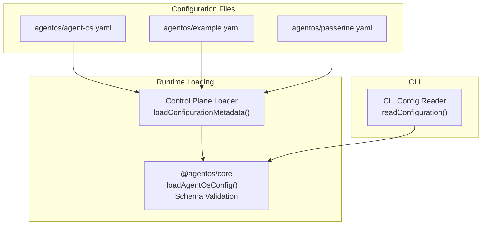
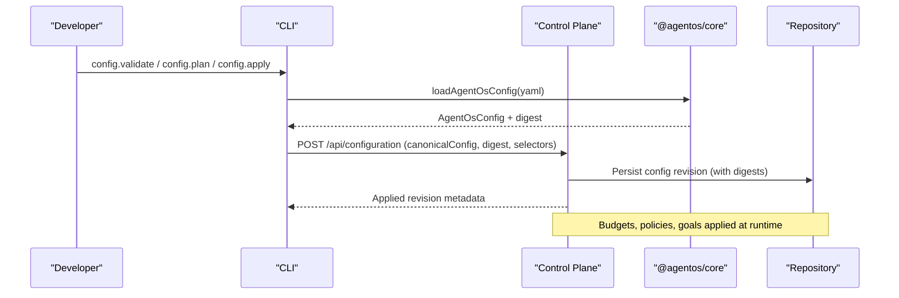
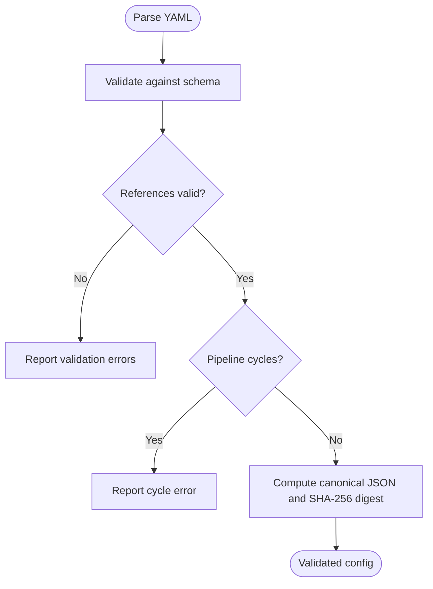
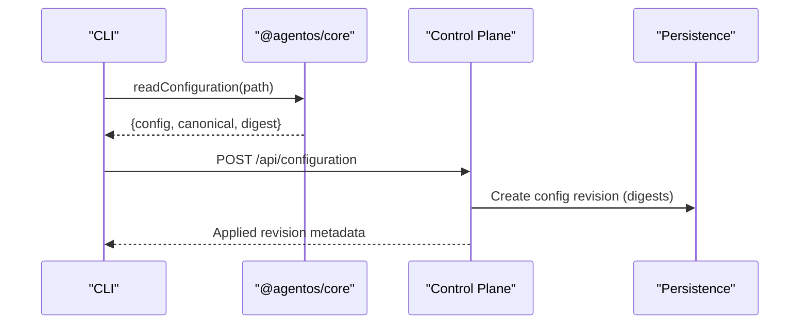
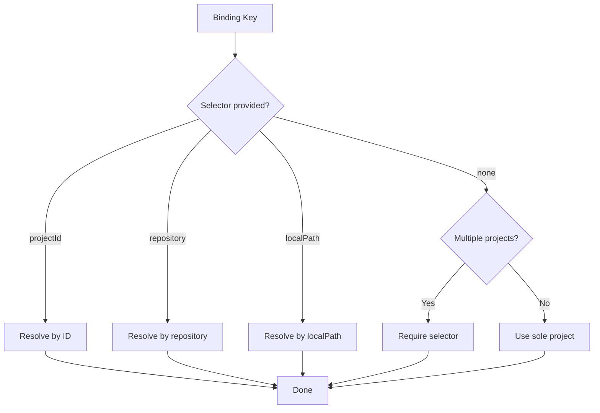
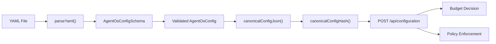

# Projects and Configuration

<cite>
**Referenced Files in This Document**
- [config.ts](file://packages/core/src/config.ts)
- [configuration-loader.ts](file://apps/control-plane/src/config/configuration-loader.ts)
- [agent-os.yaml](file://agentos/agent-os.yaml)
- [example.yaml](file://agentos/example.yaml)
- [passerine.yaml](file://agentos/passerine.yaml)
- [config-files.ts](file://apps/cli/src/config-files.ts)
- [contracts.ts](file://apps/control-plane/src/http/contracts.ts)
- [budget.ts](file://packages/core/src/budget.ts)
- [control-plane-service.test.ts](file://apps/control-plane/src/application/control-plane-service.test.ts)
</cite>

## Table of Contents
1. [Introduction](#introduction)
2. [Project Structure](#project-structure)
3. [Core Components](#core-components)
4. [Architecture Overview](#architecture-overview)
5. [Detailed Component Analysis](#detailed-component-analysis)
6. [Dependency Analysis](#dependency-analysis)
7. [Performance Considerations](#performance-considerations)
8. [Troubleshooting Guide](#troubleshooting-guide)
9. [Conclusion](#conclusion)
10. [Appendices](#appendices)

## Introduction
This document explains how Agent OS Passerine models projects as isolated units of work, each with its own configuration, budgets, policies, environments, and pipelines. It details the project configuration schema, validation, loading, and application across environments, and provides practical examples for common scenarios such as single-repository development, multi-repository coordination, and team collaboration setups. It also covers configuration inheritance via environment definitions, overrides at agent or pipeline step levels, and best practices for managing configuration at scale.

## Project Structure
Agent OS configurations are YAML files that define:
- Project identity and repository binding
- AI model profiles and providers
- Agents and their runtime environments
- Pipelines composed of steps
- Policies controlling file changes and tool access
- Budgets limiting cost and concurrency
- Goal limits and runtime routing

The repository includes example configurations to illustrate these concepts:
- A minimal local example
- An end-to-end multi-agent workflow configuration
- A starter template used by the CLI

**Diagram sources**
- [configuration-loader.ts:34-77](file://apps/control-plane/src/config/configuration-loader.ts#L34-L77)
- [config.ts:335-337](file://packages/core/src/config.ts#L335-L337)
- [config-files.ts:207-234](file://apps/cli/src/config-files.ts#L207-L234)

**Section sources**
- [agent-os.yaml:1-61](file://agentos/agent-os.yaml#L1-L61)
- [example.yaml:1-73](file://agentos/example.yaml#L1-L73)
- [passerine.yaml:1-252](file://agentos/passerine.yaml#L1-L252)
- [configuration-loader.ts:34-77](file://apps/control-plane/src/config/configuration-loader.ts#L34-L77)
- [config-files.ts:207-234](file://apps/cli/src/config-files.ts#L207-L234)

## Core Components
- Project identity and binding: name, default branch, optional repository URL or local path (mutually exclusive).
- Models: provider, model identifier, token pricing, and runtime cost per minute.
- Agents: which model and environment to use, tools, MCP servers, retries, timeouts, and optional prompts.
- Environments: runtime type, variables, tools, MCP servers, networking policy, and package installs.
- Pipelines: named workflows composed of ordered steps referencing agents and optional per-step overrides.
- Policies: protected paths, binary/symlink handling, max file size, and allow/deny lists for tools and MCPs.
- Budgets: workflow-level and daily caps, concurrency limits, and admission reserve percentage.
- Goals: maximum steps, retries, and timeout per goal execution.
- Runtime: provider and routing of model profiles to runtimes.

Validation is enforced through a strict schema with cross-field checks (e.g., unknown model/environment references, duplicate step IDs, dependency cycles). Canonicalization and hashing ensure deterministic configuration digests for change detection and idempotent applies.

**Section sources**
- [config.ts:10-22](file://packages/core/src/config.ts#L10-L22)
- [config.ts:39-148](file://packages/core/src/config.ts#L39-L148)
- [config.ts:165-327](file://packages/core/src/config.ts#L165-L327)
- [config.ts:335-369](file://packages/core/src/config.ts#L335-L369)

## Architecture Overview
Configuration flows from YAML into validated structures, then into control plane services that persist revisions and enforce budgets and policies. The CLI can validate, plan, and apply configurations to the control plane.

**Diagram sources**
- [configuration-loader.ts:34-77](file://apps/control-plane/src/config/configuration-loader.ts#L34-L77)
- [config.ts:335-369](file://packages/core/src/config.ts#L335-L369)
- [contracts.ts:56-82](file://apps/control-plane/src/http/contracts.ts#L56-L82)

## Detailed Component Analysis

### Project Configuration Schema
The schema defines the complete shape of an Agent OS project configuration:
- version: fixed literal
- project: name, defaultBranch, optional repository URL or absolute localPath (mutually exclusive)
- models: map of model profile names to provider, model, and cost fields
- agents: map of agent names to model, environment, tools, mcps, retries, timeoutMs, optional prompt
- environments: map of environment names to runtime, variables, tools, mcps, networking, packages
- pipelines: map of pipeline names to ordered steps with agent, optional environment, dependsOn, retries, timeoutMs
- policies: protectedPaths, allowBinary, allowSymlinks, maxFileBytes, tools allow/deny, mcp allow/deny
- budgets: workflowMicrodollars, dailyMicrodollars, concurrency, admissionReservePercent
- goals: maxSteps, maxRetries, timeoutMs
- runtime: provider and routing map from model profile to runtime

Cross-field validations include:
- Unknown model or environment references
- Duplicate step IDs within a pipeline
- Self-dependencies and unknown dependencies
- Dependency cycles
- Mutually exclusive repository/localPath

**Diagram sources**
- [config.ts:165-327](file://packages/core/src/config.ts#L165-L327)
- [config.ts:335-369](file://packages/core/src/config.ts#L335-L369)

**Section sources**
- [config.ts:165-327](file://packages/core/src/config.ts#L165-L327)

### Environment Variables and Inheritance
Environments provide isolation and configuration reuse:
- Each environment defines runtime, variables, tools, MCP servers, networking, and optional packages.
- Agents reference an environment; pipelines can override environment per step.
- Variables are key-value pairs injected into the environment at runtime.
- Networking can be limited or unrestricted, with host allowlists and flags for MCP servers and package managers.

Inheritance pattern:
- Base environment settings are defined centrally.
- Agents inherit environment defaults unless overridden at the step level.
- Tools and MCPs can be scoped per environment or per step.

**Section sources**
- [config.ts:66-98](file://packages/core/src/config.ts#L66-L98)
- [config.ts:100-113](file://packages/core/src/config.ts#L100-L113)
- [passerine.yaml:165-204](file://agentos/passerine.yaml#L165-L204)

### GitHub Repository Settings and Local Paths
Projects can bind to:
- A remote Git repository URL
- A local absolute path (for experiments)

Mutual exclusivity ensures clarity about where source code lives. The loader resolves configuration location based on environment variables and working directory context.

Best practices:
- Use repository URLs for CI-driven automation and reproducible runs.
- Use local paths only for controlled experimentation within operator workspaces.

**Section sources**
- [config.ts:168-195](file://packages/core/src/config.ts#L168-L195)
- [configuration-loader.ts:34-52](file://apps/control-plane/src/config/configuration-loader.ts#L34-L52)

### AI Model Providers and Routing
Model profiles specify:
- Provider (e.g., local, anthropic)
- Model identifier
- Pricing fields for input/output tokens and runtime minutes

Routing maps model profiles to runtimes, enabling different providers to execute under distinct runtimes while sharing other configuration.

Examples in this repository:
- Local test model profile
- Anthropic Sonnet model profile
- Commented Moonshot Kimi profile for optional routing

**Section sources**
- [config.ts:39-52](file://packages/core/src/config.ts#L39-L52)
- [config.ts:143-148](file://packages/core/src/config.ts#L143-L148)
- [example.yaml:5-19](file://agentos/example.yaml#L5-L19)
- [passerine.yaml:6-12](file://agentos/passerine.yaml#L6-L12)

### Budget Limits and Concurrency Control
Budgets enforce:
- Per-workflow microdollar cap
- Daily microdollar cap
- Concurrency limit
- Admission reserve percentage to protect ongoing runs

Admission decisions consider current usage, outstanding reservations, and concurrency slots. When limits are exceeded, runs may be canceled or exhausted.

**Section sources**
- [config.ts:126-133](file://packages/core/src/config.ts#L126-L133)
- [budget.ts:223-316](file://packages/core/src/budget.ts#L223-L316)

### Policy Definitions
Policies protect sensitive paths and constrain operations:
- Protected paths list prevents accidental modifications to critical files
- Binary and symlink controls reduce risk
- Max file size limits prevent large uploads
- Tool and MCP allow/deny lists restrict capabilities

Defaults include protection for Git internals, CI workflows, CODEOWNERS, environment files, and the agentos directory.

**Section sources**
- [config.ts:10-22](file://packages/core/src/config.ts#L10-L22)
- [config.ts:115-124](file://packages/core/src/config.ts#L115-L124)
- [agent-os.yaml:31-48](file://agentos/agent-os.yaml#L31-L48)
- [passerine.yaml:218-239](file://agentos/passerine.yaml#L218-L239)

### Configuration Validation, Loading, and Application
Loading:
- The control plane loader reads YAML from a configured path or default location
- Requires AGENTOS_CONFIG_PATH in production
- Parses and validates using @agentos/core
- Computes canonical JSON and digest

Application:
- CLI reads and validates configuration, enforces size limits, and computes digest
- Control plane API accepts canonical configuration and digest with optional selectors
- Revisions are persisted with digests for models, prompts, environments, and policies

**Diagram sources**
- [config-files.ts:207-234](file://apps/cli/src/config-files.ts#L207-L234)
- [configuration-loader.ts:34-77](file://apps/control-plane/src/config/configuration-loader.ts#L34-L77)
- [contracts.ts:56-82](file://apps/control-plane/src/http/contracts.ts#L56-L82)

**Section sources**
- [configuration-loader.ts:34-77](file://apps/control-plane/src/config/configuration-loader.ts#L34-L77)
- [config-files.ts:207-234](file://apps/cli/src/config-files.ts#L207-L234)
- [contracts.ts:56-82](file://apps/control-plane/src/http/contracts.ts#L56-L82)

### Multi-Project Configuration and Selection
Projects are identified by bindings:
- repository URL
- localPath
- name (fallback when no repository/localPath)

Selection rules:
- If multiple projects exist, a selector (projectId, repository, or localPath) is required
- Legacy singleton project is preserved if its latest binding matches
- Applying configuration creates independent revision chains per project

**Diagram sources**
- [control-plane-service.test.ts:1575-1602](file://apps/control-plane/src/application/control-plane-service.test.ts#L1575-L1602)
- [control-plane-service.test.ts:1696-1738](file://apps/control-plane/src/application/control-plane-service.test.ts#L1696-L1738)

**Section sources**
- [control-plane-service.test.ts:1575-1602](file://apps/control-plane/src/application/control-plane-service.test.ts#L1575-L1602)
- [control-plane-service.test.ts:1696-1738](file://apps/control-plane/src/application/control-plane-service.test.ts#L1696-L1738)

### Examples of Complete Project Configurations

#### Single-Repository Development
A minimal configuration suitable for local development:
- Project name and default branch
- Local model profile for testing
- Single agent and pipeline
- Default policies and budgets
- Managed runtime provider

Reference:
- [agent-os.yaml:1-61](file://agentos/agent-os.yaml#L1-L61)

#### Multi-Repository Coordination
End-to-end configuration demonstrating:
- Remote repository binding
- Multiple agents (specifier, planner, implementer, reviewer, verifier)
- Distinct environments per stage with limited networking
- Pipeline orchestration across steps
- Tight policies protecting sensitive paths
- Higher budgets for complex workflows

Reference:
- [passerine.yaml:1-252](file://agentos/passerine.yaml#L1-L252)

#### Team Collaboration Setup
Recommended patterns:
- Centralize shared environment definitions for consistent tooling and networking
- Define reusable model profiles per provider and route selectively
- Use pipelines to standardize review and verification stages
- Apply strict policies to protect CI and secrets
- Set budgets to cap costs and concurrency to manage team load

Reference:
- [passerine.yaml:165-204](file://agentos/passerine.yaml#L165-L204)
- [passerine.yaml:205-252](file://agentos/passerine.yaml#L205-L252)

### Configuration Inheritance and Overrides
- Agents inherit environment defaults unless overridden
- Pipeline steps can override environment, retries, and timeout
- Policies and budgets apply globally but can be tuned per project
- Environments encapsulate variables, tools, MCPs, networking, and packages

Best practice:
- Keep base environments lean and extend via step-level overrides when necessary
- Avoid duplicating environment definitions; prefer composition through references

**Section sources**
- [config.ts:54-64](file://packages/core/src/config.ts#L54-L64)
- [config.ts:100-113](file://packages/core/src/config.ts#L100-L113)
- [passerine.yaml:165-204](file://agentos/passerine.yaml#L165-L204)

### Best Practices for Managing Configuration at Scale
- Pin versions and compute digests to ensure reproducibility
- Use canonical configuration to detect semantic changes and plan updates
- Separate concerns: models, agents, environments, pipelines, policies
- Protect sensitive paths and restrict tools/MCPs explicitly
- Set realistic budgets and concurrency limits to avoid resource contention
- Prefer repository bindings for CI and automation; use local paths only for experiments
- Select projects explicitly when multiple exist to avoid ambiguity

**Section sources**
- [config.ts:335-369](file://packages/core/src/config.ts#L335-L369)
- [budget.ts:223-316](file://packages/core/src/budget.ts#L223-L316)
- [configuration-loader.ts:34-52](file://apps/control-plane/src/config/configuration-loader.ts#L34-L52)

## Dependency Analysis
Configuration components depend on:
- YAML parsing and Zod-based schema validation
- Canonicalization and hashing for deterministic digests
- Control plane APIs for applying and selecting configurations
- Budget logic for admission and concurrency control

**Diagram sources**
- [config.ts:335-369](file://packages/core/src/config.ts#L335-L369)
- [contracts.ts:56-82](file://apps/control-plane/src/http/contracts.ts#L56-L82)
- [budget.ts:223-316](file://packages/core/src/budget.ts#L223-L316)

**Section sources**
- [config.ts:335-369](file://packages/core/src/config.ts#L335-L369)
- [contracts.ts:56-82](file://apps/control-plane/src/http/contracts.ts#L56-L82)
- [budget.ts:223-316](file://packages/core/src/budget.ts#L223-L316)

## Performance Considerations
- Canonicalization sorts keys deterministically, ensuring stable digests regardless of field order
- Size limits prevent oversized configurations from being processed or transmitted
- Budget checks short-circuit admissions when limits are reached, reducing unnecessary work
- Concurrency limits prevent resource exhaustion during high-load periods

[No sources needed since this section provides general guidance]

## Troubleshooting Guide
Common issues and resolutions:
- Missing AGENTOS_CONFIG_PATH in production: set the environment variable to point to your configuration file
- Invalid configuration: fix schema violations reported by validation; check unknown model/environment references and duplicate step IDs
- Too-large canonical configuration: reduce configuration size or split into smaller, focused configs
- Project selection ambiguity: provide projectId, repository, or localPath when multiple projects exist
- Budget exhaustion: adjust workflowMicrodollars, dailyMicrodollars, or concurrency; review admissionReservePercent

**Section sources**
- [configuration-loader.ts:34-52](file://apps/control-plane/src/config/configuration-loader.ts#L34-L52)
- [config-files.ts:187-234](file://apps/cli/src/config-files.ts#L187-L234)
- [contracts.ts:56-82](file://apps/control-plane/src/http/contracts.ts#L56-L82)
- [budget.ts:223-316](file://packages/core/src/budget.ts#L223-L316)

## Conclusion
Agent OS Passerine treats projects as isolated, configurable units with robust validation, deterministic hashing, and clear selection semantics. By leveraging environments, policies, budgets, and pipelines, teams can build reliable, secure, and cost-controlled automation workflows. Following the recommended practices ensures scalability and maintainability across single and multi-repository setups.

[No sources needed since this section summarizes without analyzing specific files]

## Appendices

### Appendix A: Reference Configurations
- Minimal local example: [agent-os.yaml:1-61](file://agentos/agent-os.yaml#L1-L61)
- Full multi-agent workflow: [passerine.yaml:1-252](file://agentos/passerine.yaml#L1-L252)
- Starter template used by CLI: [config-files.ts:79-139](file://apps/cli/src/config-files.ts#L79-L139)

**Section sources**
- [agent-os.yaml:1-61](file://agentos/agent-os.yaml#L1-L61)
- [passerine.yaml:1-252](file://agentos/passerine.yaml#L1-L252)
- [config-files.ts:79-139](file://apps/cli/src/config-files.ts#L79-L139)