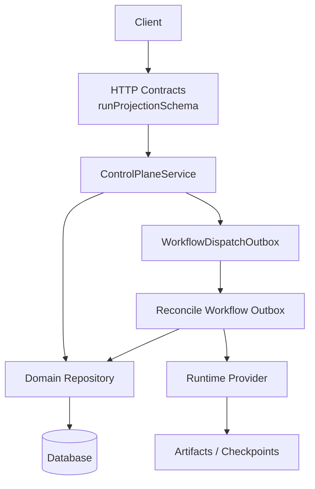
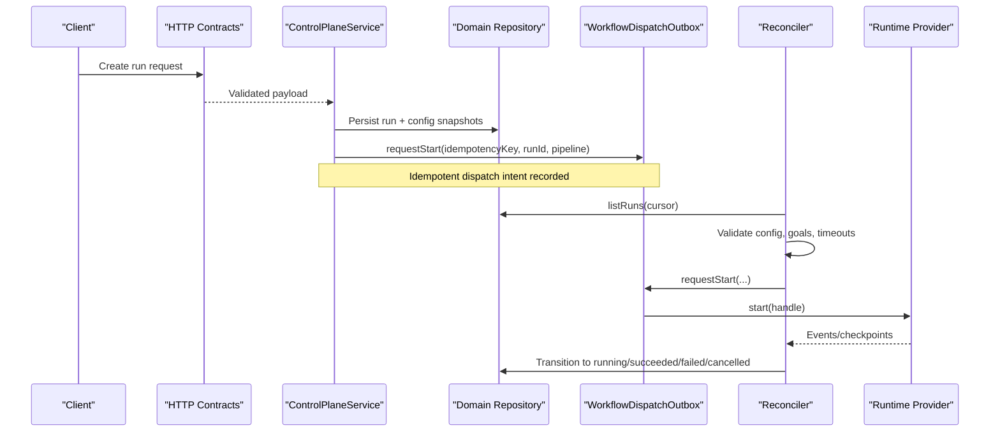
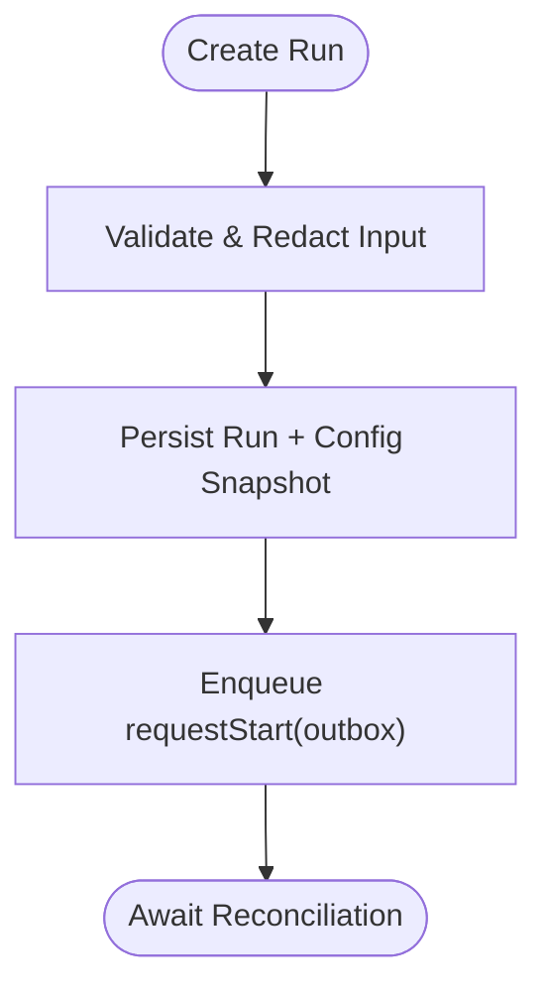
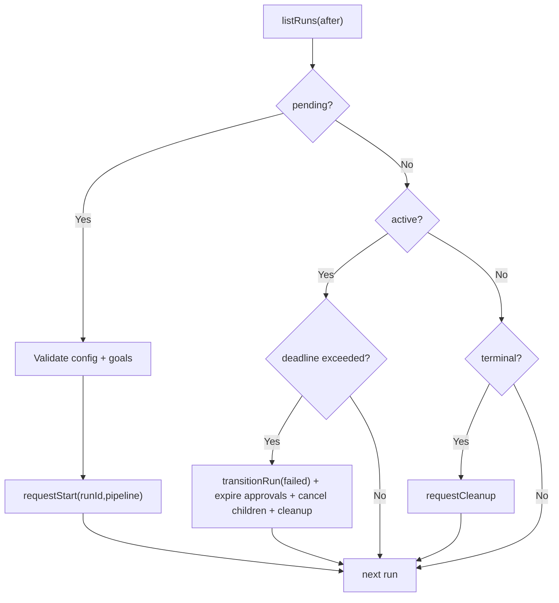
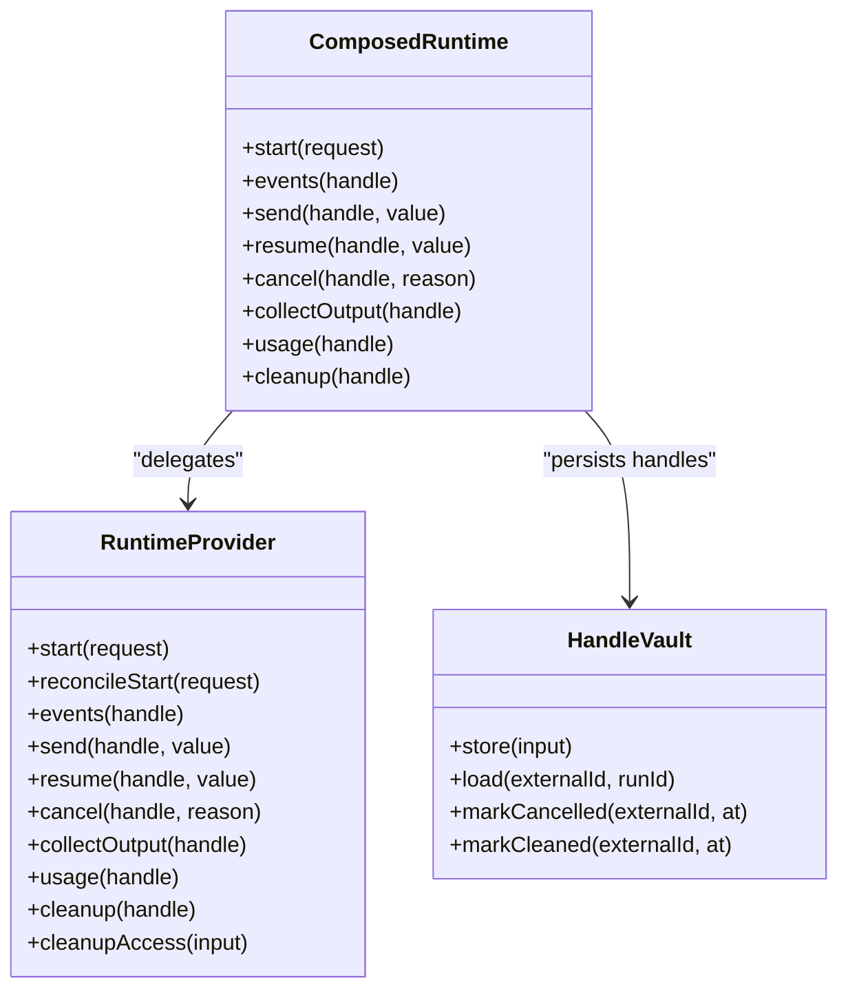
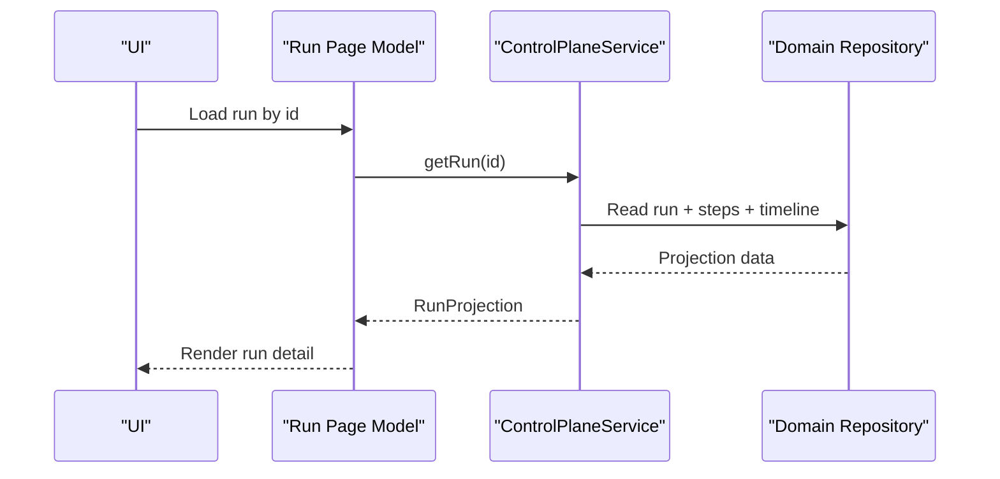
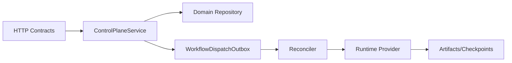

# Runs and Execution Context

<cite>
**Referenced Files in This Document**
- [runtime.ts](file://apps/control-plane/src/application/runtime.ts)
- [workflow-reconciliation.ts](file://apps/control-plane/src/application/workflow-reconciliation.ts)
- [control-plane-service.ts](file://apps/control-plane/src/application/control-plane-service.ts)
- [contracts.ts](file://apps/control-plane/src/http/contracts.ts)
- [run-page-model.ts](file://apps/control-plane/src/application/run-page-model.ts)
- [0000_domain_persistence.sql](file://drizzle/0000_domain_persistence.sql)
</cite>

## Table of Contents
1. [Introduction](#introduction)
2. [Project Structure](#project-structure)
3. [Core Components](#core-components)
4. [Architecture Overview](#architecture-overview)
5. [Detailed Component Analysis](#detailed-component-analysis)
6. [Dependency Analysis](#dependency-analysis)
7. [Performance Considerations](#performance-considerations)
8. [Troubleshooting Guide](#troubleshooting-guide)
9. [Conclusion](#conclusion)

## Introduction
This document explains how Agent OS Passerine models, executes, and observes runs—individual executions of workflows that carry their own context, state, and lifecycle. It covers run metadata (timestamps, provenance, steps, timeline), execution isolation, persistence, replay, debugging, concurrency and resource controls, and strategies for monitoring performance.

## Project Structure
Runs are created via HTTP contracts, persisted through the domain repository, reconciled by a background process, and executed against runtime providers. The control plane exposes read projections for UIs and APIs.

**Diagram sources**
- [contracts.ts:130-263](file://apps/control-plane/src/http/contracts.ts#L130-L263)
- [control-plane-service.ts:669-701](file://apps/control-plane/src/application/control-plane-service.ts#L669-L701)
- [workflow-reconciliation.ts:156-507](file://apps/control-plane/src/application/workflow-reconciliation.ts#L156-L507)
- [runtime.ts:387-571](file://apps/control-plane/src/application/runtime.ts#L387-L571)

**Section sources**
- [contracts.ts:130-263](file://apps/control-plane/src/http/contracts.ts#L130-L263)
- [control-plane-service.ts:669-701](file://apps/control-plane/src/application/control-plane-service.ts#L669-L701)
- [workflow-reconciliation.ts:156-507](file://apps/control-plane/src/application/workflow-reconciliation.ts#L156-L507)
- [runtime.ts:387-571](file://apps/control-plane/src/application/runtime.ts#L387-L571)

## Core Components
- Run projection and schema define the canonical shape of a run’s metadata, status, input, error, goal details, outcome, timestamps, steps, and timeline events.
- Control Plane Service orchestrates run creation, project resolution, and integration with dispatch outbox and artifact stores.
- Workflow Reconciliation scans pending/active runs, enforces timeouts, transitions terminal states, cancels children, and emits start/cancel/cleanup requests.
- Runtime composition wires managed and optional kimi providers, handle vaulting, checkpoints, and durable outbox delivery.
- Page model loads a single run safely for UI consumption.

**Section sources**
- [contracts.ts:130-263](file://apps/control-plane/src/http/contracts.ts#L130-L263)
- [control-plane-service.ts:669-701](file://apps/control-plane/src/application/control-plane-service.ts#L669-L701)
- [workflow-reconciliation.ts:156-507](file://apps/control-plane/src/application/workflow-reconciliation.ts#L156-L507)
- [runtime.ts:301-385](file://apps/control-plane/src/application/runtime.ts#L301-L385)
- [run-page-model.ts:11-32](file://apps/control-plane/src/application/run-page-model.ts#L11-L32)

## Architecture Overview
The system separates concerns across layers:
- HTTP layer validates inputs and returns typed projections.
- Service layer composes business logic and integrates with storage and dispatch.
- Reconciliation ensures eventual consistency, timeout enforcement, and cleanup.
- Runtime provides isolated execution contexts and durable checkpointing.

**Diagram sources**
- [contracts.ts:130-263](file://apps/control-plane/src/http/contracts.ts#L130-L263)
- [control-plane-service.ts:669-701](file://apps/control-plane/src/application/control-plane-service.ts#L669-L701)
- [workflow-reconciliation.ts:156-507](file://apps/control-plane/src/application/workflow-reconciliation.ts#L156-L507)
- [runtime.ts:387-571](file://apps/control-plane/src/application/runtime.ts#L387-L571)

## Detailed Component Analysis

### Run Model and Metadata
A run carries:
- Identity and project association
- Pipeline type and lifecycle status
- Input summary (title, description)
- Error envelope (code, message, details)
- Goal-specific fields when applicable (steps, criteria, child runs)
- Outcome hints (e.g., draft PR URL)
- Provenance digests (repository SHA, config/model/prompt/environment/policy)
- Timestamps (createdAt, updatedAt)
- Steps and timeline events for full auditability

These fields are enforced by the run projection schema and projected from domain records.

**Section sources**
- [contracts.ts:130-263](file://apps/control-plane/src/http/contracts.ts#L130-L263)
- [control-plane-service.ts:478-544](file://apps/control-plane/src/application/control-plane-service.ts#L478-L544)

### Creation and Dispatch
- Inputs are validated at the boundary and transformed into a durable input object including idempotency key and provenance digests.
- A run is persisted with its configuration snapshot and digests.
- An idempotent start intent is written to the workflow dispatch outbox for later delivery.

**Diagram sources**
- [control-plane-service.ts:456-476](file://apps/control-plane/src/application/control-plane-service.ts#L456-L476)
- [runtime.ts:547-571](file://apps/control-plane/src/application/runtime.ts#L547-L571)

**Section sources**
- [control-plane-service.ts:456-476](file://apps/control-plane/src/application/control-plane-service.ts#L456-L476)
- [runtime.ts:547-571](file://apps/control-plane/src/application/runtime.ts#L547-L571)

### Reconciliation and Lifecycle Transitions
The reconciler:
- Scans runs by cursor and page size
- For feature/goal runs in pending state, validates config snapshots and goal criteria, then enqueues start
- Enforces per-run timeouts; on deadline exceeded, marks failed, expires approvals, cancels children (for goals), and requests cleanup
- On cancellation or terminal states, requests cancel/cleanup intents
- Observes approval events and resumes workflows accordingly

**Diagram sources**
- [workflow-reconciliation.ts:156-507](file://apps/control-plane/src/application/workflow-reconciliation.ts#L156-L507)

**Section sources**
- [workflow-reconciliation.ts:156-507](file://apps/control-plane/src/application/workflow-reconciliation.ts#L156-L507)

### Execution Context and Isolation
- Each run obtains a runtime handle stored securely and associated with the run.
- The composed runtime provider isolates execution between managed agents and optional kimi sessions.
- Handles can be marked cancelled or cleaned up; usage and output collection are supported per handle.
- Durable checkpoints enable recovery and resumption after interruptions.

**Diagram sources**
- [runtime.ts:301-385](file://apps/control-plane/src/application/runtime.ts#L301-L385)
- [runtime.ts:538-571](file://apps/control-plane/src/application/runtime.ts#L538-L571)

**Section sources**
- [runtime.ts:301-385](file://apps/control-plane/src/application/runtime.ts#L301-L385)
- [runtime.ts:538-571](file://apps/control-plane/src/application/runtime.ts#L538-L571)

### Persistence, Replay, and Debugging
- Runs, steps, events, approvals, and config snapshots are persisted, enabling full history.
- Timeline events provide an ordered sequence of occurrences with payloads for approvals, messages, decisions, and summaries.
- Cursor-based reconciliation supports restartable scans without reprocessing completed cycles.
- Source snapshot binding ensures reproducible builds tied to repository SHAs.

**Diagram sources**
- [run-page-model.ts:11-32](file://apps/control-plane/src/application/run-page-model.ts#L11-L32)
- [control-plane-service.ts:669-701](file://apps/control-plane/src/application/control-plane-service.ts#L669-L701)

**Section sources**
- [run-page-model.ts:11-32](file://apps/control-plane/src/application/run-page-model.ts#L11-L32)
- [workflow-reconciliation.ts:156-507](file://apps/control-plane/src/application/workflow-reconciliation.ts#L156-L507)
- [runtime.ts:547-571](file://apps/control-plane/src/application/runtime.ts#L547-L571)

### Concurrency Limits and Resource Allocation
- Inbox digest queries are bounded to avoid overwhelming the database under load.
- Reconciliation pages runs in batches and persists progress via cursors to resume safely.
- Timeouts cap long-running runs; goal children are cancelled on parent failure or timeout.
- Artifact stores and checkpoints are used to manage large outputs and recover state.

**Section sources**
- [control-plane-service.ts:319-354](file://apps/control-plane/src/application/control-plane-service.ts#L319-L354)
- [workflow-reconciliation.ts:156-507](file://apps/control-plane/src/application/workflow-reconciliation.ts#L156-L507)
- [runtime.ts:547-571](file://apps/control-plane/src/application/runtime.ts#L547-L571)

## Dependency Analysis
- HTTP contracts depend on core types and Zod schemas to validate and project run data.
- Control plane service depends on domain repository, clock, id generator, optional dispatch outbox, and artifact stores.
- Reconciliation depends on repository and outbox to drive state transitions and external actions.
- Runtime composition depends on environment configuration and providers to execute work.

**Diagram sources**
- [contracts.ts:130-263](file://apps/control-plane/src/http/contracts.ts#L130-L263)
- [control-plane-service.ts:669-701](file://apps/control-plane/src/application/control-plane-service.ts#L669-L701)
- [workflow-reconciliation.ts:156-507](file://apps/control-plane/src/application/workflow-reconciliation.ts#L156-L507)
- [runtime.ts:387-571](file://apps/control-plane/src/application/runtime.ts#L387-L571)

**Section sources**
- [contracts.ts:130-263](file://apps/control-plane/src/http/contracts.ts#L130-L263)
- [control-plane-service.ts:669-701](file://apps/control-plane/src/application/control-plane-service.ts#L669-L701)
- [workflow-reconciliation.ts:156-507](file://apps/control-plane/src/application/workflow-reconciliation.ts#L156-L507)
- [runtime.ts:387-571](file://apps/control-plane/src/application/runtime.ts#L387-L571)

## Performance Considerations
- Use pagination and cursors for scanning runs to avoid full-table scans.
- Bound concurrent fan-out when computing inbox digests to protect database connections.
- Enforce timeouts to prevent runaway runs; leverage cleanup intents to reclaim resources.
- Prefer deterministic IDs and idempotent dispatch keys to avoid duplicate work.
- Cache reusable components (e.g., ingestors, providers) within process lifetimes where safe.

[No sources needed since this section provides general guidance]

## Troubleshooting Guide
Common issues and how to investigate:
- Run stuck in pending:
  - Verify reconciliation has scanned the run and emitted requestStart.
  - Check for missing or invalid config snapshots; ensure repository SHA binding matches.
  - Inspect goal criteria validation and step definitions.
- Run failed due to deadline exceeded:
  - Review createdAt and configured timeout; confirm reconciler transitioned to failed and expired approvals.
  - Cancel any remaining child runs if part of a goal.
- Approval not resumed:
  - Confirm approval events exist and reconciler emitted resume intents.
  - Ensure approval scope hash matches and decision was delivered.
- Handle not found or unsupported:
  - Validate runtime handle prefix and provider configuration; ensure handle exists in vault.

Useful artifacts:
- Run projection includes error code/message/details and timeline events for step-level diagnostics.
- Timeline events capture approvals, messages, decisions, and summaries with timestamps.
- Cursor-based reconciliation logs help identify scan boundaries and failures.

**Section sources**
- [workflow-reconciliation.ts:156-507](file://apps/control-plane/src/application/workflow-reconciliation.ts#L156-L507)
- [contracts.ts:130-263](file://apps/control-plane/src/http/contracts.ts#L130-L263)
- [control-plane-service.ts:478-544](file://apps/control-plane/src/application/control-plane-service.ts#L478-L544)

## Conclusion
Agent OS Passerine models runs as durable, observable units of work with strong metadata, timelines, and lifecycle management. The separation of HTTP contracts, service orchestration, reconciliation, and runtime execution enables isolation, reliability, and observability. Timeouts, cursors, and idempotent dispatch ensure consistent behavior under concurrency and failure. By leveraging run projections, timelines, and reconciliation logs, operators can inspect, debug, and optimize runs effectively.

[No sources needed since this section summarizes without analyzing specific files]