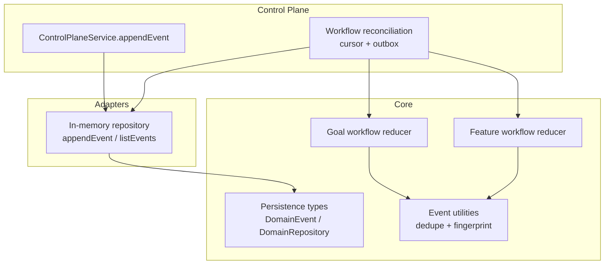
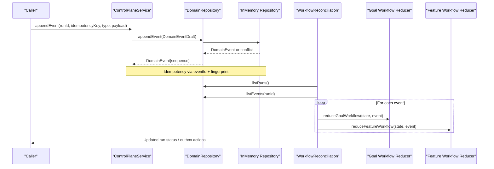
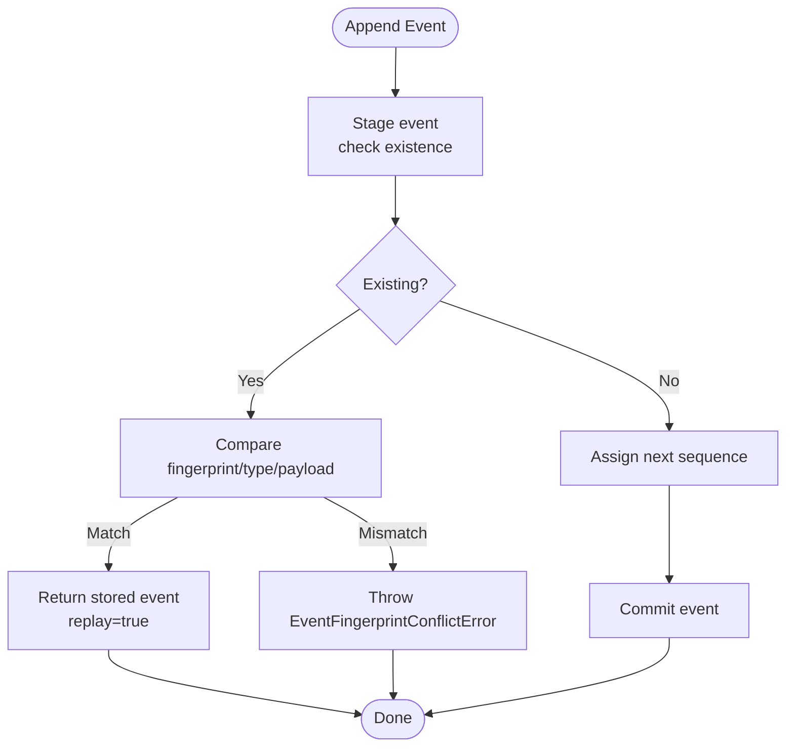
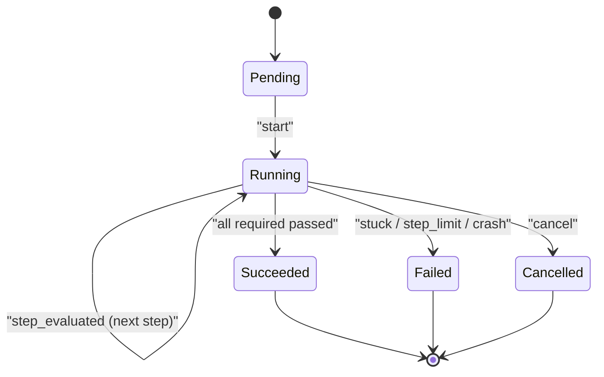
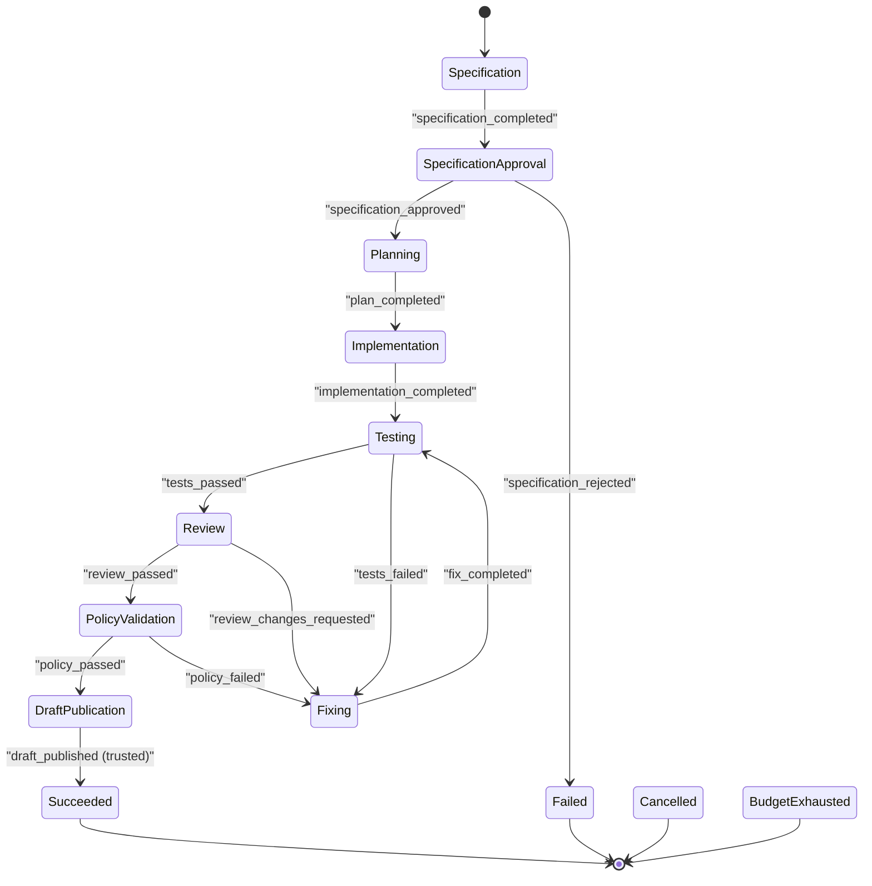
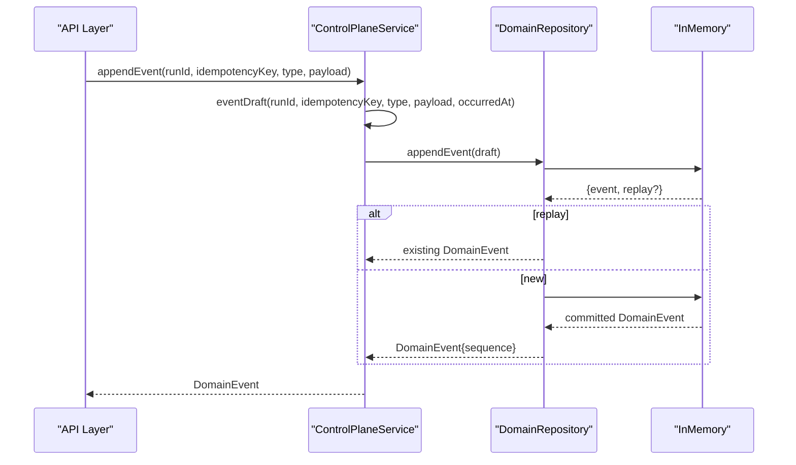
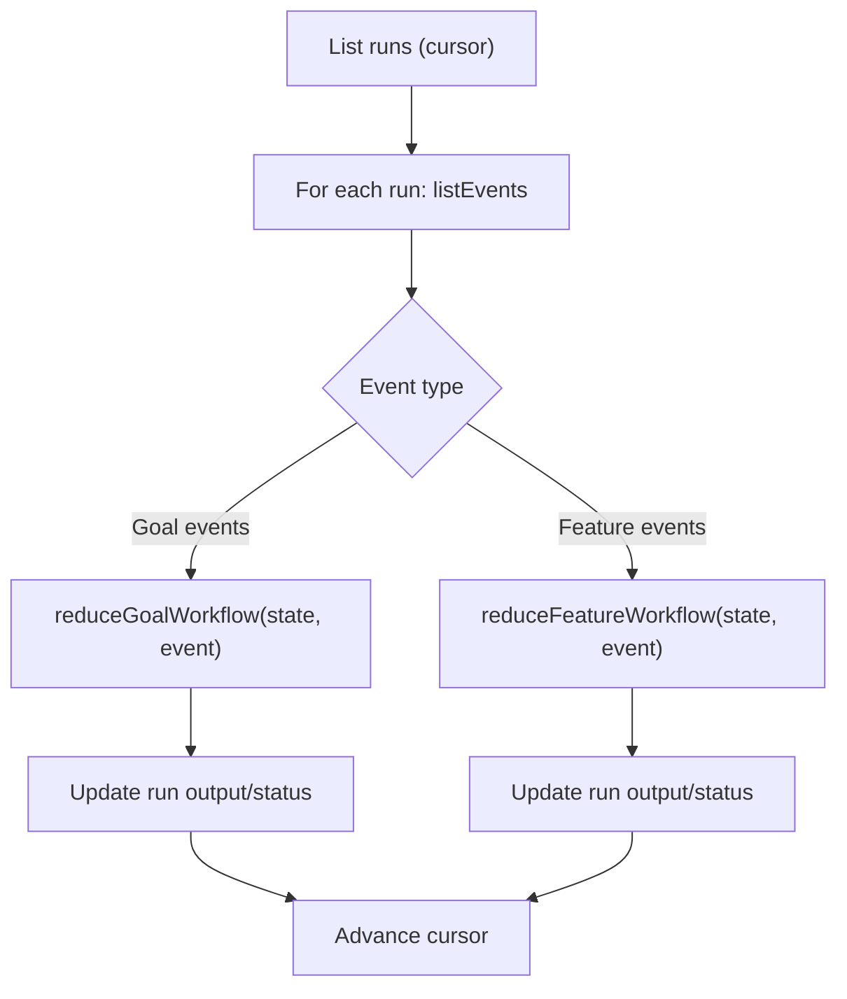
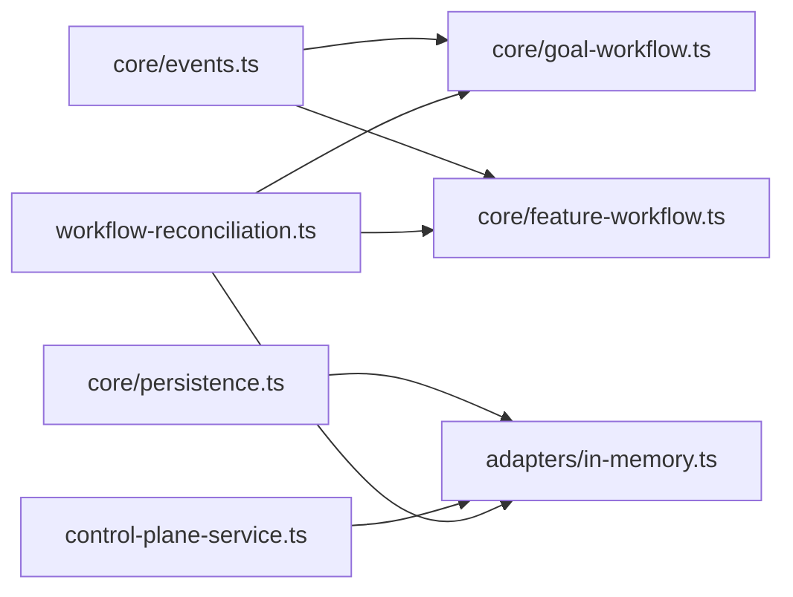

# Event Processing

<cite>
**Referenced Files in This Document**
- [events.ts](file://packages/core/src/events.ts)
- [goal-workflow.ts](file://packages/core/src/goal-workflow.ts)
- [feature-workflow.ts](file://packages/core/src/feature-workflow.ts)
- [persistence.ts](file://packages/core/src/persistence.ts)
- [in-memory.ts](file://packages/adapters/src/persistence/in-memory.ts)
- [control-plane-service.ts](file://apps/control-plane/src/application/control-plane-service.ts)
- [workflow-reconciliation.ts](file://apps/control-plane/src/application/workflow-reconciliation.ts)
- [goal-workflow.ts (trigger)](file://packages/adapters/src/trigger/goal-workflow.ts)
</cite>

## Table of Contents
1. Introduction
2. Project Structure
3. Core Components
4. Architecture Overview
5. Detailed Component Analysis
6. Dependency Analysis
7. Performance Considerations
8. Troubleshooting Guide
9. Conclusion

## Introduction
This document explains the event-driven architecture that powers workflow state transitions and inter-component communication in Agent OS Passerine. It covers event types, schemas, processing patterns including deduplication and ordering guarantees, error handling, persistence, replay for state reconstruction, versioning and migration strategies, practical examples for custom events and handlers, and performance, monitoring, and troubleshooting techniques.

## Project Structure
The event system spans three layers:
- Core domain models and reducers define event types, schemas, and deterministic state machines for goal and feature workflows.
- Persistence adapters implement an append-only event log with idempotency, sequence numbers, and replay semantics.
- Control plane orchestration records domain events, reconciles runs, and drives workflow progress using outbox-style operations.

**Diagram sources**
- [events.ts:1-86](file://packages/core/src/events.ts#L1-L86)
- [goal-workflow.ts:1-243](file://packages/core/src/goal-workflow.ts#L1-L243)
- [feature-workflow.ts:1-320](file://packages/core/src/feature-workflow.ts#L1-L320)
- [persistence.ts:315-327](file://packages/core/src/persistence.ts#L315-L327)
- [in-memory.ts:879-938](file://packages/adapters/src/persistence/in-memory.ts#L879-L938)
- [control-plane-service.ts:1766-1811](file://apps/control-plane/src/application/control-plane-service.ts#L1766-L1811)
- [workflow-reconciliation.ts:156-507](file://apps/control-plane/src/application/workflow-reconciliation.ts#L156-L507)

**Section sources**
- [events.ts:1-86](file://packages/core/src/events.ts#L1-L86)
- [persistence.ts:315-327](file://packages/core/src/persistence.ts#L315-L327)
- [in-memory.ts:879-938](file://packages/adapters/src/persistence/in-memory.ts#L879-L938)
- [control-plane-service.ts:1766-1811](file://apps/control-plane/src/application/control-plane-service.ts#L1766-L1811)
- [workflow-reconciliation.ts:156-507](file://apps/control-plane/src/application/workflow-reconciliation.ts#L156-L507)

## Core Components
- Event utilities provide canonicalization, fingerprinting, and a bounded dedupe window to detect duplicates and prevent ID reuse with different payloads.
- Goal workflow reducer implements a small finite-state machine over steps with strict ordering and result completeness checks.
- Feature workflow reducer implements a multi-phase pipeline with retry/budget controls, approval gating, and publication binding verification.
- Persistence layer defines DomainEvent and DomainRepository, with implementations ensuring idempotent appends, per-run sequences, and replay-safe reads.

Key responsibilities:
- Deduplication: In-memory dedupe window and fingerprint-based conflict detection.
- Ordering: Per-run monotonic sequence numbers; reducers enforce step order and phase constraints.
- Replay: Deterministic reducers plus persisted events enable full state reconstruction.
- Versioning: Explicit payload versions in goal progress and policy snapshots; schema validation guards evolution.

**Section sources**
- [events.ts:1-86](file://packages/core/src/events.ts#L1-L86)
- [goal-workflow.ts:12-42](file://packages/core/src/goal-workflow.ts#L12-L42)
- [feature-workflow.ts:8-80](file://packages/core/src/feature-workflow.ts#L8-L80)
- [persistence.ts:315-327](file://packages/core/src/persistence.ts#L315-L327)

## Architecture Overview
End-to-end flow from event creation to state reconstruction:

**Diagram sources**
- [control-plane-service.ts:1766-1811](file://apps/control-plane/src/application/control-plane-service.ts#L1766-L1811)
- [in-memory.ts:879-938](file://packages/adapters/src/persistence/in-memory.ts#L879-L938)
- [workflow-reconciliation.ts:472-495](file://apps/control-plane/src/application/workflow-reconciliation.ts#L472-L495)
- [goal-workflow.ts:163-243](file://packages/core/src/goal-workflow.ts#L163-L243)
- [feature-workflow.ts:160-317](file://packages/core/src/feature-workflow.ts#L160-L317)

## Detailed Component Analysis

### Event Schemas and Types
- DomainEvent includes run-scoped identity, fingerprint, monotonic sequence, type, optional payload, and occurrence timestamp. Drafts omit sequence until storage assigns it.
- Workflow-specific events are typed unions:
  - GoalWorkflowEvent: start, step_evaluated, cancel, crash.
  - FeatureWorkflowEvent: specification_completed, specification_approved/rejected, plan_completed, implementation_completed, tests_passed/failed, review_passed/changes_requested, fix_completed, policy_passed/failed, draft_published, crashed, resume, cancel, exhaust_budget.

Validation and safety:
- Event IDs must match a safe identifier pattern.
- Fingerprint is computed over canonicalized event content to ensure immutability and detect conflicts.
- Goal progress payloads carry explicit versions to support evolution.

**Section sources**
- [persistence.ts:315-327](file://packages/core/src/persistence.ts#L315-L327)
- [goal-workflow.ts:32-42](file://packages/core/src/goal-workflow.ts#L32-L42)
- [feature-workflow.ts:48-80](file://packages/core/src/feature-workflow.ts#L48-L80)
- [events.ts:10-43](file://packages/core/src/events.ts#L10-L43)

### Event Deduplication and Ordering
- Dedupe window: Processed event IDs and fingerprints are retained in a bounded list/map to detect duplicates within a sliding window.
- Fingerprint conflict: If an existing event ID is reused with a different payload/type, a conflict error is raised.
- Ordering guarantees:
  - Storage assigns monotonically increasing sequence numbers per run.
  - Reducers validate step order and phase transitions; out-of-order events are rejected.

**Diagram sources**
- [in-memory.ts:879-916](file://packages/adapters/src/persistence/in-memory.ts#L879-L916)
- [in-memory.ts:918-938](file://packages/adapters/src/persistence/in-memory.ts#L918-L938)

**Section sources**
- [events.ts:45-85](file://packages/core/src/events.ts#L45-L85)
- [in-memory.ts:879-938](file://packages/adapters/src/persistence/in-memory.ts#L879-L938)

### Goal Workflow State Machine
- States: pending -> running -> succeeded | failed | cancelled.
- Step evaluation requires exactly one result per criterion; results are validated for completeness and uniqueness.
- Failure detection uses failure fingerprints to detect stuck loops; step limits bound retries.
- Replay-safe: reduceGoalWorkflow is deterministic and rejects duplicate events by fingerprint.

**Diagram sources**
- [goal-workflow.ts:157-235](file://packages/core/src/goal-workflow.ts#L157-L235)

**Section sources**
- [goal-workflow.ts:72-130](file://packages/core/src/goal-workflow.ts#L72-L130)
- [goal-workflow.ts:163-243](file://packages/core/src/goal-workflow.ts#L163-L243)

### Feature Workflow State Machine
- Phases: specification -> specification_approval -> planning -> implementation -> testing -> review -> fixing -> policy_validation -> draft_publication.
- Retries and budget exhaustion are modeled; blocked states require resume.
- Approval events drive transitions; publication requires trusted attestation matching workflow binding.

**Diagram sources**
- [feature-workflow.ts:8-27](file://packages/core/src/feature-workflow.ts#L8-L27)
- [feature-workflow.ts:160-317](file://packages/core/src/feature-workflow.ts#L160-L317)

**Section sources**
- [feature-workflow.ts:94-130](file://packages/core/src/feature-workflow.ts#L94-L130)
- [feature-workflow.ts:160-317](file://packages/core/src/feature-workflow.ts#L160-L317)

### Event Recording and Persistence
- Control plane constructs a DomainEventDraft with deterministic eventId derived from idempotency key and computes fingerprint from type+payload.
- Repository stages the event, detects replays, assigns sequence, validates timestamps, and commits atomically.
- Conflicts on fingerprint mismatch raise specific errors surfaced as service-level idempotency conflicts.

**Diagram sources**
- [control-plane-service.ts:1766-1811](file://apps/control-plane/src/application/control-plane-service.ts#L1766-L1811)
- [in-memory.ts:879-938](file://packages/adapters/src/persistence/in-memory.ts#L879-L938)

**Section sources**
- [control-plane-service.ts:1766-1811](file://apps/control-plane/src/application/control-plane-service.ts#L1766-L1811)
- [in-memory.ts:879-938](file://packages/adapters/src/persistence/in-memory.ts#L879-L938)

### Replay and State Reconstruction
- Reconciliation scans runs and their events, feeding them into workflow reducers to reconstruct current state deterministically.
- Goal workflow replay also rebuilds from goal progress records, validating bindings and sequence.
- Feature workflow replay applies events through reduceFeatureWorkflow, which enforces phases, retries, and approvals.

**Diagram sources**
- [workflow-reconciliation.ts:156-507](file://apps/control-plane/src/application/workflow-reconciliation.ts#L156-L507)
- [goal-workflow.ts:237-243](file://packages/core/src/goal-workflow.ts#L237-L243)
- [feature-workflow.ts:308-317](file://packages/core/src/feature-workflow.ts#L308-L317)

**Section sources**
- [workflow-reconciliation.ts:156-507](file://apps/control-plane/src/application/workflow-reconciliation.ts#L156-L507)
- [goal-workflow.ts:305-389](file://packages/adapters/src/trigger/goal-workflow.ts#L305-L389)

### Versioning and Migration Strategies
- Goal progress payloads use explicit versions (e.g., goal-criterion-result-v1, goal-child-attempt-v1) to evolve without breaking compatibility.
- Config snapshots bind provenance digests (config, model, prompt, environment, policy) to inputs, preventing drift and enabling reproducible runs.
- Reducers validate against expected definitions and snapshots; mismatches fail fast to preserve integrity.

**Section sources**
- [goal-workflow.ts:243-260](file://packages/adapters/src/trigger/goal-workflow.ts#L243-L260)
- [goal-workflow.ts:168-215](file://packages/adapters/src/trigger/goal-workflow.ts#L168-L215)

### Practical Examples

#### Creating a Custom Domain Event
- Use control-plane appendEvent with a unique idempotency key per logical action. The service generates a deterministic eventId and computes a fingerprint from type and payload.
- Ensure payload conforms to expected schema; mismatches will be detected at replay or reducer boundaries.

**Section sources**
- [control-plane-service.ts:1766-1811](file://apps/control-plane/src/application/control-plane-service.ts#L1766-L1811)
- [persistence.ts:315-327](file://packages/core/src/persistence.ts#L315-L327)

#### Implementing an Event Handler
- For goal workflows, implement step execution that produces evidence bound to parent and child run IDs; the trigger verifies and persists criterion results.
- For feature workflows, emit phase completion events; reducers enforce phase transitions and handle retries or blocking.

**Section sources**
- [goal-workflow.ts:581-632](file://packages/adapters/src/trigger/goal-workflow.ts#L581-L632)
- [feature-workflow.ts:227-305](file://packages/core/src/feature-workflow.ts#L227-L305)

#### Orchestrating Workflows with Events
- Reconciliation lists runs and events, then triggers outbox requests to start, cancel, or clean up runs based on status and timeouts.
- Approval events are translated into resume requests with decisions and scope hashes.

**Section sources**
- [workflow-reconciliation.ts:156-507](file://apps/control-plane/src/application/workflow-reconciliation.ts#L156-L507)

## Dependency Analysis
- Core reducers depend on event utilities for dedupe and fingerprinting.
- Adapters implement persistence contracts and add sequencing, replay detection, and atomic commit behavior.
- Control plane composes services and reconciliation to bridge external triggers with internal state machines.

**Diagram sources**
- [events.ts:1-86](file://packages/core/src/events.ts#L1-L86)
- [goal-workflow.ts:1-243](file://packages/core/src/goal-workflow.ts#L1-L243)
- [feature-workflow.ts:1-320](file://packages/core/src/feature-workflow.ts#L1-L320)
- [persistence.ts:315-327](file://packages/core/src/persistence.ts#L315-L327)
- [in-memory.ts:879-938](file://packages/adapters/src/persistence/in-memory.ts#L879-L938)
- [control-plane-service.ts:1766-1811](file://apps/control-plane/src/application/control-plane-service.ts#L1766-L1811)
- [workflow-reconciliation.ts:156-507](file://apps/control-plane/src/application/workflow-reconciliation.ts#L156-L507)

**Section sources**
- [events.ts:1-86](file://packages/core/src/events.ts#L1-L86)
- [in-memory.ts:879-938](file://packages/adapters/src/persistence/in-memory.ts#L879-L938)
- [workflow-reconciliation.ts:156-507](file://apps/control-plane/src/application/workflow-reconciliation.ts#L156-L507)

## Performance Considerations
- Dedupe window size balances memory usage and replay tolerance; keep it sufficient to cover typical retry windows.
- Sequence assignment is per-run and O(1); listing events is paginated by sequence to avoid large scans.
- Reducers are pure and efficient; ensure event payloads remain compact to minimize hashing and serialization costs.
- Reconciliation batches pages of runs and events; tune limits to balance throughput and latency.

[No sources needed since this section provides general guidance]

## Troubleshooting Guide
Common issues and resolutions:
- Duplicate event with different payload: Indicates misuse of idempotency keys or payload changes; verify caller logic and ensure stable payloads per key.
- Out-of-order events: Reducers reject invalid transitions; check event emission order and step numbering.
- Stuck goals: Failure fingerprint tracking detects loops; adjust criteria or step logic to break cycles.
- Timeout failures: Reconciliation marks long-running runs as failed; inspect logs and consider extending timeouts or optimizing steps.
- Approval delays: Reconciliation emits resume requests when approvals arrive; ensure approval events include correct scope hashes.

**Section sources**
- [in-memory.ts:879-916](file://packages/adapters/src/persistence/in-memory.ts#L879-L916)
- [goal-workflow.ts:209-228](file://packages/core/src/goal-workflow.ts#L209-L228)
- [workflow-reconciliation.ts:214-303](file://apps/control-plane/src/application/workflow-reconciliation.ts#L214-L303)
- [workflow-reconciliation.ts:472-495](file://apps/control-plane/src/application/workflow-reconciliation.ts#L472-L495)

## Conclusion
Agent OS Passerine’s event processing combines robust event sourcing with deterministic reducers, strong idempotency, and clear ordering guarantees. The design enables reliable state reconstruction, safe evolution through versioned payloads, and scalable orchestration via reconciliation. By following the patterns outlined here—stable identifiers, careful payload design, and disciplined event emission—you can build resilient workflows that are observable, debuggable, and maintainable.