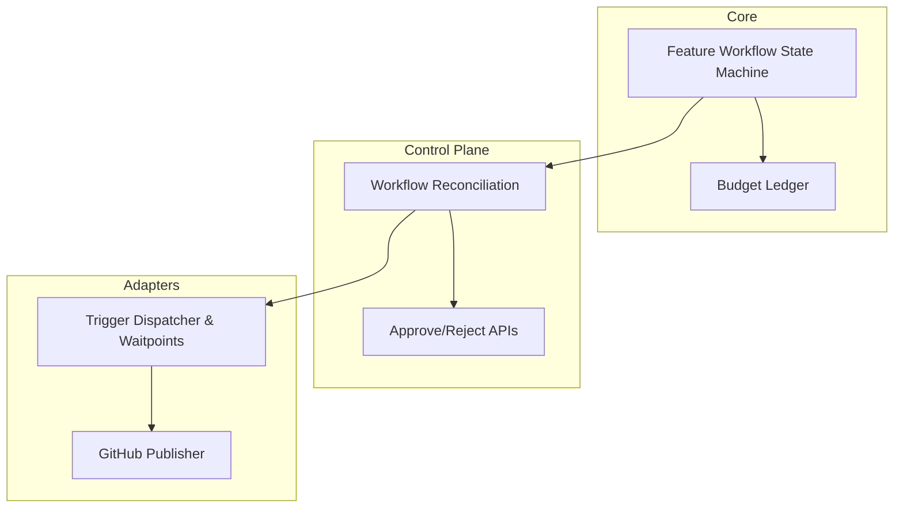
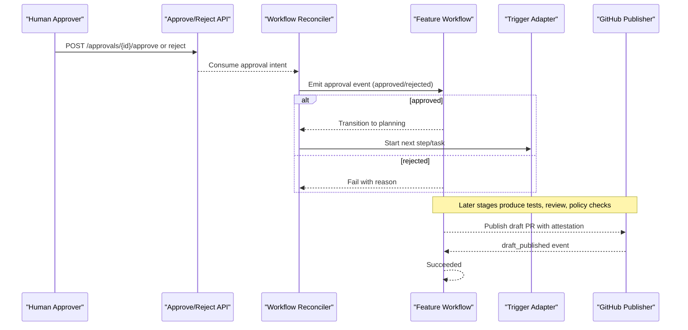
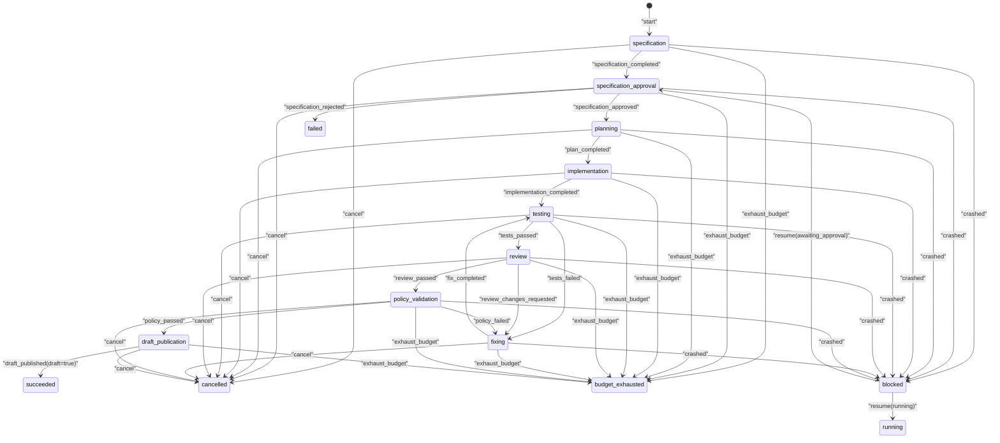
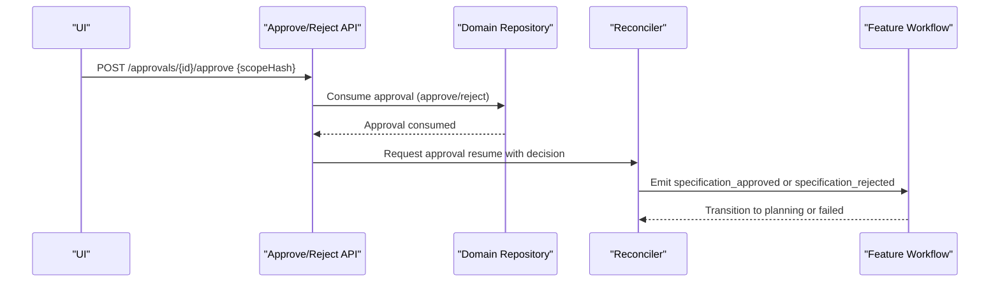
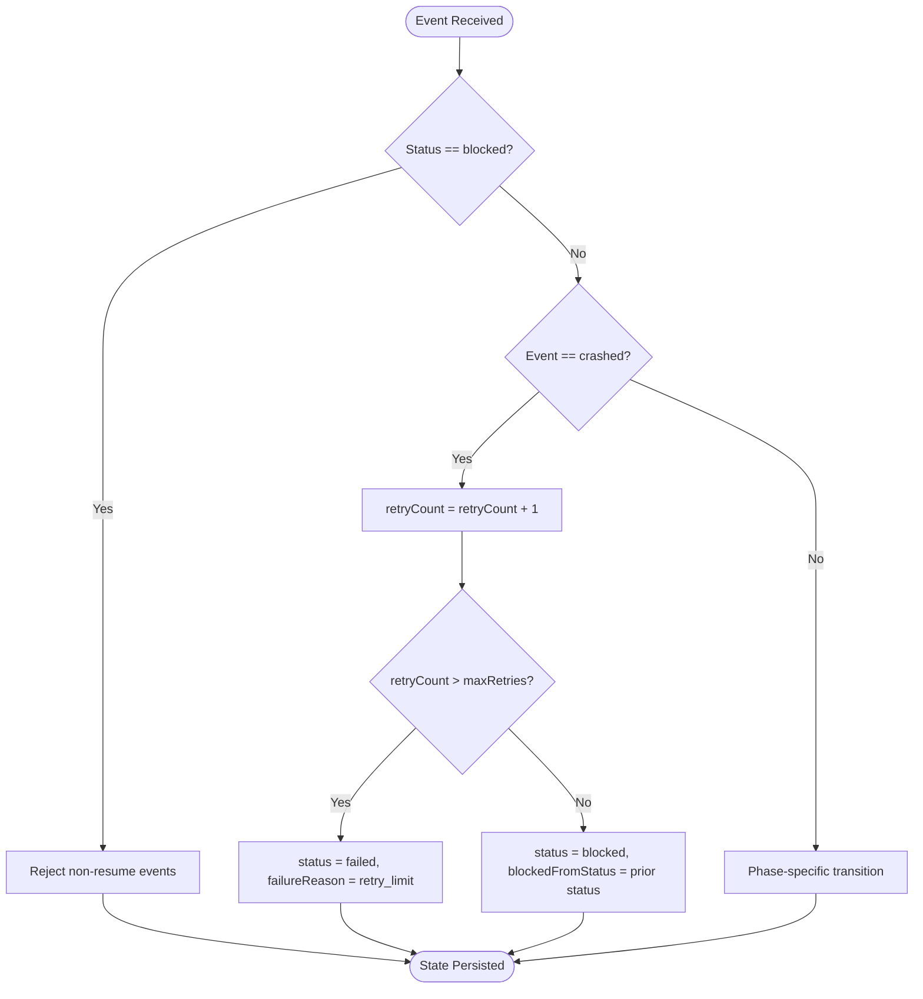
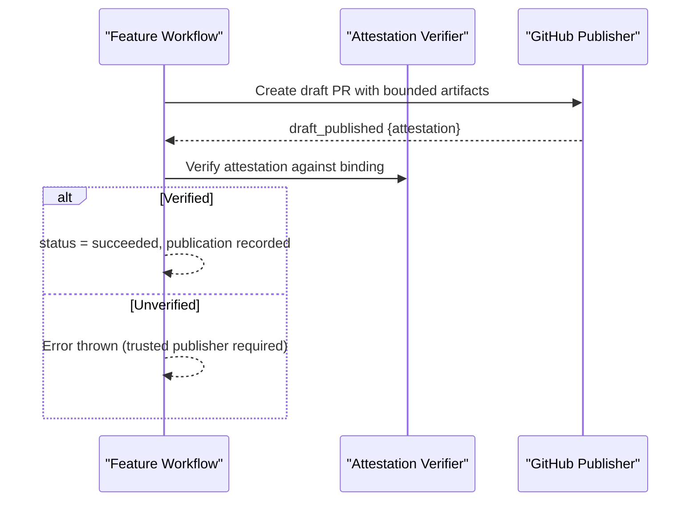
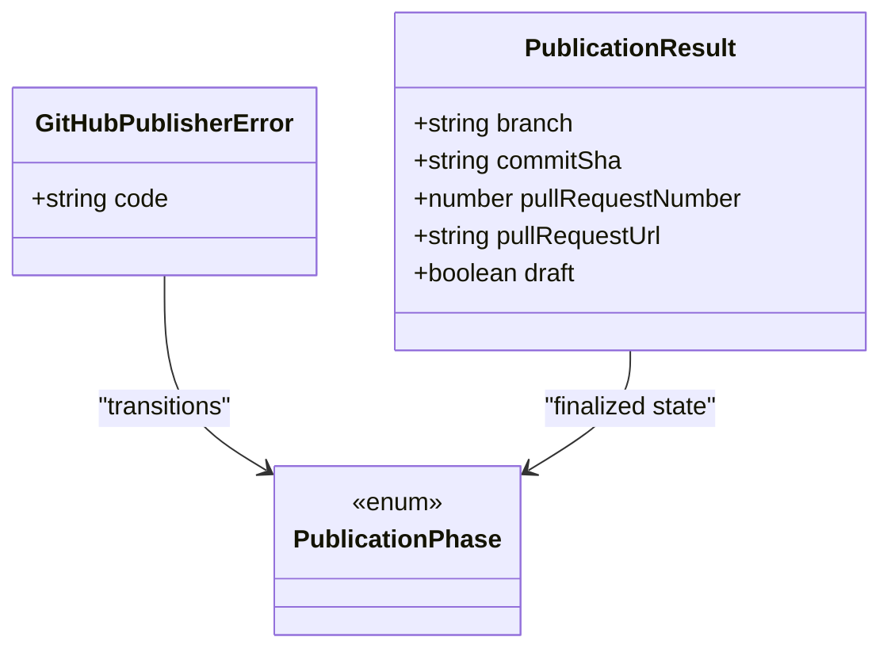
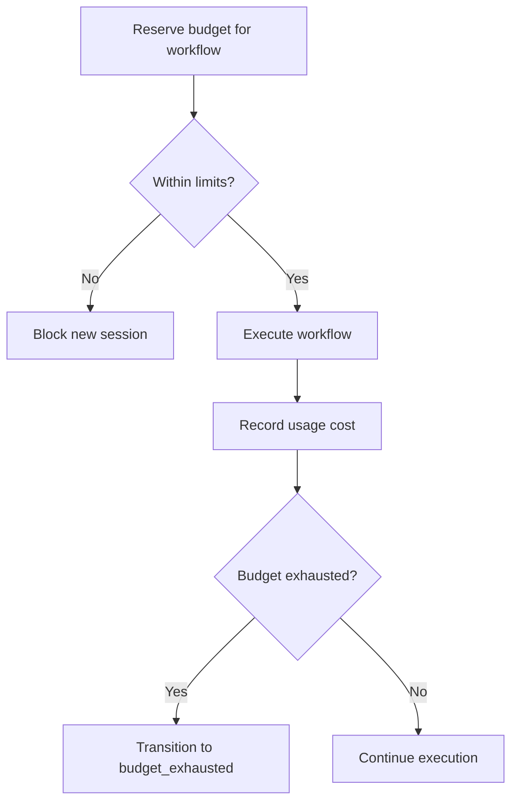
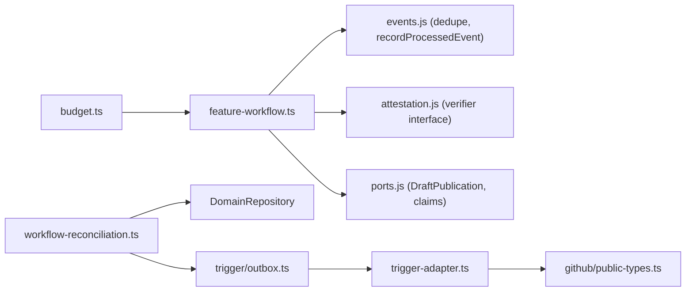

# Feature Workflow

<cite>
**Referenced Files in This Document**
- [feature-workflow.ts](file://packages/core/src/feature-workflow.ts)
- [feature-workflow.test.ts](file://packages/core/src/feature-workflow.test.ts)
- [durable-feature-workflow.md](file://docs/architecture/durable-feature-workflow.md)
- [passerine.yaml](file://agentos/passerine.yaml)
- [workflow-reconciliation.ts](file://apps/control-plane/src/application/workflow-reconciliation.ts)
- [workflow-reconciliation-runtime.ts](file://apps/control-plane/src/application/workflow-reconciliation-runtime.ts)
- [approve/route.ts](file://apps/control-plane/app/api/approvals/[id]/approve/route.ts)
- [reject/route.ts](file://apps/control-plane/app/api/approvals/[id]/reject/route.ts)
- [outbox.ts](file://packages/adapters/src/trigger/outbox.ts)
- [trigger-adapter.ts](file://packages/adapters/src/trigger/trigger-adapter.ts)
- [budget.ts](file://packages/core/src/budget.ts)
- [errors.ts](file://packages/adapters/src/github/errors.ts)
- [public-types.ts](file://packages/adapters/src/github/public-types.ts)
</cite>

## Table of Contents
1. Introduction
2. Project Structure
3. Core Components
4. Architecture Overview
5. Detailed Component Analysis
6. Dependency Analysis
7. Performance Considerations
8. Troubleshooting Guide
9. Conclusion
10. Appendices

## Introduction
This document explains the Feature Workflow system in Agent OS Passerine, covering the complete lifecycle from specification through draft publication. It details phases, state machine transitions, event types, status management, human approvals, automatic retries, failure recovery, budget exhaustion, GitHub integration, monitoring, debugging, and performance optimization strategies.

## Project Structure
The Feature Workflow spans several layers:
- Core state machine and events define phases, statuses, and transitions.
- Control plane orchestrates runs, approvals, reconciliation, and outbox delivery to Trigger tasks.
- Adapters integrate with Trigger (task dispatch and waitpoints), GitHub (draft PR publication), and budgeting.
- Configuration defines agents, environments, policies, budgets, and pipeline steps.

**Diagram sources**
- [feature-workflow.ts:8-42](file://packages/core/src/feature-workflow.ts#L8-L42)
- [workflow-reconciliation.ts:156-507](file://apps/control-plane/src/application/workflow-reconciliation.ts#L156-L507)
- [trigger-adapter.ts:80-154](file://packages/adapters/src/trigger/trigger-adapter.ts#L80-L154)
- [public-types.ts:1-28](file://packages/adapters/src/github/public-types.ts#L1-L28)

**Section sources**
- [feature-workflow.ts:8-42](file://packages/core/src/feature-workflow.ts#L8-L42)
- [workflow-reconciliation.ts:156-507](file://apps/control-plane/src/application/workflow-reconciliation.ts#L156-L507)
- [trigger-adapter.ts:80-154](file://packages/adapters/src/trigger/trigger-adapter.ts#L80-L154)
- [public-types.ts:1-28](file://packages/adapters/src/github/public-types.ts#L1-L28)

## Core Components
- Feature workflow state machine: phases, statuses, events, reducer, replay utility.
- Human approval flow: create pending approvals, consume approve/reject decisions, resume workflow.
- Reconciliation loop: scans runs, enforces deadlines, emits start/cancel/cleanup intents, resumes on approvals.
- Trigger adapter: starts feature tasks, creates waitpoints for approvals, cancels runs.
- GitHub publisher: creates draft PRs with bounded artifacts and attestation verification.
- Budget ledger: reserves usage, records costs, enforces per-workflow and daily limits.

Key responsibilities:
- Enforce strict phase/status transitions and idempotent event processing.
- Gate publication behind trusted publisher attestations bound to workflow context.
- Provide durable retry and crash recovery via blocked/resume semantics.
- Integrate with external systems safely using idempotency keys and fenced effects.

**Section sources**
- [feature-workflow.ts:8-42](file://packages/core/src/feature-workflow.ts#L8-L42)
- [feature-workflow.ts:160-306](file://packages/core/src/feature-workflow.ts#L160-L306)
- [workflow-reconciliation.ts:156-507](file://apps/control-plane/src/application/workflow-reconciliation.ts#L156-L507)
- [trigger-adapter.ts:80-154](file://packages/adapters/src/trigger/trigger-adapter.ts#L80-L154)
- [public-types.ts:1-28](file://packages/adapters/src/github/public-types.ts#L1-L28)
- [budget.ts:166-221](file://packages/core/src/budget.ts#L166-L221)

## Architecture Overview
End-to-end flow:
1. A feature run is created and configuration is applied; a source bundle artifact is produced.
2. The specification agent writes spec and Definition-of-Done artifacts.
3. Workflow enters specification_approval, awaiting human decision.
4. After approval, planning, implementation, testing, review, fixing loops, policy validation occur.
5. Trusted verification produces a signed report.
6. Draft publication creates a draft PR with an attestation validated by the workflow.

**Diagram sources**
- [approve/route.ts:11-33](file://apps/control-plane/app/api/approvals/[id]/approve/route.ts#L11-L33)
- [reject/route.ts:11-33](file://apps/control-plane/app/api/approvals/[id]/reject/route.ts#L11-L33)
- [workflow-reconciliation.ts:472-495](file://apps/control-plane/src/application/workflow-reconciliation.ts#L472-L495)
- [feature-workflow.ts:227-306](file://packages/core/src/feature-workflow.ts#L227-L306)
- [public-types.ts:1-28](file://packages/adapters/src/github/public-types.ts#L1-L28)

## Detailed Component Analysis

### Feature Workflow State Machine
Phases:
- specification, specification_approval, planning, implementation, testing, review, fixing, policy_validation, draft_publication.

Statuses:
- running, awaiting_approval, blocked, succeeded, failed, cancelled, budget_exhausted.

Event types:
- specification_completed, specification_approved, specification_rejected, plan_completed, implementation_completed, tests_passed, tests_failed, review_passed, review_changes_requested, fix_completed, policy_passed, policy_failed, draft_published, crashed, resume, cancel, exhaust_budget.

Transitions:
- specification → specification_approval on specification_completed.
- specification_approval → planning on specification_approved; fail on specification_rejected.
- planning → implementation on plan_completed.
- implementation → testing on implementation_completed.
- testing → review on tests_passed; go to fixing on tests_failed.
- review → policy_validation on review_passed; go to fixing on review_changes_requested.
- fixing → testing on fix_completed.
- policy_validation → draft_publication on policy_passed; go to fixing on policy_failed.
- draft_publication → succeeded on draft_published (must be draft=true and verified).
- Any active phase can transition to cancelled on cancel.
- Any active phase can transition to budget_exhausted on exhaust_budget.
- crashed sets blocked with retryCount increment; resume restores previous status.

Idempotency:
- Duplicate event IDs are ignored; processed event fingerprints bounded to a fixed window.

**Diagram sources**
- [feature-workflow.ts:8-26](file://packages/core/src/feature-workflow.ts#L8-L26)
- [feature-workflow.ts:227-306](file://packages/core/src/feature-workflow.ts#L227-L306)
- [feature-workflow.ts:172-220](file://packages/core/src/feature-workflow.ts#L172-L220)

**Section sources**
- [feature-workflow.ts:8-42](file://packages/core/src/feature-workflow.ts#L8-L42)
- [feature-workflow.ts:160-306](file://packages/core/src/feature-workflow.ts#L160-L306)
- [feature-workflow.test.ts:72-343](file://packages/core/src/feature-workflow.test.ts#L72-L343)

### Human Approval Handling
- Pending approvals are stored with scope and fingerprint; they expire after deadlines.
- Approve/reject endpoints consume approvals atomically and emit resume intents to the reconciler.
- Reconciler reads authoritative domain events and resumes the workflow at specification_approval.

**Diagram sources**
- [approve/route.ts:11-33](file://apps/control-plane/app/api/approvals/[id]/approve/route.ts#L11-L33)
- [reject/route.ts:11-33](file://apps/control-plane/app/api/approvals/[id]/reject/route.ts#L11-L33)
- [workflow-reconciliation.ts:472-495](file://apps/control-plane/src/application/workflow-reconciliation.ts#L472-L495)
- [feature-workflow.ts:227-249](file://packages/core/src/feature-workflow.ts#L227-L249)

**Section sources**
- [approve/route.ts:11-33](file://apps/control-plane/app/api/approvals/[id]/approve/route.ts#L11-L33)
- [reject/route.ts:11-33](file://apps/control-plane/app/api/approvals/[id]/reject/route.ts#L11-L33)
- [workflow-reconciliation.ts:472-495](file://apps/control-plane/src/application/workflow-reconciliation.ts#L472-L495)
- [feature-workflow.ts:227-249](file://packages/core/src/feature-workflow.ts#L227-L249)

### Automatic Retries and Crash Recovery
- Crashes set status to blocked and increment retryCount; if exceeded, workflow fails.
- Resume clears blocked state and restores previous status (awaiting_approval or running).
- Fixing loop routes test failures, review changes requested, and policy failures back to fixing with retry accounting.

**Diagram sources**
- [feature-workflow.ts:172-220](file://packages/core/src/feature-workflow.ts#L172-L220)
- [feature-workflow.ts:259-276](file://packages/core/src/feature-workflow.ts#L259-L276)

**Section sources**
- [feature-workflow.ts:172-220](file://packages/core/src/feature-workflow.ts#L172-L220)
- [feature-workflow.ts:259-276](file://packages/core/src/feature-workflow.ts#L259-L276)
- [feature-workflow.test.ts:135-216](file://packages/core/src/feature-workflow.test.ts#L135-L216)

### Policy Validation and Draft Publication
- Policy validation must pass before entering draft_publication.
- Draft publication requires a trusted publisher attestation that matches workflow binding (scope/action/baseSha/patchHash).
- Only draft publications complete the workflow; non-drafts are rejected.

**Diagram sources**
- [feature-workflow.ts:277-306](file://packages/core/src/feature-workflow.ts#L277-L306)
- [public-types.ts:1-28](file://packages/adapters/src/github/public-types.ts#L1-L28)

**Section sources**
- [feature-workflow.ts:277-306](file://packages/core/src/feature-workflow.ts#L277-L306)
- [public-types.ts:1-28](file://packages/adapters/src/github/public-types.ts#L1-L28)

### Integration with GitHub Repository Operations
- Publication creates a draft pull request with bounded artifacts and a signed attestation.
- Errors include publication rejection, collision, cancellation, busy states, and GitHub unavailability.
- Status queries expose sanitized outcomes without mutating GitHub.

**Diagram sources**
- [errors.ts:1-25](file://packages/adapters/src/github/errors.ts#L1-L25)
- [public-types.ts:1-28](file://packages/adapters/src/github/public-types.ts#L1-L28)

**Section sources**
- [errors.ts:1-25](file://packages/adapters/src/github/errors.ts#L1-L25)
- [public-types.ts:1-28](file://packages/adapters/src/github/public-types.ts#L1-L28)

### Budget Exhaustion Scenarios
- Budget reservation and settlement ensure controlled execution and charging.
- When budget is exhausted, workflow transitions to budget_exhausted.
- Limits include per-workflow microdollars and daily caps; new sessions are blocked near thresholds.

**Diagram sources**
- [budget.ts:346-446](file://packages/core/src/budget.ts#L346-L446)
- [budget.ts:166-221](file://packages/core/src/budget.ts#L166-L221)
- [feature-workflow.ts:178-183](file://packages/core/src/feature-workflow.ts#L178-L183)

**Section sources**
- [budget.ts:346-446](file://packages/core/src/budget.ts#L346-L446)
- [budget.ts:166-221](file://packages/core/src/budget.ts#L166-L221)
- [feature-workflow.ts:178-183](file://packages/core/src/feature-workflow.ts#L178-L183)

### Monitoring, Debugging, and Performance Optimization
- Monitoring:
  - Use reconciliation metrics (scannedRuns, delivered, failed) to track throughput and errors.
  - Track approval queues and expiration to avoid stale waits.
  - Observe budget reservations and settlements to detect throttling.
- Debugging:
  - Replay events with replayFeatureWorkflow to reproduce state transitions deterministically.
  - Inspect processed event IDs and fingerprints to validate deduplication windows.
  - Validate publisher attestations using verifier ports injected into reduction context.
- Performance:
  - Keep agent prompts and artifacts minimal to reduce payload sizes.
  - Limit retries to necessary levels; tune maxRetries per environment.
  - Use bounded lists and cursors in reconciliation to avoid scanning large datasets repeatedly.
  - Prefer draft publications to avoid merge side effects during development.

**Section sources**
- [workflow-reconciliation-runtime.ts:6-28](file://apps/control-plane/src/application/workflow-reconciliation-runtime.ts#L6-L28)
- [feature-workflow.test.ts:238-254](file://packages/core/src/feature-workflow.test.ts#L238-L254)
- [feature-workflow.test.ts:300-341](file://packages/core/src/feature-workflow.test.ts#L300-L341)

## Dependency Analysis

**Diagram sources**
- [feature-workflow.ts:1-6](file://packages/core/src/feature-workflow.ts#L1-L6)
- [workflow-reconciliation.ts:1-21](file://apps/control-plane/src/application/workflow-reconciliation.ts#L1-L21)
- [outbox.ts:1-316](file://packages/adapters/src/trigger/outbox.ts#L1-L316)
- [trigger-adapter.ts:80-154](file://packages/adapters/src/trigger/trigger-adapter.ts#L80-L154)
- [public-types.ts:1-28](file://packages/adapters/src/github/public-types.ts#L1-L28)
- [budget.ts:166-221](file://packages/core/src/budget.ts#L166-L221)

**Section sources**
- [feature-workflow.ts:1-6](file://packages/core/src/feature-workflow.ts#L1-L6)
- [workflow-reconciliation.ts:1-21](file://apps/control-plane/src/application/workflow-reconciliation.ts#L1-L21)
- [outbox.ts:1-316](file://packages/adapters/src/trigger/outbox.ts#L1-L316)
- [trigger-adapter.ts:80-154](file://packages/adapters/src/trigger/trigger-adapter.ts#L80-L154)
- [public-types.ts:1-28](file://packages/adapters/src/github/public-types.ts#L1-L28)
- [budget.ts:166-221](file://packages/core/src/budget.ts#L166-L221)

## Performance Considerations
- Bounded deduplication window prevents unbounded memory growth for processed events.
- Reconciliation uses cursors to resume scanning efficiently across pages.
- Trigger task idempotency avoids duplicate executions under retries.
- Draft-only publication reduces risk and overhead during iterative development.
- Budget admission gates prevent overcommitment and protect system stability.

[No sources needed since this section provides general guidance]

## Troubleshooting Guide
Common issues and resolutions:
- Specification rejected: Review DoD completeness and respecify requirements.
- Tests failed or review changes requested: Enter fixing loop; ensure minimal diffs and re-run tests.
- Policy failed: Address protected paths or policy violations; iterate fixes.
- Crashed multiple times: Check provider connectivity; resume when stable; verify retry limits.
- Budget exhausted: Reduce estimated microdollars or adjust budgets; reconcile expired reservations.
- Publication rejected or collision: Ensure unique baseSha/patchHash; check GitHub availability; retry with backoff.

Operational checks:
- Confirm approval consumption and expiration behavior.
- Validate publisher attestation keys and bindings.
- Monitor reconciliation cursor and delivery counts.

**Section sources**
- [feature-workflow.ts:227-306](file://packages/core/src/feature-workflow.ts#L227-L306)
- [workflow-reconciliation.ts:215-303](file://apps/control-plane/src/application/workflow-reconciliation.ts#L215-L303)
- [errors.ts:1-25](file://packages/adapters/src/github/errors.ts#L1-L25)

## Conclusion
The Feature Workflow system provides a robust, auditable, and secure path from specification to draft publication. Its state machine enforces strict transitions, supports human approvals, resilient retries, and budget controls. Integration with Trigger and GitHub ensures durable execution and safe publishing. Monitoring and debugging tools enable reliable operations and rapid issue resolution.

[No sources needed since this section summarizes without analyzing specific files]

## Appendices

### Practical Examples of Workflow Events and Transitions
- Happy path: specification_completed → specification_approved → plan_completed → implementation_completed → tests_passed → review_passed → policy_passed → draft_published(succeeded).
- Failure path: tests_failed → fixing → fix_completed → tests_passed → ... or repeated failures → failed (retry_limit).
- Crash path: crashed → blocked → resume → restore previous status → continue.
- Budget path: exhaust_budget → budget_exhausted.

**Section sources**
- [feature-workflow.test.ts:48-88](file://packages/core/src/feature-workflow.test.ts#L48-L88)
- [feature-workflow.test.ts:109-121](file://packages/core/src/feature-workflow.test.ts#L109-L121)
- [feature-workflow.test.ts:135-216](file://packages/core/src/feature-workflow.test.ts#L135-L216)

### Configuration Highlights
- Agents and environments define roles for specification, planning, implementation, review, and verification.
- Policies protect sensitive paths and restrict binary/symlink usage.
- Budgets set per-workflow and daily microdollars with concurrency and admission thresholds.
- Goals configure step limits and timeouts for goal-driven workflows.

**Section sources**
- [passerine.yaml:14-165](file://agentos/passerine.yaml#L14-L165)
- [passerine.yaml:205-248](file://agentos/passerine.yaml#L205-L248)

### Durable Execution Notes
- Durable outbox effects record fingerprints before side effects; only owners may complete/fail effects.
- Runtime handles sealed in storage; cancellation reconciles independently.
- Local experiment projects swap edges but keep core logic identical.

**Section sources**
- [durable-feature-workflow.md:60-108](file://docs/architecture/durable-feature-workflow.md#L60-L108)
- [durable-feature-workflow.md:110-133](file://docs/architecture/durable-feature-workflow.md#L110-L133)