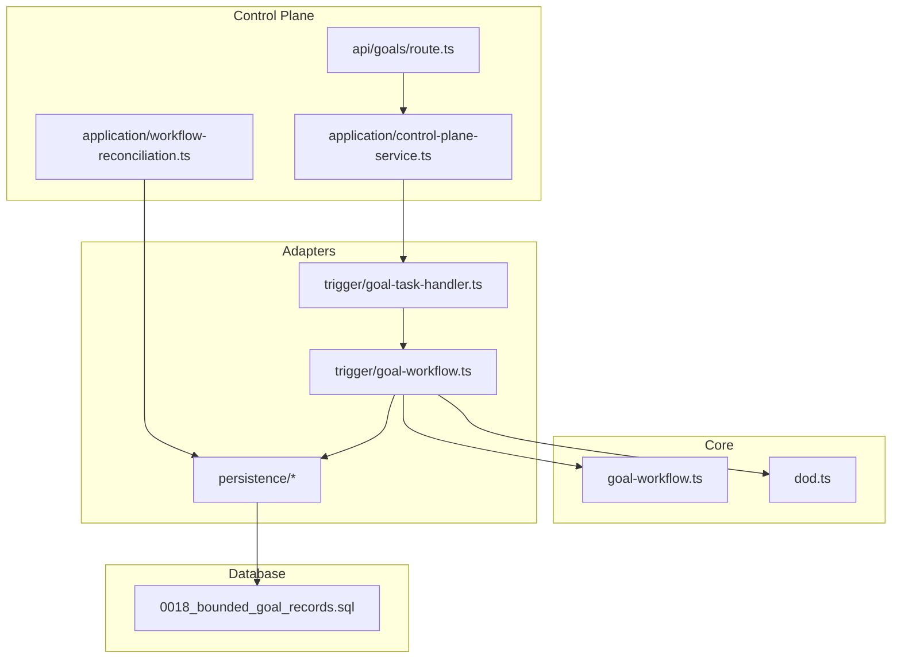
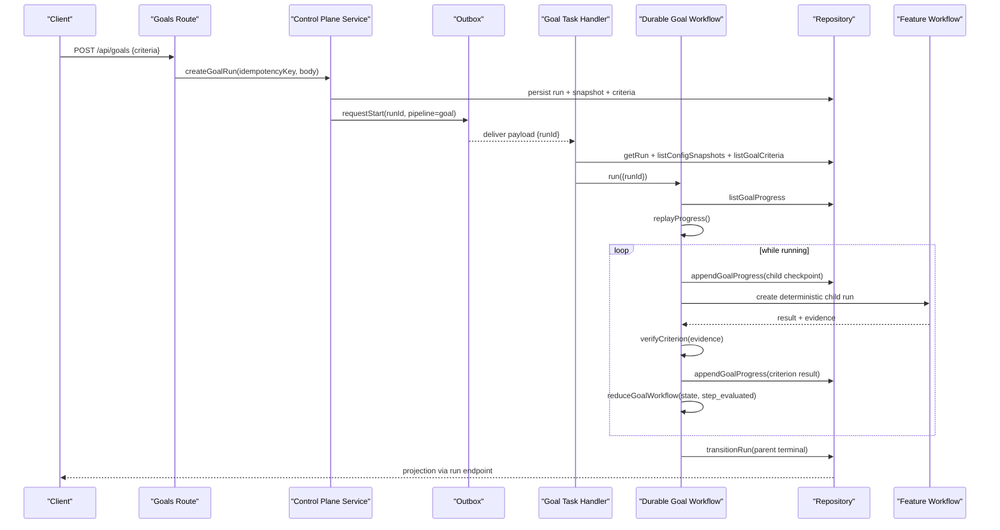
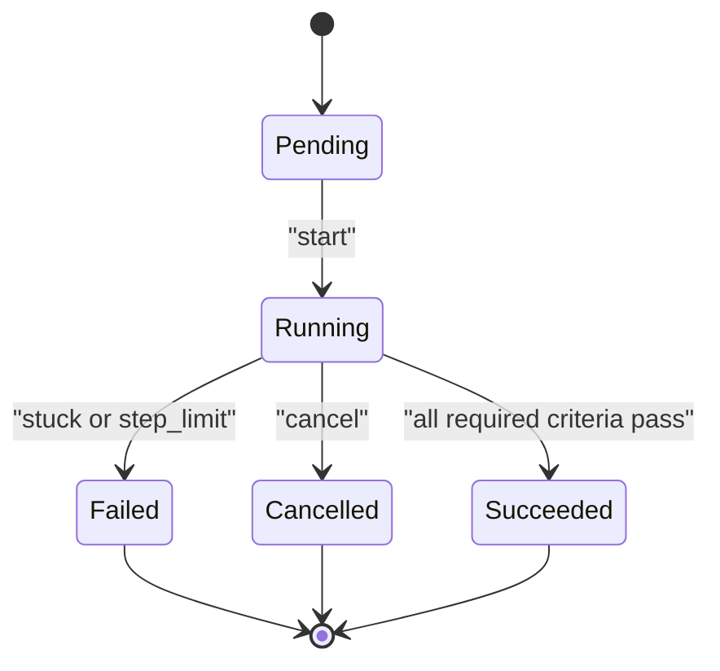
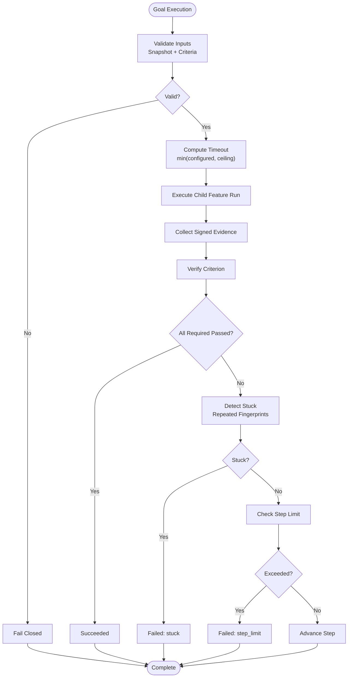
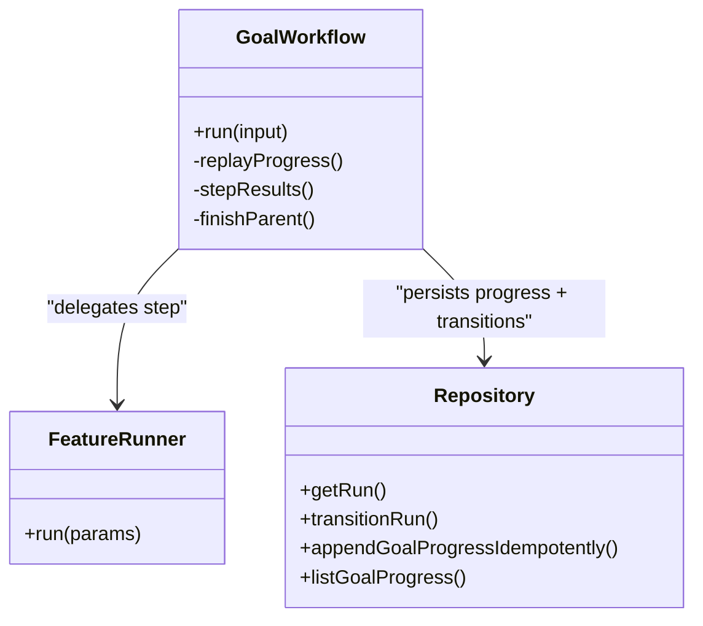
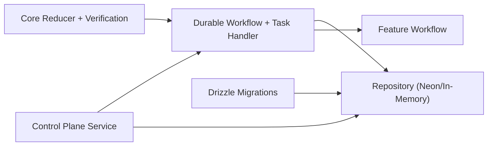

# Goal Workflow

<cite>
**Referenced Files in This Document**
- [durable-goal-workflow.md](file://docs/architecture/durable-goal-workflow.md)
- [bounded-goal-loop-design.md](file://docs/superpowers/specs/2026-08-17-bounded-goal-loop-design.md)
- [bounded-goal-loop.md](file://docs/superpowers/plans/2026-08-17-bounded-goal-loop.md)
- [goal-workflow.ts](file://packages/core/src/goal-workflow.ts)
- [dod.ts](file://packages/core/src/dod.ts)
- [goal-workflow.ts (adapters)](file://packages/adapters/src/trigger/goal-workflow.ts)
- [goal-task-handler.ts](file://packages/adapters/src/trigger/goal-task-handler.ts)
- [workflow-reconciliation.ts](file://apps/control-plane/src/application/workflow-reconciliation.ts)
- [control-plane-service.ts](file://apps/control-plane/src/application/control-plane-service.ts)
- [goals route](file://apps/control-plane/app/api/goals/route.ts)
- [neon-repository.ts](file://packages/adapters/src/persistence/neon-repository.ts)
- [in-memory repository](file://packages/adapters/src/persistence/in-memory.ts)
- [0018_bounded_goal_records.sql](file://drizzle/0018_bounded_goal_records.sql)
</cite>

## Table of Contents
1. [Introduction](#introduction)
2. [Project Structure](#project-structure)
3. [Core Components](#core-components)
4. [Architecture Overview](#architecture-overview)
5. [Detailed Component Analysis](#detailed-component-analysis)
6. [Dependency Analysis](#dependency-analysis)
7. [Performance Considerations](#performance-considerations)
8. [Troubleshooting Guide](#troubleshooting-guide)
9. [Conclusion](#conclusion)
10. [Appendices](#appendices)

## Introduction
The Goal Workflow system is a bounded goal achievement engine that executes tasks within defined constraints to accomplish specific objectives. It delegates up to three attempts through the existing feature workflow, evaluates operator-defined Definition-of-Done criteria using signed, independently observed evidence, and persists replayable progress. Goals never merge or deploy code; each attempt creates only a draft pull request via the trusted publication boundary. The system enforces immutable provenance, deterministic child runs, idempotent persistence, and fail-closed validation to ensure safety and reliability during long-running executions.

## Project Structure
Goal Workflow spans core state logic, adapter orchestration, control plane services, and database migrations:
- Core reducer and verification primitives live in the core package.
- Durable execution, step runner integration, and Trigger task wiring live in the adapters package.
- Control plane exposes HTTP endpoints, projections, reconciliation, and timeout handling.
- Database schema changes are captured in Drizzle migrations.

**Diagram sources**
- [goal-workflow.ts:1-243](file://packages/core/src/goal-workflow.ts#L1-L243)
- [dod.ts:1-243](file://packages/core/src/dod.ts#L1-L243)
- [goal-workflow.ts (adapters):1-827](file://packages/adapters/src/trigger/goal-workflow.ts#L1-L827)
- [goal-task-handler.ts:1-56](file://packages/adapters/src/trigger/goal-task-handler.ts#L1-L56)
- [workflow-reconciliation.ts:48-72](file://apps/control-plane/src/application/workflow-reconciliation.ts#L48-L72)
- [control-plane-service.ts:1867-1903](file://apps/control-plane/src/application/control-plane-service.ts#L1867-L1903)
- [goals route:1-35](file://apps/control-plane/app/api/goals/route.ts#L1-L35)
- [neon-repository.ts:1738-1822](file://packages/adapters/src/persistence/neon-repository.ts#L1738-L1822)
- [0018_bounded_goal_records.sql:1-12](file://drizzle/0018_bounded_goal_records.sql#L1-L12)

**Section sources**
- [durable-goal-workflow.md:1-138](file://docs/architecture/durable-goal-workflow.md#L1-L138)
- [bounded-goal-loop-design.md:1-158](file://docs/superpowers/specs/2026-08-17-bounded-goal-loop-design.md#L1-L158)
- [bounded-goal-loop.md:1-312](file://docs/superpowers/plans/2026-08-17-bounded-goal-loop.md#L1-L312)

## Core Components
- Pure goal reducer: owns immutable criteria, max steps (1–3), current step, latest results per criterion, failure fingerprints, and processed event tracking. Transitions succeed, stuck, step_limit, cancelled, or crashed based on strict rules.
- Definition-of-Done verification: supports command criteria with signed evidence, verifier registry, attestation binding, and stuck detection by repeated failure fingerprints.
- Durable goal workflow: reconstructs state from persisted progress, writes deterministic checkpoints, invokes feature workflow as child runs, verifies evidence, persists criterion progress, and CAS-transitions parent run.
- Task handler and reconciliation: validates inputs, dispatches goal tasks, repairs missing snapshots/criteria, applies timeouts capped by an absolute ceiling, and cancels active children when goals are cancelled.
- Persistence: idempotent writes for criteria and progress, step ordinal constraints, and migration handling for legacy goals.

**Section sources**
- [goal-workflow.ts:12-86](file://packages/core/src/goal-workflow.ts#L12-L86)
- [goal-workflow.ts:163-242](file://packages/core/src/goal-workflow.ts#L163-L242)
- [dod.ts:10-37](file://packages/core/src/dod.ts#L10-L37)
- [dod.ts:161-216](file://packages/core/src/dod.ts#L161-L216)
- [dod.ts:224-239](file://packages/core/src/dod.ts#L224-L239)
- [goal-workflow.ts (adapters):243-260](file://packages/adapters/src/trigger/goal-workflow.ts#L243-L260)
- [goal-workflow.ts (adapters):634-705](file://packages/adapters/src/trigger/goal-workflow.ts#L634-L705)
- [goal-task-handler.ts:23-56](file://packages/adapters/src/trigger/goal-task-handler.ts#L23-L56)
- [workflow-reconciliation.ts:48-72](file://apps/control-plane/src/application/workflow-reconciliation.ts#L48-L72)
- [neon-repository.ts:1738-1822](file://packages/adapters/src/persistence/neon-repository.ts#L1738-L1822)
- [in-memory repository:1550-1602](file://packages/adapters/src/persistence/in-memory.ts#L1550-L1602)
- [0018_bounded_goal_records.sql:1-12](file://drizzle/0018_bounded_goal_records.sql#L1-L12)

## Architecture Overview
The Goal Workflow composes a pure state machine with durable execution over the existing feature workflow. Operators define command criteria bound to trusted test reports. Each goal attempt creates a deterministic child feature run, collects signed evidence, verifies against criteria, and advances until all required criteria pass or limits are reached.

**Diagram sources**
- [goals route:10-34](file://apps/control-plane/app/api/goals/route.ts#L10-L34)
- [control-plane-service.ts:1867-1903](file://apps/control-plane/src/application/control-plane-service.ts#L1867-L1903)
- [goal-task-handler.ts:23-56](file://packages/adapters/src/trigger/goal-task-handler.ts#L23-L56)
- [goal-workflow.ts (adapters):634-705](file://packages/adapters/src/trigger/goal-workflow.ts#L634-L705)
- [goal-workflow.ts (adapters):771-810](file://packages/adapters/src/trigger/goal-workflow.ts#L771-L810)
- [goal-workflow.ts:163-242](file://packages/core/src/goal-workflow.ts#L163-L242)
- [dod.ts:161-216](file://packages/core/src/dod.ts#L161-L216)

## Detailed Component Analysis

### Bounded State Machine and Lifecycle
- Creation: Operator supplies one to twenty command criteria with unique IDs. Commands reference trusted allowlist keys, not shell strings. Provenance digests must match an applied configuration revision; otherwise creation fails closed.
- Step execution: Each step evaluates all criteria. A step must report exactly one result per criterion. Results include passed with attestations or failed with codes and fingerprints.
- Validation: Input schemas enforce bounds and types. Snapshot provenance is recomputed and compared. Criterion definitions are matched ordinally and canonically.
- Completion criteria: All required criteria passing transitions to succeeded. Stuck detection triggers after repeated identical failure fingerprints. Step limit triggers after exhausting configured attempts. Cancel and crash events terminate appropriately.
- Progress tracking: Deterministic IDs for child checkpoints and criterion results enable idempotent retries and safe replay.

**Diagram sources**
- [goal-workflow.ts:163-242](file://packages/core/src/goal-workflow.ts#L163-L242)
- [goal-workflow.ts (adapters):305-389](file://packages/adapters/src/trigger/goal-workflow.ts#L305-L389)

**Section sources**
- [bounded-goal-loop-design.md:24-80](file://docs/superpowers/specs/2026-08-17-bounded-goal-loop-design.md#L24-L80)
- [durable-goal-workflow.md:10-47](file://docs/architecture/durable-goal-workflow.md#L10-L47)
- [goal-workflow.ts:43-86](file://packages/core/src/goal-workflow.ts#L43-L86)
- [goal-workflow.ts:132-155](file://packages/core/src/goal-workflow.ts#L132-L155)
- [goal-workflow.ts:209-234](file://packages/core/src/goal-workflow.ts#L209-L234)

### Resource Constraints, Timeouts, Retry Logic, and Failure Recovery
- Resource constraints: Max steps constrained to 1–3; max criteria limited to 20; child summaries bounded to 3; outputs sanitized to exclude raw reports, credentials, and model output.
- Timeout management: Goal runs use configured timeoutMs capped by an absolute one-hour workflow boundary. Reconciliation computes per-run timeouts safely.
- Retry logic: Deterministic child run IDs make retries replay-safe. Terminal children are consumed rather than re-executed. Prior failure summaries are included safely.
- Failure recovery: Missing snapshots or criteria are repaired from immutable run input before redelivery. Legacy active goals are failed with a bounded error and cleaned up. Conflicting inputs reject instead of repairing in place.

**Diagram sources**
- [workflow-reconciliation.ts:48-72](file://apps/control-plane/src/application/workflow-reconciliation.ts#L48-L72)
- [goal-workflow.ts (adapters):243-260](file://packages/adapters/src/trigger/goal-workflow.ts#L243-L260)
- [goal-workflow.ts (adapters):581-632](file://packages/adapters/src/trigger/goal-workflow.ts#L581-L632)
- [goal-workflow.ts:209-234](file://packages/core/src/goal-workflow.ts#L209-L234)
- [0018_bounded_goal_records.sql:1-12](file://drizzle/0018_bounded_goal_records.sql#L1-L12)

**Section sources**
- [durable-goal-workflow.md:65-107](file://docs/architecture/durable-goal-workflow.md#L65-L107)
- [bounded-goal-loop-design.md:110-140](file://docs/superpowers/specs/2026-08-17-bounded-goal-loop-design.md#L110-L140)
- [workflow-reconciliation.ts:48-72](file://apps/control-plane/src/application/workflow-reconciliation.ts#L48-L72)
- [goal-workflow.ts (adapters):391-412](file://packages/adapters/src/trigger/goal-workflow.ts#L391-L412)

### Relationship Between Goals and Feature Workflows
- Delegation: Each goal step delegates to the existing feature workflow via a narrow runner. The runner creates a deterministic child run, copies the parent source bundle and immutable configuration snapshot, and invokes the production feature handler.
- Ownership: Reconciliation treats goal-owned children as owned state. A pending feature run matching deterministic ID, goal-pipeline parent, and recorded child checkpoint is skipped by standalone feature dispatch, preventing orphan starts.
- Evidence: On child success, the runner loads the trusted test report and submits it as evidence for each command criterion. On failure, deterministic failed results consume another bounded step.
- Cancellation: Parent cancellation transitions every recorded active child to cancelled and delivers runtime/Trigger cancellation outbox for the child.

**Diagram sources**
- [goal-workflow.ts (adapters):634-705](file://packages/adapters/src/trigger/goal-workflow.ts#L634-L705)
- [goal-workflow.ts (adapters):771-810](file://packages/adapters/src/trigger/goal-workflow.ts#L771-L810)
- [neon-repository.ts:1738-1822](file://packages/adapters/src/persistence/neon-repository.ts#L1738-L1822)

**Section sources**
- [bounded-goal-loop-design.md:110-140](file://docs/superpowers/specs/2026-08-17-bounded-goal-loop-design.md#L110-L140)
- [durable-goal-workflow.md:80-95](file://docs/architecture/durable-goal-workflow.md#L80-L95)

### Practical Examples: Definitions, Configurations, Rules, and Reporting
- Goal definition: Provide one to twenty command criteria with unique IDs, descriptions, commands referencing trusted allowlist keys, and optional required flags. CLI accepts criteria via strict JSON; HTTP endpoint validates and persists them.
- Step configuration: Steps are implicit; each attempt evaluates all criteria. Child runs are deterministic by parent run ID and step ordinal.
- Validation rules: Criteria must be complete and unique; snapshot provenance must match; step ordinals constrained to 1–3; duplicate or conflicting progress rejected.
- Result reporting: Projections expose maximum/current steps, criterion statuses, and child summaries including draft pull request URLs. Raw reports, credentials, and model output are excluded.

**Section sources**
- [bounded-goal-loop-design.md:24-49](file://docs/superpowers/specs/2026-08-17-bounded-goal-loop-design.md#L24-L49)
- [goals route:10-34](file://apps/control-plane/app/api/goals/route.ts#L10-L34)
- [goal-workflow.ts (adapters):32-60](file://packages/adapters/src/trigger/goal-workflow.ts#L32-L60)
- [goal-workflow.ts (adapters):105-137](file://packages/adapters/src/trigger/goal-workflow.ts#L105-L137)
- [control-plane-service.ts:1867-1903](file://apps/control-plane/src/application/control-plane-service.ts#L1867-L1903)

### Monitoring, Progress Tracking, and Debugging Long-Running Executions
- Monitoring surfaces: Run projections add an optional bounded goal object with steps, criteria, latest results, and child summaries. The run page renders this projection; CLI provides parity via show commands.
- Progress tracking: Deterministic progress IDs and step ordinals enable idempotent writes and safe replay. Reconciliation repairs missing data from immutable inputs and redelivers tasks.
- Debugging approaches: Inspect criterion progress records for satisfaction/failure details; review child run summaries and draft pull request URLs; rely on sanitized outputs to avoid leaking secrets; use fingerprint-based stuck detection to identify repeated failures.

**Section sources**
- [durable-goal-workflow.md:117-127](file://docs/architecture/durable-goal-workflow.md#L117-L127)
- [goal-workflow.ts (adapters):414-484](file://packages/adapters/src/trigger/goal-workflow.ts#L414-L484)
- [neon-repository.ts:1796-1822](file://packages/adapters/src/persistence/neon-repository.ts#L1796-L1822)
- [in-memory repository:1580-1602](file://packages/adapters/src/persistence/in-memory.ts#L1580-L1602)

## Dependency Analysis
Goal Workflow depends on:
- Core reducer and verification primitives for state transitions and stuck detection.
- Adapter layer for durable execution, Trigger task registration, and repository interactions.
- Control plane for HTTP endpoints, projections, reconciliation, and timeout computation.
- Database schema enforcing step bounds and migrating legacy goals.

**Diagram sources**
- [goal-workflow.ts:163-242](file://packages/core/src/goal-workflow.ts#L163-L242)
- [dod.ts:161-216](file://packages/core/src/dod.ts#L161-L216)
- [goal-workflow.ts (adapters):634-705](file://packages/adapters/src/trigger/goal-workflow.ts#L634-L705)
- [goal-task-handler.ts:23-56](file://packages/adapters/src/trigger/goal-task-handler.ts#L23-L56)
- [workflow-reconciliation.ts:48-72](file://apps/control-plane/src/application/workflow-reconciliation.ts#L48-L72)
- [neon-repository.ts:1738-1822](file://packages/adapters/src/persistence/neon-repository.ts#L1738-L1822)
- [0018_bounded_goal_records.sql:1-12](file://drizzle/0018_bounded_goal_records.sql#L1-L12)

**Section sources**
- [bounded-goal-loop.md:185-228](file://docs/superpowers/plans/2026-08-17-bounded-goal-loop.md#L185-L228)
- [durable-goal-workflow.md:96-115](file://docs/architecture/durable-goal-workflow.md#L96-L115)

## Performance Considerations
- Bounded attempts minimize resource consumption and prevent runaway executions.
- Deterministic child IDs and idempotent progress writes reduce redundant work and enable efficient replay.
- Sanitized projections avoid leaking large or sensitive payloads into read models.
- Reconciliation repairs missing state efficiently from immutable inputs, minimizing downtime.

[No sources needed since this section provides general guidance]

## Troubleshooting Guide
Common issues and resolutions:
- Invalid criteria or mismatched provenance: Ensure commands reference trusted allowlist keys and all provenance digests match an applied configuration revision. Creation fails closed if mismatched.
- Duplicate or conflicting progress: Idempotent writes reject conflicting payloads; inspect progress records for duplicates and correct IDs.
- Stuck detection: Repeated identical failure fingerprints trigger stuck status; investigate verifier logs and evidence bindings.
- Timeout exceeded: Configure goals.timeoutMs carefully; reconciliation caps at an absolute ceiling. Adjust configuration or optimize steps.
- Legacy goals: Active legacy goals are failed with a bounded error; migrate to new schema and recreate goals.

**Section sources**
- [goal-workflow.ts:48-70](file://packages/core/src/goal-workflow.ts#L48-L70)
- [goal-workflow.ts:132-155](file://packages/core/src/goal-workflow.ts#L132-L155)
- [goal-workflow.ts:209-234](file://packages/core/src/goal-workflow.ts#L209-L234)
- [goal-workflow.ts (adapters):243-260](file://packages/adapters/src/trigger/goal-workflow.ts#L243-L260)
- [0018_bounded_goal_records.sql:1-12](file://drizzle/0018_bounded_goal_records.sql#L1-L12)

## Conclusion
The Goal Workflow system provides a robust, bounded, and verifiable mechanism to achieve objectives through controlled delegation to the feature workflow. Its pure reducer, durable execution, signed evidence verification, and strict validation ensure safety and reliability. Operators can define precise completion criteria, monitor progress via sanitized projections, and debug long-running executions using deterministic records and fingerprint-based detection. The system integrates seamlessly with existing workflows while enforcing operational boundaries and fail-closed behavior.

[No sources needed since this section summarizes without analyzing specific files]

## Appendices

### Example Goal Definition and Configuration
- Define criteria with unique IDs, descriptions, trusted commands, and required flags.
- Bind goals to an applied configuration revision with matching provenance digests.
- Use CLI or HTTP to submit criteria; the system persists immutable definitions and requests dispatch.

**Section sources**
- [bounded-goal-loop-design.md:24-49](file://docs/superpowers/specs/2026-08-17-bounded-goal-loop-design.md#L24-L49)
- [goals route:10-34](file://apps/control-plane/app/api/goals/route.ts#L10-L34)

### Example Step Execution and Validation
- Each step evaluates all criteria; results must cover every criterion exactly once.
- Evidence is bound to parent and child runs; mismatches produce deterministic failures.
- Progress records capture satisfaction or failure with bounded detail.

**Section sources**
- [goal-workflow.ts:132-155](file://packages/core/src/goal-workflow.ts#L132-L155)
- [goal-workflow.ts (adapters):581-632](file://packages/adapters/src/trigger/goal-workflow.ts#L581-L632)
- [goal-workflow.ts (adapters):771-810](file://packages/adapters/src/trigger/goal-workflow.ts#L771-L810)

### Example Result Reporting and Monitoring
- Projections expose steps, criteria statuses, and child summaries including draft PR URLs.
- CLI and UI render readable text and stable JSON from the same endpoint.
- Raw reports, credentials, and model output are excluded from projections.

**Section sources**
- [durable-goal-workflow.md:117-127](file://docs/architecture/durable-goal-workflow.md#L117-L127)
- [goal-workflow.ts (adapters):414-484](file://packages/adapters/src/trigger/goal-workflow.ts#L414-L484)