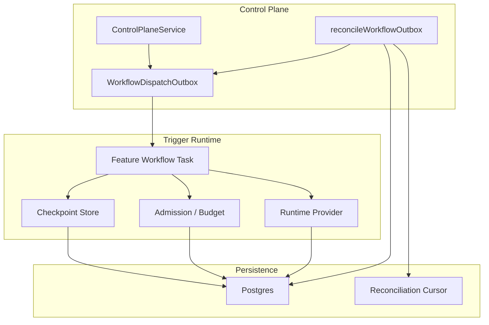
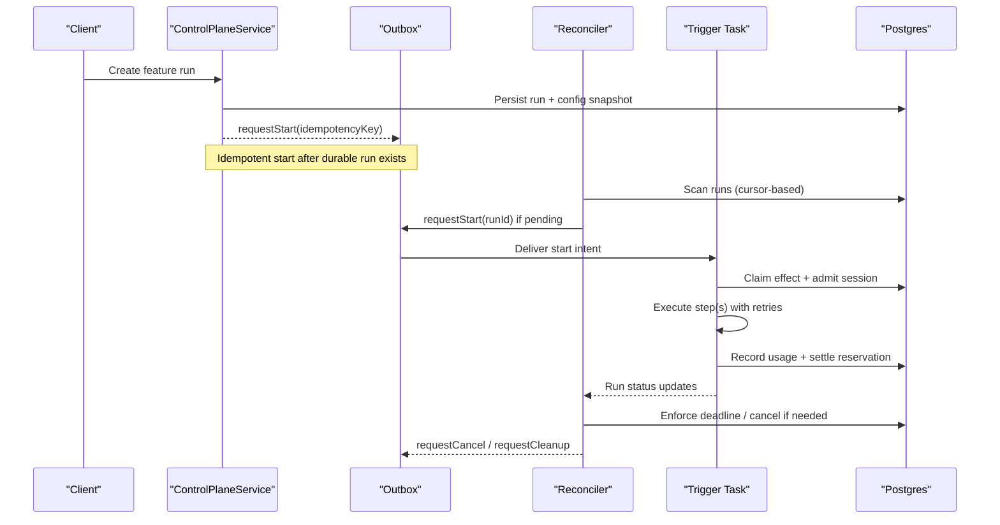
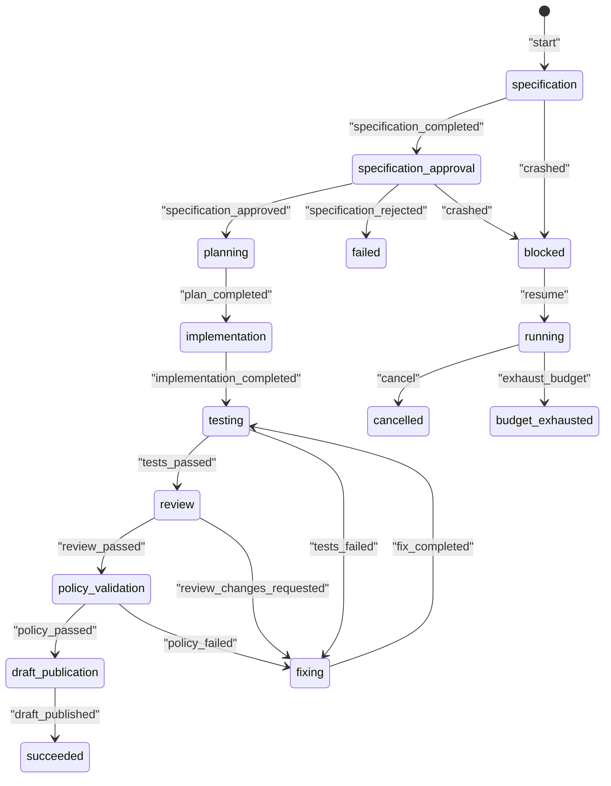
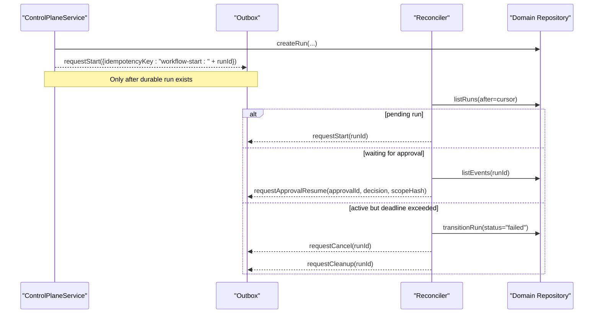
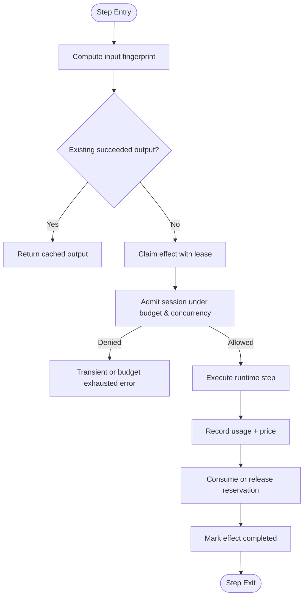
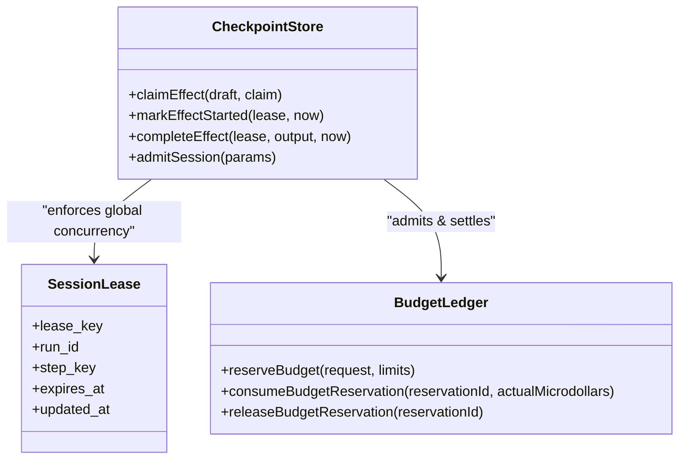
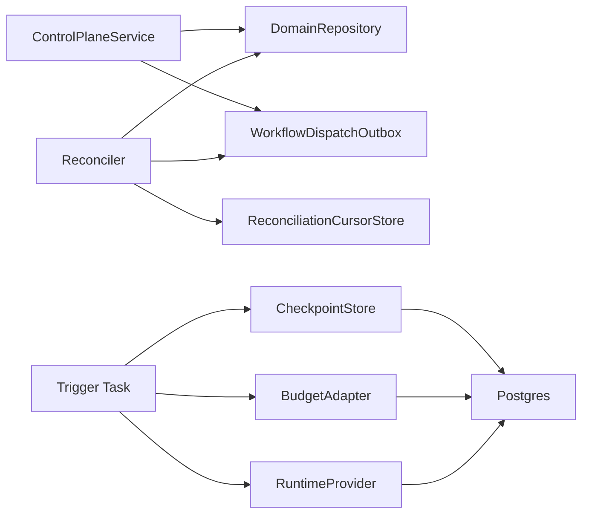

# Workflow Lifecycle Management

<cite>
**Referenced Files in This Document**
- [feature-workflow.ts](file://packages/core/src/feature-workflow.ts)
- [workflow-reconciliation.ts](file://apps/control-plane/src/application/workflow-reconciliation.ts)
- [workflow-dispatch.test.ts](file://apps/control-plane/src/application/workflow-dispatch.test.ts)
- [workflow.ts](file://packages/adapters/src/trigger/workflow.ts)
- [budget.ts](file://packages/core/src/budget.ts)
- [durable-feature-workflow.md](file://docs/architecture/durable-feature-workflow.md)
- [reconciliation-cursor-store.ts](file://packages/adapters/src/trigger/reconciliation-cursor-store.ts)
- [postgres-checkpoint-store.ts](file://packages/adapters/src/trigger/postgres-checkpoint-store.ts)
- [checkpoint-store.ts](file://packages/adapters/src/trigger/checkpoint-store.ts)
- [0019_project_session_leases.sql](file://drizzle/0019_project_session_leases.sql)
- [0020_deployment_daily_budget.sql](file://drizzle/0020_deployment_daily_budget.sql)
</cite>

## Table of Contents
1. [Introduction](#introduction)
2. [Project Structure](#project-structure)
3. [Core Components](#core-components)
4. [Architecture Overview](#architecture-overview)
5. [Detailed Component Analysis](#detailed-component-analysis)
6. [Dependency Analysis](#dependency-analysis)
7. [Performance Considerations](#performance-considerations)
8. [Troubleshooting Guide](#troubleshooting-guide)
9. [Conclusion](#conclusion)
10. [Appendices](#appendices)

## Introduction
This document explains how Agent OS Passerine manages the full lifecycle of workflows: creation, start, monitoring, pause/resume via approvals, cancellation, and termination with cleanup. It covers durable state persistence, recovery through reconciliation, resource allocation and budget enforcement, graceful shutdown, and concurrency controls for high-throughput scenarios. It also provides practical API interaction patterns derived from the control plane outbox and reconciliation logic, and highlights error recovery strategies used by the system.

## Project Structure
The workflow lifecycle spans several layers:
- Control plane: creates runs, persists domain events, and dispatches durable intents to an outbox.
- Reconciler: scans runs, enforces deadlines, emits start/cancel/cleanup intents, and resumes workflows on approval decisions.
- Trigger runtime: executes steps durably using checkpoints, leases, and admission controls; records usage and settles budgets.
- Persistence: Postgres-backed checkpoint store, session leases, usage records, and reconciliation cursors ensure durability and recovery.

**Diagram sources**
- [workflow-reconciliation.ts:156-507](file://apps/control-plane/src/application/workflow-reconciliation.ts#L156-L507)
- [workflow.ts:489-800](file://packages/adapters/src/trigger/workflow.ts#L489-L800)
- [reconciliation-cursor-store.ts:18-90](file://packages/adapters/src/trigger/reconciliation-cursor-store.ts#L18-L90)
- [postgres-checkpoint-store.ts:1-367](file://packages/adapters/src/trigger/postgres-checkpoint-store.ts#L1-L367)

**Section sources**
- [workflow-reconciliation.ts:156-507](file://apps/control-plane/src/application/workflow-reconciliation.ts#L156-L507)
- [workflow.ts:489-800](file://packages/adapters/src/trigger/workflow.ts#L489-L800)
- [reconciliation-cursor-store.ts:18-90](file://packages/adapters/src/trigger/reconciliation-cursor-store.ts#L18-L90)
- [postgres-checkpoint-store.ts:1-367](file://packages/adapters/src/trigger/postgres-checkpoint-store.ts#L1-L367)

## Core Components
- Feature workflow state machine: defines phases, statuses, and event-driven transitions including crash handling, resume, cancel, and budget exhaustion.
- Control plane service and outbox: idempotent run creation and durable intent delivery for start, resume, cancel, and cleanup.
- Reconciler: scans pending/running/waiting runs, enforces timeouts, emits cancellation and cleanup, and resumes on approval decisions.
- Durable trigger task: claims effects, admits sessions under budget/concurrency limits, executes agent steps with retries, records usage, and settles reservations.
- Persistence layer: checkpoint store for effect fencing and replay, session leases for global concurrency, usage records for pricing, and reconciliation cursor for progress.

**Section sources**
- [feature-workflow.ts:8-320](file://packages/core/src/feature-workflow.ts#L8-L320)
- [workflow-dispatch.test.ts:56-199](file://apps/control-plane/src/application/workflow-dispatch.test.ts#L56-L199)
- [workflow-reconciliation.ts:156-507](file://apps/control-plane/src/application/workflow-reconciliation.ts#L156-L507)
- [workflow.ts:489-800](file://packages/adapters/src/trigger/workflow.ts#L489-L800)
- [budget.ts:278-498](file://packages/core/src/budget.ts#L278-L498)
- [reconciliation-cursor-store.ts:18-90](file://packages/adapters/src/trigger/reconciliation-cursor-store.ts#L18-L90)
- [postgres-checkpoint-store.ts:1-367](file://packages/adapters/src/trigger/postgres-checkpoint-store.ts#L1-L367)

## Architecture Overview
The lifecycle is event-driven and durable:
- Creation: The control plane persists a run and emits a start intent only after durable artifacts exist.
- Start: The reconciler detects pending runs and requests start via the outbox; the trigger task claims an effect and admits a session under budget and concurrency constraints.
- Execution: Steps are executed with idempotent input fingerprints, retries, and checkpointed outputs; usage is recorded per step.
- Monitoring: The reconciler enforces deadlines, cancels long-running or failed runs, and triggers cleanup.
- Pause/Resume: Workflows wait for scoped approvals; when approved or rejected, the reconciler emits resume intents that transition the workflow state machine.
- Termination: Terminal states (succeeded, failed, cancelled, budget_exhausted) trigger cleanup intents and release resources.

**Diagram sources**
- [workflow-dispatch.test.ts:56-199](file://apps/control-plane/src/application/workflow-dispatch.test.ts#L56-L199)
- [workflow-reconciliation.ts:156-507](file://apps/control-plane/src/application/workflow-reconciliation.ts#L156-L507)
- [workflow.ts:489-800](file://packages/adapters/src/trigger/workflow.ts#L489-L800)
- [reconciliation-cursor-store.ts:18-90](file://packages/adapters/src/trigger/reconciliation-cursor-store.ts#L18-L90)

## Detailed Component Analysis

### Feature Workflow State Machine
The feature workflow defines a strict phase and status model with explicit transitions driven by events. It supports:
- Phases: specification, specification_approval, planning, implementation, testing, review, fixing, policy_validation, draft_publication.
- Statuses: running, awaiting_approval, blocked, succeeded, failed, cancelled, budget_exhausted.
- Crash handling: moves to blocked with retry accounting; resume restores previous status.
- Cancellation and budget exhaustion: terminal transitions with reasons.
- Replay safety: duplicate events are ignored; terminal states cannot transition further.

**Diagram sources**
- [feature-workflow.ts:8-320](file://packages/core/src/feature-workflow.ts#L8-L320)

**Section sources**
- [feature-workflow.ts:8-320](file://packages/core/src/feature-workflow.ts#L8-L320)

### Control Plane Outbox and Reconciliation
- Idempotent start: Creating a feature run persists the run and emits one start intent keyed by run ID. Duplicate calls do not create duplicates.
- Approval resume: When an approval decision becomes durable, the reconciler emits a resume intent tied to the approval scope hash.
- Deadline enforcement: Active runs exceeding their timeout are transitioned to failed, approvals expired, and cancellation/cleanup emitted.
- Goal children: If a goal run fails due to deadline, its child feature runs are cancelled before cancelling the parent.

**Diagram sources**
- [workflow-dispatch.test.ts:56-199](file://apps/control-plane/src/application/workflow-dispatch.test.ts#L56-L199)
- [workflow-reconciliation.ts:156-507](file://apps/control-plane/src/application/workflow-reconciliation.ts#L156-L507)

**Section sources**
- [workflow-dispatch.test.ts:56-199](file://apps/control-plane/src/application/workflow-dispatch.test.ts#L56-L199)
- [workflow-reconciliation.ts:156-507](file://apps/control-plane/src/application/workflow-reconciliation.ts#L156-L507)

### Durable Trigger Execution and Checkpoints
- Effect claiming: Each side-effectful operation (runtime session, access preparation) is claimed with a unique key and fenced lease; replays with different inputs conflict.
- Step execution: Steps are idempotent by input fingerprint; successful outputs are stored and reused on replay.
- Admission and budget: Before starting a runtime session, the task admits it against project daily and workflow caps, plus concurrency limits; failures result in transient or permanent errors.
- Usage recording: Per-step usage is recorded with model-specific pricing; if provider reporting fails, the reservation amount is conservatively charged.
- Settlement: Reservations are consumed or released atomically; every terminal path ensures capacity is accounted for.

**Diagram sources**
- [workflow.ts:489-800](file://packages/adapters/src/trigger/workflow.ts#L489-L800)
- [budget.ts:278-498](file://packages/core/src/budget.ts#L278-L498)
- [postgres-checkpoint-store.ts:1-367](file://packages/adapters/src/trigger/postgres-checkpoint-store.ts#L1-L367)

**Section sources**
- [workflow.ts:489-800](file://packages/adapters/src/trigger/workflow.ts#L489-L800)
- [budget.ts:278-498](file://packages/core/src/budget.ts#L278-L498)
- [postgres-checkpoint-store.ts:1-367](file://packages/adapters/src/trigger/postgres-checkpoint-store.ts#L1-L367)

### Resource Allocation, Cleanup, and Graceful Shutdown
- Global concurrency fence: A single live agent-session lease prevents overlapping sessions across the project; conflicts are enforced at the database level.
- Session leases: Lease keys include run and step identifiers; expiration and updates are persisted to avoid stale ownership.
- Cleanup procedures: On failure or cancellation, the reconciler emits cleanup intents; orphan sessions are stopped and charged conservatively if no session is discoverable within reconciliation deadlines.
- Graceful shutdown: The reconciler’s cursor is persisted after each run, ensuring resumed scans continue beyond the last processed run without starvation.

**Diagram sources**
- [postgres-checkpoint-store.ts:1-367](file://packages/adapters/src/trigger/postgres-checkpoint-store.ts#L1-L367)
- [0019_project_session_leases.sql:53-75](file://drizzle/0019_project_session_leases.sql#L53-L75)
- [budget.ts:278-498](file://packages/core/src/budget.ts#L278-L498)

**Section sources**
- [0019_project_session_leases.sql:53-75](file://drizzle/0019_project_session_leases.sql#L53-L75)
- [0020_deployment_daily_budget.sql:34-57](file://drizzle/0020_deployment_daily_budget.sql#L34-L57)
- [workflow-reconciliation.ts:214-303](file://apps/control-plane/src/application/workflow-reconciliation.ts#L214-L303)

### Interaction Between Workflow Instances, Shared Resources, and External Dependencies
- Isolation: Each role uses distinct agents and environments; artifact scopes are bound to run and step IDs to prevent cross-run leakage.
- External dependencies: Artifact MCP capabilities write only to the role’s logical step scope; verification runs in a sandbox with restricted network and no MCP.
- Publisher authority: Publication is performed by trusted code with attestation verification; agents never receive repository credentials.

**Section sources**
- [workflow.ts:177-206](file://packages/adapters/src/trigger/workflow.ts#L177-L206)
- [durable-feature-workflow.md:18-44](file://docs/architecture/durable-feature-workflow.md#L18-L44)

## Dependency Analysis
- Control plane depends on domain repository and outbox; reconciliation depends on repository, outbox, and cursor store.
- Trigger runtime depends on checkpoint store, runtime provider, artifact storage, and budget adapters.
- Persistence layer abstracts SQL execution and provides transactional guarantees for admissions and leases.

**Diagram sources**
- [workflow-reconciliation.ts:156-507](file://apps/control-plane/src/application/workflow-reconciliation.ts#L156-L507)
- [workflow.ts:489-800](file://packages/adapters/src/trigger/workflow.ts#L489-L800)
- [reconciliation-cursor-store.ts:18-90](file://packages/adapters/src/trigger/reconciliation-cursor-store.ts#L18-L90)

**Section sources**
- [workflow-reconciliation.ts:156-507](file://apps/control-plane/src/application/workflow-reconciliation.ts#L156-L507)
- [workflow.ts:489-800](file://packages/adapters/src/trigger/workflow.ts#L489-L800)
- [reconciliation-cursor-store.ts:18-90](file://packages/adapters/src/trigger/reconciliation-cursor-store.ts#L18-L90)

## Performance Considerations
- Concurrency control: Global session lease and budget-driven concurrency limit ensure safe throughput; admission reserve thresholds prevent overcommitment.
- Retry strategy: Steps retry classified transient errors up to configured attempts; non-transient errors fail fast to avoid wasted capacity.
- Cost-aware scheduling: Admission checks incorporate both workflow and daily caps; reservations are included in cap calculations to avoid silent overuse.
- Cursor-based scanning: Reconciliation uses persistent cursors to avoid rescanning old runs and to scale to large run histories.
- Usage pricing granularity: Distinct cache buckets and runtime minutes enable accurate cost attribution and optimization signals.

[No sources needed since this section provides general guidance]

## Troubleshooting Guide
Common issues and recovery patterns:
- Duplicate starts: The outbox ensures only one start per run ID; verify idempotency keys and run existence before dispatch.
- Approval delays: Approvals must be durable before resume intents are emitted; check approval events and scope hashes.
- Deadline exceeded: Runs past their timeout are marked failed; approvals are expired and cancellation/cleanup are emitted.
- Budget exhaustion: If admission denies due to caps or concurrency, adjust limits or reduce estimated costs; monitor usage records.
- Orphan sessions: If no session is found within reconciliation deadlines, cleanup charges the reservation and releases the global fence.

**Section sources**
- [workflow-dispatch.test.ts:133-199](file://apps/control-plane/src/application/workflow-dispatch.test.ts#L133-L199)
- [workflow-reconciliation.ts:214-303](file://apps/control-plane/src/application/workflow-reconciliation.ts#L214-L303)
- [durable-feature-workflow.md:60-108](file://docs/architecture/durable-feature-workflow.md#L60-L108)

## Conclusion
Agent OS Passerine implements a robust, durable workflow lifecycle grounded in event-driven state machines, idempotent outbox semantics, and strong consistency via Postgres-backed checkpoints and leases. The reconciler enforces deadlines and drives recovery, while the trigger runtime ensures safe execution with retries, budget controls, and precise usage accounting. Together, these components provide scalable, observable, and resilient workflow management suitable for high-throughput environments.

[No sources needed since this section summarizes without analyzing specific files]

## Appendices

### Practical API Patterns Derived from Code
- Create a feature run: Call the control plane to persist a run; the service emits a start intent only after the run exists.
- Resume on approval: After an approval decision is durable, the reconciler emits a resume intent with the approval ID and scope hash.
- Cancel a run: Emit a cancellation intent after the run.cancelled event is durable; the reconciler will cancel child runs if applicable.
- Monitor runs: Use the reconciler’s cursor to scan runs and observe status transitions, approvals, and cleanup intents.

**Section sources**
- [workflow-dispatch.test.ts:56-199](file://apps/control-plane/src/application/workflow-dispatch.test.ts#L56-L199)
- [workflow-reconciliation.ts:156-507](file://apps/control-plane/src/application/workflow-reconciliation.ts#L156-L507)