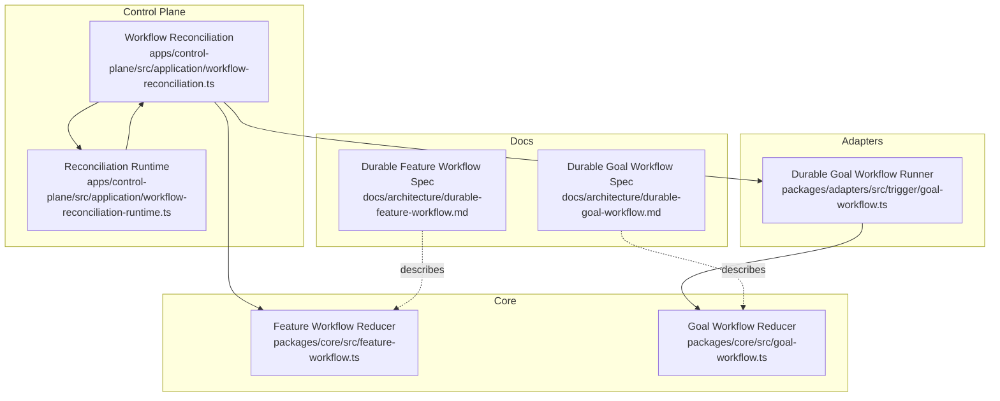
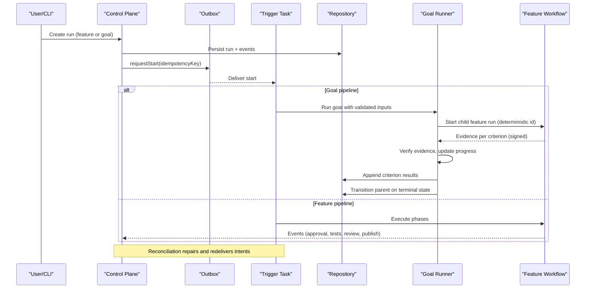
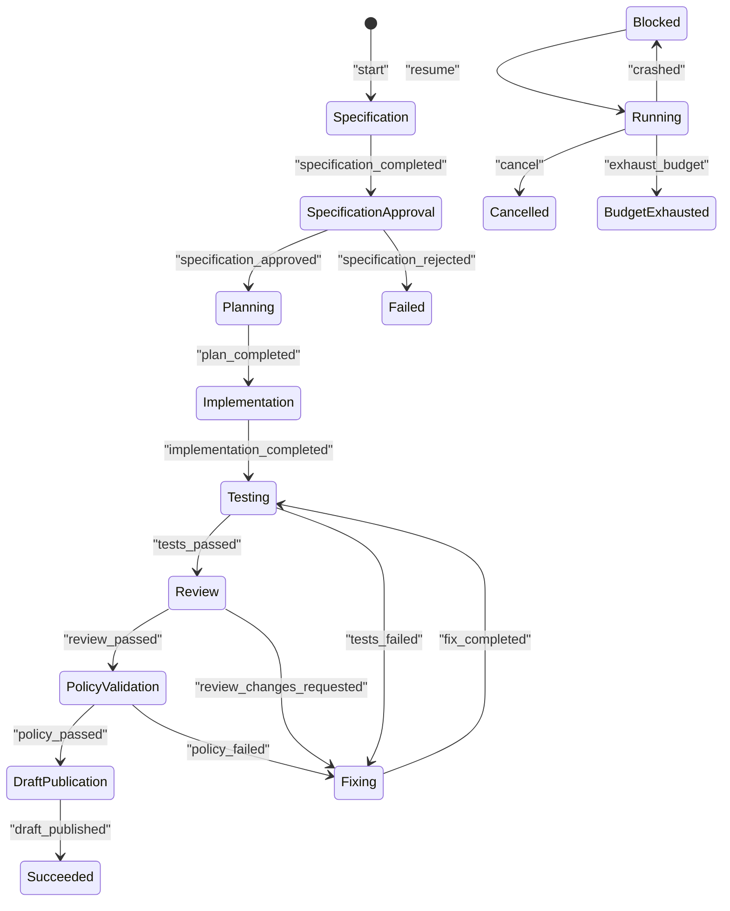
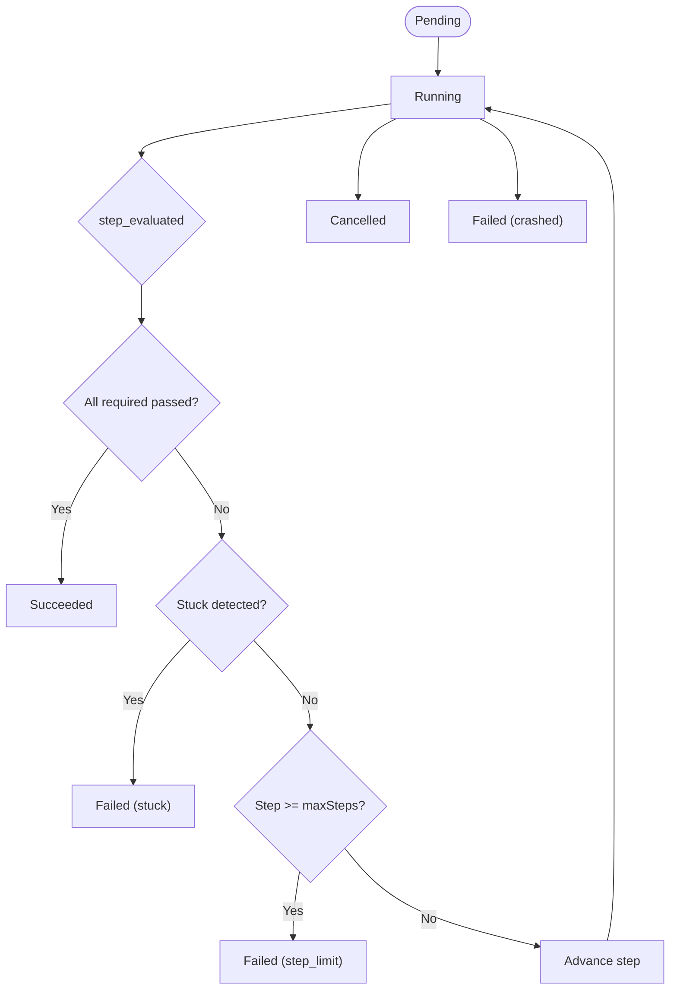
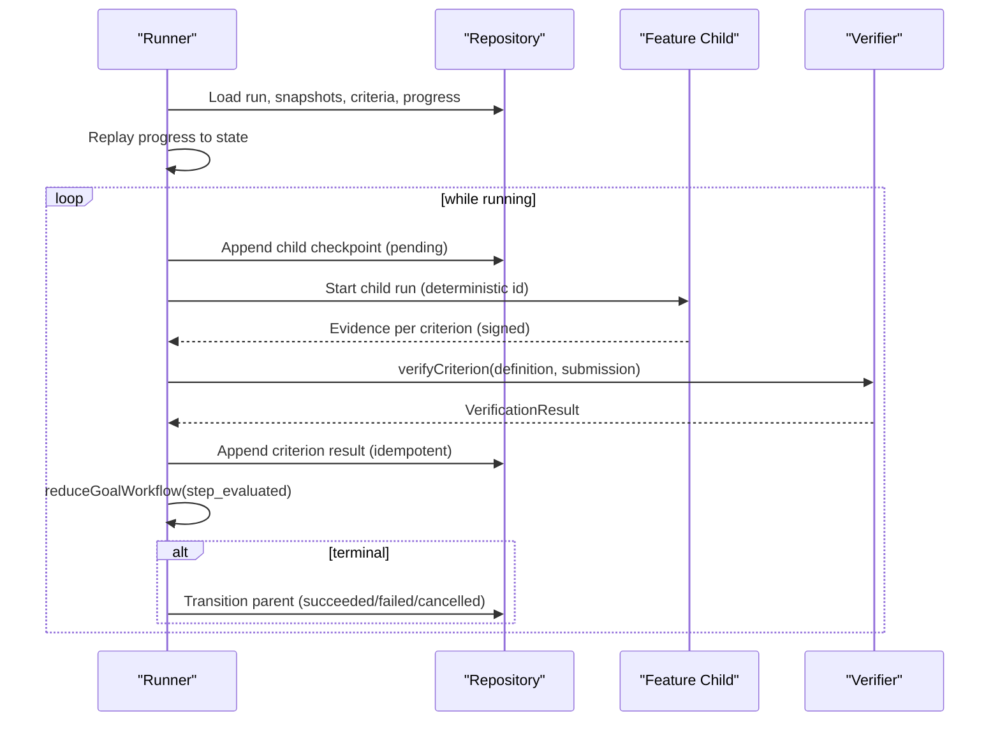
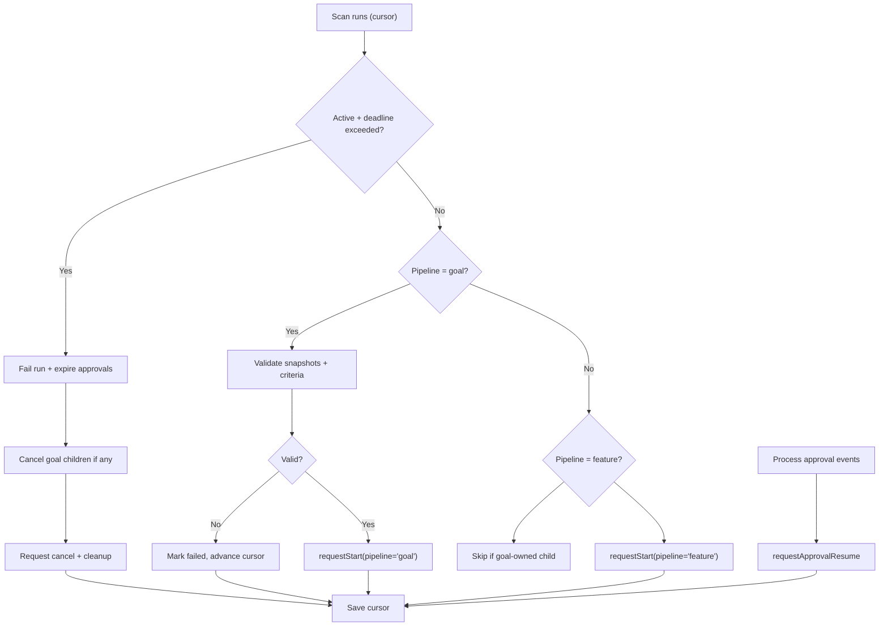
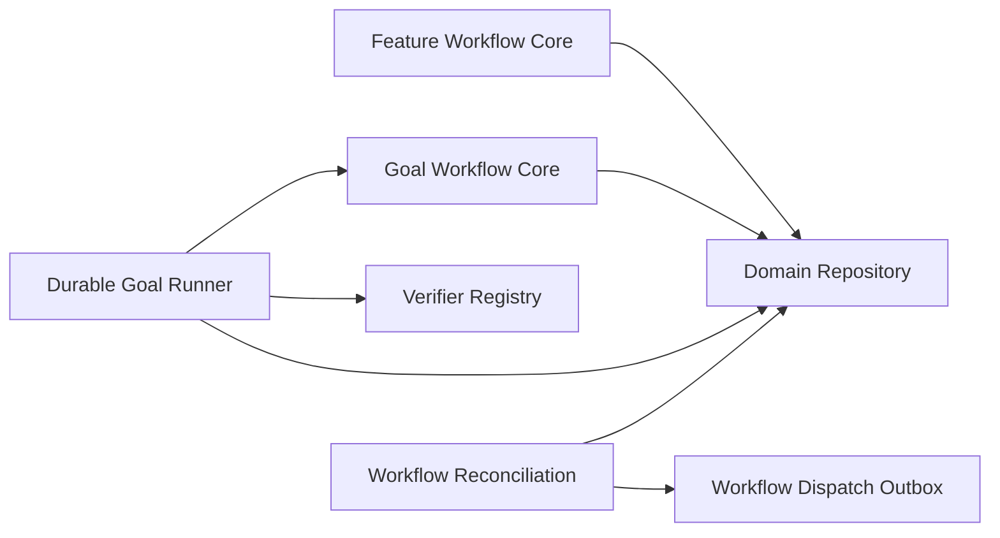

# Workflows and Pipelines

<cite>
**Referenced Files in This Document**
- [durable-feature-workflow.md](file://docs/architecture/durable-feature-workflow.md)
- [durable-goal-workflow.md](file://docs/architecture/durable-goal-workflow.md)
- [feature-workflow.ts](file://packages/core/src/feature-workflow.ts)
- [goal-workflow.ts](file://packages/core/src/goal-workflow.ts)
- [trigger goal-workflow.ts](file://packages/adapters/src/trigger/goal-workflow.ts)
- [workflow-reconciliation.ts](file://apps/control-plane/src/application/workflow-reconciliation.ts)
- [workflow-reconciliation-runtime.ts](file://apps/control-plane/src/application/workflow-reconciliation-runtime.ts)
- [workflow-dispatch.test.ts](file://apps/control-plane/src/application/workflow-dispatch.test.ts)
</cite>

## Table of Contents
1. Introduction
2. Project Structure
3. Core Components
4. Architecture Overview
5. Detailed Component Analysis
6. Dependency Analysis
7. Performance Considerations
8. Troubleshooting Guide
9. Conclusion

## Introduction
This document explains the two main workflow types in Agent OS Passerine:
- Feature Workflow: an automated, end-to-end feature development pipeline that produces a tested draft pull request with approvals, bounded retries, and trusted verification.
- Goal Workflow: a bounded loop that repeatedly executes the feature workflow to achieve user-defined Definition-of-Done criteria, stopping as soon as all required criteria pass.

It covers state machines, event-driven processing, phase transitions, failure handling, retries, approvals, human intervention, monitoring, debugging, and performance optimization strategies.

## Project Structure
The workflows are implemented across core logic (pure reducers), adapters (Trigger-based durable execution), and control-plane orchestration (reconciliation, outbox, timeouts).

**Diagram sources**
- [feature-workflow.ts:1-320](file://packages/core/src/feature-workflow.ts#L1-L320)
- [goal-workflow.ts:1-243](file://packages/core/src/goal-workflow.ts#L1-L243)
- [trigger goal-workflow.ts:1-827](file://packages/adapters/src/trigger/goal-workflow.ts#L1-L827)
- [workflow-reconciliation.ts:1-507](file://apps/control-plane/src/application/workflow-reconciliation.ts#L1-L507)
- [workflow-reconciliation-runtime.ts:1-29](file://apps/control-plane/src/application/workflow-reconciliation-runtime.ts#L1-L29)
- [durable-feature-workflow.md:1-191](file://docs/architecture/durable-feature-workflow.md#L1-L191)
- [durable-goal-workflow.md:1-138](file://docs/architecture/durable-goal-workflow.md#L1-L138)

**Section sources**
- [durable-feature-workflow.md:1-191](file://docs/architecture/durable-feature-workflow.md#L1-L191)
- [durable-goal-workflow.md:1-138](file://docs/architecture/durable-goal-workflow.md#L1-L138)

## Core Components
- Feature Workflow Reducer: pure state machine for specification, planning, implementation, testing, review, fixing, policy validation, and draft publication. Supports crash/resume, retry limits, cancellation, budget exhaustion, and approval gating.
- Goal Workflow Reducer: pure reducer enforcing up to three attempts, deterministic step progression, stuck detection via failure fingerprints, and immediate success when all required criteria pass.
- Durable Goal Runner: validates inputs, replays progress, coordinates child feature runs, verifies signed evidence, persists criterion results, and finalizes parent run output.
- Control Plane Reconciliation: scans runs, enforces deadlines, dispatches starts/resumes/cancellations/cleanups via an outbox, repairs missing snapshots/criteria, and cancels goal-owned children.

**Section sources**
- [feature-workflow.ts:1-320](file://packages/core/src/feature-workflow.ts#L1-L320)
- [goal-workflow.ts:1-243](file://packages/core/src/goal-workflow.ts#L1-L243)
- [trigger goal-workflow.ts:1-827](file://packages/adapters/src/trigger/goal-workflow.ts#L1-L827)
- [workflow-reconciliation.ts:1-507](file://apps/control-plane/src/application/workflow-reconciliation.ts#L1-L507)

## Architecture Overview
The system is event-driven and durable:
- Runs are persisted with status, input, and events.
- The reconciliation loop reads pending runs, ensures prerequisites (snapshots, criteria), and dispatches tasks or resumes through an outbox.
- Trigger tasks execute work and emit events; waitpoints wake steps after approvals.
- Goal workflow composes multiple feature workflow runs as bounded attempts, verifying signed evidence before advancing.

**Diagram sources**
- [workflow-reconciliation.ts:156-507](file://apps/control-plane/src/application/workflow-reconciliation.ts#L156-L507)
- [trigger goal-workflow.ts:634-827](file://packages/adapters/src/trigger/goal-workflow.ts#L634-L827)
- [feature-workflow.ts:160-317](file://packages/core/src/feature-workflow.ts#L160-L317)
- [goal-workflow.ts:163-243](file://packages/core/src/goal-workflow.ts#L163-L243)

## Detailed Component Analysis

### Feature Workflow State Machine
Phases: specification → specification_approval → planning → implementation → testing → review → fixing → policy_validation → draft_publication.
Statuses: running, awaiting_approval, blocked, succeeded, failed, cancelled, budget_exhausted.
Key behaviors:
- Approval gates move from awaiting_approval to running.
- Crashes transition to blocked with retry counting; resume restores previous status.
- Test/review/policy failures route to fixing with retry limit enforcement.
- Draft publication requires trusted publisher attestation bound to workflow context.

**Diagram sources**
- [feature-workflow.ts:8-27](file://packages/core/src/feature-workflow.ts#L8-L27)
- [feature-workflow.ts:160-317](file://packages/core/src/feature-workflow.ts#L160-L317)

**Section sources**
- [feature-workflow.ts:1-320](file://packages/core/src/feature-workflow.ts#L1-L320)

### Goal Workflow State Machine
States: pending, running, succeeded, failed, cancelled.
Events: start, step_evaluated, cancel, crash.
Rules:
- Each step must report exactly one result per criterion.
- Success when all required criteria pass.
- Failure reasons: stuck (same fingerprint repeated), step_limit (maxSteps reached), crashed.
- Deterministic child run IDs ensure replay safety.

**Diagram sources**
- [goal-workflow.ts:12-41](file://packages/core/src/goal-workflow.ts#L12-L41)
- [goal-workflow.ts:163-243](file://packages/core/src/goal-workflow.ts#L163-L243)

**Section sources**
- [goal-workflow.ts:1-243](file://packages/core/src/goal-workflow.ts#L1-L243)

### Durable Goal Runner and Evidence Verification
Responsibilities:
- Validate immutable run input, config snapshot, and criteria.
- Replay persisted progress to reconstruct state deterministically.
- For each step, create a deterministic child feature run, collect signed evidence, verify against allowlisted commands, persist results, and finalize parent output.

**Diagram sources**
- [trigger goal-workflow.ts:634-827](file://packages/adapters/src/trigger/goal-workflow.ts#L634-L827)
- [goal-workflow.ts:163-243](file://packages/core/src/goal-workflow.ts#L163-L243)

**Section sources**
- [trigger goal-workflow.ts:1-827](file://packages/adapters/src/trigger/goal-workflow.ts#L1-L827)
- [goal-workflow.ts:1-243](file://packages/core/src/goal-workflow.ts#L1-L243)

### Control Plane Reconciliation and Outbox
Functions:
- Scan runs by project, enforce absolute deadlines, fail timed-out runs, expire pending approvals, and cancel active children for goals.
- Repair missing snapshots and criteria for goal runs.
- Dispatch starts, approval resums, cancellations, and cleanups via idempotent outbox requests.
- Skip goal-owned feature children to avoid double-start.

**Diagram sources**
- [workflow-reconciliation.ts:156-507](file://apps/control-plane/src/application/workflow-reconciliation.ts#L156-L507)

**Section sources**
- [workflow-reconciliation.ts:1-507](file://apps/control-plane/src/application/workflow-reconciliation.ts#L1-L507)
- [workflow-reconciliation-runtime.ts:1-29](file://apps/control-plane/src/application/workflow-reconciliation-runtime.ts#L1-L29)

### Practical Examples: Events, Transitions, and Error Handling
- Feature workflow:
  - specification_completed moves to awaiting_approval; specification_approved proceeds to planning; tests_failed routes to fixing with retry count increment; draft_published requires trusted publisher attestation binding.
- Goal workflow:
  - step_evaluated must include one result per criterion; repeated identical failure fingerprints trigger stuck detection; exceeding maxSteps yields step_limit failure.
- Reconciliation:
  - Timed-out runs are failed and cleaned up; goal-owned children are canceled; approval events produce resume intents; missing snapshots/criteria are repaired before dispatch.

**Section sources**
- [feature-workflow.ts:160-317](file://packages/core/src/feature-workflow.ts#L160-L317)
- [goal-workflow.ts:163-243](file://packages/core/src/goal-workflow.ts#L163-L243)
- [workflow-reconciliation.ts:215-303](file://apps/control-plane/src/application/workflow-reconciliation.ts#L215-L303)
- [workflow-dispatch.test.ts:56-199](file://apps/control-plane/src/application/workflow-dispatch.test.ts#L56-L199)

## Dependency Analysis
- Core reducers are pure and testable; they depend only on domain primitives and utilities.
- The durable goal runner depends on core reducers, repository interfaces, verifier registry, and schema validators.
- Control plane reconciliation depends on repository, outbox abstraction, and configuration snapshots; it orchestrates external systems without holding secrets at module load.

**Diagram sources**
- [feature-workflow.ts:1-320](file://packages/core/src/feature-workflow.ts#L1-L320)
- [goal-workflow.ts:1-243](file://packages/core/src/goal-workflow.ts#L1-L243)
- [trigger goal-workflow.ts:1-827](file://packages/adapters/src/trigger/goal-workflow.ts#L1-L827)
- [workflow-reconciliation.ts:1-507](file://apps/control-plane/src/application/workflow-reconciliation.ts#L1-L507)

**Section sources**
- [trigger goal-workflow.ts:1-827](file://packages/adapters/src/trigger/goal-workflow.ts#L1-L827)
- [workflow-reconciliation.ts:1-507](file://apps/control-plane/src/application/workflow-reconciliation.ts#L1-L507)

## Performance Considerations
- Idempotency: Event deduplication via processed IDs and fingerprints prevents duplicate work.
- Bounded retries: Feature workflow enforces maxRetries; goal workflow enforces maxSteps to cap cost and time.
- Deterministic IDs: Goal child runs use deterministic IDs keyed by parent and step, enabling safe retries and skipping already-terminal children.
- Cursor-based scanning: Reconciliation persists a cursor to avoid rescanning completed pages and to resume after termination.
- Timeouts: Absolute workflow deadlines prevent long-running hangs; goal workflows can have shorter configured timeouts capped by a global maximum.
- Minimal secret surface: Trigger task discovery loads no secrets until first execution; sensitive components resolve lazily.

[No sources needed since this section provides general guidance]

## Troubleshooting Guide
Common issues and patterns:
- Stuck loops: Goal workflow detects repeated failure fingerprints and fails as stuck; inspect criterion evidence and verifier outputs.
- Step limit reached: When maxSteps is exhausted without satisfying required criteria, the goal fails as step_limit; adjust criteria or fix root causes.
- Approval stalls: If approvals remain pending, reconciliation will expire them on timeout; ensure approval decisions are durable and resumed via outbox.
- Missing snapshots/criteria: Reconciliation repairs missing snapshots and creates missing criteria idempotently; failures during repair advance the cursor.
- Deadline exceeded: Active runs past their absolute deadline are failed and cleaned up; check logs for resource constraints or misconfiguration.
- Duplicate events: Processed event tracking ensures reprocessing is safe; mismatched content for same event ID is rejected.

**Section sources**
- [goal-workflow.ts:163-243](file://packages/core/src/goal-workflow.ts#L163-L243)
- [workflow-reconciliation.ts:215-303](file://apps/control-plane/src/application/workflow-reconciliation.ts#L215-L303)
- [workflow-dispatch.test.ts:56-199](file://apps/control-plane/src/application/workflow-dispatch.test.ts#L56-L199)

## Conclusion
Agent OS Passerine’s workflows combine pure state machines with durable, event-driven orchestration. The Feature Workflow automates end-to-end feature development with approvals, retries, and trusted publication boundaries. The Goal Workflow wraps bounded attempts around the Feature Workflow, validating signed evidence against user-defined criteria and halting immediately upon success. Robust reconciliation, deterministic IDs, and strict validation ensure reliability, observability, and safety under failures and retries.

[No sources needed since this section summarizes without analyzing specific files]