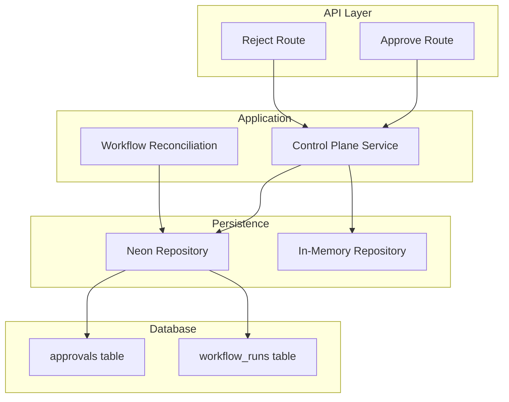
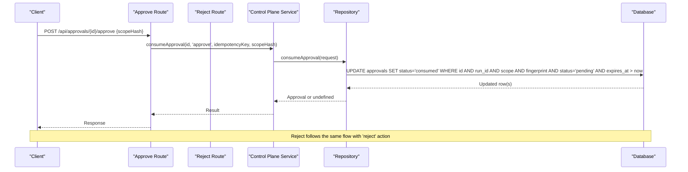
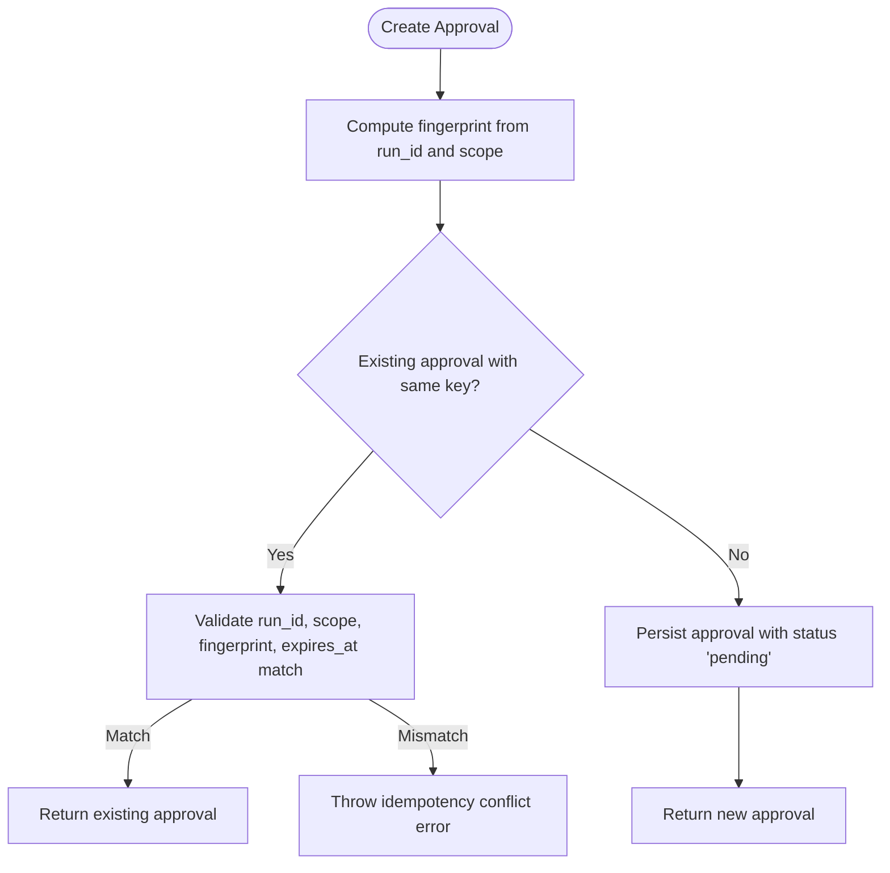
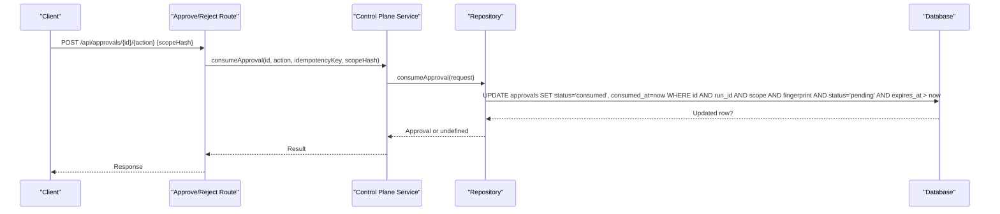
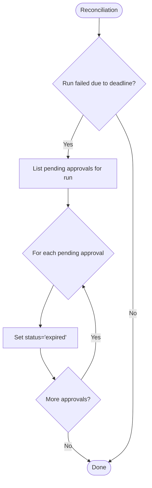
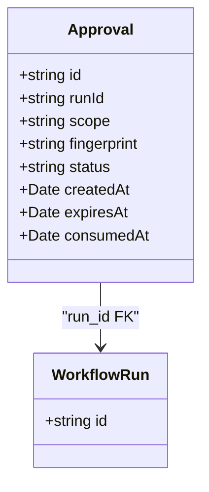
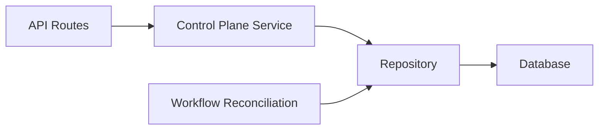

# Approval System

<cite>
**Referenced Files in This Document**
- [0000_domain_persistence.sql](file://drizzle/0000_domain_persistence.sql)
- [route.ts (approve)](file://apps/control-plane/app/api/approvals/[id]/approve/route.ts)
- [route.ts (reject)](file://apps/control-plane/app/api/approvals/[id]/reject/route.ts)
- [control-plane-service.ts](file://apps/control-plane/src/application/control-plane-service.ts)
- [workflow-reconciliation.ts](file://apps/control-plane/src/application/workflow-reconciliation.ts)
- [neon-repository.ts](file://packages/adapters/src/persistence/neon-repository.ts)
- [in-memory.ts](file://packages/adapters/src/persistence/in-memory.ts)
- [lifecycle.ts](file://packages/core/src/lifecycle.ts)
</cite>

## Table of Contents
1. Introduction
2. Project Structure
3. Core Components
4. Architecture Overview
5. Detailed Component Analysis
6. Dependency Analysis
7. Performance Considerations
8. Troubleshooting Guide
9. Conclusion

## Introduction
This document describes the approval system data model and lifecycle with a focus on the approvals table and its relationship to workflow runs. It explains how approvals are created, consumed, or expired, and highlights security considerations around fingerprints and scope-based access control. It also provides practical examples for creating approvals, processing decisions, and handling expired approvals.

## Project Structure
The approval system spans database schema definitions, API routes, application services, repository implementations, and core lifecycle logic:
- Database schema defines the approvals table and related types.
- API routes expose endpoints to approve or reject an approval by id.
- The control plane service orchestrates creation and consumption of approvals.
- Repositories implement persistence for approvals (Neon Postgres and in-memory).
- Core lifecycle defines event types and state transitions for approvals.

**Diagram sources**
- [route.ts (approve):1-33](file://apps/control-plane/app/api/approvals/[id]/approve/route.ts#L1-L33)
- [route.ts (reject):1-33](file://apps/control-plane/app/api/approvals/[id]/reject/route.ts#L1-L33)
- [control-plane-service.ts:1311-1353](file://apps/control-plane/src/application/control-plane-service.ts#L1311-L1353)
- [workflow-reconciliation.ts:229-266](file://apps/control-plane/src/application/workflow-reconciliation.ts#L229-L266)
- [neon-repository.ts:906-968](file://packages/adapters/src/persistence/neon-repository.ts#L906-L968)
- [in-memory.ts:765-812](file://packages/adapters/src/persistence/in-memory.ts#L765-L812)
- [0000_domain_persistence.sql:1-15](file://drizzle/0000_domain_persistence.sql#L1-L15)
- [0000_domain_persistence.sql:173-189](file://drizzle/0000_domain_persistence.sql#L173-L189)

**Section sources**
- [0000_domain_persistence.sql:1-15](file://drizzle/0000_domain_persistence.sql#L1-L15)
- [0000_domain_persistence.sql:173-189](file://drizzle/0000_domain_persistence.sql#L173-L189)
- [route.ts (approve):1-33](file://apps/control-plane/app/api/approvals/[id]/approve/route.ts#L1-L33)
- [route.ts (reject):1-33](file://apps/control-plane/app/api/approvals/[id]/reject/route.ts#L1-L33)
- [control-plane-service.ts:1311-1353](file://apps/control-plane/src/application/control-plane-service.ts#L1311-L1353)
- [workflow-reconciliation.ts:229-266](file://apps/control-plane/src/application/workflow-reconciliation.ts#L229-L266)
- [neon-repository.ts:906-968](file://packages/adapters/src/persistence/neon-repository.ts#L906-L968)
- [in-memory.ts:765-812](file://packages/adapters/src/persistence/in-memory.ts#L765-L812)

## Core Components
- Approvals table: Stores each approval request with identity, scoping, fingerprint, status, and timestamps.
- Approval status enum: pending, consumed, expired.
- Relationship to workflow runs: Each approval belongs to a workflow run via a foreign key.
- Control plane service: Creates approvals with idempotency and computes a fingerprint from run_id and scope; consumes approvals with strict checks.
- Repositories: Persist approvals and enforce constraints during consume/expiry operations.
- Lifecycle events: Define approve, reject, and expire events and their validation rules.

Key fields in the approvals table:
- id: Primary key identifier for the approval.
- run_id: Foreign key linking to workflow_runs.id.
- scope: Human-readable or machine-scoped descriptor of what is being approved.
- fingerprint: Deterministic hash derived from run_id and scope to prevent tampering and ensure integrity.
- status: Enum values: pending, consumed, expired.
- created_at: Timestamp when the approval was created.
- expires_at: Timestamp after which the approval is no longer valid.
- consumed_at: Timestamp set when the approval is consumed (approved or rejected); null while pending.

Security considerations:
- Fingerprint integrity: Consumption requires matching run_id, scope, and fingerprint to ensure the decision applies to the intended approval.
- Scope-based access control: Decisions must include the correct scope hash; mismatches are rejected at both service and repository layers.
- Idempotent creation: Duplicate create requests with the same key return the existing approval if parameters match.
- Expiration enforcement: Consumption is only allowed before expires_at; expired approvals cannot be consumed.

Examples:
- Creating an approval: Call the control plane service with an idempotency key, run_id, scope, and expires_at. The service generates a unique approval id and a deterministic fingerprint from run_id and scope.
- Processing a decision: POST to /api/approvals/{id}/approve or /api/approvals/{id}/reject with the approval id and scopeHash. The service validates and attempts to consume the approval atomically.
- Handling expired approvals: If expires_at has passed, consumption returns no result; reconciliation can mark pending approvals as expired.

**Section sources**
- [0000_domain_persistence.sql:1-15](file://drizzle/0000_domain_persistence.sql#L1-L15)
- [0000_domain_persistence.sql:173-189](file://drizzle/0000_domain_persistence.sql#L173-L189)
- [control-plane-service.ts:1311-1353](file://apps/control-plane/src/application/control-plane-service.ts#L1311-L1353)
- [neon-repository.ts:949-968](file://packages/adapters/src/persistence/neon-repository.ts#L949-L968)
- [in-memory.ts:765-812](file://packages/adapters/src/persistence/in-memory.ts#L765-L812)
- [lifecycle.ts:131-218](file://packages/core/src/lifecycle.ts#L131-L218)

## Architecture Overview
The approval flow integrates API routes, application logic, persistence, and background reconciliation:

**Diagram sources**
- [route.ts (approve):1-33](file://apps/control-plane/app/api/approvals/[id]/approve/route.ts#L1-L33)
- [route.ts (reject):1-33](file://apps/control-plane/app/api/approvals/[id]/reject/route.ts#L1-L33)
- [control-plane-service.ts:1311-1353](file://apps/control-plane/src/application/control-plane-service.ts#L1311-L1353)
- [neon-repository.ts:949-968](file://packages/adapters/src/persistence/neon-repository.ts#L949-L968)

## Detailed Component Analysis

### Data Model: approvals table
- id: text primary key
- run_id: text not null, foreign key to workflow_runs.id
- scope: text not null
- fingerprint: text not null
- status: approval_status enum ('pending', 'consumed', 'expired')
- created_at: timestamp with time zone not null
- expires_at: timestamp with time zone not null
- consumed_at: timestamp with time zone nullable

Relationships:
- One-to-many: workflow_runs -> approvals (via run_id)
- Cascade delete: Deleting a workflow_run cascades to approvals

Indexes:
- Indexes exist to optimize listing approvals by run_id and status with ordering by created_at and id.

**Section sources**
- [0000_domain_persistence.sql:1-15](file://drizzle/0000_domain_persistence.sql#L1-L15)
- [0000_domain_persistence.sql:173-189](file://drizzle/0000_domain_persistence.sql#L173-L189)

### Approval Creation Flow
- The control plane service creates an approval using an idempotency key, run_id, scope, and expires_at.
- A deterministic fingerprint is computed from run_id and scope.
- If a duplicate creation request arrives with the same key and matching parameters, it returns the existing approval.
- The approval is persisted with status 'pending'.

**Diagram sources**
- [control-plane-service.ts:1311-1353](file://apps/control-plane/src/application/control-plane-service.ts#L1311-L1353)

**Section sources**
- [control-plane-service.ts:1311-1353](file://apps/control-plane/src/application/control-plane-service.ts#L1311-L1353)

### Approval Decision Flow (Approve/Reject)
- API routes accept POST requests to approve or reject an approval by id, requiring authentication and validating the body schema.
- The service calls consumeApproval with the action ('approve' or 'reject'), idempotency key, and scopeHash.
- The repository performs an atomic update that enforces:
  - Exact match on id, run_id, scope, fingerprint
  - Current status must be 'pending'
  - expires_at must be greater than the current consumedAt timestamp
- On success, status becomes 'consumed' and consumed_at is set.

**Diagram sources**
- [route.ts (approve):1-33](file://apps/control-plane/app/api/approvals/[id]/approve/route.ts#L1-L33)
- [route.ts (reject):1-33](file://apps/control-plane/app/api/approvals/[id]/reject/route.ts#L1-L33)
- [neon-repository.ts:949-968](file://packages/adapters/src/persistence/neon-repository.ts#L949-L968)

**Section sources**
- [route.ts (approve):1-33](file://apps/control-plane/app/api/approvals/[id]/approve/route.ts#L1-L33)
- [route.ts (reject):1-33](file://apps/control-plane/app/api/approvals/[id]/reject/route.ts#L1-L33)
- [neon-repository.ts:949-968](file://packages/adapters/src/persistence/neon-repository.ts#L949-L968)

### Expiration Handling
- During workflow reconciliation, if a workflow fails due to deadline exceeded, the system iterates through pending approvals for that run and marks them as expired.
- Expiration sets status to 'expired' without setting consumed_at.

**Diagram sources**
- [workflow-reconciliation.ts:229-266](file://apps/control-plane/src/application/workflow-reconciliation.ts#L229-L266)

**Section sources**
- [workflow-reconciliation.ts:229-266](file://apps/control-plane/src/application/workflow-reconciliation.ts#L229-L266)

### Security: Fingerprints and Scope-Based Access Control
- Fingerprint is derived deterministically from run_id and scope, ensuring that any change in scope invalidates the fingerprint.
- Consumption requires exact matches on id, run_id, scope, and fingerprint, preventing misuse across different scopes or runs.
- Lifecycle reduce function enforces that approve/reject events must have a scopeHash matching the approval’s scopeHash; otherwise, it throws an error.
- In-memory and Neon repositories both validate these constraints during consume/expiry operations.

**Diagram sources**
- [0000_domain_persistence.sql:1-15](file://drizzle/0000_domain_persistence.sql#L1-L15)
- [0000_domain_persistence.sql:173-189](file://drizzle/0000_domain_persistence.sql#L173-L189)

**Section sources**
- [lifecycle.ts:131-218](file://packages/core/src/lifecycle.ts#L131-L218)
- [neon-repository.ts:949-968](file://packages/adapters/src/persistence/neon-repository.ts#L949-L968)
- [in-memory.ts:765-812](file://packages/adapters/src/persistence/in-memory.ts#L765-L812)

## Dependency Analysis
- API routes depend on the control plane service for business logic.
- Control plane service depends on repository abstraction for persistence.
- Repositories depend on the database schema and indexes for efficient queries and updates.
- Workflow reconciliation depends on repository methods to list and expire approvals.

**Diagram sources**
- [route.ts (approve):1-33](file://apps/control-plane/app/api/approvals/[id]/approve/route.ts#L1-L33)
- [route.ts (reject):1-33](file://apps/control-plane/app/api/approvals/[id]/reject/route.ts#L1-L33)
- [control-plane-service.ts:1311-1353](file://apps/control-plane/src/application/control-plane-service.ts#L1311-L1353)
- [workflow-reconciliation.ts:229-266](file://apps/control-plane/src/application/workflow-reconciliation.ts#L229-L266)
- [neon-repository.ts:906-968](file://packages/adapters/src/persistence/neon-repository.ts#L906-L968)

**Section sources**
- [route.ts (approve):1-33](file://apps/control-plane/app/api/approvals/[id]/approve/route.ts#L1-L33)
- [route.ts (reject):1-33](file://apps/control-plane/app/api/approvals/[id]/reject/route.ts#L1-L33)
- [control-plane-service.ts:1311-1353](file://apps/control-plane/src/application/control-plane-service.ts#L1311-L1353)
- [workflow-reconciliation.ts:229-266](file://apps/control-plane/src/application/workflow-reconciliation.ts#L229-L266)
- [neon-repository.ts:906-968](file://packages/adapters/src/persistence/neon-repository.ts#L906-L968)

## Performance Considerations
- Use indexes on approvals for efficient listing by run_id and status with ordering by created_at and id.
- Atomic updates in consumeApproval prevent race conditions and reduce contention.
- Pagination support in listApprovals helps avoid large result sets.
- Expiration checks at the database level minimize unnecessary application logic.

[No sources needed since this section provides general guidance]

## Troubleshooting Guide
Common issues and resolutions:
- Approval not found: Ensure the id exists and belongs to the specified run_id; check getApproval usage.
- Scope mismatch: Verify that the scopeHash provided in the decision matches the approval’s scope; lifecycle reduce enforces this.
- Expired approval: Consumption will fail if expires_at has passed; handle by marking as expired via reconciliation.
- Idempotency conflict: Duplicate create requests with mismatched parameters will throw a conflict error; verify inputs.

Operational tips:
- Monitor pending approvals per run to detect stalls.
- Ensure timestamps are valid and consistent across services.
- Use idempotency keys consistently to avoid duplicate approvals.

**Section sources**
- [control-plane-service.ts:1311-1353](file://apps/control-plane/src/application/control-plane-service.ts#L1311-L1353)
- [lifecycle.ts:131-218](file://packages/core/src/lifecycle.ts#L131-L218)
- [neon-repository.ts:949-968](file://packages/adapters/src/persistence/neon-repository.ts#L949-L968)
- [in-memory.ts:765-812](file://packages/adapters/src/persistence/in-memory.ts#L765-L812)

## Conclusion
The approval system provides a secure, auditable mechanism for gating workflow steps based on explicit human or automated decisions. The approvals table captures essential metadata, including identity, scoping, fingerprint, and timestamps, while enforcing integrity through strict validation and atomic updates. The lifecycle ensures that decisions are scoped correctly and that expired approvals cannot be misused. Together, these components enable robust scope-based access control and reliable approval workflows.

[No sources needed since this section summarizes without analyzing specific files]