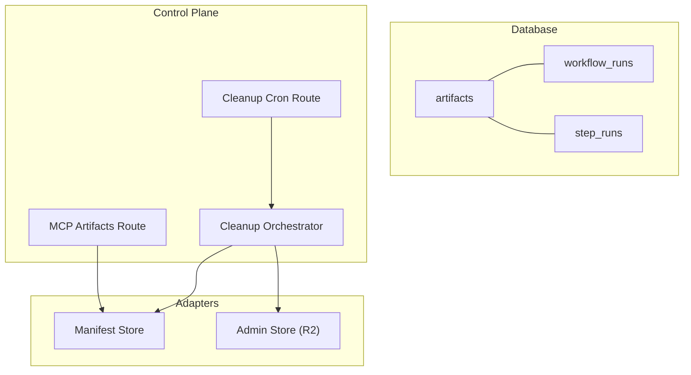
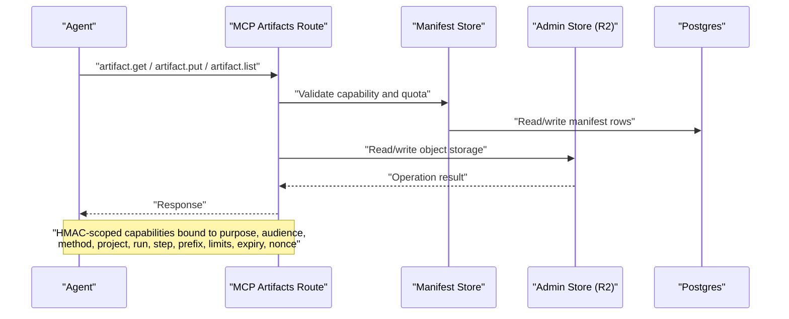
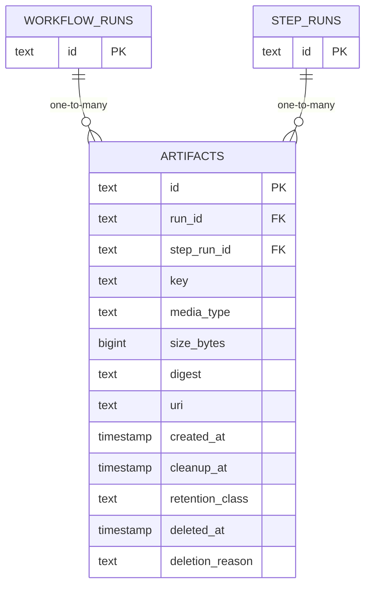
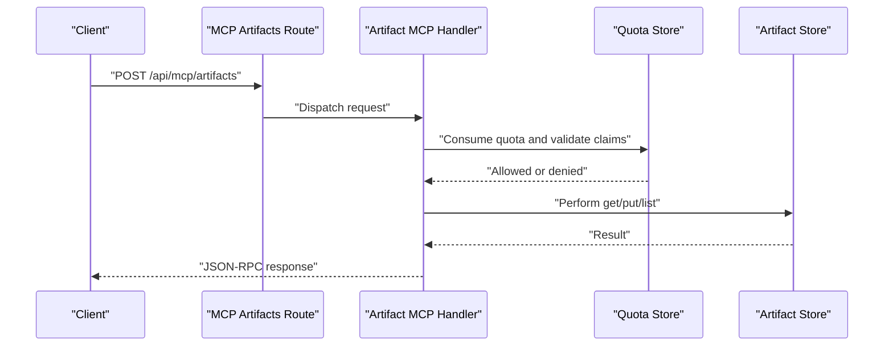
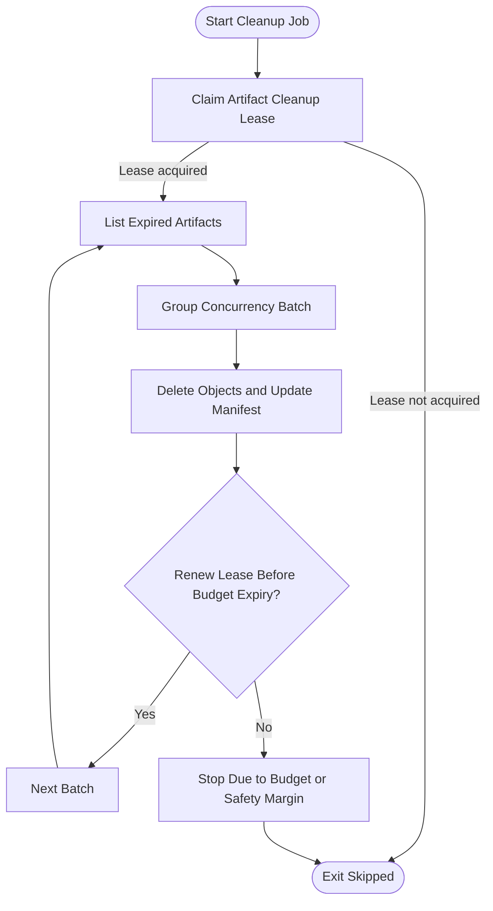
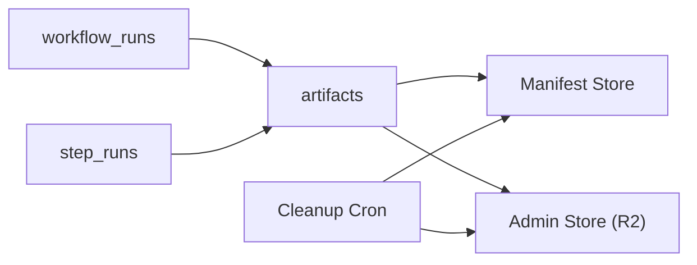

# Artifacts Storage

<cite>
**Referenced Files in This Document**
- [0000_domain_persistence.sql](file://drizzle/0000_domain_persistence.sql)
- [0007_wonderful_gwen_stacy.sql](file://drizzle/0007_wonderful_gwen_stacy.sql)
- [artifact-storage.md](file://docs/architecture/artifact-storage.md)
- [artifact-cleanup.ts](file://apps/control-plane/src/application/artifact-cleanup.ts)
- [artifact-cleanup-runtime.ts](file://apps/control-plane/src/application/artifact-cleanup-runtime.ts)
- [cleanup route.ts](file://apps/control-plane/app/api/internal/artifacts/cleanup/route.ts)
- [mcp artifacts route.ts](file://apps/control-plane/app/api/mcp/artifacts/route.ts)
- [manifest cleanup](file://packages/adapters/src/artifacts/manifest.ts)
- [neon repository listArtifactsDueForCleanup](file://packages/adapters/src/persistence/neon-repository.ts)
- [in-memory repository listArtifactsDueForCleanup](file://packages/adapters/src/persistence/in-memory.ts)
- [schema step_runs](file://packages/adapters/src/persistence/schema.ts)
</cite>

## Table of Contents
1. [Introduction](#introduction)
2. [Project Structure](#project-structure)
3. [Core Components](#core-components)
4. [Architecture Overview](#architecture-overview)
5. [Detailed Component Analysis](#detailed-component-analysis)
6. [Dependency Analysis](#dependency-analysis)
7. [Performance Considerations](#performance-considerations)
8. [Troubleshooting Guide](#troubleshooting-guide)
9. [Conclusion](#conclusion)
10. [Appendices](#appendices)

## Introduction
This document describes the artifact storage data model with a focus on the artifacts table and its lifecycle. It explains how artifacts are identified within workflow contexts, how they relate to workflow runs and step runs, and how retention and cleanup policies operate using timestamps and indexes. It also provides practical examples for retrieving artifacts, managing their lifecycle, and monitoring storage costs.

## Project Structure
Artifact storage spans database schema definitions, application services, and HTTP endpoints:
- Database schema defines the artifacts table, constraints, and indexes.
- Application code implements cleanup scheduling, leasing, and batched deletion.
- HTTP routes expose MCP-based artifact operations and an internal cleanup endpoint.

**Diagram sources**
- [0000_domain_persistence.sql:17-30](file://drizzle/0000_domain_persistence.sql#L17-L30)
- [0000_domain_persistence.sql:189-191](file://drizzle/0000_domain_persistence.sql#L189-L191)
- [artifact-cleanup.ts:35-117](file://apps/control-plane/src/application/artifact-cleanup.ts#L35-L117)
- [artifact-cleanup-runtime.ts:62-76](file://apps/control-plane/src/application/artifact-cleanup-runtime.ts#L62-L76)
- [cleanup route.ts:7-11](file://apps/control-plane/app/api/internal/artifacts/cleanup/route.ts#L7-L11)
- [mcp artifacts route.ts:6-17](file://apps/control-plane/app/api/mcp/artifacts/route.ts#L6-L17)

**Section sources**
- [0000_domain_persistence.sql:17-30](file://drizzle/0000_domain_persistence.sql#L17-L30)
- [artifact-storage.md:1-42](file://docs/architecture/artifact-storage.md#L1-L42)

## Core Components
- Artifacts table: Stores logical artifact metadata including identifiers, content references, sizes, media types, digests, and retention timing.
- Workflow runs and step runs: Parent entities referenced by artifacts via foreign keys to enforce referential integrity.
- Cleanup system: Periodic job that finds expired artifacts and deletes them from object storage while updating manifest records.

Key fields in the artifacts table:
- id: Primary key for the artifact record.
- run_id: Foreign key to workflow_runs; identifies the workflow context.
- step_run_id: Optional foreign key to step_runs; identifies the producing step when applicable.
- key: Logical name used for identification within a run.
- media_type: MIME type describing the artifact content.
- size_bytes: Size in bytes; validated to be non-negative.
- digest: Content hash used for integrity and deduplication.
- uri: External storage reference where the artifact payload is stored.
- created_at: Timestamp when the artifact was recorded.
- cleanup_at: Timestamp after which the artifact may be deleted by retention policies.

Unique constraint:
- (run_id, key) ensures one artifact per logical key within a workflow run.

Foreign keys:
- run_id references workflow_runs(id) with cascade delete.
- step_run_id references step_runs(id) with set null on delete.

Indexes:
- artifacts_cleanup_idx: Filters rows eligible for cleanup by cleanup_at where deleted_at is null.
- artifacts_run_key_scan_idx: Optimizes scans by (run_id, key).

**Section sources**
- [0000_domain_persistence.sql:17-30](file://drizzle/0000_domain_persistence.sql#L17-L30)
- [0000_domain_persistence.sql:189-191](file://drizzle/0000_domain_persistence.sql#L189-L191)
- [0007_wonderful_gwen_stacy.sql:1-6](file://drizzle/0007_wonderful_gwen_stacy.sql#L1-L6)
- [schema step_runs:275-314](file://packages/adapters/src/persistence/schema.ts#L275-L314)

## Architecture Overview
The artifact storage architecture combines a logical manifest in Postgres with physical payloads in object storage. The MCP surface exposes stateless operations for agents, while a cron-driven cleanup process enforces retention policies.

**Diagram sources**
- [artifact-storage.md:1-42](file://docs/architecture/artifact-storage.md#L1-L42)
- [mcp artifacts route.ts:6-17](file://apps/control-plane/app/api/mcp/artifacts/route.ts#L6-L17)

## Detailed Component Analysis

### Artifacts Data Model
The artifacts table models logical artifacts with strong identity guarantees and lifecycle metadata.

**Diagram sources**
- [0000_domain_persistence.sql:17-30](file://drizzle/0000_domain_persistence.sql#L17-L30)
- [0000_domain_persistence.sql:189-191](file://drizzle/0000_domain_persistence.sql#L189-L191)
- [0007_wonderful_gwen_stacy.sql:1-6](file://drizzle/0007_wonderful_gwen_stacy.sql#L1-L6)

Field semantics and constraints:
- id: Unique identifier for the artifact row.
- run_id: Links artifact to a workflow run; cascade delete propagates removal.
- step_run_id: Optional link to the step that produced the artifact; set null if parent is removed.
- key: Logical artifact name scoped by run_id; unique per run.
- media_type: Describes content type; optional.
- size_bytes: Non-negative integer; aids cost estimation and quotas.
- digest: Content hash; immutable identity for versioning and integrity checks.
- uri: Pointer to external storage location; managed by adapters.
- created_at: Record creation time.
- cleanup_at: Scheduled deletion time; used by retention scans.
- retention_class: Classification influencing retention behavior.
- deleted_at: Soft-delete marker for pending or completed deletions.
- deletion_reason: Audit field explaining why an artifact was removed.

Unique constraint:
- (run_id, key) prevents duplicate logical artifacts within a workflow run.

Indexes:
- artifacts_cleanup_idx: Targets cleanup-at queries with deleted_at filter.
- artifacts_run_key_scan_idx: Accelerates lookups by run and key.

**Section sources**
- [0000_domain_persistence.sql:17-30](file://drizzle/0000_domain_persistence.sql#L17-L30)
- [0000_domain_persistence.sql:189-191](file://drizzle/0000_domain_persistence.sql#L189-L191)
- [0007_wonderful_gwen_stacy.sql:1-6](file://drizzle/0007_wonderful_gwen_stacy.sql#L1-L6)

### Artifact Retrieval via MCP
Agents interact through a stateless MCP endpoint that supports artifact.get, artifact.put, and artifact.list. Each call uses a short-lived HMAC capability with strict bounds on method, scope, limits, and expiry.

**Diagram sources**
- [mcp artifacts route.ts:6-17](file://apps/control-plane/app/api/mcp/artifacts/route.ts#L6-L17)
- [artifact-storage.md:1-42](file://docs/architecture/artifact-storage.md#L1-L42)

Operational notes:
- GET is disabled; only POST is supported.
- Capabilities include purpose, audience, methods, project, run, step, prefix, byte limits, call limits, expiry, and nonce.
- Postgres atomically enforces per-capability call counts and cumulative byte ledgers across serverless cold starts.

**Section sources**
- [mcp artifacts route.ts:6-17](file://apps/control-plane/app/api/mcp/artifacts/route.ts#L6-L17)
- [artifact-storage.md:1-42](file://docs/architecture/artifact-storage.md#L1-L42)

### Cleanup Policies and Lifecycle Management
Retention cleanup is orchestrated by a cron-triggered handler that acquires a lease, batches expired artifacts, and deletes them from object storage while recording audit information.

**Diagram sources**
- [artifact-cleanup.ts:35-117](file://apps/control-plane/src/application/artifact-cleanup.ts#L35-L117)
- [manifest cleanup:548-580](file://packages/adapters/src/artifacts/manifest.ts#L548-L580)

Policy highlights:
- Page limit bounded to prevent large scans.
- Lease duration and time budget ensure safe execution windows.
- Safety margin stops work before lease expiration.
- Deletions record reason and timestamp for audit.

Query patterns:
- List artifacts due for cleanup by cleanup_at with filters for deleted_at and retention class.
- Sort by cleanup_at and id for deterministic ordering.

**Section sources**
- [artifact-cleanup.ts:35-117](file://apps/control-plane/src/application/artifact-cleanup.ts#L35-L117)
- [artifact-cleanup-runtime.ts:62-76](file://apps/control-plane/src/application/artifact-cleanup-runtime.ts#L62-L76)
- [cleanup route.ts:7-11](file://apps/control-plane/app/api/internal/artifacts/cleanup/route.ts#L7-L11)
- [manifest cleanup:548-580](file://packages/adapters/src/artifacts/manifest.ts#L548-L580)
- [neon repository listArtifactsDueForCleanup:1216-1242](file://packages/adapters/src/persistence/neon-repository.ts#L1216-L1242)
- [in-memory repository listArtifactsDueForCleanup:1216-1242](file://packages/adapters/src/persistence/in-memory.ts#L1216-L1242)

### Storage Optimization Strategies
- Content-addressed object names derived from digests to avoid duplication.
- Integrity verification recomputes SHA-256 on reads/writes; provider checksums are not used as identity.
- Metadata includes retention class and timestamps to support efficient scanning.
- MCP caps per-artifact and per-request sizes to control bandwidth and processing costs.
- Separate admin credentials for cleanup minimize risk and scope.

**Section sources**
- [artifact-storage.md:1-42](file://docs/architecture/artifact-storage.md#L1-L42)
- [r2 metadataFromResponse:228-268](file://packages/adapters/src/artifacts/r2.ts#L228-L268)

## Dependency Analysis
Artifacts depend on workflow runs and step runs through foreign keys. Cleanup depends on manifest and admin stores, which in turn rely on Postgres and object storage.

**Diagram sources**
- [0000_domain_persistence.sql:189-191](file://drizzle/0000_domain_persistence.sql#L189-L191)
- [artifact-cleanup.ts:35-117](file://apps/control-plane/src/application/artifact-cleanup.ts#L35-L117)

**Section sources**
- [0000_domain_persistence.sql:189-191](file://drizzle/0000_domain_persistence.sql#L189-L191)

## Performance Considerations
- Use the cleanup index to efficiently find expiring artifacts.
- Limit batch sizes and concurrency to respect execution budgets and leases.
- Prefer filtering by cleanup_at and deleted_at to reduce scan overhead.
- Monitor size_bytes to estimate storage growth and plan capacity.
- Enforce MCP size caps to prevent oversized requests and responses.

[No sources needed since this section provides general guidance]

## Troubleshooting Guide
Common issues and resolutions:
- Duplicate artifact key within a run: Ensure unique (run_id, key) usage; conflicts indicate rewrites or collisions.
- Missing parent references: Verify workflow_runs and step_runs exist before creating artifacts; foreign keys enforce integrity.
- Cleanup not running: Confirm cron secret and route configuration; check lease acquisition and time budget settings.
- Integrity errors: Validate digest consistency between manifest and object storage; recompute hashes if mismatches occur.

**Section sources**
- [0000_domain_persistence.sql:17-30](file://drizzle/0000_domain_persistence.sql#L17-L30)
- [artifact-cleanup.ts:35-117](file://apps/control-plane/src/application/artifact-cleanup.ts#L35-L117)
- [artifact-storage.md:1-42](file://docs/architecture/artifact-storage.md#L1-L42)

## Conclusion
The artifacts table provides a robust, indexed, and constrained foundation for storing workflow outputs with clear lifecycle management. Unique scoping by (run_id, key), foreign key relationships to workflow and step runs, and retention policies driven by cleanup_at enable reliable retrieval and cost-aware cleanup. MCP-based access offers secure, bounded interactions for agents, while the cleanup orchestrator ensures timely deletion and auditability.

[No sources needed since this section summarizes without analyzing specific files]

## Appendices

### Example Queries and Operations
- Retrieve artifacts for a run:
  - Query by run_id and order by created_at or cleanup_at.
  - Filter by key for a specific artifact.
- Identify artifacts due for cleanup:
  - Select where cleanup_at <= now and deleted_at is null.
  - Order by cleanup_at and id for deterministic batching.
- Monitor storage costs:
  - Sum size_bytes grouped by run_id or retention_class.
  - Track count and total bytes over time to detect growth trends.

[No sources needed since this section provides general guidance]