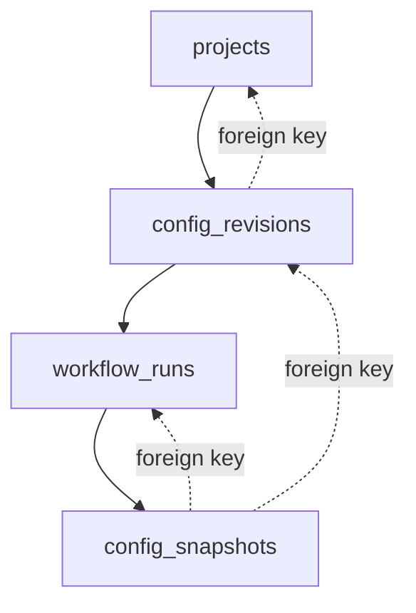
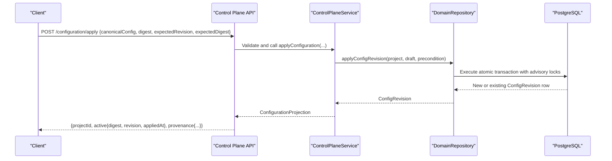
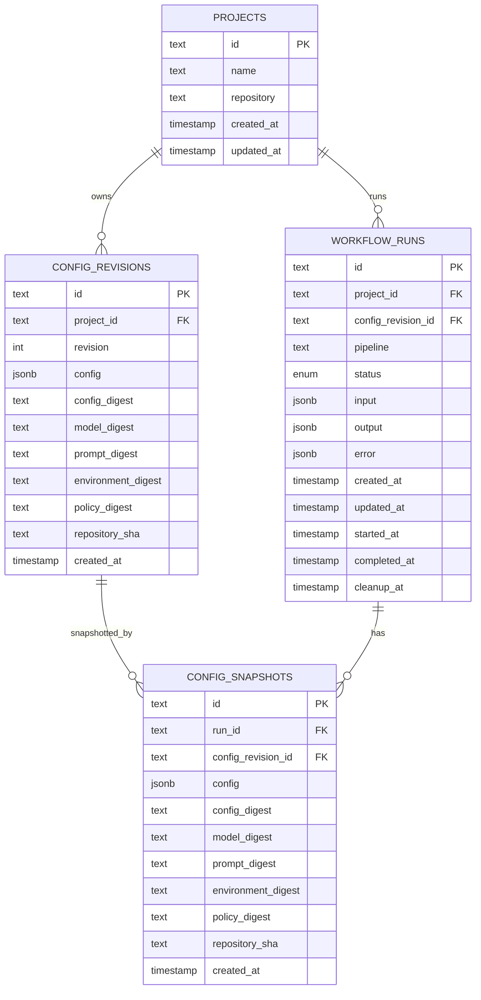
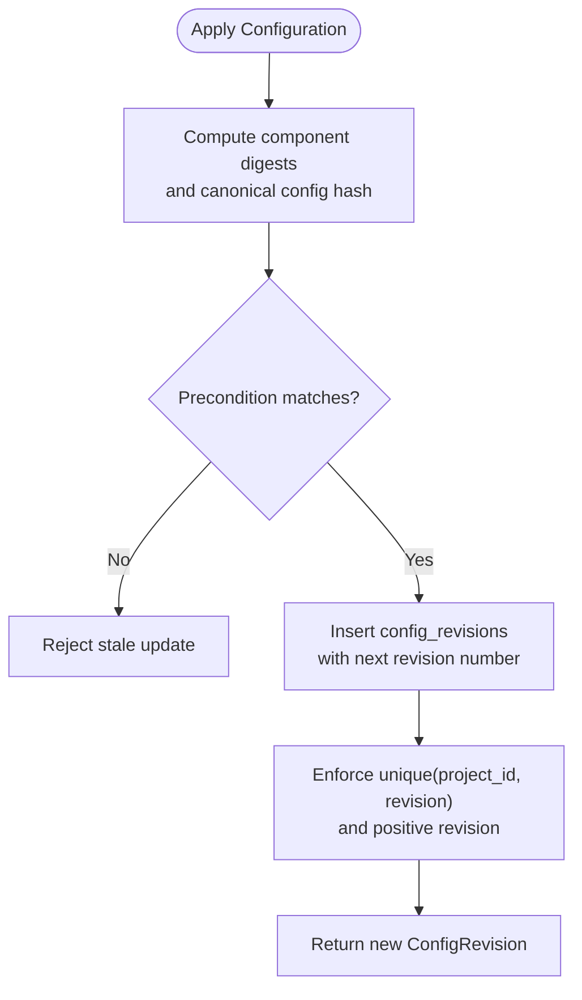
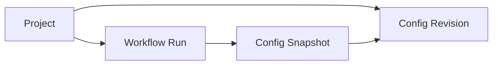
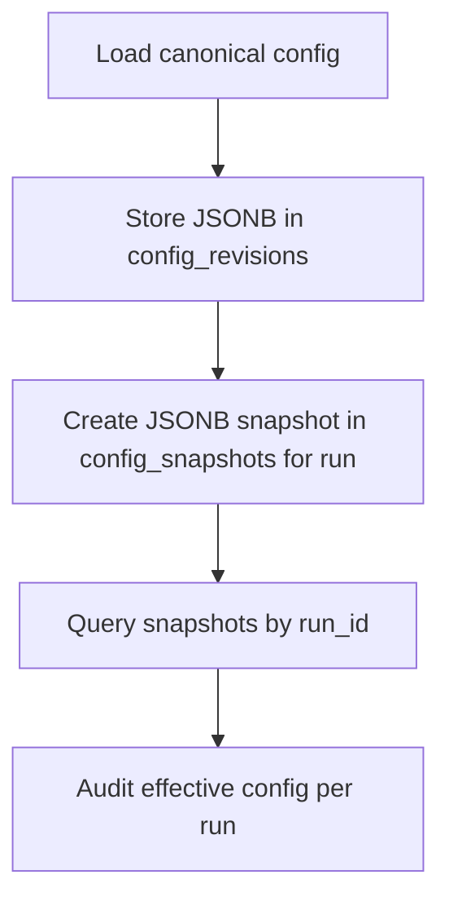
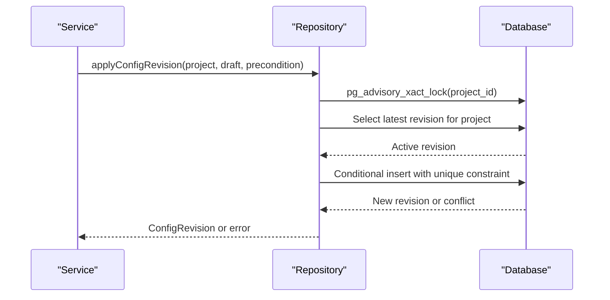
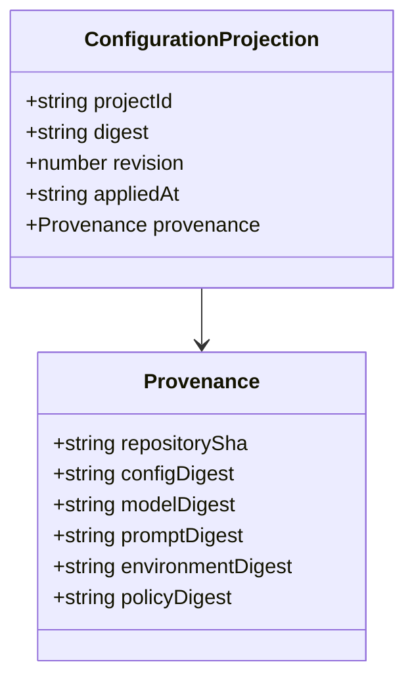
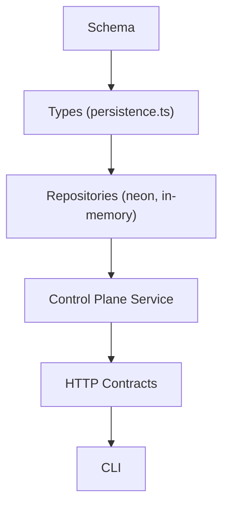

# Configuration Management

<cite>
**Referenced Files in This Document**
- [0000_domain_persistence.sql](file://drizzle/0000_domain_persistence.sql)
- [0002_harden_persistence_parity.sql](file://drizzle/0002_harden_persistence_parity.sql)
- [persistence.ts](file://packages/core/src/persistence.ts)
- [neon-repository.ts](file://packages/adapters/src/persistence/neon-repository.ts)
- [in-memory.ts](file://packages/adapters/src/persistence/in-memory.ts)
- [control-plane-service.ts](file://apps/control-plane/src/application/control-plane-service.ts)
- [contracts.ts](file://apps/control-plane/src/http/contracts.ts)
- [main.ts](file://apps/cli/src/main.ts)
- [2026-08-20-multi-project-configuration.md](file://docs/superpowers/plans/2026-08-20-multi-project-configuration.md)
</cite>

## Table of Contents
1. Introduction
2. Project Structure
3. Core Components
4. Architecture Overview
5. Detailed Component Analysis
6. Dependency Analysis
7. Performance Considerations
8. Troubleshooting Guide
9. Conclusion
10. Appendices

## Introduction
This document describes the configuration management data model centered on config_revisions and config_snapshots. It explains how projects evolve through numbered revisions, how snapshots isolate configuration at workflow run time, and how multiple digests (config, model, prompt, environment, policy) provide fine-grained change tracking. It also covers JSONB storage patterns, migration strategies, rollback procedures, and practical examples for auditing, change tracking, and deployment verification.

## Project Structure
The configuration system spans schema definitions, persistence interfaces, repository implementations, service logic, HTTP contracts, CLI projections, and design plans:
- Schema defines config_revisions and config_snapshots with foreign keys to projects and workflow_runs.
- Persistence types define ConfigRevision, ConfigSnapshot, and related digests.
- Repository implementations persist and query revisions and snapshots.
- Service logic builds configuration projections including provenance digests.
- HTTP contracts validate apply and projection payloads.
- CLI consumes active configuration projections.
- Design plan documents multi-project behavior and revision chains.

**Diagram sources**
- [0000_domain_persistence.sql:32-60](file://drizzle/0000_domain_persistence.sql#L32-L60)
- [0000_domain_persistence.sql:173-187](file://drizzle/0000_domain_persistence.sql#L173-L187)
- [0000_domain_persistence.sql:192-194](file://drizzle/0000_domain_persistence.sql#L192-L194)
- [0000_domain_persistence.sql:206-207](file://drizzle/0000_domain_persistence.sql#L206-L207)

**Section sources**
- [0000_domain_persistence.sql:32-60](file://drizzle/0000_domain_persistence.sql#L32-L60)
- [0000_domain_persistence.sql:173-187](file://drizzle/0000_domain_persistence.sql#L173-L187)
- [0000_domain_persistence.sql:192-194](file://drizzle/0000_domain_persistence.sql#L192-L194)
- [0000_domain_persistence.sql:206-207](file://drizzle/0000_domain_persistence.sql#L206-L207)

## Core Components
- ConfigRevision: Represents a versioned configuration for a project with a monotonically increasing revision number and multiple component digests.
- ConfigSnapshot: Captures the exact configuration state used by a specific workflow run, enabling isolation and auditability.
- Projects: The top-level entity that owns configuration revisions.
- WorkflowRuns: Optionally reference a config_revision; snapshots tie runs to their effective configuration.

Key fields:
- project_id: Links revisions to projects.
- revision: Positive integer per project, unique per project.
- config: JSONB payload of the canonical configuration.
- Digests: config_digest, model_digest, prompt_digest, environment_digest, policy_digest.
- repository_sha: Immutable source-of-truth commit identifier.
- created_at: Timestamp for ordering and history.

Indexes and constraints:
- Unique(project_id, revision) ensures linear revision chains per project.
- Check(revision > 0) enforces positive numbering.
- Foreign keys enforce referential integrity between projects, workflow_runs, config_revisions, and config_snapshots.

**Section sources**
- [0000_domain_persistence.sql:32-60](file://drizzle/0000_domain_persistence.sql#L32-L60)
- [0000_domain_persistence.sql:121-127](file://drizzle/0000_domain_persistence.sql#L121-L127)
- [0000_domain_persistence.sql:173-187](file://drizzle/0000_domain_persistence.sql#L173-L187)
- [0000_domain_persistence.sql:192-194](file://drizzle/0000_domain_persistence.sql#L192-L194)
- [0000_domain_persistence.sql:206-207](file://drizzle/0000_domain_persistence.sql#L206-L207)
- [persistence.ts:138-176](file://packages/core/src/persistence.ts#L138-L176)

## Architecture Overview
Configuration changes flow from clients into the control plane, which applies them as new revisions and optionally creates snapshots bound to workflow runs. Projections expose the active configuration along with provenance digests.

**Diagram sources**
- [contracts.ts:56-82](file://apps/control-plane/src/http/contracts.ts#L56-L82)
- [control-plane-service.ts:187-212](file://apps/control-plane/src/application/control-plane-service.ts#L187-L212)
- [neon-repository.ts:402-514](file://packages/adapters/src/persistence/neon-repository.ts#L402-L514)

**Section sources**
- [contracts.ts:56-82](file://apps/control-plane/src/http/contracts.ts#L56-L82)
- [control-plane-service.ts:187-212](file://apps/control-plane/src/application/control-plane-service.ts#L187-L212)
- [neon-repository.ts:402-514](file://packages/adapters/src/persistence/neon-repository.ts#L402-L514)

## Detailed Component Analysis

### Data Model: config_revisions and config_snapshots
- config_revisions stores each versioned configuration per project with a unique revision number and comprehensive digests.
- config_snapshots store an immutable snapshot of configuration tied to a workflow run and its referenced config revision.

**Diagram sources**
- [0000_domain_persistence.sql:32-60](file://drizzle/0000_domain_persistence.sql#L32-L60)
- [0000_domain_persistence.sql:121-127](file://drizzle/0000_domain_persistence.sql#L121-L127)
- [0000_domain_persistence.sql:173-187](file://drizzle/0000_domain_persistence.sql#L173-L187)
- [0000_domain_persistence.sql:192-194](file://drizzle/0000_domain_persistence.sql#L192-L194)
- [0000_domain_persistence.sql:206-207](file://drizzle/0000_domain_persistence.sql#L206-L207)

**Section sources**
- [0000_domain_persistence.sql:32-60](file://drizzle/0000_domain_persistence.sql#L32-L60)
- [0000_domain_persistence.sql:121-127](file://drizzle/0000_domain_persistence.sql#L121-L127)
- [0000_domain_persistence.sql:173-187](file://drizzle/0000_domain_persistence.sql#L173-L187)
- [0000_domain_persistence.sql:192-194](file://drizzle/0000_domain_persistence.sql#L192-L194)
- [0000_domain_persistence.sql:206-207](file://drizzle/0000_domain_persistence.sql#L206-L207)

### Versioning System: project_id, revision numbers, and digests
- Each project maintains a strictly increasing revision chain enforced by a unique constraint on (project_id, revision).
- Revisions include multiple digests to track independent components:
  - config_digest: Hash of the canonical configuration.
  - model_digest: Hash of model-related settings.
  - prompt_digest: Hash of prompts used by agents.
  - environment_digest: Hash of runtime/environment settings.
  - policy_digest: Hash of policies governing execution.
- repository_sha anchors the revision to a specific source commit.

**Diagram sources**
- [0000_domain_persistence.sql:32-46](file://drizzle/0000_domain_persistence.sql#L32-L46)
- [persistence.ts:146-168](file://packages/core/src/persistence.ts#L146-L168)

**Section sources**
- [0000_domain_persistence.sql:32-46](file://drizzle/0000_domain_persistence.sql#L32-L46)
- [persistence.ts:146-168](file://packages/core/src/persistence.ts#L146-L168)

### Relationship Between Projects, Config Revisions, and Workflow Runs
- Projects own config_revisions via foreign key.
- Workflow runs may reference a config_revision_id to indicate which configuration they executed against.
- config_snapshots bind a workflow run to a specific config revision and capture the effective configuration at run time.

**Diagram sources**
- [0000_domain_persistence.sql:192-194](file://drizzle/0000_domain_persistence.sql#L192-L194)
- [0000_domain_persistence.sql:206-207](file://drizzle/0000_domain_persistence.sql#L206-L207)

**Section sources**
- [0000_domain_persistence.sql:192-194](file://drizzle/0000_domain_persistence.sql#L192-L194)
- [0000_domain_persistence.sql:206-207](file://drizzle/0000_domain_persistence.sql#L206-L207)

### JSONB Storage Patterns and Snapshot Isolation
- Both config_revisions.config and config_snapshots.config store JSONB payloads for flexible configuration structures.
- Snapshots provide isolation: each workflow run’s effective configuration is captured immutably, enabling precise auditing and reproducibility.
- Repository implementations serialize JSONB values when inserting and map rows back to typed objects.

**Diagram sources**
- [0000_domain_persistence.sql:32-60](file://drizzle/0000_domain_persistence.sql#L32-L60)
- [neon-repository.ts:388-400](file://packages/adapters/src/persistence/neon-repository.ts#L388-L400)
- [neon-repository.ts:565-576](file://packages/adapters/src/persistence/neon-repository.ts#L565-L576)

**Section sources**
- [0000_domain_persistence.sql:32-60](file://drizzle/0000_domain_persistence.sql#L32-L60)
- [neon-repository.ts:388-400](file://packages/adapters/src/persistence/neon-repository.ts#L388-L400)
- [neon-repository.ts:565-576](file://packages/adapters/src/persistence/neon-repository.ts#L565-L576)

### Apply Workflow and Concurrency Control
- Applying a configuration revision uses advisory locks to serialize concurrent updates per project and idempotency checks to prevent duplicate writes.
- Precondition validation ensures expected revision and digest match the current active revision before applying.

**Diagram sources**
- [neon-repository.ts:402-514](file://packages/adapters/src/persistence/neon-repository.ts#L402-L514)

**Section sources**
- [neon-repository.ts:402-514](file://packages/adapters/src/persistence/neon-repository.ts#L402-L514)

### Configuration Projections and Provenance
- Projections expose the active configuration with digest and provenance information, including repository_sha and all component digests.
- CLI validates received projections to ensure safe consumption.

**Diagram sources**
- [control-plane-service.ts:187-212](file://apps/control-plane/src/application/control-plane-service.ts#L187-L212)
- [contracts.ts:83-101](file://apps/control-plane/src/http/contracts.ts#L83-L101)

**Section sources**
- [control-plane-service.ts:187-212](file://apps/control-plane/src/application/control-plane-service.ts#L187-L212)
- [contracts.ts:83-101](file://apps/control-plane/src/http/contracts.ts#L83-L101)
- [main.ts:139-184](file://apps/cli/src/main.ts#L139-L184)

### Multi-Project Behavior and Revision Chains
- Multiple projects can exist independently, each with its own revision chain.
- Legacy singleton project reuse occurs when bindings match; otherwise, new projects are created.
- Get configuration supports selectors by project ID or repository binding.

**Section sources**
- [2026-08-20-multi-project-configuration.md:190-384](file://docs/superpowers/plans/2026-08-20-multi-project-configuration.md#L190-L384)

## Dependency Analysis
- Schema dependencies:
  - config_revisions depends on projects via foreign key.
  - workflow_runs depends on projects and optionally config_revisions.
  - config_snapshots depends on workflow_runs and config_revisions.
- Application dependencies:
  - Control plane service constructs projections using persisted revisions and digests.
  - HTTP contracts validate inputs and outputs for configuration operations.
  - CLI consumes projections and validates structure.

**Diagram sources**
- [0000_domain_persistence.sql:32-60](file://drizzle/0000_domain_persistence.sql#L32-L60)
- [persistence.ts:138-176](file://packages/core/src/persistence.ts#L138-L176)
- [neon-repository.ts:388-514](file://packages/adapters/src/persistence/neon-repository.ts#L388-L514)
- [control-plane-service.ts:187-212](file://apps/control-plane/src/application/control-plane-service.ts#L187-L212)
- [contracts.ts:56-101](file://apps/control-plane/src/http/contracts.ts#L56-L101)
- [main.ts:139-184](file://apps/cli/src/main.ts#L139-L184)

**Section sources**
- [0000_domain_persistence.sql:32-60](file://drizzle/0000_domain_persistence.sql#L32-L60)
- [persistence.ts:138-176](file://packages/core/src/persistence.ts#L138-L176)
- [neon-repository.ts:388-514](file://packages/adapters/src/persistence/neon-repository.ts#L388-L514)
- [control-plane-service.ts:187-212](file://apps/control-plane/src/application/control-plane-service.ts#L187-L212)
- [contracts.ts:56-101](file://apps/control-plane/src/http/contracts.ts#L56-L101)
- [main.ts:139-184](file://apps/cli/src/main.ts#L139-L184)

## Performance Considerations
- Use indexes for efficient listing and filtering:
  - config_revisions_project_created_idx supports queries by project and creation time.
  - config_snapshots_run_created_idx supports queries by run and creation time.
- Advisory locks reduce contention during concurrent apply operations.
- JSONB storage enables flexible schemas but should be kept within size limits validated by HTTP contracts.
- Pagination uses bounded list limits and cursors to avoid large result sets.

**Section sources**
- [0002_harden_persistence_parity.sql:8-9](file://drizzle/0002_harden_persistence_parity.sql#L8-L9)
- [neon-repository.ts:402-514](file://packages/adapters/src/persistence/neon-repository.ts#L402-L514)
- [contracts.ts:56-82](file://apps/control-plane/src/http/contracts.ts#L56-L82)

## Troubleshooting Guide
Common issues and resolutions:
- Stale configuration errors occur when expected revision or digest does not match the active revision.
  - Resolution: Refresh the active configuration and retry with correct preconditions.
- Serialization conflicts due to concurrent apply attempts.
  - Resolution: Retry after brief delay; the implementation includes retry loops and advisory locking.
- Invalid configuration projections returned by server.
  - Resolution: Validate client-side response shape and ensure compatibility with CLI expectations.

**Section sources**
- [neon-repository.ts:490-514](file://packages/adapters/src/persistence/neon-repository.ts#L490-L514)
- [in-memory.ts:332-363](file://packages/adapters/src/persistence/in-memory.ts#L332-L363)
- [main.ts:139-184](file://apps/cli/src/main.ts#L139-L184)

## Conclusion
The configuration management system provides robust versioning through config_revisions and isolated snapshots via config_snapshots. Multiple digests enable precise change tracking across configuration components, while foreign keys and indexes ensure integrity and performance. The apply workflow uses concurrency controls and preconditions to maintain consistency. Projections and CLI integrations support auditing and verification, and multi-project capabilities allow independent revision chains.

## Appendices

### Migration Strategies for Configuration Changes
- Add new columns or constraints via migrations; ensure backward compatibility where possible.
- Use conditional updates and safe defaults to avoid breaking existing workflows.
- Validate bigint bounds and add collation-aware indexes for consistent ordering.

**Section sources**
- [0002_harden_persistence_parity.sql:1-22](file://drizzle/0002_harden_persistence_parity.sql#L1-L22)

### Rollback Procedures
- To roll back a configuration:
  - Identify the target revision by project_id and revision number.
  - Use the active configuration endpoint to obtain the desired revision’s digest and provenance.
  - Apply the configuration with explicit preconditions to ensure idempotent re-application.
  - For workflow runs, create new runs referencing the desired config_revision_id if needed.

**Section sources**
- [0000_domain_persistence.sql:32-60](file://drizzle/0000_domain_persistence.sql#L32-L60)
- [control-plane-service.ts:187-212](file://apps/control-plane/src/application/control-plane-service.ts#L187-L212)
- [contracts.ts:56-82](file://apps/control-plane/src/http/contracts.ts#L56-L82)

### Examples: Auditing, Change Tracking, Deployment Verification
- Auditing:
  - List config_revisions by project_id and order by revision to view history.
  - Inspect snapshots by run_id to see the exact configuration used during execution.
- Change tracking:
  - Compare digests across revisions to identify changes in config, models, prompts, environments, or policies.
- Deployment verification:
  - Verify that the active configuration digest matches the expected digest before deploying.
  - Confirm repository_sha aligns with the intended source commit.

**Section sources**
- [neon-repository.ts:516-563](file://packages/adapters/src/persistence/neon-repository.ts#L516-L563)
- [neon-repository.ts:565-614](file://packages/adapters/src/persistence/neon-repository.ts#L565-L614)
- [control-plane-service.ts:187-212](file://apps/control-plane/src/application/control-plane-service.ts#L187-L212)
- [contracts.ts:83-101](file://apps/control-plane/src/http/contracts.ts#L83-L101)