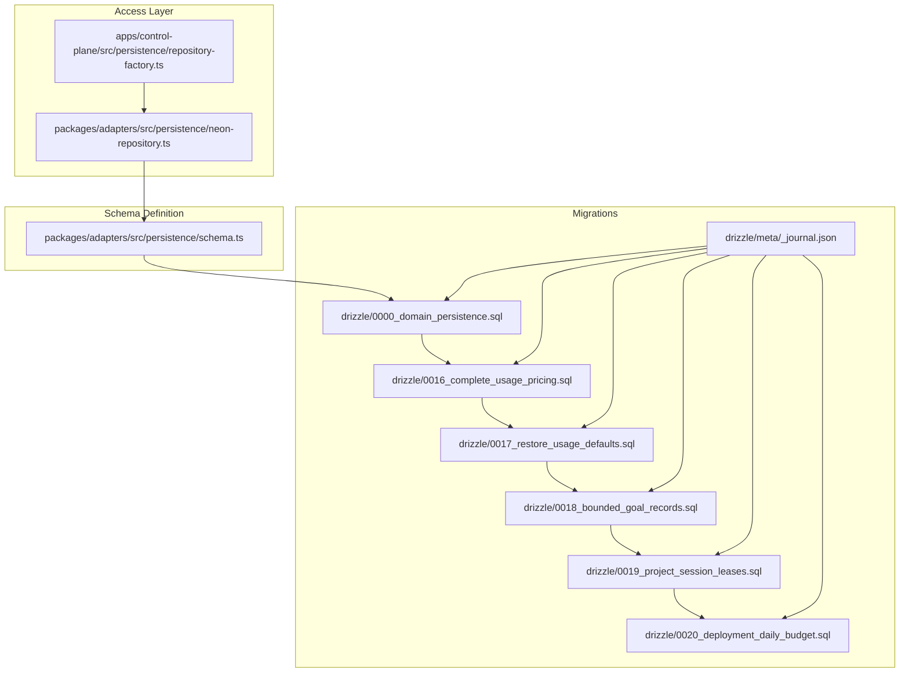
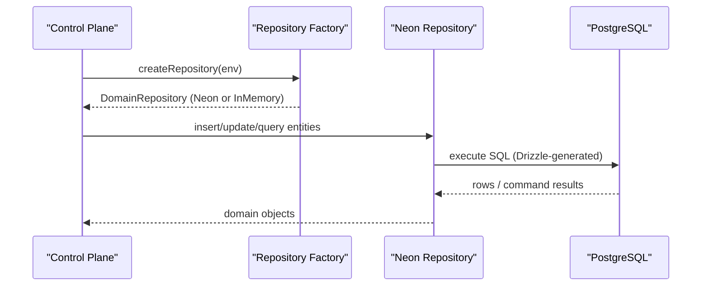
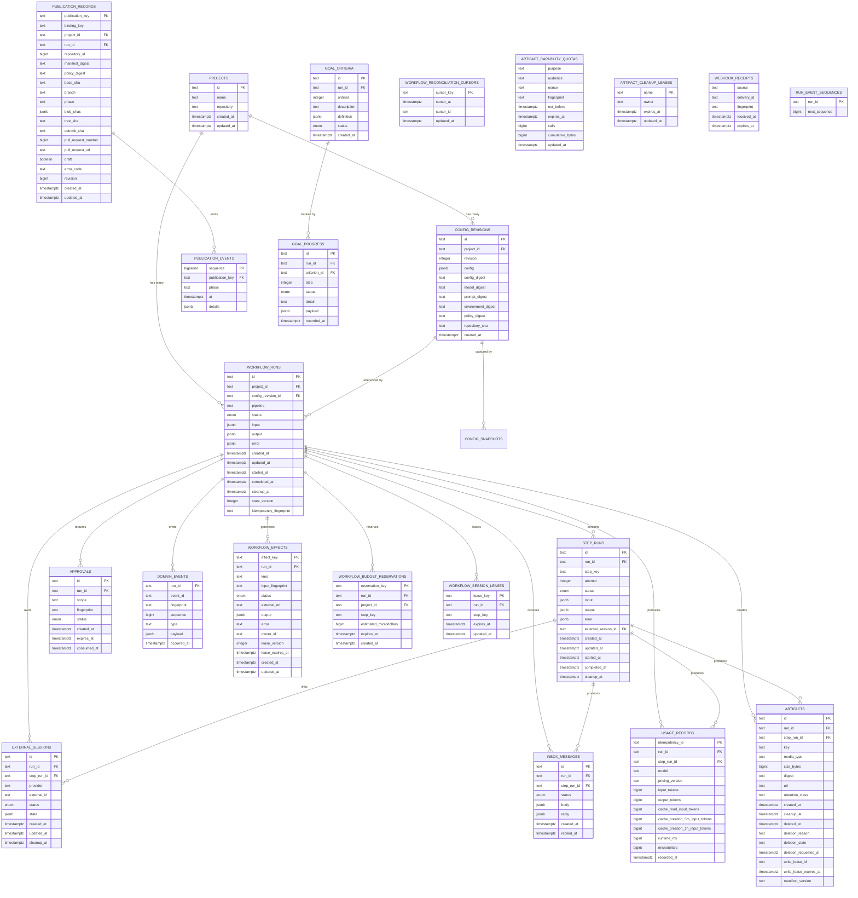
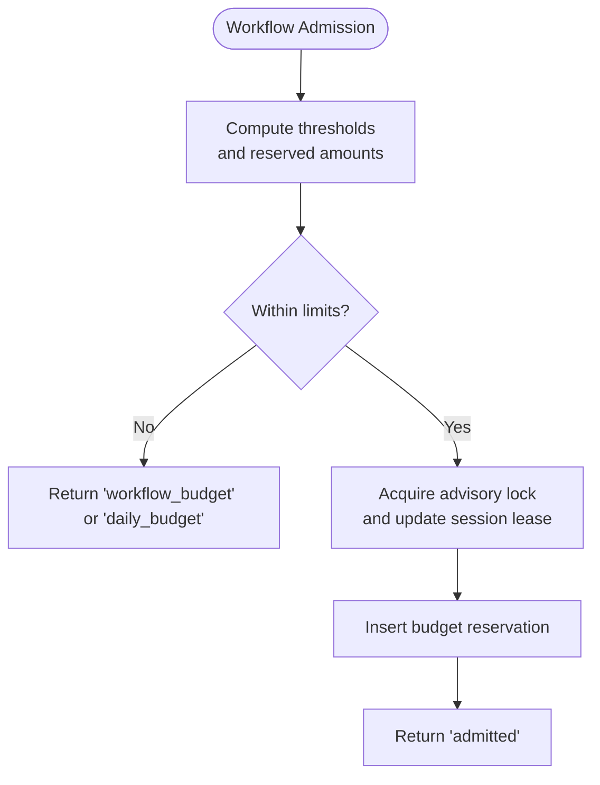

# Data Models

<cite>
**Referenced Files in This Document**
- [schema.ts](file://packages/adapters/src/persistence/schema.ts)
- [0000_domain_persistence.sql](file://drizzle/0000_domain_persistence.sql)
- [_journal.json](file://drizzle/meta/_journal.json)
- [0016_complete_usage_pricing.sql](file://drizzle/0016_complete_usage_pricing.sql)
- [0017_restore_usage_defaults.sql](file://drizzle/0017_restore_usage_defaults.sql)
- [0018_bounded_goal_records.sql](file://drizzle/0018_bounded_goal_records.sql)
- [0019_project_session_leases.sql](file://drizzle/0019_project_session_leases.sql)
- [0020_deployment_daily_budget.sql](file://drizzle/0020_deployment_daily_budget.sql)
- [repository-factory.ts](file://apps/control-plane/src/persistence/repository-factory.ts)
- [neon-repository.ts](file://packages/adapters/src/persistence/neon-repository.ts)
- [artifact-cleanup.ts](file://apps/control-plane/src/application/artifact-cleanup.ts)
</cite>

## Table of Contents
1. [Introduction](#introduction)
2. [Project Structure](#project-structure)
3. [Core Components](#core-components)
4. [Architecture Overview](#architecture-overview)
5. [Detailed Component Analysis](#detailed-component-analysis)
6. [Dependency Analysis](#dependency-analysis)
7. [Performance Considerations](#performance-considerations)
8. [Troubleshooting Guide](#troubleshooting-guide)
9. [Conclusion](#conclusion)
10. [Appendices](#appendices)

## Introduction
This document describes the data models for Agent OS Passerine, focusing on the PostgreSQL schema defined via Drizzle ORM and migrations. It covers entity relationships, field definitions, types, constraints, indexes, validation rules enforced at the database level, and how schema changes evolve through Drizzle migrations. It also outlines data access patterns, caching strategies, performance considerations, retention and archival policies, and backup guidance grounded in the repository’s implementation.

## Project Structure
The data model is defined in a single schema module and materialized as SQL migrations under drizzle/. The application uses a repository abstraction to interact with the database, with Neon as the production target and an in-memory store for tests.

**Diagram sources**
- [schema.ts:1-799](file://packages/adapters/src/persistence/schema.ts#L1-L799)
- [0000_domain_persistence.sql:1-216](file://drizzle/0000_domain_persistence.sql#L1-L216)
- [_journal.json:1-154](file://drizzle/meta/_journal.json#L1-L154)
- [0016_complete_usage_pricing.sql:1-10](file://drizzle/0016_complete_usage_pricing.sql#L1-L10)
- [0017_restore_usage_defaults.sql:1-4](file://drizzle/0017_restore_usage_defaults.sql#L1-L4)
- [0018_bounded_goal_records.sql:1-13](file://drizzle/0018_bounded_goal_records.sql#L1-L13)
- [0019_project_session_leases.sql:1-140](file://drizzle/0019_project_session_leases.sql#L1-L140)
- [0020_deployment_daily_budget.sql:1-92](file://drizzle/0020_deployment_daily_budget.sql#L1-L92)
- [repository-factory.ts:1-44](file://apps/control-plane/src/persistence/repository-factory.ts#L1-L44)
- [neon-repository.ts:1824-1842](file://packages/adapters/src/persistence/neon-repository.ts#L1824-L1842)

**Section sources**
- [schema.ts:1-799](file://packages/adapters/src/persistence/schema.ts#L1-L799)
- [_journal.json:1-154](file://drizzle/meta/_journal.json#L1-L154)

## Core Components
The schema centers around workflow execution, configuration, artifacts, goals, usage accounting, and operational leases. Key entities include:

- Projects: top-level tenants for runs and configurations.
- Config revisions and snapshots: immutable configuration versions and per-run captures.
- Workflow runs and effects: durable orchestration state, inputs/outputs/errors, lifecycle timestamps, cleanup scheduling, and idempotency fingerprints.
- Step runs: atomic steps within runs, with attempt tracking and optional external session linkage.
- External sessions: provider-managed sessions tied to runs/steps with status and state.
- Approvals: gatekeeping approvals scoped by run and fingerprint.
- Inbox messages: asynchronous messages linked to runs/steps with reply support.
- Domain events and sequences: append-only event log per run with sequence guarantees.
- Artifacts: file-like outputs with keys, digests, sizes, URIs, retention classes, and deletion lifecycle fields.
- Usage records: token and runtime accounting with pricing versioning and cache token breakdowns.
- Publication records and events: Git-based publication pipeline state and audit trail.
- Operational tables: reconciliation cursors, budget reservations, session leases, capability quotas, artifact cleanup leases, webhook receipts.

Primary keys, foreign keys, unique constraints, and check constraints enforce integrity across these entities. Timestamps are stored as timestamp with time zone and normalized to ISO strings in the ORM layer.

**Section sources**
- [schema.ts:79-799](file://packages/adapters/src/persistence/schema.ts#L79-L799)
- [0000_domain_persistence.sql:1-216](file://drizzle/0000_domain_persistence.sql#L1-L216)

## Architecture Overview
Data flows from application code through a repository abstraction into PostgreSQL. The repository factory selects Neon for production and an in-memory store for tests. Drizzle generates typed queries against the schema. Migrations define the evolving schema and include functions for admission control and settlement.

**Diagram sources**
- [repository-factory.ts:9-28](file://apps/control-plane/src/persistence/repository-factory.ts#L9-L28)
- [neon-repository.ts:1824-1842](file://packages/adapters/src/persistence/neon-repository.ts#L1824-L1842)
- [schema.ts:1-799](file://packages/adapters/src/persistence/schema.ts#L1-L799)

## Detailed Component Analysis

### Entities and Relationships

**Diagram sources**
- [schema.ts:79-799](file://packages/adapters/src/persistence/schema.ts#L79-L799)
- [0000_domain_persistence.sql:1-216](file://drizzle/0000_domain_persistence.sql#L1-L216)

### Schema Evolution Through Drizzle Migrations
- 0000_domain_persistence.sql: initial schema with core tables, enums, foreign keys, and indexes.
- 0016_complete_usage_pricing.sql: adds pricing version and cache token columns to usage_records with non-negative checks.
- 0017_restore_usage_defaults.sql: restores defaults for pricing_version and cache token columns.
- 0018_bounded_goal_records.sql: migrates goal-related tables to bounded steps and adds definition column; resets legacy goal runs.
- 0019_project_session_leases.sql: scopes session leases per project and introduces admission/settlement functions for concurrency and budget enforcement.
- 0020_deployment_daily_budget.sql: extends admission function to support deployment-wide daily spend caps.

The journal tracks migration order and tags, ensuring deterministic evolution.

**Section sources**
- [0000_domain_persistence.sql:1-216](file://drizzle/0000_domain_persistence.sql#L1-L216)
- [0016_complete_usage_pricing.sql:1-10](file://drizzle/0016_complete_usage_pricing.sql#L1-L10)
- [0017_restore_usage_defaults.sql:1-4](file://drizzle/0017_restore_usage_defaults.sql#L1-L4)
- [0018_bounded_goal_records.sql:1-13](file://drizzle/0018_bounded_goal_records.sql#L1-L13)
- [0019_project_session_leases.sql:1-140](file://drizzle/0019_project_session_leases.sql#L1-L140)
- [0020_deployment_daily_budget.sql:1-92](file://drizzle/0020_deployment_daily_budget.sql#L1-L92)
- [_journal.json:1-154](file://drizzle/meta/_journal.json#L1-L154)

### Data Validation Rules and Business Constraints
- Enum constraints: run_status, external_session_status, approval_status, inbox_status, goal_status, workflow_effect_status restrict allowed states.
- Positive and safe integer checks: ensure numeric fields like attempts, sequences, tokens, runtime, costs fit within safe integer bounds and are non-negative where required.
- Unique constraints: prevent duplicate keys such as step_runs per attempt, goal_criteria per ordinal, artifacts per run+key, usage_records idempotency, publication records binding key.
- Foreign keys: cascade or set null semantics maintain referential integrity across runs, steps, sessions, and publications.
- Check constraints: validate ranges and formats (e.g., publication phases, git SHAs, branch naming).
- Idempotency: idempotency_id primary keys and fingerprints protect against duplicate processing.

These constraints are enforced at the database level, providing strong guarantees beyond application logic.

**Section sources**
- [schema.ts:46-799](file://packages/adapters/src/persistence/schema.ts#L46-L799)
- [0000_domain_persistence.sql:1-216](file://drizzle/0000_domain_persistence.sql#L1-L216)

### Data Access Patterns and Caching Strategies
- Repository abstraction: the control plane constructs a Neon repository in production and an in-memory repository in tests, isolating persistence concerns.
- Drizzle ORM: typed queries generated from schema ensure type safety and consistent access patterns.
- Lease-based coordination: artifact cleanup and session leases use durable locks to coordinate concurrent workers and avoid race conditions.
- Budget admission: server-side functions compute thresholds and reserve budgets atomically, preventing overcommitment.

**Diagram sources**
- [0019_project_session_leases.sql:18-98](file://drizzle/0019_project_session_leases.sql#L18-L98)
- [0020_deployment_daily_budget.sql:4-90](file://drizzle/0020_deployment_daily_budget.sql#L4-L90)

**Section sources**
- [repository-factory.ts:9-28](file://apps/control-plane/src/persistence/repository-factory.ts#L9-L28)
- [neon-repository.ts:1824-1842](file://packages/adapters/src/persistence/neon-repository.ts#L1824-L1842)
- [artifact-cleanup.ts:35-66](file://apps/control-plane/src/application/artifact-cleanup.ts#L35-L66)
- [0019_project_session_leases.sql:18-98](file://drizzle/0019_project_session_leases.sql#L18-L98)
- [0020_deployment_daily_budget.sql:4-90](file://drizzle/0020_deployment_daily_budget.sql#L4-L90)

### Retention Policies, Archival Rules, and Cleanup
- Artifact retention: artifacts carry retention_class, cleanup_at, deletion lifecycle fields, and a dedicated cleanup index targeting eligible rows. A cleanup job claims a lease, inspects expired artifacts, and deletes them safely.
- Run and step cleanup: workflow_runs and step_runs include cleanup_at timestamps and filtered indexes to schedule background cleanup.
- External sessions and inbox messages: similar cleanup_at fields and indexes enable periodic purging.
- Webhook receipts: expiry-based indexes support timely removal of stale receipts.

Cleanup processes rely on durable leases to ensure only one worker processes a batch at a time, avoiding duplication.

**Section sources**
- [schema.ts:463-511](file://packages/adapters/src/persistence/schema.ts#L463-L511)
- [schema.ts:134-180](file://packages/adapters/src/persistence/schema.ts#L134-L180)
- [schema.ts:275-314](file://packages/adapters/src/persistence/schema.ts#L275-L314)
- [schema.ts:316-354](file://packages/adapters/src/persistence/schema.ts#L316-L354)
- [schema.ts:385-417](file://packages/adapters/src/persistence/schema.ts#L385-L417)
- [schema.ts:644-658](file://packages/adapters/src/persistence/schema.ts#L644-L658)
- [artifact-cleanup.ts:35-66](file://apps/control-plane/src/application/artifact-cleanup.ts#L35-L66)

### Backup and Recovery Guidance
- Use PostgreSQL-native backups (logical or physical) aligned with your deployment strategy. Ensure consistent snapshots during peak workloads to minimize impact.
- For event-sourced components (domain_events, publication_events), consider point-in-time recovery to reconstruct state if needed.
- Validate restore integrity using checksums and schema version checks derived from the Drizzle journal and latest migration tag.

[No sources needed since this section provides general guidance]

## Dependency Analysis
The repository factory depends on environment variables to select the persistence backend. The Neon repository wraps Drizzle with custom timestamp parsers and connects to the configured database URL. Migrations depend on the schema definition and each other via the journal ordering.

**Diagram sources**
- [repository-factory.ts:9-28](file://apps/control-plane/src/persistence/repository-factory.ts#L9-L28)
- [neon-repository.ts:1824-1842](file://packages/adapters/src/persistence/neon-repository.ts#L1824-L1842)
- [schema.ts:1-799](file://packages/adapters/src/persistence/schema.ts#L1-L799)
- [_journal.json:1-154](file://drizzle/meta/_journal.json#L1-L154)

**Section sources**
- [repository-factory.ts:9-28](file://apps/control-plane/src/persistence/repository-factory.ts#L9-L28)
- [neon-repository.ts:1824-1842](file://packages/adapters/src/persistence/neon-repository.ts#L1824-L1842)
- [_journal.json:1-154](file://drizzle/meta/_journal.json#L1-L154)

## Performance Considerations
- Indexes: targeted indexes on cleanup_at, status, created_at, and composite keys optimize common queries (cleanup jobs, listing runs, pending inbox messages).
- Collation: byte-wise collation on certain columns ensures stable ordering for IDs and keys.
- JSONB: flexible payloads reduce schema churn but should be queried judiciously to avoid full table scans.
- Constraints: check constraints and unique indexes prevent invalid writes early, reducing application-level validation overhead.
- Functions: admission and settlement functions centralize budget logic and reduce contention by using advisory locks and row-level locking.

[No sources needed since this section provides general guidance]

## Troubleshooting Guide
- Missing parent foreign keys: tests assert that repositories reject inserts referencing missing parents, indicating strict referential integrity.
- Duplicate key violations: unique constraints on idempotency keys and ordinals surface conflicts; handle retries or idempotent updates accordingly.
- Stale leases: session leases and cleanup leases expire; reconcile or retry operations when encountering concurrency errors.
- Budget denials: admission functions return specific reasons (workflow_budget, daily_budget, concurrency); adjust estimates or limits based on feedback.

**Section sources**
- [repository-parity-contract.ts:58-80](file://packages/adapters/src/persistence/repository-parity-contract.ts#L58-L80)
- [neon-repository.test.ts:121-142](file://packages/adapters/src/persistence/neon-repository.test.ts#L121-L142)
- [0019_project_session_leases.sql:18-98](file://drizzle/0019_project_session_leases.sql#L18-L98)
- [0020_deployment_daily_budget.sql:4-90](file://drizzle/0020_deployment_daily_budget.sql#L4-L90)

## Conclusion
Agent OS Passerine’s data model is robustly defined with clear entities, strong constraints, and carefully designed indexes. Drizzle migrations provide a transparent evolution path, while repository abstractions and server-side functions encapsulate complex workflows like budgeting and cleanup. Following the outlined retention, indexing, and backup practices will help maintain data integrity and performance at scale.

[No sources needed since this section summarizes without analyzing specific files]

## Appendices

### Migration Journal Summary
The journal enumerates migration indices, tags, and timestamps, enabling reproducible deployments and audits.

**Section sources**
- [_journal.json:1-154](file://drizzle/meta/_journal.json#L1-L154)