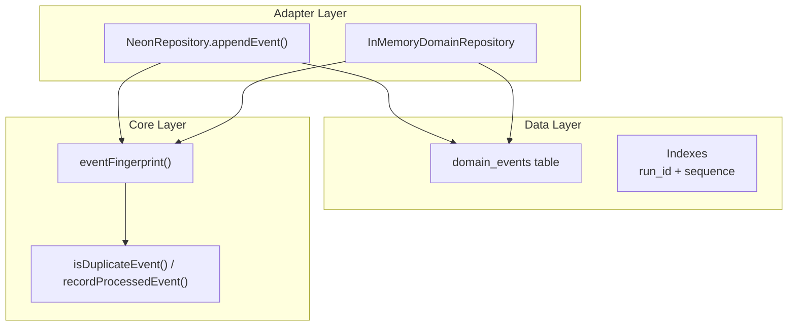
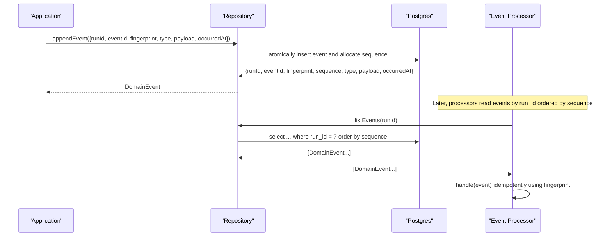
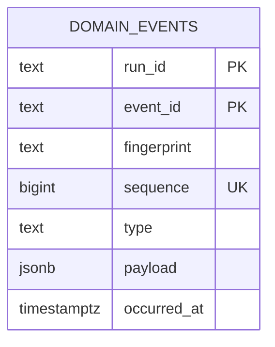
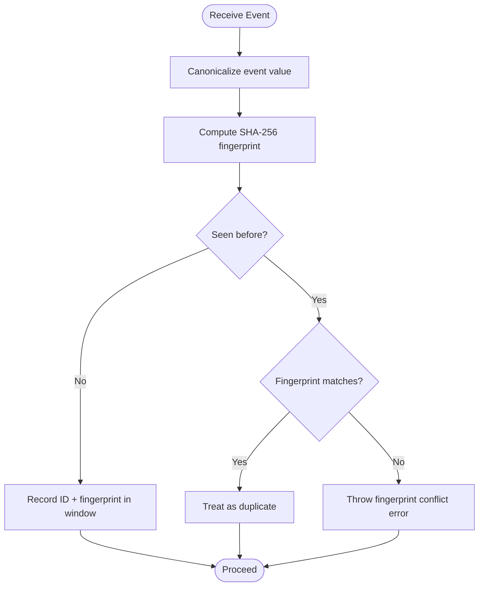
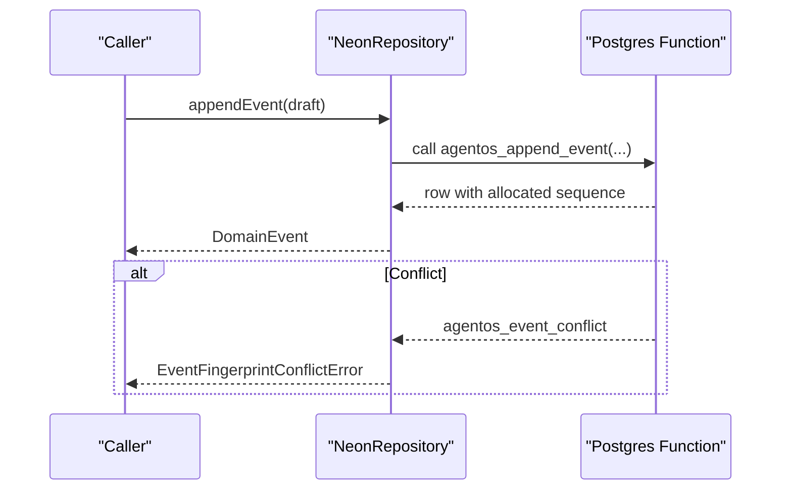
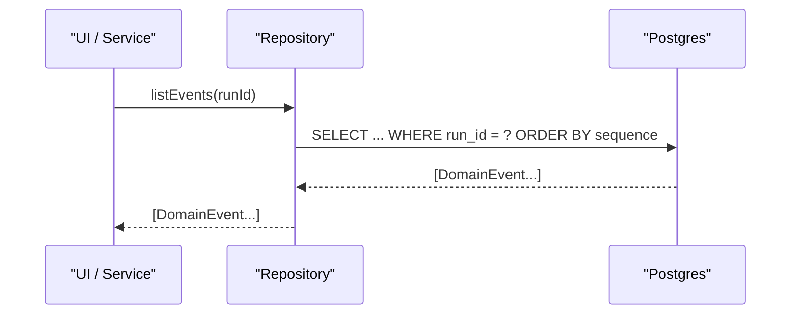
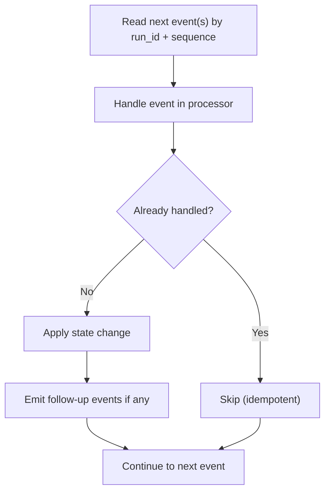
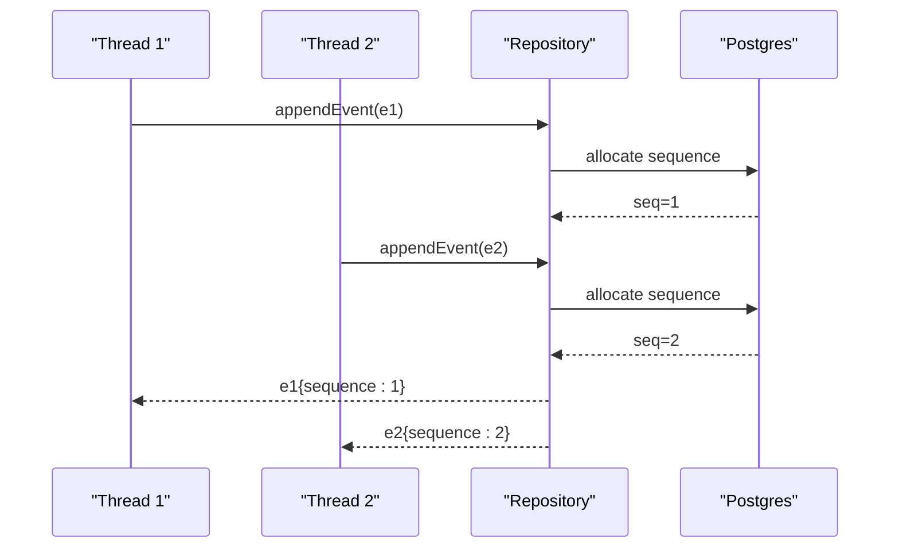
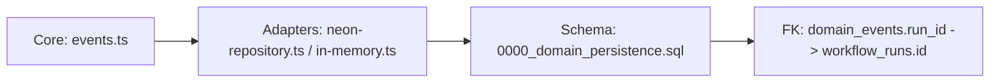

# Domain Events

<cite>
**Referenced Files in This Document**
- [0000_domain_persistence.sql](file://drizzle/0000_domain_persistence.sql)
- [events.ts](file://packages/core/src/events.ts)
- [neon-repository.ts](file://packages/adapters/src/persistence/neon-repository.ts)
- [in-memory.ts](file://packages/adapters/src/persistence/in-memory.ts)
- [repository-parity-contract.test.ts](file://packages/adapters/src/persistence/repository-parity-contract.test.ts)
- [atomic-mutations.test.ts](file://packages/adapters/src/persistence/atomic-mutations.test.ts)
- [postgres.integration.test.ts](file://packages/adapters/src/persistence/postgres.integration.test.ts)
- [control-plane-service.test.ts](file://apps/control-plane/src/application/control-plane-service.test.ts)
</cite>

## Table of Contents
1. [Introduction](#introduction)
2. [Project Structure](#project-structure)
3. [Core Components](#core-components)
4. [Architecture Overview](#architecture-overview)
5. [Detailed Component Analysis](#detailed-component-analysis)
6. [Dependency Analysis](#dependency-analysis)
7. [Performance Considerations](#performance-considerations)
8. [Troubleshooting Guide](#troubleshooting-guide)
9. [Conclusion](#conclusion)
10. [Appendices](#appendices)

## Introduction
This document describes the domain events data model and event-sourcing patterns used to capture state changes for workflow runs. It focuses on the domain_events table schema, constraints, indexing strategy, and how events are published, queried, and replayed across the system. It also explains idempotency and ordering guarantees that underpin reliable event processing.

## Project Structure
The domain event persistence spans three layers:
- Data definition: SQL migration defines the domain_events table and indexes.
- Core utilities: Event fingerprinting and deduplication helpers ensure consistent hashing and safe replay behavior.
- Adapters: Repository implementations (Neon Postgres and in-memory) implement append, retrieval, and sequencing semantics with conflict handling.

**Diagram sources**
- [0000_domain_persistence.sql:62-73](file://drizzle/0000_domain_persistence.sql#L62-L73)
- [0000_domain_persistence.sql:208-209](file://drizzle/0000_domain_persistence.sql#L208-L209)
- [events.ts:1-86](file://packages/core/src/events.ts#L1-L86)
- [neon-repository.ts:1075-1114](file://packages/adapters/src/persistence/neon-repository.ts#L1075-L1114)
- [in-memory.ts:879-916](file://packages/adapters/src/persistence/in-memory.ts#L879-L916)

**Section sources**
- [0000_domain_persistence.sql:62-73](file://drizzle/0000_domain_persistence.sql#L62-L73)
- [0000_domain_persistence.sql:208-209](file://drizzle/0000_domain_persistence.sql#L208-L209)
- [events.ts:1-86](file://packages/core/src/events.ts#L1-L86)
- [neon-repository.ts:1075-1114](file://packages/adapters/src/persistence/neon-repository.ts#L1075-L1114)
- [in-memory.ts:879-916](file://packages/adapters/src/persistence/in-memory.ts#L879-L916)

## Core Components
- domain_events table stores immutable records of state-changing events per run.
- Composite primary key (run_id, event_id) ensures unique identification of each event within a run.
- Unique constraint on (run_id, sequence) enforces strictly increasing, gap-free sequences per run.
- Index on (run_id, sequence) supports efficient ordered retrieval and replay.
- Core utilities compute deterministic fingerprints and support in-process deduplication windows.
- Adapters implement append semantics with conflict detection and mapping to/from domain models.

Key responsibilities:
- Publishing: Append new events with monotonically increasing sequence numbers per run.
- Querying: Retrieve events by run and order for replay or history views.
- Replay: Re-execute handlers against stored events while ensuring idempotency via fingerprints.

**Section sources**
- [0000_domain_persistence.sql:62-73](file://drizzle/0000_domain_persistence.sql#L62-L73)
- [0000_domain_persistence.sql:208-209](file://drizzle/0000_domain_persistence.sql#L208-L209)
- [events.ts:1-86](file://packages/core/src/events.ts#L1-L86)
- [neon-repository.ts:1075-1114](file://packages/adapters/src/persistence/neon-repository.ts#L1075-L1114)
- [in-memory.ts:879-916](file://packages/adapters/src/persistence/in-memory.ts#L879-L916)

## Architecture Overview
The event-driven architecture persists every state change as an immutable event. Consumers (processors) read events in order and apply them to build projections or trigger side effects. Ordering is guaranteed by sequence numbers, and idempotency is enforced by fingerprints and repository-level conflict checks.

**Diagram sources**
- [neon-repository.ts:1075-1114](file://packages/adapters/src/persistence/neon-repository.ts#L1075-L1114)
- [0000_domain_persistence.sql:62-73](file://drizzle/0000_domain_persistence.sql#L62-L73)
- [0000_domain_persistence.sql:208-209](file://drizzle/0000_domain_persistence.sql#L208-L209)

## Detailed Component Analysis

### Data Model: domain_events
- Columns:
  - run_id: Identifier of the workflow run this event belongs to.
  - event_id: Unique identifier for the event within the run.
  - fingerprint: Deterministic hash of the event’s canonical form; used for idempotency.
  - sequence: Monotonically increasing integer per run; gap-free and non-negative.
  - type: Human-readable event type string.
  - payload: Optional JSONB payload carrying event-specific data.
  - occurred_at: Timestamp when the event occurred (time zone aware).
- Constraints:
  - Composite primary key on (run_id, event_id).
  - Unique constraint on (run_id, sequence) to enforce strict ordering.
  - Check constraint ensuring sequence >= 0.
- Indexes:
  - B-tree index on (run_id, sequence) for fast ordered reads and replays.

**Diagram sources**
- [0000_domain_persistence.sql:62-73](file://drizzle/0000_domain_persistence.sql#L62-L73)
- [0000_domain_persistence.sql:208-209](file://drizzle/0000_domain_persistence.sql#L208-L209)

**Section sources**
- [0000_domain_persistence.sql:62-73](file://drizzle/0000_domain_persistence.sql#L62-L73)
- [0000_domain_persistence.sql:208-209](file://drizzle/0000_domain_persistence.sql#L208-L209)

### Event Fingerprinting and Deduplication
- Canonicalization normalizes values (including dates and object keys) to produce a stable representation before hashing.
- Fingerprint computation uses SHA-256 over the canonicalized event value.
- In-process deduplication tracks recently processed event IDs and their fingerprints within a bounded window to detect duplicates and content mismatches safely.

**Diagram sources**
- [events.ts:1-86](file://packages/core/src/events.ts#L1-L86)

**Section sources**
- [events.ts:1-86](file://packages/core/src/events.ts#L1-L86)

### Publishing Events (Append Semantics)
- The Neon adapter calls a database function to atomically append an event and allocate its sequence number.
- On conflict (e.g., duplicate fingerprint), a specific error is raised and mapped to a domain error.
- Retrieved rows are mapped back to domain event objects with safe integer conversion for sequence.

**Diagram sources**
- [neon-repository.ts:1075-1114](file://packages/adapters/src/persistence/neon-repository.ts#L1075-L1114)

**Section sources**
- [neon-repository.ts:1075-1114](file://packages/adapters/src/persistence/neon-repository.ts#L1075-L1114)

### Querying Event Histories
- Retrieval is typically done by run_id and ordered by sequence to reconstruct state or feed processors.
- Tests demonstrate listing events after mutations and verifying types and ordering.

**Diagram sources**
- [0000_domain_persistence.sql:208-209](file://drizzle/0000_domain_persistence.sql#L208-L209)
- [control-plane-service.test.ts:1146-1148](file://apps/control-plane/src/application/control-plane-service.test.ts#L1146-L1148)

**Section sources**
- [control-plane-service.test.ts:1146-1148](file://apps/control-plane/src/application/control-plane-service.test.ts#L1146-L1148)

### Implementing Event Processors
- Processors consume events in sequence order and apply them idempotently.
- Idempotency relies on:
  - Stable fingerprints to detect reprocessing.
  - Repository-level conflict detection preventing duplicate application with different content.
- Atomic mutation tests show that operations like replying to an inbox message and emitting an event are committed together, and retries are safe.

**Diagram sources**
- [atomic-mutations.test.ts:261-300](file://packages/adapters/src/persistence/atomic-mutations.test.ts#L261-L300)
- [events.ts:1-86](file://packages/core/src/events.ts#L1-L86)

**Section sources**
- [atomic-mutations.test.ts:261-300](file://packages/adapters/src/persistence/atomic-mutations.test.ts#L261-L300)
- [events.ts:1-86](file://packages/core/src/events.ts#L1-L86)

### Sequence Allocation and Ordering Guarantees
- Sequences are monotonically increasing and gap-free per run, validated by tests asserting sequential allocation.
- Concurrent replays resolve independently without colliding on sequence numbers.

**Diagram sources**
- [repository-parity-contract.test.ts:538-562](file://packages/adapters/src/persistence/repository-parity-contract.test.ts#L538-L562)
- [postgres.integration.test.ts:424-434](file://packages/adapters/src/persistence/postgres.integration.test.ts#L424-L434)

**Section sources**
- [repository-parity-contract.test.ts:538-562](file://packages/adapters/src/persistence/repository-parity-contract.test.ts#L538-L562)
- [postgres.integration.test.ts:424-434](file://packages/adapters/src/persistence/postgres.integration.test.ts#L424-L434)

## Dependency Analysis
- The domain_events table depends on workflow_runs via foreign key on run_id, ensuring events are scoped to existing runs.
- Adapters depend on core fingerprinting utilities to generate stable hashes.
- Tests validate repository contracts and integration behaviors such as concurrent replays and atomic commits.

**Diagram sources**
- [events.ts:1-86](file://packages/core/src/events.ts#L1-L86)
- [neon-repository.ts:1075-1114](file://packages/adapters/src/persistence/neon-repository.ts#L1075-L1114)
- [0000_domain_persistence.sql:62-73](file://drizzle/0000_domain_persistence.sql#L62-L73)
- [0000_domain_persistence.sql:195-195](file://drizzle/0000_domain_persistence.sql#L195-L195)

**Section sources**
- [0000_domain_persistence.sql:195-195](file://drizzle/0000_domain_persistence.sql#L195-L195)
- [events.ts:1-86](file://packages/core/src/events.ts#L1-L86)
- [neon-repository.ts:1075-1114](file://packages/adapters/src/persistence/neon-repository.ts#L1075-L1114)

## Performance Considerations
- Use the (run_id, sequence) index for all ordered reads and replays to avoid full table scans.
- Keep payloads compact; large JSONB payloads increase I/O and memory usage during replay.
- Batch reads by run_id to minimize round trips when building projections.
- Monitor sequence gaps; they should not occur due to the unique constraint, but heavy concurrency can cause contention—ensure appropriate transaction isolation and retry logic around conflicts.

[No sources needed since this section provides general guidance]

## Troubleshooting Guide
Common issues and resolutions:
- Fingerprint conflict: Occurs when an event ID is reused with different content. Ensure event IDs are globally unique per run and payloads are stable.
- Duplicate events: Handled by in-process dedupe window and repository-level checks; verify your processor marks events as processed only after successful handling.
- Ordering violations: If sequence ordering appears broken, confirm you always query with ORDER BY run_id, sequence and that no direct inserts bypass the repository.
- High latency on replay: Verify the (run_id, sequence) index exists and is used; consider partitioning strategies if runs grow very large.

**Section sources**
- [neon-repository.ts:1075-1114](file://packages/adapters/src/persistence/neon-repository.ts#L1075-L1114)
- [events.ts:1-86](file://packages/core/src/events.ts#L1-L86)
- [0000_domain_persistence.sql:208-209](file://drizzle/0000_domain_persistence.sql#L208-L209)

## Conclusion
The domain_events table and supporting components provide a robust foundation for event sourcing:
- Immutable, ordered, and uniquely identifiable events per run.
- Strong guarantees via composite keys, unique sequence constraints, and indexes.
- Deterministic fingerprinting and deduplication enable safe, idempotent processing.
- Repository abstractions encapsulate persistence details and expose clear APIs for publishing and replaying events.

[No sources needed since this section summarizes without analyzing specific files]

## Appendices

### Example Workflows

- Publish an event:
  - Create an event draft with run_id, event_id, fingerprint, type, optional payload, and occurred_at.
  - Call appendEvent on the repository; it returns the persisted event with an allocated sequence.
  - Reference: [neon-repository.ts:1075-1114](file://packages/adapters/src/persistence/neon-repository.ts#L1075-L1114)

- Query event history:
  - List events for a run_id ordered by sequence to reconstruct state or display timelines.
  - Reference: [control-plane-service.test.ts:1146-1148](file://apps/control-plane/src/application/control-plane-service.test.ts#L1146-L1148)

- Implement an event processor:
  - Read events in order, apply changes idempotently using fingerprints, and emit follow-up events if necessary.
  - Reference: [atomic-mutations.test.ts:261-300](file://packages/adapters/src/persistence/atomic-mutations.test.ts#L261-L300)

- Validate sequence allocation:
  - Confirm sequences are monotonically increasing and gap-free per run.
  - Reference: [repository-parity-contract.test.ts:538-562](file://packages/adapters/src/persistence/repository-parity-contract.test.ts#L538-L562)

- Handle concurrent replays:
  - Ensure independent sequence allocation and conflict resolution under concurrency.
  - Reference: [postgres.integration.test.ts:424-434](file://packages/adapters/src/persistence/postgres.integration.test.ts#L424-L434)