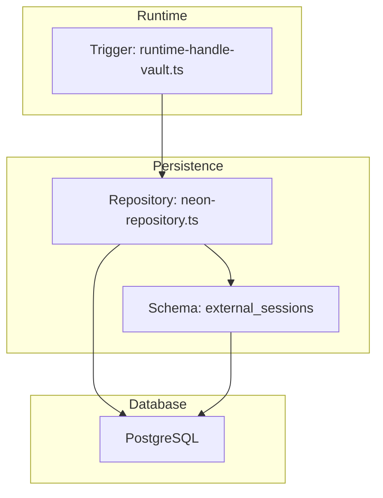
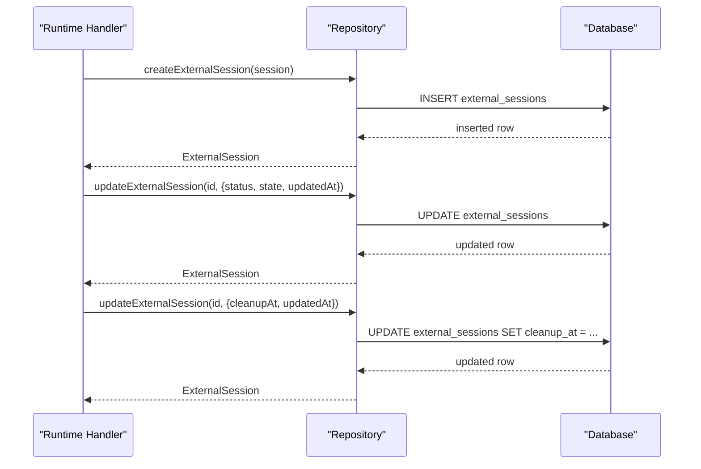
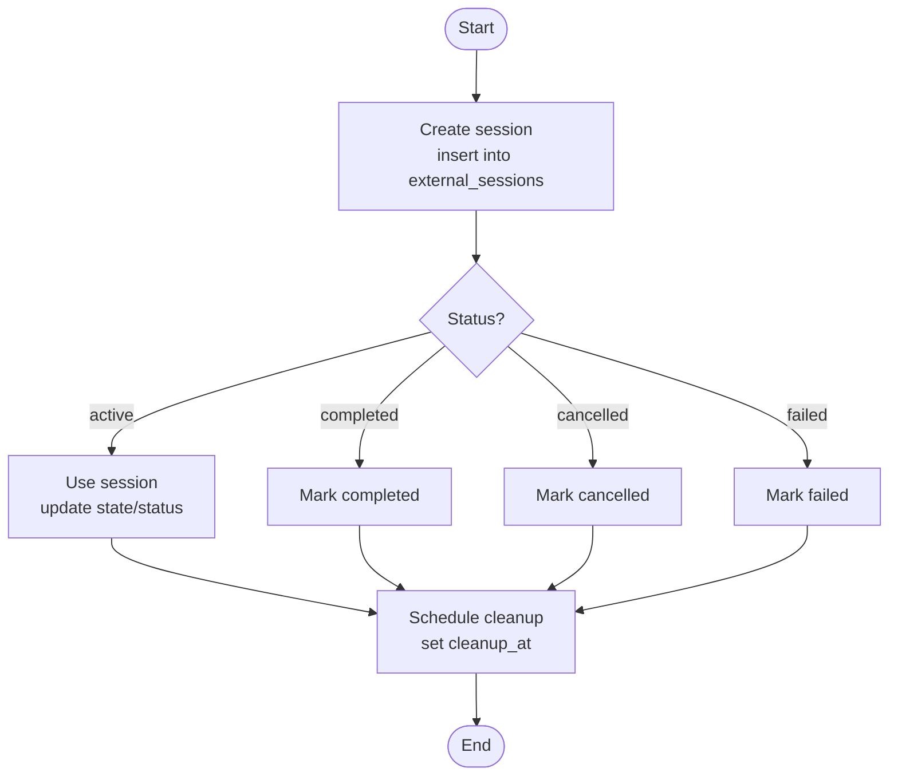
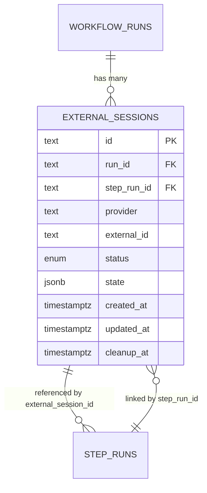

# External Sessions

<cite>
**Referenced Files in This Document**
- [schema.ts](file://packages/adapters/src/persistence/schema.ts)
- [neon-repository.ts](file://packages/adapters/src/persistence/neon-repository.ts)
- [runtime-handle-vault.ts](file://packages/adapters/src/trigger/runtime-handle-vault.ts)
- [0001_link_step_sessions.sql](file://drizzle/0001_link_step_sessions.sql)
</cite>

## Table of Contents
1. Introduction
2. Project Structure
3. Core Components
4. Architecture Overview
5. Detailed Component Analysis
6. Dependency Analysis
7. Performance Considerations
8. Troubleshooting Guide
9. Conclusion

## Introduction
This document describes the external sessions data model and lifecycle within the system. It focuses on the external_sessions table, its fields, constraints, relationships to workflow runs and step runs, session status values, state storage, timestamps, and cleanup scheduling. It also provides examples of how sessions are created, updated, and cleaned up using the repository layer and runtime handlers.

## Project Structure
External sessions are modeled in the persistence schema and accessed via a repository implementation. The runtime can update session status and schedule cleanup. A migration adds the link from step runs to external sessions.

**Diagram sources**
- [schema.ts:316-354](file://packages/adapters/src/persistence/schema.ts#L316-L354)
- [neon-repository.ts:840-904](file://packages/adapters/src/persistence/neon-repository.ts#L840-L904)
- [runtime-handle-vault.ts:85-102](file://packages/adapters/src/trigger/runtime-handle-vault.ts#L85-L102)

**Section sources**
- [schema.ts:316-354](file://packages/adapters/src/persistence/schema.ts#L316-L354)
- [neon-repository.ts:840-904](file://packages/adapters/src/persistence/neon-repository.ts#L840-L904)
- [runtime-handle-vault.ts:85-102](file://packages/adapters/src/trigger/runtime-handle-vault.ts#L85-L102)
- [0001_link_step_sessions.sql:1](file://drizzle/0001_link_step_sessions.sql#L1)

## Core Components
- external_sessions table: stores provider-scoped sessions tied to a workflow run and optionally a step run.
- external_session_status enum: active, completed, cancelled, failed.
- Relationships:
  - run_id references workflow_runs.id (cascade delete).
  - step_run_id references step_runs.id (set null on delete).
  - step_runs.external_session_id references external_sessions.id (set null on delete).
- Unique constraint: (provider, external_id) ensures one session per provider identity.
- Indexes:
  - cleanup_at for scheduled cleanup.
  - run_id + created_at for listing by run.
  - run_id + provider + created_at for provider-scoped listing by run.

**Section sources**
- [schema.ts:46-59](file://packages/adapters/src/persistence/schema.ts#L46-L59)
- [schema.ts:134-180](file://packages/adapters/src/persistence/schema.ts#L134-L180)
- [schema.ts:275-314](file://packages/adapters/src/persistence/schema.ts#L275-L314)
- [schema.ts:316-354](file://packages/adapters/src/persistence/schema.ts#L316-L354)
- [0001_link_step_sessions.sql:1](file://drizzle/0001_link_step_sessions.sql#L1)

## Architecture Overview
The external session lifecycle is coordinated across the trigger layer and repository layer:
- Creation: repository inserts a new external session row with initial status and optional state.
- Updates: repository updates status, state, or timestamps as the session progresses.
- Cleanup: runtime marks sessions for cleanup by setting cleanup_at; a background process uses the cleanup index to find and remove rows.

**Diagram sources**
- [neon-repository.ts:840-904](file://packages/adapters/src/persistence/neon-repository.ts#L840-L904)
- [runtime-handle-vault.ts:85-102](file://packages/adapters/src/trigger/runtime-handle-vault.ts#L85-L102)

## Detailed Component Analysis

### Data Model: external_sessions
- id: primary key (text)
- run_id: foreign key to workflow_runs.id (not null, cascade delete)
- step_run_id: foreign key to step_runs.id (nullable, set null on delete)
- provider: text (not null)
- external_id: text (not null)
- status: external_session_status enum (active, completed, cancelled, failed)
- state: jsonb (optional)
- created_at: timestamp with time zone (not null)
- updated_at: timestamp with time zone (nullable)
- cleanup_at: timestamp with time zone (nullable)

Constraints and indexes:
- Unique on (provider, external_id)
- Index on cleanup_at where cleanup_at is not null
- Index on (run_id, created_at)
- Index on (run_id, provider, created_at)

Relationships:
- One-to-many from workflow_runs to external_sessions via run_id
- Optional one-to-one from step_runs to external_sessions via step_run_id
- Reverse link from step_runs.external_session_id to external_sessions.id

**Section sources**
- [schema.ts:316-354](file://packages/adapters/src/persistence/schema.ts#L316-L354)
- [schema.ts:134-180](file://packages/adapters/src/persistence/schema.ts#L134-L180)
- [schema.ts:275-314](file://packages/adapters/src/persistence/schema.ts#L275-L314)
- [0001_link_step_sessions.sql:1](file://drizzle/0001_link_step_sessions.sql#L1)

### Session Lifecycle Management
- Create: insert a row with provider, external_id, run_id, initial status, and optional state.
- Update: change status, mutate state JSONB, and refresh updated_at.
- Schedule cleanup: set cleanup_at to mark for later deletion.
- List: query by run_id with optional provider filter and pagination.

**Diagram sources**
- [neon-repository.ts:840-904](file://packages/adapters/src/persistence/neon-repository.ts#L840-L904)
- [runtime-handle-vault.ts:85-102](file://packages/adapters/src/trigger/runtime-handle-vault.ts#L85-L102)

### Repository Operations
- createExternalSession: inserts a new session row and returns it.
- getExternalSession: retrieves a session by id.
- listExternalSessions: lists sessions by run_id with optional provider filter and cursor-based pagination.
- updateExternalSession: updates fields including status, state, updated_at, and cleanup_at.

These operations map directly to the external_sessions table and leverage indexes for efficient queries.

**Section sources**
- [neon-repository.ts:840-904](file://packages/adapters/src/persistence/neon-repository.ts#L840-L904)

### Runtime Integration and Cleanup
- Marking cancellation: runtime handler updates session status to cancelled when needed.
- Scheduling cleanup: runtime handler sets cleanup_at to schedule background cleanup.
- Lookup by external_id: runtime can resolve the associated run_id via repository methods.

**Section sources**
- [runtime-handle-vault.ts:85-102](file://packages/adapters/src/trigger/runtime-handle-vault.ts#L85-L102)

## Dependency Analysis
- external_sessions depends on:
  - workflow_runs (via run_id)
  - step_runs (via step_run_id)
- step_runs has an optional back-reference to external_sessions (external_session_id)
- Unique constraint on (provider, external_id) prevents duplicate sessions per provider identity
- Indexes support:
  - cleanup scheduling (cleanup_at)
  - listing by run (run_id, created_at)
  - provider-scoped listing by run (run_id, provider, created_at)

**Diagram sources**
- [schema.ts:134-180](file://packages/adapters/src/persistence/schema.ts#L134-L180)
- [schema.ts:275-314](file://packages/adapters/src/persistence/schema.ts#L275-L314)
- [schema.ts:316-354](file://packages/adapters/src/persistence/schema.ts#L316-L354)
- [0001_link_step_sessions.sql:1](file://drizzle/0001_link_step_sessions.sql#L1)

**Section sources**
- [schema.ts:134-180](file://packages/adapters/src/persistence/schema.ts#L134-L180)
- [schema.ts:275-314](file://packages/adapters/src/persistence/schema.ts#L275-L314)
- [schema.ts:316-354](file://packages/adapters/src/persistence/schema.ts#L316-L354)
- [0001_link_step_sessions.sql:1](file://drizzle/0001_link_step_sessions.sql#L1)

## Performance Considerations
- Use the cleanup_at index to efficiently locate sessions ready for deletion.
- Query sessions by run_id with provider filters leveraging the composite index for fast listing.
- Keep state JSONB payloads concise to minimize storage and query overhead.
- Avoid excessive updates to updated_at; batch updates where possible.

[No sources needed since this section provides general guidance]

## Troubleshooting Guide
- Duplicate session errors: ensure unique (provider, external_id) is respected when creating sessions.
- Orphaned step links: if step_runs.external_session_id points to a deleted session, the foreign key will set it to null; verify session existence before linking.
- Cleanup not running: confirm cleanup_at is set and the cleanup index exists; check that the background process reads rows where cleanup_at is not null.
- Listing performance: use run_id and provider filters with pagination to avoid full table scans.

**Section sources**
- [schema.ts:316-354](file://packages/adapters/src/persistence/schema.ts#L316-L354)
- [0001_link_step_sessions.sql:1](file://drizzle/0001_link_step_sessions.sql#L1)

## Conclusion
The external_sessions table provides a robust foundation for tracking provider-specific sessions within workflow runs. Its design enforces uniqueness per provider identity, supports flexible state via JSONB, and enables efficient cleanup through indexed timestamps. The repository and runtime layers coordinate creation, updates, and cleanup, ensuring sessions remain consistent with their owning workflows and steps.

[No sources needed since this section summarizes without analyzing specific files]