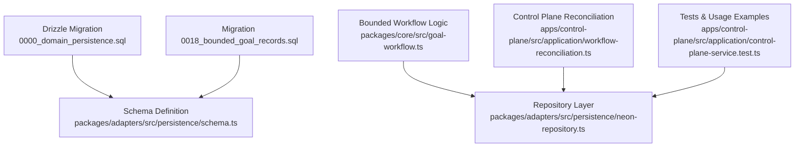
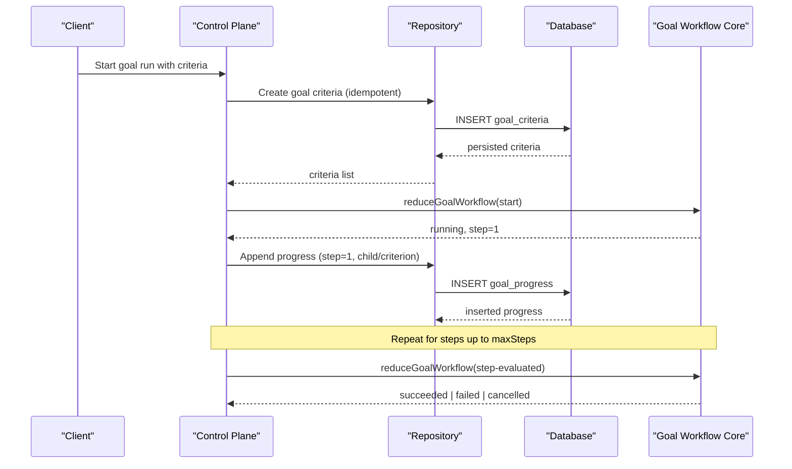
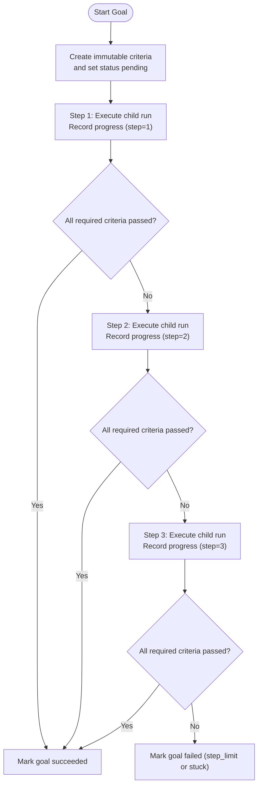
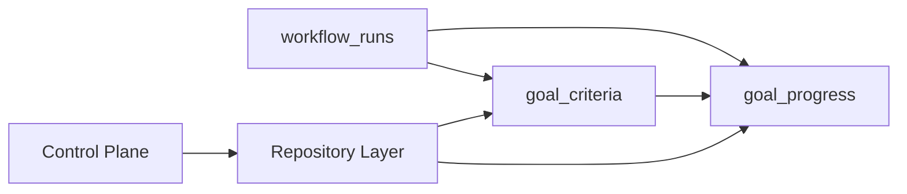

# Goal Tracking

<cite>
**Referenced Files in This Document**
- [0000_domain_persistence.sql](file://drizzle/0000_domain_persistence.sql)
- [0018_bounded_goal_records.sql](file://drizzle/0018_bounded_goal_records.sql)
- [goal-workflow.ts](file://packages/core/src/goal-workflow.ts)
- [schema.ts](file://packages/adapters/src/persistence/schema.ts)
- [neon-repository.ts](file://packages/adapters/src/persistence/neon-repository.ts)
- [workflow-reconciliation.ts](file://apps/control-plane/src/application/workflow-reconciliation.ts)
- [control-plane-service.test.ts](file://apps/control-plane/src/application/control-plane-service.test.ts)
- [2026-08-17-bounded-goal-loop-design.md](file://docs/superpowers/specs/2026-08-17-bounded-goal-loop-design.md)
</cite>

## Table of Contents
1. [Introduction](#introduction)
2. [Project Structure](#project-structure)
3. [Core Components](#core-components)
4. [Architecture Overview](#architecture-overview)
5. [Detailed Component Analysis](#detailed-component-analysis)
6. [Dependency Analysis](#dependency-analysis)
7. [Performance Considerations](#performance-considerations)
8. [Troubleshooting Guide](#troubleshooting-guide)
9. [Conclusion](#conclusion)
10. [Appendices](#appendices)

## Introduction
This document describes the data model and operational behavior for goal tracking, focusing on two core tables:
- goal_criteria: defines immutable criteria for a goal within a run, including identity, ordering, description, definition payload, status, and creation time.
- goal_progress: records step-scoped progress events tied to a run and optionally to a specific criterion, with status, detail, payload, and timestamp.

It also explains the bounded goal loop (up to three steps), how progress is recorded and validated, and how completion is determined.

## Project Structure
Goal-related persistence lives in Drizzle migrations and schema definitions, while the bounded workflow logic resides in the core package and is exercised by the control plane during reconciliation and tests.

**Diagram sources**
- [0000_domain_persistence.sql:89-108](file://drizzle/0000_domain_persistence.sql#L89-L108)
- [0018_bounded_goal_records.sql:1-12](file://drizzle/0018_bounded_goal_records.sql#L1-L12)
- [schema.ts:679-706](file://packages/adapters/src/persistence/schema.ts#L679-L706)
- [goal-workflow.ts:43-85](file://packages/core/src/goal-workflow.ts#L43-L85)
- [neon-repository.ts:1699-1773](file://packages/adapters/src/persistence/neon-repository.ts#L1699-L1773)
- [workflow-reconciliation.ts:368-402](file://apps/control-plane/src/application/workflow-reconciliation.ts#L368-L402)
- [control-plane-service.test.ts:840-885](file://apps/control-plane/src/application/control-plane-service.test.ts#L840-L885)

**Section sources**
- [0000_domain_persistence.sql:89-108](file://drizzle/0000_domain_persistence.sql#L89-L108)
- [0018_bounded_goal_records.sql:1-12](file://drizzle/0018_bounded_goal_records.sql#L1-L12)
- [schema.ts:679-706](file://packages/adapters/src/persistence/schema.ts#L679-L706)

## Core Components
- goal_criteria table stores canonical, immutable criterion definitions per run, with an ordinal to preserve order, a human-readable description, a JSON definition payload, a status field using the goal_status enum, and a created_at timestamp.
- goal_progress table records step-scoped progress events. Each row includes a deterministic id, run_id, optional criterion_id, step (bounded 1–3), status from goal_status, optional detail text, optional JSON payload, and recorded_at timestamp. An index supports ordered retrieval by run and time.

Key constraints and relationships:
- goal_criteria has a unique constraint on (run_id, ordinal).
- goal_progress references workflow_runs via run_id and optionally references goal_criteria via criterion_id.
- A check constraint enforces step values between 1 and 3.

**Section sources**
- [0000_domain_persistence.sql:89-108](file://drizzle/0000_domain_persistence.sql#L89-L108)
- [0000_domain_persistence.sql:198-200](file://drizzle/0000_domain_persistence.sql#L198-L200)
- [0018_bounded_goal_records.sql:10-12](file://drizzle/0018_bounded_goal_records.sql#L10-L12)
- [schema.ts:679-706](file://packages/adapters/src/persistence/schema.ts#L679-L706)
- [neon-repository.ts:1699-1773](file://packages/adapters/src/persistence/neon-repository.ts#L1699-L1773)

## Architecture Overview
The bounded goal loop coordinates up to three attempts (steps) to satisfy all required criteria. The core reducer owns state transitions and success/failure rules. Persistence layers create and append durable records for criteria and progress. The control plane reconciles runs, repairs missing criteria, and ensures progress is consistent.

**Diagram sources**
- [workflow-reconciliation.ts:368-402](file://apps/control-plane/src/application/workflow-reconciliation.ts#L368-L402)
- [neon-repository.ts:1699-1773](file://packages/adapters/src/persistence/neon-repository.ts#L1699-L1773)
- [goal-workflow.ts:163-207](file://packages/core/src/goal-workflow.ts#L163-L207)

## Detailed Component Analysis

### Data Model: goal_criteria
- Purpose: Define each criterion for a goal run immutably.
- Columns:
  - id: primary key
  - run_id: foreign key to workflow_runs
  - ordinal: non-negative integer; unique per run
  - description: human-readable text
  - definition: JSON payload capturing the authoritative criterion definition
  - status: goal_status enum value
  - created_at: timestamp
- Constraints:
  - Unique on (run_id, ordinal)
  - Check that ordinal >= 0
  - Foreign key to workflow_runs with cascade delete

Usage notes:
- Criteria are created deterministically per run and must match expected definitions during reconciliation.
- Status reflects the current state of the criterion within the goal lifecycle.

**Section sources**
- [0000_domain_persistence.sql:89-98](file://drizzle/0000_domain_persistence.sql#L89-L98)
- [0000_domain_persistence.sql:198-199](file://drizzle/0000_domain_persistence.sql#L198-L199)
- [0018_bounded_goal_records.sql:10](file://drizzle/0018_bounded_goal_records.sql#L10)
- [workflow-reconciliation.ts:368-402](file://apps/control-plane/src/application/workflow-reconciliation.ts#L368-L402)

### Data Model: goal_progress
- Purpose: Record step-scoped progress events for a goal run, optionally tied to a specific criterion.
- Columns:
  - id: primary key (deterministic for idempotency)
  - run_id: foreign key to workflow_runs
  - criterion_id: optional foreign key to goal_criteria
  - step: integer constrained to 1–3
  - status: goal_status enum value
  - detail: optional text
  - payload: optional JSON
  - recorded_at: timestamp
- Indexes:
  - Ordered by run_id and recorded_at (with id collation) for efficient retrieval.
- Constraints:
  - Check constraint enforcing step between 1 and 3
  - Foreign keys to workflow_runs and goal_criteria with cascade deletes

Usage notes:
- One progress row can represent a child attempt for a step.
- Criterion-level progress rows record trusted verification outcomes linked to a criterion_id.

**Section sources**
- [0000_domain_persistence.sql:100-108](file://drizzle/0000_domain_persistence.sql#L100-L108)
- [0000_domain_persistence.sql:200-200](file://drizzle/0000_domain_persistence.sql#L200-L200)
- [0018_bounded_goal_records.sql:11-12](file://drizzle/0018_bounded_goal_records.sql#L11-L12)
- [schema.ts:679-706](file://packages/adapters/src/persistence/schema.ts#L679-L706)

### Bounded Goal Loop and Progress Tracking
- The bounded loop allows up to three steps. The core reducer validates events, enforces terminal states, and determines success when all required criteria pass or failure when stuck or exceeding step limits.
- Progress entries are appended per step, including:
  - Step-level child attempt progress
  - Criterion-level results with payloads containing verification details
- Completion validation:
  - Success occurs when all required criteria have passed.
  - Failure occurs if the same signed failure fingerprint repeats three times or after the third step remains unsatisfied.

**Diagram sources**
- [goal-workflow.ts:43-85](file://packages/core/src/goal-workflow.ts#L43-L85)
- [goal-workflow.ts:163-207](file://packages/core/src/goal-workflow.ts#L163-L207)
- [2026-08-17-bounded-goal-loop-design.md:51-80](file://docs/superpowers/specs/2026-08-17-bounded-goal-loop-design.md#L51-L80)

**Section sources**
- [goal-workflow.ts:43-85](file://packages/core/src/goal-workflow.ts#L43-L85)
- [goal-workflow.ts:163-207](file://packages/core/src/goal-workflow.ts#L163-L207)
- [2026-08-17-bounded-goal-loop-design.md:51-80](file://docs/superpowers/specs/2026-08-17-bounded-goal-loop-design.md#L51-L80)

### Example Workflows

#### Example: Goal Definition
- Define at least one command criterion with a unique id, description, and command.
- Persist criteria idempotently per run, ensuring deterministic ids and matching definitions.

References:
- Deterministic criterion creation and validation during reconciliation.
- Repository methods for creating criteria idempotently.

**Section sources**
- [workflow-reconciliation.ts:368-402](file://apps/control-plane/src/application/workflow-reconciliation.ts#L368-L402)
- [neon-repository.ts:1699-1736](file://packages/adapters/src/persistence/neon-repository.ts#L1699-L1736)

#### Example: Progress Monitoring
- For each step, append progress:
  - A step-level entry indicating the child run being attempted.
  - Per-criterion entries recording verification results with payloads describing passed or failed outcomes.

References:
- Test usage shows appending step-level and criterion-level progress with structured payloads.

**Section sources**
- [control-plane-service.test.ts:840-885](file://apps/control-plane/src/application/control-plane-service.test.ts#L840-L885)

#### Example: Completion Validation
- After each step, evaluate whether all required criteria passed.
- If yes, mark the goal succeeded; otherwise continue to next step or fail based on bounded limits and stuck detection.

References:
- Core reducer logic for success/failure transitions and step advancement.

**Section sources**
- [goal-workflow.ts:163-207](file://packages/core/src/goal-workflow.ts#L163-L207)

## Dependency Analysis
- goal_criteria depends on workflow_runs via run_id.
- goal_progress depends on workflow_runs via run_id and optionally on goal_criteria via criterion_id.
- The repository layer provides idempotent creation of criteria and appending of progress, enforcing constraints and mapping rows to domain models.
- The control plane orchestrates reconciliation, repairing missing criteria and ensuring consistency.

**Diagram sources**
- [0000_domain_persistence.sql:198-200](file://drizzle/0000_domain_persistence.sql#L198-L200)
- [schema.ts:679-706](file://packages/adapters/src/persistence/schema.ts#L679-L706)
- [neon-repository.ts:1699-1773](file://packages/adapters/src/persistence/neon-repository.ts#L1699-L1773)
- [workflow-reconciliation.ts:368-402](file://apps/control-plane/src/application/workflow-reconciliation.ts#L368-L402)

**Section sources**
- [0000_domain_persistence.sql:198-200](file://drizzle/0000_domain_persistence.sql#L198-L200)
- [schema.ts:679-706](file://packages/adapters/src/persistence/schema.ts#L679-L706)
- [neon-repository.ts:1699-1773](file://packages/adapters/src/persistence/neon-repository.ts#L1699-L1773)
- [workflow-reconciliation.ts:368-402](file://apps/control-plane/src/application/workflow-reconciliation.ts#L368-L402)

## Performance Considerations
- Use the existing index on goal_progress (run_id, recorded_at, id) to efficiently retrieve chronological progress per run.
- Keep payloads compact and structured to minimize storage and query overhead.
- Ensure deterministic ids for idempotent appends to avoid duplicate work and conflicts.

[No sources needed since this section provides general guidance]

## Troubleshooting Guide
Common issues and resolutions:
- Duplicate or conflicting criterion definitions:
  - Idempotent creation will reject changes to existing definitions; reconcile by aligning inputs.
- Invalid step values:
  - The database enforces step between 1 and 3; ensure callers respect bounds.
- Missing criteria during reconciliation:
  - Control plane repairs missing criteria; verify input definitions and run provenance.
- Conflicting progress updates:
  - Idempotent appends require identical payloads; differing payloads cause conflicts.

**Section sources**
- [neon-repository.ts:1711-1736](file://packages/adapters/src/persistence/neon-repository.ts#L1711-L1736)
- [0018_bounded_goal_records.sql:11-12](file://drizzle/0018_bounded_goal_records.sql#L11-L12)
- [workflow-reconciliation.ts:368-402](file://apps/control-plane/src/application/workflow-reconciliation.ts#L368-L402)

## Conclusion
The goal tracking system uses two tightly integrated tables to define immutable criteria and record step-scoped progress. The bounded goal loop enforces a maximum of three steps, with clear success and failure conditions. Persistence is idempotent and constrained, and the control plane ensures consistency through reconciliation. This design supports reliable, auditable goal execution with durable records and verifiable progress.

[No sources needed since this section summarizes without analyzing specific files]

## Appendices

### Enum Values: goal_status
- Defined in the initial migration as an enum type used across goal-related tables.
- Values include pending, satisfied, and failed.

**Section sources**
- [0000_domain_persistence.sql:3](file://drizzle/0000_domain_persistence.sql#L3)