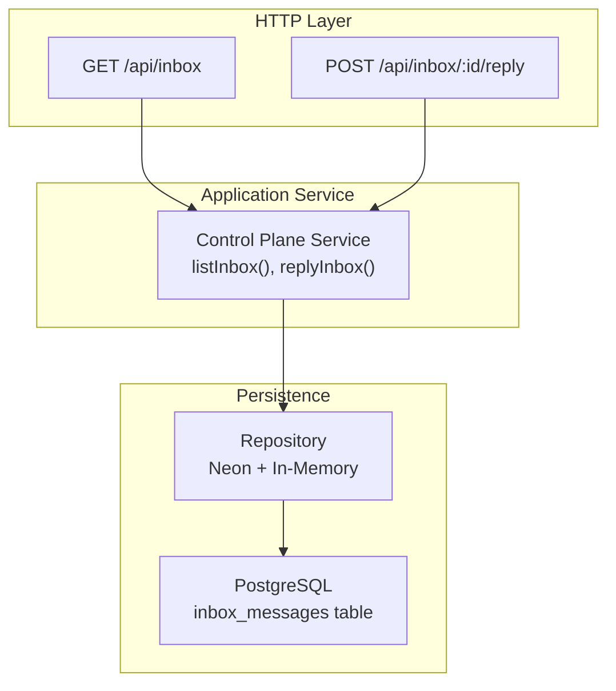
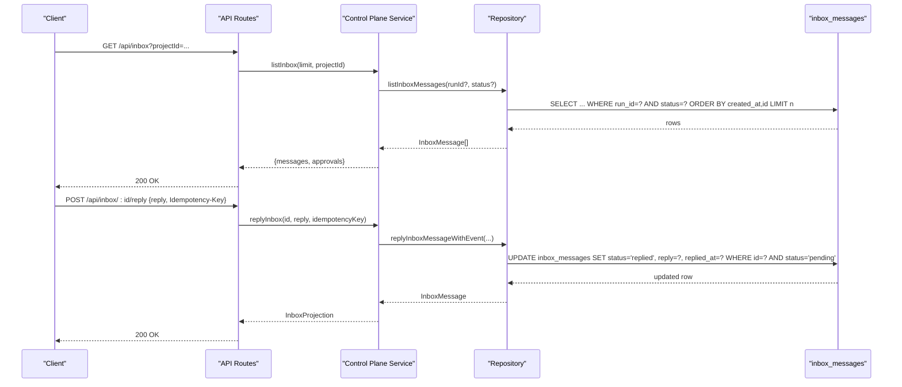
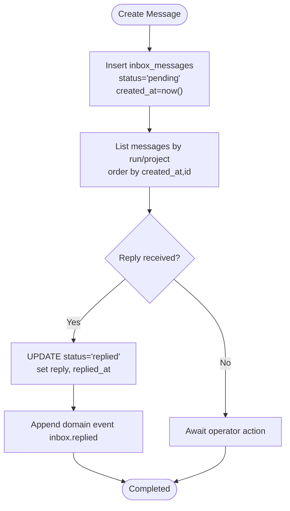
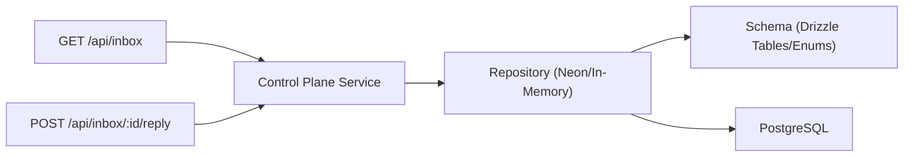

# Inbox Messages

<cite>
**Referenced Files in This Document**
- [schema.ts](file://packages/adapters/src/persistence/schema.ts)
- [neon-repository.ts](file://packages/adapters/src/persistence/neon-repository.ts)
- [in-memory.ts](file://packages/adapters/src/persistence/in-memory.ts)
- [control-plane-service.ts](file://apps/control-plane/src/application/control-plane-service.ts)
- [inbox route (GET)](file://apps/control-plane/app/api/inbox/route.ts)
- [inbox reply route (POST)](file://apps/control-plane/app/api/inbox/[id]/reply/route.ts)
- [contracts.ts](file://apps/control-plane/src/http/contracts.ts)
- [inbox view model](file://apps/control-plane/src/ui/inbox-view-model.ts)
</cite>

## Table of Contents
1. [Introduction](#introduction)
2. [Project Structure](#project-structure)
3. [Core Components](#core-components)
4. [Architecture Overview](#architecture-overview)
5. [Detailed Component Analysis](#detailed-component-analysis)
6. [Dependency Analysis](#dependency-analysis)
7. [Performance Considerations](#performance-considerations)
8. [Troubleshooting Guide](#troubleshooting-guide)
9. [Conclusion](#conclusion)

## Introduction
This document describes the data model and lifecycle of the inbox message system centered on the inbox_messages table. It explains how messages are created, listed, and replied to within the context of workflow runs and step runs, and it details indexing strategies that optimize pending message queries. It also provides practical examples for creating messages, processing replies, and managing the inbox via APIs.

## Project Structure
The inbox feature spans several layers:
- Data model and indexes defined in the persistence schema
- Repository implementations for Neon and in-memory storage
- Application service handling business logic and idempotency
- HTTP routes exposing listing and reply endpoints
- UI models projecting inbox items for display

**Diagram sources**
- [inbox route (GET):1-33](file://apps/control-plane/app/api/inbox/route.ts#L1-L33)
- [inbox reply route (POST):1-33](file://apps/control-plane/app/api/inbox/[id]/reply/route.ts#L1-L33)
- [control-plane-service.ts:1719-1764](file://apps/control-plane/src/application/control-plane-service.ts#L1719-L1764)
- [neon-repository.ts:1020-1073](file://packages/adapters/src/persistence/neon-repository.ts#L1020-L1073)
- [schema.ts:385-417](file://packages/adapters/src/persistence/schema.ts#L385-L417)

**Section sources**
- [schema.ts:385-417](file://packages/adapters/src/persistence/schema.ts#L385-L417)
- [inbox route (GET):1-33](file://apps/control-plane/app/api/inbox/route.ts#L1-L33)
- [inbox reply route (POST):1-33](file://apps/control-plane/app/api/inbox/[id]/reply/route.ts#L1-L33)

## Core Components
- inbox_messages table: stores contextual messages tied to a workflow run and optionally a step run.
- inbox_status enum: values are pending and replied.
- JSONB fields: body holds the original message content; reply holds the operator’s response when present.
- Timestamps: created_at marks creation; replied_at is set when a message transitions to replied.
- Indexes: optimized for querying pending messages per run and ordering by time/id.

Key relationships:
- run_id references workflow_runs.id (cascade delete).
- step_run_id references step_runs.id (nullable; set null on cascade).

Message content structure (body and reply):
- text, question, message, answer, options (all optional strings; options is an array of strings).

**Section sources**
- [schema.ts:385-417](file://packages/adapters/src/persistence/schema.ts#L385-L417)
- [contracts.ts:325-353](file://apps/control-plane/src/http/contracts.ts#L325-L353)

## Architecture Overview
The inbox supports two primary operations:
- Listing messages for a project or run, including pending approvals and notifications.
- Replying to a specific message with idempotent handling.

**Diagram sources**
- [inbox route (GET):1-33](file://apps/control-plane/app/api/inbox/route.ts#L1-L33)
- [inbox reply route (POST):1-33](file://apps/control-plane/app/api/inbox/[id]/reply/route.ts#L1-L33)
- [control-plane-service.ts:1719-1764](file://apps/control-plane/src/application/control-plane-service.ts#L1719-L1764)
- [neon-repository.ts:1020-1073](file://packages/adapters/src/persistence/neon-repository.ts#L1020-L1073)

## Detailed Component Analysis

### Data Model: inbox_messages
- id: primary key (text)
- run_id: foreign key to workflow_runs.id (not null)
- step_run_id: foreign key to step_runs.id (nullable)
- status: enum inbox_status with values pending, replied (not null)
- body: jsonb (not null), contains message payload such as text, question, message, answer, options
- reply: jsonb (nullable), contains operator’s response with the same shape as body
- created_at: timestamp with time zone (not null)
- replied_at: timestamp with time zone (nullable)

Indexes:
- inbox_messages_pending_idx: partial index on (run_id, created_at, id collate C) where status = 'pending'
- inbox_messages_run_created_idx: composite index on (run_id, created_at, id collate C)
- inbox_messages_run_status_created_idx: composite index on (run_id, status, created_at, id collate C)

These indexes support efficient pagination and filtering for pending messages per run.

**Section sources**
- [schema.ts:385-417](file://packages/adapters/src/persistence/schema.ts#L385-L417)

### Message Lifecycle
- Creation: A message is inserted with status=pending, populated body, created_at set, and no reply/replied_at.
- Listing: Clients can list messages for a run or project; pending messages appear first based on created_at and id ordering.
- Reply: When a client replies, the system updates status to replied, sets reply and replied_at, and emits a domain event for auditability.
- Idempotency: Repeated replies with the same idempotency key are handled safely; conflicts are detected if the key was used with a different payload.

**Diagram sources**
- [neon-repository.ts:1020-1073](file://packages/adapters/src/persistence/neon-repository.ts#L1020-L1073)
- [control-plane-service.ts:1719-1764](file://apps/control-plane/src/application/control-plane-service.ts#L1719-L1764)

**Section sources**
- [control-plane-service.ts:1719-1764](file://apps/control-plane/src/application/control-plane-service.ts#L1719-L1764)
- [neon-repository.ts:1020-1073](file://packages/adapters/src/persistence/neon-repository.ts#L1020-L1073)

### API Examples

- Create a message (conceptual):
  - Typically initiated by workflow steps or services; insert into inbox_messages with status=pending, body containing text/question/message/answer/options, created_at set, and optional step_run_id.

- List messages:
  - Endpoint: GET /api/inbox?projectId=...
  - Behavior: Returns both inbox messages and pending approvals for the given project, limited to a page size.

- Reply to a message:
  - Endpoint: POST /api/inbox/:id/reply
  - Request body: { reply } where reply is either a string or a record matching the inbox content shape.
  - Required header: Idempotency-Key
  - Behavior: Updates the message to replied, sets reply and replied_at, and returns the projected message.

- UI projection:
  - The inbox view model aggregates messages, approvals, and notifications into a unified list with sender labels and attention chips.

**Section sources**
- [inbox route (GET):1-33](file://apps/control-plane/app/api/inbox/route.ts#L1-L33)
- [inbox reply route (POST):1-33](file://apps/control-plane/app/api/inbox/[id]/reply/route.ts#L1-L33)
- [contracts.ts:121-128](file://apps/control-plane/src/http/contracts.ts#L121-L128)
- [contracts.ts:325-353](file://apps/control-plane/src/http/contracts.ts#L325-L353)
- [inbox view model:1-169](file://apps/control-plane/src/ui/inbox-view-model.ts#L1-L169)

### Relationships to Workflow Runs and Step Runs
- Each message belongs to a workflow run via run_id, enabling contextual messaging around a specific execution.
- Optional step_run_id ties a message to a particular step attempt, allowing fine-grained context for step-level interactions.
- Deletion semantics:
  - Deleting a workflow run cascades deletion of associated inbox messages.
  - Deleting a step run sets step_run_id to null for associated messages, preserving message history while removing step linkage.

**Section sources**
- [schema.ts:134-180](file://packages/adapters/src/persistence/schema.ts#L134-L180)
- [schema.ts:275-314](file://packages/adapters/src/persistence/schema.ts#L275-L314)
- [schema.ts:385-417](file://packages/adapters/src/persistence/schema.ts#L385-L417)

## Dependency Analysis
- HTTP routes depend on the control plane service for business logic.
- Control plane service depends on repository methods for persistence and eventing.
- Repository abstracts database access using Drizzle ORM against PostgreSQL.
- Schema defines tables, enums, and indexes; repository uses these definitions for queries and updates.

**Diagram sources**
- [inbox route (GET):1-33](file://apps/control-plane/app/api/inbox/route.ts#L1-L33)
- [inbox reply route (POST):1-33](file://apps/control-plane/app/api/inbox/[id]/reply/route.ts#L1-L33)
- [control-plane-service.ts:1719-1764](file://apps/control-plane/src/application/control-plane-service.ts#L1719-L1764)
- [neon-repository.ts:1020-1073](file://packages/adapters/src/persistence/neon-repository.ts#L1020-L1073)
- [schema.ts:385-417](file://packages/adapters/src/persistence/schema.ts#L385-L417)

**Section sources**
- [control-plane-service.ts:1719-1764](file://apps/control-plane/src/application/control-plane-service.ts#L1719-L1764)
- [neon-repository.ts:1020-1073](file://packages/adapters/src/persistence/neon-repository.ts#L1020-L1073)
- [schema.ts:385-417](file://packages/adapters/src/persistence/schema.ts#L385-L417)

## Performance Considerations
- Pending message queries:
  - Use the partial index inbox_messages_pending_idx to efficiently filter and order pending messages per run.
  - Combine with run_id and created_at for stable pagination ordering.
- Listing messages:
  - Apply limits and cursor-based pagination using created_at and id to avoid full scans.
- Reply updates:
  - Ensure status='pending' condition in update to prevent duplicate replies and leverage indexes for fast lookups.
- JSONB payloads:
  - Keep body and reply compact; consider indexing frequently queried keys if needed at the application layer.
- Concurrency:
  - Idempotency keys protect against duplicate replies; ensure callers provide unique keys per intended operation.

[No sources needed since this section provides general guidance]

## Troubleshooting Guide
Common issues and resolutions:
- Not found:
  - If replying to a non-existent message, the service returns a not_found error. Verify the message id and run context.
- Already replied:
  - Attempting to reply again to a message already in replied state results in an idempotency conflict unless the exact same reply is provided with the same idempotency key.
- Invalid request:
  - Missing or invalid Idempotency-Key header leads to validation errors. Ensure the header is present and within length limits.
- Query parameters:
  - Only allowed query parameters are supported; unexpected parameters cause validation errors.

Operational checks:
- Confirm indexes exist for inbox_messages to ensure optimal performance.
- Validate that run_id references valid workflow runs and step_run_id references valid step runs when set.

**Section sources**
- [control-plane-service.ts:1719-1764](file://apps/control-plane/src/application/control-plane-service.ts#L1719-L1764)
- [contracts.ts:362-371](file://apps/control-plane/src/http/contracts.ts#L362-L371)
- [inbox route (GET):1-33](file://apps/control-plane/app/api/inbox/route.ts#L1-L33)
- [inbox reply route (POST):1-33](file://apps/control-plane/app/api/inbox/[id]/reply/route.ts#L1-L33)

## Conclusion
The inbox message system provides a robust mechanism for contextual communication between workflows and operators. The inbox_messages table captures message content and replies with clear lifecycle states and timestamps. Indexing strategies ensure efficient retrieval of pending messages, while idempotent reply handling guarantees consistency. Integration with workflow runs and step runs enables precise scoping and traceability across the system.