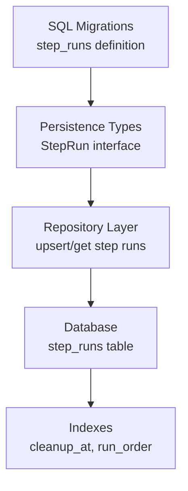
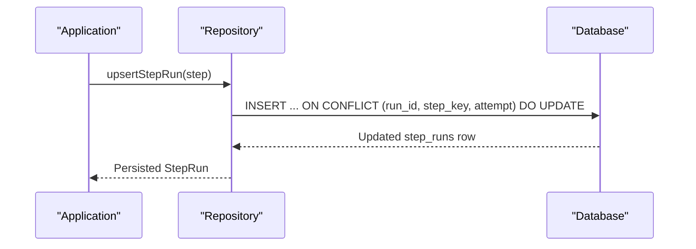
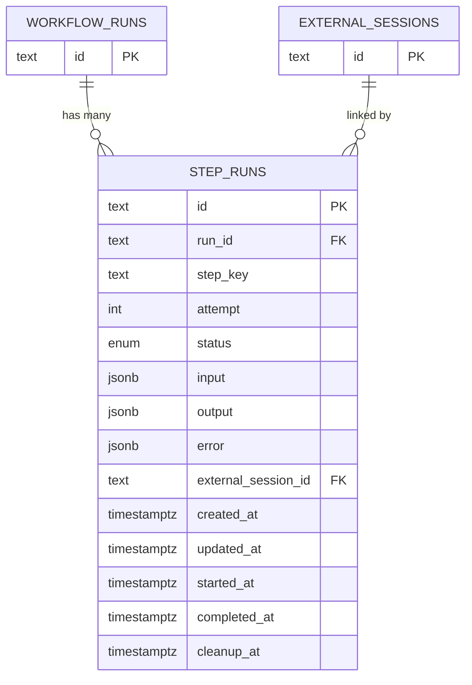
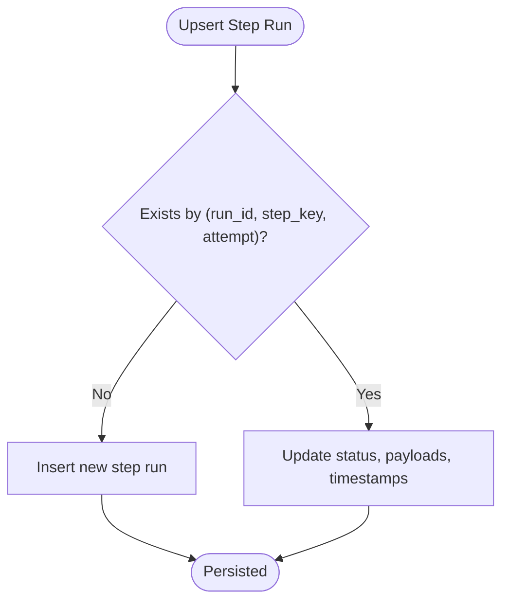
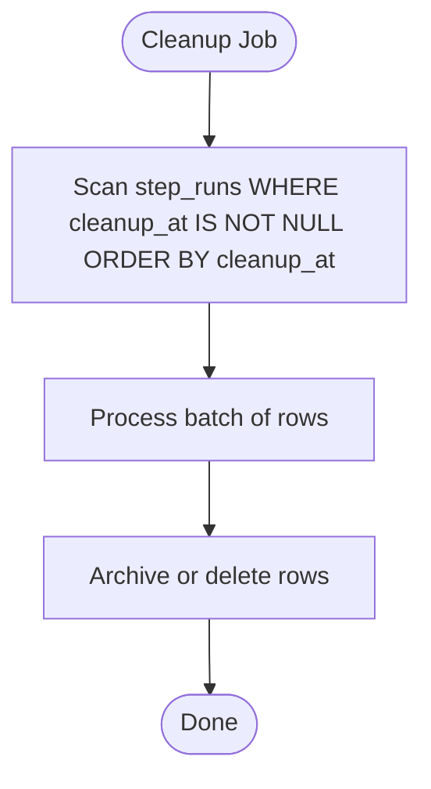
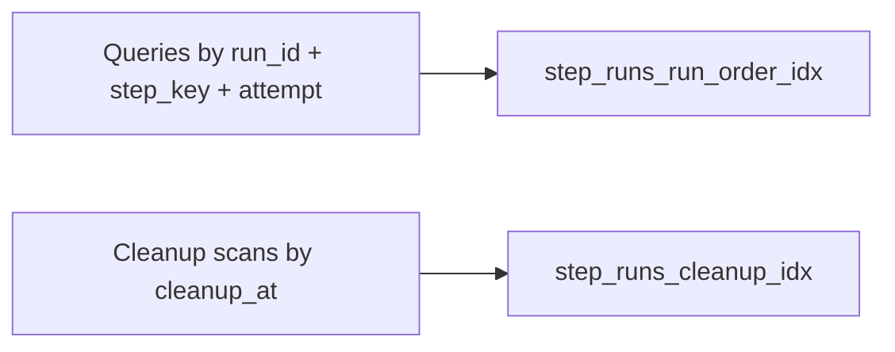
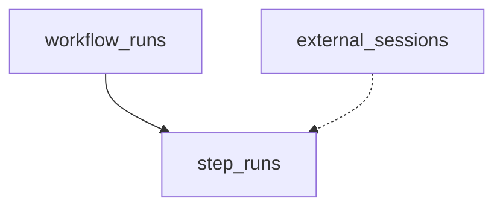
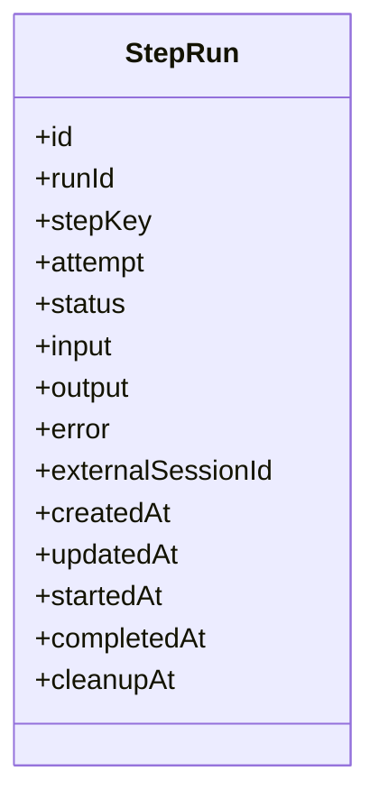
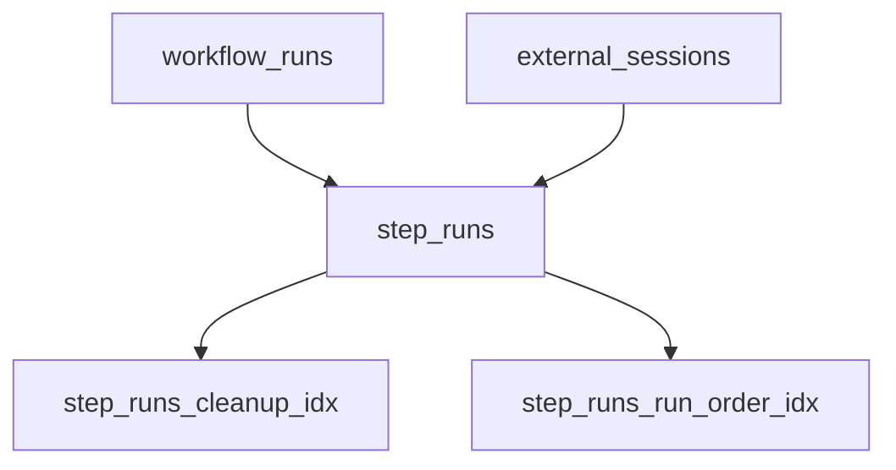

# Step Runs

<cite>
**Referenced Files in This Document**
- [0000_domain_persistence.sql](file://drizzle/0000_domain_persistence.sql)
- [0001_link_step_sessions.sql](file://drizzle/0001_link_step_sessions.sql)
- [persistence.ts](file://packages/core/src/persistence.ts)
- [neon-repository.ts](file://packages/adapters/src/persistence/neon-repository.ts)
- [in-memory.ts](file://packages/adapters/src/persistence/in-memory.ts)
- [row-mapping.ts](file://packages/adapters/src/persistence/row-mapping.ts)
</cite>

## Table of Contents
1. [Introduction](#introduction)
2. [Project Structure](#project-structure)
3. [Core Components](#core-components)
4. [Architecture Overview](#architecture-overview)
5. [Detailed Component Analysis](#detailed-component-analysis)
6. [Dependency Analysis](#dependency-analysis)
7. [Performance Considerations](#performance-considerations)
8. [Troubleshooting Guide](#troubleshooting-guide)
9. [Conclusion](#conclusion)

## Introduction
This document describes the data model for step runs, which represent individual workflow execution steps. It focuses on the step_runs table schema, its relationships to workflow runs and external sessions, retry handling via unique constraints, cleanup scheduling through timestamps, and indexing strategies that support efficient queries for history, error analysis, and performance monitoring.

## Project Structure
The step run data model is defined in database migrations and enforced by application persistence layers:
- Database schema and constraints are defined in SQL migrations.
- Application types define the shape of step runs used across the system.
- Persistence adapters implement upserts, reads, and mapping between database rows and domain objects.

**Diagram sources**
- [0000_domain_persistence.sql:129-146](file://drizzle/0000_domain_persistence.sql#L129-L146)
- [persistence.ts:245-260](file://packages/core/src/persistence.ts#L245-L260)
- [neon-repository.ts:772-798](file://packages/adapters/src/persistence/neon-repository.ts#L772-L798)

**Section sources**
- [0000_domain_persistence.sql:129-146](file://drizzle/0000_domain_persistence.sql#L129-L146)
- [persistence.ts:245-260](file://packages/core/src/persistence.ts#L245-L260)

## Core Components
- step_runs table stores each attempt of a step within a workflow run.
- Key fields include identifiers, status, input/output/error payloads, lifecycle timestamps, and optional linkage to an external session.
- Relationships:
  - run_id references workflow_runs (cascade delete).
  - external_session_id references external_sessions (set null on delete).
- Constraints:
  - Unique constraint on (run_id, step_key, attempt) ensures one row per step attempt per run.
  - Attempt must be positive.
- Indexes:
  - Cleanup index on cleanup_at for scheduled retention.
  - Run order index on (run_id, step_key collate "C", attempt) supports ordered retrieval of attempts.

**Section sources**
- [0000_domain_persistence.sql:129-146](file://drizzle/0000_domain_persistence.sql#L129-L146)
- [0000_domain_persistence.sql:203-205](file://drizzle/0000_domain_persistence.sql#L203-L205)
- [0001_link_step_sessions.sql:1-1](file://drizzle/0001_link_step_sessions.sql#L1-L1)
- [0000_domain_persistence.sql:213-213](file://drizzle/0000_domain_persistence.sql#L213-L213)
- [meta snapshots: step_runs_run_order_idx:1389-1415](file://drizzle/meta/0005_snapshot.json#L1389-L1415)

## Architecture Overview
The step run lifecycle flows through application code into the repository layer, which persists updates using an upsert strategy keyed by (run_id, step_key, attempt). The database enforces referential integrity and provides indexes for efficient querying.

**Diagram sources**
- [neon-repository.ts:772-798](file://packages/adapters/src/persistence/neon-repository.ts#L772-L798)
- [0000_domain_persistence.sql:129-146](file://drizzle/0000_domain_persistence.sql#L129-L146)

## Detailed Component Analysis

### Data Model: step_runs
- id: Primary key identifying the step run.
- run_id: Foreign key to workflow_runs; cascade delete ensures orphan removal.
- step_key: Logical identifier for the step within a run.
- attempt: Positive integer indicating the retry attempt number.
- status: Enumerated state such as pending, running, waiting, succeeded, failed, cancelled.
- input, output, error: Optional JSONB fields capturing payload and failure details.
- external_session_id: Optional foreign key to external_sessions; set null on delete to preserve step run records when sessions are removed.
- created_at, updated_at: Lifecycle timestamps managed by the persistence layer.
- started_at, completed_at: Execution timing markers.
- cleanup_at: Scheduled timestamp for archival or deletion by background jobs.

**Diagram sources**
- [0000_domain_persistence.sql:129-146](file://drizzle/0000_domain_persistence.sql#L129-L146)
- [0000_domain_persistence.sql:203-205](file://drizzle/0000_domain_persistence.sql#L203-L205)
- [0001_link_step_sessions.sql:1-1](file://drizzle/0001_link_step_sessions.sql#L1-L1)

**Section sources**
- [0000_domain_persistence.sql:129-146](file://drizzle/0000_domain_persistence.sql#L129-L146)
- [0000_domain_persistence.sql:203-205](file://drizzle/0000_domain_persistence.sql#L203-L205)
- [0001_link_step_sessions.sql:1-1](file://drizzle/0001_link_step_sessions.sql#L1-L1)

### Retry Handling and Uniqueness
- The unique constraint on (run_id, step_key, attempt) guarantees exactly one record per step attempt within a run.
- Upserts update existing attempts with new status, payloads, and timestamps while preserving identity.
- This design enables reliable retries without duplication and supports incremental progress tracking.

**Diagram sources**
- [neon-repository.ts:772-798](file://packages/adapters/src/persistence/neon-repository.ts#L772-L798)
- [0000_domain_persistence.sql:129-146](file://drizzle/0000_domain_persistence.sql#L129-L146)

**Section sources**
- [neon-repository.ts:772-798](file://packages/adapters/src/persistence/neon-repository.ts#L772-L798)
- [0000_domain_persistence.sql:129-146](file://drizzle/0000_domain_persistence.sql#L129-L146)

### Cleanup Timestamp Management
- cleanup_at marks when a step run becomes eligible for archival or deletion.
- An index filters rows where cleanup_at is not null to optimize cleanup jobs.
- Background processes can efficiently scan and remove or archive expired records.

**Diagram sources**
- [0000_domain_persistence.sql:213-213](file://drizzle/0000_domain_persistence.sql#L213-L213)

**Section sources**
- [0000_domain_persistence.sql:213-213](file://drizzle/0000_domain_persistence.sql#L213-L213)

### Indexing Strategy
- step_runs_cleanup_idx: Partial index on cleanup_at for non-null values to accelerate cleanup operations.
- step_runs_run_order_idx: Composite index on (run_id, step_key collate "C", attempt) to efficiently retrieve attempts in deterministic order per step within a run.

**Diagram sources**
- [0000_domain_persistence.sql:213-213](file://drizzle/0000_domain_persistence.sql#L213-L213)
- [meta snapshots: step_runs_run_order_idx:1389-1415](file://drizzle/meta/0005_snapshot.json#L1389-L1415)

**Section sources**
- [0000_domain_persistence.sql:213-213](file://drizzle/0000_domain_persistence.sql#L213-L213)
- [meta snapshots: step_runs_run_order_idx:1389-1415](file://drizzle/meta/0005_snapshot.json#L1389-L1415)

### Relationship to Workflow Runs and External Sessions
- Each step run belongs to a workflow run via run_id; deleting a workflow run cascades to step runs.
- Optional linkage to external sessions via external_session_id allows associating provider sessions with step executions; deletions set the reference to null to preserve step run history.

**Diagram sources**
- [0000_domain_persistence.sql:203-205](file://drizzle/0000_domain_persistence.sql#L203-L205)
- [0001_link_step_sessions.sql:1-1](file://drizzle/0001_link_step_sessions.sql#L1-L1)

**Section sources**
- [0000_domain_persistence.sql:203-205](file://drizzle/0000_domain_persistence.sql#L203-L205)
- [0001_link_step_sessions.sql:1-1](file://drizzle/0001_link_step_sessions.sql#L1-L1)

### Application Types and Mapping
- The StepRun type defines the canonical structure used throughout the application, including status, payloads, and timestamps.
- Repository implementations map database rows to StepRun instances and handle optional JSONB fields safely.

**Diagram sources**
- [persistence.ts:245-260](file://packages/core/src/persistence.ts#L245-L260)
- [row-mapping.ts:130-130](file://packages/adapters/src/persistence/row-mapping.ts#L130-L130)

**Section sources**
- [persistence.ts:245-260](file://packages/core/src/persistence.ts#L245-L260)
- [row-mapping.ts:130-130](file://packages/adapters/src/persistence/row-mapping.ts#L130-L130)

## Dependency Analysis
- step_runs depends on workflow_runs via foreign key; cascade delete maintains consistency.
- Optional dependency on external_sessions via foreign key; set null on delete preserves step run records.
- Indexes create dependencies on column values and expressions (collation) to support specific query patterns.

**Diagram sources**
- [0000_domain_persistence.sql:203-205](file://drizzle/0000_domain_persistence.sql#L203-L205)
- [0001_link_step_sessions.sql:1-1](file://drizzle/0001_link_step_sessions.sql#L1-L1)
- [0000_domain_persistence.sql:213-213](file://drizzle/0000_domain_persistence.sql#L213-L213)
- [meta snapshots: step_runs_run_order_idx:1389-1415](file://drizzle/meta/0005_snapshot.json#L1389-L1415)

**Section sources**
- [0000_domain_persistence.sql:203-205](file://drizzle/0000_domain_persistence.sql#L203-L205)
- [0001_link_step_sessions.sql:1-1](file://drizzle/0001_link_step_sessions.sql#L1-L1)
- [0000_domain_persistence.sql:213-213](file://drizzle/0000_domain_persistence.sql#L213-L213)
- [meta snapshots: step_runs_run_order_idx:1389-1415](file://drizzle/meta/0005_snapshot.json#L1389-L1415)

## Performance Considerations
- Use the composite index (run_id, step_key collate "C", attempt) to efficiently list attempts in deterministic order for UI timelines and debugging.
- Leverage the partial cleanup index to minimize scanning overhead during retention jobs.
- Keep JSONB payloads concise; consider indexing frequently queried attributes if needed at higher layers.
- Prefer upserts keyed by (run_id, step_key, attempt) to avoid duplicate writes and ensure idempotent updates.

[No sources needed since this section provides general guidance]

## Troubleshooting Guide
- Duplicate step run errors: Ensure your insert logic uses the unique key (run_id, step_key, attempt); rely on upsert semantics to update existing attempts.
- Missing external session linkage: If external_sessions are deleted, step_runs.external_session_id will be set to null; verify application logic handles null gracefully.
- Cleanup not occurring: Confirm cleanup_at is set appropriately and that cleanup jobs target rows where cleanup_at is not null.
- Slow queries: Verify queries use available indexes; for ordering attempts, filter by run_id and sort by step_key and attempt.

**Section sources**
- [neon-repository.ts:772-798](file://packages/adapters/src/persistence/neon-repository.ts#L772-L798)
- [0000_domain_persistence.sql:213-213](file://drizzle/0000_domain_persistence.sql#L213-L213)

## Conclusion
The step_runs table provides a robust foundation for tracking individual workflow step executions, supporting retries, detailed payloads, lifecycle timing, and cleanup scheduling. Proper use of unique constraints and indexes ensures consistent, efficient access for history, error analysis, and performance monitoring.

[No sources needed since this section summarizes without analyzing specific files]